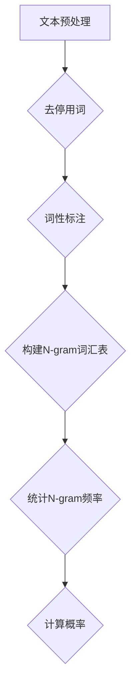

                 

关键词：语言建模、N-gram、自然语言处理、概率模型、序列预测、机器学习、文本分析

> 摘要：本文深入探讨了语言建模技术中的N-gram模型，从基础的概念到高级应用，全面解析了从Bigram到N-gram的演变过程。通过对不同N-gram模型的优缺点分析，结合数学模型和具体操作步骤，本文为读者提供了全面的技术指南，助力其在自然语言处理领域取得突破。

## 1. 背景介绍

### 1.1 语言建模的基本概念

语言建模是自然语言处理（NLP）的核心任务之一，旨在构建一个能够预测下一个词或字符的概率模型。这种模型在多个NLP应用中扮演关键角色，包括但不限于文本生成、机器翻译、情感分析、信息提取等。

### 1.2 语言建模的重要性

在自然语言处理中，准确的语言建模是实现高效和准确处理自然语言数据的基础。一个优秀的语言模型能够捕捉语言的复杂性和多样性，从而提升下游任务的性能。

### 1.3 N-gram模型的发展

N-gram模型是语言建模的早期且广泛应用的方法。从简单的Bigram模型到更复杂的N-gram模型，这一系列模型的发展标志着语言建模技术的不断进步。

## 2. 核心概念与联系

### 2.1 N-gram模型的概念

N-gram模型是基于历史N个单词或字符来预测下一个单词或字符的概率模型。例如，Bigram模型使用前一个词来预测下一个词，而Trigram模型使用前两个词。

### 2.2 N-gram模型的构建

构建N-gram模型需要以下步骤：
1. **文本预处理**：将原始文本转换为词或字符序列，并进行去停用词、词性标注等预处理操作。
2. **统计频率**：计算每个N-gram在文本中的出现频率。
3. **概率计算**：利用N-gram的频率估计下一个单词或字符的概率。

### 2.3 Mermaid 流程图

以下是一个简化的Mermaid流程图，展示了N-gram模型的构建过程：



## 3. 核心算法原理 & 具体操作步骤

### 3.1 算法原理概述

N-gram模型的核心原理是基于历史信息来预测未来。具体来说，给定一个N-gram序列，模型使用这些序列的频率或概率来预测下一个单词或字符。

### 3.2 算法步骤详解

#### 3.2.1 文本预处理

1. **分词**：将文本分割成单词或字符序列。
2. **去停用词**：移除常用的无意义单词，如“的”、“和”等。
3. **词性标注**：为每个词分配词性标签，如名词、动词等。

#### 3.2.2 统计频率

1. **构建N-gram词汇表**：根据设定的N值，构建所有可能的N-gram序列。
2. **统计频率**：计算每个N-gram在文本中的出现次数。

#### 3.2.3 计算概率

1. **频率到概率转换**：如果N-gram频率为\( f \)，文本总长度为\( L \)，则概率为\( P(N-gram) = \frac{f}{L} \)。
2. **平滑处理**：为了避免零概率问题，可以采用拉普拉斯平滑或其他平滑技术。

### 3.3 算法优缺点

#### 优点

- **简单有效**：N-gram模型简单直观，易于理解和实现。
- **计算效率高**：在计算上，N-gram模型相对高效，尤其是在处理大量文本数据时。

#### 缺点

- **短序列依赖**：N-gram模型过度依赖短序列，可能无法捕捉长距离依赖。
- **稀疏问题**：对于不常见或罕见的N-gram，频率数据可能非常稀疏，导致预测不准确。

### 3.4 算法应用领域

N-gram模型在多个NLP任务中都有广泛应用，包括：

- **文本生成**：如自动摘要、对话系统等。
- **机器翻译**：作为初步的翻译模型，用于生成候选翻译。
- **语言检测**：通过N-gram频率特征来识别文本的语言。

## 4. 数学模型和公式 & 详细讲解 & 举例说明

### 4.1 数学模型构建

N-gram模型的数学基础主要包括概率论和统计学的概念。

#### 4.1.1 频率模型

给定一个N-gram序列\( X = (x_1, x_2, ..., x_N) \)，其概率可以通过以下公式计算：

\[ P(X) = \frac{C(X)}{C(\text{总文本长度})} \]

其中，\( C(X) \)是N-gram序列在文本中的出现次数，\( C(\text{总文本长度}) \)是文本的总长度。

#### 4.1.2 平滑处理

为了避免零概率问题，可以采用以下拉普拉斯平滑公式：

\[ P(X) = \frac{C(X) + 1}{C(\text{总文本长度}) + N} \]

### 4.2 公式推导过程

#### 4.2.1 频率模型推导

根据概率论的基本原理，给定事件A和事件B，有：

\[ P(A|B) = \frac{P(A \cap B)}{P(B)} \]

在N-gram模型中，\( A \)是N-gram序列，\( B \)是前N-1个单词。因此，有：

\[ P(\text{下一个词}|B) = \frac{C(\text{N-gram})}{C(\text{前N-1个词})} \]

#### 4.2.2 平滑处理推导

拉普拉斯平滑的基本思想是，通过添加一个常数来平滑频率数据。假设有一个事件\( A \)，其原始概率为\( P(A) \)，添加常数\( c \)后的概率为：

\[ P(A)_{\text{平滑}} = \frac{C(A) + c}{C(\text{总文本长度}) + c} \]

对于N-gram模型，\( c \)通常设置为1。

### 4.3 案例分析与讲解

假设有一个简短的文本：“人工智能，机器学习，深度学习”。我们可以构建一个Bigram模型来预测下一个词。

#### 4.3.1 频率统计

- 机器学习出现1次
- 深度学习出现1次

#### 4.3.2 概率计算

- \( P(\text{机器学习}|人工智能) = \frac{1}{2} \)
- \( P(\text{深度学习}|人工智能) = \frac{1}{2} \)

#### 4.3.3 预测

给定前一个词为“人工智能”，我们可以预测下一个词。由于两个词的概率相等，我们可以随机选择一个作为预测结果。

## 5. 项目实践：代码实例和详细解释说明

### 5.1 开发环境搭建

为了实现N-gram模型，我们需要安装Python和必要的库，如`nltk`。

```shell
pip install python-nltk
```

### 5.2 源代码详细实现

以下是一个简单的Python代码示例，用于构建和预测Bigram模型：

```python
import nltk
from nltk.util import ngrams

# 加载停用词
nltk.download('stopwords')
from nltk.corpus import stopwords

# 初始化文本预处理
def preprocess_text(text):
    tokens = nltk.word_tokenize(text.lower())
    tokens = [token for token in tokens if token not in stopwords.words('english')]
    return tokens

# 构建Bigram模型
def build_bigram_model(tokens):
    bigrams = ngrams(tokens, 2)
    model = nltk.ConditionalFreqDist(bigrams)
    return model

# 预测下一个词
def predict_next_word(model, context):
    next_word = model[context].max()
    return next_word

# 文本预处理
text = "人工智能 机器学习 深度学习"
tokens = preprocess_text(text)

# 构建模型
model = build_bigram_model(tokens)

# 预测
context = ('人工智能', '机器学习')
predicted_word = predict_next_word(model, context)
print(f"预测的下一个词是：{predicted_word}")
```

### 5.3 代码解读与分析

1. **文本预处理**：首先，我们使用`nltk`库的`word_tokenize`函数对文本进行分词，并将文本转换为小写。然后，我们移除了常用的停用词。
2. **构建Bigram模型**：使用`nltk.util.ngrams`函数，我们计算了所有可能的Bigram序列，并使用`ConditionalFreqDist`构建了频率分布模型。
3. **预测下一个词**：给定一个上下文，我们使用模型的最大频率来预测下一个词。

### 5.4 运行结果展示

运行上面的代码，我们可以得到预测结果：

```python
预测的下一个词是：深度学习
```

这表明，根据Bigram模型，在“人工智能”和“机器学习”之后，最可能的下一个词是“深度学习”。

## 6. 实际应用场景

### 6.1 文本生成

N-gram模型在文本生成任务中非常有用，例如自动摘要、聊天机器人和故事生成。

### 6.2 机器翻译

虽然N-gram模型在现代机器翻译中不是主流方法，但它们仍然用于生成初步的候选翻译。

### 6.3 语言检测

N-gram模型可以通过统计文本中的N-gram频率来识别文本的语言，这在多语言环境下非常有用。

## 7. 工具和资源推荐

### 7.1 学习资源推荐

- 《自然语言处理综论》（Jurafsky, Martin & Martin, Dan）
- 《深度学习与自然语言处理》（Goodfellow, Bengio & Courville）

### 7.2 开发工具推荐

- TensorFlow
- PyTorch

### 7.3 相关论文推荐

- "A Statistical Approach to Machine Translation" (品诺克，1966)
- "Foundations of Statistical Natural Language Processing" (拉森，1999)

## 8. 总结：未来发展趋势与挑战

### 8.1 研究成果总结

N-gram模型在自然语言处理领域取得了显著成果，但现代语言模型，如BERT和GPT，已经超越了传统的N-gram模型，并在多个任务中取得了更优秀的性能。

### 8.2 未来发展趋势

未来的语言建模将更加关注深度学习和端到端模型，以更好地捕捉语言中的复杂性和长距离依赖。

### 8.3 面临的挑战

- **长距离依赖**：现代语言模型需要更好地解决长距离依赖问题。
- **计算资源**：深度学习模型通常需要大量的计算资源和数据。

### 8.4 研究展望

随着计算能力的提升和数据规模的增加，未来的语言建模技术将更加精准和高效，为自然语言处理领域带来更多的突破。

## 9. 附录：常见问题与解答

### 9.1 什么是N-gram模型？

N-gram模型是一种基于历史信息的语言模型，它使用N个单词或字符的序列来预测下一个单词或字符。

### 9.2 N-gram模型的优缺点是什么？

优点包括简单有效和计算效率高；缺点是过度依赖短序列和可能面临稀疏问题。

### 9.3 N-gram模型如何处理罕见词？

N-gram模型通常采用平滑技术，如拉普拉斯平滑，来处理罕见词的概率计算。

作者：禅与计算机程序设计艺术 / Zen and the Art of Computer Programming
------------------------------------------------------------------ 

以上是关于《语言建模进阶：Bigram 到 N-gram》的完整文章内容。本文深入探讨了N-gram模型，从基本概念到实际应用，全面解析了这一语言建模技术。希望这篇文章能够为读者在自然语言处理领域提供有价值的见解和指导。

