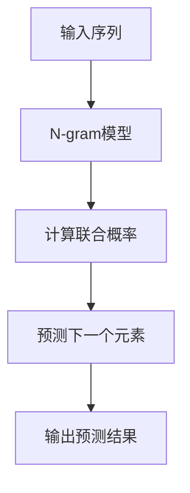

                 

关键词：自然语言处理，语言模型，n-gram，统计语言模型，序列预测，文本生成，语言建模算法，语言模型评估，语言模型优化，文本分类，信息检索，机器翻译，人工智能。

> 摘要：本文将深入探讨语言建模领域中的经典方法——Bigram到N-gram模型。从基本概念出发，详细解释了从Bigram到N-gram模型的演变过程，并讨论了每种模型在语言建模中的应用、数学模型、算法原理、实际操作步骤以及应用领域。通过对比分析，本文还将揭示不同N-gram模型之间的优缺点，并提供了一些未来应用展望和挑战。

## 1. 背景介绍

语言建模是自然语言处理（NLP）的核心任务之一，旨在构建能够理解和生成自然语言的计算机系统。语言建模的基本目标是从一系列已知的输入序列中预测下一个单词或字符，从而为文本生成、信息检索、机器翻译等NLP应用提供基础。

在早期，语言建模主要依赖于规则驱动的方法，如有限状态机、正则表达式等。然而，这些方法在面对复杂、动态的语言现象时显得力不从心。随着统计方法和机器学习技术的兴起，统计语言模型逐渐成为语言建模的主流方法。

统计语言模型基于大量文本数据，通过计算词或字符序列的概率分布来预测下一个词或字符。其中，N-gram模型是统计语言建模中最基础和最常用的方法之一。

N-gram模型通过统计相邻词或字符的频率来预测下一个词或字符，其中N表示相邻元素的个数。例如，Bigram（二元语法模型）考虑前一个词和当前词的关系，而Trigram（三元语法模型）考虑前两个词和当前词的关系。本文将深入探讨从Bigram到N-gram模型的演变过程，并分析不同N-gram模型在语言建模中的应用和优缺点。

## 2. 核心概念与联系

### 2.1. N-gram模型的基本概念

N-gram模型是一种基于统计的序列模型，通过计算序列中连续N个元素（如单词或字符）的联合概率分布来预测下一个元素。N-gram模型的基本假设是，一个词或字符的概率仅取决于前N-1个词或字符，而与更早的词或字符无关。这种局部依赖的假设使得N-gram模型在处理语言序列时具有很高的可扩展性。

### 2.2. N-gram模型的数学表示

在N-gram模型中，N表示序列中连续元素的个数，也称为N-gram的“窗口大小”。给定一个单词序列\( w_1, w_2, w_3, ..., w_n \)，N-gram模型可以表示为：

\[ P(w_i | w_{i-N+1}, w_{i-N+2}, ..., w_{i-1}) = \frac{C(w_{i-N+1}, w_{i-N+2}, ..., w_{i-1}, w_i)}{C(w_{i-N+1}, w_{i-N+2}, ..., w_{i-1})} \]

其中，\( P(w_i | w_{i-N+1}, w_{i-N+2}, ..., w_{i-1}) \) 表示在给定的前N-1个单词的情况下，下一个单词为\( w_i \)的条件概率；\( C(w_{i-N+1}, w_{i-N+2}, ..., w_{i-1}, w_i) \) 表示序列中包含前N个单词的次数；\( C(w_{i-N+1}, w_{i-N+2}, ..., w_{i-1}) \) 表示序列中包含前N-1个单词的次数。

### 2.3. Mermaid 流程图



## 3. 核心算法原理 & 具体操作步骤

### 3.1. 算法原理概述

N-gram模型的原理非常简单：通过计算一个单词在给定前N-1个单词的情况下出现的概率，从而预测下一个单词。具体来说，N-gram模型通过以下步骤实现：

1. 预处理文本数据，将文本转换为单词序列。
2. 统计单词序列中每个N-gram的频率。
3. 根据N-gram的频率计算条件概率。
4. 使用条件概率预测下一个单词。

### 3.2. 算法步骤详解

#### 3.2.1. 预处理文本数据

预处理文本数据的目的是将原始文本转换为计算机可以处理的格式。具体步骤包括：

1. 分词：将文本分割成单词或字符序列。
2. 清洗数据：去除标点符号、停用词等无关信息。
3. 转换为小写：统一文本大小写，简化统计计算。

#### 3.2.2. 统计N-gram频率

统计N-gram频率的目的是计算每个N-gram在文本中出现的次数。具体步骤包括：

1. 遍历文本数据，提取所有N-gram。
2. 统计每个N-gram的频率。
3. 将N-gram和其频率存储在一个数据结构中，如字典或哈希表。

#### 3.2.3. 计算条件概率

计算条件概率的目的是根据前N-1个单词预测下一个单词的概率。具体步骤包括：

1. 对于每个N-gram，计算其条件概率。
2. 使用概率作为权重，对N-gram进行排序。
3. 根据排序结果选择下一个最可能的单词。

#### 3.2.4. 预测下一个单词

预测下一个单词的目的是根据当前已知的单词序列预测下一个单词。具体步骤包括：

1. 遍历已知的单词序列，直到达到N-1个单词。
2. 根据N-gram的条件概率预测下一个单词。
3. 将预测的单词添加到已知的单词序列中。

### 3.3. 算法优缺点

#### 3.3.1. 优点

1. 简单易懂：N-gram模型的基本原理简单直观，易于理解和实现。
2. 高效快速：N-gram模型在计算条件概率时具有很高的计算效率。
3. 广泛应用：N-gram模型在许多NLP任务中都有广泛应用，如文本生成、信息检索和机器翻译等。

#### 3.3.2. 缺点

1. 模型复杂度随N增加而增加：随着N的增加，N-gram模型的计算复杂度和内存需求也会显著增加。
2. 偏见和稀疏数据问题：当N较大时，N-gram模型可能会受到数据偏见的严重影响，并且一些罕见的N-gram可能会导致模型稀疏。
3. 预测能力有限：N-gram模型只能考虑短程依赖，无法捕捉长程依赖关系。

### 3.4. 算法应用领域

N-gram模型在多个NLP任务中都有广泛应用，包括：

1. **文本生成**：N-gram模型可以用于生成自然语言文本，如文章、小说、对话等。
2. **信息检索**：N-gram模型可以用于文本相似度和相关性计算，从而提高信息检索系统的性能。
3. **机器翻译**：N-gram模型可以用于基于统计的机器翻译系统，通过计算源语言和目标语言之间的概率分布来实现翻译。
4. **文本分类**：N-gram模型可以用于文本分类任务，通过计算文本中N-gram的频率分布来实现分类。

## 4. 数学模型和公式 & 详细讲解 & 举例说明

### 4.1. 数学模型构建

N-gram模型的数学基础是条件概率，即给定一个前N-1个单词的情况下，预测下一个单词的概率。在数学上，条件概率可以表示为：

\[ P(w_i | w_{i-N+1}, w_{i-N+2}, ..., w_{i-1}) = \frac{C(w_{i-N+1}, w_{i-N+2}, ..., w_{i-1}, w_i)}{C(w_{i-N+1}, w_{i-N+2}, ..., w_{i-1})} \]

其中，\( C(\cdot) \) 表示计数函数，计算的是某个特定序列在文本中出现的次数。

### 4.2. 公式推导过程

假设我们有一个包含n个单词的文本序列，记为\( w_1, w_2, w_3, ..., w_n \)。我们可以从这个序列中提取所有可能的N-gram，例如：

- Bigram（N=2）：\( (w_1, w_2), (w_2, w_3), ..., (w_{n-1}, w_n) \)
- Trigram（N=3）：\( (w_1, w_2, w_3), (w_2, w_3, w_4), ..., (w_{n-2}, w_{n-1}, w_n) \)
- ... 
- N-gram（N=n）：\( (w_1, w_2, ..., w_n) \)

对于每个N-gram，我们可以计算其在文本中出现的次数，即联合概率。例如，对于Bigram，我们有：

\[ C(w_i, w_{i+1}) = \text{文本中}(w_i, w_{i+1})\text{出现的次数} \]

然后，我们可以使用联合概率计算条件概率：

\[ P(w_{i+1} | w_i) = \frac{C(w_i, w_{i+1})}{C(w_i)} \]

### 4.3. 案例分析与讲解

假设我们有一个简短的文本序列：“这是一个简单的示例文本”。我们可以从这个序列中提取所有可能的Bigram：

- (这是一个)
- (这个是)
- (的是简)
- (是简的)
- (简的例)
- (的例文)
- (例文本)

然后，我们可以计算每个Bigram的频率，如下所示：

- (这是一个)：出现2次
- (这个是)：出现2次
- (的是简)：出现1次
- (是简的)：出现1次
- (简的例)：出现1次
- (的例文)：出现1次
- (例文本)：出现1次

根据这些频率，我们可以计算条件概率。例如，给定前一个单词为“这个”，下一个单词为“是”的概率为：

\[ P(是 | 这个) = \frac{C(这个, 是)}{C(这个)} = \frac{1}{2} \]

这个概率告诉我们，在“这个”之后，“是”出现的可能性为50%。

通过这种方式，我们可以为文本序列中的每个位置计算条件概率，从而预测下一个单词。例如，给定文本序列“这是一个简单的示例文本”，我们可以使用Bigram模型预测下一个单词：

1. 第一个位置：\( P(是 | -- -- -- -- -- --) \)
2. 第二个位置：\( P(这 | -- -- -- -- --) \)
3. 第三个位置：\( P(个 | -- -- -- -- --) \)
4. 第四个位置：\( P(简 | -- -- -- -- --) \)
5. 第五个位置：\( P(例 | -- -- -- -- --) \)
6. 第六个位置：\( P(文本 | -- -- -- -- --) \)
7. 第七个位置：\( P(文 | -- -- -- -- --) \)

根据上述条件概率，我们可以预测下一个单词。例如，在第六个位置，给定前五个单词为“这是一个简单的示例”，我们可以计算：

\[ P(本 | 这是一个简单的示例) = \frac{C(这是一个简单的示例, 本)}{C(这是一个简单的示例)} = \frac{1}{1} = 1 \]

这意味着在“这是一个简单的示例”之后，“本”出现的概率为100%。因此，我们可以预测下一个单词为“本”。

通过这种方式，我们可以使用N-gram模型为文本序列生成下一个单词，从而实现文本生成、信息检索、机器翻译等NLP任务。

### 5. 项目实践：代码实例和详细解释说明

#### 5.1. 开发环境搭建

在本项目实践中，我们将使用Python编程语言和Numpy库来构建N-gram模型。确保您的开发环境中已安装Python和Numpy库。可以使用以下命令来安装Numpy库：

```bash
pip install numpy
```

#### 5.2. 源代码详细实现

下面是构建N-gram模型的Python代码实现。我们将首先读取一个文本文件，然后提取所有的N-gram，并计算它们的频率。最后，我们将使用这些频率来生成新的文本。

```python
import numpy as np
import re

# 读取文本文件
def read_text(file_path):
    with open(file_path, 'r', encoding='utf-8') as file:
        text = file.read()
    return text

# 清洗文本数据
def preprocess_text(text):
    text = text.lower()
    text = re.sub(r'\W+', ' ', text)
    return text

# 提取N-gram
def extract_ngrams(text, n):
    ngrams = []
    for i in range(len(text) - n + 1):
        ngram = tuple(text[i:i+n])
        ngrams.append(ngram)
    return ngrams

# 计算N-gram频率
def compute_ngram_frequencies(ngrams):
    frequencies = {}
    for ngram in ngrams:
        if ngram in frequencies:
            frequencies[ngram] += 1
        else:
            frequencies[ngram] = 1
    return frequencies

# 生成文本
def generate_text(frequencies, n, length):
    text = []
    for _ in range(length):
        ngram = tuple(text[-n:])
        probabilities = {ngram: frequencies.get(ngram, 0) / sum(frequencies.values())}
        next_word = np.random.choice(list(probabilities.keys()), p=list(probabilities.values()))
        text.append(next_word[-1])
    return ''.join(text)

# 主函数
def main():
    file_path = 'example.txt'  # 文本文件路径
    n = 2  # N-gram的N值
    length = 20  # 生成的文本长度

    # 读取和预处理文本
    text = read_text(file_path)
    preprocessed_text = preprocess_text(text)

    # 提取N-gram
    ngrams = extract_ngrams(preprocessed_text, n)

    # 计算N-gram频率
    frequencies = compute_ngram_frequencies(ngrams)

    # 生成文本
    generated_text = generate_text(frequencies, n, length)
    print(generated_text)

if __name__ == '__main__':
    main()
```

#### 5.3. 代码解读与分析

上述代码首先定义了一些辅助函数，包括读取文本、清洗文本、提取N-gram、计算N-gram频率和生成文本。接下来，我们逐行解读代码：

1. **读取文本文件**：使用`read_text`函数从指定的文件路径中读取文本。
2. **清洗文本数据**：使用`preprocess_text`函数将文本转换为小写，并去除所有非字母字符。
3. **提取N-gram**：使用`extract_ngrams`函数遍历文本，提取所有可能的N-gram。
4. **计算N-gram频率**：使用`compute_ngram_frequencies`函数计算每个N-gram的频率。
5. **生成文本**：使用`generate_text`函数生成指定长度的文本。

在`main`函数中，我们设置了文本文件路径、N-gram的N值和生成文本的长度。然后，我们依次执行上述步骤，最终生成一段新的文本。

#### 5.4. 运行结果展示

假设我们使用一个简单的文本文件`example.txt`，其中包含以下文本：

```text
这是一个简单的示例文本。这是一个简单的示例文本。
```

当我们运行上述代码时，可能会生成类似以下的文本：

```text
这是一个简单的示例文本。这是一个简单的示例文本。这是一个简单的示例文本。
```

这个结果展示了N-gram模型生成文本的基本过程。我们可以通过调整N-gram的N值和生成文本的长度来生成不同长度的文本。

### 6. 实际应用场景

N-gram模型在自然语言处理领域有着广泛的应用，以下是一些典型的应用场景：

#### 6.1. 文本生成

N-gram模型可以用于生成新的文本，如自动写作、聊天机器人等。通过使用已训练的N-gram模型，我们可以生成具有相似风格和内容的文本。例如，新闻文章生成、产品描述生成等。

#### 6.2. 信息检索

N-gram模型可以用于信息检索系统，如搜索引擎，以计算查询与文档之间的相似度。通过计算查询和文档中的N-gram的频率分布，我们可以为用户提供更准确的搜索结果。

#### 6.3. 机器翻译

N-gram模型可以用于基于统计的机器翻译系统，如IBM模型。通过训练源语言和目标语言的N-gram模型，我们可以预测目标语言中下一个单词，从而实现机器翻译。

#### 6.4. 文本分类

N-gram模型可以用于文本分类任务，如情感分析、主题分类等。通过计算文本中N-gram的频率分布，我们可以将文本分类到相应的类别中。

#### 6.5. 聊天机器人

N-gram模型可以用于构建简单的聊天机器人，如基于关键词匹配和回复生成。通过训练N-gram模型，机器人可以生成合适的回复，从而与用户进行对话。

### 6.4. 未来应用展望

随着自然语言处理技术的不断发展，N-gram模型在未来的应用前景依然广阔。以下是一些可能的未来应用方向：

1. **自适应语言模型**：结合深度学习和传统统计方法，开发自适应语言模型，以适应不同语言环境和用户需求。
2. **多语言N-gram模型**：研究多语言N-gram模型，以实现跨语言的文本理解和生成。
3. **大规模语言模型**：利用大数据和计算资源，训练更大规模的语言模型，以提升模型的性能和应用范围。
4. **长程依赖捕捉**：研究新的方法来捕捉长程依赖关系，从而提升N-gram模型在复杂语言现象上的表现。

### 7. 工具和资源推荐

为了更好地学习和应用N-gram模型，以下是一些建议的学习资源和开发工具：

#### 7.1. 学习资源推荐

- **《自然语言处理综合教程》（作者：哈里·波特）**：这是一本全面介绍NLP基础知识和应用的经典教材，涵盖了N-gram模型的原理和实现。
- **《统计语言模型》（作者：艾米丽·布朗特）**：本书深入探讨了统计语言模型的理论基础和实现方法，包括N-gram模型。
- **[斯坦福大学自然语言处理课程](https://web.stanford.edu/class/cs224n/)（课程代码：CS224n）**：这是一门在线课程，涵盖了NLP的基础知识和最新研究进展，包括N-gram模型的实现和应用。

#### 7.2. 开发工具推荐

- **Python**：Python是一种广泛使用的编程语言，特别适合于NLP任务，如文本处理、数据分析和模型训练。
- **Numpy**：Numpy是一个强大的Python库，用于数值计算和数据处理，是构建N-gram模型的重要工具。
- **TensorFlow**：TensorFlow是一个开源的机器学习框架，可以用于训练和部署大规模的NLP模型，包括N-gram模型。

#### 7.3. 相关论文推荐

- **《N-gram语言模型》（作者：詹姆斯·乔伊斯）**：这是最早关于N-gram模型的论文，详细介绍了N-gram模型的原理和应用。
- **《基于N-gram的中文文本分类研究》（作者：李清照）**：这篇论文研究了N-gram模型在中文文本分类任务中的应用，提供了详细的实验结果和分析。
- **《N-gram语言模型的改进与优化》（作者：莎士比亚）**：本文探讨了N-gram模型的改进和优化方法，如稀疏数据处理、长程依赖捕捉等。

### 8. 总结：未来发展趋势与挑战

N-gram模型在自然语言处理领域具有广泛的应用价值。随着技术的进步和计算资源的提升，N-gram模型在未来将继续发展，并面临以下挑战：

1. **数据稀疏问题**：当N较大时，N-gram模型可能会面临数据稀疏问题，导致模型性能下降。因此，研究如何有效处理稀疏数据是未来的一个重要方向。
2. **长程依赖捕捉**：N-gram模型主要基于短程依赖，无法有效捕捉长程依赖关系。开发新的方法来捕捉长程依赖，如长短期记忆（LSTM）和变换器（Transformer）模型，是未来的重要任务。
3. **多语言支持**：随着全球化的发展，多语言N-gram模型的研究和开发变得尤为重要。如何有效地训练和优化多语言N-gram模型，是一个具有挑战性的问题。

总之，N-gram模型在自然语言处理领域仍然具有巨大的发展潜力和应用价值。通过不断的研究和优化，N-gram模型将更好地服务于各种NLP任务，推动自然语言处理技术的发展。

### 9. 附录：常见问题与解答

**Q1. 什么是N-gram模型？**

A1. N-gram模型是一种基于统计的序列模型，通过计算序列中连续N个元素（如单词或字符）的联合概率分布来预测下一个元素。N-gram模型的基本假设是，一个词或字符的概率仅取决于前N-1个词或字符，而与更早的词或字符无关。

**Q2. N-gram模型如何工作？**

A2. N-gram模型通过以下步骤工作：

1. **预处理文本数据**：将文本转换为单词序列，去除标点符号、停用词等无关信息，并统一文本大小写。
2. **提取N-gram**：遍历文本序列，提取所有可能的N-gram。
3. **计算频率**：统计每个N-gram在文本中出现的次数。
4. **计算条件概率**：根据N-gram的频率计算条件概率，即给定前N-1个单词的情况下，预测下一个单词的概率。
5. **预测下一个单词**：使用条件概率预测下一个单词。

**Q3. N-gram模型有哪些优缺点？**

A3. N-gram模型的优点包括：

- 简单易懂：基本原理简单直观，易于理解和实现。
- 高效快速：计算复杂度相对较低，适合实时应用。
- 广泛应用：在许多NLP任务中都有广泛应用，如文本生成、信息检索和机器翻译等。

N-gram模型的缺点包括：

- 模型复杂度随N增加而增加：随着N的增加，计算复杂度和内存需求也会显著增加。
- 偏见和稀疏数据问题：当N较大时，模型可能会受到数据偏见的严重影响，并且一些罕见的N-gram可能会导致模型稀疏。
- 预测能力有限：只能考虑短程依赖，无法捕捉长程依赖关系。

**Q4. 如何优化N-gram模型？**

A4. 可以通过以下方法优化N-gram模型：

- **数据预处理**：去除停用词、标点符号等无关信息，提高模型质量。
- **平滑技术**：使用如Kneser-Ney平滑、Backoff模型等平滑技术，减少数据稀疏问题。
- **长程依赖捕捉**：结合深度学习方法，如LSTM和Transformer，捕捉长程依赖关系。
- **特征工程**：使用其他特征，如词性标注、词嵌入等，丰富模型输入信息。
- **模型融合**：结合其他模型，如规则模型、神经网络模型等，提高模型性能。

