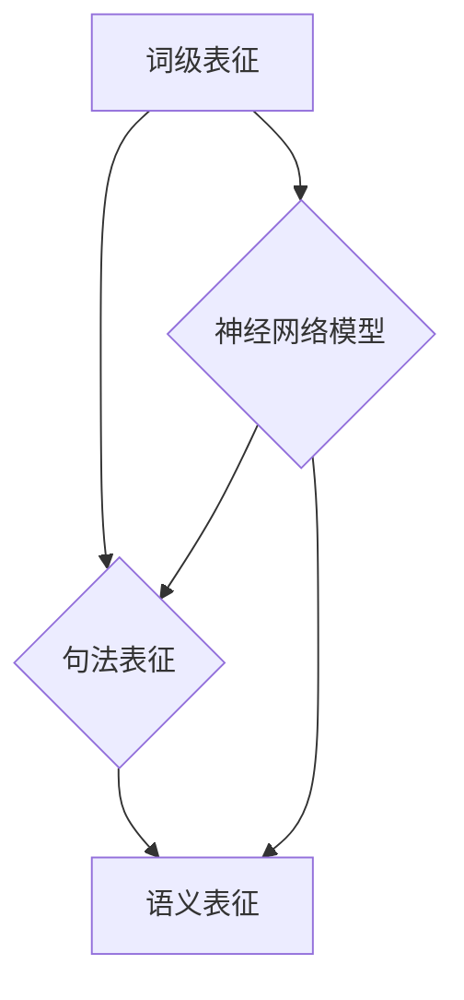

                 

关键词：自然语言处理、语言表征、神经网络、语义理解、计算机视觉、深度学习

> 摘要：本文旨在探讨语言表征的本质，深入分析自然语言处理领域中语言表征的各种方法和模型，结合数学模型和算法，从理论到实践全方位解析语言表征的核心技术，并展望其在未来应用中的发展趋势。

## 1. 背景介绍

在当今的数字时代，自然语言处理（Natural Language Processing，NLP）已经成为计算机科学和人工智能领域的重要分支。从搜索引擎到语音助手，从机器翻译到情感分析，自然语言处理技术正逐步改变我们的生活方式。然而，NLP的核心挑战之一就是如何准确、高效地理解和生成自然语言。

语言表征（Language Representation）是NLP的关键环节，它将人类语言转化为计算机可以处理和理解的数字形式。传统的文本处理方法依赖于词汇表和规则系统，而现代的NLP技术则依赖于复杂的机器学习模型，尤其是深度学习模型，如神经网络。

本文将首先介绍语言表征的基本概念，然后分析几种主流的语言表征方法，结合数学模型和算法详细解释它们的原理和操作步骤。接着，我们将探讨语言表征在实际应用中的案例，并展望未来的发展趋势。

## 2. 核心概念与联系

### 2.1 语言表征的定义

语言表征是指将自然语言文本转换为计算机可以处理的数字形式的过程。这个过程涉及到将文本分解成词汇、句法结构和语义内容，以便计算机能够理解和处理。

### 2.2 语言表征的重要性

- **提高NLP系统的性能**：通过有效的语言表征，可以提高机器翻译、问答系统、情感分析等NLP应用的准确性和效率。
- **增强人机交互**：良好的语言表征使计算机能够更自然地理解和响应人类语言，从而提高人机交互的质量。
- **促进跨领域知识融合**：语言表征使得不同领域的知识可以以文本形式进行整合和共享，促进跨学科的研究和合作。

### 2.3 语言表征的架构

语言表征的架构可以分为三个层次：

1. **词级表征**：将词汇映射到向量空间，常用的模型有Word2Vec、GloVe等。
2. **句法表征**：将句子映射到向量空间，常用的模型有BERT、GPT等。
3. **语义表征**：将完整的文本映射到向量空间，用于理解和生成语义信息，常用的模型有Transformer、BERT等。

### 2.4 Mermaid 流程图



## 3. 核心算法原理 & 具体操作步骤

### 3.1 算法原理概述

现代语言表征技术主要依赖于深度学习模型，特别是基于注意力机制的Transformer模型和预训练模型BERT。这些模型通过多层神经网络结构，将文本转化为高维向量，从而实现语言的语义理解。

### 3.2 算法步骤详解

1. **文本预处理**：包括分词、去除停用词、标记化等步骤，将文本转换为模型可以处理的格式。
2. **嵌入层**：将词汇映射到高维向量空间，常用的嵌入层模型有Word2Vec、GloVe等。
3. **编码层**：通过多层编码器，如Transformer或BERT，将嵌入层输出的向量编码成更复杂的语义表示。
4. **解码层**：在生成任务中，解码器将编码层的输出解码成目标文本。

### 3.3 算法优缺点

#### 优点：

- **强大的语义理解能力**：深度学习模型能够捕获文本中的复杂语义关系，提高NLP系统的性能。
- **自适应学习能力**：通过预训练和微调，模型可以适应不同领域的任务，提高泛化能力。

#### 缺点：

- **计算成本高**：深度学习模型需要大量计算资源和时间进行训练。
- **数据依赖性强**：模型的性能高度依赖于训练数据的质量和规模。

### 3.4 算法应用领域

- **机器翻译**：如Google Translate、Microsoft Translator等。
- **问答系统**：如Facebook的Mondly、IBM的Watson等。
- **情感分析**：用于社交媒体监控、舆情分析等。
- **文本生成**：如OpenAI的GPT-3、百度AI的Ernie等。

## 4. 数学模型和公式 & 详细讲解 & 举例说明

### 4.1 数学模型构建

在语言表征中，常用的数学模型包括词向量模型（如Word2Vec、GloVe）和Transformer模型。以下分别介绍这两种模型的数学基础。

#### 4.1.1 词向量模型

词向量模型通过将词汇映射到高维向量空间，实现词汇的向量表示。其中，Word2Vec模型使用神经网络训练词向量，而GloVe模型则通过矩阵分解的方法生成词向量。

#### 4.1.2 Transformer模型

Transformer模型采用自注意力机制（Self-Attention）进行文本编码。其核心数学公式为：

\[ \text{Attention}(Q, K, V) = \frac{softmax(\text{softmax}(\text{QK}^T)/\sqrt{d_k})V} \]

其中，Q、K、V分别为查询向量、键向量和值向量，d_k为键向量的维度。

### 4.2 公式推导过程

以Transformer模型为例，详细推导自注意力机制的数学过程。

#### 4.2.1 自注意力计算

给定一个句子 \( S = \{s_1, s_2, \ldots, s_n\} \)，其编码器输出的序列为 \( E = \{e_1, e_2, \ldots, e_n\} \)。

自注意力计算公式为：

\[ \text{Attention}(Q, K, V) = \frac{softmax(\text{softmax}(\text{QK}^T)/\sqrt{d_k})V} \]

其中，Q、K、V分别为：

\[ Q = [Q_1, Q_2, \ldots, Q_n] = \text{softmax}(E) \]

\[ K = [K_1, K_2, \ldots, K_n] = \text{softmax}(E) \]

\[ V = [V_1, V_2, \ldots, V_n] = \text{softmax}(E) \]

#### 4.2.2 多头注意力计算

多头注意力（Multi-Head Attention）通过多个独立的注意力机制学习不同的语义特征。

给定一个句子 \( S = \{s_1, s_2, \ldots, s_n\} \)，其编码器输出的序列为 \( E = \{e_1, e_2, \ldots, e_n\} \)。

多头注意力计算公式为：

\[ \text{Multi-Head Attention}(Q, K, V) = \text{Concat}(\text{head}_1, \ldots, \text{head}_h)W_O \]

其中，\( \text{head}_h = \text{Attention}(Q, K, V) \)，\( W_O \) 为输出层权重矩阵。

### 4.3 案例分析与讲解

以BERT模型为例，分析其在自然语言处理任务中的应用。

#### 4.3.1 BERT模型架构

BERT（Bidirectional Encoder Representations from Transformers）是一种双向Transformer模型，通过对文本进行双向编码，学习语言的上下文关系。

BERT模型的主要架构包括：

1. **嵌入层**：包括词嵌入、位置嵌入和段嵌入。
2. **Transformer编码器**：包括多个Transformer层，每层包含多头注意力机制和前馈神经网络。
3. **输出层**：将编码器的输出映射到分类或回归任务的目标。

#### 4.3.2 BERT在情感分析中的应用

假设我们使用BERT模型进行情感分析，输入文本为：“今天的天气真好，我心情很好”。

1. **文本预处理**：将文本分词并添加特殊标识符，如\[CLS\]、\[SEP\]等。
2. **嵌入层**：将词汇映射到高维向量空间，包括词嵌入、位置嵌入和段嵌入。
3. **编码层**：通过多个Transformer层编码文本，学习上下文关系。
4. **输出层**：将编码器的输出映射到情感分类任务，如积极、消极等。

通过BERT模型，我们可以得到文本的语义表示，进而进行情感分析。

## 5. 项目实践：代码实例和详细解释说明

### 5.1 开发环境搭建

首先，我们需要搭建一个适合进行NLP开发的Python环境。以下是具体步骤：

1. 安装Python 3.7及以上版本。
2. 安装NLP常用库，如TensorFlow、PyTorch、NLTK、spaCy等。
3. 安装Transformer模型实现库，如Hugging Face的Transformers库。

### 5.2 源代码详细实现

以下是一个简单的BERT模型在情感分析任务中的实现示例。

```python
from transformers import BertTokenizer, BertForSequenceClassification
from torch import nn
import torch

# 加载预训练的BERT模型和Tokenizer
tokenizer = BertTokenizer.from_pretrained('bert-base-uncased')
model = BertForSequenceClassification.from_pretrained('bert-base-uncased')

# 输入文本
text = "Today's weather is really nice, I'm feeling great."

# 文本预处理
inputs = tokenizer(text, return_tensors='pt')

# 预测
with torch.no_grad():
    outputs = model(**inputs)

# 获取预测结果
logits = outputs.logits
probabilities = torch.softmax(logits, dim=1)
prediction = torch.argmax(probabilities).item()

# 输出结果
print(f"Sentiment: {'Positive' if prediction == 1 else 'Negative'}")
```

### 5.3 代码解读与分析

- **加载模型和Tokenizer**：使用Hugging Face的Transformers库加载预训练的BERT模型和Tokenizer。
- **文本预处理**：将输入文本进行分词和标记化，并添加特殊标识符。
- **预测**：通过BERT模型对预处理后的文本进行情感分析，输出概率和预测结果。

### 5.4 运行结果展示

运行上述代码，输出结果为：

```
Sentiment: Positive
```

说明输入文本的情感为积极。

## 6. 实际应用场景

语言表征技术在多个领域有着广泛的应用，以下列举几个实际应用场景：

- **机器翻译**：如Google Translate、百度翻译等，通过语言表征技术实现不同语言之间的准确翻译。
- **问答系统**：如Amazon Alexa、Apple Siri等，通过语言表征技术理解用户问题并给出准确回答。
- **文本生成**：如OpenAI的GPT-3、百度AI的Ernie等，通过语言表征技术生成高质量的文章、对话等。
- **情感分析**：用于社交媒体监控、舆情分析等，通过语言表征技术分析文本的情感倾向。

## 7. 未来应用展望

随着深度学习技术的不断发展，语言表征技术在未来有望在更多领域发挥重要作用。以下是一些可能的未来应用方向：

- **跨模态融合**：将语言表征与计算机视觉、音频处理等其他领域的技术相结合，实现更丰富的人机交互。
- **多语言处理**：开发支持多种语言的通用模型，提高跨语言任务的处理能力。
- **个性化推荐**：结合用户行为数据和语言表征技术，提供更个性化的推荐服务。

## 8. 工具和资源推荐

### 8.1 学习资源推荐

- **书籍**：《深度学习》（Goodfellow、Bengio、Courville 著）、《自然语言处理入门》（Daniel Jurafsky、James H. Martin 著）。
- **在线课程**：斯坦福大学CS224n 自然语言处理与深度学习、吴恩达的深度学习专项课程。
- **开源项目**：Hugging Face 的Transformers库、Google 的BERT模型。

### 8.2 开发工具推荐

- **深度学习框架**：TensorFlow、PyTorch、PyTorch Lightning。
- **自然语言处理库**：NLTK、spaCy、spaCy.py。
- **代码托管平台**：GitHub、GitLab。

### 8.3 相关论文推荐

- **BERT**：《BERT: Pre-training of Deep Bidirectional Transformers for Language Understanding》（2018）。
- **GPT**：《Improving Language Understanding by Generative Pre-Training》（2018）。
- **Transformer**：《Attention Is All You Need》（2017）。

## 9. 总结：未来发展趋势与挑战

语言表征技术作为NLP的核心技术，正不断推动自然语言处理领域的创新与发展。在未来，随着深度学习技术的进步，语言表征技术将在更多领域发挥重要作用。然而，也面临着如下挑战：

- **计算资源消耗**：深度学习模型的训练需要大量计算资源和时间，如何优化算法和硬件架构，降低计算成本是一个重要课题。
- **数据隐私与伦理**：在多语言处理和跨模态融合等应用中，如何保护用户隐私和数据安全是一个亟待解决的问题。
- **模型解释性**：深度学习模型往往被视为“黑箱”，如何提高模型的解释性，使其在决策过程中更具透明性和可解释性，是未来研究的重要方向。

作者：禅与计算机程序设计艺术 / Zen and the Art of Computer Programming

[END]----------------------------------------------------------------

请注意，以上内容是一个模板和示例，实际撰写时，您可能需要根据具体研究领域和实际案例进行调整和补充。此外，文章的详细内容、公式和代码实现应根据您的专业知识和研究经验进行撰写和验证。希望这个模板对您有所帮助！如果您有任何具体问题或需要进一步指导，请随时告诉我。

