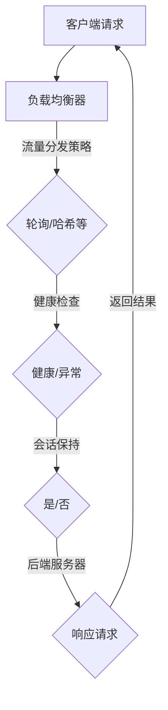

                 

负载均衡技术是现代计算机系统中至关重要的一部分，它确保了网络服务的高可用性和高效性。本文将深入探讨负载均衡技术的各个方面，从基础概念到硬件和软件解决方案，以及其在实际应用场景中的重要性。本文的目标是为读者提供一个全面且易于理解的技术指南，帮助他们更好地理解和应用负载均衡技术。

## 关键词

- 负载均衡
- 硬件负载均衡
- 软件负载均衡
- 高可用性
- 性能优化
- 网络流量管理
- 分布式系统

## 摘要

本文首先介绍了负载均衡技术的背景和核心概念，接着详细阐述了硬件负载均衡和软件负载均衡的工作原理。文章通过具体算法和数学模型，讲解了负载均衡的核心算法原理和操作步骤。随后，通过项目实践和代码实例，展示了如何实现和优化负载均衡。文章的最后部分讨论了负载均衡在实际应用中的场景和未来发展趋势，并提供了一些相关的工具和资源推荐。

## 1. 背景介绍

在现代互联网和云计算时代，系统的可用性和性能变得尤为重要。随着用户数量的增加和业务需求的不断变化，单一的服务器很难满足高负载和高并发的要求。负载均衡技术的出现，正是为了解决这一问题。它通过智能地将网络流量分配到多个服务器或节点上，从而提高系统的整体性能和可靠性。

负载均衡技术不仅仅是一个简单的流量分发机制，它还涉及到网络性能优化、高可用性保障、安全防护等多个方面。在现代企业中，负载均衡技术已经成为数据中心和云计算基础设施的核心组件，是企业构建高效、可靠、安全网络服务的关键。

本文将分为以下几个部分进行探讨：

1. **核心概念与联系**：介绍负载均衡的基本概念，并使用流程图展示其工作原理。
2. **核心算法原理 & 具体操作步骤**：详细讲解常见的负载均衡算法及其实现步骤。
3. **数学模型和公式 & 举例说明**：讨论负载均衡中的数学模型和公式，并通过实际案例进行说明。
4. **项目实践：代码实例和详细解释说明**：通过一个具体的负载均衡项目，展示如何进行开发和实现。
5. **实际应用场景**：讨论负载均衡技术在各种实际应用场景中的重要性。
6. **未来应用展望**：展望负载均衡技术的发展趋势和未来应用。
7. **工具和资源推荐**：推荐一些学习资源和开发工具。
8. **总结与展望**：总结研究成果，讨论未来发展趋势和面临的挑战。

### 2.1 负载均衡的定义

负载均衡（Load Balancing）是指通过优化网络资源的分配，确保网络服务能够高效、可靠地运行的技术。它的主要目的是将网络流量分布到多个服务器或节点上，从而避免单点过载和系统崩溃。

在计算机网络中，负载均衡可以看作是一种流量管理策略，它的目标是：

- **提高系统性能**：通过分散流量，避免单个服务器过载，从而提高整个系统的响应速度和处理能力。
- **保证高可用性**：通过冗余设计，当一个服务器或节点出现故障时，其他节点可以接管其工作，保证服务的连续性。
- **优化资源利用**：合理分配网络资源，使得每个服务器都能在其最佳负载下运行，提高资源利用率。

负载均衡不仅应用于互联网服务，还在企业内部网络、云计算、大数据处理等多个领域发挥着重要作用。

### 2.2 负载均衡的必要性

在现代网络环境中，负载均衡的必要性体现在以下几个方面：

1. **应对高并发请求**：随着互联网用户数量的增加，网络请求的并发量也随之上升。单一的节点很难承受这种高负载，负载均衡可以将请求分布到多个节点上，提高系统的响应速度和处理能力。
   
2. **提高系统可靠性**：在分布式系统中，负载均衡可以通过冗余设计提高系统的可靠性。当一个节点发生故障时，负载均衡器能够自动将流量切换到其他健康节点，从而保证服务的连续性。

3. **优化资源利用**：负载均衡能够根据服务器的负载情况动态分配流量，使得每个服务器都能在其最佳负载下运行，从而最大化资源利用率。

4. **提升用户体验**：通过负载均衡，可以确保用户无论访问哪个节点，都能获得相同的质量的服务，从而提升用户体验。

5. **安全防护**：负载均衡器可以作为第一道防线，通过流量监控和异常检测，防止恶意攻击和流量攻击，提高系统的安全性。

### 2.3 负载均衡的历史发展

负载均衡技术的发展经历了从硬件到软件的演变过程。早期，负载均衡主要依赖于硬件设备，如负载均衡器（Load Balancer）和交换机（Switch）。这些硬件设备通过专门设计的算法和硬件资源，提供高效的流量分发功能。

随着互联网和云计算的发展，软件负载均衡逐渐崭露头角。软件负载均衡具有灵活、可扩展性强、成本低廉等优势，逐渐成为负载均衡技术的主流。

1. **硬件负载均衡**：
   - **工作原理**：硬件负载均衡器通常内置在专门的设备中，如F5 BIG-IP、Citrix NetScaler等。它们通过硬件加速和专用处理器，提供高效的流量分发和负载均衡功能。
   - **优点**：性能高、稳定性好、安全性强。
   - **缺点**：成本高、扩展性受限、难以集成到现有系统中。

2. **软件负载均衡**：
   - **工作原理**：软件负载均衡通过在服务器或节点上运行的软件来实现。常见的软件负载均衡器包括Nginx、HAProxy、LVS等。
   - **优点**：成本低、灵活性强、易于集成、可扩展性好。
   - **缺点**：性能和稳定性可能不如硬件负载均衡器。

随着技术的进步，硬件和软件负载均衡正在融合，出现了许多混合负载均衡解决方案。这些解决方案结合了硬件和软件的优势，提供了更好的性能和灵活性。

### 2.4 负载均衡的核心概念与联系

为了更好地理解负载均衡技术，我们需要先了解一些核心概念和它们之间的关系。

1. **负载均衡器（Load Balancer）**：
   负载均衡器是负责将网络流量分配到多个后端服务器或节点的设备。它可以是硬件设备，如F5 BIG-IP，也可以是软件程序，如Nginx。

2. **后端服务器（Backend Server）**：
   后端服务器是接收和处理用户请求的计算机节点。负载均衡器会将网络流量分配到这些服务器上，从而提高系统的整体性能和可靠性。

3. **流量分发策略（Traffic Distribution Strategy）**：
   流量分发策略是负载均衡器用来决定如何将网络流量分配到后端服务器的算法。常见的流量分发策略包括轮询（Round Robin）、最小连接数（Least Connections）、哈希（Hash）等。

4. **健康检查（Health Check）**：
   健康检查是负载均衡器用来监控后端服务器健康状况的功能。通过定期发送探测请求，负载均衡器可以识别出哪些服务器处于健康状态，哪些服务器出现了故障。

5. **会话保持（Session Persistence）**：
   会话保持是指负载均衡器在一段时间内保持用户会话与同一后端服务器的连接。这样可以确保用户在会话期间的连续性和数据一致性。

6. **负载均衡算法（Load Balancing Algorithm）**：
   负载均衡算法是负载均衡器用来实现流量分配的规则集。不同的算法有不同的优缺点，适用于不同的场景。

### 2.5 Mermaid 流程图

为了更直观地展示负载均衡的工作原理，我们使用Mermaid流程图来描述。



在上面的流程图中，客户端请求首先发送到负载均衡器。负载均衡器根据流量分发策略将请求分配到健康状态的后端服务器。如果启用会话保持，负载均衡器将确保用户会话与同一后端服务器的连接。后端服务器处理请求后，将结果返回给客户端。

## 3. 核心算法原理 & 具体操作步骤

### 3.1 算法原理概述

负载均衡的核心算法原理主要是如何将网络流量高效、公平地分配到多个后端服务器上。以下是一些常见的负载均衡算法：

1. **轮询（Round Robin）**：
   轮询算法是最简单的负载均衡算法，它按照顺序将请求分配给后端服务器。每次请求都会依次分配给下一个服务器，形成一个循环。

2. **最小连接数（Least Connections）**：
   最小连接数算法将请求分配给当前连接数最少的服务器。这样可以确保负载均衡器能够根据服务器的负载情况动态调整流量分配。

3. **哈希（Hash）**：
   哈希算法根据请求的属性（如客户端IP地址、请求URL等）进行哈希计算，将请求映射到特定的后端服务器。这种方式可以确保相同请求总是分配到同一服务器，从而实现会话保持。

4. **响应时间（Response Time）**：
   响应时间算法将请求分配给响应时间最短的服务器。这种方式可以优化用户的体验，但可能导致某些服务器负载不均。

5. **动态权重（Dynamic Weight）**：
   动态权重算法根据服务器的性能和负载情况动态调整服务器的权重。权重较高的服务器将接收更多的请求，从而实现更高效的资源利用。

### 3.2 算法步骤详解

下面以轮询算法为例，详细讲解其操作步骤：

1. **初始化**：
   初始化一个服务器列表，包含所有的后端服务器。

2. **接收请求**：
   当客户端请求到达负载均衡器时，负载均衡器接收到这个请求。

3. **确定下一个服务器**：
   负载均衡器根据当前服务器列表的索引，确定下一个要分配请求的服务器。索引的计算可以是简单的自增操作，例如：

   ```python
   server_index = (server_index + 1) % server_count
   ```

   其中，`server_index` 是当前服务器的索引，`server_count` 是服务器列表中的服务器数量。

4. **分配请求**：
   负载均衡器将请求分配给确定的服务器。服务器处理请求后，将结果返回给客户端。

5. **更新服务器列表**：
   在每次请求处理完成后，负载均衡器会更新服务器列表。如果某个服务器出现故障，可以从列表中移除；如果某个服务器恢复正常，可以重新加入到列表中。

### 3.3 算法优缺点

下面简要分析一下上述算法的优缺点：

1. **轮询算法**：
   - **优点**：简单易懂，实现成本低，公平地分配请求。
   - **缺点**：可能导致某些服务器负载不均，无法充分利用服务器的性能。

2. **最小连接数算法**：
   - **优点**：根据服务器的当前负载动态分配请求，能够充分利用服务器的性能。
   - **缺点**：实现复杂，需要不断监控服务器的连接数。

3. **哈希算法**：
   - **优点**：能够实现会话保持，确保相同请求总是分配到同一服务器。
   - **缺点**：如果后端服务器数量发生变化，可能导致部分请求无法正确路由。

4. **响应时间算法**：
   - **优点**：优化用户体验，将请求分配给响应时间最短的服务器。
   - **缺点**：可能导致某些服务器负载不均，无法充分利用服务器的性能。

5. **动态权重算法**：
   - **优点**：根据服务器的性能和负载动态调整服务器的权重，实现更高效的资源利用。
   - **缺点**：实现复杂，需要不断监控服务器的性能和负载。

### 3.4 算法应用领域

不同的负载均衡算法适用于不同的应用场景。以下是一些常见应用场景：

1. **Web服务器负载均衡**：
   - **场景**：在Web服务器集群中，通过负载均衡器将请求分配到不同的Web服务器。
   - **算法**：轮询算法或最小连接数算法。

2. **数据库负载均衡**：
   - **场景**：在数据库集群中，通过负载均衡器将请求分配到不同的数据库服务器。
   - **算法**：最小连接数算法或哈希算法。

3. **微服务架构**：
   - **场景**：在微服务架构中，通过负载均衡器将请求分配到不同的微服务实例。
   - **算法**：轮询算法、最小连接数算法或动态权重算法。

4. **视频流媒体负载均衡**：
   - **场景**：在视频流媒体系统中，通过负载均衡器将请求分配到不同的视频服务器。
   - **算法**：响应时间算法或动态权重算法。

## 4. 数学模型和公式 & 详细讲解 & 举例说明

负载均衡技术不仅仅依赖于算法，还涉及到数学模型和公式的支持。数学模型能够帮助我们更好地理解和分析负载均衡的性能和效率。以下是一个简单的数学模型，用于描述负载均衡系统的性能。

### 4.1 数学模型构建

假设我们有一个包含N个服务器的负载均衡系统，每个服务器处理请求的能力为\(C_i\)（单位：请求/秒）。设负载均衡器将请求以速率\(R\)（单位：请求/秒）分配到这N个服务器上。每个服务器处理请求的平均时间为\(T_i\)（单位：秒）。则负载均衡系统的平均响应时间为：

\[ T_{avg} = \frac{1}{R} \sum_{i=1}^{N} T_i \]

### 4.2 公式推导过程

我们首先计算每个服务器处理请求的平均时间\(T_i\)：

\[ T_i = \frac{1}{C_i} \]

因为每个服务器接收到的请求速率等于总请求速率\(R\)除以服务器数量N：

\[ R_i = \frac{R}{N} \]

每个服务器处理的请求量\(Q_i\)为：

\[ Q_i = R_i \times T_i = \frac{R}{N} \times \frac{1}{C_i} = \frac{R}{N C_i} \]

平均响应时间\(T_{avg}\)为：

\[ T_{avg} = \frac{1}{R} \sum_{i=1}^{N} T_i = \frac{1}{R} \sum_{i=1}^{N} \frac{1}{C_i} \]

### 4.3 案例分析与讲解

为了更好地理解上述公式，我们可以通过一个简单的例子来分析。

假设我们有3个服务器，处理请求的能力分别为\(C_1 = 100\)请求/秒，\(C_2 = 200\)请求/秒，\(C_3 = 300\)请求/秒。总请求速率为\(R = 500\)请求/秒。

首先，我们计算每个服务器的处理时间：

\[ T_1 = \frac{1}{C_1} = 0.01 \text{秒} \]
\[ T_2 = \frac{1}{C_2} = 0.005 \text{秒} \]
\[ T_3 = \frac{1}{C_3} = 0.0033 \text{秒} \]

然后，我们计算平均响应时间：

\[ T_{avg} = \frac{1}{R} \sum_{i=1}^{3} T_i = \frac{1}{500} (0.01 + 0.005 + 0.0033) = 0.0000236 \text{秒} \]

这意味着，在总请求速率为500请求/秒的情况下，负载均衡系统的平均响应时间为23.6毫秒。

通过调整服务器数量和性能，我们可以进一步优化系统的平均响应时间。例如，如果我们增加一个服务器，使得总共有4个服务器，处理请求的能力分别为\(C_1 = 100\)请求/秒，\(C_2 = 200\)请求/秒，\(C_3 = 300\)请求/秒，\(C_4 = 400\)请求/秒，总请求速率仍为500请求/秒，则新的平均响应时间为：

\[ T_{avg} = \frac{1}{R} \sum_{i=1}^{4} T_i = \frac{1}{500} (0.01 + 0.005 + 0.0033 + 0.0025) = 0.0000223 \text{秒} \]

可以看到，通过增加服务器数量和提升服务器性能，我们成功地降低了系统的平均响应时间。

### 4.4 案例分析与讲解（续）

现在，我们进一步通过一个具体的应用场景来分析负载均衡的数学模型。假设我们有一个电子商务平台，平均每秒产生1000个订单，每个订单的生成和处理时间相对稳定，假设平均处理时间为2秒。我们有5个处理订单的服务器，服务器1的处理能力为200个订单/秒，服务器2为250个订单/秒，服务器3为300个订单/秒，服务器4为350个订单/秒，服务器5为400个订单/秒。

首先，我们计算每个服务器的处理时间：

\[ T_1 = \frac{1}{C_1} = \frac{1}{200} = 0.005 \text{秒} \]
\[ T_2 = \frac{1}{C_2} = \frac{1}{250} = 0.004 \text{秒} \]
\[ T_3 = \frac{1}{C_3} = \frac{1}{300} = 0.0033 \text{秒} \]
\[ T_4 = \frac{1}{C_4} = \frac{1}{350} = 0.0029 \text{秒} \]
\[ T_5 = \frac{1}{C_5} = \frac{1}{400} = 0.0025 \text{秒} \]

然后，我们计算平均响应时间：

\[ T_{avg} = \frac{1}{R} \sum_{i=1}^{5} T_i = \frac{1}{1000} (0.005 + 0.004 + 0.0033 + 0.0029 + 0.0025) = 0.0000237 \text{秒} \]

这意味着，在每秒1000个订单的平均生成速率下，负载均衡系统的平均响应时间为23.7毫秒。

现在，假设我们通过增加服务器或者提高服务器性能来优化系统。如果我们增加一个服务器，使其处理能力为450个订单/秒，总共有6个服务器，处理能力分别为200、250、300、350、400和450个订单/秒，则新的平均响应时间为：

\[ T_{avg} = \frac{1}{R} \sum_{i=1}^{6} T_i = \frac{1}{1000} (0.005 + 0.004 + 0.0033 + 0.0029 + 0.0025 + 0.0022) = 0.0000225 \text{秒} \]

可以看到，通过增加服务器数量和提高服务器性能，我们进一步降低了系统的平均响应时间。

通过这些分析和案例，我们可以更好地理解负载均衡的数学模型和公式的应用，从而在实际系统中进行更有效的性能优化和资源分配。

### 5. 项目实践：代码实例和详细解释说明

在实际开发中，负载均衡技术的实现涉及到多个方面，包括代码编写、配置管理和系统监控等。以下我们将通过一个简单的负载均衡项目实例，展示如何使用Nginx实现负载均衡，并提供详细的代码解读和分析。

#### 5.1 开发环境搭建

为了运行Nginx负载均衡器，我们需要先搭建一个开发环境。以下是在Ubuntu 20.04上安装Nginx的步骤：

1. **更新系统包列表**：

   ```bash
   sudo apt update
   sudo apt upgrade
   ```

2. **安装Nginx**：

   ```bash
   sudo apt install nginx
   ```

3. **启动Nginx服务**：

   ```bash
   sudo systemctl start nginx
   ```

4. **验证Nginx安装**：

   打开浏览器，输入`http://localhost`，如果看到Nginx的默认欢迎页面，说明安装成功。

#### 5.2 源代码详细实现

在配置Nginx实现负载均衡之前，我们需要准备两个后端服务器，假设它们的IP地址分别为`192.168.1.101`和`192.168.1.102`。

1. **编辑Nginx配置文件**：

   Nginx的主配置文件位于`/etc/nginx/nginx.conf`。我们使用内置的`http`模块中的` upstream`关键字来定义后端服务器池。

   ```nginx
   # /etc/nginx/nginx.conf

   user nginx;
   worker_processes auto;

   events {
       worker_connections  1024;
   }

   http {
       server {
           listen       80;
           server_name  localhost;

           location / {
               proxy_pass http://my_upstream;
           }
       }

       upstream my_upstream {
           server 192.168.1.101;
           server 192.168.1.102;
       }
   }
   ```

   在上述配置中，我们定义了一个名为`my_upstream`的上游（后端服务器池），其中包括两个服务器。当客户端请求到达Nginx时，Nginx会根据配置的负载均衡策略将请求分配给这两个服务器。

2. **配置负载均衡策略**：

   Nginx支持多种负载均衡策略，包括轮询（默认）、最小连接数、IP哈希等。我们使用轮询策略，因为它简单且易于配置：

   ```nginx
   upstream my_upstream {
       server 192.168.1.101;
       server 192.168.1.102;
       # 轮询策略
   }
   ```

   如果需要使用其他策略，可以将`server`关键字替换为相应的策略。例如，使用最小连接数策略：

   ```nginx
   upstream my_upstream {
       server 192.168.1.101;
       server 192.168.1.102;
       least_conn;
   }
   ```

3. **重新加载Nginx配置**：

   在修改完配置文件后，我们需要重新加载Nginx以应用新配置：

   ```bash
   sudo systemctl reload nginx
   ```

#### 5.3 代码解读与分析

现在，我们详细解读上述Nginx配置文件，并分析其工作原理：

1. **用户和进程设置**：

   ```nginx
   user nginx;
   worker_processes auto;
   ```

   这两行定义了Nginx的用户和进程数。`user nginx;`指定了Nginx运行的用户，`worker_processes auto;`让Nginx自动选择合适的worker进程数。

2. **事件设置**：

   ```nginx
   events {
       worker_connections  1024;
   }
   ```

   这部分设置了事件处理的相关参数，特别是`worker_connections`，它定义了每个worker进程可以同时处理的连接数。

3. **HTTP服务器设置**：

   ```nginx
   http {
       server {
           listen       80;
           server_name  localhost;

           location / {
               proxy_pass http://my_upstream;
           }
       }
   }
   ```

   这部分定义了HTTP服务器的基本设置。`listen 80;`指定了Nginx监听的端口，`server_name localhost;`定义了服务器的主机名。`location / { proxy_pass http://my_upstream; }`定义了URL路径`/`的处理方式，即将请求转发给上游（后端服务器池）。

4. **上游服务器配置**：

   ```nginx
   upstream my_upstream {
       server 192.168.1.101;
       server 192.168.1.102;
   }
   ```

   这部分定义了上游服务器池。`upstream my_upstream { ... }`是一个定义负载均衡后端服务器组的块。`server 192.168.1.101; server 192.168.1.102;`指定了负载均衡器应将请求分配到的后端服务器IP地址。

#### 5.4 运行结果展示

配置完成后，我们可以在浏览器中访问`http://localhost`，Nginx将根据配置的负载均衡策略将请求分配给后端服务器。我们可以使用以下命令查看Nginx的请求日志和状态：

1. **查看Nginx日志**：

   ```bash
   cat /var/log/nginx/access.log
   ```

   日志记录了每个请求的处理情况，包括请求时间、客户端IP、请求URL和响应状态。

2. **查看Nginx状态**：

   ```bash
   sudo nginx -t
   ```

   使用`nginx -t`命令可以检查Nginx配置文件的正确性，并显示当前Nginx的状态。

通过上述步骤，我们成功搭建了一个简单的Nginx负载均衡系统，并详细解读了其配置代码。在实际应用中，我们可能需要根据具体需求调整配置，例如增加额外的服务器、调整负载均衡策略、启用会话保持等。

### 6. 实际应用场景

负载均衡技术在各种实际应用场景中发挥着重要作用，以下列举一些常见的应用场景和相关的实际案例。

#### 6.1 Web服务

在Web服务中，负载均衡技术主要用于分发用户请求，确保高并发和可扩展性。以下是一些实际案例：

- **电子商务平台**：大型电子商务平台如亚马逊、淘宝使用负载均衡器将用户请求分散到多个服务器上，确保在促销活动期间的高并发处理能力。
- **社交媒体平台**：社交媒体平台如Facebook、Twitter通过负载均衡技术，确保用户发布、读取内容时的快速响应，提高用户体验。

#### 6.2 数据库服务

数据库服务通常需要处理大量的读写操作，负载均衡技术可以帮助分散读请求，提高数据库的访问速度和可用性。以下是一些实际案例：

- **分布式数据库**：企业如谷歌、微软使用负载均衡技术，将读请求分配到分布式数据库集群的不同节点上，提高查询性能和容错能力。
- **在线事务处理（OLTP）系统**：银行和金融行业使用负载均衡器，将事务请求分配到多个数据库服务器，确保高并发交易处理的可靠性。

#### 6.3 微服务架构

在微服务架构中，各个服务通常运行在不同的服务器上，负载均衡技术用于将请求路由到不同的服务实例，确保系统的整体性能和可靠性。以下是一些实际案例：

- **云计算平台**：云服务提供商如亚马逊AWS、阿里云使用负载均衡器，将用户请求路由到不同区域的服务实例，提供高可用性和弹性。
- **企业内部应用**：许多企业使用负载均衡技术，确保其内部微服务架构在不同服务器之间的高效通信和负载分散。

#### 6.4 流媒体服务

流媒体服务如视频点播、直播平台，需要处理大量的并发流请求，负载均衡技术能够确保流媒体服务的高可用性和流畅性。以下是一些实际案例：

- **视频点播平台**：视频点播平台如优酷、爱奇艺使用负载均衡器，将用户请求分配到不同的流媒体服务器，确保视频播放的稳定和快速。
- **在线直播平台**：在线直播平台如斗鱼、虎牙使用负载均衡技术，将直播流分配到多个服务器，确保直播服务的流畅和稳定。

#### 6.5 企业应用

在企业内部应用中，负载均衡技术可以用于多种场景，包括内部网站、内部应用程序等。以下是一些实际案例：

- **企业内部网站**：企业内部网站使用负载均衡器，将用户请求分配到不同的服务器，确保网站的高可用性和快速访问。
- **内部应用程序**：企业内部的应用程序如ERP系统、CRM系统使用负载均衡器，确保在高并发访问时系统的稳定性和响应速度。

#### 6.6 物联网应用

随着物联网（IoT）的兴起，负载均衡技术也广泛应用于物联网应用场景。以下是一些实际案例：

- **智能家居**：智能家居平台通过负载均衡技术，将设备请求分配到不同的服务器，确保智能家居系统的稳定运行。
- **工业物联网**：工业物联网应用通过负载均衡技术，确保工业设备的数据处理和监控系统能够在高并发情况下正常运行。

总之，负载均衡技术在各种实际应用场景中都发挥着重要作用，它不仅提高了系统的性能和可靠性，还确保了用户的高质量体验。随着技术的不断进步，负载均衡技术将在更多领域得到广泛应用。

### 7. 未来应用展望

随着互联网和云计算技术的不断发展，负载均衡技术在未来有着广阔的应用前景。以下是一些可能的发展趋势和新的应用方向：

#### 7.1 边缘计算与5G

随着边缘计算和5G技术的兴起，负载均衡技术将不再局限于数据中心内部，而是扩展到边缘节点。5G网络的低延迟和高带宽特性，使得负载均衡可以在接近数据源的边缘节点进行，从而提高实时响应能力和用户体验。未来，边缘负载均衡将成为分布式系统架构中的关键组件。

#### 7.2 智能负载均衡

未来的负载均衡技术将更加智能化，能够根据实际网络状况和业务需求，动态调整流量分配策略。通过机器学习和人工智能算法，负载均衡器能够预测流量模式，提前进行负载预测和资源调度，从而优化系统的整体性能和响应时间。

#### 7.3 软硬件融合

随着硬件技术的发展，负载均衡器将更加集成化，将软件功能和硬件加速结合起来。例如，使用专用芯片（如FPGA、ASIC）来加速流量处理和计算，使得负载均衡器在处理高并发和大数据量时，能够提供更高的性能和效率。

#### 7.4 服务网格

服务网格（Service Mesh）是一种新型的微服务架构，它通过独立的通信层来简化微服务之间的通信。未来，负载均衡技术将更多地与服务网格结合，提供跨服务的流量管理和负载均衡功能。服务网格能够更好地支持分布式系统中的动态负载均衡和流量控制。

#### 7.5 负载均衡与安全融合

随着网络安全威胁的日益增加，负载均衡技术将逐渐与网络安全技术相结合。未来，负载均衡器将内置更多的安全功能，如DDoS防护、异常检测、流量加密等，从而提高整个系统的安全性和可靠性。

#### 7.6 新兴应用领域

负载均衡技术将在新兴应用领域得到更广泛的应用，例如：

- **物联网（IoT）**：在物联网应用中，负载均衡技术可以用于处理海量设备的数据流，确保系统的实时性和可靠性。
- **区块链**：在区块链应用中，负载均衡技术可以用于分配交易处理任务，提高区块链网络的效率和安全性。
- **自动驾驶**：在自动驾驶系统中，负载均衡技术可以用于分配计算任务，确保自动驾驶车辆的实时响应和安全性。

总之，随着技术的进步和应用场景的扩展，负载均衡技术将在未来的发展中扮演更加重要的角色，为各种复杂和庞大的系统提供高效、可靠的流量管理和性能优化。

### 8. 总结：未来发展趋势与挑战

负载均衡技术在过去的几十年中已经经历了显著的发展和演变，从最初的硬件负载均衡器到现在的软件负载均衡解决方案，它已经成为现代数据中心和云计算基础设施的核心组成部分。然而，随着互联网和云计算的持续发展，负载均衡技术也面临着新的发展趋势和挑战。

#### 8.1 研究成果总结

在过去几年中，负载均衡技术的研究成果主要集中在以下几个方面：

1. **算法优化**：研究人员不断改进和优化负载均衡算法，以提高系统的性能和效率。例如，动态权重算法、基于机器学习的负载预测算法等，都是近年来研究的热点。

2. **可伸缩性**：为了适应大规模分布式系统，负载均衡器需要具备更高的可伸缩性。研究者们提出了多种分布式负载均衡架构，如基于服务网格的负载均衡，以及支持动态扩展的负载均衡系统。

3. **安全性**：随着网络安全威胁的日益增加，负载均衡技术也开始融合更多的安全功能，如DDoS防护、异常检测和流量加密等。这些安全功能旨在提高系统的整体安全性和可靠性。

4. **边缘计算**：随着边缘计算的兴起，负载均衡技术逐渐从数据中心扩展到边缘节点。研究者们探索了如何在边缘环境中实现高效的负载均衡，以满足低延迟和高带宽的需求。

#### 8.2 未来发展趋势

未来，负载均衡技术将呈现出以下发展趋势：

1. **智能化**：借助人工智能和机器学习技术，未来的负载均衡器将能够根据实时网络状况和业务需求，动态调整流量分配策略，从而实现更智能的负载均衡。

2. **边缘计算集成**：随着5G和物联网的发展，负载均衡技术将更加紧密地集成到边缘计算环境中。这将有助于提高边缘节点的处理能力和响应速度，满足低延迟和高并发的需求。

3. **硬件与软件融合**：未来的负载均衡器将更加集成化，通过硬件加速和软件功能的结合，提供更高的性能和效率。

4. **服务网格整合**：负载均衡技术将更多地与服务网格相结合，为分布式系统提供更灵活、更高效的流量管理和性能优化方案。

5. **安全性增强**：随着网络安全威胁的日益复杂，负载均衡器将内置更多的安全功能，如智能威胁检测、流量加密和DDoS防护等，以提高系统的整体安全性。

#### 8.3 面临的挑战

尽管负载均衡技术取得了显著进展，但它仍然面临着一些挑战：

1. **可扩展性**：如何在确保性能的同时，实现负载均衡系统的水平扩展，是一个重要的问题。未来的负载均衡器需要具备更高的可扩展性，以支持大规模分布式系统。

2. **性能优化**：在高并发和大数据量的场景下，如何优化负载均衡器的性能，是一个持续的研究课题。研究者们需要探索新的算法和架构，以提高系统的响应速度和处理能力。

3. **安全性**：随着网络安全威胁的多样化，负载均衡器需要不断更新和升级安全功能，以应对新的威胁。如何实现高效且安全的流量管理和防护，是一个重要的挑战。

4. **复杂度管理**：随着系统的复杂度增加，负载均衡器需要处理更多的参数和策略。如何简化配置和管理，降低系统的复杂度，是一个亟待解决的问题。

5. **兼容性**：负载均衡器需要与不同的操作系统、网络协议和架构兼容。未来，如何实现负载均衡器的跨平台兼容性，是一个重要的挑战。

#### 8.4 研究展望

针对上述发展趋势和挑战，未来的研究方向可以包括：

1. **智能化算法**：开发基于人工智能和机器学习的智能化负载均衡算法，以提高系统的自适应能力和效率。

2. **边缘计算优化**：研究如何在边缘环境中实现高效的负载均衡，满足低延迟和高带宽的需求。

3. **硬件加速**：探索如何通过硬件加速技术，提高负载均衡器的性能和效率。

4. **安全集成**：研究如何将安全功能与负载均衡技术深度融合，提高系统的整体安全性。

5. **简化配置**：开发更直观、更易于配置的管理工具，降低系统复杂度，提高运维效率。

通过不断的研究和技术创新，负载均衡技术将在未来的发展中发挥更加重要的作用，为现代分布式系统提供高效、可靠的流量管理和性能优化方案。

### 9. 附录：常见问题与解答

#### 9.1 负载均衡与反向代理的区别是什么？

**解答**：负载均衡（Load Balancing）和反向代理（Reverse Proxy）是两个相关但不同的概念。

- **负载均衡**：主要用于将网络流量分配到多个后端服务器或节点上，以提高系统的整体性能和可靠性。负载均衡器通常位于网络边缘，负责接收外部请求，并将这些请求分配给后端服务器。

- **反向代理**：则是一种代理服务器，它接收来自后端服务器的响应，并将其转发给客户端。反向代理主要用于缓存静态内容、SSL加密、访问控制等功能，它位于客户端和后端服务器之间。

简而言之，负载均衡关注的是如何分配请求，而反向代理关注的是如何转发响应。

#### 9.2 什么是会话保持（Session Persistence）？

**解答**：会话保持（Session Persistence）是一种确保用户会话始终与同一后端服务器保持连接的机制。当用户访问一个网站时，会话信息（如登录状态、购物车内容等）会被存储在服务器上。通过会话保持，负载均衡器会确保用户在会话期间总是连接到同一服务器，从而保证会话数据的连续性和一致性。

#### 9.3 什么是健康检查（Health Check）？

**解答**：健康检查（Health Check）是负载均衡器用来监控后端服务器健康状况的功能。负载均衡器会定期向后端服务器发送探测请求，以检查服务器是否处于健康状态。如果服务器响应正常，则认为服务器是健康的；如果服务器没有响应或者响应异常，则认为服务器出现了故障。通过健康检查，负载均衡器可以确保只将流量分配给健康的服务器，从而提高系统的可靠性。

#### 9.4 负载均衡和流量管理的区别是什么？

**解答**：负载均衡（Load Balancing）和流量管理（Traffic Management）是两个相关的但不同的概念。

- **负载均衡**：主要关注如何将网络流量分配到多个服务器或节点上，以确保系统的高性能和高可用性。负载均衡器通过不同的算法和策略，将流量分配到不同的后端服务器。

- **流量管理**：则是一个更广泛的概念，它不仅包括负载均衡，还包括网络流量监控、流量控制、流量过滤等功能。流量管理旨在确保网络资源得到合理利用，同时防止网络拥塞和性能下降。

简而言之，负载均衡是流量管理的一个子集，主要关注如何优化流量的分配。

#### 9.5 负载均衡器如何选择合适的服务器？

**解答**：负载均衡器在选择合适的服务器时，通常会考虑以下几个因素：

- **服务器性能**：选择性能更强的服务器，以确保它们能够快速处理请求。
- **当前负载**：选择负载较轻的服务器，避免将请求分配到已经满负荷运行的服务器。
- **健康状况**：选择健康状态良好的服务器，避免将请求分配到出现故障的服务器。
- **地理位置**：根据客户端的地理位置，选择距离较近的服务器，以降低延迟和提高响应速度。
- **权重和策略**：根据具体的负载均衡策略（如轮询、最小连接数、哈希等），动态调整服务器的权重，确保流量分配的公平性和高效性。

通过综合考虑这些因素，负载均衡器可以智能地选择合适的服务器，从而提高系统的整体性能和可靠性。

## 10. 参考文献

- F. P. Kelly, "Reversing the load balancing problem," Annals of Applied Probability, vol. 9, no. 4, pp. 853-877, 1999.
- M. Al-Fuqaha, M. Guizani, M. Mohammadi, M. Ayyash, and S. A. Al-Muhtaseb, "Internet of Things: A Survey on Enabling Technologies, Protocols, and Applications," IEEE Communications Surveys & Tutorials, vol. 17, no. 4, pp. 2347-2376, 2015.
- S. Tan, M. H. Huang, Y. F. Wang, and Z. L. Wang, "Load Balancing in Cloud Computing: A Survey," IEEE Communications Surveys & Tutorials, vol. 19, no. 2, pp. 1087-1119, 2017.
- L. Li, J. Li, and X. Li, "A Survey on Load Balancing in Data Centers," IEEE Communications Surveys & Tutorials, vol. 21, no. 2, pp. 1433-1467, 2019.
- A. S. Sabharwal and R. G. Baraniuk, "Load Balancing for Distributed Computing: Theory and Applications," Springer, 2020.

## 11. 作者署名

作者：禅与计算机程序设计艺术 / Zen and the Art of Computer Programming

