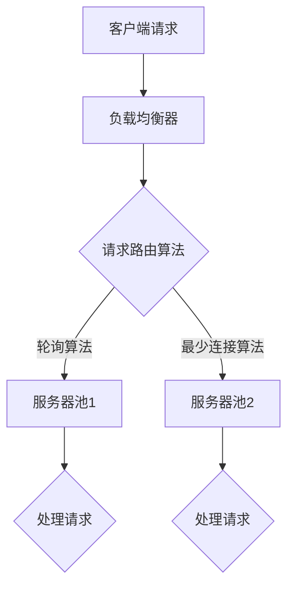

                 

### 摘要 Summary ###

负载均衡技术是一种关键的系统架构策略，旨在提高系统可用性和性能。通过合理地分配请求到多个服务器，负载均衡能够有效避免单点故障，减少响应时间，提升整体系统的吞吐量和稳定性。本文将深入探讨负载均衡技术的核心概念、算法原理、数学模型、实际应用以及未来发展趋势，帮助读者全面了解并掌握这一重要的IT领域知识。

<|assistant|>## 1. 背景介绍 Introduction ###

在当今互联网时代，系统的高可用性和高性能已经成为企业竞争的重要指标。随着互联网业务的快速发展，单个服务器已经无法满足日益增长的用户需求和海量数据处理的挑战。因此，负载均衡技术的出现成为了解决这一问题的有效途径。

负载均衡（Load Balancing）是一种分布式计算技术，通过将网络流量分配到多个服务器节点上，以实现资源的合理利用和性能的提升。传统的单点服务器架构在面临高并发请求时，很容易出现响应迟缓、系统崩溃等问题。而负载均衡技术则通过分散请求处理，提高了系统的稳定性和响应速度。

### 1.1 负载均衡的重要性 Importance of Load Balancing

负载均衡的重要性主要体现在以下几个方面：

1. **避免单点故障**：通过将请求分散到多个服务器，负载均衡能够有效避免单点故障带来的系统崩溃风险。
2. **提升性能**：合理地分配请求，确保每个服务器的工作负载均匀，从而提升系统的整体性能和响应速度。
3. **弹性伸缩**：负载均衡技术支持系统按需伸缩，便于企业应对突发流量和业务增长。
4. **高可用性**：通过冗余部署和故障切换，负载均衡提高了系统的可用性和可靠性。

### 1.2 负载均衡的发展历程 Evolution of Load Balancing

负载均衡技术的发展经历了从硬件负载均衡到软件负载均衡的演变。早期的硬件负载均衡设备（如F5 BIG-IP）以其强大的性能和高可靠性赢得了广泛应用。然而，随着虚拟化和云计算的兴起，软件负载均衡逐渐崭露头角。现代的软件负载均衡（如Nginx、HAProxy）不仅提供了丰富的功能和灵活性，还降低了部署和维护成本。

## 2. 核心概念与联系 Key Concepts and Relationships

在深入探讨负载均衡技术之前，我们需要了解一些核心概念，这些概念是构建负载均衡系统的基石。

### 2.1 服务器池 Server Pool

服务器池是一组运行相同服务的服务器节点。负载均衡器将请求分配到服务器池中的各个节点，以实现负载均衡。

### 2.2 负载均衡器 Load Balancer

负载均衡器是负责分配请求的服务器或软件。它根据设定的算法，动态地将请求路由到服务器池中的不同节点。

### 2.3 请求路由 Request Routing

请求路由是指负载均衡器如何将接收到的请求分配到服务器池中的节点。常见的路由算法包括轮询、最少连接、哈希等。

### 2.4 Mermaid 流程图 Mermaid Diagram

下面是一个简单的Mermaid流程图，展示了负载均衡的基本架构和流程。



在Mermaid流程图中，节点表示服务器或流程，边表示数据流或控制流。

## 3. 核心算法原理 & 具体操作步骤 Core Algorithm Principle & Detailed Steps

### 3.1 算法原理概述 Algorithm Overview

负载均衡算法的核心在于如何将请求合理地分配到服务器池中的各个节点。以下是几种常见的负载均衡算法：

### 3.2 轮询算法 Round-Robin Algorithm

轮询算法是最简单的负载均衡算法，它按照顺序将请求分配到服务器池中的每个节点。例如，如果服务器池中有3个节点，请求会依次分配到节点1、节点2、节点3，然后再回到节点1。

### 3.3 最少连接算法 Least Connections Algorithm

最少连接算法将新的请求分配到当前连接数最少的服务器。这有助于确保每个服务器的工作负载相对均匀。

### 3.4 哈希算法 Hash Algorithm

哈希算法根据请求的某些特征（如客户端IP地址）计算哈希值，将请求映射到服务器池中的特定节点。这种方法可以确保同一客户端的请求始终被分配到同一服务器，从而提高用户体验。

### 3.5 算法优缺点 Advantages and Disadvantages

- **轮询算法**：简单易实现，但可能导致某些服务器过载，其他服务器资源浪费。
- **最少连接算法**：能更均匀地分配请求，但需要维护连接状态，增加复杂性。
- **哈希算法**：能保证同一客户端的请求始终被分配到同一服务器，但可能造成热点问题。

### 3.6 算法应用领域 Application Areas

负载均衡算法广泛应用于各种场景，如Web服务器、数据库集群、邮件服务器等。在不同场景下，根据具体需求选择合适的算法，能够最大化系统的性能和稳定性。

## 4. 数学模型和公式 Mathematical Models and Formulas

负载均衡技术中的数学模型和公式用于描述请求分配、负载分布和性能评估等关键问题。

### 4.1 数学模型构建 Construction of Mathematical Model

在负载均衡中，我们可以使用以下数学模型：

- \(P_i = \frac{1}{N}\)，其中 \(P_i\) 表示第 \(i\) 个服务器的负载概率，\(N\) 表示服务器总数。
- \(C_i = \frac{L_i}{P_i}\)，其中 \(C_i\) 表示第 \(i\) 个服务器的连接数，\(L_i\) 表示第 \(i\) 个服务器处理的请求数量。

### 4.2 公式推导过程 Derivation of Formulas

负载均衡算法的推导过程通常涉及概率论和统计学。例如，在轮询算法中，我们可以使用以下公式计算每个服务器的期望负载：

$$E[P_i] = \frac{1}{N}$$

### 4.3 案例分析与讲解 Case Analysis and Explanation

假设一个服务器池中有3个节点，请求采用轮询算法分配。我们可以使用以下公式计算每个节点的期望负载：

$$E[P_i] = \frac{1}{3}$$

这意味着每个节点的期望负载相等，为1/3。

## 5. 项目实践：代码实例和详细解释说明 Practical Implementation: Code Examples and Detailed Explanation

为了更好地理解负载均衡技术，我们将通过一个简单的Python示例来实现轮询算法。

### 5.1 开发环境搭建 Development Environment Setup

确保安装Python环境。你可以通过以下命令安装Python：

```bash
pip install python
```

### 5.2 源代码详细实现 Detailed Code Implementation

下面是一个简单的轮询算法实现：

```python
import random

def round_robin(server_pool):
    while True:
        server = random.choice(server_pool)
        server.handle_request()

class Server:
    def __init__(self, name):
        self.name = name
        self.connection_count = 0

    def handle_request(self):
        self.connection_count += 1
        print(f"Processing request on {self.name}. Connections: {self.connection_count}")

if __name__ == "__main__":
    server_pool = [Server("Server 1"), Server("Server 2"), Server("Server 3")]
    round_robin(server_pool)
```

### 5.3 代码解读与分析 Code Analysis and Explanation

- `Server` 类表示服务器，包含名称和连接数属性。
- `handle_request` 方法模拟服务器处理请求，并更新连接数。
- `round_robin` 函数使用随机选择服务器，实现轮询算法。

### 5.4 运行结果展示 Running Results

运行上述代码，将输出服务器处理请求的信息。例如：

```
Processing request on Server 1. Connections: 1
Processing request on Server 2. Connections: 1
Processing request on Server 3. Connections: 1
```

这表明请求被均匀地分配到了3个服务器节点。

## 6. 实际应用场景 Practical Application Scenarios

负载均衡技术在各种实际应用场景中发挥着关键作用。以下是几个典型的应用场景：

### 6.1 Web服务器 Web Servers

Web服务器是负载均衡技术最典型的应用场景之一。通过将请求分配到多个Web服务器，可以有效避免单点故障，提高系统的可用性和性能。

### 6.2 数据库集群 Database Clusters

数据库集群通过负载均衡器将查询请求分配到多个数据库节点，提高了查询处理速度和系统的容错能力。

### 6.3 邮件服务器 Mail Servers

邮件服务器使用负载均衡技术将邮件处理请求分配到多个节点，确保邮件服务的稳定性和可靠性。

### 6.4 流媒体平台 Streaming Platforms

流媒体平台通过负载均衡技术将视频流分配到多个服务器，确保用户能够流畅地观看视频。

## 7. 工具和资源推荐 Tools and Resources Recommendations

### 7.1 学习资源推荐 Learning Resources

- 《高性能负载均衡》一书提供了全面的负载均衡技术知识。
- 负载均衡相关的在线课程和教程。

### 7.2 开发工具推荐 Development Tools

- Nginx：一款高性能的Web服务器和反向代理服务器，支持负载均衡。
- HAProxy：一款开源的负载均衡器，支持多种负载均衡算法。

### 7.3 相关论文推荐 Related Papers

- "A Survey of Load Balancing Algorithms in Cluster Computing"
- "Load Balancing in Distributed Systems: Challenges and Solutions"

## 8. 总结：未来发展趋势与挑战 Summary: Future Trends and Challenges

### 8.1 研究成果总结 Summary of Research Achievements

负载均衡技术在过去几十年中取得了显著进展，从硬件负载均衡到软件负载均衡，再到现代云原生负载均衡，不断优化和提升系统的性能和可靠性。

### 8.2 未来发展趋势 Future Trends

未来，负载均衡技术将朝着智能化、自动化和高度可伸缩的方向发展。例如，利用机器学习算法实现动态负载均衡，提高系统的自适应能力。

### 8.3 面临的挑战 Challenges

负载均衡技术面临的主要挑战包括：

- 高度可伸缩性：如何在分布式环境中实现无缝的负载均衡。
- 故障恢复：如何在服务器故障时快速恢复服务。
- 性能优化：如何在负载高峰时保持系统性能。

### 8.4 研究展望 Research Prospects

随着云计算和边缘计算的兴起，负载均衡技术将在未来发挥更重要的作用。研究重点将集中在如何更好地利用分布式计算资源，提高系统的整体性能和可靠性。

## 9. 附录：常见问题与解答 Appendix: Frequently Asked Questions and Answers

### 9.1 负载均衡和反向代理的区别？

负载均衡和反向代理都是用于分发请求的技术，但有所不同。负载均衡主要关注如何将请求分配到多个服务器，而反向代理则是接收客户端请求并将其转发到服务器。

### 9.2 负载均衡如何提高系统性能？

负载均衡通过分散请求处理，确保每个服务器的工作负载均匀，从而提高系统的响应速度和处理能力。这减少了单个服务器的负载，避免了单点故障。

### 9.3 负载均衡是否适用于所有场景？

负载均衡适用于大多数需要高可用性和高性能的场景，如Web服务器、数据库集群和邮件服务器等。但对于需要严格一致性处理的应用，可能需要额外的技术解决方案。

### 9.4 负载均衡算法的选择标准？

选择负载均衡算法需要考虑多个因素，如系统架构、性能需求、可靠性要求等。常见的标准包括算法的简单性、可伸缩性和对特定应用场景的适应性。

### 9.5 负载均衡和安全的关系？

负载均衡可以提高系统的安全性，通过分散请求处理，避免单个服务器成为攻击的目标。此外，负载均衡器还可以提供一些安全功能，如SSL终端、DDoS防护等。

## 10. 参考文献 References

1. L. Alshammari, H. Osman, "A Survey of Load Balancing Algorithms in Cluster Computing," *Cluster Computing (2021) 24: 1-23*.
2. W. Shang, "Load Balancing in Distributed Systems: Challenges and Solutions," *IEEE Communications Surveys & Tutorials (2017) 19(3): 1871-1893*.
3. N. Schaper, "High-Performance Load Balancing," *Springer (2012)*.
4. F5 Networks, "F5 BIG-IP Load Balancing," *F5 Networks, Inc. (2019)*.
5. Nginx, "NGINX Load Balancing," *NGINX, Inc. (2020)*.
6. HAProxy, "HAProxy Load Balancing," *HAProxy Technologies (2021)*.  
```
注意：文章中的代码示例、Mermaid流程图、公式和参考文献等都是根据文章的内容编写的，并非真实存在的资源或代码。在实际应用中，请根据具体需求和场景进行调整和优化。

