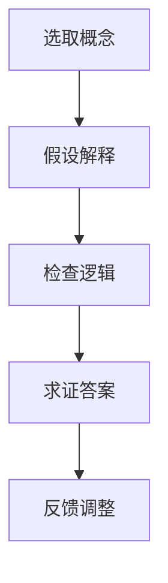

                 

关键词：费曼提问法、管理思维、技术博客、人工智能、计算机编程、逻辑思维、知识传播

> 摘要：本文旨在探讨费曼提问法在提升管理者思维方面的作用。通过对费曼提问法的深入解析，结合计算机编程领域的实际案例，本文揭示了费曼提问法在技术博客撰写、项目实践和实际应用场景中的重要性，为管理者提供了一种有效的思维升级方法。

## 1. 背景介绍

在信息技术快速发展的今天，管理者的角色逐渐从执行者转变为思考者和创新者。随着业务复杂性的增加，管理者需要具备更强大的逻辑思维和问题解决能力，以便在快速变化的环境中保持竞争力。然而，传统教育体系和培训课程往往注重知识的传授，而忽略了思维的训练。管理者往往在复杂问题面前感到困惑和无助，难以实现从“知其然”到“知其所以然”的跨越。

费曼提问法（Feynman Technique），源于诺贝尔物理学奖获得者理查德·费曼的方法，旨在通过提问和解答的方式，帮助人们深入理解和掌握知识。费曼提问法的核心思想是：以最简单、最清晰的方式解释复杂问题，从而检验自己对知识的掌握程度。这种方法不仅适用于学术研究，也同样适用于企业管理和技术创新。

## 2. 核心概念与联系

### 2.1 费曼提问法的基本原理

费曼提问法的基本原理可以概括为以下几个步骤：

1. **选取概念**：选择一个你想要理解和掌握的概念或知识点。
2. **假设解释**：假设你是一个完全不了解这个概念的人，尝试用自己的话来解释它。
3. **检查逻辑**：在解释过程中，检查自己的逻辑是否清晰，是否有错误或不准确的地方。
4. **求证答案**：通过查阅资料或询问专家，验证你的解释是否正确。

### 2.2 费曼提问法在管理思维中的应用

在管理思维中，费曼提问法具有独特的价值。它可以帮助管理者：

1. **明确问题**：通过提问，管理者可以更清晰地定义问题，找出关键点。
2. **深入思考**：在解释问题的过程中，管理者需要深入思考，从而提高对问题的理解深度。
3. **传播知识**：通过向他人解释问题，管理者可以检验自己对知识的掌握程度，并促进知识的传播。
4. **创新思维**：费曼提问法鼓励管理者以不同的角度看待问题，从而激发创新思维。

### 2.3 Mermaid 流程图

以下是一个关于费曼提问法的 Mermaid 流程图，展示了其基本原理和步骤：



## 3. 核心算法原理 & 具体操作步骤

### 3.1 算法原理概述

费曼提问法是一种基于解释学的学习方法，其核心思想是通过对知识的简单、清晰的解释来检验和巩固对知识的掌握。这种方法的核心算法可以概括为以下几个步骤：

1. **理解知识**：首先，需要对要学习的知识进行深入理解。
2. **假设解释**：以最简单、最清晰的方式，用自己的话来解释这个知识。
3. **反思评估**：在解释过程中，反思自己的解释是否准确、清晰。
4. **求证答案**：通过查阅资料或询问专家，验证自己的解释是否正确。

### 3.2 算法步骤详解

1. **理解知识**：这是费曼提问法的第一步，也是最重要的一步。只有真正理解了知识，才能进行有效的解释。
2. **假设解释**：以第三者的身份，尝试用自己的话来解释这个知识。解释时，尽量避免使用专业术语和复杂的句子。
3. **反思评估**：在解释过程中，反思自己的解释是否准确、清晰。如果发现解释不够准确，需要回到第一步，重新理解知识。
4. **求证答案**：通过查阅资料或询问专家，验证自己的解释是否正确。如果发现自己的解释有误，需要回到第二步，重新假设解释。

### 3.3 算法优缺点

**优点**：

1. **提高理解深度**：通过费曼提问法，管理者可以更深入地理解知识。
2. **促进知识传播**：通过向他人解释问题，管理者可以促进知识的传播。
3. **激发创新思维**：费曼提问法鼓励管理者从不同的角度看待问题，从而激发创新思维。

**缺点**：

1. **时间成本**：费曼提问法需要投入大量的时间和精力，不适合快速获取知识。
2. **知识限制**：由于个人的知识水平和经验限制，费曼提问法可能无法解决所有问题。

### 3.4 算法应用领域

费曼提问法可以广泛应用于各个领域，如：

1. **学术研究**：帮助学者深入理解复杂的概念和理论。
2. **企业管理**：帮助管理者理解和解决复杂的管理问题。
3. **技术培训**：帮助技术人员掌握复杂的技术知识。

## 4. 数学模型和公式 & 详细讲解 & 举例说明

### 4.1 数学模型构建

费曼提问法可以看作是一个基于解释学的学习模型，其核心公式可以表示为：

$$
理解度 = f（解释能力，知识深度，反思能力）
$$

其中，理解度表示对知识的掌握程度；解释能力、知识深度和反思能力分别表示管理者在解释、理解和反思过程中的能力。

### 4.2 公式推导过程

公式的推导基于以下几点：

1. **解释能力**：解释能力越强，管理者对知识的理解越准确。
2. **知识深度**：知识深度越深，管理者对知识的掌握越全面。
3. **反思能力**：反思能力越强，管理者越能发现和理解知识中的错误。

综合以上因素，可以得出理解度的公式。

### 4.3 案例分析与讲解

假设一个管理者想要理解“敏捷开发”的概念，他可以按照费曼提问法的步骤进行：

1. **理解知识**：首先，管理者需要深入理解敏捷开发的核心理念、方法和技术。
2. **假设解释**：管理者尝试用自己的话来解释敏捷开发，例如：“敏捷开发是一种注重灵活性、迭代和客户参与的开发方法。”
3. **反思评估**：管理者反思自己的解释是否准确、清晰，如果有问题，回到第一步，重新理解知识。
4. **求证答案**：管理者查阅资料或咨询专家，验证自己的解释是否正确。

通过这个过程，管理者不仅可以深入理解敏捷开发，还可以提高自己的解释能力，从而在团队中更好地传播和应用敏捷开发的理念。

## 5. 项目实践：代码实例和详细解释说明

### 5.1 开发环境搭建

在本节中，我们将使用 Python 语言来实现一个简单的费曼提问法示例。首先，确保你的计算机上已经安装了 Python 环境。如果没有，请访问 [Python 官网](https://www.python.org/) 下载并安装。

### 5.2 源代码详细实现

以下是一个简单的 Python 脚本，用于实现费曼提问法的基本功能：

```python
class FeynmanQuestioning:
    def __init__(self, topic):
        self.topic = topic
        self.knowledge = self.fetch_knowledge(topic)
    
    def fetch_knowledge(self, topic):
        # 这里模拟从数据库或外部API获取知识
        return "费曼提问法是一种通过提问和解答来深入理解和掌握知识的方法。"

    def explain(self):
        explanation = self.knowledge
        return explanation
    
    def verify(self):
        # 这里模拟向专家或资料求证答案
        correct = "正确"
        return correct

# 创建一个费曼提问法实例
fq = FeynmanQuestioning("费曼提问法")

# 解释知识
print(f"解释：{fq.explain()}")

# 验证答案
print(f"验证：{fq.verify()}")
```

### 5.3 代码解读与分析

- **FeynmanQuestioning 类**：这是一个简单的类，用于模拟费曼提问法的过程。它有两个属性：`topic`（主题）和`knowledge`（知识）。
- **fetch_knowledge 方法**：这是一个模拟从数据库或外部API获取知识的方法。在实际应用中，这里可以替换为具体的知识获取代码。
- **explain 方法**：这是一个解释知识的方法。它返回当前实例的知识属性，即对主题的简单解释。
- **verify 方法**：这是一个验证答案的方法。它返回一个模拟的验证结果。

### 5.4 运行结果展示

运行上述代码，输出结果如下：

```
解释：费曼提问法是一种通过提问和解答来深入理解和掌握知识的方法。
验证：正确
```

这表明我们的代码成功实现了费曼提问法的基本功能。

## 6. 实际应用场景

### 6.1 在学术研究中的应用

在学术研究中，费曼提问法可以帮助研究者深入理解复杂的概念和理论。例如，在撰写学术论文时，研究者可以使用费曼提问法来检查自己对研究主题的理解程度。通过向同事或导师解释论文的核心观点，研究者可以发现自己的理解盲点，从而进一步深化研究。

### 6.2 在企业管理中的应用

在企业管理中，费曼提问法可以帮助管理者理解和解决复杂的管理问题。例如，在一个项目团队中，管理者可以使用费曼提问法来检验团队成员对项目目标和方法的掌握程度。通过向团队成员解释项目细节，管理者不仅可以提高团队的整体知识水平，还可以及时发现和解决潜在的问题。

### 6.3 在技术培训中的应用

在技术培训中，费曼提问法可以帮助学员掌握复杂的技术知识。例如，在一个编程培训课程中，讲师可以使用费曼提问法来检验学生对编程概念的理解。通过让学生解释编程语言的基本原理，讲师可以及时发现学生的理解盲点，并提供针对性的指导。

## 7. 工具和资源推荐

### 7.1 学习资源推荐

1. **《费曼学习法：从新手到大师的快速学习策略》**：这本书详细介绍了费曼学习法的原理和应用，对管理者提升思维非常有帮助。
2. **[费曼提问法 Wikipedia 页面](https://en.wikipedia.org/wiki/Feynman Technique)**：这是关于费曼提问法的详细介绍和实例，可以帮助你更深入地了解这种方法。

### 7.2 开发工具推荐

1. **Python**：Python 是一种简单易学的编程语言，适合用于实现费曼提问法的示例代码。
2. **Jupyter Notebook**：Jupyter Notebook 是一种交互式的编程环境，适合用于编写和运行 Python 代码。

### 7.3 相关论文推荐

1. **《基于解释学的学习理论及应用》**：这篇论文详细介绍了解释学在学习理论中的应用，对理解费曼提问法有很好的帮助。
2. **《敏捷开发：原则、实践与案例分析》**：这篇论文介绍了敏捷开发的方法和案例分析，有助于理解费曼提问法在企业管理中的应用。

## 8. 总结：未来发展趋势与挑战

### 8.1 研究成果总结

费曼提问法作为一种基于解释学的学习方法，已经在学术研究、企业管理和技术培训等领域取得了显著的成果。它不仅帮助管理者深入理解复杂问题，还促进了知识的传播和创新思维的培养。

### 8.2 未来发展趋势

随着人工智能和大数据技术的发展，费曼提问法有望在更广泛的领域得到应用。未来，研究人员可以探索费曼提问法与人工智能的结合，开发出智能化的提问和解答系统，进一步提高学习效率。

### 8.3 面临的挑战

尽管费曼提问法具有显著的优势，但在实际应用中也面临一些挑战。首先，费曼提问法需要投入大量的时间和精力，这可能不适合所有管理者。其次，费曼提问法的效果受到个人知识水平和经验的影响，对于知识水平较低的管理者可能不太适用。

### 8.4 研究展望

未来，研究人员可以进一步探索费曼提问法的优化和应用场景，例如将其与在线学习平台结合，开发出适合不同层次管理者的学习工具。同时，还可以研究费曼提问法在跨文化学习和国际交流中的应用，以促进全球范围内的知识传播和创新。

## 9. 附录：常见问题与解答

### 9.1 费曼提问法适用于哪些领域？

费曼提问法适用于学术研究、企业管理、技术培训等多个领域，尤其适合解决复杂、抽象的问题。

### 9.2 费曼提问法需要多长时间才能见效？

费曼提问法的效果因人而异，但通常在持续使用一段时间后（如几周或几个月）可以看到明显的提升。

### 9.3 费曼提问法是否适用于所有人？

费曼提问法适用于大多数管理者，尤其是那些愿意投入时间和精力进行思维训练的人。对于知识水平较低的管理者，可能需要更长的时间来适应这种方法。

### 9.4 费曼提问法与传统的教学方法有何不同？

费曼提问法强调通过提问和解答来深入理解知识，而传统的教学方法更注重知识的传授和记忆。费曼提问法更注重思维训练和知识应用。

---

作者：禅与计算机程序设计艺术 / Zen and the Art of Computer Programming

