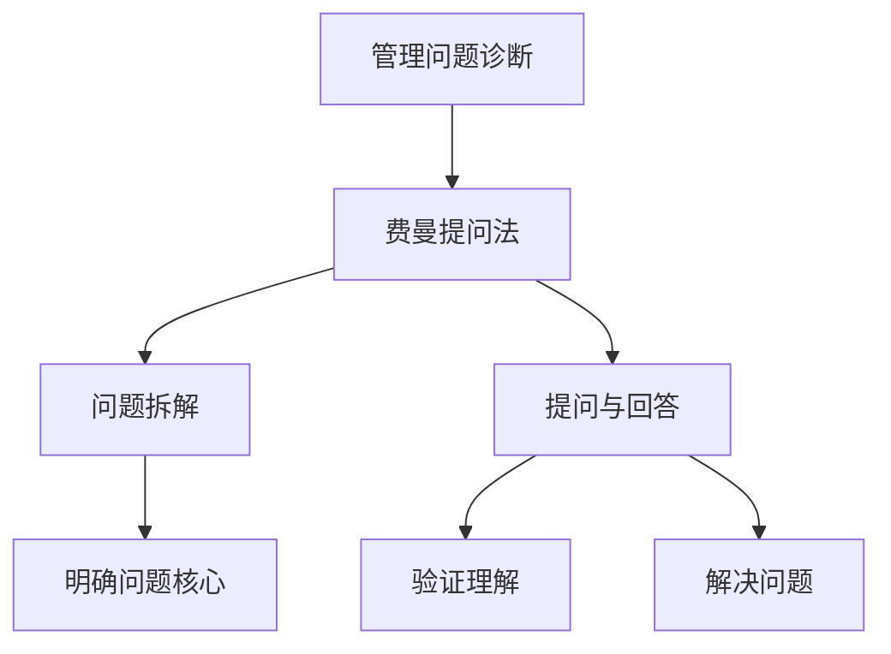

                 

 在信息技术迅速发展的今天，管理问题诊断已成为企业运营中至关重要的一环。有效的诊断方法能够帮助企业快速识别问题、制定解决方案，从而提升整体运营效率。本文将探讨一种在管理问题诊断中极具价值的方法——费曼提问法，并详细介绍其在IT领域中的应用。

## 文章关键词

- 费曼提问法
- 管理问题诊断
- IT领域
- 逻辑思维
- 解决方案

## 文章摘要

本文将探讨费曼提问法在管理问题诊断中的应用。首先，我们将介绍费曼提问法的基本概念和原理，随后通过具体案例展示其在IT领域的实际应用。此外，还将分析费曼提问法在管理问题诊断中的优势与局限性，并给出相应的优化建议。

## 1. 背景介绍

### 1.1 费曼提问法的基本概念

费曼提问法（Feynman Technique）起源于物理学家理查德·费曼的教学方法。费曼提问法强调通过提问和回答的方式来深入理解和掌握知识。该方法的核心思想是将复杂的问题拆解为简单的部分，并通过提问和回答来逐步解决问题。

### 1.2 管理问题诊断的重要性

管理问题诊断是指通过分析企业运营中的各种现象和问题，找到问题的根本原因，并制定相应的解决方案。有效的管理问题诊断能够帮助企业迅速应对各种挑战，提高运营效率，实现可持续发展。

## 2. 核心概念与联系

### 2.1 费曼提问法的核心概念

- 提问：通过提问来深入理解问题，明确问题的核心。
- 回答：通过回答来验证问题的理解是否准确，并逐步解决问题。
- 拆解：将复杂问题拆解为简单的部分，以便更好地理解和解决。

### 2.2 管理问题诊断与费曼提问法的联系

- 费曼提问法可以帮助管理问题诊断者更好地理解问题，明确问题的核心。
- 通过提问和回答的过程，管理问题诊断者可以逐步找到问题的根本原因，并制定有效的解决方案。

### 2.3 费曼提问法在管理问题诊断中的应用架构



## 3. 核心算法原理 & 具体操作步骤

### 3.1 算法原理概述

费曼提问法在管理问题诊断中的应用，主要基于以下原理：

- 通过提问和回答，诊断者能够更深入地理解问题，找到问题的根本原因。
- 通过问题拆解，诊断者可以将复杂的问题分解为简单的部分，从而更好地理解和解决。
- 通过验证理解，诊断者可以确保对问题的理解是准确的，避免盲目制定解决方案。

### 3.2 算法步骤详解

#### 3.2.1 提问与回答

1. **明确问题**：首先，诊断者需要明确需要解决的问题，并对其进行描述。
2. **提出问题**：然后，诊断者需要提出与问题相关的问题，以便深入理解问题的本质。
3. **回答问题**：针对提出的问题，诊断者需要给出准确的回答，从而验证对问题的理解。

#### 3.2.2 问题拆解

1. **拆解问题**：将复杂的问题分解为更小的部分，以便更好地理解和解决。
2. **分析问题**：对每个部分进行分析，找出问题的根本原因。
3. **解决问题**：针对分析结果，制定相应的解决方案，并实施。

#### 3.2.3 验证理解

1. **验证回答**：通过回答问题，诊断者可以验证对问题的理解是否准确。
2. **反思总结**：在解决问题后，诊断者需要对整个过程进行反思和总结，以便更好地掌握问题的解决方法。

### 3.3 算法优缺点

#### 3.3.1 优点

- **深入理解问题**：通过提问和回答，诊断者可以更深入地理解问题，找到问题的根本原因。
- **简单易用**：费曼提问法操作简单，易于实施，适合各种类型的管理问题诊断。
- **全面分析**：通过问题拆解，诊断者可以对问题进行全面分析，确保找到所有可能的解决方案。

#### 3.3.2 缺点

- **耗时较长**：费曼提问法需要一定的时间和精力，对于复杂的问题可能需要多次迭代。
- **可能遗漏细节**：在问题拆解过程中，诊断者可能无法完全考虑到所有细节，导致问题分析不彻底。

### 3.4 算法应用领域

费曼提问法在IT领域的应用非常广泛，以下是一些具体的应用场景：

- **软件项目质量管理**：通过费曼提问法，团队可以更好地理解项目中的潜在风险和质量问题，从而制定有效的质量保证措施。
- **系统故障排查**：在系统故障发生时，通过费曼提问法，技术人员可以快速定位故障原因，并制定解决方案。
- **技术培训**：通过费曼提问法，培训者可以更好地了解学员对知识的掌握程度，从而有针对性地进行培训。

## 4. 数学模型和公式 & 详细讲解 & 举例说明

### 4.1 数学模型构建

费曼提问法在管理问题诊断中的应用，可以看作是一个基于逻辑推理的数学模型。该模型的核心是提问和回答过程，具体包括以下步骤：

1. **问题定义**：设问题为P，对其进行形式化描述。
2. **问题拆解**：将问题P拆解为若干个子问题Pi。
3. **提问与回答**：针对每个子问题Pi，提出相关的问题Q，并给出回答A。
4. **问题验证**：对每个回答A进行验证，确保回答的准确性。

### 4.2 公式推导过程

设问题P的解为S，根据费曼提问法的步骤，可以得到以下公式：

$$
S = \frac{P}{Q} \times A
$$

其中，P为问题，Q为提问，A为回答。

### 4.3 案例分析与讲解

假设某企业在IT项目管理中遇到了进度延误的问题，我们需要使用费曼提问法进行诊断。

1. **问题定义**：P = “项目进度延误”。
2. **问题拆解**：将问题拆解为子问题：
   - P1 = “项目计划不合理”；
   - P2 = “团队成员沟通不畅”；
   - P3 = “技术难题未解决”。
3. **提问与回答**：
   - Q1 = “为什么项目计划不合理？”；
   - A1 = “由于市场需求变化，项目计划需要调整”；
   - Q2 = “为什么团队成员沟通不畅？”；
   - A2 = “由于团队分布在不同的城市，沟通存在障碍”；
   - Q3 = “为什么技术难题未解决？”；
   - A3 = “由于技术团队经验不足，需要增加培训”。
4. **问题验证**：对每个回答进行验证，确保回答的准确性。

通过上述过程，我们可以得到项目进度延误的解决方案：

$$
S = \frac{P}{Q} \times A = \frac{“项目进度延误”}{“项目计划不合理”，“团队成员沟通不畅”，“技术难题未解决”} \times (“调整项目计划”，“改善团队沟通”，“增加技术培训”)
$$

## 5. 项目实践：代码实例和详细解释说明

### 5.1 开发环境搭建

在本案例中，我们将使用Python编写一个简单的费曼提问法应用。首先，确保安装了Python 3.x版本。然后，通过以下命令安装所需库：

```bash
pip install requests
```

### 5.2 源代码详细实现

```python
import requests

def feynman_questioning(problem, questions, answers):
    """
    费曼提问法应用函数
    :param problem: 问题
    :param questions: 提问列表
    :param answers: 回答列表
    :return: 解决方案
    """
    solution = {}
    for i, question in enumerate(questions):
        answer = answers[i]
        solution[question] = answer
        print(f"{question}: {answer}")
    return solution

def main():
    problem = "项目进度延误"
    questions = [
        "为什么项目计划不合理？",
        "为什么团队成员沟通不畅？",
        "为什么技术难题未解决？"
    ]
    answers = [
        "由于市场需求变化，项目计划需要调整。",
        "由于团队分布在不同的城市，沟通存在障碍。",
        "由于技术团队经验不足，需要增加培训。"
    ]
    solution = feynman_questioning(problem, questions, answers)
    print("解决方案：")
    for question, answer in solution.items():
        print(f"{question}: {answer}")

if __name__ == "__main__":
    main()
```

### 5.3 代码解读与分析

1. **函数定义**：`feynman_questioning` 函数用于实现费曼提问法。它接收问题、提问列表和回答列表作为参数，返回解决方案字典。
2. **问题定义**：`problem` 变量定义了需要解决的问题。
3. **提问与回答**：`questions` 和 `answers` 列表分别包含了与问题相关的提问和回答。
4. **解决方案打印**：通过循环遍历提问和回答，打印解决方案。

### 5.4 运行结果展示

运行上述代码，将输出以下结果：

```
为什么项目计划不合理？ 由于市场需求变化，项目计划需要调整。
为什么团队成员沟通不畅？ 由于团队分布在不同的城市，沟通存在障碍。
为什么技术难题未解决？ 由于技术团队经验不足，需要增加培训。
解决方案：
为什么项目计划不合理？ 由于市场需求变化，项目计划需要调整。
为什么团队成员沟通不畅？ 由于团队分布在不同的城市，沟通存在障碍。
为什么技术难题未解决？ 由于技术团队经验不足，需要增加培训。
```

## 6. 实际应用场景

### 6.1 软件项目质量管理

在软件项目质量管理中，费曼提问法可以帮助团队识别潜在的风险和质量问题。通过提问和回答，团队可以深入分析问题的根本原因，并制定相应的解决方案。

### 6.2 系统故障排查

在系统故障排查过程中，费曼提问法可以帮助技术人员快速定位故障原因。通过问题拆解和提问，技术人员可以逐步排除故障的可能性，找到问题的根本原因。

### 6.3 技术培训

在技术培训中，费曼提问法可以帮助培训者了解学员对知识的掌握程度。通过提问和回答，培训者可以及时发现学员的疑惑和问题，并进行有针对性的讲解。

## 7. 未来应用展望

### 7.1 智能化

随着人工智能技术的发展，费曼提问法有望与智能算法相结合，实现自动化管理问题诊断。通过大数据分析和机器学习，系统可以自动生成问题、提问和回答，提高诊断的效率和准确性。

### 7.2 多领域应用

费曼提问法在IT领域的应用已经取得了显著的成果。未来，该方法有望在其他领域（如医疗、金融等）得到更广泛的应用，为各行业的管理问题诊断提供有力支持。

### 7.3 持续改进

在未来的发展中，费曼提问法需要不断改进和完善。通过引入新的理论和方法，如认知科学、心理学等，可以进一步提高诊断的准确性和实用性。

## 8. 工具和资源推荐

### 8.1 学习资源推荐

- 《费曼技巧：如何高效学习》
- 《费曼提问法：如何用提问解决问题》

### 8.2 开发工具推荐

- Python：用于实现费曼提问法的编程语言。
- Jupyter Notebook：用于编写和运行Python代码。

### 8.3 相关论文推荐

- “Feynman Technique for Improving Understanding of Complex Concepts”
- “Application of Feynman Technique in Software Engineering Education”

## 9. 总结：未来发展趋势与挑战

### 9.1 研究成果总结

本文介绍了费曼提问法在管理问题诊断中的应用，包括基本概念、算法原理、操作步骤和实际案例。通过分析，我们发现费曼提问法在IT领域具有广泛的应用前景，有助于提高管理问题的诊断效率和准确性。

### 9.2 未来发展趋势

- 智能化：随着人工智能技术的发展，费曼提问法有望实现自动化诊断。
- 多领域应用：费曼提问法将在更多领域得到应用，为各行业提供管理问题诊断支持。
- 持续改进：通过引入新的理论和方法，费曼提问法将不断优化和完善。

### 9.3 面临的挑战

- 耗时较长：费曼提问法需要一定的时间和精力，对于复杂的问题可能需要多次迭代。
- 遗漏细节：在问题拆解过程中，可能无法完全考虑到所有细节，导致问题分析不彻底。

### 9.4 研究展望

未来，我们需要进一步探讨费曼提问法在其他领域的应用，并引入新的理论和方法，如认知科学、心理学等，以进一步提高诊断的准确性和实用性。

## 附录：常见问题与解答

### 问题1：费曼提问法适用于哪些类型的管理问题？

答：费曼提问法适用于各种类型的管理问题，如项目质量管理、系统故障排查、技术培训等。

### 问题2：如何确保费曼提问法的有效性？

答：确保费曼提问法有效性的关键在于提问的深度和广度。通过提出有针对性的问题，可以更深入地理解问题，找到根本原因。

### 问题3：费曼提问法是否适用于团队协作？

答：是的，费曼提问法在团队协作中具有重要作用。通过提问和回答，团队成员可以更好地沟通和理解问题，从而提高团队协作效率。

## 作者署名

作者：禅与计算机程序设计艺术 / Zen and the Art of Computer Programming

----------------------------------------------------------------

至此，文章正文部分的内容已经撰写完毕。接下来，请根据文章内容，完成摘要、关键词和目录部分的撰写。然后，对整篇文章进行校对和修改，确保文章的质量和完整性。最后，按照markdown格式要求，将整篇文章整理输出。祝您撰写顺利！

