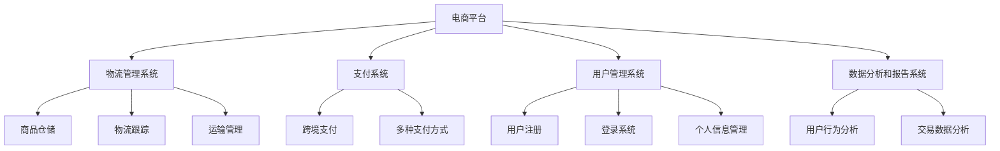

                 

关键词：跨境电商、全盘项目开发、项目管理、技术架构、算法原理、数学模型、项目实践、开发工具、未来展望

## 摘要

本文将深入探讨跨境电商全盘项目开发与管理实践。首先，我们回顾了跨境电商的发展背景，随后介绍了项目开发的核心概念与架构。接着，我们详细解析了核心算法原理与数学模型，并通过实际代码实例展示了项目的实施过程。文章的最后部分探讨了跨境电商在实际应用场景中的价值与未来展望，以及为项目开发者推荐了相应的学习资源和工具。

## 1. 背景介绍

跨境电商，即电子商务跨越国界进行的商业活动，近年来在全球范围内迅猛发展。随着互联网技术的进步和全球贸易的便利化，跨境电商成为企业拓展国际市场的重要手段。据统计，跨境电商交易额在全球电商市场中的占比逐年上升，预计未来几年这一趋势将更加明显。

### 1.1 跨境电商的发展历程

跨境电商的兴起可以追溯到20世纪90年代末。随着互联网的普及，国际贸易逐渐从传统的线下渠道转移到线上。最初，跨境电商主要以B2B（企业对企业）的形式展开，随后逐渐发展出B2C（企业对消费者）和C2C（消费者对消费者）等模式。进入21世纪，跨境电商迎来了爆发式增长，尤其在中国、美国、欧洲等主要市场中占据重要地位。

### 1.2 当前跨境电商市场的现状

当前，跨境电商市场呈现出以下特点：

1. **市场规模不断扩大**：随着消费者对跨境电商的认知度和接受度提高，市场交易额持续增长。
2. **多元化发展**：跨境电商不仅涵盖传统商品，还延伸到跨境电商服务、跨境电商供应链等新兴领域。
3. **技术驱动**：大数据、人工智能、区块链等技术在跨境电商中的应用，提升了交易效率和用户体验。
4. **政策支持**：各国政府纷纷出台相关政策，鼓励跨境电商发展，优化跨境贸易环境。

## 2. 核心概念与联系

在跨境电商项目开发中，理解核心概念与架构是至关重要的。以下是几个关键概念及其相互联系：

### 2.1 跨境电商系统的核心组件

1. **电商平台**：提供商品展示、订单处理、支付结算等核心功能。
2. **物流管理系统**：负责商品仓储、物流跟踪、运输管理等。
3. **支付系统**：实现跨境支付，支持多种货币和支付方式。
4. **用户管理系统**：处理用户注册、登录、个人信息管理等。
5. **数据分析和报告系统**：对用户行为、交易数据进行分析，为决策提供依据。

### 2.2 跨境电商系统架构图

以下是一个简化的跨境电商系统架构图，使用Mermaid语言描述：

### 2.3 核心概念之间的联系

跨境电商系统的各个组件之间紧密关联，协同工作。例如，电商平台通过支付系统处理订单，生成支付请求，支付系统完成支付后，将结果反馈给电商平台，从而完成整个交易流程。物流管理系统实时更新订单状态，并将物流信息反馈给电商平台，确保用户及时了解订单动态。用户管理系统则负责管理用户数据，确保用户可以顺利注册、登录和进行交易。数据分析和报告系统则对用户行为和交易数据进行分析，为电商平台提供决策支持。

## 3. 核心算法原理 & 具体操作步骤

### 3.1 算法原理概述

在跨境电商项目中，核心算法主要涉及商品推荐、价格优化、物流路径规划等方面。以下是这些算法的基本原理：

### 3.2 商品推荐算法

商品推荐算法是电商平台的核心功能之一，旨在提高用户购物体验和销售转化率。常见算法包括协同过滤、矩阵分解、深度学习等。

- **协同过滤**：通过分析用户的历史行为，找出相似用户，然后根据相似用户的购买记录推荐商品。
- **矩阵分解**：将用户-商品评分矩阵分解为用户特征矩阵和商品特征矩阵，通过计算相似度进行推荐。
- **深度学习**：利用神经网络模型，通过训练用户和商品的特征表示，实现个性化推荐。

### 3.3 价格优化算法

价格优化算法旨在确定商品的最优价格，以最大化利润或市场份额。常见算法包括价格弹性模型、竞争价格分析、动态定价等。

- **价格弹性模型**：通过分析需求量和价格之间的关系，确定不同价格水平下的需求量，从而制定合理的价格策略。
- **竞争价格分析**：分析竞争对手的价格水平，结合市场情况，制定具有竞争力的价格。
- **动态定价**：根据实时市场数据，动态调整商品价格，以实现利润最大化或市场份额提升。

### 3.4 物流路径规划算法

物流路径规划算法旨在优化商品的运输路径，降低物流成本，提高运输效率。常见算法包括最短路径算法、车辆路径规划算法、多目标优化等。

- **最短路径算法**：通过计算两点之间的最短路径，确定最优运输路线。
- **车辆路径规划算法**：在满足车辆容量和路径约束的条件下，规划最优的运输路线。
- **多目标优化**：考虑多个目标（如成本、时间、服务质量等），通过优化算法找到平衡各目标的最佳路径。

### 3.5 算法优缺点

- **商品推荐算法**：协同过滤和矩阵分解算法在处理大数据集时表现较好，但需要大量计算资源；深度学习算法则可以处理更复杂的特征，但训练过程相对较慢。
- **价格优化算法**：价格弹性模型和竞争价格分析算法适用于稳定的市场环境，动态定价算法则更适用于动态市场。
- **物流路径规划算法**：最短路径算法简单高效，但可能无法处理复杂的约束条件；车辆路径规划算法和

