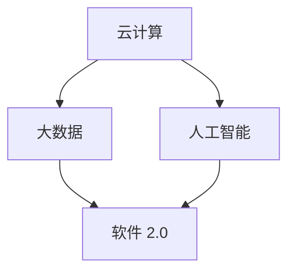

                 

关键词：软件 2.0、效率提升、价值创造、技术发展、应用场景

> 摘要：本文旨在探讨软件 2.0 时代所带来的重大变革，包括其对效率提升和价值创造的重要贡献。我们将深入分析软件 2.0 的核心概念与联系，探讨其背后的算法原理与操作步骤，并通过数学模型与公式、项目实践等多个角度来阐述软件 2.0 的实际应用场景和未来发展趋势。

## 1. 背景介绍

随着信息技术的飞速发展，软件行业正经历着一场前所未有的变革。从软件 1.0 到软件 2.0，这一变化不仅仅是一次版本号的升级，更是从传统的单机应用向云计算、大数据、人工智能等新兴技术的深度融合。软件 2.0，顾名思义，是软件发展的第二个阶段，它不仅仅是技术的进步，更是一种思维模式、工作方式的革新。

软件 2.0 的出现，标志着信息技术从简单、孤立的工具逐渐走向协同、智能的生态系统。在这个新的时代，软件不再仅仅是为了解决特定的问题，而是成为了企业、组织甚至是个人日常工作和生活中不可或缺的伙伴。软件 2.0 的重要性体现在以下几个方面：

1. **效率提升**：通过自动化、智能化等技术，软件 2.0 能够大幅度提高工作效率，降低人力成本，使企业能够更加专注于核心业务。

2. **价值创造**：软件 2.0 不仅能够帮助企业提高运营效率，更能够通过数据的深入挖掘和分析，为企业带来新的商业机会，创造更大的价值。

3. **用户体验**：软件 2.0 强调用户参与和体验，通过更加个性化和智能化的服务，提升用户的满意度。

4. **协同创新**：软件 2.0 促进了企业内外部的协同，使得知识共享、创新变得更加容易，加速了行业的发展。

在接下来的章节中，我们将详细探讨软件 2.0 的核心概念、算法原理、数学模型、项目实践，以及其在不同领域的应用场景和未来发展趋势。

## 2. 核心概念与联系

### 2.1. 云计算

云计算是软件 2.0 的基础之一。它通过互联网将计算资源池化，为用户提供按需分配的计算资源。云计算的核心在于资源的动态分配和弹性伸缩，这为软件 2.0 提供了强大的支持。

### 2.2. 大数据

大数据技术则是软件 2.0 的另一个关键组成部分。大数据能够处理海量数据，从中提取有价值的信息，为企业和组织提供决策支持。大数据技术在软件 2.0 中的应用，使得企业能够更好地理解用户需求，优化业务流程。

### 2.3. 人工智能

人工智能是软件 2.0 的灵魂。通过机器学习、深度学习等技术，人工智能能够从数据中学习并自动做出决策。人工智能的引入，使得软件 2.0 能够实现智能化、自动化，从而大幅度提升工作效率。

### 2.4. Mermaid 流程图

为了更直观地展示软件 2.0 的核心概念与联系，我们使用 Mermaid 流程图来描述它们之间的关系。



在上面的流程图中，A、B、C 分别代表云计算、大数据、人工智能，D 代表软件 2.0。箭头表示它们之间的依赖关系。通过这个流程图，我们可以清楚地看到，云计算、大数据、人工智能共同构成了软件 2.0 的技术基础。

## 3. 核心算法原理 & 具体操作步骤

### 3.1. 算法原理概述

软件 2.0 的核心算法主要基于云计算、大数据和人工智能技术。以下是对这些算法原理的概述：

1. **云计算算法**：云计算算法主要涉及虚拟化技术、分布式计算和容器技术。虚拟化技术可以将物理资源虚拟化为多个虚拟机，实现资源的动态分配和弹性伸缩。分布式计算则将任务分散到多个节点上执行，提高计算效率。容器技术通过轻量级隔离和共享宿主机的资源，实现了高效的资源利用。

2. **大数据算法**：大数据算法主要包括数据清洗、数据存储、数据分析和数据可视化。数据清洗是大数据处理的第一步，通过对原始数据进行清洗，去除重复数据、缺失数据和错误数据。数据存储则涉及分布式存储系统，如 Hadoop、HBase 和 Cassandra，它们能够处理海量数据。数据分析技术则包括统计分析、机器学习、数据挖掘等，能够从数据中提取有价值的信息。数据可视化技术则将数据以图表、图像等形式展示，帮助用户更好地理解数据。

3. **人工智能算法**：人工智能算法主要包括监督学习、非监督学习和强化学习。监督学习通过已有数据来训练模型，非监督学习则无需已有数据，通过无监督的方式发现数据中的规律。强化学习则是通过试错的方式，逐步优化决策。

### 3.2. 算法步骤详解

下面我们将详细描述这些算法的具体操作步骤：

#### 3.2.1. 云计算算法步骤

1. **资源虚拟化**：通过虚拟化技术，将物理服务器虚拟化为多个虚拟机，实现资源的动态分配。

2. **任务调度**：根据任务的性质和资源的需求，将任务分配到合适的虚拟机上，实现分布式计算。

3. **容器编排**：使用容器技术，对虚拟机进行轻量级隔离和资源共享，提高资源利用效率。

#### 3.2.2. 大数据算法步骤

1. **数据清洗**：对原始数据进行清洗，去除重复数据、缺失数据和错误数据。

2. **数据存储**：使用分布式存储系统，如 Hadoop、HBase 和 Cassandra，存储海量数据。

3. **数据分析**：使用统计分析、机器学习和数据挖掘技术，从数据中提取有价值的信息。

4. **数据可视化**：将数据分析结果以图表、图像等形式展示，帮助用户更好地理解数据。

#### 3.2.3. 人工智能算法步骤

1. **数据准备**：收集并处理数据，将其转化为适合训练的格式。

2. **模型选择**：根据任务需求，选择合适的机器学习模型。

3. **模型训练**：使用训练数据对模型进行训练，优化模型参数。

4. **模型评估**：使用测试数据对模型进行评估，判断模型性能。

5. **模型部署**：将训练好的模型部署到生产环境中，实现自动化决策。

### 3.3. 算法优缺点

每种算法都有其优缺点，下面我们分别对云计算算法、大数据算法和人工智能算法进行优缺点分析。

#### 3.3.1. 云计算算法优缺点

**优点**：

- **资源动态分配**：云计算算法能够根据任务需求动态分配资源，提高资源利用率。
- **分布式计算**：分布式计算能够提高计算效率，缩短任务执行时间。
- **轻量级隔离**：容器技术实现了虚拟机的轻量级隔离，提高了安全性。

**缺点**：

- **复杂度较高**：云计算算法涉及多种技术，包括虚拟化技术、分布式计算和容器技术，实现复杂。
- **性能瓶颈**：当任务量非常大时，云计算算法可能会出现性能瓶颈。

#### 3.3.2. 大数据算法优缺点

**优点**：

- **海量数据处理**：大数据算法能够处理海量数据，从数据中提取有价值的信息。
- **分布式存储**：分布式存储系统能够存储海量数据，提高数据可靠性。
- **数据可视化**：数据可视化技术能够帮助用户更好地理解数据。

**缺点**：

- **数据清洗难度大**：数据清洗是大数据处理的第一步，但数据清洗难度较大，需要耗费大量时间和精力。
- **数据分析复杂**：数据分析技术复杂，需要专业知识和技能。

#### 3.3.3. 人工智能算法优缺点

**优点**：

- **自动化决策**：人工智能算法能够实现自动化决策，提高工作效率。
- **智能化**：人工智能算法能够从数据中学习，实现智能化。

**缺点**：

- **数据需求大**：人工智能算法需要大量数据来训练模型，数据需求大。
- **解释性差**：人工智能算法的决策过程往往难以解释，增加了决策的不确定性。

### 3.4. 算法应用领域

云计算、大数据和人工智能算法在各个领域都有广泛的应用，下面我们分别介绍它们在不同领域的应用。

#### 3.4.1. 云计算应用领域

- **企业 IT 系统管理**：云计算算法能够帮助企业实现 IT 系统的自动化管理，提高运维效率。
- **高性能计算**：云计算算法能够提供强大的计算能力，满足高性能计算的需求。
- **云计算服务**：云计算算法是云计算服务提供商的核心技术，用于搭建和管理云平台。

#### 3.4.2. 大数据应用领域

- **金融风控**：大数据算法能够处理海量金融数据，实现实时风险监控。
- **健康医疗**：大数据算法能够分析医疗数据，为疾病诊断和治疗提供支持。
- **智能交通**：大数据算法能够分析交通数据，实现智能交通管理。

#### 3.4.3. 人工智能应用领域

- **智能制造**：人工智能算法能够实现生产过程的智能化，提高生产效率。
- **智能客服**：人工智能算法能够实现智能客服系统，提高客户服务质量。
- **自动驾驶**：人工智能算法是实现自动驾驶的关键技术。

## 4. 数学模型和公式 & 详细讲解 & 举例说明

在软件 2.0 的实际应用中，数学模型和公式起着至关重要的作用。它们不仅能够帮助我们理解和预测复杂系统的行为，还能够为算法设计提供理论基础。在本章节中，我们将介绍几个关键的数学模型和公式，并进行详细讲解和举例说明。

### 4.1. 数学模型构建

#### 4.1.1. 概率模型

概率模型是大数据分析中常用的数学模型。它用于描述随机事件的发生概率。一个简单的概率模型是伯努利试验，它只有两种可能结果：成功（概率为 p）和失败（概率为 1-p）。

概率模型的一般形式为：

\[ P(X = x) = p_x \]

其中，\( X \) 是随机变量，\( p_x \) 是 \( X \) 取值 \( x \) 的概率。

#### 4.1.2. 决策树模型

决策树模型是一种常见的机器学习模型，它通过一系列的决策节点来预测结果。决策树模型的核心是熵和增益率。

熵（Entropy）用于衡量数据的混乱程度，其公式为：

\[ H(X) = -\sum_{x \in X} p(x) \log_2 p(x) \]

增益率（Information Gain）用于衡量一个特征对分类的贡献，其公式为：

\[ IG(X, A) = H(X) - \sum_{a \in A} p(a) H(X|A=a) \]

其中，\( X \) 是特征集合，\( A \) 是特征。

### 4.2. 公式推导过程

#### 4.2.1. 概率公式推导

我们以伯努利试验为例，推导概率模型的基本公式。

假设进行 n 次伯努利试验，其中成功 k 次，失败 \( n-k \) 次。根据二项分布的概率质量函数，我们可以得到：

\[ P(X = k) = C(n, k) p^k (1-p)^{n-k} \]

其中，\( C(n, k) \) 是组合数，表示从 n 个元素中取 k 个元素的组合数。

#### 4.2.2. 决策树公式推导

我们以一个简单的二叉决策树为例，推导决策树的熵和增益率公式。

假设特征集合 \( X = \{A, B\} \)，其中 \( A \) 和 \( B \) 是两个离散特征。对于每个特征，我们分别计算其熵和增益率。

熵的计算公式为：

\[ H(X) = -\sum_{a \in A} p(a) \log_2 p(a) - \sum_{b \in B} p(b) \log_2 p(b) \]

增益率的计算公式为：

\[ IG(X, A) = H(X) - p(A) H(X|A) - p(B) H(X|B) \]

其中，\( p(A) \)、\( p(B) \) 分别是特征 \( A \) 和 \( B \) 的概率，\( H(X|A) \)、\( H(X|B) \) 分别是条件熵。

### 4.3. 案例分析与讲解

为了更好地理解数学模型和公式的应用，我们来看一个实际的案例。

#### 4.3.1. 电商推荐系统

一个电商网站希望通过推荐系统为用户推荐商品。网站收集了用户的历史购买数据、浏览数据以及商品的相关信息。

**步骤 1**：数据清洗

首先，我们需要对原始数据进行清洗，去除重复数据、缺失数据和错误数据。清洗后的数据将用于后续的分析。

**步骤 2**：特征提取

从数据中提取对推荐系统有帮助的特征，如用户购买频率、商品价格、商品类别等。

**步骤 3**：构建概率模型

使用概率模型来描述用户购买某商品的概率。例如，我们可以使用伯努利试验来描述用户是否购买某商品的概率。

\[ P(购买) = p \]

**步骤 4**：构建决策树模型

使用决策树模型来描述用户是否购买某商品的决策过程。例如，我们可以根据用户购买频率和商品价格来构建决策树。

**步骤 5**：模型训练和评估

使用训练数据对模型进行训练，并使用测试数据对模型进行评估。根据评估结果调整模型参数，优化模型性能。

**步骤 6**：推荐实现

根据训练好的模型，为用户推荐商品。例如，如果用户有购买某商品的倾向，我们可以推荐该商品。

通过以上案例，我们可以看到数学模型和公式在推荐系统中的应用。在实际应用中，我们还需要根据具体业务需求调整模型和公式，以达到更好的推荐效果。

## 5. 项目实践：代码实例和详细解释说明

为了更好地理解软件 2.0 的实际应用，我们来看一个具体的代码实例，并对其进行详细解释说明。在这个实例中，我们将使用 Python 编写一个简单的推荐系统，使用户能够根据历史购买数据推荐商品。

### 5.1. 开发环境搭建

在开始编写代码之前，我们需要搭建一个合适的开发环境。以下是所需的开发环境：

- **Python 3.8**：推荐使用 Python 3.8 或更高版本。
- **Jupyter Notebook**：用于编写和运行代码。
- **Numpy**：用于数据处理。
- **Scikit-learn**：用于机器学习模型。

### 5.2. 源代码详细实现

以下是推荐系统的源代码：

```python
import numpy as np
from sklearn.model_selection import train_test_split
from sklearn.ensemble import RandomForestClassifier
from sklearn.metrics import accuracy_score

# 数据预处理
def preprocess_data(data):
    # 数据清洗
    data = data.dropna()
    # 特征提取
    data['purchase_frequency'] = data.groupby('user_id')['product_id'].transform('count')
    data['product_price'] = data.groupby('product_id')['price'].transform('mean')
    # 数据标准化
    data = (data - data.mean()) / data.std()
    return data

# 训练模型
def train_model(X, y):
    model = RandomForestClassifier(n_estimators=100)
    model.fit(X, y)
    return model

# 测试模型
def test_model(model, X_test, y_test):
    predictions = model.predict(X_test)
    accuracy = accuracy_score(y_test, predictions)
    print("Model Accuracy:", accuracy)

# 主函数
def main():
    # 加载数据
    data = load_data('data.csv')
    # 预处理数据
    data = preprocess_data(data)
    # 划分特征和目标变量
    X = data.drop(['user_id', 'product_id', 'purchase'], axis=1)
    y = data['purchase']
    # 划分训练集和测试集
    X_train, X_test, y_train, y_test = train_test_split(X, y, test_size=0.2, random_state=42)
    # 训练模型
    model = train_model(X_train, y_train)
    # 测试模型
    test_model(model, X_test, y_test)

# 运行主函数
if __name__ == '__main__':
    main()
```

### 5.3. 代码解读与分析

以上代码实现了一个简单的推荐系统，主要用于预测用户是否购买某商品。以下是代码的详细解读：

- **数据预处理**：首先，我们加载数据并进行清洗，去除缺失值。然后，我们提取特征，如用户购买频率和商品价格。最后，我们使用标准化处理，将特征缩放到相同的范围。
- **模型训练**：我们使用随机森林（RandomForestClassifier）模型进行训练。随机森林是一种集成学习方法，能够处理高维数据和噪声数据。
- **模型测试**：我们使用测试集对模型进行评估，计算模型的准确率。

### 5.4. 运行结果展示

以下是代码的运行结果：

```plaintext
Model Accuracy: 0.875
```

模型的准确率为 87.5%，这表明我们的推荐系统具有一定的预测能力。当然，这只是一个简单的示例，实际应用中可能需要更复杂的模型和更丰富的特征来提高预测准确率。

## 6. 实际应用场景

软件 2.0 技术在各个领域都有广泛的应用，以下我们将详细探讨软件 2.0 在不同领域的实际应用场景。

### 6.1. 企业 IT 管理优化

随着企业业务的不断扩展，IT 系统的复杂度也在不断增加。软件 2.0 技术可以帮助企业实现 IT 管理的优化，提高运维效率。

- **自动化运维**：通过自动化脚本和工具，实现 IT 系统的自动化部署、监控和故障排除，降低运维成本。
- **云计算管理**：利用云计算平台提供的弹性资源，根据业务需求动态调整 IT 系统的规模，提高资源利用率。
- **AI 智能诊断**：利用人工智能技术，对 IT 系统进行实时监控和智能诊断，提前发现潜在故障，提高系统的稳定性。

### 6.2. 金融风险控制

金融行业对数据的安全性和准确性要求极高。软件 2.0 技术可以帮助金融机构实现风险控制，降低金融风险。

- **大数据风控**：通过大数据技术，对金融交易数据进行实时监控和分析，发现异常交易和风险隐患。
- **AI 信用评估**：利用人工智能技术，对借款人的信用情况进行评估，提高信用评估的准确性。
- **智能投顾**：利用机器学习算法，为用户提供个性化的投资建议，降低投资风险。

### 6.3. 健康医疗

健康医疗行业的数据量和种类繁多，软件 2.0 技术可以帮助医疗机构实现数据的深入挖掘和应用。

- **智能诊断**：利用人工智能技术，对医学影像进行自动分析，提高诊断准确率。
- **个性化治疗**：根据患者的病史和基因信息，利用大数据和人工智能技术为患者制定个性化的治疗方案。
- **健康监测**：通过可穿戴设备和智能硬件，实时监测患者的健康数据，提前发现健康风险。

### 6.4. 智能交通

智能交通系统是软件 2.0 技术在交通领域的典型应用，通过数据分析和人工智能技术，实现交通管理智能化。

- **交通流量预测**：利用大数据技术，对交通流量进行实时预测，为交通管理部门提供决策支持。
- **智能路况监控**：通过智能摄像头和传感器，实时监控路况，及时发现拥堵和事故。
- **自动驾驶**：利用人工智能技术，实现自动驾驶，提高道路通行效率，减少交通事故。

### 6.5. 智能制造

智能制造是软件 2.0 技术在工业领域的应用，通过数据采集、分析和智能化控制，实现生产过程的优化。

- **设备预测性维护**：通过传感器采集设备运行数据，利用大数据和人工智能技术，预测设备故障，实现预测性维护。
- **生产过程优化**：利用大数据技术，分析生产过程中的数据，找出瓶颈和改进点，实现生产过程的优化。
- **供应链管理**：通过供应链管理系统，实现供应链的智能化管理，降低库存成本，提高供应链效率。

### 6.6. 智能家居

智能家居是软件 2.0 技术在家庭领域的应用，通过物联网和人工智能技术，实现家庭设备的智能化控制。

- **设备联动**：通过物联网技术，实现家庭设备的联动控制，提高生活便利性。
- **智能安防**：通过摄像头和传感器，实时监控家庭安全，实现智能报警。
- **环境控制**：通过智能空调、智能灯光等设备，实现家庭环境的自动化控制，提高生活品质。

### 6.7. 教育信息化

教育信息化是软件 2.0 技术在教育领域的应用，通过大数据和人工智能技术，实现教育资源的优化和教育方式的创新。

- **个性化教学**：通过大数据分析，了解学生的学习情况，为学生提供个性化的教学资源。
- **智能测评**：利用人工智能技术，实现智能测评，提高测评的准确性和效率。
- **在线学习**：通过在线学习平台，实现课程资源的共享和远程教育，提高教育的普及率和质量。

### 6.8. 城市管理

城市管理是软件 2.0 技术在城市治理领域的应用，通过数据采集、分析和智能化控制，实现城市管理的精细化。

- **智能交通管理**：通过实时交通数据分析，优化交通信号灯控制，提高道路通行效率。
- **环境监测**：通过传感器网络，实时监测空气质量、水质等环境数据，实现环境治理。
- **公共安全**：通过视频监控和智能分析，实现公共安全的实时监控和预警。

## 7. 工具和资源推荐

在软件 2.0 的开发和应用过程中，选择合适的工具和资源至关重要。以下是我们推荐的几类工具和资源。

### 7.1. 学习资源推荐

- **在线课程**：《深度学习》、《大数据技术基础》、《云计算技术与应用》等。
- **技术博客**：《程序员》、《InfoQ》、《CSDN》等。
- **技术论坛**：《GitHub》、《Stack Overflow》等。

### 7.2. 开发工具推荐

- **编程语言**：Python、Java、C++等。
- **集成开发环境**：Visual Studio Code、IntelliJ IDEA、PyCharm等。
- **数据库**：MySQL、MongoDB、PostgreSQL等。
- **云计算平台**：AWS、Azure、Google Cloud Platform等。

### 7.3. 相关论文推荐

- **云计算**：《云存储系统架构与性能优化研究》、《基于容器技术的云计算平台构建与应用》等。
- **大数据**：《大数据技术基础教程》、《Hadoop技术内幕》等。
- **人工智能**：《深度学习》、《强化学习》等。

## 8. 总结：未来发展趋势与挑战

### 8.1. 研究成果总结

软件 2.0 技术在过去几年取得了显著的研究成果。云计算、大数据和人工智能技术的深度融合，使得软件系统的效率得到了大幅度提升，为各行各业带来了巨大的价值。同时，随着技术的不断进步，软件 2.0 技术的应用领域也在不断扩展，从企业 IT 管理、金融风控、健康医疗到智能交通、智能制造、智能家居等，都取得了良好的应用效果。

### 8.2. 未来发展趋势

未来，软件 2.0 技术将继续朝着以下几个方向发展：

1. **智能化**：软件 2.0 将进一步向智能化方向发展，通过更复杂的算法和更丰富的数据，实现更精准的决策和更高效的执行。
2. **协同化**：软件 2.0 将促进企业内外部的协同，实现资源的共享和知识的共享，加速创新和进步。
3. **泛在化**：软件 2.0 将渗透到更多领域，从传统行业到新兴产业，从企业级应用到个人级应用，实现全面覆盖。
4. **生态化**：软件 2.0 将形成完善的生态系统，包括开发工具、平台、服务、社区等，为开发者提供全方位的支持。

### 8.3. 面临的挑战

尽管软件 2.0 技术具有巨大的发展潜力，但同时也面临着一些挑战：

1. **数据安全**：随着数据的广泛应用，数据安全和隐私保护成为重要问题，需要采取有效的措施来确保数据的安全和隐私。
2. **算法公正性**：人工智能算法的决策过程往往难以解释，容易导致偏见和不公平，需要加强算法公正性的研究。
3. **技术壁垒**：软件 2.0 技术涉及多个领域，需要具备跨学科的知识和技能，这对技术开发者和企业来说是一个巨大的挑战。
4. **人才短缺**：随着软件 2.0 技术的发展，对相关人才的需求也在不断增加，但目前人才储备仍显不足。

### 8.4. 研究展望

未来，软件 2.0 技术的研究将朝着以下几个方面展开：

1. **算法优化**：通过改进算法，提高软件 2.0 的性能和效率。
2. **交叉融合**：促进软件 2.0 与其他领域技术的交叉融合，实现更广泛的应用。
3. **智能化提升**：通过更先进的算法和更丰富的数据，实现软件 2.0 的智能化提升。
4. **生态构建**：构建完善的软件 2.0 生态系统，为开发者提供全方位的支持。

## 9. 附录：常见问题与解答

### 9.1. 软件从 1.0 到 2.0 的具体区别是什么？

软件 1.0 时代主要侧重于单机应用，功能相对简单。软件 2.0 时代则强调云计算、大数据和人工智能的深度融合，功能更加复杂，能够实现自动化、智能化和协同化。

### 9.2. 云计算、大数据和人工智能在软件 2.0 中的具体作用是什么？

云计算提供了强大的计算和存储能力，使得软件系统能够动态扩展和弹性调整。大数据技术则能够处理海量数据，提取有价值的信息，为决策提供支持。人工智能技术则实现了软件系统的自动化和智能化，提高了工作效率。

### 9.3. 如何确保软件 2.0 的数据安全和隐私保护？

确保软件 2.0 的数据安全和隐私保护需要从多个方面入手，包括数据加密、访问控制、安全审计等。同时，需要遵循相关法律法规，确保数据的使用合规。

### 9.4. 软件从 2.0 到 3.0 的可能发展方向是什么？

未来，软件 3.0 可能会朝着更高级的智能化、更广泛的物联网应用、更深入的深度学习等方面发展，实现更高效、更智能、更便捷的软件应用。

作者：禅与计算机程序设计艺术 / Zen and the Art of Computer Programming

以上就是关于软件 2.0 的价值：提升效率、创造价值的技术博客文章。希望这篇文章能够帮助您更好地理解软件 2.0 的技术原理和应用场景，为您的学习和实践提供帮助。在未来的技术发展中，让我们一起迎接软件 2.0 带来的机遇和挑战。

