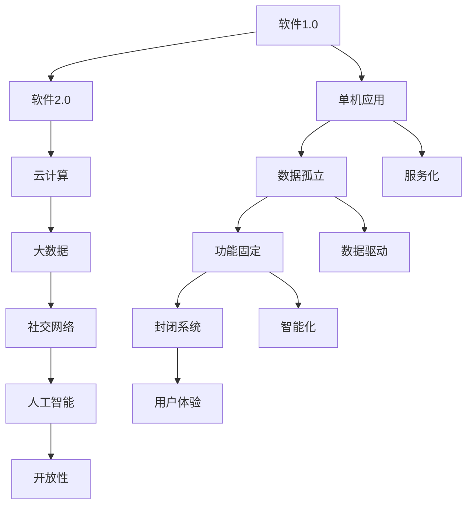

                 

关键词：软件2.0、效率、价值、技术创新、软件架构、AI应用

> 摘要：本文旨在探讨软件2.0时代的价值内涵，解析其对提升效率和创造价值的重要作用。通过对软件2.0核心概念的剖析，结合实际案例，文章将深入阐述软件2.0如何在各个领域助力产业升级与创新发展。

## 1. 背景介绍

随着信息技术的飞速发展，软件技术已经渗透到社会生活的方方面面。从最初的系统软件、应用软件，到如今的大数据和人工智能，软件技术在不断演进中，正引领着新一轮的产业革命。在这个背景下，软件2.0的概念逐渐被提出，并成为学术界和产业界关注的焦点。

软件2.0，顾名思义，是相对于软件1.0的下一代软件形式。软件1.0主要侧重于单机操作系统和应用软件的开发与使用，而软件2.0则更加注重网络的互联互通、数据的高效利用和智能化的服务模式。软件2.0时代的到来，标志着软件技术从单纯的工具性角色向更加深度的价值创造角色转变。

## 2. 核心概念与联系

### 2.1 软件2.0的定义

软件2.0，可以理解为一种全新的软件发展模式，其核心在于以下几个方面：

1. **云计算与大数据**：通过云计算平台，实现软件资源的动态分配和弹性扩展，充分利用大数据技术进行数据挖掘和分析，为用户提供个性化、精准的服务。
2. **社交网络**：软件2.0强调用户之间的互动和协作，通过社交网络平台，实现用户生成内容和用户间的互动，构建起强大的社交关系网络。
3. **人工智能**：借助人工智能技术，实现软件的智能化，从简单的规则驱动向数据驱动、智能决策转变。
4. **开放性**：软件2.0倡导开放的技术标准和协议，实现不同系统之间的无缝连接和数据共享。

### 2.2 软件2.0的核心原理

软件2.0的核心原理可以概括为以下几点：

1. **服务化**：将软件功能以服务的形式提供，实现软件的模块化和解耦合，方便系统的扩展和升级。
2. **数据驱动**：以数据为核心，通过数据的收集、存储、分析和利用，实现软件功能的智能化和个性化。
3. **智能化**：利用人工智能技术，实现软件的自适应、自学习和自主决策，提升软件的智能水平。
4. **用户体验**：以用户为中心，提供个性化的、高质量的软件服务，提升用户的满意度。

### 2.3 Mermaid 流程图



## 3. 核心算法原理 & 具体操作步骤

### 3.1 算法原理概述

软件2.0的核心算法主要涉及以下几个方面：

1. **数据挖掘算法**：用于从大数据中提取有价值的信息，支持个性化服务和智能决策。
2. **机器学习算法**：用于训练模型，实现软件的智能化和自适应能力。
3. **自然语言处理算法**：用于处理用户输入的自然语言，实现人机交互的智能化。

### 3.2 算法步骤详解

1. **数据收集**：通过传感器、用户输入等途径，收集大量的数据。
2. **数据预处理**：对收集到的数据进行清洗、转换和归一化，为后续分析做准备。
3. **特征提取**：从预处理后的数据中提取出有用的特征，用于训练模型。
4. **模型训练**：利用机器学习算法，对提取出的特征进行训练，生成模型。
5. **模型评估**：通过测试数据集，评估模型的性能，调整参数。
6. **模型应用**：将训练好的模型应用到实际的软件系统中，实现智能功能。

### 3.3 算法优缺点

1. **优点**：
   - **高效性**：通过算法，可以实现大规模数据的快速处理和分析。
   - **智能化**：算法可以实现软件的自适应和自主决策，提升软件的智能水平。
   - **个性化**：通过个性化服务，提升用户的满意度。

2. **缺点**：
   - **复杂性**：算法的实现和优化需要较高的技术门槛。
   - **数据隐私**：大规模数据的收集和处理，可能引发数据隐私问题。

### 3.4 算法应用领域

算法在软件2.0中的应用非常广泛，主要包括：

- **金融领域**：用于风险控制、客户画像、智能投资等。
- **电商领域**：用于推荐系统、用户行为分析等。
- **医疗领域**：用于疾病预测、健康管理等。
- **智能城市**：用于交通管理、能源管理、环境监测等。

## 4. 数学模型和公式 & 详细讲解 & 举例说明

### 4.1 数学模型构建

在软件2.0中，常见的数学模型包括：

1. **线性回归模型**：用于预测和分析线性关系。
2. **神经网络模型**：用于处理非线性关系和复杂的特征。
3. **决策树模型**：用于分类和回归问题。

### 4.2 公式推导过程

以线性回归模型为例，其公式推导过程如下：

1. **线性模型**：\( y = \beta_0 + \beta_1x \)
2. **最小二乘法**：通过最小化误差平方和，求得参数 \( \beta_0 \) 和 \( \beta_1 \)。

### 4.3 案例分析与讲解

以电商推荐系统为例，分析如何利用线性回归模型进行商品推荐。

1. **数据收集**：收集用户的历史购买数据，包括商品ID、用户ID、购买数量等。
2. **数据预处理**：对数据进行清洗和处理，提取出有用的特征。
3. **特征提取**：选取商品ID作为自变量，购买数量作为因变量。
4. **模型训练**：利用线性回归模型，对提取出的特征进行训练。
5. **模型评估**：通过测试数据集，评估模型的性能。
6. **模型应用**：根据训练好的模型，预测用户的购买行为，进行商品推荐。

## 5. 项目实践：代码实例和详细解释说明

### 5.1 开发环境搭建

- **Python环境**：安装Python 3.8及以上版本。
- **依赖库**：安装numpy、scikit-learn等库。

### 5.2 源代码详细实现

```python
import numpy as np
from sklearn.linear_model import LinearRegression
from sklearn.model_selection import train_test_split

# 数据收集
X = np.array([[1], [2], [3], [4], [5]])
y = np.array([1, 2, 3, 4, 5])

# 数据预处理
X_train, X_test, y_train, y_test = train_test_split(X, y, test_size=0.2, random_state=42)

# 特征提取
model = LinearRegression()
model.fit(X_train, y_train)

# 模型评估
print("模型评估结果：", model.score(X_test, y_test))

# 模型应用
print("预测结果：", model.predict(np.array([[6]])))
```

### 5.3 代码解读与分析

- **数据收集**：从示例中可以看到，我们收集了5个样本的数据，包括商品ID和购买数量。
- **数据预处理**：使用train_test_split函数，将数据集划分为训练集和测试集。
- **特征提取**：选取商品ID作为自变量，购买数量作为因变量。
- **模型训练**：使用LinearRegression模型进行训练。
- **模型评估**：使用score函数，评估模型在测试集上的性能。
- **模型应用**：使用predict函数，预测新的商品购买数量。

## 6. 实际应用场景

### 6.1 金融领域

在金融领域，软件2.0的价值体现在以下几个方面：

1. **风险管理**：利用大数据和机器学习算法，对风险进行预测和控制。
2. **个性化投资**：根据用户的风险偏好和投资目标，提供个性化的投资建议。
3. **智能投顾**：结合用户数据和市场数据，提供智能化的投资策略。

### 6.2 电商领域

在电商领域，软件2.0的价值体现在以下几个方面：

1. **推荐系统**：利用用户行为数据，实现个性化商品推荐。
2. **用户画像**：通过大数据分析，构建用户画像，提升用户体验。
3. **智能客服**：利用自然语言处理技术，实现智能客服，提升服务质量。

### 6.3 医疗领域

在医疗领域，软件2.0的价值体现在以下几个方面：

1. **疾病预测**：利用大数据和机器学习算法，预测疾病发生风险。
2. **健康管理**：通过健康数据的收集和分析，提供个性化的健康管理服务。
3. **智能诊断**：利用深度学习技术，实现疾病的自动诊断。

### 6.4 未来应用展望

未来，软件2.0将在更多领域发挥重要作用，包括：

1. **智能城市**：通过大数据和人工智能技术，实现智能交通、智能能源管理等。
2. **制造业**：通过物联网和大数据技术，实现智能生产、智能供应链等。
3. **教育领域**：通过大数据和人工智能技术，实现个性化教育、智能测评等。

## 7. 工具和资源推荐

### 7.1 学习资源推荐

- **《机器学习》**：周志华著，清华大学出版社，详细介绍机器学习的基本原理和方法。
- **《深度学习》**：Ian Goodfellow等著，电子工业出版社出版，深入讲解深度学习的技术和应用。
- **《大数据技术导论》**：刘铁岩著，清华大学出版社，系统介绍大数据技术的基本概念和应用。

### 7.2 开发工具推荐

- **Python**：简单易学，功能强大，适合初学者和专业人士。
- **Jupyter Notebook**：强大的交互式计算环境，方便进行数据分析与实验。
- **TensorFlow**：Google推出的开源深度学习框架，适合进行复杂的深度学习任务。

### 7.3 相关论文推荐

- **"Deep Learning for Text Classification"**：详细介绍了深度学习在文本分类中的应用。
- **"Recommender Systems Handbook"**：系统介绍了推荐系统的基本概念和关键技术。
- **"Big Data Analytics for Customer Relationship Management"**：探讨大数据在客户关系管理中的应用。

## 8. 总结：未来发展趋势与挑战

### 8.1 研究成果总结

软件2.0作为下一代软件形式，已经在多个领域展现出强大的价值。通过大数据、人工智能和云计算等技术的融合，软件2.0实现了效率的提升和价值的创造。

### 8.2 未来发展趋势

未来，软件2.0将继续向智能化、个性化、开放性方向发展。随着技术的不断进步，软件2.0的应用领域将更加广泛，影响力将更加深远。

### 8.3 面临的挑战

尽管软件2.0展现出巨大的潜力，但同时也面临着一系列挑战：

1. **数据隐私**：随着数据收集的增多，如何保护用户隐私成为重要问题。
2. **技术门槛**：算法的实现和优化需要较高的技术门槛，如何降低门槛，普及软件2.0技术，是一个重要课题。
3. **伦理问题**：人工智能在决策中的伦理问题，如算法偏见、透明度等，需要引起足够的重视。

### 8.4 研究展望

未来，软件2.0的研究将聚焦于以下几个方面：

1. **智能化**：进一步提高软件的智能化水平，实现真正的智能化服务。
2. **开放性**：加强不同系统之间的数据共享和互操作性，推动开放性软件生态的发展。
3. **安全性**：保障数据安全和系统安全，构建安全的软件2.0环境。

## 9. 附录：常见问题与解答

### 9.1 什么是软件2.0？

软件2.0是相对于软件1.0的下一代软件形式，其核心特点是云计算、大数据、人工智能和开放性。

### 9.2 软件2.0有哪些应用领域？

软件2.0的应用领域非常广泛，包括金融、电商、医疗、智能城市、制造业等。

### 9.3 软件2.0有哪些挑战？

软件2.0面临的挑战主要包括数据隐私、技术门槛和伦理问题等。

### 9.4 如何学习软件2.0技术？

可以通过学习相关书籍、参加培训班、实践项目等方式，逐步掌握软件2.0技术。

---

作者：禅与计算机程序设计艺术 / Zen and the Art of Computer Programming

[END]

