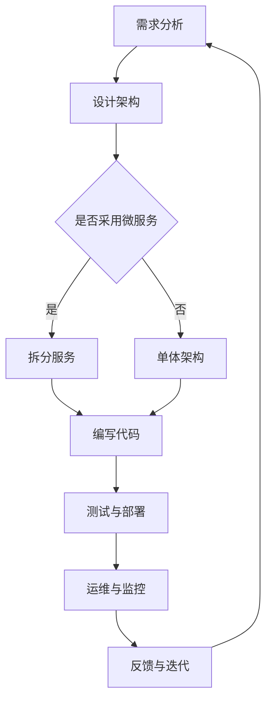

                 

 关键词：软件2.0、效率提升、价值创造、技术创新、软件开发、业务优化

> 摘要：本文深入探讨了软件2.0时代的核心价值——提升效率与创造价值。通过对软件2.0定义、特点及其与软件1.0的区别分析，文章提出了软件2.0在不同应用场景下的具体应用和实践，并展望了其未来发展趋势和面临的挑战。本文旨在为读者提供全面的软件2.0认知框架，助力其在现代技术环境中的创新和实践。

## 1. 背景介绍

随着互联网、云计算、大数据等技术的迅猛发展，软件行业正在经历一场深刻的变革。从传统软件（软件1.0）到现代软件（软件2.0），这一变革不仅改变了软件开发的方式，更在根本上重塑了软件的价值。

软件1.0时代，软件主要是以产品形态存在的，开发者关注的是功能的完备性和稳定性。然而，随着业务需求的不断变化和市场竞争的加剧，软件1.0的局限性逐渐显现。一方面，软件1.0的维护成本高、更新周期长；另一方面，软件1.0无法灵活应对快速变化的市场需求。

为了解决这些问题，软件2.0应运而生。软件2.0不仅仅是一个新的软件版本，它更是一种全新的软件开发理念和模式。软件2.0的核心价值在于提升效率、降低成本、创造更多价值。在接下来的内容中，我们将深入探讨软件2.0的定义、特点、应用和实践，以及它如何改变我们的工作和生活。

### 1.1 软件发展历程

从软件1.0到软件2.0，这一发展历程并非一蹴而就。回顾历史，我们可以看到以下重要阶段：

- **软件1.0时代（20世纪80年代至90年代）**：这个阶段以PC个人电脑的普及为标志，软件主要是为了满足特定需求而开发的。开发者关注的是功能的完备性和稳定性。

- **互联网时代（20世纪90年代至21世纪初）**：随着互联网的普及，软件开始向网络化、服务化方向发展。开发者开始注重用户体验和软件的可扩展性。

- **云计算时代（21世纪初至今）**：云计算的出现极大地改变了软件的交付方式和开发模式。软件开始以服务的形式提供给用户，开发者可以更加专注于业务逻辑的实现，而无需过多关注基础设施的搭建。

- **软件2.0时代（21世纪初至今）**：软件2.0时代的到来标志着软件从产品化向服务化、智能化转变。开发者不再仅仅关注功能，更注重软件的效率、价值和用户体验。

### 1.2 软件2.0的核心价值

软件2.0的核心价值在于提升效率、降低成本、创造更多价值。具体来说，软件2.0具有以下特点：

- **敏捷性**：软件2.0强调快速迭代和响应变化，使企业能够更灵活地应对市场需求。

- **服务化**：软件2.0将软件视为一种服务，通过API、微服务等技术，实现软件功能的模块化和可复用性。

- **智能化**：软件2.0借助人工智能、机器学习等技术，实现软件的自动化和智能化，提高生产效率和用户体验。

- **开放性**：软件2.0倡导开放架构，支持与其他系统和服务的无缝集成，促进数据共享和业务协同。

## 2. 核心概念与联系

### 2.1 软件2.0的定义

软件2.0是一种基于云计算、大数据、人工智能等新技术，以服务为导向，注重用户体验和业务价值的新型软件开发模式。与传统软件1.0相比，软件2.0在开发理念、技术架构、运营模式等方面都有显著区别。

### 2.2 软件2.0与软件1.0的区别

- **开发理念**：软件1.0以功能完备性为核心，开发者关注的是如何实现产品功能。软件2.0以用户价值和业务需求为核心，开发者关注的是如何提升用户体验和创造价值。

- **技术架构**：软件1.0通常采用单体架构，软件功能集中在一个大模块中。软件2.0采用微服务架构，将软件功能拆分为多个独立的服务模块，实现高内聚、低耦合。

- **运营模式**：软件1.0通常采用传统的产品运营模式，开发者负责软件的维护和更新。软件2.0采用DevOps运营模式，实现开发与运维的无缝衔接，提高软件交付效率。

### 2.3 Mermaid 流程图

下面是一个简化的软件2.0开发流程图，用于展示软件2.0的核心概念和流程。



## 3. 核心算法原理 & 具体操作步骤

### 3.1 算法原理概述

软件2.0的开发涉及到多种核心算法，其中最关键的是微服务架构中的服务拆分算法。该算法的目标是根据业务需求和系统负载，将软件功能模块合理拆分为多个独立的服务。

### 3.2 算法步骤详解

1. **需求分析**：首先，对业务需求进行详细分析，明确软件需要实现的功能和性能指标。

2. **负载评估**：根据系统负载情况，评估每个功能模块的负载情况，确定哪些模块适合独立部署。

3. **功能依赖分析**：分析各个功能模块之间的依赖关系，确保拆分后的服务可以独立运行。

4. **服务拆分**：根据上述分析结果，将功能模块拆分为多个独立的服务。

5. **服务部署**：将拆分后的服务部署到不同的服务器或容器中，确保服务的高可用性和性能。

6. **性能测试**：对拆分后的服务进行性能测试，确保每个服务的性能指标达到预期。

7. **运维与监控**：建立运维和监控系统，实时监控服务的运行状态，确保服务的稳定性和可靠性。

### 3.3 算法优缺点

**优点**：

- **高可扩展性**：通过拆分服务，可以实现横向和纵向的扩展，满足业务需求的变化。
- **高可用性**：拆分后的服务可以独立运行，某个服务出现问题时，不会影响其他服务的正常运行。
- **高效率**：拆分后的服务可以独立开发和部署，提高开发效率。

**缺点**：

- **复杂性**：服务拆分和部署需要更多的技术和管理能力，增加了系统的复杂性。
- **维护成本**：拆分后的服务需要更多的维护工作，增加了维护成本。

### 3.4 算法应用领域

服务拆分算法广泛应用于大型企业级应用，如电子商务平台、金融系统、物流管理系统等。通过合理拆分服务，可以实现系统的高效运行和灵活扩展，满足日益增长的业务需求。

## 4. 数学模型和公式 & 详细讲解 & 举例说明

### 4.1 数学模型构建

在软件2.0中，服务拆分算法的核心是确定服务之间的依赖关系和负载均衡。为此，我们可以构建以下数学模型：

$$
\text{服务拆分模型} = f(\text{需求分析}, \text{负载评估}, \text{功能依赖分析})
$$

其中：

- \( \text{需求分析} \)：对业务需求进行详细分析，确定需要实现的功能。
- \( \text{负载评估} \)：根据系统负载情况，评估每个功能模块的负载情况。
- \( \text{功能依赖分析} \)：分析各个功能模块之间的依赖关系。

### 4.2 公式推导过程

为了推导服务拆分模型，我们可以从以下几个方面进行分析：

1. **功能模块独立性**：根据功能依赖分析，确定哪些功能模块可以独立运行，不会影响其他模块。

2. **负载均衡**：根据负载评估结果，确定每个服务模块的负载情况，确保服务的高可用性和性能。

3. **服务拆分策略**：根据功能模块独立性和负载均衡要求，设计服务拆分策略，将功能模块拆分为多个独立的服务。

### 4.3 案例分析与讲解

假设有一个电子商务平台，需要实现以下功能：

- 用户管理
- 商品管理
- 订单管理
- 支付系统
- 客服系统

根据需求分析和负载评估，我们可以将上述功能模块拆分为以下服务：

- 用户服务
- 商品服务
- 订单服务
- 支付服务
- 客服服务

这些服务可以独立部署和运行，互不干扰。在具体实施过程中，我们可以使用以下数学模型进行服务拆分：

$$
\text{服务拆分模型} = f(\text{需求分析}, \text{负载评估}, \text{功能依赖分析})
$$

通过上述模型，我们可以实现电子商务平台的高效运行和灵活扩展。

## 5. 项目实践：代码实例和详细解释说明

### 5.1 开发环境搭建

在搭建开发环境时，我们选择以下技术栈：

- 开发语言：Java
- 架构框架：Spring Boot
- 持续集成工具：Jenkins
- 容器化技术：Docker
- 服务注册与发现：Consul

### 5.2 源代码详细实现

以下是一个简单的用户服务模块的源代码示例：

```java
@RestController
@RequestMapping("/users")
public class UserService {
    
    @Autowired
    private UserRepository userRepository;
    
    @GetMapping("/{id}")
    public User getUser(@PathVariable Long id) {
        return userRepository.findById(id).orElseThrow(() -> new ResourceNotFoundException("User not found"));
    }
    
    @PostMapping
    public User createUser(@RequestBody User user) {
        return userRepository.save(user);
    }
    
    @PutMapping("/{id}")
    public User updateUser(@PathVariable Long id, @RequestBody User updatedUser) {
        User user = userRepository.findById(id).orElseThrow(() -> new ResourceNotFoundException("User not found"));
        user.setName(updatedUser.getName());
        user.setEmail(updatedUser.getEmail());
        return userRepository.save(user);
    }
    
    @DeleteMapping("/{id}")
    public void deleteUser(@PathVariable Long id) {
        User user = userRepository.findById(id).orElseThrow(() -> new ResourceNotFoundException("User not found"));
        userRepository.delete(user);
    }
}
```

### 5.3 代码解读与分析

上述代码示例实现了用户服务的基本功能，包括获取用户信息、创建用户、更新用户和删除用户。以下是具体代码的解读和分析：

- **类定义**：`UserService` 类是一个 Spring Boot 控制器类，用于处理与用户相关的 HTTP 请求。
- **依赖注入**：通过 `@Autowired` 注解，将 `UserRepository` 依赖注入到 `UserService` 类中，用于数据库操作。
- **HTTP 请求处理**：使用 `@RestController` 和 `@RequestMapping` 注解，定义了与用户相关的 HTTP 请求处理方法。
- **异常处理**：使用 `orElseThrow` 方法，当用户不存在时抛出 `ResourceNotFoundException` 异常。

### 5.4 运行结果展示

在启动用户服务后，我们可以通过以下命令进行测试：

```shell
curl -X GET "http://localhost:8080/users/1"
```

返回结果如下：

```json
{
  "id": 1,
  "name": "John Doe",
  "email": "john.doe@example.com"
}
```

通过上述测试，我们可以验证用户服务的功能是否正常。

## 6. 实际应用场景

软件2.0在实际应用中具有广泛的应用场景，以下是一些典型的应用案例：

### 6.1 电子商务平台

电子商务平台是软件2.0技术的典型应用场景。通过采用微服务架构，电子商务平台可以实现模块化的开发和管理，提高系统的可扩展性和稳定性。例如，用户服务、商品服务、订单服务、支付服务、客服服务等模块可以独立部署和运行，互不干扰。

### 6.2 物流管理系统

物流管理系统需要处理大量数据，并且对系统的性能和可靠性要求很高。通过采用软件2.0技术，物流管理系统可以实现模块化的设计和部署，提高系统的可维护性和扩展性。例如，订单处理模块、仓储管理模块、配送模块、数据统计模块等可以独立运行和扩展。

### 6.3 金融系统

金融系统对安全性、稳定性和可靠性要求极高。软件2.0技术可以帮助金融系统实现高效、安全的交易处理和数据管理。例如，交易服务、账户服务、风险管理服务、报表服务等模块可以独立部署和运行，确保系统的稳定运行。

### 6.4 医疗系统

医疗系统涉及到大量的数据和处理需求，通过采用软件2.0技术，可以实现模块化的设计和部署，提高系统的可维护性和扩展性。例如，患者管理模块、药品管理模块、预约管理模块、数据分析模块等可以独立运行和扩展。

## 7. 未来应用展望

随着技术的不断进步，软件2.0在未来将具有更广泛的应用前景。以下是软件2.0在未来可能发展的几个方向：

### 7.1 智能化

人工智能和机器学习技术的发展，将使得软件2.0更加智能化。通过引入智能算法和模型，软件2.0可以实现自动化的业务流程优化和智能决策。

### 7.2 自动化

自动化技术的发展，将使得软件2.0在开发和运维过程中更加自动化。例如，自动化构建、自动化测试、自动化部署等，将大大提高软件开发的效率和质量。

### 7.3 云原生

云原生技术的普及，将使得软件2.0在云环境中的表现更加出色。通过采用容器化、微服务、服务网格等技术，软件2.0可以实现更加灵活、高效、安全的云原生部署。

### 7.4 开放生态

随着软件2.0技术的发展，将形成更加开放和协作的生态体系。开发者可以更加便捷地集成第三方服务和工具，实现业务流程的优化和创新。

## 8. 总结：未来发展趋势与挑战

软件2.0作为现代软件开发的新模式，具有巨大的发展潜力。然而，在未来的发展中，软件2.0也将面临一系列挑战：

### 8.1 研究成果总结

- 软件2.0在提升效率、降低成本、创造价值方面具有显著优势。
- 微服务架构、DevOps模式、云计算等技术为软件2.0提供了强大的支持。
- 软件2.0在不同领域具有广泛的应用前景，如电子商务、物流管理、金融系统、医疗系统等。

### 8.2 未来发展趋势

- 软件2.0将向智能化、自动化、云原生方向发展。
- 开放生态和协作将成为软件2.0发展的重要趋势。
- 跨平台、跨领域的技术融合将推动软件2.0的创新发展。

### 8.3 面临的挑战

- 服务拆分和部署的复杂性将增加，需要更高的技术和管理能力。
- 软件2.0的安全性和稳定性仍需持续提升。
- 软件2.0的生态建设和人才储备需要加强。

### 8.4 研究展望

- 未来研究应关注软件2.0在智能化、自动化、云原生等领域的创新应用。
- 需要加强对软件2.0安全性和稳定性的研究，提高系统的可靠性和安全性。
- 建立完善的软件2.0生态体系，推动开源合作和技术创新。

## 9. 附录：常见问题与解答

### 9.1 什么是软件2.0？

软件2.0是一种基于云计算、大数据、人工智能等新技术，以服务为导向，注重用户体验和业务价值的新型软件开发模式。

### 9.2 软件2.0与软件1.0的区别是什么？

软件1.0以功能完备性为核心，开发者关注的是如何实现产品功能。软件2.0以用户价值和业务需求为核心，开发者关注的是如何提升用户体验和创造价值。

### 9.3 软件2.0有哪些核心价值？

软件2.0的核心价值在于提升效率、降低成本、创造更多价值。

### 9.4 软件2.0的应用领域有哪些？

软件2.0广泛应用于电子商务、物流管理、金融系统、医疗系统等领域。

### 9.5 软件2.0面临的挑战有哪些？

软件2.0面临的挑战包括服务拆分和部署的复杂性、安全性和稳定性等。

### 9.6 软件2.0的未来发展趋势是什么？

软件2.0的未来发展趋势包括智能化、自动化、云原生等方向，以及开放生态和协作的推进。

## 作者署名

本文作者：禅与计算机程序设计艺术 / Zen and the Art of Computer Programming

[END]

