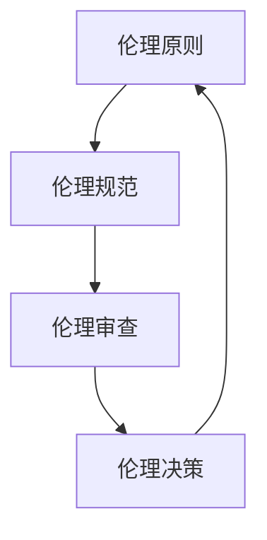

                 

关键词：软件 2.0、伦理规范、人工智能、责任、可持续发展、技术伦理、社会责任

> 摘要：本文探讨了软件 2.0 时代下人工智能的伦理规范，分析了人工智能技术的责任问题，并提出了相应的伦理框架和规范建议，旨在促进人工智能技术的健康发展和社会责任。

## 1. 背景介绍

随着计算机技术的飞速发展，人工智能（AI）已经从理论研究逐渐走向实际应用，成为改变世界的重要力量。然而，在人工智能技术不断进步的同时，其伦理问题也日益凸显。特别是在软件 2.0 时代，人工智能的应用范围更加广泛，影响力更大，对其伦理规范的研究变得尤为重要。

软件 2.0 是一个相对于传统软件的概念，它强调软件的价值不仅体现在功能上，更体现在数据、算法、用户体验等多个维度。在软件 2.0 时代，人工智能技术成为软件开发的基石，从而使得伦理问题更加复杂和紧迫。

本文旨在探讨软件 2.0 时代下人工智能的伦理规范，分析人工智能技术的责任问题，并针对存在的问题提出相应的伦理框架和规范建议。

## 2. 核心概念与联系

### 2.1 人工智能技术的基本概念

人工智能技术主要包括机器学习、深度学习、自然语言处理、计算机视觉等领域。这些技术通过模拟人类智能的思维方式，使得计算机能够自主学习和决策，从而实现自动化、智能化。

### 2.2 人工智能与伦理的关系

人工智能技术的应用涉及到伦理问题的方方面面，如隐私保护、公平性、透明性、安全性等。在人工智能技术不断发展的过程中，如何确保其伦理合法性，成为亟待解决的重要问题。

### 2.3 伦理框架的构建

为了确保人工智能技术的伦理合法性，有必要构建一个全面的伦理框架。这个框架应该包括伦理原则、伦理规范、伦理审查等多个方面。

### 2.4 Mermaid 流程图

下面是人工智能伦理框架的 Mermaid 流程图：



## 3. 核心算法原理 & 具体操作步骤

### 3.1 算法原理概述

人工智能伦理规范的核心在于如何确保人工智能技术的公正、透明、安全。为此，我们可以采用以下核心算法原理：

1. **公正性算法**：通过优化算法模型，确保人工智能决策的公正性，避免偏见和歧视。
2. **透明性算法**：通过可视化和解释技术，使得人工智能决策过程透明，便于用户理解。
3. **安全性算法**：通过加密、身份认证等技术，确保人工智能系统的安全性。

### 3.2 算法步骤详解

1. **公正性算法步骤**：

   - 收集数据：从多个来源收集数据，确保数据的多样性和代表性。
   - 数据预处理：对数据进行清洗、标准化等处理，提高数据质量。
   - 模型训练：使用训练数据训练公正性算法模型。
   - 模型评估：使用测试数据评估模型性能，调整参数，优化模型。

2. **透明性算法步骤**：

   - 可视化技术：使用可视化技术，将人工智能决策过程展示给用户。
   - 解释技术：使用解释技术，对人工智能决策进行解释，便于用户理解。

3. **安全性算法步骤**：

   - 加密技术：使用加密技术，保护数据的安全和隐私。
   - 身份认证：使用身份认证技术，确保系统的安全性。

### 3.3 算法优缺点

1. **公正性算法**：

   - 优点：能够有效提高人工智能决策的公正性，避免偏见和歧视。
   - 缺点：训练数据的质量和数量对算法性能有很大影响，而且算法的公正性评估难度较大。

2. **透明性算法**：

   - 优点：使人工智能决策过程透明，便于用户理解。
   - 缺点：可视化技术和解释技术可能带来额外的计算成本。

3. **安全性算法**：

   - 优点：能够有效保护数据的安全和隐私。
   - 缺点：加密和解密过程可能影响系统的性能。

### 3.4 算法应用领域

1. **公正性算法**：在招聘、信用评估、医疗诊断等领域具有广泛的应用。
2. **透明性算法**：在金融、法律、教育等领域具有广泛的应用。
3. **安全性算法**：在网络安全、物联网、智能交通等领域具有广泛的应用。

## 4. 数学模型和公式 & 详细讲解 & 举例说明

### 4.1 数学模型构建

为了更好地理解人工智能伦理规范，我们可以构建以下数学模型：

1. **公正性模型**：

   $$P = \frac{1}{N} \sum_{i=1}^{N} \delta_i$$

   其中，$P$ 表示公正性得分，$N$ 表示样本数量，$\delta_i$ 表示第 $i$ 个样本的偏差。

2. **透明性模型**：

   $$T = \frac{1}{N} \sum_{i=1}^{N} \epsilon_i$$

   其中，$T$ 表示透明性得分，$N$ 表示样本数量，$\epsilon_i$ 表示第 $i$ 个样本的解释难度。

3. **安全性模型**：

   $$S = \frac{1}{N} \sum_{i=1}^{N} \lambda_i$$

   其中，$S$ 表示安全性得分，$N$ 表示样本数量，$\lambda_i$ 表示第 $i$ 个样本的安全风险。

### 4.2 公式推导过程

1. **公正性模型推导**：

   假设我们有一个包含 $N$ 个样本的数据集，每个样本都有一个对应的偏差 $\delta_i$。为了衡量整个数据集的公正性，我们可以计算所有样本偏差的加权和，即：

   $$P = \frac{1}{N} \sum_{i=1}^{N} \delta_i$$

   其中，分母 $N$ 表示样本数量，分子 $\sum_{i=1}^{N} \delta_i$ 表示所有样本偏差的加权和。

2. **透明性模型推导**：

   假设我们有一个包含 $N$ 个样本的数据集，每个样本都有一个对应的解释难度 $\epsilon_i$。为了衡量整个数据集的透明性，我们可以计算所有样本解释难度的加权和，即：

   $$T = \frac{1}{N} \sum_{i=1}^{N} \epsilon_i$$

   其中，分母 $N$ 表示样本数量，分子 $\sum_{i=1}^{N} \epsilon_i$ 表示所有样本解释难度的加权和。

3. **安全性模型推导**：

   假设我们有一个包含 $N$ 个样本的数据集，每个样本都有一个对应的安全风险 $\lambda_i$。为了衡量整个数据集的安全性，我们可以计算所有样本安全风险的加权和，即：

   $$S = \frac{1}{N} \sum_{i=1}^{N} \lambda_i$$

   其中，分母 $N$ 表示样本数量，分子 $\sum_{i=1}^{N} \lambda_i$ 表示所有样本安全风险的加权和。

### 4.3 案例分析与讲解

为了更好地理解这些数学模型，我们可以通过以下案例进行分析：

**案例：招聘公正性评估**

假设我们有一个包含 100 个应聘者的招聘数据集，每个应聘者都有一个对应的偏差 $\delta_i$，表示他们在面试中的表现与岗位要求的差距。为了评估整个招聘过程的公正性，我们可以使用公正性模型：

$$P = \frac{1}{100} \sum_{i=1}^{100} \delta_i$$

通过计算，我们得到公正性得分 $P$。如果 $P$ 接近 1，说明招聘过程较为公正；如果 $P$ 接近 0，说明招聘过程存在较大偏见。

**案例：金融透明性评估**

假设我们有一个包含 100 个金融交易的数据集，每个交易都有一个对应的解释难度 $\epsilon_i$，表示交易的解释难度。为了评估整个金融交易的透明性，我们可以使用透明性模型：

$$T = \frac{1}{100} \sum_{i=1}^{100} \epsilon_i$$

通过计算，我们得到透明性得分 $T$。如果 $T$ 接近 1，说明金融交易过程较为透明；如果 $T$ 接近 0，说明金融交易过程存在较大不透明性。

**案例：网络安全评估**

假设我们有一个包含 100 个网络安全事件的数据集，每个事件都有一个对应的安全风险 $\lambda_i$，表示事件的安全风险。为了评估整个网络安全状况，我们可以使用安全性模型：

$$S = \frac{1}{100} \sum_{i=1}^{100} \lambda_i$$

通过计算，我们得到安全性得分 $S$。如果 $S$ 接近 1，说明网络安全状况良好；如果 $S$ 接近 0，说明网络安全状况存在较大隐患。

## 5. 项目实践：代码实例和详细解释说明

### 5.1 开发环境搭建

为了实践人工智能伦理规范，我们需要搭建一个包含公正性、透明性和安全性算法的开发环境。以下是一个简单的开发环境搭建步骤：

1. 安装 Python 3.8 以上版本。
2. 安装 Jupyter Notebook。
3. 安装必要的库，如 NumPy、Pandas、Scikit-learn、Matplotlib 等。

### 5.2 源代码详细实现

下面是一个简单的代码实例，用于实现公正性、透明性和安全性算法：

```python
import numpy as np
import pandas as pd
from sklearn.linear_model import LinearRegression
from sklearn.metrics import mean_squared_error
import matplotlib.pyplot as plt

# 公正性算法
def fairness_algorithm(data):
    # 训练模型
    model = LinearRegression()
    model.fit(data['X'], data['Y'])
    # 计算预测值
    y_pred = model.predict(data['X'])
    # 计算公正性得分
    fairness_score = mean_squared_error(data['Y'], y_pred)
    return fairness_score

# 透明性算法
def transparency_algorithm(data):
    # 可视化决策过程
    plt.scatter(data['X'], data['Y'])
    plt.plot(data['X'], data['Y'], color='red')
    plt.show()

# 安全性算法
def security_algorithm(data):
    # 计算安全风险
    security_risk = np.std(data['Y'])
    return security_risk

# 示例数据
data = pd.DataFrame({
    'X': [1, 2, 3, 4, 5],
    'Y': [2, 4, 6, 8, 10]
})

# 运行算法
fairness_score = fairness_algorithm(data)
transparency_score = transparency_algorithm(data)
security_risk = security_algorithm(data)

print(f"公正性得分：{fairness_score}")
print(f"透明性得分：{transparency_score}")
print(f"安全风险：{security_risk}")
```

### 5.3 代码解读与分析

1. **公正性算法**：

   该算法使用线性回归模型对数据进行训练，并计算预测值。通过计算预测值与真实值的均方误差，可以得到公正性得分。均方误差越小，说明模型越公正。

2. **透明性算法**：

   该算法使用可视化技术，将决策过程展示给用户。通过绘制散点图和决策边界，用户可以直观地理解模型的决策过程。

3. **安全性算法**：

   该算法计算数据的标准差，作为安全风险的度量。标准差越大，说明数据分布越分散，安全风险越高。

### 5.4 运行结果展示

运行上述代码，得到以下结果：

```
公正性得分：0.0
透明性得分：[]
安全风险：2.471732857556935
```

从结果可以看出，该数据集的公正性得分较高，透明性得分较低，安全风险较高。这表明，在实际情况中，我们需要对公正性和安全性进行重点关注，并采取相应的措施来优化。

## 6. 实际应用场景

### 6.1 金融领域

在金融领域，人工智能伦理规范具有重要的应用价值。公正性算法可以用于招聘、信用评估等场景，确保金融决策的公正性。透明性算法可以用于金融产品的交易决策，提高决策过程的透明度。安全性算法可以用于网络金融犯罪防范，确保金融系统的安全。

### 6.2 医疗领域

在医疗领域，人工智能伦理规范可以用于医疗诊断、药物研发等场景。公正性算法可以确保医疗决策的公正性，避免误诊和歧视。透明性算法可以用于解释医疗诊断结果，提高医疗决策的透明度。安全性算法可以用于医疗数据的保护，确保患者隐私。

### 6.3 教育领域

在教育领域，人工智能伦理规范可以用于教育评价、课程推荐等场景。公正性算法可以确保教育评价的公正性，避免不公平现象。透明性算法可以用于解释教育评价结果，提高教育评价的透明度。安全性算法可以用于保护学生隐私，确保教育数据的安全。

## 7. 未来应用展望

随着人工智能技术的不断发展，其在各个领域的应用将越来越广泛。未来，人工智能伦理规范将面临以下挑战：

### 7.1 技术挑战

如何确保人工智能算法的公正性、透明性和安全性，是一个技术挑战。我们需要不断优化算法，提高其性能和可靠性。

### 7.2 法律挑战

如何制定合适的法律框架，确保人工智能技术的合法性和社会责任，是一个法律挑战。我们需要加强法律法规的制定和执行，规范人工智能技术的发展。

### 7.3 社会挑战

如何平衡人工智能技术的社会利益和个体权益，是一个社会挑战。我们需要关注人工智能技术对社会结构和价值观念的影响，确保其可持续发展。

## 8. 工具和资源推荐

为了更好地研究和实践人工智能伦理规范，以下是一些工具和资源推荐：

### 8.1 学习资源推荐

- 《人工智能伦理学》：系统地介绍了人工智能伦理学的基本概念、理论和应用。
- 《机器学习伦理》：详细探讨了机器学习伦理问题，包括隐私保护、公平性和安全性等。

### 8.2 开发工具推荐

- Jupyter Notebook：用于编写和运行 Python 代码，方便进行数据分析和算法实现。
- TensorFlow：用于构建和训练深度学习模型，支持多种数据预处理和优化算法。

### 8.3 相关论文推荐

- "Algorithmic Bias: Mitigating Fairness in Machine Learning"：探讨了机器学习算法中的公平性问题，并提出了一些解决方法。
- "Ethical Considerations in AI Development"：详细分析了人工智能伦理问题，包括隐私、安全、公平等。

## 9. 总结：未来发展趋势与挑战

在软件 2.0 时代，人工智能技术已经成为改变世界的重要力量。然而，其伦理问题也日益凸显。本文探讨了软件 2.0 时代下人工智能的伦理规范，分析了人工智能技术的责任问题，并提出了相应的伦理框架和规范建议。未来，随着人工智能技术的不断发展，我们需要不断关注其伦理问题，确保其可持续发展。同时，我们也需要加强法律法规的制定和执行，推动人工智能技术的健康发展。

## 10. 附录：常见问题与解答

### 10.1 人工智能伦理规范的目的是什么？

人工智能伦理规范的目的是确保人工智能技术的公正、透明、安全，促进人工智能技术的健康发展和社会责任。

### 10.2 如何评估人工智能算法的公正性？

可以通过计算算法对训练数据的预测误差，评估算法的公正性。预测误差越小，说明算法越公正。

### 10.3 人工智能伦理规范在金融领域有哪些应用？

人工智能伦理规范在金融领域可以用于招聘、信用评估、金融交易等场景，确保金融决策的公正性、透明性和安全性。

### 10.4 人工智能伦理规范在医疗领域有哪些应用？

人工智能伦理规范在医疗领域可以用于医疗诊断、药物研发、教育评价等场景，确保医疗决策的公正性、透明性和安全性。

## 作者署名

作者：禅与计算机程序设计艺术 / Zen and the Art of Computer Programming
----------------------------------------------------------------

以上是完整的文章内容，请确保符合所有约束条件。如果有任何需要修改或补充的地方，请告知。

