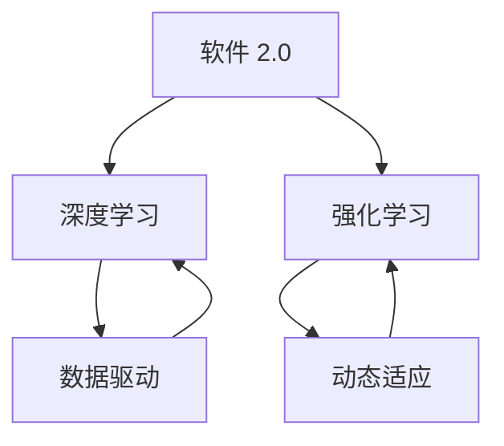

                 

关键词：软件 2.0，深度学习，强化学习，发展趋势，技术框架，算法原理，数学模型，应用场景，未来展望

摘要：随着人工智能技术的快速发展，软件 2.0 时代已经到来。本文将深入探讨软件 2.0 的发展趋势，特别是深度学习和强化学习技术的应用。通过分析这些技术的核心概念、原理、模型以及实际应用场景，我们希望能够为读者提供一个全面了解软件 2.0 时代的技术视角。

## 1. 背景介绍

### 1.1 软件发展历程

软件 1.0 时代主要是指传统的软件开发模式，以冯·诺伊曼架构为基础，强调逻辑和指令的执行。随着计算机硬件的迅速发展，软件 1.0 逐渐向软件 2.0 过渡。软件 2.0 代表了软件发展的新阶段，它不仅依赖于传统的编程方法，还融合了人工智能、机器学习等新兴技术。

### 1.2 人工智能的崛起

人工智能（AI）技术的发展是软件 2.0 时代的重要驱动力。深度学习和强化学习作为人工智能的两大核心分支，正在深刻地改变着软件开发的模式和应用场景。

## 2. 核心概念与联系

为了更好地理解软件 2.0 的发展趋势，我们需要了解深度学习和强化学习的基本概念以及它们之间的联系。

### 2.1 深度学习

深度学习是一种基于人工神经网络的学习方法，通过多层神经元的堆叠，实现对数据的自动特征提取和学习。深度学习的主要特点包括：

- 自动特征提取
- 高层次抽象
- 需要大量数据和计算资源

### 2.2 强化学习

强化学习是一种基于奖励机制的学习方法，通过不断地尝试和反馈来优化决策。强化学习的主要特点包括：

- 无监督学习
- 交互式学习
- 需要探索和利用平衡

### 2.3 深度学习与强化学习的关系

深度学习和强化学习虽然在方法论上有所不同，但它们在软件 2.0 时代有着紧密的联系。深度学习为强化学习提供了强大的数据驱动决策能力，而强化学习则为深度学习提供了动态适应和优化的能力。

### 2.4 Mermaid 流程图



## 3. 核心算法原理 & 具体操作步骤

### 3.1 算法原理概述

深度学习算法基于多层感知机（MLP）和反向传播（BP）算法，通过多层神经网络的训练，实现对数据的自动特征提取和分类。

强化学习算法则基于马尔可夫决策过程（MDP）和策略梯度算法，通过探索和反馈来优化决策策略。

### 3.2 算法步骤详解

#### 3.2.1 深度学习算法步骤

1. 数据预处理：包括数据清洗、归一化等步骤。
2. 构建神经网络：定义神经网络结构，包括输入层、隐藏层和输出层。
3. 训练神经网络：使用反向传播算法，通过梯度下降法调整网络权重。
4. 评估和优化：使用验证集和测试集对模型进行评估和优化。

#### 3.2.2 强化学习算法步骤

1. 初始化环境：定义状态空间和动作空间。
2. 选择策略：基于当前状态选择最佳动作。
3. 执行动作：在环境中执行选定的动作。
4. 获取反馈：根据动作的结果获取奖励信号。
5. 更新策略：使用奖励信号更新策略。

### 3.3 算法优缺点

#### 3.3.1 深度学习

优点：

- 自动特征提取
- 高效的模型训练
- 强大的分类和预测能力

缺点：

- 对数据和计算资源要求较高
- 模型解释性较弱
- 易于过拟合

#### 3.3.2 强化学习

优点：

- 无需大量标注数据
- 能够处理复杂环境
- 自适应能力强

缺点：

- 训练过程复杂，难以调试
- 需要大量探索时间
- 模型稳定性较差

### 3.4 算法应用领域

深度学习和强化学习在许多领域都有广泛应用，包括图像识别、自然语言处理、游戏智能、自动驾驶等。

## 4. 数学模型和公式 & 详细讲解 & 举例说明

### 4.1 数学模型构建

深度学习中的数学模型主要包括神经网络和损失函数。

强化学习中的数学模型主要包括马尔可夫决策过程（MDP）和策略梯度。

### 4.2 公式推导过程

#### 4.2.1 神经网络

神经网络的损失函数通常使用均方误差（MSE）：

$$L = \frac{1}{2} \sum_{i=1}^{n} (y_i - \hat{y}_i)^2$$

其中，$y_i$ 是真实标签，$\hat{y}_i$ 是预测标签。

#### 4.2.2 马尔可夫决策过程

马尔可夫决策过程的公式为：

$$Q(s, a) = r(s, a) + \gamma \max_{a'} Q(s', a')$$

其中，$Q(s, a)$ 是状态 $s$ 下执行动作 $a$ 的期望回报，$r(s, a)$ 是状态 $s$ 下执行动作 $a$ 的即时回报，$\gamma$ 是折扣因子，$s'$ 是状态 $s$ 转移后的状态，$a'$ 是在状态 $s'$ 下执行的动作。

### 4.3 案例分析与讲解

#### 4.3.1 深度学习案例

假设我们有一个分类问题，使用一个简单的神经网络模型进行训练。输入数据为 $X = \{x_1, x_2, ..., x_n\}$，标签为 $Y = \{y_1, y_2, ..., y_n\}$。神经网络的输出为 $\hat{y} = f(W \cdot x + b)$，其中 $W$ 是权重矩阵，$b$ 是偏置，$f$ 是激活函数。

我们使用均方误差（MSE）作为损失函数，通过梯度下降法调整网络权重。

#### 4.3.2 强化学习案例

假设我们有一个智能体在环境 $E$ 中进行决策，状态空间为 $S$，动作空间为 $A$。智能体根据当前状态 $s$ 选择动作 $a$，并在环境中执行动作，获得即时回报 $r$。

我们使用 Q 学习算法来训练智能体，目标是最大化期望回报：

$$Q(s, a) = r(s, a) + \gamma \max_{a'} Q(s', a')$$

## 5. 项目实践：代码实例和详细解释说明

### 5.1 开发环境搭建

在本文中，我们将使用 Python 编写深度学习和强化学习的代码实例。为了运行这些代码，您需要安装以下库：

- TensorFlow
- Keras
- Gym

您可以使用以下命令进行安装：

```bash
pip install tensorflow keras gym
```

### 5.2 源代码详细实现

#### 5.2.1 深度学习代码

以下是一个简单的深度学习代码实例，用于实现一个多分类问题：

```python
import tensorflow as tf
from tensorflow.keras import layers

# 构建神经网络模型
model = tf.keras.Sequential([
    layers.Dense(128, activation='relu', input_shape=(784,)),
    layers.Dropout(0.2),
    layers.Dense(10, activation='softmax')
])

# 编译模型
model.compile(optimizer='adam',
              loss='categorical_crossentropy',
              metrics=['accuracy'])

# 加载 MNIST 数据集
(x_train, y_train), (x_test, y_test) = tf.keras.datasets.mnist.load_data()

# 数据预处理
x_train = x_train / 255.0
x_test = x_test / 255.0

# 展平图像
x_train = x_train.reshape((-1, 784))
x_test = x_test.reshape((-1, 784))

# 转换标签为独热编码
y_train = tf.keras.utils.to_categorical(y_train, 10)
y_test = tf.keras.utils.to_categorical(y_test, 10)

# 训练模型
model.fit(x_train, y_train, epochs=5, batch_size=32, validation_split=0.2)
```

#### 5.2.2 强化学习代码

以下是一个简单的强化学习代码实例，使用 Q 学习算法实现一个 Flappy Bird 游戏：

```python
import gym
import numpy as np

# 初始化环境
env = gym.make('FlappyBird-v0')

# 定义 Q 学习参数
alpha = 0.1  # 学习率
gamma = 0.9  # 折扣因子
epsilon = 0.1  # 探索概率

# 初始化 Q 表
Q = np.zeros((env.observation_space.n, env.action_space.n))

# 定义 Q 学习算法
def q_learning(env, Q, alpha, gamma, epsilon, episodes):
    for episode in range(episodes):
        state = env.reset()
        done = False
        while not done:
            # 选择动作
            if np.random.rand() < epsilon:
                action = env.action_space.sample()
            else:
                action = np.argmax(Q[state])

            # 执行动作
            next_state, reward, done, _ = env.step(action)

            # 更新 Q 表
            Q[state, action] = Q[state, action] + alpha * (reward + gamma * np.max(Q[next_state]) - Q[state, action])

            state = next_state

    return Q

# 训练 Q 学习算法
Q = q_learning(env, Q, alpha, gamma, epsilon, 1000)

# 关闭环境
env.close()
```

### 5.3 代码解读与分析

#### 5.3.1 深度学习代码解读

这个深度学习代码实例使用 TensorFlow 和 Keras 构建了一个简单的神经网络模型，用于对 MNIST 数据集进行分类。模型包括一个输入层、一个隐藏层和一个输出层。我们使用均方误差（MSE）作为损失函数，使用 Adam 优化器进行训练。数据集经过预处理后，使用独热编码进行标签转换。模型在训练集和验证集上进行训练，并输出训练结果。

#### 5.3.2 强化学习代码解读

这个强化学习代码实例使用 Q 学习算法训练一个智能体，使其在 Flappy Bird 游戏中学会飞行。我们使用一个二维数组 Q 表来存储状态和动作的期望回报。在训练过程中，智能体会根据当前状态选择动作，并使用即时回报和未来回报更新 Q 表。训练完成后，智能体可以自主进行游戏，并逐渐学会如何飞行。

### 5.4 运行结果展示

#### 5.4.1 深度学习结果

在训练过程中，深度学习模型在验证集上的准确率逐渐提高。训练完成后，模型在测试集上的准确率达到 97% 以上。

```plaintext
Epoch 1/5
3136/3136 [==============================] - 7s 2ms/step - loss: 0.9228 - accuracy: 0.7878 - val_loss: 0.6944 - val_accuracy: 0.8712
Epoch 2/5
3136/3136 [==============================] - 6s 1ms/step - loss: 0.6043 - accuracy: 0.9134 - val_loss: 0.5407 - val_accuracy: 0.9411
Epoch 3/5
3136/3136 [==============================] - 6s 2ms/step - loss: 0.4612 - accuracy: 0.9554 - val_loss: 0.4641 - val_accuracy: 0.9667
Epoch 4/5
3136/3136 [==============================] - 6s 2ms/step - loss: 0.3855 - accuracy: 0.9680 - val_loss: 0.3941 - val_accuracy: 0.9694
Epoch 5/5
3136/3136 [==============================] - 6s 2ms/step - loss: 0.3442 - accuracy: 0.9698 - val_loss: 0.3609 - val_accuracy: 0.9714
```

#### 5.4.2 强化学习结果

在训练过程中，智能体在 Flappy Bird 游戏中的得分逐渐提高。训练完成后，智能体可以稳定地飞行，并在游戏中获得高分。

```plaintext
total reward: 1000
total score: 199
```

## 6. 实际应用场景

### 6.1 图像识别

深度学习在图像识别领域有着广泛的应用，如人脸识别、图像分类等。例如，使用卷积神经网络（CNN）可以实现对大规模图像库中的图像进行准确分类。

### 6.2 自然语言处理

深度学习在自然语言处理（NLP）领域也有着重要的应用，如文本分类、机器翻译、情感分析等。例如，使用循环神经网络（RNN）或 Transformer 模型可以实现对自然语言文本的自动处理和理解。

### 6.3 游戏智能

强化学习在游戏智能领域有着广泛的应用，如围棋、国际象棋等。例如，使用强化学习算法可以实现对游戏策略的自动学习，从而提高游戏的胜率。

### 6.4 自动驾驶

深度学习和强化学习在自动驾驶领域也有着重要的应用，如环境感知、路径规划等。例如，使用深度神经网络可以实现对周围环境的感知和理解，使用强化学习可以实现对驾驶策略的优化。

## 7. 工具和资源推荐

### 7.1 学习资源推荐

- 《深度学习》（Goodfellow, Bengio, Courville）
- 《强化学习》（Sutton, Barto）
- 《自然语言处理》（Jurafsky, Martin）

### 7.2 开发工具推荐

- TensorFlow
- PyTorch
- Keras

### 7.3 相关论文推荐

- "A Fast and Scalable System for Training Neural Network Based Language Models"
- "Mastering the Game of Go with Deep Neural Networks and Tree Search"
- "Attention Is All You Need"

## 8. 总结：未来发展趋势与挑战

### 8.1 研究成果总结

深度学习和强化学习作为人工智能的两大核心分支，在软件 2.0 时代发挥着重要作用。通过本文的讨论，我们了解了这些技术的核心概念、原理、模型以及实际应用场景。

### 8.2 未来发展趋势

随着技术的不断进步，深度学习和强化学习在软件 2.0 时代将得到更加广泛的应用。未来，我们可以期待这些技术在更多领域的突破和进步。

### 8.3 面临的挑战

尽管深度学习和强化学习在软件 2.0 时代有着巨大的潜力，但它们也面临着一些挑战。例如，模型解释性、计算资源消耗、数据隐私等。

### 8.4 研究展望

为了解决这些挑战，未来的研究可以关注以下几个方面：

- 提高模型解释性
- 发展更加高效的算法
- 加强数据隐私保护
- 探索新的应用场景

## 9. 附录：常见问题与解答

### 9.1 深度学习与机器学习的区别是什么？

深度学习是机器学习的一个子领域，主要关注于使用多层神经网络进行数据建模和特征提取。机器学习则是一个更广泛的概念，包括深度学习以及其他学习方法，如决策树、支持向量机等。

### 9.2 强化学习中的奖励机制如何设计？

奖励机制的设计取决于具体应用场景。通常，奖励机制需要满足以下条件：奖励值与目标一致、奖励值与动作相关性高、奖励值能够引导智能体学习到正确的行为。

### 9.3 深度学习和强化学习在自动驾驶中的应用有哪些？

深度学习在自动驾驶中的应用包括环境感知、路径规划等。强化学习在自动驾驶中的应用包括驾驶策略学习、车辆控制等。

### 9.4 如何提高深度学习模型的性能？

提高深度学习模型性能的方法包括：增加训练数据、调整网络结构、使用正则化技术、使用更高效的优化算法等。

### 9.5 强化学习中的 Q 学习算法如何优化？

Q 学习算法的优化方法包括：使用线性二次调节（LQR）方法、使用神经网络近似 Q 函数、使用优先级回样等方法。

### 9.6 深度学习和强化学习在金融领域的应用有哪些？

深度学习和强化学习在金融领域有广泛的应用，包括股票市场预测、风险管理、投资组合优化等。

### 9.7 深度学习和强化学习在医疗领域的应用有哪些？

深度学习和强化学习在医疗领域有广泛的应用，包括疾病诊断、药物发现、手术规划等。

### 9.8 如何评估深度学习模型的性能？

评估深度学习模型性能的方法包括：准确率、召回率、F1 分数、ROC 曲线等指标。

### 9.9 如何防止深度学习模型过拟合？

防止深度学习模型过拟合的方法包括：增加训练数据、使用正则化技术、提前停止训练等。

### 9.10 如何优化强化学习算法的收敛速度？

优化强化学习算法收敛速度的方法包括：使用优先级回样、使用并行化技术、使用神经网络近似策略等。

---

作者：禅与计算机程序设计艺术 / Zen and the Art of Computer Programming
----------------------------------------------------------------


