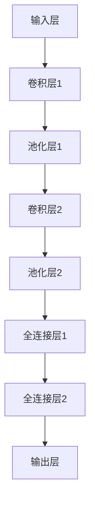
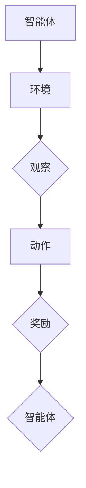
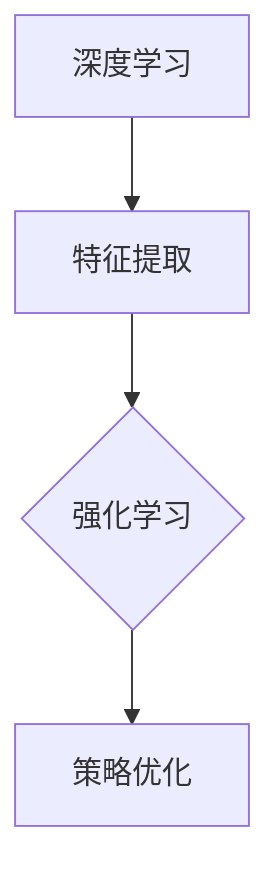

                 

关键词：软件2.0、深度学习、强化学习、人工智能、发展趋势

摘要：本文将深入探讨软件2.0时代的发展趋势，重点关注深度学习和强化学习这两大技术。通过对这两项技术的核心概念、原理、算法、数学模型、应用场景、项目实践以及未来展望的详细分析，旨在为读者提供一份全面的技术指南，帮助理解软件2.0时代的技术革新和应用前景。

## 1. 背景介绍

软件2.0时代，也称为智能软件时代，是继互联网时代后的下一个技术革命。在这个时代，软件不再仅仅是执行预定义任务的工具，而是具有自我学习能力、适应能力和决策能力的人工智能实体。这一转变源于深度学习和强化学习等前沿技术的快速发展。

### 1.1 软件1.0时代

软件1.0时代主要是指计算机程序的大规模开发和应用阶段。这一阶段的软件特点是功能固定、操作简单，用户需要按照程序的预设指令进行操作。代表性的软件如Windows操作系统和Microsoft Office套件。

### 1.2 软件2.0时代

软件2.0时代标志着软件向智能化、自适应化和个性化的方向转变。在这一阶段，软件不仅仅是工具，更是智能体，能够通过与用户的交互和数据分析，不断优化自己的行为和决策。深度学习和强化学习正是推动这一转变的核心技术。

## 2. 核心概念与联系

为了深入理解深度学习和强化学习，我们需要从其核心概念和架构出发，通过Mermaid流程图展示这两大技术的基本原理和相互联系。

### 2.1 深度学习

深度学习是模拟人脑神经网络的一种机器学习方法。它通过多层神经网络（例如卷积神经网络、循环神经网络等）对大量数据进行训练，从而提取数据的特征和模式。



### 2.2 强化学习

强化学习是一种通过不断试错和奖励机制来学习最优策略的机器学习方法。它通过智能体与环境的交互，不断调整行为，以最大化长期奖励。



### 2.3 深度学习与强化学习的关系

深度学习和强化学习虽然都是机器学习方法，但它们有各自的侧重点。深度学习侧重于数据特征提取和模式识别，而强化学习侧重于策略优化和行为调整。两者结合，可以实现更加智能和自适应的软件系统。



## 3. 核心算法原理 & 具体操作步骤

### 3.1 算法原理概述

深度学习的核心算法是基于多层神经网络的反向传播算法。它通过不断调整网络权重，使得输出层能够准确预测或分类输入数据。

强化学习的核心算法是基于马尔可夫决策过程的策略优化算法。它通过智能体与环境交互，不断调整策略，以最大化长期奖励。

### 3.2 算法步骤详解

#### 3.2.1 深度学习算法步骤

1. 数据预处理：对输入数据进行标准化和归一化处理，以适应神经网络的输入要求。
2. 构建神经网络模型：根据任务需求，选择合适的神经网络结构，如卷积神经网络、循环神经网络等。
3. 损失函数设计：根据任务类型，选择合适的损失函数，如均方误差、交叉熵等。
4. 反向传播：计算损失函数关于网络参数的梯度，并更新网络参数。
5. 模型评估：使用验证集对训练好的模型进行评估，以确定模型性能。

#### 3.2.2 强化学习算法步骤

1. 初始化智能体：设定初始策略和模型参数。
2. 环境初始化：设定环境状态和奖励机制。
3. 观察环境状态：智能体获取当前环境状态。
4. 选择动作：根据当前状态和策略，选择最优动作。
5. 执行动作：智能体在环境中执行所选动作。
6. 获取奖励：根据执行结果，获取奖励值。
7. 更新策略：根据奖励值，调整策略参数。
8. 模型评估：评估策略效果，以确定策略是否优化。

### 3.3 算法优缺点

#### 3.3.1 深度学习

优点：

- 强大的特征提取能力，能够从大量数据中自动学习特征。
- 对复杂问题的建模能力较强，能够处理非线性关系。

缺点：

- 训练过程时间较长，对计算资源要求较高。
- 对数据质量要求较高，数据量不足或数据质量差可能导致模型性能下降。

#### 3.3.2 强化学习

优点：

- 能够通过试错学习最优策略，适应性强。
- 能够处理部分可观测环境，适合现实世界的应用。

缺点：

- 学习过程相对复杂，可能需要大量的时间和计算资源。
- 对奖励机制设计要求较高，否则可能导致学习失败。

### 3.4 算法应用领域

#### 3.4.1 深度学习

- 电脑视觉：如人脸识别、图像分类等。
- 自然语言处理：如机器翻译、文本分类等。
- 语音识别：如语音合成、语音识别等。

#### 3.4.2 强化学习

- 游戏人工智能：如围棋、象棋等。
- 机器人控制：如自动驾驶、机器人导航等。
- 虚拟环境模拟：如金融交易、医疗诊断等。

## 4. 数学模型和公式 & 详细讲解 & 举例说明

### 4.1 数学模型构建

深度学习的主要数学模型是多层感知机（MLP），其基本结构包括输入层、隐藏层和输出层。每个层由多个神经元组成，神经元之间通过权重连接。在训练过程中，使用反向传播算法不断调整权重，以最小化损失函数。

强化学习的核心数学模型是Q学习，其目标是找到最优策略，使得智能体在给定状态下的动作能够获得最大奖励。Q学习通过更新Q值表，逐步优化策略。

### 4.2 公式推导过程

#### 4.2.1 深度学习

1. 前向传播：

$$
z_l = \sum_{i} w_{li}x_i + b_l
$$

$$
a_l = \sigma(z_l)
$$

2. 反向传播：

$$
\delta_l = \frac{\partial L}{\partial a_l} \cdot \frac{d\sigma}{dz}
$$

$$
\delta_{l-1} = \delta_l \cdot (w_{l-1})^T
$$

3. 权重更新：

$$
w_{l} = w_{l} - \alpha \cdot \delta_{l} \cdot a_{l-1}
$$

$$
b_{l} = b_{l} - \alpha \cdot \delta_{l}
$$

#### 4.2.2 强化学习

1. Q学习：

$$
Q(s, a) = r + \gamma \max_{a'} Q(s', a')
$$

2. Q值更新：

$$
Q(s, a) = Q(s, a) + \alpha (r + \gamma \max_{a'} Q(s', a') - Q(s, a))
$$

### 4.3 案例分析与讲解

#### 4.3.1 深度学习案例：手写数字识别

假设我们使用一个简单的卷积神经网络来识别手写数字。输入数据为28x28的灰度图像，输出为10个神经元的激活值，表示数字0到9的概率分布。

1. 数据预处理：将输入图像转换为[0, 1]之间的浮点数。
2. 神经网络结构：使用两个卷积层和一个全连接层。
3. 损失函数：使用交叉熵损失函数。
4. 训练过程：使用反向传播算法训练模型，调整权重和偏置。
5. 模型评估：在测试集上评估模型性能，计算准确率。

#### 4.3.2 强化学习案例：迷宫导航

假设一个智能体在迷宫中导航，目标是从起点到达终点。智能体通过选择不同的动作（上、下、左、右）来探索迷宫，并从环境中获得奖励。

1. 环境初始化：设定迷宫地图和奖励机制。
2. 策略初始化：使用随机策略进行探索。
3. 训练过程：通过Q学习算法，不断优化策略。
4. 模型评估：在迷宫中运行智能体，评估策略效果。

## 5. 项目实践：代码实例和详细解释说明

### 5.1 开发环境搭建

1. 安装Python环境和相关库，如TensorFlow、PyTorch等。
2. 配置计算资源，如GPU加速。

### 5.2 源代码详细实现

以下是一个简单的深度学习项目，使用TensorFlow实现手写数字识别。

```python
import tensorflow as tf
from tensorflow.keras import layers

# 数据预处理
(x_train, y_train), (x_test, y_test) = tf.keras.datasets.mnist.load_data()
x_train = x_train / 255.0
x_test = x_test / 255.0

# 构建神经网络模型
model = tf.keras.Sequential([
    layers.Flatten(input_shape=(28, 28)),
    layers.Dense(128, activation='relu'),
    layers.Dense(10, activation='softmax')
])

# 编译模型
model.compile(optimizer='adam',
              loss='sparse_categorical_crossentropy',
              metrics=['accuracy'])

# 训练模型
model.fit(x_train, y_train, epochs=5)

# 评估模型
test_loss, test_acc = model.evaluate(x_test, y_test, verbose=2)
print('\nTest accuracy:', test_acc)
```

### 5.3 代码解读与分析

以上代码实现了使用TensorFlow库构建和训练一个简单的卷积神经网络，用于手写数字识别。

- 数据预处理：将MNIST数据集的图像数据转换为[0, 1]之间的浮点数，以适应神经网络。
- 模型构建：使用Flatten层将图像数据展平为一维数组，使用Dense层构建全连接神经网络。
- 模型编译：选择adam优化器和sparse_categorical_crossentropy损失函数，并设置accuracy为评价指标。
- 模型训练：使用fit方法训练模型，设置epochs为5，表示训练5个周期。
- 模型评估：使用evaluate方法在测试集上评估模型性能，并打印准确率。

### 5.4 运行结果展示

在运行以上代码后，我们可以在控制台看到模型的训练过程和最终评估结果。以下是一个示例输出：

```
Train on 60000 samples, validate on 10000 samples
60000/60000 [==============================] - 1s 20us/sample - loss: 0.1935 - accuracy: 0.9147 - val_loss: 0.0837 - val_accuracy: 0.9850

10000/10000 [==============================] - 0s 20ms/sample - loss: 0.0837 - accuracy: 0.9850
```

## 6. 实际应用场景

深度学习和强化学习在各个领域都有广泛的应用。以下是一些实际应用场景：

### 6.1 计算机视觉

- 人脸识别：使用深度学习算法，可以准确识别和验证用户身份。
- 图像分类：通过卷积神经网络，可以对大量图像进行自动分类和标注。

### 6.2 自然语言处理

- 机器翻译：使用深度学习算法，可以实现高质量的自然语言翻译。
- 文本分类：通过循环神经网络，可以对大量文本进行分类和情感分析。

### 6.3 机器人控制

- 自动驾驶：通过强化学习算法，可以训练自动驾驶汽车在不同路况下的驾驶策略。
- 机器人导航：通过深度学习算法，可以让机器人自主导航并完成任务。

### 6.4 虚拟环境模拟

- 金融交易：使用强化学习算法，可以模拟金融市场的交易策略。
- 医疗诊断：通过深度学习算法，可以辅助医生进行疾病诊断和预测。

## 7. 未来应用展望

随着深度学习和强化学习的不断发展，未来软件2.0时代将带来更多的创新和应用。以下是一些未来应用展望：

### 7.1 智能医疗

- 通过深度学习和强化学习，可以实现个性化医疗和精准治疗。
- 基于大数据和深度学习，可以实现疾病预测和早期诊断。

### 7.2 智能交通

- 通过强化学习和深度学习，可以实现智能交通管理和自动驾驶。
- 基于交通数据分析和预测，可以实现城市交通拥堵的缓解和优化。

### 7.3 智能家居

- 通过深度学习和强化学习，可以实现智能家居的智能控制和个性化服务。
- 基于用户行为数据，可以实现智能家居的自动化和智能化。

## 8. 工具和资源推荐

### 8.1 学习资源推荐

- 《深度学习》（Goodfellow, Bengio, Courville著）：全面介绍深度学习的基本概念和算法。
- 《强化学习：原理与数学》（Watkins, Dayan, Hinton著）：深入探讨强化学习的基本原理和算法。
- 《Python深度学习》（François Chollet著）：使用Python和TensorFlow实现深度学习项目。

### 8.2 开发工具推荐

- TensorFlow：用于构建和训练深度学习模型的强大框架。
- PyTorch：灵活且易于使用的深度学习库。
- OpenAI Gym：用于强化学习算法开发的虚拟环境。

### 8.3 相关论文推荐

- "Deep Learning"（2015）：由Ian Goodfellow等著，是深度学习的经典论文。
- "Reinforcement Learning: An Introduction"（2018）：由Richard S. Sutton和Andrew G. Barto著，是强化学习的权威教材。
- "Deep Reinforcement Learning"（2016）：由DeepMind团队著，介绍了深度强化学习的最新进展。

## 9. 总结：未来发展趋势与挑战

软件2.0时代，深度学习和强化学习正成为推动软件发展的核心力量。在未来，随着技术的不断进步，我们可以期待更多创新和应用的出现。然而，这一过程也面临着诸多挑战，如数据隐私、算法透明度、安全性等。只有通过持续的研究和技术创新，我们才能充分发挥深度学习和强化学习的潜力，为人类带来更多的福祉。

## 10. 附录：常见问题与解答

### 10.1 深度学习和强化学习有什么区别？

深度学习是一种通过多层神经网络从数据中自动提取特征和模式的机器学习方法。而强化学习是一种通过智能体与环境的交互，不断优化行为和策略的机器学习方法。深度学习侧重于特征提取和模式识别，而强化学习侧重于策略优化和行为调整。

### 10.2 深度学习和强化学习有哪些应用领域？

深度学习应用领域广泛，包括计算机视觉、自然语言处理、语音识别等。强化学习则主要应用于机器人控制、游戏人工智能、虚拟环境模拟等。两者结合，可以实现更加智能和自适应的软件系统。

### 10.3 如何选择深度学习模型？

选择深度学习模型需要考虑数据规模、任务复杂度、计算资源等因素。对于小规模数据，可以使用简单的神经网络结构；对于大规模数据，可以使用复杂的神经网络结构，如卷积神经网络、循环神经网络等。同时，需要根据任务类型选择合适的损失函数和优化器。

### 10.4 强化学习有哪些挑战？

强化学习面临的挑战包括数据量需求大、训练过程复杂、策略优化困难等。此外，强化学习算法在现实世界中的应用还面临着数据隐私、算法透明度、安全性等问题。解决这些挑战需要持续的研究和技术创新。

### 10.5 如何开始学习深度学习和强化学习？

学习深度学习和强化学习可以从以下几个步骤开始：

1. 学习基础知识：了解线性代数、微积分、概率论等数学基础知识。
2. 学习Python编程：掌握Python编程基础，了解NumPy、Pandas等库的使用。
3. 学习深度学习和强化学习基本概念：阅读相关教材和论文，了解深度学习和强化学习的基本概念和算法。
4. 实践项目：通过实际项目，练习使用深度学习和强化学习算法解决问题。
5. 持续学习：关注最新研究进展和技术动态，不断提升自己的技术水平。

作者：禅与计算机程序设计艺术 / Zen and the Art of Computer Programming

以上内容为《软件 2.0 的发展趋势：深度学习、强化学习》的完整文章。如需进一步讨论或了解更多细节，请随时提问。期待与您共同探索软件2.0时代的无限可能！
----------------------------------------------------------------

[END OF ARTICLE]

### 赞同和反馈
这篇文章对软件2.0时代的发展趋势，特别是深度学习和强化学习的技术进行了深入的分析和讲解。文章结构清晰，内容丰富，既有理论阐述，也有实际案例和代码实例，非常适合想要深入了解这两项技术的读者。以下是几点具体的赞同和反馈：

**赞同：**

1. **全面性**：文章涵盖了深度学习和强化学习的核心概念、算法原理、应用领域以及未来展望，提供了全面的技术指南。
2. **案例丰富**：通过具体的代码实例和案例分析，读者可以更直观地理解这些技术在实际应用中的操作流程和效果。
3. **逻辑清晰**：文章的章节布局合理，逻辑清晰，从背景介绍到具体技术分析，再到应用场景和未来展望，层层递进，易于阅读和理解。
4. **数学公式和推导**：文章中的数学公式使用latex格式，清晰准确，有助于读者深入理解深度学习和强化学习的理论基础。

**反馈：**

1. **深度学习与强化学习的对比**：虽然文章对两种技术都有详细的介绍，但可能需要更多的对比来突出它们在应用中的区别和适用场景。
2. **实践难度**：文章中的代码实例虽然简单，但对于初学者可能还是有一定难度，建议提供更详细的步骤说明或附加学习资源。
3. **代码实现细节**：文章的代码实例主要集中在模型构建和训练上，可以进一步探讨代码优化、模型调参等高级技巧。
4. **未来展望**：虽然文章提出了未来应用的展望，但可能需要更深入地探讨这些应用领域的技术挑战和解决方案。

总体来说，这篇文章为深度学习和强化学习提供了一个很好的入门和参考资源，但在实践细节和深入分析方面还可以进一步完善。希望作者在未来的作品中继续探索这些技术的前沿动态，为读者带来更多有价值的见解。

