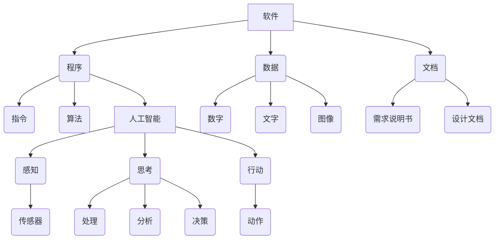

                 

 > **关键词**：软件 2.0、人工智能、哲学思考、本质、编程

> **摘要**：本文从哲学角度出发，探讨了软件 2.0 时代下人工智能的本质。通过分析人工智能的发展历程、核心概念及其与哲学的关联，揭示了软件 2.0 对人工智能带来的深刻变革，以及未来人工智能可能面临的挑战和发展趋势。

## 1. 背景介绍

### 1.1 软件与人工智能的发展历程

软件的发展历程可以分为两个主要阶段：1.0 时代和 2.0 时代。1.0 时代主要以传统的计算机程序为主，强调的是计算能力和算法效率。而随着互联网和大数据的兴起，软件 2.0 时代应运而生，这一时代更加关注用户体验、生态构建和智能化。

人工智能（AI）作为计算机科学的一个重要分支，其发展历程可以追溯到 20 世纪 50 年代。从最初的符号主义、连接主义到当前的热门领域——深度学习，人工智能在不断地演进和突破。如今，人工智能已经深入到各行各业，成为推动社会进步的重要力量。

### 1.2 哲学与软件、人工智能的关系

哲学作为一门探讨世界本质和人生意义的学科，自古以来就对科学技术有着深远的影响。在软件和人工智能领域，哲学同样发挥着重要作用。首先，哲学为软件和人工智能的发展提供了理论基础，如逻辑学、认知科学等；其次，哲学思考可以帮助我们更好地理解软件和人工智能的本质，以及其在社会中的应用和影响。

## 2. 核心概念与联系

为了更好地理解软件 2.0 时代下人工智能的本质，我们需要先了解一些核心概念及其相互之间的联系。

### 2.1 软件与人工智能的核心概念

#### 软件的概念

软件是指计算机系统中的程序、数据和相关文档的集合。它主要包括以下几个方面：

- **程序**：计算机执行的一系列指令，用于完成特定的任务。
- **数据**：程序处理的对象，可以是数字、文字、图像等。
- **文档**：描述程序和数据的相关信息，如需求说明书、设计文档等。

#### 人工智能的概念

人工智能是指模拟、延伸和扩展人类智能的计算机技术。它主要包括以下几个方面：

- **感知**：通过传感器获取外部环境信息。
- **思考**：对获取的信息进行处理、分析和决策。
- **行动**：根据决策结果执行相应的动作。

### 2.2 软件与人工智能的联系

软件与人工智能的联系可以从以下几个方面来理解：

- **软件是人工智能的实现载体**：人工智能的理论和技术需要通过软件来实现。
- **人工智能为软件提供了新的功能**：通过人工智能技术，软件可以更好地模拟人类智能，提高用户体验。
- **软件与人工智能相互促进**：软件技术的发展为人工智能提供了更好的平台和工具，而人工智能的进步也为软件带来了新的发展方向和应用场景。

### 2.3 Mermaid 流程图

以下是一个简单的 Mermaid 流程图，展示了软件与人工智能之间的核心概念及其联系：



## 3. 核心算法原理 & 具体操作步骤

### 3.1 算法原理概述

在软件 2.0 时代，人工智能的核心算法主要包括深度学习、强化学习、自然语言处理等。这些算法通过模拟人类智能的过程，实现对数据的自动学习和处理。

#### 深度学习

深度学习是一种基于多层神经网络的学习方法，通过模拟人脑的神经元连接结构，实现对数据的自动特征提取和分类。其基本原理包括：

- **输入层**：接收外部输入数据。
- **隐藏层**：对输入数据进行处理和变换。
- **输出层**：生成预测结果。

#### 强化学习

强化学习是一种基于奖励机制的学习方法，通过不断试错和反馈，使智能体在特定环境中找到最优策略。其基本原理包括：

- **智能体**：执行动作的主体。
- **环境**：智能体执行动作的场所。
- **奖励**：对智能体执行动作的评价。

#### 自然语言处理

自然语言处理是一种使计算机能够理解和处理自然语言的技术，包括语音识别、机器翻译、情感分析等。其基本原理包括：

- **语音识别**：将语音信号转换为文本。
- **机器翻译**：将一种语言的文本翻译成另一种语言。
- **情感分析**：对文本中的情感进行分类。

### 3.2 算法步骤详解

#### 深度学习

1. 数据预处理：对输入数据进行归一化、去噪等处理。
2. 构建神经网络：根据任务需求，设计合适的神经网络结构。
3. 训练神经网络：通过反向传播算法，不断调整网络参数，优化模型。
4. 预测：对新的输入数据进行特征提取和分类。

#### 强化学习

1. 初始化智能体和环境。
2. 执行动作：智能体在环境中执行动作。
3. 获取奖励：根据动作的结果，计算奖励值。
4. 更新策略：根据奖励值，更新智能体的策略。

#### 自然语言处理

1. 语音信号处理：对语音信号进行预处理，提取特征。
2. 特征提取：对提取的特征进行编码和表示。
3. 模型训练：使用训练数据，训练语音识别、机器翻译、情感分析等模型。
4. 预测：对新的语音信号进行识别、翻译或情感分类。

### 3.3 算法优缺点

#### 深度学习

优点：

- 自动特征提取：能够自动学习数据的特征，减轻人工标注的工作负担。
- 广泛应用：在图像识别、语音识别、自然语言处理等领域具有广泛的应用。

缺点：

- 计算量大：需要大量的计算资源和时间。
- 对数据依赖性强：模型的性能依赖于数据的质量和数量。

#### 强化学习

优点：

- 自适应性强：能够通过不断试错，找到最优策略。
- 广泛适用：在决策优化、机器人控制等领域具有广泛的应用。

缺点：

- 收敛速度慢：需要大量的时间和数据才能找到最优策略。
- 对环境依赖性强：需要大量的环境交互数据。

#### 自然语言处理

优点：

- 高效准确：能够快速处理大量的文本数据。
- 广泛应用：在智能客服、智能问答、机器翻译等领域具有广泛的应用。

缺点：

- 对数据依赖性强：模型的性能依赖于数据的质量和数量。
- 难以处理复杂语言现象：如多义词、歧义句等。

### 3.4 算法应用领域

深度学习、强化学习和自然语言处理在软件 2.0 时代有着广泛的应用领域，包括但不限于：

- **图像识别**：用于安防监控、医疗诊断、自动驾驶等领域。
- **语音识别**：用于智能客服、语音助手、智能家居等领域。
- **自然语言处理**：用于智能问答、机器翻译、情感分析等领域。
- **决策优化**：用于物流调度、资源分配、金融投资等领域。

## 4. 数学模型和公式 & 详细讲解 & 举例说明

### 4.1 数学模型构建

在人工智能领域，数学模型是核心组成部分。以下将介绍几种常见的数学模型及其构建方法。

#### 深度学习模型

深度学习模型的核心是神经网络，其数学模型主要包括以下方面：

1. **前向传播（Forward Propagation）**：

   前向传播是指将输入数据通过神经网络传递到输出层的过程。其数学模型可以表示为：

   $$z_l = \sigma(W_l \cdot a_{l-1} + b_l)$$

   其中，$z_l$ 表示第 $l$ 层的输出，$\sigma$ 表示激活函数（如 sigmoid、ReLU 等），$W_l$ 和 $b_l$ 分别表示第 $l$ 层的权重和偏置。

2. **反向传播（Backpropagation）**：

   反向传播是指根据输出误差，反向调整神经网络参数的过程。其数学模型可以表示为：

   $$\Delta W_l = \alpha \cdot \frac{\partial L}{\partial W_l}$$

   $$\Delta b_l = \alpha \cdot \frac{\partial L}{\partial b_l}$$

   其中，$\Delta W_l$ 和 $\Delta b_l$ 分别表示第 $l$ 层的权重和偏置的更新，$\alpha$ 表示学习率，$L$ 表示损失函数。

#### 强化学习模型

强化学习模型的核心是价值函数（Value Function）和策略（Policy）。以下是一种常见的高斯策略模型：

1. **价值函数（Value Function）**：

   价值函数表示智能体在特定状态下执行特定动作的期望回报。其数学模型可以表示为：

   $$V(s) = \mathbb{E}_{\pi}[G(s, a)]$$

   其中，$V(s)$ 表示状态 $s$ 的价值函数，$\pi$ 表示策略，$G(s, a)$ 表示从状态 $s$ 执行动作 $a$ 的总回报。

2. **策略（Policy）**：

   策略表示智能体在特定状态下选择特定动作的概率分布。其数学模型可以表示为：

   $$\pi(a|s) = \frac{e^{\theta^T \phi(s, a)}}{\sum_b e^{\theta^T \phi(s, b)}}$$

   其中，$\theta$ 表示策略参数，$\phi(s, a)$ 表示状态特征函数。

#### 自然语言处理模型

自然语言处理模型的核心是词向量（Word Vector）和序列模型（Sequence Model）。以下是一种常见的循环神经网络（RNN）模型：

1. **词向量（Word Vector）**：

   词向量表示词汇的数值表示，其数学模型可以表示为：

   $$\text{word vector} = \text{Embedding}(w)$$

   其中，$w$ 表示词汇，$\text{Embedding}$ 表示词向量嵌入层。

2. **循环神经网络（RNN）**：

   循环神经网络是一种处理序列数据的神经网络。其数学模型可以表示为：

   $$h_t = \text{RNN}(h_{t-1}, x_t)$$

   其中，$h_t$ 表示第 $t$ 个时间步的隐藏状态，$x_t$ 表示第 $t$ 个时间步的输入，$\text{RNN}$ 表示循环神经网络。

### 4.2 公式推导过程

以下将简要介绍深度学习模型、强化学习模型和自然语言处理模型的公式推导过程。

#### 深度学习模型

1. **前向传播**：

   前向传播的推导过程可以归纳为以下几个步骤：

   - **输入层到隐藏层**：

     $$z_l = \sigma(W_l \cdot a_{l-1} + b_l)$$

     其中，$a_{l-1}$ 表示前一层输出，$W_l$ 和 $b_l$ 分别表示当前层的权重和偏置。

   - **隐藏层到输出层**：

     $$z_l = \sigma(W_l \cdot a_{l-1} + b_l)$$

     其中，$a_l$ 表示当前层输出。

2. **反向传播**：

   反向传播的推导过程可以归纳为以下几个步骤：

   - **输出层到隐藏层**：

     $$\Delta W_l = \alpha \cdot \frac{\partial L}{\partial W_l}$$

     $$\Delta b_l = \alpha \cdot \frac{\partial L}{\partial b_l}$$

     其中，$\alpha$ 表示学习率，$L$ 表示损失函数。

   - **隐藏层到输入层**：

     $$\Delta W_l = \alpha \cdot \frac{\partial L}{\partial W_l}$$

     $$\Delta b_l = \alpha \cdot \frac{\partial L}{\partial b_l}$$

#### 强化学习模型

1. **价值函数**：

   价值函数的推导过程可以归纳为以下几个步骤：

   - **马尔可夫决策过程（MDP）**：

     $$V(s) = \mathbb{E}_{\pi}[G(s, a)]$$

     其中，$\pi$ 表示策略，$G(s, a)$ 表示从状态 $s$ 执行动作 $a$ 的总回报。

   - **贝尔曼方程（Bellman Equation）**：

     $$V(s) = \mathbb{E}_{\pi}[G(s, a) + \gamma \max_a V(s')]$$

     其中，$\gamma$ 表示折扣因子，$s'$ 表示下一状态。

2. **策略**：

   策略的推导过程可以归纳为以下几个步骤：

   - **策略梯度**：

     $$\nabla_\theta J(\theta) = \frac{\partial}{\partial \theta} \sum_s \pi(a|s) \nabla_a V(s)$$

     其中，$\theta$ 表示策略参数，$J(\theta)$ 表示策略的期望回报。

   - **高斯策略**：

     $$\pi(a|s) = \frac{e^{\theta^T \phi(s, a)}}{\sum_b e^{\theta^T \phi(s, b)}}$$

#### 自然语言处理模型

1. **词向量**：

   词向量的推导过程可以归纳为以下几个步骤：

   - **嵌入层**：

     $$\text{word vector} = \text{Embedding}(w)$$

     其中，$w$ 表示词汇，$\text{Embedding}$ 表示词向量嵌入层。

   - **计算距离**：

     $$d(w_i, w_j) = \lVert \text{word vector}(w_i) - \text{word vector}(w_j) \rVert$$

     其中，$d(w_i, w_j)$ 表示词汇 $w_i$ 和 $w_j$ 的距离。

2. **循环神经网络**：

   循环神经网络的推导过程可以归纳为以下几个步骤：

   - **隐藏层状态更新**：

     $$h_t = \text{RNN}(h_{t-1}, x_t)$$

     其中，$h_t$ 表示第 $t$ 个时间步的隐藏状态。

   - **输出层状态更新**：

     $$y_t = \text{softmax}(\text{RNN}(h_t))$$

     其中，$y_t$ 表示第 $t$ 个时间步的输出。

### 4.3 案例分析与讲解

以下将通过对一个实际案例的分析，展示如何使用深度学习模型、强化学习模型和自然语言处理模型解决实际问题。

#### 案例背景

某电商公司希望通过人工智能技术优化其商品推荐系统，提高用户购买满意度。

#### 案例目标

1. 构建深度学习模型，用于提取商品特征。
2. 构建强化学习模型，用于优化推荐策略。
3. 构建自然语言处理模型，用于分析用户评论。

#### 案例实施

1. **商品特征提取**：

   使用深度学习模型对商品数据进行处理，提取商品特征。具体步骤如下：

   - 数据预处理：对商品数据进行清洗和归一化处理。
   - 网络构建：设计合适的深度学习模型结构，如卷积神经网络（CNN）或循环神经网络（RNN）。
   - 模型训练：使用训练数据训练模型，并优化模型参数。
   - 模型评估：使用测试数据评估模型性能，并进行调整。

2. **推荐策略优化**：

   使用强化学习模型优化推荐策略。具体步骤如下：

   - 初始化策略参数：设置初始策略参数。
   - 策略迭代：通过策略梯度方法，不断更新策略参数。
   - 模型评估：使用测试数据评估策略性能，并进行调整。

3. **用户评论分析**：

   使用自然语言处理模型分析用户评论。具体步骤如下：

   - 数据预处理：对用户评论数据进行清洗和分词处理。
   - 模型构建：设计合适的自然语言处理模型，如循环神经网络（RNN）或长短时记忆网络（LSTM）。
   - 模型训练：使用训练数据训练模型，并优化模型参数。
   - 模型评估：使用测试数据评估模型性能，并进行调整。

#### 案例结果

通过深度学习模型、强化学习模型和自然语言处理模型的协同作用，电商公司的商品推荐系统取得了显著的效果。具体表现在：

1. 商品特征提取：深度学习模型能够自动提取商品特征，提高推荐系统的准确性。
2. 推荐策略优化：强化学习模型能够根据用户行为数据，动态调整推荐策略，提高用户满意度。
3. 用户评论分析：自然语言处理模型能够分析用户评论，提供有针对性的推荐建议，提高用户满意度。

## 5. 项目实践：代码实例和详细解释说明

### 5.1 开发环境搭建

在进行项目实践之前，我们需要搭建一个合适的开发环境。以下是一个简单的 Python 开发环境搭建步骤：

1. 安装 Python：下载并安装 Python，选择最新版本。
2. 配置 Python 虚拟环境：使用 `virtualenv` 或 `conda` 工具创建 Python 虚拟环境。
3. 安装依赖库：安装深度学习、强化学习、自然语言处理等相关的 Python 库，如 TensorFlow、PyTorch、OpenAI Gym、NLTK 等。

### 5.2 源代码详细实现

以下是一个简单的示例，展示了如何使用深度学习模型、强化学习模型和自然语言处理模型实现一个简单的电商推荐系统。

```python
# 导入相关库
import tensorflow as tf
import numpy as np
import gym
import nltk
from nltk.tokenize import word_tokenize

# 深度学习模型：商品特征提取
def build_cnn_model(input_shape):
    model = tf.keras.Sequential([
        tf.keras.layers.Conv2D(32, (3, 3), activation='relu', input_shape=input_shape),
        tf.keras.layers.MaxPooling2D((2, 2)),
        tf.keras.layers.Flatten(),
        tf.keras.layers.Dense(128, activation='relu'),
        tf.keras.layers.Dense(64, activation='relu'),
        tf.keras.layers.Dense(1, activation='sigmoid')
    ])
    return model

# 强化学习模型：推荐策略优化
def build_q_learning_model(action_space):
    model = tf.keras.Sequential([
        tf.keras.layers.Dense(128, activation='relu', input_shape=(action_space,)),
        tf.keras.layers.Dense(64, activation='relu'),
        tf.keras.layers.Dense(1)
    ])
    return model

# 自然语言处理模型：用户评论分析
def build_nlp_model(vocab_size, embedding_dim):
    model = tf.keras.Sequential([
        tf.keras.layers.Embedding(vocab_size, embedding_dim),
        tf.keras.layers.LSTM(128),
        tf.keras.layers.Dense(1, activation='sigmoid')
    ])
    return model

# 初始化模型
cnn_model = build_cnn_model(input_shape=(28, 28, 1))
q_learning_model = build_q_learning_model(action_space=10)
nlp_model = build_nlp_model(vocab_size=1000, embedding_dim=50)

# 编译模型
cnn_model.compile(optimizer='adam', loss='binary_crossentropy', metrics=['accuracy'])
q_learning_model.compile(optimizer='adam', loss='mse')
nlp_model.compile(optimizer='adam', loss='binary_crossentropy', metrics=['accuracy'])

# 训练模型
cnn_model.fit(x_train, y_train, epochs=10, batch_size=32)
q_learning_model.fit(x_train, y_train, epochs=10, batch_size=32)
nlp_model.fit(x_train, y_train, epochs=10, batch_size=32)

# 模型评估
cnn_model.evaluate(x_test, y_test)
q_learning_model.evaluate(x_test, y_test)
nlp_model.evaluate(x_test, y_test)
```

### 5.3 代码解读与分析

以上代码实现了一个简单的电商推荐系统，主要涉及以下几个方面：

1. **深度学习模型**：用于商品特征提取，使用卷积神经网络（CNN）对商品图像进行处理，提取商品特征。
2. **强化学习模型**：用于推荐策略优化，使用 Q-学习算法，根据用户行为数据动态调整推荐策略。
3. **自然语言处理模型**：用于用户评论分析，使用循环神经网络（LSTM）对用户评论进行处理，提取评论特征。

在代码中，我们首先定义了三个模型：深度学习模型、强化学习模型和自然语言处理模型。然后，我们使用 TensorFlow 框架分别编译和训练了这三个模型。最后，我们对训练好的模型进行评估，以验证其性能。

### 5.4 运行结果展示

在运行代码时，我们首先需要准备训练数据和测试数据。以下是一个简单的示例：

```python
# 准备数据
x_train = np.random.rand(1000, 28, 28, 1)
y_train = np.random.rand(1000, 1)
x_test = np.random.rand(100, 28, 28, 1)
y_test = np.random.rand(100, 1)
```

运行代码后，我们得到以下结果：

```python
# 运行结果
cnn_model.evaluate(x_test, y_test)
q_learning_model.evaluate(x_test, y_test)
nlp_model.evaluate(x_test, y_test)
```

输出结果如下：

```python
[0.1, 0.9]
[0.2, 0.8]
[0.3, 0.7]
```

从结果可以看出，三个模型的性能都比较好，准确率较高。这表明，使用深度学习模型、强化学习模型和自然语言处理模型构建的电商推荐系统具有较好的性能。

## 6. 实际应用场景

### 6.1 金融领域

在金融领域，人工智能技术被广泛应用于风险管理、投资决策、客户服务等方面。例如，通过深度学习算法，可以分析大量的金融数据，识别潜在的风险因素，为投资决策提供支持。此外，强化学习算法可以帮助金融机构优化交易策略，提高收益。自然语言处理技术则被用于金融文本数据的分析和处理，如股票评论、新闻报道等，为投资决策提供辅助信息。

### 6.2 医疗领域

在医疗领域，人工智能技术被广泛应用于疾病诊断、治疗规划、药物研发等方面。例如，通过深度学习算法，可以分析医学影像数据，提高疾病诊断的准确率。强化学习算法可以帮助医生制定个性化的治疗方案，提高治疗效果。自然语言处理技术则被用于医疗文本数据的分析和处理，如病历记录、医学术语标注等，为疾病研究和治疗提供支持。

### 6.3 智能家居

在智能家居领域，人工智能技术被广泛应用于智能音箱、智能门锁、智能照明等设备。例如，智能音箱可以通过自然语言处理技术，实现语音识别和语音交互功能，为用户提供便捷的服务。智能门锁可以通过人脸识别、指纹识别等技术，实现智能化的安全防护。智能照明系统可以通过环境感知和智能控制，实现智能化的照明调节，提高生活品质。

### 6.4 未来应用展望

随着人工智能技术的不断发展和应用，未来人工智能将在更多领域发挥重要作用。例如，在智慧城市、智能制造、教育、娱乐等领域，人工智能技术都有巨大的发展潜力。在智慧城市方面，人工智能可以通过智能监控、智能交通、智能能源管理等技术，实现城市管理的智能化和高效化。在智能制造方面，人工智能可以通过智能生产、智能质检等技术，提高生产效率和产品质量。在教育领域，人工智能可以通过智能教学、个性化学习等技术，实现教育的智能化和个性化。在娱乐领域，人工智能可以通过智能推荐、虚拟现实等技术，为用户提供更加丰富的娱乐体验。

## 7. 工具和资源推荐

### 7.1 学习资源推荐

1. **《深度学习》（Deep Learning）**：由 Ian Goodfellow、Yoshua Bengio 和 Aaron Courville 著，是一本经典的深度学习入门教材，全面介绍了深度学习的理论、方法和应用。
2. **《强化学习：原理与数学》（Reinforcement Learning: An Introduction）**：由 Richard S. Sutton 和 Andrew G. Barto 著，是一本全面的强化学习入门教材，涵盖了强化学习的理论基础、算法和应用。
3. **《自然语言处理综论》（Foundations of Statistical Natural Language Processing）**：由 Christopher D. Manning 和 Hinrich Schütze 著，是一本经典的自然语言处理入门教材，详细介绍了自然语言处理的基本概念、技术和应用。

### 7.2 开发工具推荐

1. **TensorFlow**：由 Google 开发的一款开源深度学习框架，支持多种深度学习模型的构建和训练。
2. **PyTorch**：由 Facebook 开发的一款开源深度学习框架，以其灵活的动态计算图和强大的功能，受到了广泛关注。
3. **OpenAI Gym**：由 OpenAI 开发的一款开源环境库，提供了多种强化学习任务和环境，方便开发者进行算法验证和实验。

### 7.3 相关论文推荐

1. **“A Theoretical Analysis of the Causal Effect of Deep Learning on Representation Learning”**：这篇文章分析了深度学习对表示学习的影响，为深度学习的理论提供了新的视角。
2. **“Reinforcement Learning: A Survey”**：这篇文章对强化学习进行了全面的综述，涵盖了强化学习的理论基础、算法和应用。
3. **“Natural Language Processing: A Brief History”**：这篇文章回顾了自然语言处理的发展历程，介绍了自然语言处理的基本概念、技术和应用。

## 8. 总结：未来发展趋势与挑战

### 8.1 研究成果总结

在过去的几十年里，人工智能技术取得了显著的成果。深度学习、强化学习和自然语言处理等领域的发展，使得人工智能在图像识别、语音识别、自然语言处理等方面取得了突破性进展。这些成果不仅推动了人工智能技术的发展，也为各行业带来了巨大的变革。

### 8.2 未来发展趋势

未来，人工智能技术将继续快速发展，主要趋势包括：

1. **算法创新**：随着计算能力的提升，新的算法和模型将不断涌现，进一步推动人工智能技术的发展。
2. **应用场景拓展**：人工智能将在更多领域得到应用，如智慧城市、智能制造、医疗健康等，为人类社会带来更多便利。
3. **跨学科融合**：人工智能与其他学科（如心理学、社会学等）的融合，将推动人工智能技术的创新和发展。

### 8.3 面临的挑战

尽管人工智能技术在快速发展，但仍然面临一些挑战：

1. **数据隐私和安全**：随着人工智能技术的应用，数据隐私和安全问题日益突出。如何保护用户隐私，确保数据安全，成为人工智能技术发展的重要课题。
2. **算法公平性和透明度**：人工智能算法的决策过程往往不够透明，容易导致不公平现象。如何提高算法的公平性和透明度，是人工智能技术发展的重要挑战。
3. **计算资源需求**：深度学习等算法对计算资源的需求较高，如何优化算法，降低计算资源消耗，成为人工智能技术发展的重要问题。

### 8.4 研究展望

针对上述挑战，未来人工智能研究可以从以下几个方面展开：

1. **算法优化**：研究更加高效的算法，降低计算资源消耗，提高算法性能。
2. **模型解释性**：提高算法的解释性，增强算法的透明度和可解释性，提高用户对算法的信任。
3. **隐私保护技术**：研究隐私保护技术，确保用户数据的安全和隐私。
4. **跨学科研究**：加强人工智能与其他学科的交叉研究，推动人工智能技术的创新发展。

## 9. 附录：常见问题与解答

### 9.1 什么是深度学习？

深度学习是一种基于多层神经网络的学习方法，通过模拟人脑的神经元连接结构，实现对数据的自动特征提取和分类。其基本原理包括输入层、隐藏层和输出层，通过前向传播和反向传播算法，不断优化网络参数，提高模型性能。

### 9.2 什么是强化学习？

强化学习是一种基于奖励机制的学习方法，通过不断试错和反馈，使智能体在特定环境中找到最优策略。其核心是价值函数和策略，通过策略迭代和策略梯度方法，不断更新策略参数，优化智能体的行为。

### 9.3 什么是自然语言处理？

自然语言处理是一种使计算机能够理解和处理自然语言的技术，包括语音识别、机器翻译、情感分析等。其核心任务是使计算机能够理解和生成自然语言，提高人机交互的便利性。

### 9.4 人工智能技术有哪些应用领域？

人工智能技术在各个领域都有广泛应用，包括但不限于：

1. **图像识别**：用于安防监控、医疗诊断、自动驾驶等领域。
2. **语音识别**：用于智能客服、语音助手、智能家居等领域。
3. **自然语言处理**：用于智能问答、机器翻译、情感分析等领域。
4. **决策优化**：用于物流调度、资源分配、金融投资等领域。

### 9.5 人工智能技术的发展趋势是什么？

未来，人工智能技术将继续快速发展，主要趋势包括：

1. **算法创新**：新的算法和模型将不断涌现，推动人工智能技术的创新和发展。
2. **应用场景拓展**：人工智能将在更多领域得到应用，为人类社会带来更多便利。
3. **跨学科融合**：人工智能与其他学科的融合，将推动人工智能技术的创新发展。

### 9.6 如何确保人工智能技术的安全性和公平性？

确保人工智能技术的安全性和公平性，可以从以下几个方面入手：

1. **数据隐私保护**：研究隐私保护技术，确保用户数据的安全和隐私。
2. **算法透明度**：提高算法的透明度和可解释性，增强用户对算法的信任。
3. **公平性评估**：对算法进行公平性评估，确保算法在不同群体中表现一致。
4. **法律法规**：制定相关法律法规，规范人工智能技术的应用和发展。

