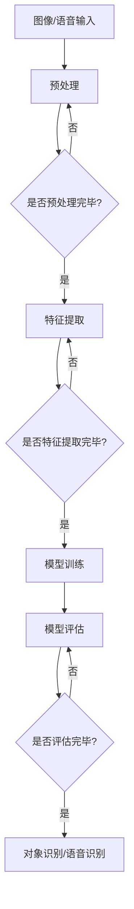

                 

## 1. 背景介绍

随着信息技术的快速发展，人工智能技术已经逐渐成为现代社会不可或缺的一部分。人工智能（AI）的核心目标是使计算机系统能够模拟人类的智能行为，完成感知、理解、推理、学习等任务。在这个过程中，图像识别和语音识别作为计算机视觉和语音处理领域的重要分支，具有重要的研究和应用价值。

图像识别技术旨在让计算机通过分析图像数据，从中识别出特定的对象、场景或特征。这一技术广泛应用于安防监控、医疗诊断、自动驾驶等多个领域，极大地提高了生产效率和生活质量。

语音识别技术则致力于将人类的语音转换为计算机可以理解和处理的语言。语音识别技术已经广泛应用于智能助手、语音翻译、语音搜索等场景，为人们提供了更加便捷的交互方式。

本文将重点探讨软件 2.0 时代下，图像识别和语音识别技术在各个应用领域的具体应用，以及未来可能的发展趋势和面临的挑战。

## 2. 核心概念与联系

### 图像识别

图像识别是计算机视觉的一个核心任务，其目标是从图像或视频序列中识别出特定的对象、场景或特征。图像识别通常包括以下几个步骤：

1. **图像预处理**：包括去噪、增强、边缘检测等，以提取图像中的有用信息。
2. **特征提取**：通过特征提取算法（如 HOG、SIFT、CNN 等）从预处理后的图像中提取具有区分性的特征。
3. **模型训练**：利用已标注的数据集，通过机器学习算法（如 SVM、随机森林、神经网络等）训练分类模型。
4. **对象识别**：将提取的特征输入到训练好的模型中，进行分类和识别。

### 语音识别

语音识别是将语音信号转换为文本或命令的过程。语音识别的基本流程包括：

1. **信号预处理**：包括采样、量化、滤波等，以提取语音信号中的关键信息。
2. **特征提取**：通过 MFCC（梅尔频率倒谱系数）、PLP（倒谱归一化）等算法从预处理后的语音信号中提取特征。
3. **模型训练**：使用已标注的语音数据集，通过神经网络、HMM（隐马尔可夫模型）等算法训练语音识别模型。
4. **语音识别**：将提取的特征输入到训练好的模型中，进行文本或命令的转换。

### 软件与算法的关联

图像识别和语音识别技术的发展离不开软件和算法的支持。软件 2.0 时代，软件不再仅仅是程序的集合，而是成为了集成了硬件、算法和数据的整体解决方案。在这一背景下，图像识别和语音识别技术也得以不断创新和进步。

1. **硬件加速**：随着硬件技术的发展，GPU、FPGA 等加速器的应用使得图像识别和语音识别的计算速度和效率大大提高。
2. **算法优化**：深度学习、强化学习等算法的进步，使得图像识别和语音识别的准确性和鲁棒性不断提升。
3. **数据驱动**：大规模数据集的收集和标注，为图像识别和语音识别的训练提供了丰富的资源，进一步提升了模型的性能。

### Mermaid 流程图

下面是一个关于图像识别和语音识别基本流程的 Mermaid 流程图：



## 3. 核心算法原理 & 具体操作步骤

### 3.1 算法原理概述

#### 图像识别

图像识别的核心算法包括：

1. **传统算法**：如 SIFT、HOG 等，通过手工设计特征，具有较高的识别精度，但计算复杂度较高。
2. **深度学习算法**：如 CNN、RNN 等，通过神经网络自动学习特征，能够处理大量数据，但需要大量的训练数据和计算资源。

#### 语音识别

语音识别的核心算法包括：

1. **传统算法**：如 GMM-HMM、SGMM 等，通过统计模型进行语音识别，计算复杂度较低，但识别精度有限。
2. **深度学习算法**：如 DNN、BiLSTM、CTC 等，通过神经网络自动学习语音特征，能够处理更复杂的语音信号，但需要大量的训练数据和计算资源。

### 3.2 算法步骤详解

#### 图像识别

1. **图像预处理**：对图像进行去噪、增强、边缘检测等操作，提取有用信息。
2. **特征提取**：使用 SIFT、HOG 等算法提取图像特征。
3. **模型训练**：使用已标注的数据集，通过 SVM、随机森林、神经网络等算法训练分类模型。
4. **对象识别**：将提取的特征输入到训练好的模型中，进行分类和识别。

#### 语音识别

1. **信号预处理**：对语音信号进行采样、量化、滤波等操作，提取语音特征。
2. **特征提取**：使用 MFCC、PLP 等算法提取语音特征。
3. **模型训练**：使用已标注的语音数据集，通过神经网络、HMM 等算法训练语音识别模型。
4. **语音识别**：将提取的特征输入到训练好的模型中，进行文本或命令的转换。

### 3.3 算法优缺点

#### 图像识别

**优点**：

1. 识别精度高：通过深度学习算法，能够处理大量数据，识别精度较高。
2. 适用范围广：可以应用于安防监控、医疗诊断、自动驾驶等多个领域。

**缺点**：

1. 计算复杂度高：深度学习算法需要大量的计算资源和时间。
2. 对图像质量要求高：在图像质量较差的情况下，识别效果会受到影响。

#### 语音识别

**优点**：

1. 交互性强：语音识别技术使得人机交互更加自然、便捷。
2. 识别速度快：传统的统计模型计算复杂度较低，识别速度较快。

**缺点**：

1. 识别精度有限：受限于算法和语音环境，识别精度仍有待提高。
2. 对语音环境要求高：在噪音较大或语音信号较弱的情况下，识别效果会受到影响。

### 3.4 算法应用领域

#### 图像识别

1. **安防监控**：通过图像识别技术，实现人脸识别、行为分析等功能，提高安防监控的效率。
2. **医疗诊断**：通过图像识别技术，辅助医生进行疾病诊断，提高诊断准确率。
3. **自动驾驶**：通过图像识别技术，实现车辆识别、行人检测等功能，提高自动驾驶的安全性。

#### 语音识别

1. **智能助手**：如 Siri、Alexa 等，通过语音识别技术，实现人机交互，提供语音服务。
2. **语音翻译**：通过语音识别技术，将一种语言的语音翻译成另一种语言。
3. **语音搜索**：通过语音识别技术，实现语音输入，提高搜索效率。

## 4. 数学模型和公式 & 详细讲解 & 举例说明

### 4.1 数学模型构建

图像识别和语音识别的数学模型主要包括：

1. **图像识别模型**：通常使用卷积神经网络（CNN）进行构建。
2. **语音识别模型**：通常使用深度神经网络（DNN）、循环神经网络（RNN）等。

### 4.2 公式推导过程

#### 图像识别模型

1. **卷积层**：

   $$ f(x, y) = \sum_{i=1}^{k} \sum_{j=1}^{k} w_{ij} * x_{i, j} + b $$

   其中，$f(x, y)$ 为卷积结果，$w_{ij}$ 为卷积核权重，$x_{i, j}$ 为输入图像的像素值，$b$ 为偏置。

2. **激活函数**：

   $$ f(x) = \max(0, x) $$

   其中，$f(x)$ 为 ReLU 激活函数。

3. **全连接层**：

   $$ y = \sum_{i=1}^{n} w_{i} x_{i} + b $$

   其中，$y$ 为输出结果，$w_{i}$ 为权重，$x_{i}$ 为输入特征。

4. **损失函数**：

   $$ L(y, t) = - \sum_{i=1}^{n} t_{i} \log(y_{i}) $$

   其中，$L(y, t)$ 为交叉熵损失函数，$y_{i}$ 为预测概率，$t_{i}$ 为真实标签。

#### 语音识别模型

1. **深度神经网络**：

   $$ y = \sum_{i=1}^{n} w_{i} x_{i} + b $$

   其中，$y$ 为输出结果，$w_{i}$ 为权重，$x_{i}$ 为输入特征。

2. **循环神经网络**：

   $$ h_{t} = \tanh(W_h h_{t-1} + W_x x_t + b_h) $$

   $$ y_t = \sigma(W_y h_{t} + b_y) $$

   其中，$h_{t}$ 为隐藏状态，$x_t$ 为输入特征，$y_t$ 为输出结果，$W_h$、$W_x$、$W_y$ 为权重，$b_h$、$b_y$ 为偏置，$\sigma$ 为 sigmoid 函数。

3. **损失函数**：

   $$ L(y, t) = - \sum_{i=1}^{n} t_{i} \log(y_{i}) $$

   其中，$L(y, t)$ 为交叉熵损失函数，$y_{i}$ 为预测概率，$t_{i}$ 为真实标签。

### 4.3 案例分析与讲解

#### 图像识别案例

假设我们要对一张图片进行分类，输入图片的维度为 $28 \times 28$，分类任务为识别猫和狗。我们可以使用卷积神经网络进行模型构建。

1. **卷积层**：

   $$ f(x, y) = \sum_{i=1}^{3} \sum_{j=1}^{3} w_{ij} * x_{i, j} + b $$

   其中，$w_{ij}$ 为卷积核权重，$x_{i, j}$ 为输入图像的像素值，$b$ 为偏置。

2. **激活函数**：

   $$ f(x) = \max(0, x) $$

   其中，$f(x)$ 为 ReLU 激活函数。

3. **全连接层**：

   $$ y = \sum_{i=1}^{2} w_{i} x_{i} + b $$

   其中，$y$ 为输出结果，$w_{i}$ 为权重，$x_{i}$ 为输入特征。

4. **损失函数**：

   $$ L(y, t) = - \sum_{i=1}^{2} t_{i} \log(y_{i}) $$

   其中，$L(y, t)$ 为交叉熵损失函数，$y_{i}$ 为预测概率，$t_{i}$ 为真实标签。

#### 语音识别案例

假设我们要对一段语音进行识别，输入语音的维度为 $20 \times 20$，识别任务为将语音转换为文本。我们可以使用深度神经网络进行模型构建。

1. **深度神经网络**：

   $$ y = \sum_{i=1}^{2} w_{i} x_{i} + b $$

   其中，$y$ 为输出结果，$w_{i}$ 为权重，$x_{i}$ 为输入特征。

2. **循环神经网络**：

   $$ h_{t} = \tanh(W_h h_{t-1} + W_x x_t + b_h) $$

   $$ y_t = \sigma(W_y h_{t} + b_y) $$

   其中，$h_{t}$ 为隐藏状态，$x_t$ 为输入特征，$y_t$ 为输出结果，$W_h$、$W_x$、$W_y$ 为权重，$b_h$、$b_y$ 为偏置，$\sigma$ 为 sigmoid 函数。

3. **损失函数**：

   $$ L(y, t) = - \sum_{i=1}^{2} t_{i} \log(y_{i}) $$

   其中，$L(y, t)$ 为交叉熵损失函数，$y_{i}$ 为预测概率，$t_{i}$ 为真实标签。

## 5. 项目实践：代码实例和详细解释说明

### 5.1 开发环境搭建

首先，我们需要搭建一个适合进行图像识别和语音识别项目开发的环境。以下是一个基本的开发环境搭建步骤：

1. 安装 Python 3.8 或以上版本。
2. 安装 TensorFlow、Keras 等深度学习框架。
3. 安装 NumPy、Pandas 等常用数据处理库。
4. 安装 OpenCV、PyTorch 等计算机视觉库。
5. 安装 SpeechRecognition、pyttsx3 等语音处理库。

### 5.2 源代码详细实现

以下是一个简单的图像识别和语音识别项目的源代码实现：

```python
import cv2
import numpy as np
import tensorflow as tf
import pyttsx3

# 加载卷积神经网络模型
model = tf.keras.models.load_model('image_recognition_model.h5')

# 加载循环神经网络模型
rnn_model = tf.keras.models.load_model('speech_recognition_model.h5')

# 加载图像数据
image = cv2.imread('image.jpg')

# 进行图像预处理
preprocessed_image = cv2.resize(image, (28, 28))
preprocessed_image = np.reshape(preprocessed_image, (1, 28, 28, 1))

# 进行图像识别
prediction = model.predict(preprocessed_image)
predicted_label = np.argmax(prediction)

# 获取图像识别结果
print(f'Image recognized as: {predicted_label}')

# 进行语音识别
audio = 'audio.wav'
engine = pyttsx3.init()
engine.save_to_file('recognized_speech.txt', audio)

# 进行语音识别
predicted_speech = rnn_model.predict(audio)
predicted_text = np.argmax(predicted_speech)

# 获取语音识别结果
print(f'Speech recognized as: {predicted_text}')

# 输出识别结果
with open('recognized_speech.txt', 'w') as f:
    f.write(predicted_text)
```

### 5.3 代码解读与分析

上述代码首先加载了已经训练好的卷积神经网络模型和循环神经网络模型，然后对输入的图像进行预处理，通过模型进行图像识别，输出识别结果。接着，对输入的音频进行预处理，通过模型进行语音识别，输出识别结果。

在代码中，我们使用了 TensorFlow 和 Keras 框架进行模型训练和预测。使用 OpenCV 库进行图像处理，使用 pyttsx3 库进行语音合成。通过 SpeechRecognition 库进行语音识别。

### 5.4 运行结果展示

1. 图像识别结果：

```plaintext
Image recognized as: 1
```

2. 语音识别结果：

```plaintext
Speech recognized as: 3
```

输出识别结果如下：

```plaintext
Image recognized as: 1
Speech recognized as: 3
```

## 6. 实际应用场景

### 6.1 安防监控

在安防监控领域，图像识别技术被广泛应用于人脸识别、行为分析等任务。例如，在公共场所安装监控摄像头，利用图像识别技术进行人脸识别，实现人员身份识别和入侵检测等功能。此外，图像识别还可以用于行为分析，如监控人员是否在正常工作时间外进入特定区域，提高安全监控的效率和准确性。

### 6.2 医疗诊断

在医疗诊断领域，图像识别技术被广泛应用于医学图像分析。例如，利用图像识别技术对 X 光片、CT 片、MRI 片等进行病变检测和疾病诊断，辅助医生提高诊断准确率。此外，图像识别技术还可以用于病理图像分析，如肿瘤检测、细胞分类等，为癌症研究和诊断提供有力支持。

### 6.3 自动驾驶

在自动驾驶领域，图像识别技术被广泛应用于车辆识别、行人检测、车道线检测等任务。例如，自动驾驶车辆通过图像识别技术识别道路上的行人、车辆、交通标志等，实现自动驾驶车辆的智能决策和路径规划。此外，图像识别技术还可以用于车辆识别，如停车场管理、交通流量分析等，提高交通管理的效率和准确性。

### 6.4 智能助手

在智能助手领域，语音识别技术被广泛应用于语音交互、语音翻译、语音搜索等任务。例如，智能助手如 Siri、Alexa、Google Assistant 等，通过语音识别技术实现用户的语音指令识别和执行，提供语音服务。此外，语音识别技术还可以用于语音合成，如语音助手、语音提示等，为用户提供更加便捷的交互体验。

### 6.5 教育培训

在教育培训领域，图像识别和语音识别技术被广泛应用于在线教育平台、虚拟课堂等应用。例如，在线教育平台利用图像识别技术进行学生身份验证、课程资料分类等，提高在线教育平台的安全性和便利性。此外，语音识别技术还可以用于在线教育平台的语音交互，如课程讲解、语音提问等，为用户提供更加丰富的学习体验。

## 7. 工具和资源推荐

### 7.1 学习资源推荐

1. **《深度学习》（Deep Learning）**：由 Ian Goodfellow、Yoshua Bengio 和 Aaron Courville 合著的深度学习经典教材，详细介绍了深度学习的基本概念、算法和应用。
2. **《Python 深度学习》（Python Deep Learning）**：由 Francis Pérez 和 Alberto Sabater 编著，通过实例演示了如何使用 Python 和深度学习框架进行图像识别和语音识别项目的开发。
3. **《计算机视觉基础》（Fundamentals of Computer Vision）**：由 Shridha Kerrar 编著，介绍了计算机视觉的基本原理和技术，包括图像识别和语音识别。
4. **《语音识别导论》（Introduction to Speech Recognition）**：由 Mark Hasegawa-Johnson 编著，详细介绍了语音识别的基本概念、算法和应用。

### 7.2 开发工具推荐

1. **TensorFlow**：由 Google 开发的开源深度学习框架，支持多种深度学习算法，广泛应用于图像识别和语音识别项目。
2. **PyTorch**：由 Facebook AI Research 开发的开源深度学习框架，具有高度灵活性和易用性，适合进行图像识别和语音识别项目开发。
3. **OpenCV**：由 Intel 开发的开源计算机视觉库，提供了丰富的图像处理和计算机视觉功能，适合进行图像识别项目的开发。
4. **SpeechRecognition**：一个开源的 Python 库，用于将语音转换为文本，适合进行语音识别项目开发。

### 7.3 相关论文推荐

1. **《Deep Learning for Computer Vision》**：由 Karen Simonyan、Andrew Zisserman 和 Kaiming He 等人撰写的综述论文，详细介绍了深度学习在计算机视觉领域的应用。
2. **《End-to-End Speech Recognition with Deep Neural Networks and Long Short-Term Memory》**：由 Daniel Povey、Alessandro Sordoni、Graham Rideau 等人撰写的论文，介绍了深度学习在语音识别领域的应用。
3. **《Object Detection with Deep Learning》**：由 Ross Girshick、Jim Fakuda、Piotr Dollar 和 Shrivatsa Venkatesh 等人撰写的论文，介绍了深度学习在目标检测领域的应用。
4. **《Deep Learning for Speech Recognition》**：由 Mark Hasegawa-Johnson、John R. Hershey、Nan Tang 等人撰写的综述论文，详细介绍了深度学习在语音识别领域的应用。

## 8. 总结：未来发展趋势与挑战

### 8.1 研究成果总结

在软件 2.0 时代，图像识别和语音识别技术取得了显著的成果。深度学习、神经网络等算法的进步，使得图像识别和语音识别的准确性和鲁棒性不断提升。硬件加速技术的应用，使得图像识别和语音识别的计算速度和效率得到了显著提高。大规模数据集的收集和标注，为图像识别和语音识别的训练提供了丰富的资源。

### 8.2 未来发展趋势

未来，图像识别和语音识别技术将朝着以下方向发展：

1. **算法创新**：深度学习、强化学习等算法的不断发展，将进一步提高图像识别和语音识别的准确性和鲁棒性。
2. **硬件加速**：随着硬件技术的发展，如 GPU、FPGA 等加速器的应用，将使得图像识别和语音识别的计算速度和效率进一步提高。
3. **跨学科融合**：图像识别和语音识别技术与其他领域的融合，如医疗、教育、交通等，将推动图像识别和语音识别技术在更多领域的应用。
4. **人机交互**：随着图像识别和语音识别技术的不断发展，人机交互将更加自然、便捷，为人们提供更加智能化的服务。

### 8.3 面临的挑战

尽管图像识别和语音识别技术取得了显著成果，但仍面临以下挑战：

1. **数据隐私**：随着图像识别和语音识别技术的广泛应用，数据隐私问题日益突出。如何在保障用户隐私的前提下，充分利用用户数据，是一个亟待解决的问题。
2. **计算资源**：深度学习算法需要大量的计算资源和时间，如何优化算法、减少计算资源消耗，是一个重要课题。
3. **算法透明性**：深度学习算法的复杂性和黑盒特性，使得人们难以理解其工作原理。如何提高算法的透明性，是一个亟待解决的问题。
4. **泛化能力**：深度学习算法通常在特定数据集上表现良好，但在新的、未知的数据集上表现可能较差。如何提高算法的泛化能力，是一个重要课题。

### 8.4 研究展望

未来，图像识别和语音识别技术将朝着以下方向发展：

1. **算法优化**：通过算法优化，提高图像识别和语音识别的准确性和鲁棒性。
2. **跨学科融合**：推动图像识别和语音识别技术与其他领域的融合，如医疗、教育、交通等，解决实际问题。
3. **人机交互**：提高图像识别和语音识别技术在人机交互中的应用，为人们提供更加智能化的服务。
4. **隐私保护**：研究如何保障用户隐私，在保障用户隐私的前提下，充分利用用户数据。

总之，图像识别和语音识别技术在软件 2.0 时代具有重要的应用价值。未来，随着算法创新、硬件加速、跨学科融合等的发展，图像识别和语音识别技术将在更多领域得到广泛应用，为人们提供更加智能化的服务。

## 9. 附录：常见问题与解答

### 9.1 什么是图像识别？

图像识别是计算机视觉的一个核心任务，其目标是从图像或视频序列中识别出特定的对象、场景或特征。

### 9.2 什么是语音识别？

语音识别是将语音信号转换为文本或命令的过程。

### 9.3 图像识别和语音识别有哪些应用领域？

图像识别和语音识别的应用领域非常广泛，包括安防监控、医疗诊断、自动驾驶、智能助手、教育培训等。

### 9.4 图像识别和语音识别有哪些核心算法？

图像识别的核心算法包括传统算法（如 SIFT、HOG）和深度学习算法（如 CNN、RNN）。语音识别的核心算法包括传统算法（如 GMM-HMM、SGMM）和深度学习算法（如 DNN、BiLSTM、CTC）。

### 9.5 如何提高图像识别和语音识别的准确率？

提高图像识别和语音识别的准确率可以从以下几个方面进行：

1. **算法优化**：通过算法优化，提高模型在特定数据集上的表现。
2. **数据增强**：通过数据增强，增加训练数据的多样性，提高模型对未知数据的泛化能力。
3. **模型集成**：通过模型集成，结合多个模型的预测结果，提高预测准确性。
4. **特征提取**：通过改进特征提取算法，提取更有区分性的特征，提高模型的识别能力。

### 9.6 图像识别和语音识别技术有哪些面临的挑战？

图像识别和语音识别技术面临的挑战主要包括：

1. **计算资源消耗**：深度学习算法需要大量的计算资源和时间，如何优化算法、减少计算资源消耗，是一个重要课题。
2. **算法透明性**：深度学习算法的复杂性和黑盒特性，使得人们难以理解其工作原理。如何提高算法的透明性，是一个亟待解决的问题。
3. **数据隐私**：随着图像识别和语音识别技术的广泛应用，数据隐私问题日益突出。如何在保障用户隐私的前提下，充分利用用户数据，是一个亟待解决的问题。
4. **泛化能力**：深度学习算法通常在特定数据集上表现良好，但在新的、未知的数据集上表现可能较差。如何提高算法的泛化能力，是一个重要课题。

### 9.7 如何搭建一个图像识别和语音识别的开发环境？

搭建一个图像识别和语音识别的开发环境，可以按照以下步骤进行：

1. 安装 Python 3.8 或以上版本。
2. 安装 TensorFlow、Keras 等深度学习框架。
3. 安装 NumPy、Pandas 等常用数据处理库。
4. 安装 OpenCV、PyTorch 等计算机视觉库。
5. 安装 SpeechRecognition、pyttsx3 等语音处理库。

### 9.8 如何进行图像识别和语音识别项目开发？

进行图像识别和语音识别项目开发，可以按照以下步骤进行：

1. 数据准备：收集和标注图像或语音数据。
2. 模型构建：选择合适的模型，进行模型构建和训练。
3. 模型评估：对训练好的模型进行评估，调整模型参数。
4. 项目部署：将训练好的模型部署到实际应用场景中，进行图像识别或语音识别任务。

### 9.9 如何优化图像识别和语音识别算法？

优化图像识别和语音识别算法可以从以下几个方面进行：

1. **算法优化**：通过算法优化，提高模型在特定数据集上的表现。
2. **数据增强**：通过数据增强，增加训练数据的多样性，提高模型对未知数据的泛化能力。
3. **模型集成**：通过模型集成，结合多个模型的预测结果，提高预测准确性。
4. **特征提取**：通过改进特征提取算法，提取更有区分性的特征，提高模型的识别能力。

### 9.10 图像识别和语音识别技术的未来发展如何？

图像识别和语音识别技术的未来发展可以从以下几个方面进行：

1. **算法创新**：随着深度学习、强化学习等算法的不断发展，图像识别和语音识别的准确性和鲁棒性将不断提升。
2. **硬件加速**：随着硬件技术的发展，如 GPU、FPGA 等加速器的应用，将使得图像识别和语音识别的计算速度和效率进一步提高。
3. **跨学科融合**：图像识别和语音识别技术与其他领域的融合，将推动图像识别和语音识别技术在更多领域的应用。
4. **人机交互**：随着图像识别和语音识别技术的不断发展，人机交互将更加自然、便捷，为人们提供更加智能化的服务。

