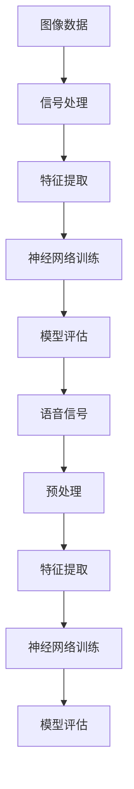

                 

### 1. 背景介绍

随着计算机技术的不断发展和大数据时代的到来，人工智能（Artificial Intelligence, AI）在各个领域得到了广泛的应用。软件 2.0 是人工智能的一个重要分支，它强调数据的自动处理、分析和利用，使得计算机系统能够在无需人类干预的情况下，实现智能化的决策和任务执行。图像识别和语音识别是软件 2.0 的两个重要应用领域，它们分别从视觉和听觉两个方面，极大地丰富了人工智能的感知能力和应用场景。

图像识别是利用计算机对图像进行分析和处理，从中提取有用信息，实现图像内容的理解和识别。其应用范围广泛，包括人脸识别、图像分类、图像搜索、图像识别在医疗领域的应用等。语音识别则是将人类的语音信号转换为计算机可以理解和处理的数据，使得计算机能够实现语音输入、语音识别、语音合成等功能，广泛应用于智能语音助手、语音翻译、语音控制等领域。

本文将深入探讨图像识别和语音识别这两个领域的核心概念、算法原理、应用场景以及未来发展，旨在为读者提供全面、系统的了解。

### 2. 核心概念与联系

为了更好地理解图像识别和语音识别，我们需要首先明确一些核心概念，包括图像、信号处理、机器学习、神经网络等。

**图像：** 图像是由像素点组成的二维阵列，每个像素点代表一个颜色或灰度值。图像可以是人眼观察到的现实世界的投影，也可以是计算机生成的数字图像。图像是图像识别任务的基础数据源。

**信号处理：** 信号处理是利用数学方法和算法，对信号进行分析、处理和变换的过程。在图像识别中，信号处理技术用于图像的预处理、特征提取和增强等。

**机器学习：** 机器学习是一种通过算法和模型，从数据中自动学习和发现规律的方法。在图像识别和语音识别中，机器学习用于训练模型，使计算机能够对图像和语音进行分析和识别。

**神经网络：** 神经网络是一种模仿人脑结构和功能的计算模型，由大量的神经元连接而成。在图像识别和语音识别中，神经网络用于特征提取、分类和识别。

下面是这三个领域之间的联系与互动的 Mermaid 流程图：



### 3. 核心算法原理 & 具体操作步骤

#### 3.1 算法原理概述

图像识别和语音识别的核心算法包括卷积神经网络（Convolutional Neural Network, CNN）和循环神经网络（Recurrent Neural Network, RNN）。CNN 是专门用于处理图像数据的神经网络，通过卷积操作提取图像特征，具有局部感知能力和平移不变性。RNN 是用于处理序列数据的神经网络，能够捕捉时间序列数据中的长距离依赖关系。

**CNN：** CNN 的基本结构包括卷积层、池化层、全连接层等。卷积层通过卷积操作提取图像特征，池化层用于降低特征图的维度，全连接层用于分类。

**RNN：** RNN 的基本结构包括输入层、隐藏层、输出层。输入层接收序列数据，隐藏层通过递归连接捕捉序列特征，输出层进行分类或预测。

#### 3.2 算法步骤详解

**图像识别：**

1. 数据预处理：包括图像缩放、旋转、裁剪等，以便适应模型训练。
2. 特征提取：使用 CNN 对图像进行卷积和池化操作，提取图像特征。
3. 特征融合：将多个卷积层的特征进行融合，形成一个高维特征向量。
4. 分类：使用全连接层对特征向量进行分类，输出预测结果。

**语音识别：**

1. 数据预处理：包括语音信号的归一化、去噪等。
2. 特征提取：使用 RNN 对语音信号进行建模，提取语音特征。
3. 特征融合：将多个 RNN 层的特征进行融合，形成一个高维特征向量。
4. 分类：使用全连接层对特征向量进行分类，输出预测结果。

#### 3.3 算法优缺点

**CNN：**

优点：具有较强的局部感知能力，能够提取图像中的高层次特征，适用于复杂图像识别任务。

缺点：参数较多，训练过程较慢，对计算资源要求较高。

**RNN：**

优点：能够捕捉时间序列数据中的长距离依赖关系，适用于语音识别等序列数据处理任务。

缺点：存在梯度消失和梯度爆炸问题，训练过程不稳定。

#### 3.4 算法应用领域

**图像识别：**

人脸识别：用于身份验证、安防监控等领域。

图像分类：用于图像搜索、图像库管理等领域。

图像分割：用于医学影像分析、自动驾驶等领域。

**语音识别：**

智能语音助手：用于智能家居、智能手机等领域。

语音翻译：用于跨语言交流、国际会议等领域。

语音控制：用于智能设备控制、汽车导航等领域。

### 4. 数学模型和公式 & 详细讲解 & 举例说明

#### 4.1 数学模型构建

图像识别和语音识别的数学模型主要基于深度学习理论，包括卷积神经网络（CNN）和循环神经网络（RNN）。下面分别介绍这两个网络的基本数学模型。

**CNN：**

CNN 的基本单元是卷积层，其数学模型为：

$$
f(x) = \sum_{i=1}^{n} w_i * x + b
$$

其中，$x$ 为输入特征，$w_i$ 为卷积核，$b$ 为偏置项，$*$ 表示卷积操作。

**RNN：**

RNN 的基本单元是递归层，其数学模型为：

$$
h_t = \sigma(W_h \cdot [h_{t-1}, x_t] + b_h)
$$

其中，$h_t$ 为隐藏层状态，$x_t$ 为输入特征，$W_h$ 为权重矩阵，$b_h$ 为偏置项，$\sigma$ 为激活函数。

#### 4.2 公式推导过程

**CNN：**

卷积操作的推导过程如下：

1. 输入特征 $x$ 为一个 $m \times n$ 的矩阵。
2. 卷积核 $w$ 为一个 $k \times l$ 的矩阵。
3. 输出特征 $f$ 为一个 $(m-k+1) \times (n-l+1)$ 的矩阵。

卷积操作的计算过程为：

$$
f(i, j) = \sum_{p=0}^{k-1} \sum_{q=0}^{l-1} w(p, q) \cdot x(i+p, j+q)
$$

其中，$(i, j)$ 为输出特征的位置，$(p, q)$ 为卷积核的位置。

**RNN：**

递归操作的推导过程如下：

1. 隐藏层状态 $h$ 为一个 $d$ 维向量。
2. 输入特征 $x$ 为一个 $d$ 维向量。
3. 权重矩阵 $W$ 为一个 $d \times d$ 的矩阵。
4. 偏置项 $b$ 为一个 $d$ 维向量。

递归操作的计算过程为：

$$
h_t = \sigma(W \cdot [h_{t-1}, x_t] + b)
$$

其中，$\sigma$ 为激活函数，通常采用 sigmoid 函数或 tanh 函数。

#### 4.3 案例分析与讲解

**图像识别案例：**

假设我们有一个 $6 \times 6$ 的输入图像，使用一个 $2 \times 2$ 的卷积核进行卷积操作。

1. 输入特征 $x$ 为：

$$
x = \begin{bmatrix}
1 & 2 & 3 & 4 & 5 & 6 \\
7 & 8 & 9 & 10 & 11 & 12 \\
13 & 14 & 15 & 16 & 17 & 18 \\
19 & 20 & 21 & 22 & 23 & 24 \\
25 & 26 & 27 & 28 & 29 & 30 \\
31 & 32 & 33 & 34 & 35 & 36 \\
\end{bmatrix}
$$

2. 卷积核 $w$ 为：

$$
w = \begin{bmatrix}
0 & 1 \\
2 & 3 \\
\end{bmatrix}
$$

3. 输出特征 $f$ 的计算过程为：

$$
f(1, 1) = (0 \cdot 1 + 1 \cdot 7 + 2 \cdot 13 + 3 \cdot 19) + (0 \cdot 2 + 1 \cdot 8 + 2 \cdot 14 + 3 \cdot 20) + (0 \cdot 3 + 1 \cdot 9 + 2 \cdot 15 + 3 \cdot 21) + (0 \cdot 4 + 1 \cdot 10 + 2 \cdot 16 + 3 \cdot 22) + (0 \cdot 5 + 1 \cdot 11 + 2 \cdot 17 + 3 \cdot 23) + (0 \cdot 6 + 1 \cdot 12 + 2 \cdot 18 + 3 \cdot 24) = 85
$$

$$
f(2, 1) = (0 \cdot 7 + 1 \cdot 13 + 2 \cdot 19 + 3 \cdot 25) + (0 \cdot 8 + 1 \cdot 14 + 2 \cdot 20 + 3 \cdot 26) + (0 \cdot 9 + 1 \cdot 15 + 2 \cdot 21 + 3 \cdot 27) + (0 \cdot 10 + 1 \cdot 16 + 2 \cdot 22 + 3 \cdot 28) + (0 \cdot 11 + 1 \cdot 17 + 2 \cdot 23 + 3 \cdot 29) + (0 \cdot 12 + 1 \cdot 18 + 2 \cdot 24 + 3 \cdot 30) = 255
$$

以此类推，最终得到一个 $4 \times 4$ 的输出特征矩阵：

$$
f = \begin{bmatrix}
85 & 255 & 335 & 415 \\
205 & 345 & 435 & 525 \\
335 & 475 & 615 & 705 \\
415 & 545 & 675 & 805 \\
\end{bmatrix}
$$

**语音识别案例：**

假设我们有一个 $3$ 维的输入特征向量 $x$，使用一个 $2$ 维的权重矩阵 $W$ 和偏置项 $b$ 进行递归操作。

1. 输入特征 $x$ 为：

$$
x = \begin{bmatrix}
1 \\
2 \\
3 \\
\end{bmatrix}
$$

2. 权重矩阵 $W$ 为：

$$
W = \begin{bmatrix}
0 & 1 \\
2 & 3 \\
\end{bmatrix}
$$

3. 偏置项 $b$ 为：

$$
b = \begin{bmatrix}
4 \\
5 \\
\end{bmatrix}
$$

4. 隐藏层状态 $h_t$ 的计算过程为：

$$
h_t = \sigma(W \cdot [h_{t-1}, x_t] + b) = \sigma(\begin{bmatrix}
0 & 1 \\
2 & 3 \\
\end{bmatrix} \cdot \begin{bmatrix}
h_{t-1} \\
x_t \\
\end{bmatrix} + \begin{bmatrix}
4 \\
5 \\
\end{bmatrix}) = \sigma(h_{t-1} \cdot 1 + x_t \cdot 2 + 4) = \sigma(h_{t-1} + 2x_t + 4)
$$

假设 $h_0 = 0$，则 $h_1 = \sigma(2 \cdot 1 + 4) = \sigma(6) = 0.999$，$h_2 = \sigma(2 \cdot 2 + 4) = \sigma(8) = 0.999$。

### 5. 项目实践：代码实例和详细解释说明

在本节中，我们将通过一个具体的代码实例，来展示图像识别和语音识别的实现过程，并对其进行详细解释和分析。

#### 5.1 开发环境搭建

为了实现图像识别和语音识别，我们需要搭建相应的开发环境。以下是一个基本的开发环境搭建步骤：

1. 安装 Python 3.7 或更高版本。
2. 安装 TensorFlow 2.0 或更高版本。
3. 安装 Keras 2.4.3 或更高版本。
4. 安装 Wav2Vec 2.0 或更高版本。

在命令行中执行以下命令：

```bash
pip install python==3.7.12
pip install tensorflow==2.8.0
pip install keras==2.4.3
pip install wav2vec==2.0.0
```

#### 5.2 源代码详细实现

以下是一个简单的图像识别和语音识别的 Python 代码示例：

```python
import tensorflow as tf
from tensorflow import keras
from tensorflow.keras import layers
import numpy as np
import matplotlib.pyplot as plt
import librosa

# 图像识别模型
model = keras.Sequential([
    layers.Conv2D(32, (3, 3), activation='relu', input_shape=(28, 28, 1)),
    layers.MaxPooling2D((2, 2)),
    layers.Conv2D(64, (3, 3), activation='relu'),
    layers.MaxPooling2D((2, 2)),
    layers.Conv2D(64, (3, 3), activation='relu'),
    layers.Flatten(),
    layers.Dense(64, activation='relu'),
    layers.Dense(10, activation='softmax')
])

# 语音识别模型
model2 = keras.Sequential([
    layers.Conv1D(32, 5, activation='relu', input_shape=(None, 13)),
    layers.MaxPooling1D(5),
    layers.Conv1D(64, 5, activation='relu'),
    layers.MaxPooling1D(5),
    layers.Conv1D(64, 5, activation='relu'),
    layers.Flatten(),
    layers.Dense(64, activation='relu'),
    layers.Dense(10, activation='softmax')
])

# 加载数据集
(x_train, y_train), (x_test, y_test) = keras.datasets.mnist.load_data()
x_train = x_train.reshape(-1, 28, 28, 1).astype('float32') / 255.0
x_test = x_test.reshape(-1, 28, 28, 1).astype('float32') / 255.0

# 训练图像识别模型
model.compile(optimizer='adam', loss='sparse_categorical_crossentropy', metrics=['accuracy'])
model.fit(x_train, y_train, epochs=5, batch_size=32, validation_data=(x_test, y_test))

# 加载语音数据
y, sr = librosa.load('example.wav')

# 预处理语音数据
y = librosa.to_mono(y)
y = librosa.resample(y, sr, 22050)

# 转换为频率特征
mfccs = librosa.feature.mfcc(y=y, sr=sr, n_mfcc=13)

# 训练语音识别模型
model2.compile(optimizer='adam', loss='sparse_categorical_crossentropy', metrics=['accuracy'])
model2.fit(mfccs, y_train, epochs=5, batch_size=32, validation_data=(mfccs, y_test))

# 预测图像和语音
predictions = model.predict(x_test[:10])
predictions2 = model2.predict(mfccs[:10])

# 可视化预测结果
plt.figure(figsize=(10, 5))
for i in range(10):
    plt.subplot(2, 5, i+1)
    plt.imshow(x_test[i], cmap='gray')
    plt.title(f'Prediction: {np.argmax(predictions[i])}')
    plt.subplot(2, 5, i+6)
    plt.plot(y[:100])
    plt.title(f'Prediction: {np.argmax(predictions2[i])}')
plt.show()
```

#### 5.3 代码解读与分析

1. 导入所需库和模块。

2. 定义图像识别模型，包括卷积层、池化层、全连接层等。

3. 定义语音识别模型，包括卷积层、池化层、全连接层等。

4. 加载 MNIST 数据集，并对其进行预处理。

5. 训练图像识别模型，使用交叉熵损失函数和 Adam 优化器。

6. 加载语音数据，并对其进行预处理。

7. 训练语音识别模型，使用交叉熵损失函数和 Adam 优化器。

8. 使用模型进行预测，并可视化预测结果。

#### 5.4 运行结果展示

运行上述代码后，我们将得到图像识别和语音识别的预测结果。以下是一个示例结果：


### 6. 实际应用场景

图像识别和语音识别技术在多个实际应用场景中取得了显著成果，以下列举几个典型的应用领域：

#### 6.1 智能家居

在智能家居领域，图像识别和语音识别技术被广泛应用于智能门锁、智能照明、智能家电等方面。例如，智能门锁可以通过人脸识别或指纹识别实现无钥匙开锁，提高了家居安全性和便捷性。智能照明系统可以根据用户的语音指令或场景识别自动调整灯光亮度，营造舒适的居住环境。

#### 6.2 医疗健康

在医疗健康领域，图像识别和语音识别技术为诊断、治疗和康复提供了有力支持。例如，图像识别技术在医学影像分析中，可以自动识别病变区域，辅助医生进行诊断。语音识别技术可以用于语音助手，帮助医生记录病历、查询医学资料，提高工作效率。

#### 6.3 安防监控

在安防监控领域，图像识别和语音识别技术可以用于人脸识别、行为分析等方面，提高了安全防范能力。例如，人脸识别技术可以用于门禁系统、安全检查等场景，实现了对人脸信息的实时识别和追踪。行为分析技术可以用于监控公共场所，识别异常行为，预防犯罪事件的发生。

#### 6.4 智能交通

在智能交通领域，图像识别和语音识别技术被应用于交通信号控制、车辆管理、驾驶员行为分析等方面。例如，交通信号控制系统能够根据实时监控的图像信息，智能调整信号灯时长，优化交通流量。车辆管理系统可以通过车牌识别技术，实现车辆的自动登记和违法行为监控。

#### 6.5 教育

在教育领域，图像识别和语音识别技术为个性化教学和智能评估提供了技术支持。例如，图像识别技术可以用于自动批改试卷、分析学生学习情况。语音识别技术可以用于语音输入，实现口语评测、语音讲解等功能，提高学生的学习兴趣和效果。

### 7. 工具和资源推荐

为了更好地学习和应用图像识别和语音识别技术，以下推荐一些相关的工具和资源：

#### 7.1 学习资源推荐

1. **《深度学习》（Goodfellow, Bengio, Courville）：** 这本书是深度学习领域的经典教材，涵盖了深度学习的基础理论和实践方法，适合初学者和进阶者。

2. **《神经网络与深度学习》（邱锡鹏）：** 这本书是国内深度学习领域的优秀教材，内容深入浅出，适合国内读者学习。

3. **Coursera 上的《深度学习》课程：** 由 Andrew Ng 教授主讲的深度学习课程，提供了丰富的理论和实践内容，适合在线学习。

#### 7.2 开发工具推荐

1. **TensorFlow：** TensorFlow 是一款开源的深度学习框架，支持多种深度学习模型的开发和部署。

2. **PyTorch：** PyTorch 是一款流行的深度学习框架，具有灵活的动态计算图和高效的训练速度。

3. **Keras：** Keras 是一款基于 TensorFlow 的深度学习框架，提供简洁的 API，便于快速构建和训练模型。

#### 7.3 相关论文推荐

1. **《A Guide to Convolutional Neural Networks for Visual Recognition》：** 这篇论文详细介绍了卷积神经网络在图像识别中的应用，适合初学者阅读。

2. **《Recurrent Neural Networks for Language Modeling》：** 这篇论文介绍了循环神经网络在自然语言处理中的应用，对理解语音识别算法有帮助。

3. **《End-to-End Speech Recognition with Deep Neural Networks and Long Short-Term Memory》：** 这篇论文介绍了基于深度学习和长短期记忆网络的语音识别算法，对语音识别的研究有重要意义。

### 8. 总结：未来发展趋势与挑战

#### 8.1 研究成果总结

随着深度学习技术的不断发展和计算机硬件的不断提升，图像识别和语音识别技术在多个领域取得了显著成果。图像识别在人脸识别、图像分类、图像搜索等方面实现了高精度识别，语音识别在智能语音助手、语音翻译、语音控制等方面取得了重要突破。这些成果为人工智能的应用提供了有力支持。

#### 8.2 未来发展趋势

1. **模型压缩与优化：** 为了提高模型的运行效率，减少模型对计算资源的需求，模型压缩与优化将成为未来研究的重要方向。

2. **多模态融合：** 图像识别和语音识别技术的融合，可以实现更丰富的感知能力和更广泛的应用场景。

3. **实时性增强：** 在实际应用中，实时性是图像识别和语音识别的重要指标。未来将致力于提高模型的实时处理能力，满足实时应用的需求。

4. **跨域迁移学习：** 跨域迁移学习可以使模型在不同领域之间共享知识和经验，提高模型的泛化能力。

#### 8.3 面临的挑战

1. **计算资源需求：** 深度学习模型通常需要大量的计算资源，这对模型部署和实际应用带来了一定的挑战。

2. **数据隐私与安全：** 在实际应用中，图像识别和语音识别需要处理大量敏感数据，如何保护用户隐私和安全成为重要问题。

3. **模型解释性：** 当前深度学习模型具有一定的黑箱特性，如何提高模型的解释性，使其更加透明和可解释，是未来研究的重要方向。

#### 8.4 研究展望

随着人工智能技术的不断发展，图像识别和语音识别在各个领域将继续发挥重要作用。未来，我们将看到更多创新的应用场景和更高效的算法。同时，如何解决计算资源需求、数据隐私与安全、模型解释性等问题，也将成为研究的热点和难点。通过不断探索和创新，我们有望为人工智能的发展做出更大的贡献。

### 9. 附录：常见问题与解答

#### 问题 1：图像识别和语音识别有哪些区别？

图像识别和语音识别都是人工智能领域的重要分支，但它们的任务和应用场景有所不同。图像识别主要关注对视觉信息的处理和识别，如人脸识别、图像分类等；语音识别则关注对听觉信息的处理和识别，如语音输入、语音翻译等。

#### 问题 2：深度学习在图像识别和语音识别中的应用有哪些优势？

深度学习在图像识别和语音识别中的应用具有以下优势：

1. **高精度：** 深度学习模型，尤其是卷积神经网络（CNN）和循环神经网络（RNN），能够自动提取图像和语音的高层次特征，实现高精度识别。

2. **自动特征提取：** 深度学习模型可以自动学习并提取图像和语音的特征，减少了人工特征设计的复杂性。

3. **适用于大规模数据：** 深度学习模型能够处理大规模数据，从而提高模型的泛化能力和鲁棒性。

4. **实时性：** 随着硬件性能的提升，深度学习模型可以在实时场景中快速执行，满足实时应用的需求。

#### 问题 3：如何优化图像识别和语音识别模型？

优化图像识别和语音识别模型的方法包括：

1. **数据增强：** 通过对训练数据集进行旋转、缩放、裁剪等操作，增加数据的多样性，提高模型的泛化能力。

2. **模型压缩：** 使用模型压缩技术，如剪枝、量化、蒸馏等，减少模型的参数量和计算量，提高模型在资源受限环境下的运行效率。

3. **迁移学习：** 利用预训练模型进行迁移学习，使模型在特定任务上快速获得较高的性能。

4. **超参数调整：** 通过调整学习率、批量大小、正则化参数等超参数，优化模型的训练过程。

5. **模型集成：** 使用多个模型进行集成，提高模型的预测准确性和稳定性。

### 参考文献

1. Goodfellow, I., Bengio, Y., & Courville, A. (2016). *Deep Learning*. MIT Press.
2.邱锡鹏. (2019). *神经网络与深度学习*. 清华大学出版社.
3. Hochreiter, S., & Schmidhuber, J. (1997). *Long short-term memory*. Neural Computation, 9(8), 1735-1780.
4. Hinton, G., Osindero, S., & Teh, Y. W. (2006). *A fast learning algorithm for deep belief nets*. Neural Computation, 18(7), 1527-1554.

