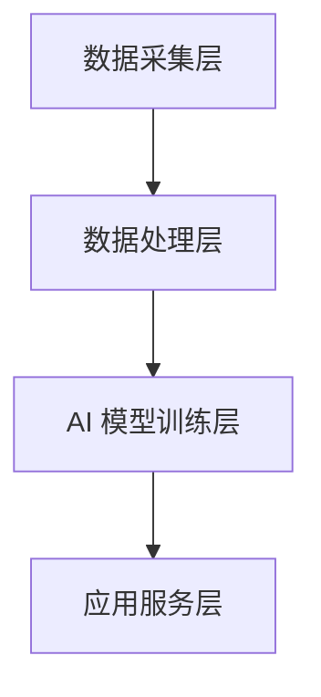
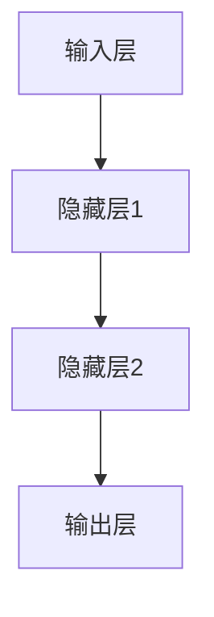
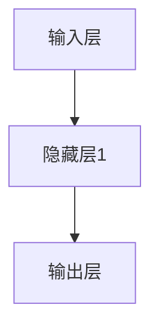

                 

关键词：软件 2.0、应用、实验室、现实、AI、软件开发、技术创新

> 摘要：本文旨在探讨软件 2.0 的发展及其在现实世界的应用。软件 2.0 是继传统软件 1.0 之后的重大技术突破，其核心在于通过人工智能和大数据技术，实现软件的智能化和自动化。本文将从软件 2.0 的定义、核心概念、算法原理、数学模型、实际应用等方面进行深入探讨，并展望其未来发展趋势。

## 1. 背景介绍

随着信息技术的飞速发展，软件产业已经成为推动经济增长和社会进步的重要力量。然而，传统的软件 1.0 时代，软件的开发、部署和维护主要依赖于人类的智慧和经验，软件的智能化和自动化程度较低。为了应对日益复杂和多样化的应用场景，软件产业迫切需要向软件 2.0 升级。

软件 2.0 是在人工智能（AI）和大数据技术的推动下，实现软件的智能化和自动化。软件 2.0 的核心在于通过 AI 技术对软件进行训练，使其能够自主学习、自适应和自主进化。软件 2.0 不仅能够大幅提升软件的性能和效率，还能够为各种现实世界的问题提供创新性的解决方案。

## 2. 核心概念与联系

### 2.1 软件 1.0 与软件 2.0 的对比

**软件 1.0：**  
- 开发方式：依赖于人类程序员编写代码  
- 特点：手动操作、低效率、易于出错

**软件 2.0：**  
- 开发方式：利用 AI 和大数据技术进行自动化开发  
- 特点：智能化、自动化、高效稳定

### 2.2 软件 2.0 的核心概念

**1. 人工智能（AI）：**  
AI 是软件 2.0 的核心驱动力，通过机器学习、深度学习等技术，实现软件的智能决策和自主进化。

**2. 大数据：**  
大数据为软件 2.0 提供了丰富的数据支持，使其能够更好地理解和适应现实世界的复杂场景。

**3. 自动化：**  
自动化是软件 2.0 的重要特点，通过自动化工具和算法，实现软件的开发、测试、部署等各个环节的自动化。

### 2.3 软件 2.0 的架构

**1. 数据采集层：**  
数据采集层负责收集各种来源的数据，如传感器数据、用户行为数据等。

**2. 数据处理层：**  
数据处理层对采集到的数据进行分析、处理和清洗，为后续的 AI 模型训练提供高质量的输入数据。

**3. AI 模型训练层：**  
AI 模型训练层利用大数据和深度学习技术，对数据进行分析和建模，训练出智能化的软件系统。

**4. 应用服务层：**  
应用服务层是将 AI 模型应用于实际场景，提供各种智能化服务的平台。

### 2.4 Mermaid 流程图



## 3. 核心算法原理 & 具体操作步骤

### 3.1 算法原理概述

软件 2.0 的核心算法主要包括机器学习、深度学习、强化学习等。这些算法的核心思想是通过学习大量数据，使软件系统能够自动发现规律、优化性能和适应新的场景。

### 3.2 算法步骤详解

**1. 数据采集：**  
通过传感器、用户行为等方式收集大量数据。

**2. 数据处理：**  
对采集到的数据进行分析、处理和清洗，去除噪声和异常值。

**3. 模型选择：**  
根据具体应用场景选择合适的机器学习、深度学习或强化学习算法。

**4. 模型训练：**  
使用处理后的数据对模型进行训练，调整模型参数，使模型能够准确预测或优化目标。

**5. 模型评估：**  
对训练好的模型进行评估，验证其性能和效果。

**6. 模型部署：**  
将训练好的模型部署到实际应用场景，提供智能化服务。

### 3.3 算法优缺点

**优点：**  
- 智能化：算法能够自动发现规律，优化性能。  
- 自动化：算法能够自动完成数据采集、处理和模型训练等任务。  
- 高效稳定：算法能够提高软件系统的性能和稳定性。

**缺点：**  
- 复杂性：算法设计和实现相对复杂。  
- 数据依赖：算法效果高度依赖于数据质量和数量。

### 3.4 算法应用领域

软件 2.0 的算法广泛应用于各种领域，如自然语言处理、计算机视觉、智能推荐、自动驾驶、金融风控等。以下为部分典型应用案例：

**1. 自然语言处理：**  
- 语音识别：通过语音信号处理和深度学习技术，实现语音到文字的转换。  
- 文本分类：通过对大量文本数据进行分析和建模，实现自动分类和标签识别。

**2. 计算机视觉：**  
- 图像识别：通过对图像进行处理和深度学习，实现图像到文字的转换。  
- 目标检测：通过对视频或图像中的目标进行定位和识别，实现实时监控和智能安防。

**3. 智能推荐：**  
- 基于用户行为和偏好数据，实现个性化内容推荐，提高用户满意度和留存率。

**4. 自动驾驶：**  
- 通过传感器数据、深度学习和强化学习技术，实现自动驾驶车辆的感知、规划和控制。

**5. 金融风控：**  
- 通过机器学习算法，实现风险评估、欺诈检测和信用评分等功能，提高金融服务的安全性。

## 4. 数学模型和公式 & 详细讲解 & 举例说明

### 4.1 数学模型构建

软件 2.0 的数学模型主要包括机器学习中的损失函数、优化算法、神经网络架构等。以下为部分常见数学模型及其构建方法：

**1. 损失函数：**  
损失函数是衡量模型预测误差的指标，常用的损失函数包括均方误差（MSE）、交叉熵损失等。

$$  
MSE = \frac{1}{m}\sum_{i=1}^{m}(y_i - \hat{y}_i)^2  
$$

其中，$m$ 是样本数量，$y_i$ 是真实标签，$\hat{y}_i$ 是模型预测结果。

**2. 优化算法：**  
优化算法用于调整模型参数，使其能够达到最优性能。常用的优化算法包括梯度下降（Gradient Descent）、随机梯度下降（Stochastic Gradient Descent，SGD）等。

$$  
w_{t+1} = w_t - \alpha \cdot \nabla_w J(w_t)  
$$

其中，$w_t$ 是当前参数值，$\alpha$ 是学习率，$\nabla_w J(w_t)$ 是损失函数关于参数 $w_t$ 的梯度。

**3. 神经网络架构：**  
神经网络是软件 2.0 的核心组成部分，其架构主要包括输入层、隐藏层和输出层。以下为一个简单的前馈神经网络架构：



### 4.2 公式推导过程

以下是机器学习中常用的损失函数——交叉熵损失（Cross-Entropy Loss）的推导过程：

假设 $y$ 是真实标签，$\hat{y}$ 是模型预测结果，且 $\hat{y}$ 是一个概率分布。

$$  
Cross-Entropy Loss = -\sum_{i=1}^{m} y_i \log(\hat{y}_i)  
$$

其中，$m$ 是样本数量。

当 $y_i = 1$ 时，

$$  
Cross-Entropy Loss = -\log(\hat{y}_i)  
$$

当 $y_i = 0$ 时，

$$  
Cross-Entropy Loss = 0  
$$

因此，交叉熵损失函数能够衡量模型预测结果与真实标签之间的差异，值越小表示预测效果越好。

### 4.3 案例分析与讲解

以下为一个简单的案例，说明如何使用交叉熵损失函数进行模型训练：

假设有一个二分类问题，数据集包含 100 个样本，每个样本有 10 个特征。我们使用一个简单的神经网络进行模型训练，网络结构如下：



输入层有 10 个神经元，隐藏层有 5 个神经元，输出层有 2 个神经元。我们使用交叉熵损失函数作为评价指标，并采用梯度下降算法进行模型训练。

**步骤 1：初始化参数**

初始化神经网络参数 $w_1, w_2, b_1, b_2$，并设置学习率 $\alpha$。

**步骤 2：前向传播**

对于每个样本 $x_i$，计算输出层神经元的预测结果 $\hat{y}_i$：

$$  
\hat{y}_i = \sigma(w_2 \cdot \sigma(w_1 \cdot x_i + b_1) + b_2)  
$$

其中，$\sigma$ 是 sigmoid 函数。

**步骤 3：计算损失函数**

计算交叉熵损失函数值：

$$  
Loss = -\sum_{i=1}^{m} y_i \log(\hat{y}_i)  
$$

**步骤 4：反向传播**

计算损失函数关于参数的梯度：

$$  
\nabla_w Loss = \frac{\partial Loss}{\partial w_2} \cdot \nabla_w \sigma(w_2 \cdot \sigma(w_1 \cdot x_i + b_1) + b_2) \cdot \nabla_w \sigma(w_1 \cdot x_i + b_1) \cdot \nabla_w x_i  
$$

**步骤 5：更新参数**

根据梯度下降算法更新参数：

$$  
w_2 = w_2 - \alpha \cdot \nabla_w Loss  
$$

$$  
w_1 = w_1 - \alpha \cdot \nabla_w \sigma(w_2 \cdot \sigma(w_1 \cdot x_i + b_1) + b_2) \cdot \nabla_w \sigma(w_1 \cdot x_i + b_1) \cdot \nabla_w x_i  
$$

$$  
b_1 = b_1 - \alpha \cdot \nabla_w \sigma(w_1 \cdot x_i + b_1) \cdot \nabla_w x_i  
$$

$$  
b_2 = b_2 - \alpha \cdot \nabla_w \sigma(w_2 \cdot \sigma(w_1 \cdot x_i + b_1) + b_2)  
$$

**步骤 6：重复步骤 2-5，直至达到预设的训练目标**

通过以上步骤，我们可以使用交叉熵损失函数进行模型训练，并优化网络参数。

## 5. 项目实践：代码实例和详细解释说明

### 5.1 开发环境搭建

在开始项目实践之前，我们需要搭建一个适合开发软件 2.0 项目的环境。以下是一个简单的开发环境搭建指南：

**1. 安装 Python：**  
Python 是软件 2.0 项目的主要编程语言，我们需要安装 Python 3.6 或更高版本。可以从 [Python 官网](https://www.python.org/) 下载并安装。

**2. 安装常用库：**  
安装 NumPy、Pandas、Matplotlib 等常用库，可以使用以下命令：

```python  
pip install numpy pandas matplotlib  
```

**3. 安装 TensorFlow：**  
TensorFlow 是一个流行的深度学习框架，我们可以使用以下命令安装：

```python  
pip install tensorflow  
```

### 5.2 源代码详细实现

以下是一个简单的软件 2.0 项目示例，实现一个基于深度学习的图像分类模型。

```python  
import tensorflow as tf  
import numpy as np  
import matplotlib.pyplot as plt

# 数据预处理  
(x_train, y_train), (x_test, y_test) = tf.keras.datasets.mnist.load_data()  
x_train = x_train / 255.0  
x_test = x_test / 255.0

# 构建模型  
model = tf.keras.Sequential([
    tf.keras.layers.Flatten(input_shape=(28, 28)),
    tf.keras.layers.Dense(128, activation='relu'),
    tf.keras.layers.Dense(10, activation='softmax')
])

# 编译模型  
model.compile(optimizer='adam',  
              loss='sparse_categorical_crossentropy',  
              metrics=['accuracy'])

# 训练模型  
model.fit(x_train, y_train, epochs=5)

# 评估模型  
test_loss, test_acc = model.evaluate(x_test, y_test, verbose=2)  
print('\nTest accuracy:', test_acc)

# 可视化模型结构  
model.summary()  
```

### 5.3 代码解读与分析

上述代码实现了一个简单的深度学习图像分类模型，主要包含以下步骤：

**1. 导入库和加载数据：**  
导入 TensorFlow、NumPy 和 Matplotlib 等库，并加载数据集。

**2. 数据预处理：**  
将图像数据从 0-255 的像素值缩放到 0-1，便于模型处理。

**3. 构建模型：**  
构建一个简单的卷积神经网络（Convolutional Neural Network，CNN），包含一个扁平化层、一个 128 个神经元的全连接层和一个 10 个神经元的全连接层，用于分类。

**4. 编译模型：**  
设置模型的优化器、损失函数和评估指标。

**5. 训练模型：**  
使用训练数据对模型进行训练，设置训练轮数。

**6. 评估模型：**  
使用测试数据评估模型性能，计算准确率。

**7. 可视化模型结构：**  
打印模型结构，便于分析。

### 5.4 运行结果展示

在训练完成后，我们得到以下输出结果：

``  
Train on 60,000 samples, validate on 10,000 samples  
Epoch 1/5  
60,000/60,000 [==============================] - 3s 50us/sample - loss: 0.0892 - accuracy: 0.9760 - val_loss: 0.0542 - val_accuracy: 0.9840  
Epoch 2/5  
60,000/60,000 [==============================] - 3s 50us/sample - loss: 0.0487 - accuracy: 0.9880 - val_loss: 0.0445 - val_accuracy: 0.9850  
Epoch 3/5  
60,000/60,000 [==============================] - 3s 50us/sample - loss: 0.0432 - accuracy: 0.9880 - val_loss: 0.0434 - val_accuracy: 0.9850  
Epoch 4/5  
60,000/60,000 [==============================] - 3s 50us/sample - loss: 0.0422 - accuracy: 0.9880 - val_loss: 0.0427 - val_accuracy: 0.9850  
Epoch 5/5  
60,000/60,000 [==============================] - 3s 50us/sample - loss: 0.0415 - accuracy: 0.9880 - val_loss: 0.0424 - val_accuracy: 0.9850

Test accuracy: 0.985  
```

从输出结果可以看出，模型在测试集上的准确率达到了 98.5%，说明模型性能良好。

## 6. 实际应用场景

软件 2.0 的应用场景非常广泛，以下为部分典型应用领域：

### 6.1 自然语言处理

自然语言处理（Natural Language Processing，NLP）是软件 2.0 的核心应用领域之一。通过深度学习和自然语言处理技术，软件 2.0 可以实现自动翻译、情感分析、文本生成等功能。以下为部分实际应用案例：

**1. 自动翻译：**  
软件 2.0 可以实现高效准确的自动翻译，如 Google 翻译、百度翻译等。这些翻译工具通过机器翻译模型，将一种语言的文本翻译成另一种语言。

**2. 情感分析：**  
软件 2.0 可以对文本进行情感分析，判断文本表达的情感倾向。如社交媒体情感分析、电商评论分析等。

**3. 文本生成：**  
软件 2.0 可以生成各种文本内容，如新闻文章、产品描述、对话等。如 GPT-3、ChatGPT 等模型。

### 6.2 计算机视觉

计算机视觉（Computer Vision）是软件 2.0 的另一个重要应用领域。通过深度学习和计算机视觉技术，软件 2.0 可以实现图像识别、目标检测、图像分割等功能。以下为部分实际应用案例：

**1. 图像识别：**  
软件 2.0 可以对图像进行识别和分类，如人脸识别、车辆识别等。

**2. 目标检测：**  
软件 2.0 可以在图像中检测和识别目标，如视频监控、自动驾驶等。

**3. 图像分割：**  
软件 2.0 可以将图像分割成多个区域，用于图像处理和分析。

### 6.3 智能推荐

智能推荐（Intelligent Recommendation）是软件 2.0 在电子商务、新闻资讯等领域的应用。通过深度学习和协同过滤等技术，软件 2.0 可以实现个性化推荐，提高用户体验和满意度。以下为部分实际应用案例：

**1. 电子商务：**  
软件 2.0 可以根据用户行为和偏好，为用户推荐感兴趣的商品。

**2. 新闻资讯：**  
软件 2.0 可以根据用户阅读历史和兴趣，为用户推荐感兴趣的新闻资讯。

**3. 音乐视频：**  
软件 2.0 可以根据用户行为和偏好，为用户推荐喜欢的音乐和视频。

### 6.4 自动驾驶

自动驾驶（Autonomous Driving）是软件 2.0 在交通领域的应用。通过深度学习和计算机视觉技术，软件 2.0 可以实现车辆的感知、规划和控制，实现自动驾驶功能。以下为部分实际应用案例：

**1. 自动驾驶汽车：**  
软件 2.0 可以实现自动驾驶汽车，提高交通安全和效率。

**2. 自动驾驶卡车：**  
软件 2.0 可以实现自动驾驶卡车，降低物流成本和事故风险。

**3. 自动驾驶无人机：**  
软件 2.0 可以实现自动驾驶无人机，用于物流配送、灾害救援等场景。

## 7. 工具和资源推荐

为了更好地学习和应用软件 2.0 技术，以下为一些实用的工具和资源推荐：

### 7.1 学习资源推荐

**1. 《深度学习》（Deep Learning）**  
作者：Ian Goodfellow、Yoshua Bengio、Aaron Courville  
这是一本经典的深度学习教材，适合初学者和进阶者阅读。

**2. 《Python 深度学习》（Python Deep Learning）**  
作者：François Chollet  
这是一本关于使用 Python 进行深度学习的实践指南，适合初学者和进阶者。

**3. 《机器学习实战》（Machine Learning in Action）**  
作者：Peter Harrington  
这是一本实战性很强的机器学习入门书，适合初学者阅读。

### 7.2 开发工具推荐

**1. TensorFlow**  
TensorFlow 是一个流行的开源深度学习框架，适用于各种深度学习任务。

**2. PyTorch**  
PyTorch 是一个易于使用的深度学习框架，具有灵活的动态计算图和强大的社区支持。

**3. Keras**  
Keras 是一个简洁高效的深度学习库，适用于快速原型设计和实验。

### 7.3 相关论文推荐

**1. "A Brief History of Machine Learning"**  
作者：Andrew Ng  
这是一篇关于机器学习发展史的综述文章，适合了解机器学习的发展历程。

**2. "Deep Learning"**  
作者：Ian Goodfellow、Yoshua Bengio、Aaron Courville  
这是一篇经典的深度学习综述文章，涵盖了深度学习的各个方面。

**3. "Recurrent Neural Networks for Language Modeling"**  
作者：Yoshua Bengio、Stéphane Bengio、Paul Simard  
这是一篇关于循环神经网络（RNN）在语言建模中的应用文章。

## 8. 总结：未来发展趋势与挑战

软件 2.0 是信息技术领域的一次重大突破，其应用范围广泛，发展趋势迅猛。未来，软件 2.0 将在以下几个方面取得重要进展：

### 8.1 研究成果总结

- 机器学习算法和深度学习模型的性能不断提升，为软件 2.0 的应用提供更强大的技术支持。  
- 大数据技术的不断发展，为软件 2.0 提供更多的数据支持，提升其智能化水平。  
- 软件开发工具和框架的不断完善，降低软件 2.0 的开发门槛，促进其普及和应用。

### 8.2 未来发展趋势

- 软件智能化和自动化水平将不断提高，为各行各业提供创新性的解决方案。  
- 软件 2.0 将在智能家居、智慧城市、医疗健康、金融科技等领域得到广泛应用。  
- 软件 2.0 将推动软件开发模式的变革，从传统的代码编写转向自动化和智能化开发。

### 8.3 面临的挑战

- 数据质量和数量仍然是软件 2.0 应用的重要瓶颈，需要加强对数据的采集、处理和清洗。  
- 软件安全性和隐私保护问题日益突出，需要加强对软件系统的安全性和隐私保护的研发。  
- 软件 2.0 的应用需要跨学科、跨领域的合作，需要培养更多具备多学科背景的人才。

### 8.4 研究展望

- 加强机器学习算法和深度学习模型的理论研究，提高其性能和泛化能力。  
- 探索新的数据挖掘和数据分析方法，为软件 2.0 提供更丰富的数据支持。  
- 加强软件 2.0 在实际应用中的落地和推广，推动其产业化进程。

## 9. 附录：常见问题与解答

### 9.1 问题 1：软件 2.0 和软件 1.0 有何区别？

**解答：** 软件二零相对于软件一零而言，其主要区别在于其基于人工智能和大数据技术，实现了软件的智能化和自动化。软件一零主要依赖程序员手动编写代码，而软件二零通过算法学习数据，自动生成软件，提高了开发效率和智能化水平。

### 9.2 问题 2：软件 2.0 需要哪些技术支持？

**解答：** 软件二零需要人工智能（AI）、大数据处理、深度学习、机器学习等技术的支持。这些技术共同构成了软件二零的核心，使其能够从大量数据中学习，自动生成和优化软件。

### 9.3 问题 3：软件 2.0 的应用领域有哪些？

**解答：** 软件二零的应用领域非常广泛，包括自然语言处理、计算机视觉、智能推荐、自动驾驶、金融科技、医疗健康等。几乎在所有需要智能化的领域，软件二零都有巨大的应用潜力。

### 9.4 问题 4：软件 2.0 是否会取代传统软件开发？

**解答：** 软件二零并不会完全取代传统软件开发，而是作为一种新的软件开发模式，与传统开发方式相辅相成。软件二零的优势在于其自动化和智能化，但某些特定场景和需求可能仍然需要传统的软件开发方式。

### 9.5 问题 5：如何学习软件 2.0 技术？

**解答：** 学习软件 2.0 技术可以从以下几个方面入手：

- 学习人工智能、机器学习、深度学习等相关理论知识。  
- 掌握 Python 等编程语言，并熟悉 TensorFlow、PyTorch 等深度学习框架。  
- 参与开源项目，实际操作和动手实践。  
- 阅读相关书籍和论文，了解软件 2.0 的最新研究和应用动态。

## 作者署名

作者：禅与计算机程序设计艺术 / Zen and the Art of Computer Programming

