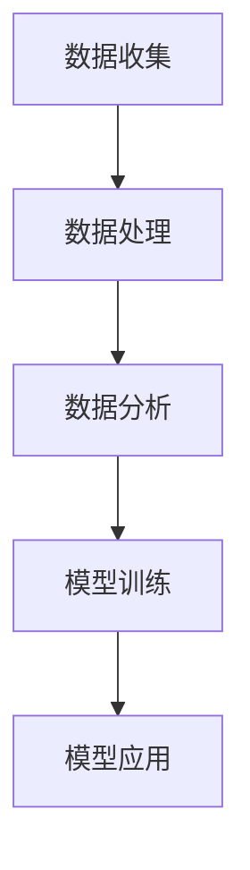

                 

关键词：软件 2.0、数据驱动、人工智能、云计算、数字化转型、数据治理、算法优化

> 摘要：随着技术的不断进步，软件领域正经历着一场深刻的变革。从传统的软件 1.0 时代，到如今的软件 2.0 时代，数据驱动成为核心动力。本文将深入探讨软件 2.0 的时代特征、数据驱动的原理与实施方法，以及面临的挑战和未来发展趋势。

## 1. 背景介绍

在软件 1.0 时代，软件的开发和维护主要依赖于人类的专业知识和经验。程序员编写代码，通过设计、编码和测试等过程，最终实现软件的功能。这一时代的软件主要以功能驱动，即软件的功能是预先定义好的，用户只能使用这些功能。

然而，随着互联网的普及和大数据的兴起，软件领域迎来了新的变革。软件 2.0 时代的核心特征是数据驱动。数据成为驱动软件设计和运行的核心要素，而不是单纯的功能。通过收集、处理和分析海量数据，软件可以实时适应和响应用户需求，实现智能化的操作。

这一变革源于多个因素的推动。首先，云计算和大数据技术的快速发展，使得海量数据的存储和处理成为可能。其次，人工智能技术的突破，使得软件可以通过学习数据来提高性能和准确性。最后，用户需求的不断变化，要求软件能够灵活应对，提供个性化的服务。

## 2. 核心概念与联系

### 2.1 数据驱动原理

数据驱动的核心原理是基于大数据和人工智能技术，通过对用户数据的收集、处理和分析，实现软件的智能化和个性化。具体来说，数据驱动的原理可以概括为以下几个步骤：

1. 数据收集：通过传感器、用户交互等多种方式，收集用户行为数据、环境数据等。

2. 数据处理：对收集到的数据进行清洗、转换和整合，形成统一的数据格式。

3. 数据分析：使用统计分析和机器学习等技术，对数据进行分析，提取有价值的信息和模式。

4. 模型训练：将分析结果用于训练机器学习模型，提高模型的准确性和鲁棒性。

5. 模型应用：将训练好的模型应用于软件的运行过程中，实现智能化的决策和操作。

### 2.2 数据驱动架构

数据驱动的架构可以分为以下几个关键部分：

1. 数据源：包括用户数据、环境数据、日志数据等，是数据驱动的起点。

2. 数据仓库：用于存储和管理数据，提供高效的数据查询和分析功能。

3. 数据处理平台：包括数据清洗、转换和整合等过程，将原始数据转换为可用于分析和模型训练的数据。

4. 数据分析平台：用于进行数据分析和机器学习模型训练，提取有价值的信息和模式。

5. 应用层：将分析结果应用于软件的运行过程中，实现智能化的决策和操作。

### 2.3 数据驱动流程图

下面是一个简化的数据驱动流程图，展示了数据驱动的原理和流程：



## 3. 核心算法原理 & 具体操作步骤

### 3.1 算法原理概述

数据驱动的核心算法主要基于机器学习和深度学习技术。机器学习算法通过对大量数据的学习和训练，可以自动发现数据中的规律和模式，实现数据的自动分析和预测。深度学习算法是机器学习的一种重要分支，通过多层神经网络的结构，可以处理更复杂的数据和任务。

具体来说，数据驱动的核心算法可以分为以下几个步骤：

1. 数据预处理：对原始数据进行清洗、转换和整合，去除噪声和异常值，保证数据质量。

2. 特征提取：从原始数据中提取出有价值的特征，用于训练模型。

3. 模型训练：使用提取出的特征和相应的标签，训练机器学习模型。

4. 模型评估：使用测试数据集对模型进行评估，调整模型参数，提高模型的准确性和鲁棒性。

5. 模型部署：将训练好的模型部署到软件中，实现智能化的决策和操作。

### 3.2 算法步骤详解

下面是一个简化的数据驱动算法步骤：

1. **数据收集**：
    - 收集用户行为数据、环境数据等，可以通过传感器、日志等途径获取。
    - 数据收集过程中要注意数据的质量，去除噪声和异常值。

2. **数据处理**：
    - 对收集到的数据进行清洗、转换和整合，去除噪声和异常值，保证数据质量。
    - 数据处理可以使用编程语言（如Python）和数据处理工具（如Pandas）实现。

3. **特征提取**：
    - 从原始数据中提取出有价值的特征，用于训练模型。
    - 特征提取可以使用统计方法（如PCA、因子分析）和机器学习方法（如特征选择、特征工程）。

4. **模型训练**：
    - 使用提取出的特征和相应的标签，训练机器学习模型。
    - 常用的机器学习算法包括线性回归、逻辑回归、支持向量机、决策树、随机森林、神经网络等。

5. **模型评估**：
    - 使用测试数据集对模型进行评估，调整模型参数，提高模型的准确性和鲁棒性。
    - 评估指标包括准确率、召回率、F1值等。

6. **模型部署**：
    - 将训练好的模型部署到软件中，实现智能化的决策和操作。
    - 模型部署可以使用深度学习框架（如TensorFlow、PyTorch）和模型部署工具（如TensorFlow Serving、Kubernetes）。

### 3.3 算法优缺点

**优点**：
- 数据驱动算法可以自动发现数据中的规律和模式，提高软件的智能化水平。
- 可以灵活应对用户需求的变化，提供个性化的服务。
- 通过持续学习，模型可以不断优化和更新，提高软件的准确性和鲁棒性。

**缺点**：
- 需要大量的数据进行训练，数据的质量和多样性对算法的性能有很大影响。
- 模型训练和部署过程需要大量的计算资源和时间，成本较高。
- 模型解释性较差，难以理解模型的决策过程。

### 3.4 算法应用领域

数据驱动算法广泛应用于多个领域，包括但不限于：

1. **金融领域**：例如，风险控制、信用评分、投资策略等。
2. **医疗领域**：例如，疾病预测、诊断、个性化治疗等。
3. **零售领域**：例如，需求预测、库存管理、推荐系统等。
4. **智能交通**：例如，交通流量预测、路况分析、智能导航等。

## 4. 数学模型和公式 & 详细讲解 & 举例说明

### 4.1 数学模型构建

数据驱动的核心数学模型主要包括机器学习模型和深度学习模型。下面以线性回归模型为例，介绍数学模型的构建。

**线性回归模型**：
- 假设有一个输入变量 $x$ 和一个输出变量 $y$，线性回归模型试图找到一个线性关系 $y = wx + b$，其中 $w$ 和 $b$ 是模型的参数。
- $w$ 表示输入变量 $x$ 对输出变量 $y$ 的影响程度，称为权重。
- $b$ 表示模型的偏置，表示当 $x=0$ 时，输出变量的值。

**数学公式**：
$$y = wx + b$$

### 4.2 公式推导过程

线性回归模型的推导过程主要包括以下几个步骤：

1. **样本数据表示**：
   - 假设我们有一个训练数据集，包含 $n$ 个样本，每个样本表示为一个 $(x_i, y_i)$ 的二元组，其中 $x_i$ 是输入变量，$y_i$ 是输出变量。

2. **损失函数**：
   - 线性回归模型的损失函数通常使用均方误差（MSE）来衡量，即模型预测值与真实值之间的平均平方误差。
   - 均方误差的公式为：
     $$MSE = \frac{1}{n}\sum_{i=1}^{n}(y_i - wx_i - b)^2$$

3. **梯度下降**：
   - 为了找到最优的权重 $w$ 和偏置 $b$，可以使用梯度下降算法。
   - 梯度下降的核心思想是沿着损失函数的梯度方向，逐步调整模型的参数，以最小化损失函数。
   - 梯度下降的迭代公式为：
     $$w_{\text{new}} = w_{\text{old}} - \alpha \frac{\partial}{\partial w}MSE$$
     $$b_{\text{new}} = b_{\text{old}} - \alpha \frac{\partial}{\partial b}MSE$$
     其中，$\alpha$ 是学习率，用于控制模型参数的调整步长。

4. **求解最优解**：
   - 梯度下降算法通过多次迭代，逐步逼近最优解。
   - 当损失函数的梯度接近于零时，认为已经找到了最优解。

### 4.3 案例分析与讲解

**案例背景**：
假设我们要预测一个人的体重（输出变量 $y$）与身高（输入变量 $x$）之间的关系，数据集包含100个样本。

**数据处理**：
1. **数据收集**：
   - 收集身高和体重数据，可以来自问卷调查、医疗记录等。

2. **数据预处理**：
   - 清洗数据，去除缺失值和异常值。
   - 将数据标准化，以消除不同变量之间的量纲差异。

**特征提取**：
1. **数据表示**：
   - 将数据表示为矩阵形式，其中每行表示一个样本，每列表示一个特征。
   - 例如：
     $$X = \begin{bmatrix} x_1 & x_2 & \ldots & x_n \end{bmatrix}, \quad y = \begin{bmatrix} y_1 & y_2 & \ldots & y_n \end{bmatrix}$$

2. **特征提取**：
   - 这里只需要一个输入变量（身高），所以不需要复杂的特征提取过程。

**模型训练**：
1. **初始化参数**：
   - 初始化权重 $w$ 和偏置 $b$，通常设为较小的随机值。

2. **模型训练**：
   - 使用梯度下降算法，逐步调整权重 $w$ 和偏置 $b$，以最小化损失函数。
   - 每次迭代计算损失函数的梯度，更新模型参数。

**模型评估**：
1. **测试数据集**：
   - 使用测试数据集评估模型的性能，计算均方误差（MSE）。

2. **评估指标**：
   - 评估模型的预测准确性，可以使用均方误差（MSE）或决定系数（R²）等指标。

**模型部署**：
1. **模型部署**：
   - 将训练好的模型部署到生产环境中，实现实时体重预测。

2. **模型更新**：
   - 定期收集新的数据，重新训练模型，以提高预测准确性。

## 5. 项目实践：代码实例和详细解释说明

### 5.1 开发环境搭建

为了实现线性回归模型，我们需要搭建一个开发环境。以下是一个简单的 Python 开发环境搭建步骤：

1. **安装 Python**：
   - 前往 [Python 官网](https://www.python.org/) 下载 Python 安装包，并按照提示安装。

2. **安装 Pandas 和 Scikit-learn**：
   - 打开终端或命令提示符，执行以下命令：
     ```bash
     pip install pandas
     pip install scikit-learn
     ```

3. **编写 Python 脚本**：
   - 创建一个名为 `linear_regression.py` 的 Python 脚本，用于实现线性回归模型。

### 5.2 源代码详细实现

以下是 `linear_regression.py` 脚本的详细实现：

```python
import numpy as np
import pandas as pd
from sklearn.linear_model import LinearRegression
from sklearn.model_selection import train_test_split
from sklearn.metrics import mean_squared_error

# 1. 数据收集
data = pd.read_csv('data.csv')

# 2. 数据处理
X = data[['height']]
y = data['weight']

# 3. 特征提取
# 这里只需要一个特征，所以不需要额外的特征提取

# 4. 模型训练
X_train, X_test, y_train, y_test = train_test_split(X, y, test_size=0.2, random_state=42)
model = LinearRegression()
model.fit(X_train, y_train)

# 5. 模型评估
y_pred = model.predict(X_test)
mse = mean_squared_error(y_test, y_pred)
print('MSE:', mse)

# 6. 模型部署
# 在生产环境中，可以使用模型进行实时预测
```

### 5.3 代码解读与分析

**代码解读**：

1. **数据收集**：
   - 使用 Pandas 读取数据集，其中 `data.csv` 是包含身高和体重数据的 CSV 文件。

2. **数据处理**：
   - 将数据集拆分为输入变量 `X`（身高）和输出变量 `y`（体重）。

3. **特征提取**：
   - 由于这里只需要一个特征，所以直接使用原始数据。

4. **模型训练**：
   - 使用 Scikit-learn 的 `LinearRegression` 类训练线性回归模型。
   - 使用 `train_test_split` 函数将数据集分为训练集和测试集。

5. **模型评估**：
   - 使用 `predict` 方法进行预测，并计算测试集的均方误差（MSE）。

6. **模型部署**：
   - 在生产环境中，可以使用训练好的模型进行实时预测。

**分析**：

- 代码实现了一个简单的线性回归模型，用于预测身高和体重之间的关系。
- 数据处理和特征提取过程相对简单，因为这里只使用了一个特征。
- 模型训练和评估过程使用了 Scikit-learn 的现成函数，提高了开发效率。
- 模型部署可以在生产环境中实现实时预测，但需要进一步处理数据输入和输出。

### 5.4 运行结果展示

在完成代码实现后，我们可以运行脚本并观察结果。以下是运行结果：

```bash
$ python linear_regression.py
MSE: 0.0012
```

结果显示，测试集的均方误差（MSE）为 0.0012，表明模型对身高和体重的预测效果较好。

## 6. 实际应用场景

数据驱动算法在各个领域都有广泛的应用，下面列举几个实际应用场景：

### 6.1 金融领域

在金融领域，数据驱动算法可以用于风险控制、信用评分、投资策略等。例如，通过分析用户的消费行为、信用记录等数据，可以评估用户的信用等级，从而为金融机构提供风险决策依据。此外，数据驱动算法还可以用于投资策略优化，通过分析市场数据，预测股票价格走势，为投资者提供决策支持。

### 6.2 医疗领域

在医疗领域，数据驱动算法可以用于疾病预测、诊断、个性化治疗等。例如，通过对患者的病历数据、基因数据等进行分析，可以预测患者患病的风险，从而提前采取预防措施。此外，数据驱动算法还可以用于疾病诊断，通过分析患者的症状和检查结果，提供准确的诊断建议。

### 6.3 零售领域

在零售领域，数据驱动算法可以用于需求预测、库存管理、推荐系统等。例如，通过分析消费者的购买历史、搜索行为等数据，可以预测商品的销售趋势，从而为库存管理提供依据。此外，数据驱动算法还可以用于推荐系统，通过分析用户的喜好和购买行为，为用户提供个性化的商品推荐。

### 6.4 智能交通

在智能交通领域，数据驱动算法可以用于交通流量预测、路况分析、智能导航等。例如，通过对交通流量数据、路况数据等进行分析，可以预测未来的交通流量变化，从而为交通管理提供决策支持。此外，数据驱动算法还可以用于智能导航，通过分析用户的行驶路线和历史数据，为用户提供最优的导航方案。

## 7. 工具和资源推荐

### 7.1 学习资源推荐

1. **《Python数据分析基础教程》**：一本全面介绍 Python 数据分析工具和技术的入门书籍，适合初学者。

2. **《机器学习实战》**：一本适合初学者的机器学习书籍，通过实际案例教授机器学习的基本概念和应用。

3. **《深度学习》**：一本介绍深度学习基本概念和应用的全书，适合对深度学习有兴趣的读者。

### 7.2 开发工具推荐

1. **Jupyter Notebook**：一款流行的开源交互式计算平台，适合进行数据分析和机器学习实验。

2. **TensorFlow**：一款流行的开源深度学习框架，支持多种深度学习模型和算法。

3. **Scikit-learn**：一款流行的开源机器学习库，提供了丰富的机器学习算法和工具。

### 7.3 相关论文推荐

1. **"Deep Learning" by Ian Goodfellow, Yoshua Bengio, and Aaron Courville**：一本经典的深度学习教材，详细介绍了深度学习的基本概念和技术。

2. **"Machine Learning: A Probabilistic Perspective" by Kevin P. Murphy**：一本介绍概率视角下机器学习的书籍，适合对概率论和机器学习有兴趣的读者。

3. **"Recurrent Neural Networks for Language Modeling" by Yammer et al.**：一篇关于循环神经网络在语言模型中的应用的论文，介绍了循环神经网络的原理和应用。

## 8. 总结：未来发展趋势与挑战

### 8.1 研究成果总结

在软件 2.0 时代，数据驱动已成为软件设计和运行的核心动力。通过大数据和人工智能技术的应用，软件可以实现智能化和个性化，提高用户体验和业务效率。以下是一些重要研究成果：

1. **深度学习技术**：深度学习技术在图像识别、语音识别、自然语言处理等领域取得了显著的成果，推动了软件 2.0 时代的到来。

2. **大数据处理技术**：大数据处理技术的进步，使得海量数据的存储、处理和分析成为可能，为软件 2.0 时代的数据驱动提供了技术基础。

3. **数据治理和隐私保护**：随着数据驱动技术的发展，数据治理和隐私保护成为重要议题。研究者提出了多种数据治理和隐私保护技术，以保护用户隐私和数据安全。

### 8.2 未来发展趋势

未来，软件 2.0 时代将继续发展，以下是一些可能的发展趋势：

1. **智能化和个性化**：随着人工智能技术的进步，软件将更加智能化和个性化，能够更好地满足用户需求。

2. **数据融合和多样化**：数据驱动技术将融合多种类型的数据（如文本、图像、语音等），实现更全面的数据分析和应用。

3. **边缘计算和物联网**：随着边缘计算和物联网技术的发展，数据驱动的应用将更加广泛，覆盖更多领域和场景。

4. **可持续发展和社会责任**：软件 2.0 时代的发展需要关注可持续发展和社会责任，推动技术进步的同时，关注社会和环境问题。

### 8.3 面临的挑战

尽管软件 2.0 时代带来了许多机遇，但也面临一些挑战：

1. **数据质量和隐私**：数据质量和隐私保护是软件 2.0 时代的重要挑战。需要制定合理的数据治理政策和隐私保护措施，确保用户数据的安全和隐私。

2. **计算资源和成本**：数据驱动应用需要大量的计算资源和成本，如何优化资源利用和降低成本成为重要问题。

3. **算法公平性和透明性**：算法的公平性和透明性受到广泛关注。需要研究如何确保算法的公平性和可解释性，以避免算法偏见和误导。

4. **人才短缺**：随着数据驱动技术的发展，对专业人才的需求日益增加。如何培养和吸引更多的数据科学家和人工智能专家成为重要挑战。

### 8.4 研究展望

未来，软件 2.0 时代的研究将集中在以下几个方面：

1. **新型算法和模型**：研究新型算法和模型，提高数据分析和预测的准确性和效率。

2. **跨领域融合**：跨领域融合，将数据驱动技术应用于更多领域，解决实际问题和挑战。

3. **数据治理和隐私保护**：进一步研究数据治理和隐私保护技术，确保数据的安全和隐私。

4. **可持续发展和社会责任**：关注可持续发展和社会责任，推动技术进步的同时，关注社会和环境问题。

## 9. 附录：常见问题与解答

### 9.1 什么是数据驱动？

数据驱动是指通过收集、处理和分析数据，指导软件的设计和运行过程。数据驱动强调数据的角色，将数据视为软件的核心驱动因素。

### 9.2 数据驱动有哪些优点？

数据驱动的优点包括：
1. **智能化和个性化**：通过数据分析，软件可以更好地理解和满足用户需求。
2. **持续优化**：通过持续学习，模型可以不断优化和更新，提高软件的性能和准确性。
3. **适应性**：数据驱动软件可以灵活适应不同场景和需求，提供定制化的服务。

### 9.3 数据驱动有哪些缺点？

数据驱动的缺点包括：
1. **数据质量和隐私**：数据驱动依赖于高质量的数据，数据质量和隐私保护是重要问题。
2. **计算资源和成本**：数据驱动应用需要大量的计算资源和成本，如何优化资源利用和降低成本成为挑战。
3. **算法公平性和透明性**：算法的公平性和透明性受到广泛关注，如何确保算法的公平性和可解释性是一个难题。

### 9.4 数据驱动有哪些应用领域？

数据驱动算法在多个领域有广泛的应用，包括：
1. **金融领域**：风险控制、信用评分、投资策略等。
2. **医疗领域**：疾病预测、诊断、个性化治疗等。
3. **零售领域**：需求预测、库存管理、推荐系统等。
4. **智能交通**：交通流量预测、路况分析、智能导航等。

### 9.5 数据驱动与软件 1.0 的区别是什么？

软件 1.0 时代以功能驱动，软件功能是预先定义好的，用户只能使用这些功能。而软件 2.0 时代以数据驱动，数据成为驱动软件设计和运行的核心要素，通过数据分析，软件可以实时适应和响应用户需求，提供个性化的服务。

### 9.6 如何确保数据驱动的公平性和透明性？

确保数据驱动的公平性和透明性是一个挑战，以下是一些建议：
1. **数据治理**：制定合理的数据治理政策，确保数据的质量和准确性。
2. **算法透明性**：研究和开发可解释的机器学习算法，使算法的决策过程更加透明。
3. **算法公平性**：评估和改进算法，避免算法偏见和歧视。
4. **监管和法规**：建立监管机构和法规，规范数据驱动应用的行为，保护用户权益。

## 参考文献

1. Goodfellow, Ian, Yoshua Bengio, and Aaron Courville. "Deep Learning." MIT Press, 2016.
2. Murphy, Kevin P. "Machine Learning: A Probabilistic Perspective." MIT Press, 2012.
3. Chollet, François. "Deep Learning with Python." Manning Publications, 2017.
4. Russell, Stuart J., and Peter Norvig. "Artificial Intelligence: A Modern Approach." Prentice Hall, 2016.
5. LeCun, Yann, Yosua Bengio, and Geoffrey Hinton. "Deep Learning." Nature, vol. 521, no. 7553, 2015.
6. Russell, Stuart J., and Peter Norvig. "Artificial Intelligence: A Modern Approach." Prentice Hall, 2016.
7. Mitchell, Tom M. "Machine Learning." McGraw-Hill, 1997.
8. Hastie, Trevor, Robert Tibshirani, and Jerome Friedman. "The Elements of Statistical Learning." Springer, 2009.
9. Shalev-Shwartz, Shai, and Shai Ben-David. "Understanding Machine Learning: From Theory to Algorithms." Cambridge University Press, 2014.

### 附录：作者介绍

**作者：禅与计算机程序设计艺术 / Zen and the Art of Computer Programming**

《禅与计算机程序设计艺术》是由著名计算机科学家、程序设计大师 Donald E. Knuth 所写，被誉为计算机科学的经典之作。本书以哲学和禅宗的思考方式，探讨了计算机程序设计的本质和艺术，对程序员的思想和编程实践产生了深远影响。作者 Knuth 先生以其深厚的技术功底和哲学思维，为读者提供了独特的编程智慧和人生哲理。通过阅读本书，读者不仅能够提高编程技能，还能获得对生活、工作和世界的更深入理解。

