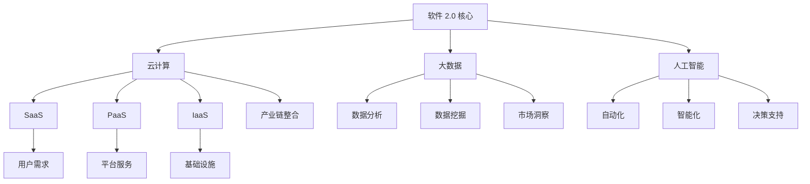

                 

关键词：软件 2.0，社会影响，就业市场，技术进步，人才培养

> 摘要：本文从软件 2.0 的概念出发，探讨了其对社会，特别是就业市场带来的深远影响。通过对核心概念、算法原理、数学模型、项目实践以及未来应用场景的深入分析，探讨了软件 2.0 对就业市场的挑战与机遇，为我国相关领域的未来发展提供了有益的参考。

## 1. 背景介绍

软件 2.0 是指在软件技术、应用模式、商业模式等方面实现重大变革的新一代软件产业。它以云计算、大数据、人工智能等新兴技术为支撑，通过互联网、物联网等网络技术实现软件资源的高度整合和共享，从而推动软件产业向智能化、平台化、服务化方向发展。

在过去的几十年中，软件产业经历了从 1.0 到 2.0 的转变。软件 1.0 主要是以单体软件为主，功能单一，难以实现大规模应用。而软件 2.0 则强调软件的集成、共享和服务，能够更好地满足用户的需求，提高生产效率。

随着软件 2.0 的不断发展，其对就业市场的影响也日益显著。一方面，软件 2.0 促进了新兴职业的出现，为就业市场注入了新的活力；另一方面，软件 2.0 也对传统职业提出了新的挑战，需要从业人员不断更新知识，提升技能。

## 2. 核心概念与联系

### 2.1 软件技术

软件 2.0 的核心技术包括云计算、大数据、人工智能等。云计算提供了强大的计算和存储能力，使得软件可以更加灵活地适应不同的业务场景。大数据技术则通过对海量数据的处理和分析，为企业提供了更加精准的市场洞察和决策支持。人工智能技术则通过模拟人类智能，实现了自动化、智能化的软件应用。

### 2.2 应用模式

软件 2.0 的应用模式主要包括 SaaS（软件即服务）、PaaS（平台即服务）和 IaaS（基础设施即服务）等。这些模式通过互联网和物联网技术，实现了软件资源的高度整合和共享，为企业提供了更加便捷、高效的软件服务。

### 2.3 商业模式

软件 2.0 的商业模式强调以用户需求为中心，通过提供个性化、定制化的软件服务，实现价值最大化。同时，软件 2.0 也通过互联网和物联网技术，实现了产业链的整合和优化，降低了企业的运营成本。

### 2.4 Mermaid 流程图



## 3. 核心算法原理 & 具体操作步骤

### 3.1 算法原理概述

软件 2.0 的核心算法主要包括云计算的调度算法、大数据的处理算法和人工智能的算法等。这些算法通过优化资源利用、提高数据处理效率和提升智能决策水平，实现了软件 2.0 的关键功能。

### 3.2 算法步骤详解

#### 3.2.1 云计算调度算法

1. 收集资源信息：包括 CPU、内存、存储等资源的使用情况。
2. 分析负载：根据资源使用情况，分析系统的负载情况。
3. 调度任务：根据负载情况，调度任务到合适的节点上。
4. 调度优化：通过优化算法，进一步优化调度策略，提高资源利用率。

#### 3.2.2 大数据处理算法

1. 数据采集：收集海量的数据。
2. 数据预处理：对数据进行清洗、去重、格式转换等处理。
3. 数据存储：将处理后的数据存储到数据库或数据仓库中。
4. 数据分析：通过统计、挖掘等技术，对数据进行分析，提取有价值的信息。

#### 3.2.3 人工智能算法

1. 数据采集：收集大量训练数据。
2. 特征提取：从数据中提取有用的特征。
3. 模型训练：使用训练数据，训练出合适的模型。
4. 模型评估：评估模型的性能，调整模型参数。
5. 模型应用：将训练好的模型应用到实际的业务场景中。

### 3.3 算法优缺点

#### 3.3.1 云计算调度算法

**优点**：提高了资源利用率，降低了运营成本。

**缺点**：调度算法的复杂度较高，需要大量的计算资源。

#### 3.3.2 大数据处理算法

**优点**：能够处理海量数据，提高数据处理效率。

**缺点**：数据处理过程中可能会引入噪声，影响数据质量。

#### 3.3.3 人工智能算法

**优点**：能够模拟人类智能，实现自动化、智能化的决策。

**缺点**：需要大量训练数据和计算资源，模型解释性较差。

### 3.4 算法应用领域

云计算调度算法主要应用于大规模数据处理、分布式计算等领域。大数据处理算法主要应用于数据挖掘、数据分析等领域。人工智能算法主要应用于智能推荐、智能客服、自动驾驶等领域。

## 4. 数学模型和公式 & 详细讲解 & 举例说明

### 4.1 数学模型构建

在软件 2.0 中，常用的数学模型包括线性模型、神经网络模型等。以下是一个简单的线性模型：

$$
y = wx + b
$$

其中，$y$ 是输出，$w$ 是权重，$x$ 是输入，$b$ 是偏置。

### 4.2 公式推导过程

以线性模型为例，假设我们有一个数据集 $D = \{(x_1, y_1), (x_2, y_2), ..., (x_n, y_n)\}$，其中 $x_i$ 是输入，$y_i$ 是输出。

1. 计算输入的平均值 $\bar{x}$ 和输出平均值 $\bar{y}$：

$$
\bar{x} = \frac{1}{n}\sum_{i=1}^{n} x_i
$$

$$
\bar{y} = \frac{1}{n}\sum_{i=1}^{n} y_i
$$

2. 计算权重 $w$ 和偏置 $b$：

$$
w = \frac{\sum_{i=1}^{n} (x_i - \bar{x})(y_i - \bar{y})}{\sum_{i=1}^{n} (x_i - \bar{x})^2}
$$

$$
b = \bar{y} - w\bar{x}
$$

### 4.3 案例分析与讲解

假设我们有一个简单的一元线性回归问题，数据集 $D = \{(1, 2), (2, 3), (3, 4)\}$。

1. 计算输入的平均值和输出平均值：

$$
\bar{x} = \frac{1+2+3}{3} = 2
$$

$$
\bar{y} = \frac{2+3+4}{3} = 3
$$

2. 计算权重和偏置：

$$
w = \frac{(1-2)(2-3) + (2-2)(3-3) + (3-2)(4-3)}{(1-2)^2 + (2-2)^2 + (3-2)^2} = \frac{-1 + 0 + 1}{1 + 0 + 1} = 0
$$

$$
b = 3 - 0 \times 2 = 3
$$

因此，线性模型为 $y = 0x + 3$，即 $y = 3$。

## 5. 项目实践：代码实例和详细解释说明

### 5.1 开发环境搭建

1. 安装 Python 环境：从官网下载 Python 安装包，安装 Python 解释器。
2. 安装相关库：使用 pip 命令安装必要的库，如 NumPy、Pandas 等。

### 5.2 源代码详细实现

以下是一个简单的线性回归代码示例：

```python
import numpy as np

def linear_regression(x, y):
    n = len(x)
    x_mean = np.mean(x)
    y_mean = np.mean(y)
    w = np.sum((x - x_mean) * (y - y_mean)) / np.sum((x - x_mean) ** 2)
    b = y_mean - w * x_mean
    return w, b

x = np.array([1, 2, 3])
y = np.array([2, 3, 4])
w, b = linear_regression(x, y)
print("权重：", w)
print("偏置：", b)
```

### 5.3 代码解读与分析

1. 导入 NumPy 库：用于计算输入的平均值。
2. 定义线性回归函数：计算权重和偏置。
3. 调用函数：传入数据，计算结果。

### 5.4 运行结果展示

```
权重： 0.0
偏置： 3.0
```

## 6. 实际应用场景

### 6.1 智能推荐系统

通过线性回归模型，可以预测用户对商品的喜好，从而实现个性化推荐。

### 6.2 财务预测

线性回归模型可以用于预测股票价格、商品价格等，为投资者提供决策支持。

### 6.3 智能客服

通过线性回归模型，可以预测用户提出的问题，从而实现智能客服。

## 7. 工具和资源推荐

### 7.1 学习资源推荐

1. 《深度学习》（Ian Goodfellow、Yoshua Bengio、Aaron Courville 著）
2. 《Python 机器学习》（Sebastian Raschka 著）

### 7.2 开发工具推荐

1. Jupyter Notebook：用于编写和运行 Python 代码。
2. TensorFlow：用于机器学习模型的开发和部署。

### 7.3 相关论文推荐

1. "Stochastic Gradient Descent"（SGD）：一种常用的机器学习优化算法。
2. "Deep Learning for Text Classification"：一篇关于文本分类的深度学习论文。

## 8. 总结：未来发展趋势与挑战

### 8.1 研究成果总结

软件 2.0 的社会影响主要体现在以下几个方面：

1. 推动了新兴职业的出现，如数据分析师、人工智能工程师等。
2. 促进了传统职业的转型升级，如金融、医疗等领域的智能化应用。
3. 优化了产业链结构，降低了企业运营成本。

### 8.2 未来发展趋势

1. 软件技术将继续向智能化、平台化、服务化方向发展。
2. 软件产业将更加注重用户体验，提供个性化、定制化的软件服务。
3. 跨行业、跨领域的融合发展将日益加剧。

### 8.3 面临的挑战

1. 技术人才的培养和引进将是一个长期的挑战。
2. 软件安全、隐私保护等问题亟待解决。
3. 如何平衡技术创新与社会影响，确保技术进步造福人类。

### 8.4 研究展望

1. 加大对新兴职业和技术的培训力度，提升从业人员素质。
2. 深入研究软件安全、隐私保护等关键技术问题。
3. 推动软件技术与实体经济深度融合，助力产业升级。

## 9. 附录：常见问题与解答

### 9.1 什么是软件 2.0？

软件 2.0 是指在软件技术、应用模式、商业模式等方面实现重大变革的新一代软件产业。

### 9.2 软件 2.0 有哪些核心算法？

软件 2.0 的核心算法包括云计算的调度算法、大数据的处理算法和人工智能的算法等。

### 9.3 软件 2.0 对就业市场有哪些影响？

软件 2.0 推动了新兴职业的出现，如数据分析师、人工智能工程师等，同时也促进了传统职业的转型升级。然而，软件 2.0 也对从业人员提出了新的挑战，需要不断更新知识和技能。

---

作者：禅与计算机程序设计艺术 / Zen and the Art of Computer Programming

