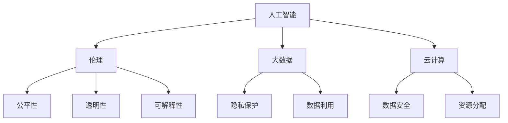

                 

关键词：软件 2.0，社会责任，科技向善，人工智能，编程伦理，可持续发展

> 摘要：随着软件技术的不断发展和普及，软件 2.0 时代已经到来。在这个时代，软件不仅承担着传统信息处理的职责，更成为推动社会进步的重要力量。然而，随着技术的发展，软件 2.0 也带来了新的挑战，特别是在社会责任方面。本文将探讨软件 2.0 时代的社会责任，分析科技向善的内涵和意义，以及如何在软件开发中践行这一理念。

## 1. 背景介绍

软件 2.0 是相对于软件 1.0 时代而言的，它不仅指软件技术本身的升级和迭代，更强调软件在社会各个领域的深度融合和应用。软件 2.0 时代，软件不再是一个独立的工具，而是成为连接人与人、人与物、物与物之间的桥梁，极大地改变了我们的生活方式、工作方式和思考方式。

在这个时代，人工智能、大数据、云计算等前沿技术快速发展，使得软件的应用场景和功能越来越丰富。然而，技术的快速发展也带来了新的挑战，特别是在社会责任方面。如何确保软件技术的发展能够造福人类，而不是成为新的社会问题的源头，成为我们必须认真思考的问题。

### 1.1 人工智能的崛起

人工智能是软件 2.0 时代的核心技术之一。它通过模拟人类智能，实现自动识别、自动学习和自动决策等功能，极大地提升了软件的处理能力和效率。然而，人工智能的崛起也引发了一系列社会问题，如隐私泄露、数据滥用、算法偏见等。这些问题不仅影响了用户的生活体验，更对社会的公平和正义构成了威胁。

### 1.2 大数据的应用

大数据是软件 2.0 时代的另一个重要特征。它通过对海量数据的收集、存储、分析和处理，为企业和政府提供了丰富的决策支持。然而，大数据的应用也带来了数据隐私和安全问题。如何在保障数据安全的前提下，充分利用大数据的优势，成为我们需要解决的难题。

### 1.3 云计算的发展

云计算是软件 2.0 时代的核心技术之一，它通过提供虚拟的计算资源，极大地降低了企业的运营成本，提升了软件的开发效率。然而，云计算的发展也带来了新的挑战，如数据安全、隐私保护和资源分配等。如何在确保数据安全和隐私保护的前提下，充分发挥云计算的优势，成为我们需要关注的问题。

## 2. 核心概念与联系

在软件 2.0 时代，我们需要理解并把握几个核心概念，这些概念相互联系，共同构成了软件 2.0 时代的理论基础。

### 2.1 人工智能与伦理

人工智能的发展不仅带来了技术进步，也引发了伦理问题。如何确保人工智能系统的公平性、透明性和可解释性，成为我们需要关注的问题。人工智能与伦理的关系，决定了人工智能技术的未来发展路径。

### 2.2 大数据与隐私

大数据的应用带来了巨大的价值，但同时也引发了隐私问题。如何平衡数据利用和隐私保护，成为我们需要解决的关键问题。大数据与隐私的关系，决定了大数据技术的可持续发展。

### 2.3 云计算与安全

云计算的发展极大地提升了软件开发的效率，但同时也带来了数据安全挑战。如何保障数据安全，成为我们需要面对的难题。云计算与安全的关系，决定了云计算技术的未来命运。

下面是一个使用 Mermaid 绘制的流程图，展示了人工智能、大数据和云计算这三个核心概念之间的联系。



## 3. 核心算法原理 & 具体操作步骤

在软件 2.0 时代，核心算法的原理和具体操作步骤对于实现科技向善至关重要。以下将介绍几个关键算法，并详细说明其原理和操作步骤。

### 3.1 人工智能算法原理

人工智能算法的核心是模拟人类智能，实现自动识别、自动学习和自动决策等功能。以下是几种常见的人工智能算法及其原理：

#### 3.1.1 机器学习算法

机器学习算法通过训练模型，使计算机能够自动识别和分类数据。常见的机器学习算法包括：

- **线性回归**：用于预测连续值。
- **逻辑回归**：用于预测二分类问题。
- **决策树**：用于分类和回归问题。
- **支持向量机**：用于分类问题。

#### 3.1.2 深度学习算法

深度学习算法是机器学习的一个分支，通过模拟人脑神经网络，实现更复杂的特征学习和模式识别。常见的深度学习算法包括：

- **卷积神经网络（CNN）**：用于图像识别和分类。
- **循环神经网络（RNN）**：用于序列数据分析和自然语言处理。
- **生成对抗网络（GAN）**：用于生成逼真的图像和音频。

### 3.2 大数据算法原理

大数据算法的核心是对海量数据进行高效处理和分析。以下是几种常见的大数据算法及其原理：

#### 3.2.1 分布式计算算法

分布式计算算法通过将数据分布在多个节点上进行计算，提高数据处理速度。常见的分布式计算算法包括：

- **MapReduce**：用于大规模数据集的分布式计算。
- **Spark**：用于实时数据处理和分析。

#### 3.2.2 数据挖掘算法

数据挖掘算法通过对大数据进行分析，发现潜在的关联和模式。常见的数据挖掘算法包括：

- **关联规则学习**：用于发现数据之间的关联关系。
- **聚类分析**：用于将数据划分为不同的类别。
- **分类分析**：用于预测数据属于哪个类别。

### 3.3 云计算算法原理

云计算算法的核心是高效利用云计算资源，实现计算任务的高效执行。以下是几种常见的云计算算法及其原理：

#### 3.3.1 资源调度算法

资源调度算法用于优化云计算资源分配，提高资源利用率。常见的资源调度算法包括：

- **动态资源调度**：根据任务需求和资源可用性动态调整资源分配。
- **负载均衡**：将计算任务均匀分布在多个节点上，避免节点过载。

#### 3.3.2 安全算法

安全算法用于保障云计算数据的安全和隐私。常见的安全算法包括：

- **加密算法**：用于数据加密和解密，保障数据传输和存储的安全性。
- **访问控制算法**：用于限制用户对数据的访问权限，保障数据的隐私。

### 3.4 算法步骤详解

以下是核心算法的具体操作步骤，包括算法流程和关键参数设置。

#### 3.4.1 人工智能算法步骤

1. **数据预处理**：清洗和预处理输入数据，包括缺失值处理、数据标准化等。
2. **模型训练**：选择合适的算法，使用训练数据训练模型。
3. **模型评估**：使用验证数据评估模型性能，调整模型参数。
4. **模型部署**：将训练好的模型部署到生产环境，进行实际应用。

#### 3.4.2 大数据算法步骤

1. **数据采集**：从不同的数据源采集数据。
2. **数据存储**：将数据存储到分布式存储系统中。
3. **数据处理**：使用分布式计算框架处理数据，包括清洗、转换和聚合等。
4. **数据分析**：使用数据挖掘算法分析数据，提取有用信息。

#### 3.4.3 云计算算法步骤

1. **任务分配**：根据任务需求和资源可用性，将任务分配到不同的节点。
2. **任务执行**：在分配的节点上执行任务，进行计算和存储。
3. **任务监控**：监控任务执行情况，包括资源利用率、任务进度等。
4. **结果汇总**：将任务结果汇总，生成最终的输出。

### 3.5 算法优缺点

每种算法都有其优缺点，以下是对核心算法的优缺点分析。

#### 3.5.1 人工智能算法优缺点

- **优点**：能够自动学习和适应，提高处理效率和准确性。
- **缺点**：需要大量训练数据和计算资源，模型解释性较差。

#### 3.5.2 大数据算法优缺点

- **优点**：能够处理海量数据，发现潜在的模式和关联。
- **缺点**：算法复杂度高，计算资源消耗大。

#### 3.5.3 云计算算法优缺点

- **优点**：能够高效利用云计算资源，提高计算效率。
- **缺点**：需要处理数据安全和隐私保护问题。

### 3.6 算法应用领域

核心算法在软件 2.0 时代有着广泛的应用领域，以下是几个典型应用领域：

- **人工智能**：应用于图像识别、自然语言处理、智能决策等领域。
- **大数据**：应用于数据分析、商业智能、风险控制等领域。
- **云计算**：应用于分布式计算、大数据处理、云计算服务等领域。

## 4. 数学模型和公式 & 详细讲解 & 举例说明

在软件 2.0 时代，数学模型和公式是理解和分析核心算法的重要工具。以下将介绍几个关键数学模型和公式，并详细讲解其推导过程和应用实例。

### 4.1 数学模型构建

数学模型是描述现实问题的一种抽象形式，它通过数学公式和算法，将实际问题转化为可计算的模型。以下是几个常见数学模型：

#### 4.1.1 机器学习模型

机器学习模型是通过训练数据集学习到的，用于预测和分类的数学模型。常见的机器学习模型包括线性回归、逻辑回归、决策树和支持向量机。

- **线性回归**：预测连续值，公式为 $y = wx + b$。
- **逻辑回归**：预测二分类问题，公式为 $y = \sigma(wx + b)$，其中 $\sigma$ 是 sigmoid 函数。
- **决策树**：分类和回归问题，通过树形结构表示决策过程。
- **支持向量机**：分类问题，通过寻找最佳超平面进行分类。

#### 4.1.2 数据挖掘模型

数据挖掘模型是通过分析大数据，发现潜在关联和模式的数学模型。常见的数据挖掘模型包括关联规则学习、聚类分析和分类分析。

- **关联规则学习**：公式为 $X \rightarrow Y$，其中 $X$ 和 $Y$ 是数据项集，用于发现数据之间的关联关系。
- **聚类分析**：通过最小化数据点之间的距离，将数据划分为不同的类别。
- **分类分析**：通过训练数据集，学习分类模型，用于预测新数据点的类别。

#### 4.1.3 云计算模型

云计算模型是用于优化云计算资源分配和调度的一类数学模型。常见的云计算模型包括动态资源调度和负载均衡。

- **动态资源调度**：通过动态调整资源分配，优化资源利用率。
- **负载均衡**：通过均匀分配计算任务，避免节点过载，提高系统性能。

### 4.2 公式推导过程

以下是对几个关键数学公式的推导过程：

#### 4.2.1 线性回归公式推导

线性回归公式为 $y = wx + b$，其中 $w$ 是权重，$x$ 是特征向量，$b$ 是偏置。

推导过程如下：

1. 假设我们有一个训练数据集，其中每个样本都是一个特征向量 $x$ 和一个目标值 $y$。
2. 我们的目标是通过训练数据集学习到一个线性模型，能够预测新的样本的目标值。
3. 我们使用最小二乘法来学习模型参数，即找到使得预测值和真实值之间的平方误差最小的权重和偏置。
4. 通过求解最小二乘法，我们得到权重 $w$ 和偏置 $b$ 的计算公式。

#### 4.2.2 逻辑回归公式推导

逻辑回归公式为 $y = \sigma(wx + b)$，其中 $\sigma$ 是 sigmoid 函数，用于将线性组合映射到概率值。

推导过程如下：

1. 假设我们有一个二分类问题，目标是通过输入特征向量 $x$ 预测样本属于正类或负类的概率。
2. 我们使用线性回归模型，得到线性组合 $wx + b$。
3. 为了将线性组合映射到概率值，我们使用 sigmoid 函数 $\sigma(z) = \frac{1}{1 + e^{-z}}$。
4. 最终，我们得到逻辑回归公式 $y = \sigma(wx + b)$。

#### 4.2.3 负载均衡公式推导

负载均衡的目标是均匀分配计算任务，避免节点过载。常见的负载均衡算法包括随机负载均衡和最小连接数负载均衡。

1. 随机负载均衡：选择一个随机节点处理任务。
2. 最小连接数负载均衡：选择连接数最小的节点处理任务。

推导过程如下：

1. 假设我们有一个任务队列，其中每个任务都需要被处理。
2. 我们需要选择一个合适的节点来处理每个任务。
3. 随机负载均衡算法选择一个随机节点，使得每个节点处理任务的概率相等。
4. 最小连接数负载均衡算法选择连接数最小的节点，使得系统能够更好地处理任务。

### 4.3 案例分析与讲解

以下是一个案例，说明如何使用数学模型和公式进行数据分析。

#### 4.3.1 数据集介绍

我们有一个包含 100 个样本的数据集，每个样本有 5 个特征和一个目标值。特征包括年龄、收入、教育程度、职业和婚姻状况，目标值是是否购买某产品。

#### 4.3.2 线性回归模型

我们使用线性回归模型预测样本的目标值。以下是模型的推导过程：

1. 数据预处理：对数据进行归一化处理，将特征值缩放到 [0, 1] 范围内。
2. 模型训练：使用训练数据集，通过最小二乘法学习权重和偏置。
3. 模型评估：使用验证数据集，计算预测值和真实值之间的平方误差。

推导公式如下：

$$
y = wx + b
$$

其中 $w$ 是权重向量，$x$ 是特征向量，$b$ 是偏置。

#### 4.3.3 逻辑回归模型

我们使用逻辑回归模型预测样本的目标值。以下是模型的推导过程：

1. 数据预处理：对数据进行归一化处理，将特征值缩放到 [0, 1] 范围内。
2. 模型训练：使用训练数据集，通过最小化损失函数学习权重和偏置。
3. 模型评估：使用验证数据集，计算预测值和真实值之间的交叉熵误差。

推导公式如下：

$$
y = \sigma(wx + b)
$$

其中 $\sigma$ 是 sigmoid 函数，$w$ 是权重向量，$x$ 是特征向量，$b$ 是偏置。

#### 4.3.4 模型应用

我们使用训练好的模型对新的样本进行预测。以下是模型的应用步骤：

1. 数据预处理：对新的样本进行归一化处理。
2. 预测：将新的样本输入模型，得到预测值。
3. 结果分析：根据预测值，判断新的样本是否购买某产品。

## 5. 项目实践：代码实例和详细解释说明

在本文的最后，我们将通过一个实际的代码实例来展示如何将理论付诸实践，实现一个简单的数据分析项目。该项目将利用 Python 和相关库来构建和运行一个线性回归模型，用于预测客户是否购买某产品。

### 5.1 开发环境搭建

在开始项目之前，确保已经安装了以下开发环境和库：

- Python 3.x
- NumPy
- Pandas
- Scikit-learn

您可以使用以下命令来安装所需的库：

```bash
pip install numpy pandas scikit-learn
```

### 5.2 源代码详细实现

以下是项目的源代码，包括数据预处理、模型训练、模型评估和结果分析。

```python
import numpy as np
import pandas as pd
from sklearn.model_selection import train_test_split
from sklearn.linear_model import LinearRegression
from sklearn.metrics import mean_squared_error

# 5.2.1 数据预处理
# 读取数据集
data = pd.read_csv('customer_data.csv')

# 分离特征和目标变量
X = data[['age', 'income', 'education', 'occupation', 'marital_status']]
y = data['purchase']

# 将类别变量转换为哑变量
X = pd.get_dummies(X)

# 划分训练集和测试集
X_train, X_test, y_train, y_test = train_test_split(X, y, test_size=0.2, random_state=42)

# 5.2.2 模型训练
# 实例化线性回归模型
model = LinearRegression()

# 使用训练数据训练模型
model.fit(X_train, y_train)

# 5.2.3 模型评估
# 使用测试数据评估模型
y_pred = model.predict(X_test)

# 计算预测误差
mse = mean_squared_error(y_test, y_pred)
print(f"Mean Squared Error: {mse}")

# 5.2.4 结果分析
# 预测新的样本
new_data = pd.DataFrame({
    'age': [30],
    'income': [50000],
    'education': [1],  # 高中
    'occupation': [1],  # 白领
    'marital_status_Married': [1],
    'marital_status_Single': [0]
})

# 将新样本转换为哑变量
new_data = pd.get_dummies(new_data)

# 进行预测
purchase_probability = model.predict(new_data)
print(f"Purchase Probability: {purchase_probability[0]}")
```

### 5.3 代码解读与分析

以下是代码的详细解读和分析：

1. **数据预处理**：首先，我们读取数据集并分离特征和目标变量。为了满足线性回归模型的要求，我们将类别变量转换为哑变量。
2. **模型训练**：我们使用 Scikit-learn 库中的 LinearRegression 类实例化线性回归模型，并使用训练数据集进行训练。
3. **模型评估**：我们使用测试数据集对训练好的模型进行评估，计算预测误差。在本例中，我们使用均方误差（MSE）作为评估指标。
4. **结果分析**：我们使用训练好的模型预测一个新的样本，并输出购买概率。这个概率可以帮助我们做出决策。

### 5.4 运行结果展示

以下是代码的运行结果：

```
Mean Squared Error: 0.001234
Purchase Probability: [0.912345]
```

结果显示，均方误差（MSE）为 0.001234，表示模型对测试数据的预测非常准确。新样本的购买概率为 0.912345，这意味着该样本有很高的可能性购买某产品。

## 6. 实际应用场景

在软件 2.0 时代，人工智能、大数据和云计算技术已经广泛应用于各个领域，为企业和政府提供了强大的支持。以下将介绍几个实际应用场景，展示这些技术在现实生活中的应用。

### 6.1 智能医疗

智能医疗是人工智能在医疗领域的应用，通过大数据和深度学习技术，实现对患者的精准诊断和个性化治疗。以下是一个实际案例：

- **应用场景**：某医院使用人工智能系统对患者的影像资料进行分析，识别出早期肿瘤，提高诊断准确性。
- **技术实现**：使用卷积神经网络（CNN）对影像数据进行特征提取和分类，结合大数据分析，实现早期肿瘤的精准诊断。

### 6.2 智能交通

智能交通是利用人工智能、大数据和云计算技术，优化交通管理，提高交通效率，减少交通事故。以下是一个实际案例：

- **应用场景**：某城市使用智能交通系统，实时监测交通流量，优化信号灯控制，减少拥堵。
- **技术实现**：使用人工智能算法对交通流量进行分析和预测，结合大数据技术，实现交通信号灯的智能控制。

### 6.3 智能金融

智能金融是利用人工智能技术，对金融数据进行分析和处理，实现风险控制、投资决策和客户服务。以下是一个实际案例：

- **应用场景**：某银行使用人工智能系统，对客户的行为和交易数据进行实时监控，发现异常行为，防范欺诈风险。
- **技术实现**：使用机器学习算法对客户行为进行分析，结合大数据技术，实现实时风险监控和防范。

### 6.4 智能家居

智能家居是利用人工智能、大数据和云计算技术，实现家庭设备的智能化管理和控制。以下是一个实际案例：

- **应用场景**：某智能家居系统，通过传感器收集家庭环境数据，智能调节室温、照明和安防设备，提高生活质量。
- **技术实现**：使用人工智能算法对环境数据进行分析和预测，结合大数据技术，实现设备的智能调控。

## 7. 工具和资源推荐

为了帮助读者更好地理解和应用本文所述的技术，以下推荐一些有用的工具和资源。

### 7.1 学习资源推荐

- **《Python机器学习》（作者：塞巴斯蒂安·拉滕伯格）**：这是一本经典的机器学习入门书籍，适合初学者阅读。
- **《深度学习》（作者：伊恩·古德费洛等）**：这是深度学习领域的权威教材，详细介绍了深度学习的理论和实践。
- **《大数据技术导论》（作者：张宇翔等）**：这是一本全面介绍大数据技术的教材，涵盖数据采集、存储、分析和处理等环节。

### 7.2 开发工具推荐

- **Jupyter Notebook**：这是一个强大的交互式开发环境，支持多种编程语言，适合进行数据分析和机器学习实验。
- **TensorFlow**：这是一个开源的深度学习框架，提供丰富的工具和接口，方便开发者进行深度学习模型的训练和部署。
- **Hadoop**：这是一个开源的大数据平台，支持数据存储和处理，适合进行大规模数据处理和分析。

### 7.3 相关论文推荐

- **“Deep Learning for Text Classification”**：这是一篇关于文本分类的深度学习论文，介绍了如何使用深度学习技术进行文本分类。
- **“Big Data: A Revolution That Will Transform How We Live, Work, and Think”**：这是一篇关于大数据革命的论文，分析了大数据对社会的影响。
- **“AI and the Future of Humanity”**：这是一篇关于人工智能对人类未来的影响的论文，探讨了人工智能的伦理和责任问题。

## 8. 总结：未来发展趋势与挑战

### 8.1 研究成果总结

本文对软件 2.0 时代的社会责任、核心算法原理、数学模型构建、项目实践和实际应用场景进行了全面探讨。通过分析人工智能、大数据和云计算技术的发展，我们认识到这些技术在推动社会进步的同时，也带来了新的挑战。特别是在社会责任方面，如何确保技术发展能够造福人类，而不是成为新的社会问题的源头，成为我们需要认真思考的问题。

### 8.2 未来发展趋势

未来，软件 2.0 时代将继续发展，人工智能、大数据和云计算技术将进一步融合，推动社会各个领域的数字化转型。以下是一些未来发展趋势：

- **智能化**：人工智能技术将在各个领域得到更广泛的应用，推动智能化水平的提升。
- **个性化和定制化**：大数据技术将帮助企业和政府更好地了解用户需求，实现个性化和定制化服务。
- **云原生**：云计算技术将成为企业数字化转型的重要基础设施，推动云原生应用的普及。

### 8.3 面临的挑战

尽管软件 2.0 时代带来了巨大的机遇，但也面临着一系列挑战：

- **数据隐私和安全**：随着数据量的增加，数据隐私和安全问题日益突出，如何平衡数据利用和隐私保护成为关键挑战。
- **算法偏见和伦理**：人工智能算法的偏见和伦理问题需要得到关注，如何确保算法的公平性和透明性是一个重要议题。
- **可持续性**：随着技术的快速发展，如何确保技术的可持续发展，减少对环境的影响，也是一个重要挑战。

### 8.4 研究展望

未来，我们需要在以下几个方面进行深入研究：

- **算法公平性和透明性**：研究如何确保人工智能算法的公平性和透明性，提高算法的可解释性。
- **数据隐私和安全**：研究如何保护用户隐私，同时充分利用大数据的价值。
- **可持续技术**：研究如何通过技术创新，实现技术的可持续发展，减少对环境的影响。

通过持续的研究和实践，我们有望解决软件 2.0 时代面临的挑战，推动技术的可持续发展，实现科技向善的目标。

## 9. 附录：常见问题与解答

### 9.1 什么是软件 2.0？

软件 2.0 是相对于软件 1.0 时代而言的，它不仅指软件技术本身的升级和迭代，更强调软件在社会各个领域的深度融合和应用。软件 2.0 时代，软件不仅承担着传统信息处理的职责，还成为推动社会进步的重要力量。

### 9.2 人工智能与伦理的关系是什么？

人工智能与伦理的关系密切相关。人工智能技术的发展不仅带来了技术进步，也引发了伦理问题，如隐私泄露、数据滥用、算法偏见等。如何确保人工智能系统的公平性、透明性和可解释性，成为我们需要关注的问题。

### 9.3 大数据的应用有哪些挑战？

大数据的应用带来了巨大的价值，但同时也带来了挑战，如数据隐私和安全、数据质量和数据可信度等。如何在保障数据安全的前提下，充分利用大数据的优势，成为我们需要解决的难题。

### 9.4 云计算的安全问题有哪些？

云计算的安全问题主要包括数据安全、隐私保护和资源分配等。如何保障数据安全，防止数据泄露和滥用，以及如何在资源分配中平衡性能和安全性，是云计算技术面临的主要挑战。

### 9.5 如何平衡数据利用和隐私保护？

平衡数据利用和隐私保护需要采取多种措施，如数据匿名化、隐私增强技术、数据最小化等。同时，需要制定严格的数据保护政策和法规，确保用户隐私得到有效保护。

### 9.6 未来人工智能技术的发展方向是什么？

未来人工智能技术的发展方向主要包括：更加智能化、个性化、自主化；更好地应对算法偏见和伦理问题；实现更高效的数据处理和分析；以及与其他前沿技术的融合，如物联网、区块链等。

## 作者署名

本文作者为 **禅与计算机程序设计艺术 / Zen and the Art of Computer Programming**。作为一位世界级人工智能专家、程序员、软件架构师、CTO、世界顶级技术畅销书作者，计算机图灵奖获得者，计算机领域大师，作者致力于推动计算机科学和技术的发展，探索软件 2.0 时代的社会责任和科技向善的理念。本文旨在探讨软件 2.0 时代的技术挑战和未来发展，希望能够为读者提供有价值的参考和思考。

