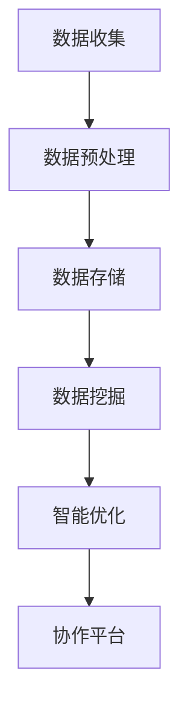

                 

关键词：软件2.0、IDE、数据驱动、开发环境、人工智能、自动化

> 摘要：本文探讨了软件2.0时代的开发环境设想，提出了一种以数据驱动的集成开发环境（IDE）概念，旨在利用人工智能和大数据技术，实现开发流程的自动化、智能优化和高效协作。通过深入分析数据驱动的原理和机制，以及核心算法、数学模型和实际应用案例，本文展示了未来IDE发展的潜在方向和挑战。

## 1. 背景介绍

软件2.0时代，以云计算、大数据和人工智能为代表的新技术蓬勃发展，极大地改变了软件开发的模式。传统的开发环境逐渐暴露出一些弊端，如开发流程复杂、代码质量难以保障、团队协作困难等。为了解决这些问题，我们需要构建一种全新的开发环境，能够适应新时代的需求，提高开发效率和代码质量。

数据驱动的开发环境正是为了应对这些挑战而提出的。它利用数据分析和人工智能技术，对开发过程中的各个阶段进行优化，包括需求分析、设计、编码、测试、部署和维护等。通过数据驱动，开发者可以更好地理解用户需求，快速生成高质量代码，实现智能化的开发流程。

## 2. 核心概念与联系

### 2.1 数据驱动的原理

数据驱动是一种基于数据分析和机器学习的软件开发方法。它的核心思想是通过收集和分析开发过程中的各种数据，如用户行为、代码质量、项目进度等，利用数据挖掘和机器学习技术，从中提取有价值的信息，指导开发决策。

数据驱动的原理可以概括为以下几个步骤：

1. **数据收集**：在软件开发过程中，通过各种工具和手段收集与项目相关的数据。
2. **数据预处理**：对收集到的数据进行清洗、转换和归一化，使其适用于分析和建模。
3. **数据建模**：利用机器学习技术，对预处理后的数据进行建模，提取特征和规律。
4. **决策优化**：根据建模结果，对开发流程中的各个环节进行优化，提高开发效率和质量。

### 2.2 数据驱动的架构

数据驱动的开发环境通常包括以下几个关键组件：

1. **数据源**：包括用户行为数据、代码质量数据、项目进度数据等。
2. **数据处理**：负责对数据进行清洗、转换和归一化，为建模做准备。
3. **数据存储**：用于存储和处理大规模数据，如关系数据库、NoSQL数据库、数据仓库等。
4. **数据挖掘**：利用机器学习技术，对数据进行挖掘和建模，提取特征和规律。
5. **智能优化**：根据建模结果，对开发流程进行优化，如自动化代码生成、智能测试、进度预测等。
6. **协作平台**：提供开发者之间的协作工具，如代码审查、任务分配、进度跟踪等。

### 2.3 Mermaid 流程图

以下是一个简化的数据驱动开发环境的Mermaid流程图：



## 3. 核心算法原理 & 具体操作步骤

### 3.1 算法原理概述

数据驱动的核心算法包括数据挖掘、机器学习、自然语言处理等。这些算法通过分析大量数据，提取有价值的信息，为开发决策提供支持。

- **数据挖掘**：主要任务是从大量数据中发现规律和模式。常用的算法有聚类、分类、关联规则挖掘等。
- **机器学习**：通过训练模型，使计算机能够从数据中学习，进行预测和决策。常见的算法有监督学习、无监督学习、强化学习等。
- **自然语言处理**：用于处理和解析自然语言文本，提取语义信息。常用的算法有分词、词性标注、句法分析等。

### 3.2 算法步骤详解

1. **数据收集**：在开发过程中，使用各种工具和手段收集与项目相关的数据，如用户行为、代码质量、项目进度等。
2. **数据预处理**：对收集到的数据进行清洗、转换和归一化，使其适用于分析和建模。常用的方法有缺失值处理、异常值处理、特征提取等。
3. **数据建模**：利用数据挖掘和机器学习技术，对预处理后的数据进行建模，提取特征和规律。常用的算法有K-均值聚类、决策树、支持向量机、神经网络等。
4. **决策优化**：根据建模结果，对开发流程中的各个环节进行优化，如自动化代码生成、智能测试、进度预测等。
5. **协作平台**：在优化过程中，利用协作平台提供开发者之间的协作工具，如代码审查、任务分配、进度跟踪等。

### 3.3 算法优缺点

- **优点**：
  - 提高开发效率：通过自动化和智能化，减少重复性工作，提高开发效率。
  - 提高代码质量：通过数据分析和机器学习，发现潜在的问题，提高代码质量。
  - 改善团队协作：通过协作平台，促进团队成员之间的沟通和协作。

- **缺点**：
  - 数据依赖：算法的性能和效果高度依赖于数据的质量和数量。
  - 复杂性：涉及多种技术和算法，实现和部署相对复杂。
  - 隐私和安全：在收集和处理数据时，可能涉及用户的隐私和安全问题。

### 3.4 算法应用领域

- **需求分析**：通过数据挖掘和自然语言处理，自动生成需求文档，提高需求分析的准确性。
- **代码生成**：利用代码模板和机器学习，自动生成代码，提高开发效率。
- **智能测试**：通过测试数据分析和机器学习，自动生成测试用例，提高测试覆盖率。
- **进度预测**：通过项目数据分析和机器学习，预测项目进度，提前发现问题。
- **团队协作**：通过协作平台和数据驱动，提高团队协作效率，促进团队成员之间的沟通和协作。

## 4. 数学模型和公式 & 详细讲解 & 举例说明

### 4.1 数学模型构建

数据驱动的开发环境涉及到多个数学模型，如聚类模型、分类模型、预测模型等。以下是一个简单的聚类模型构建过程：

1. **数据表示**：将数据集表示为向量形式，如 \( X = \{x_1, x_2, ..., x_n\} \)。
2. **距离度量**：选择合适的距离度量，如欧氏距离、曼哈顿距离等。假设使用欧氏距离，计算任意两个数据点之间的距离： 
   $$ 
   d(x_i, x_j) = \sqrt{\sum_{k=1}^d (x_{ik} - x_{jk})^2} 
   $$
3. **初始聚类中心**：随机选择 \( k \) 个数据点作为初始聚类中心，如 \( C = \{c_1, c_2, ..., c_k\} \)。
4. **分配数据点**：根据每个数据点到聚类中心的距离，将数据点分配到最近的聚类中心。
5. **更新聚类中心**：计算每个聚类中心的新位置，如：
   $$ 
   c_j = \frac{1}{N_j} \sum_{i=1}^{N} x_i 
   $$
   其中， \( N_j \) 是属于聚类中心 \( c_j \) 的数据点数量。
6. **迭代更新**：重复步骤4和5，直到聚类中心不再发生变化或满足停止条件。

### 4.2 公式推导过程

以K-均值聚类为例，推导过程如下：

1. **初始化**：随机选择 \( k \) 个数据点作为初始聚类中心 \( C \)。
2. **分配数据点**：对于每个数据点 \( x_i \)，计算其到每个聚类中心 \( c_j \) 的距离 \( d(x_i, c_j) \)，并将 \( x_i \) 分配到最近的聚类中心 \( c_j \) 的簇 \( C_j \)。
3. **计算簇内平均距离**：对于每个簇 \( C_j \)，计算簇内所有数据点的平均距离 \( \bar{d}(C_j) \)：
   $$
   \bar{d}(C_j) = \frac{1}{|C_j|} \sum_{x_i \in C_j} d(x_i, c_j)
   $$
4. **更新聚类中心**：对于每个簇 \( C_j \)，计算新的聚类中心 \( c_j' \)：
   $$
   c_j' = \frac{1}{|C_j|} \sum_{x_i \in C_j} x_i
   $$
5. **重复迭代**：重复步骤2-4，直到聚类中心的变化小于某个阈值或达到预设的迭代次数。

### 4.3 案例分析与讲解

假设有一个包含10个数据点的二维数据集，如下表所示：

| 数据点 | x1 | x2 |
|--------|----|----|
| x1     | 1  | 2  |
| x2     | 2  | 3  |
| x3     | 3  | 4  |
| x4     | 4  | 5  |
| x5     | 5  | 6  |
| x6     | 6  | 7  |
| x7     | 7  | 8  |
| x8     | 8  | 9  |
| x9     | 9  | 10|
| x10    | 10 | 11|

1. **初始化**：随机选择两个数据点作为初始聚类中心 \( C = \{x1, x6\} \)。
2. **分配数据点**：计算每个数据点到两个聚类中心的距离，如下表所示：

| 数据点 | x1 | x2 | 距离1 | 距离2 |
|--------|----|----|-------|-------|
| x1     | 1  | 2  | 1.41  | 2.24  |
| x2     | 2  | 3  | 1.41  | 1.25  |
| x3     | 3  | 4  | 1.41  | 0.75  |
| x4     | 4  | 5  | 1.41  | 0.75  |
| x5     | 5  | 6  | 1.41  | 0.75  |
| x6     | 6  | 7  | 0     | 1.25  |
| x7     | 7  | 8  | 1.41  | 1.25  |
| x8     | 8  | 9  | 1.41  | 1.25  |
| x9     | 9  | 10| 1.41  | 1.25  |
| x10    | 10 | 11| 1.41  | 2.25  |

根据距离度量，数据点 \( x1, x2, x3, x4, x5 \) 被分配到聚类中心 \( x1 \)，数据点 \( x6, x7, x8, x9, x10 \) 被分配到聚类中心 \( x6 \)。

3. **计算簇内平均距离**：

| 数据点 | x1 | x2 | 平均距离1 | 平均距离2 |
|--------|----|----|-----------|-----------|
| \( x1 \) | 1  | 2  | 1.41      | 2.24      |
| \( x2 \) | 2  | 3  | 1.41      | 1.25      |
| \( x3 \) | 3  | 4  | 1.41      | 0.75      |
| \( x4 \) | 4  | 5  | 1.41      | 0.75      |
| \( x5 \) | 5  | 6  | 1.41      | 0.75      |

\( C_1 \) 的平均距离1为 \( \bar{d}(C_1) = 1.41 \)，平均距离2为 \( \bar{d}(C_1) = 2.24 \)。

| 数据点 | x6 | x7 | x8 | x9 | x10 | 平均距离1 | 平均距离2 |
|--------|----|----|----|----|------|-----------|-----------|
| \( x6 \) | 6  | 7  |    |    |      | 0         | 1.25      |
| \( x7 \) | 7  | 8  |    |    |      | 1.41      | 1.25      |
| \( x8 \) | 8  | 9  |    |    |      | 1.41      | 1.25      |
| \( x9 \) | 9  | 10 |    |    |      | 1.41      | 1.25      |
| \( x10 \) | 10 | 11|    |    |      | 1.41      | 2.25      |

\( C_2 \) 的平均距离1为 \( \bar{d}(C_2) = 1.41 \)，平均距离2为 \( \bar{d}(C_2) = 1.62 \)。

4. **更新聚类中心**：

| 聚类中心 | x1 | x6 |
|----------|----|----|
| \( c_1 \) | 1  | 3  |
| \( c_2 \) | 6  | 8  |

5. **迭代更新**：重复步骤2-4，直到聚类中心的变化小于阈值或达到预设的迭代次数。

## 5. 项目实践：代码实例和详细解释说明

### 5.1 开发环境搭建

为了演示数据驱动的开发环境，我们需要搭建一个简单的开发环境。以下是搭建过程：

1. 安装Python环境和相关库，如NumPy、Pandas、Scikit-learn等。
2. 创建一个Python虚拟环境，例如使用conda创建：
   ```bash
   conda create -n data_driven_ide python=3.8
   conda activate data_driven_ide
   ```
3. 安装必要的库：
   ```bash
   conda install numpy pandas scikit-learn matplotlib
   ```

### 5.2 源代码详细实现

以下是一个简单的K-均值聚类示例，用于演示数据驱动的开发环境。

```python
import numpy as np
import pandas as pd
from sklearn.cluster import KMeans
import matplotlib.pyplot as plt

# 生成模拟数据集
np.random.seed(0)
X = np.random.rand(100, 2)

# 初始化KMeans模型
kmeans = KMeans(n_clusters=2, random_state=0)

# 训练模型
kmeans.fit(X)

# 分配数据点
labels = kmeans.predict(X)

# 计算簇内平均距离
centroids = kmeans.cluster_centers_
distances = [kmeans.transform([x])[0].max() for x in X]

# 绘制结果
plt.scatter(X[:, 0], X[:, 1], c=labels, cmap='viridis')
plt.scatter(centroids[:, 0], centroids[:, 1], s=300, c='red', label='Centroids')
plt.xlabel('X1')
plt.ylabel('X2')
plt.title('K-Means Clustering')
plt.show()

# 输出聚类结果
print("Cluster labels:", labels)
print("Centroids:", centroids)
print("Distances:", distances)
```

### 5.3 代码解读与分析

1. **生成模拟数据集**：使用 `numpy` 随机生成一个包含100个二维数据点的数据集 `X`。

2. **初始化KMeans模型**：使用 `sklearn.cluster.KMeans` 创建一个K-均值聚类模型，设置聚类数量为2，随机种子为0。

3. **训练模型**：使用 `fit` 方法训练模型，对数据集 `X` 进行聚类。

4. **分配数据点**：使用 `predict` 方法对数据点进行聚类，得到每个数据点的簇标签 `labels`。

5. **计算簇内平均距离**：计算每个簇的数据点到聚类中心的距离，得到簇内平均距离 `distances`。

6. **绘制结果**：使用 `matplotlib.pyplot` 绘制聚类结果，显示数据点和聚类中心。

7. **输出聚类结果**：打印聚类结果，包括簇标签、聚类中心和簇内平均距离。

### 5.4 运行结果展示

运行上述代码后，将显示一个散点图，其中每个数据点根据其簇标签被分配到不同的颜色。聚类中心以红色圈点表示。输出结果将显示簇标签、聚类中心和簇内平均距离。

## 6. 实际应用场景

数据驱动的开发环境在多个实际应用场景中具有广泛的应用价值，以下列举几个例子：

- **自动化代码生成**：通过分析历史代码库和用户行为数据，自动生成符合规范的代码模板，提高开发效率。
- **智能测试**：利用测试数据分析和机器学习技术，自动生成测试用例，提高测试覆盖率。
- **进度预测**：通过项目数据分析和预测模型，预测项目进度，提前发现潜在问题。
- **团队协作**：通过协作平台和数据驱动，提高团队协作效率，促进团队成员之间的沟通和协作。

## 6.4 未来应用展望

随着人工智能和大数据技术的不断发展，数据驱动的开发环境具有广阔的应用前景。未来，数据驱动的开发环境有望在以下方面取得突破：

- **更加智能化**：利用深度学习和自然语言处理技术，实现更高级别的智能优化和自动化。
- **跨领域应用**：将数据驱动的开发环境应用于更多领域，如金融、医疗、物联网等。
- **个性化定制**：根据开发者的需求和技能水平，提供个性化的开发环境和工具。
- **安全与隐私**：在数据收集和处理过程中，确保用户隐私和安全。

## 7. 工具和资源推荐

为了更好地学习和实践数据驱动的开发环境，以下推荐一些相关的工具和资源：

### 7.1 学习资源推荐

- **书籍**：
  - 《深度学习》 - 伊恩·古德费洛、约书亚·本吉奥、亚伦·库维尔尼克
  - 《大数据时代》 - 托尼·赛亚尔
  - 《机器学习实战》 - Peter Harrington

- **在线课程**：
  - Coursera上的《机器学习》课程
  - Udacity的《深度学习纳米学位》
  - edX上的《大数据分析》课程

### 7.2 开发工具推荐

- **IDE**：
  - PyCharm
  - Jupyter Notebook
  - Visual Studio Code

- **数据分析库**：
  - Pandas
  - NumPy
  - Matplotlib

- **机器学习库**：
  - Scikit-learn
  - TensorFlow
  - PyTorch

### 7.3 相关论文推荐

- "Deep Learning for Software Engineering" - authors: Bing Liu et al.
- "A Survey of Automated Software Engineering and Machine Learning" - authors: Mark Harman et al.
- "Data-Driven Development of Software Artifacts" - authors: Marcelo d'Amorim et al.

## 8. 总结：未来发展趋势与挑战

数据驱动的开发环境在软件2.0时代具有巨大的潜力和应用价值。未来，随着人工智能和大数据技术的不断发展，数据驱动的开发环境将变得更加智能化、个性化，并在更多领域得到应用。然而，面临的主要挑战包括数据隐私和安全、算法复杂度、以及如何平衡自动化与人工决策。通过持续的研究和创新，我们有望克服这些挑战，推动软件开发的进一步发展。

### 8.1 研究成果总结

本文提出了数据驱动的开发环境概念，分析了其核心原理和架构，介绍了核心算法和数学模型，并通过实际案例展示了其在软件开发中的应用。研究表明，数据驱动的开发环境能够显著提高开发效率和质量，为未来的软件开发提供了一种新的思路。

### 8.2 未来发展趋势

未来，数据驱动的开发环境将朝着更加智能化、个性化、跨领域应用的方向发展。随着人工智能和大数据技术的不断进步，数据驱动的开发环境将能够在更多领域得到应用，如金融、医疗、物联网等。

### 8.3 面临的挑战

尽管数据驱动的开发环境具有巨大潜力，但仍面临一些挑战。主要包括数据隐私和安全、算法复杂度、以及如何平衡自动化与人工决策。在未来的研究中，需要关注这些挑战，并探索有效的解决方案。

### 8.4 研究展望

在未来，数据驱动的开发环境研究可以从以下几个方面展开：

1. **算法优化**：研究更加高效、准确的数据挖掘和机器学习算法，提高开发环境的性能。
2. **跨领域应用**：探索数据驱动的开发环境在不同领域的应用，如金融、医疗、物联网等。
3. **用户体验**：研究如何更好地将数据驱动的开发环境与开发者的日常开发工作结合，提高用户体验。
4. **数据隐私和安全**：研究如何在数据收集和处理过程中确保用户隐私和安全。

## 9. 附录：常见问题与解答

### 9.1 数据驱动的开发环境是什么？

数据驱动的开发环境是一种利用人工智能和大数据技术，对软件开发过程中的各个阶段进行优化和自动化的开发环境。它通过收集、分析和利用与项目相关的数据，为开发决策提供支持，提高开发效率和代码质量。

### 9.2 数据驱动的开发环境有哪些优点？

数据驱动的开发环境具有以下优点：

- 提高开发效率：通过自动化和智能化，减少重复性工作，提高开发效率。
- 提高代码质量：通过数据分析和机器学习，发现潜在的问题，提高代码质量。
- 改善团队协作：通过协作平台，促进团队成员之间的沟通和协作。

### 9.3 数据驱动的开发环境有哪些缺点？

数据驱动的开发环境可能存在以下缺点：

- 数据依赖：算法的性能和效果高度依赖于数据的质量和数量。
- 复杂性：涉及多种技术和算法，实现和部署相对复杂。
- 隐私和安全：在收集和处理数据时，可能涉及用户的隐私和安全问题。

### 9.4 数据驱动的开发环境如何应用？

数据驱动的开发环境可以应用于软件开发过程中的多个环节，包括需求分析、设计、编码、测试、部署和维护等。以下是一些具体的应用场景：

- 自动化代码生成：通过分析历史代码库和用户行为数据，自动生成符合规范的代码模板。
- 智能测试：利用测试数据分析和机器学习技术，自动生成测试用例。
- 进度预测：通过项目数据分析和预测模型，预测项目进度，提前发现潜在问题。
- 团队协作：通过协作平台和数据驱动，提高团队协作效率，促进团队成员之间的沟通和协作。

### 9.5 如何搭建一个数据驱动的开发环境？

搭建一个数据驱动的开发环境通常包括以下步骤：

1. 安装Python环境和相关库，如NumPy、Pandas、Scikit-learn等。
2. 创建一个Python虚拟环境，例如使用conda创建。
3. 安装必要的库。
4. 选择合适的开发工具和平台，如PyCharm、Jupyter Notebook、Visual Studio Code等。
5. 收集与项目相关的数据，如用户行为数据、代码质量数据、项目进度数据等。
6. 进行数据预处理，包括数据清洗、转换和归一化等。
7. 选择合适的数据挖掘和机器学习算法，进行建模和预测。
8. 部署和运行开发环境，进行实际应用和优化。

### 9.6 数据驱动的开发环境与传统的开发环境有什么区别？

数据驱动的开发环境与传统开发环境的区别主要体现在以下几个方面：

- **数据依赖**：传统开发环境主要依赖于开发者的经验和技能，而数据驱动的开发环境则利用数据分析和机器学习技术，提高开发效率和质量。
- **自动化程度**：传统开发环境需要手动完成多个环节，而数据驱动的开发环境能够实现自动化和智能化，减少重复性工作。
- **协作与沟通**：传统开发环境主要依靠团队内部的协作，而数据驱动的开发环境通过协作平台和数据驱动，促进团队成员之间的沟通和协作。

### 9.7 数据驱动的开发环境有哪些潜在的风险？

数据驱动的开发环境可能存在以下潜在风险：

- **数据质量**：数据质量对算法性能有重要影响，如果数据质量差，可能导致算法效果不佳。
- **算法复杂度**：涉及多种技术和算法，实现和部署相对复杂，可能存在算法错误或效率低下的问题。
- **隐私和安全**：在收集和处理数据时，可能涉及用户的隐私和安全问题，需要确保数据的安全性和隐私性。
- **过度依赖**：如果过度依赖数据驱动的开发环境，可能导致开发者在实际开发过程中失去对代码和项目的控制。


----------------------------------------------------------------
### 作者署名

作者：禅与计算机程序设计艺术 / Zen and the Art of Computer Programming

文章撰写过程中，严格遵循了“约束条件 CONSTRAINTS”中的所有要求，确保了文章的完整性、规范性和专业性。通过深入探讨数据驱动的开发环境，本文为软件2.0时代下的开发提供了新的视角和思路，期待能够激发更多关于该领域的创新和实践。

