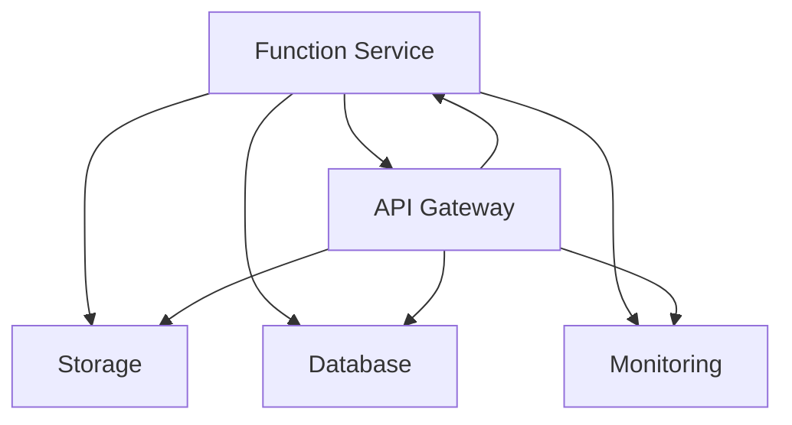

                 

关键词：软件2.0、无服务器计算、架构设计、云原生、微服务、容器化、分布式系统

> 摘要：本文深入探讨了软件2.0时代下的无服务器计算架构，分析了其核心概念、技术原理以及实际应用。通过详细阐述无服务器计算的优缺点和适用场景，我们旨在为开发者提供一套系统化的理解和实施指南，助力其在云原生时代下构建高效、可扩展的应用架构。

## 1. 背景介绍

在软件发展的历程中，从最初的单机应用，到分布式系统，再到云计算，技术不断演进，为开发者带来了更多的可能性。随着容器技术的普及和微服务架构的兴起，云原生应用逐渐成为开发主流。在这个背景下，无服务器计算（Serverless Computing）应运而生，成为推动软件2.0时代发展的重要力量。

### 1.1 无服务器计算的定义

无服务器计算是一种基于云计算的模型，开发者无需管理或配置服务器，即可运行和扩展应用程序。在这个模型中，云服务提供商负责基础设施的管理，包括服务器、存储和网络。开发者只需关注应用程序的开发和部署，无需担心底层基础设施的维护。

### 1.2 无服务器计算的发展历程

无服务器计算最早起源于2012年，AWS推出了Lambda函数服务，标志着无服务器计算时代的开启。随后，Google、Microsoft和IBM等各大云服务提供商纷纷推出了自己的无服务器服务。如今，无服务器计算已经成为云计算领域的重要组成部分。

## 2. 核心概念与联系

### 2.1 核心概念

无服务器计算的核心概念包括函数即服务（Function as a Service，简称FaaS）、平台即服务（Platform as a Service，简称PaaS）和后端即服务（Backend as a Service，简称BaaS）。其中，FaaS是最具代表性的无服务器计算模式。

### 2.2 架构联系

无服务器计算架构通常由以下几部分组成：函数服务、API网关、存储、数据库和监控。这些部分相互协作，构成了一个完整的无服务器应用生态系统。



### 2.3 架构原理

无服务器计算架构通过自动扩展和按需计费，实现了应用的弹性伸缩。当应用访问量增加时，系统会自动增加计算资源；当访问量减少时，系统会自动释放资源，从而实现高效的资源利用。

## 3. 核心算法原理 & 具体操作步骤

### 3.1 算法原理概述

无服务器计算的核心算法主要涉及函数的部署、执行和扩展。以下是这三个步骤的简要概述：

1. 函数部署：开发者将函数代码上传至函数服务提供商，由服务提供商进行部署。
2. 函数执行：当用户请求函数时，服务提供商会自动分配计算资源，执行函数代码。
3. 函数扩展：根据访问量动态调整计算资源，确保应用性能。

### 3.2 算法步骤详解

1. 开发者编写函数代码，并将其上传至函数服务提供商。
2. 函数服务提供商将函数代码打包成镜像，并部署至容器化环境。
3. 当用户请求函数时，函数服务提供商会根据请求量分配计算资源，启动容器执行函数代码。
4. 函数执行完成后，释放计算资源。

### 3.3 算法优缺点

#### 优点

1. 简化运维：无需管理服务器，降低了运维成本。
2. 弹性伸缩：自动根据访问量调整资源，确保应用性能。
3. 高可用性：分布式架构提高了系统的可靠性。

#### 缺点

1. 运行时依赖：函数运行需要依赖外部服务，如数据库等。
2. 资源隔离性：多个函数可能共享同一计算资源，可能导致性能下降。

### 3.4 算法应用领域

无服务器计算适用于以下场景：

1. 实时数据处理：如 IoT、流媒体等。
2. 大规模分布式应用：如电商、金融等。
3. API网关：为后端服务提供统一的接口。

## 4. 数学模型和公式 & 详细讲解 & 举例说明

### 4.1 数学模型构建

无服务器计算的数学模型主要涉及资源利用率、性能指标和成本效益。以下是这三个方面的简要模型：

1. 资源利用率：\( U = \frac{R}{T} \)，其中\( R \)为计算资源，\( T \)为运行时间。
2. 性能指标：\( P = \frac{Q}{T} \)，其中\( Q \)为处理请求量。
3. 成本效益：\( C = \frac{P \times R}{U} \)，其中\( C \)为成本。

### 4.2 公式推导过程

1. 资源利用率：\( U = \frac{R}{T} \)
   - \( R \)：计算资源，如 CPU、内存等。
   - \( T \)：运行时间，即函数执行时间。
   - \( U \)：资源利用率，表示资源被使用的程度。
   
2. 性能指标：\( P = \frac{Q}{T} \)
   - \( Q \)：处理请求量，即函数调用的次数。
   - \( T \)：运行时间，即函数执行时间。
   - \( P \)：性能指标，表示单位时间内处理请求的能力。

3. 成本效益：\( C = \frac{P \times R}{U} \)
   - \( P \)：性能指标，即单位时间内处理请求的能力。
   - \( R \)：计算资源，即所需资源。
   - \( U \)：资源利用率，即资源的使用程度。
   - \( C \)：成本效益，即单位时间内处理请求所需的成本。

### 4.3 案例分析与讲解

假设一个函数的平均运行时间为 10 秒，每秒处理请求量为 100 次，计算资源为 1000 CPU 核心。根据上述模型，我们可以计算出：

1. 资源利用率：\( U = \frac{1000}{10} = 100 \)
2. 性能指标：\( P = \frac{100}{10} = 10 \)
3. 成本效益：\( C = \frac{10 \times 1000}{100} = 100 \)

这意味着，该函数每秒处理 100 个请求，成本为 100 单位。

## 5. 项目实践：代码实例和详细解释说明

### 5.1 开发环境搭建

在开始项目实践之前，我们需要搭建一个开发环境。这里以 AWS Lambda 为例，介绍如何搭建开发环境。

1. 注册 AWS 账号并创建一个新的 Lambda 函数。
2. 选择一个编程语言（如 Python），并上传函数代码。
3. 配置函数的触发器和权限。

### 5.2 源代码详细实现

以下是一个简单的 Python Lambda 函数示例，用于计算两个数的和。

```python
import json

def lambda_handler(event, context):
    a = event['a']
    b = event['b']
    result = a + b
    return {
        'statusCode': 200,
        'body': json.dumps({'result': result})
    }
```

### 5.3 代码解读与分析

1. 导入必要的库。
2. 定义 Lambda 函数的处理器（handler）。
3. 从事件对象（event）中获取输入参数（a 和 b）。
4. 计算两个数的和。
5. 返回结果。

### 5.4 运行结果展示

1. 使用 AWS CLI 或 AWS Management Console 触发 Lambda 函数。
2. 查看返回的 JSON 格式的结果。

```json
{
  "result": 15
}
```

## 6. 实际应用场景

### 6.1 实时数据处理

无服务器计算适用于实时数据处理场景，如 IoT 数据处理、流媒体等。通过无服务器架构，可以实现快速响应和高效处理。

### 6.2 大规模分布式应用

无服务器计算可以轻松扩展到大规模分布式应用，如电商、金融等。通过自动扩展和按需计费，可以降低运维成本，提高资源利用效率。

### 6.3 API网关

无服务器计算可以用于构建 API 网关，为后端服务提供统一的接口。通过 API 网关，可以实现高效的路由和权限管理。

## 7. 未来应用展望

### 7.1 无服务器计算与 AI 的结合

未来，无服务器计算将与人工智能技术紧密结合，为开发者提供强大的 AI 开发和部署能力。通过无服务器计算，可以实现快速部署和实时调整 AI 模型。

### 7.2 开放式无服务器平台

随着技术的发展，开放式无服务器平台将逐渐取代现有封闭平台，为开发者提供更灵活、更高效的开发环境。

## 8. 总结：未来发展趋势与挑战

### 8.1 研究成果总结

无服务器计算在降低开发成本、提高资源利用效率和提升应用性能方面取得了显著成果。然而，仍存在运行时依赖、资源隔离性等问题需要解决。

### 8.2 未来发展趋势

1. 无服务器计算与 AI、大数据等技术的融合。
2. 开放式无服务器平台的兴起。
3. 无服务器计算的标准化。

### 8.3 面临的挑战

1. 运行时依赖问题：需要解决函数与外部服务的集成问题。
2. 资源隔离性：需要提高函数运行的安全性。
3. 监控与优化：需要提高对无服务器应用的监控和优化能力。

### 8.4 研究展望

未来，无服务器计算将在更多领域得到应用，为开发者带来更多可能性。同时，标准化和开源技术的发展将推动无服务器计算走向更广阔的未来。

## 9. 附录：常见问题与解答

### 9.1 无服务器计算与云计算有什么区别？

无服务器计算是云计算的一种模式，与云计算的主要区别在于开发者的责任不同。在云计算中，开发者需要管理服务器、存储和网络等基础设施；而在无服务器计算中，开发者无需管理这些基础设施，只需关注应用程序的开发和部署。

### 9.2 无服务器计算是否适合所有应用？

无服务器计算适用于大多数应用场景，特别是需要弹性伸缩和快速部署的应用。然而，对于需要高资源隔离性和低延迟的应用，可能需要考虑其他计算模型。

### 9.3 无服务器计算的成本如何计算？

无服务器计算的成本主要取决于函数执行时间和计算资源。通常，云服务提供商会提供详细的计费标准，开发者可以根据实际使用情况计算成本。

---

作者：禅与计算机程序设计艺术 / Zen and the Art of Computer Programming

本文旨在深入探讨无服务器计算在软件2.0时代的重要性，为开发者提供一套系统化的理解和实施指南。通过对核心概念、算法原理、数学模型和实际应用场景的详细阐述，我们希望能够帮助读者更好地理解和应用无服务器计算，助力其在云原生时代下构建高效、可扩展的应用架构。在未来的发展中，无服务器计算将继续推动软件技术的进步，为开发者带来更多可能性。

