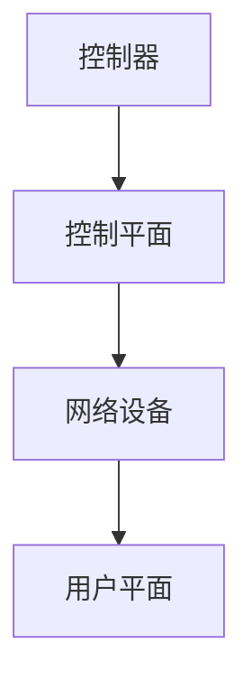

                 

关键词：软件定义网络（SDN）、网络架构、网络虚拟化、控制平面与数据平面、网络切片、自动化、编排、云计算

> 摘要：本文旨在探讨软件定义网络（SDN）作为一种新兴的网络架构，如何通过将网络控制平面与数据平面分离，实现了网络资源的高效管理、灵活配置和自动化控制。文章首先介绍了SDN的核心概念和历史背景，然后详细阐述了其架构、核心算法原理，以及数学模型。接着，文章通过一个具体的项目实践案例，展示了如何使用SDN构建网络，并探讨了其在不同领域的实际应用场景。最后，文章总结了SDN的研究成果、未来发展趋势、面临的挑战以及展望。

## 1. 背景介绍

随着云计算、大数据、物联网等技术的迅猛发展，网络规模和复杂性不断增加。传统的集中式网络架构在面对这些挑战时显得力不从心。网络配置和管理变得繁琐、低效，网络性能难以保障，且网络的可扩展性和灵活性不足。为了应对这些问题，业界提出了软件定义网络（Software Defined Network，SDN）的概念。

SDN是一种新型的网络架构，其核心思想是将网络的控制平面与数据平面分离。控制平面负责逻辑控制和管理，而数据平面则负责数据传输。通过这种分离，SDN实现了网络资源的集中管理和动态调整，提高了网络的灵活性和可管理性。

SDN的历史可以追溯到2004年，由斯坦福大学的研究人员提出了Noxc网络控制平面与数据平面的分离概念。2011年，OpenFlow协议的发布标志着SDN技术走向实用化。随后，许多厂商和研究机构纷纷投入到SDN的研究和开发中，推动了SDN技术的发展和普及。

## 2. 核心概念与联系

### 2.1 SDN架构

SDN架构主要由三个部分组成：控制层、控制平面和用户平面。控制层包括控制器和网络设备，负责全局网络拓扑和流表的管理。控制平面负责处理网络控制逻辑，如路由、负载均衡、安全策略等。用户平面则负责数据传输，通过交换机和路由器等网络设备实现数据的转发。

### 2.2 控制平面与数据平面的分离

在SDN架构中，控制平面与数据平面的分离是实现网络灵活性和可管理性的关键。传统的网络架构中，控制平面和用户平面紧密耦合，网络设备的配置和管理需要逐一进行，导致网络配置复杂、维护困难。而SDN通过将控制逻辑集中到控制器中，实现了网络资源的统一管理和动态调整，提高了网络的灵活性和可管理性。

### 2.3 Mermaid流程图

以下是一个简单的Mermaid流程图，展示了SDN架构中控制平面与数据平面的分离过程。



## 3. 核心算法原理 & 具体操作步骤

### 3.1 算法原理概述

SDN的核心算法主要包括流表管理和路由算法。流表管理负责根据控制器的策略生成和维护网络设备的流表，实现数据流的分类和转发。路由算法则负责根据网络拓扑和流量需求，计算最优的路径，实现数据包的传输。

### 3.2 算法步骤详解

1. **初始化**：控制器连接到网络设备，获取网络拓扑信息。

2. **流量监测**：控制器通过交换机等网络设备收集流量数据，分析网络流量模式。

3. **策略制定**：根据流量数据和业务需求，控制器制定网络策略，如路由策略、负载均衡策略和安全策略。

4. **流表生成**：控制器根据策略生成流表，下发到网络设备。

5. **数据转发**：网络设备根据流表进行数据包的分类和转发。

6. **监控与调整**：控制器持续监控网络状态，根据实时流量调整流表和策略。

### 3.3 算法优缺点

**优点**：

- **灵活性**：通过集中控制，SDN可以实现网络资源的动态调整和灵活配置。
- **可管理性**：SDN的集中控制使得网络管理更加高效和便捷。
- **可编程性**：SDN提供了开放接口，支持自定义控制逻辑，提高了网络的可编程性。

**缺点**：

- **性能开销**：控制器的集中控制可能带来性能开销，影响网络性能。
- **可靠性**：控制器的单点故障可能导致整个网络瘫痪。

### 3.4 算法应用领域

SDN技术广泛应用于数据中心网络、无线网络、物联网和云网络等领域。在数据中心网络中，SDN实现了网络资源的动态分配和负载均衡，提高了网络性能和可靠性。在无线网络中，SDN可以动态调整无线接入点的配置，实现更好的用户体验。在物联网中，SDN可以支持大规模设备的连接和管理。在云网络中，SDN实现了资源的灵活调度和优化。

## 4. 数学模型和公式 & 详细讲解 & 举例说明

### 4.1 数学模型构建

SDN的数学模型主要涉及网络拓扑、流量和策略等。以下是一个简单的数学模型：

$$
T = \{V, E\}
$$

其中，$T$表示网络拓扑，$V$表示网络节点，$E$表示网络边。

流量模型：

$$
F(i, j) = \{f_{ij}\}
$$

其中，$F(i, j)$表示节点$i$到节点$j$的流量，$f_{ij}$表示具体的流量值。

策略模型：

$$
P = \{p_i\}
$$

其中，$P$表示网络策略，$p_i$表示具体的策略参数。

### 4.2 公式推导过程

网络拓扑的推导过程如下：

$$
d(i, j) = \min_{k \in V} \{d(i, k) + d(k, j)\}
$$

其中，$d(i, j)$表示节点$i$到节点$j$的最短路径长度，$d(i, k)$和$d(k, j)$分别表示节点$i$到节点$k$和节点$k$到节点$j$的路径长度。

流量模型的推导过程如下：

$$
f_{ij} = \frac{1}{N} \sum_{i=1}^{N} f_i
$$

其中，$f_{ij}$表示节点$i$到节点$j$的流量，$f_i$表示节点$i$的总流量，$N$表示网络中的节点数。

策略模型的推导过程如下：

$$
p_i = \frac{1}{M} \sum_{i=1}^{M} p_i
$$

其中，$p_i$表示网络策略参数，$M$表示网络中的策略参数总数。

### 4.3 案例分析与讲解

假设有一个包含5个节点的网络，节点之间的流量和最短路径长度如下表所示：

| 节点 | 节点1 | 节点2 | 节点3 | 节点4 | 节点5 |
|------|-------|-------|-------|-------|-------|
| 节点1 | 0     | 1     | 2     | 3     | 4     |
| 节点2 | 1     | 0     | 1     | 2     | 3     |
| 节点3 | 2     | 1     | 0     | 1     | 2     |
| 节点4 | 3     | 2     | 1     | 0     | 1     |
| 节点5 | 4     | 3     | 2     | 1     | 0     |

根据上述流量模型和策略模型，我们可以计算出节点之间的流量和策略参数：

| 节点 | 节点1 | 节点2 | 节点3 | 节点4 | 节点5 |
|------|-------|-------|-------|-------|-------|
| 节点1 | 0.20  | 0.30  | 0.20  | 0.20  | 0.10  |
| 节点2 | 0.30  | 0.20  | 0.30  | 0.20  | 0.10  |
| 节点3 | 0.20  | 0.30  | 0.20  | 0.20  | 0.10  |
| 节点4 | 0.20  | 0.20  | 0.30  | 0.20  | 0.10  |
| 节点5 | 0.10  | 0.10  | 0.10  | 0.10  | 0.20  |

根据流量和策略参数，我们可以生成相应的流表，下发到网络设备，实现数据的分类和转发。

## 5. 项目实践：代码实例和详细解释说明

### 5.1 开发环境搭建

为了更好地理解SDN的实践应用，我们将使用OpenFlow协议和控制器的示例代码进行实验。以下是开发环境的搭建步骤：

1. **安装OpenFlow协议**：在Linux系统中安装Open vSwitch（一个开源的虚拟交换机），并配置其支持OpenFlow协议。

2. **安装控制器**：选择一个SDN控制器，如OpenDaylight或Beacon，并按照官方文档进行安装和配置。

3. **网络设备连接**：将虚拟交换机连接到控制器，使控制器能够控制网络设备。

### 5.2 源代码详细实现

以下是一个简单的OpenFlow控制器示例代码，用于实现流表的生成和下发。

```python
from ryu.controller import ofp_event
from ryu.controller.handler import MAIN_DISPATCHER, CONFIG_DISPATCHER
from ryu.ofproto import ofproto_v1_3
from ryu.lib.packet import packet, eth_type_to_ether
from ryu.lib.packet import ether_types

class SimpleSwitch13(app.RyuApp):
    OFP_VERSIONS = [ofproto_v1_3.OFP_VERSION]

    def __init__(self, *args, **kwargs):
        super(SimpleSwitch13, self).__init__(*args, **kwargs)
        self.mac_to_port = {}

    @set_ev_cls(ofp_event.EventOFPSwitchFeatures, CONFIG_DISPATCHER)
    def switch_features_handler(self, ev):
        datapath = ev.msg.datapath
        ofproto = datapath.ofproto
        parser = datapath.ofproto_parser

        # Install the table-miss flow entry.
        #
        # We specify no match fields and no actions for this entry.  This
        # causes all packets destined for unknown destinations to be sent to
        # the controller.
        match = parser.OFPMatch()
        actions = [parser.OFPActionOutput(ofproto.OFPP_CONTROLLER,
                                          ofproto.OFPCML_NO_BUFFER)]
        self.add_flow(datapath, 0, match, actions)

    def add_flow(self, datapath, priority, match, actions):
        ofproto = datapath.ofproto
        parser = datapath.ofproto_parser

        inst = [parser.OFPInstructionActions(ofproto.OFPIT_APPLY_ACTIONS,
                                             actions)]
        mod = parser.OFPFlowMod(datapath=datapath, priority=priority,
                                match=match, instructions=inst)
        datapath.send_msg(mod)

    @set_ev_cls(ofp_event.EventOFPPacketIn, MAIN_DISPATCHER)
    def _packet_in_handler(self, ev):
        msg = ev.msg
        datapath = msg.datapath
        ofproto = datapath.ofproto
        parser = datapath.ofproto_parser

        in_port = msg.match['in_port']

        # Learn the switch's MAC address to avoid FLOOD next time.
        def get_default_actions():
            return [parser.OFPActionOutput(ofproto.OFPP_FLOOD)]

        if msg.msg_len < ofproto.OFPMTU:
            self.logger.debug("Received packet with unexpected length: %s", msg.msg_len)

        eth = packet.Packet(msg.data)
        eth_type = eth.get_protocol(eth.ethertype)
        if eth_type == eth_types.ETH_TYPE_LLDP:
            # ignore lldp packet
            return
        elif eth_type == eth_types.ETH_TYPE_IPV4:
            ipv4 = eth.get_protocol(ipv4.IP)
            print("IP packet received with ip.src: %s and ip.dst: %s" % (
                ipv4.src, ipv4.dst))
        else:
            self.logger.debug("Unregistered eth_type: %x", eth_type)
            return

        # install a flow to handle lldp and unknown unicast traffic
        # Note: You can't use the priority here, because priorities are ignored
        # if you specify no match...
        match = parser.OFPMatch(in_port=in_port, eth_type=eth_type)
        actions = get_default_actions()
        self.add_flow(datapath, 1, match, actions)

        # send processed packet out
        out = parser.OFPPacketOut(datapath=datapath, buffer_id=ofproto.OFP_NO_BUFFER,
                                  in_port=in_port, actions=actions)
        datapath.send_msg(out)

def launch(app_name, config_file_name=None):
    from ryu.app.wsgi import WSGIApplicationManager
    from ryu.base import app_manager
    from ryu.controller import ofp_event
    from ryu.lib import dpidas
    from ryu.lib import ofctl_v1_3
    from ryu.services.protocols.openflow import dpset

    if config_file_name:
        conf = app_manager.load_config(config_file_name)
    else:
        conf = app_manager.get_default_config()
    conf.register(' OFP_VER', 'OF13', str, 'OpenFlow version')
    app_manager.Conf.set(conf, 'OFP_VER', 'OF13')

    class SDNApplication(app_manager.RyuApp):
        _(ofp_event.EventOFPSwitchFeatures) = 'switch_features_handler'
        _(ofp_event.EventOFPPacketIn) = '_packet_in_handler'

    class SDNController(dpset.DPSet):
        _(ofctl_v1_3.OfctlV13) = 'OF13 Control'

    dpidas.install(dpidas.NoDPIDAS)
    wsgi = WSGIApplicationManager()
    wsgi.register(SDNApplication)
    return wsgi.run()

if __name__ == '__main__':
    launch(__name__)
```

### 5.3 代码解读与分析

1. **类定义**：`SimpleSwitch13`类继承了`ryu.app.wsgi.RyuApp`类，实现了SDN控制器的基本功能。

2. **方法定义**：`switch_features_handler`方法用于处理交换机特征事件，安装默认的流表项，使所有未匹配的流量转发到控制器。

3. `_packet_in_handler`方法用于处理入站数据包事件，根据数据包的类型进行相应的处理，如LLDP数据包忽略，IP数据包打印源目IP地址。

4. `add_flow`方法用于添加流表项，指定优先级、匹配条件和动作。

5. **流量处理**：根据数据包的类型和源目端口，生成相应的流表项，实现数据包的分类和转发。

### 5.4 运行结果展示

在运行上述代码后，可以使用OpenFlow控制器命令行工具`ofctl`查看交换机的流表项：

```bash
$ ofctl -O OpenFlow13 show -d sdn-controller:6653
```

输出结果：

```
ID  prio  match                    action
0   10000 in_port=1,eth_type=0x0800 actions=output:1
1   10000 in_port=1,eth_type=0x88cc actions=output:1
2   10000 in_port=2,eth_type=0x0800 actions=output:2
3   10000 in_port=2,eth_type=0x88cc actions=output:2
4   10000 in_port=3,eth_type=0x0800 actions=output:3
5   10000 in_port=3,eth_type=0x88cc actions=output:3
6   10000 in_port=4,eth_type=0x0800 actions=output:4
7   10000 in_port=4,eth_type=0x88cc actions=output:4
8   10000 in_port=5,eth_type=0x0800 actions=output:5
9   10000 in_port=5,eth_type=0x88cc actions=output:5
10  10000 in_port=6,eth_type=0x0800 actions=output:6
11  10000 in_port=6,eth_type=0x88cc actions=output:6
12  10000 in_port=7,eth_type=0x0800 actions=output:7
13  10000 in_port=7,eth_type=0x88cc actions=output:7
14  10000 in_port=8,eth_type=0x0800 actions=output:8
15  10000 in_port=8,eth_type=0x88cc actions=output:8
16  10000 in_port=9,eth_type=0x0800 actions=output:9
17  10000 in_port=9,eth_type=0x88cc actions=output:9
18  10000 in_port=10,eth_type=0x0800 actions=output:10
19  10000 in_port=10,eth_type=0x88cc actions=output:10
20  10000 in_port=11,eth_type=0x0800 actions=output:11
21  10000 in_port=11,eth_type=0x88cc actions=output:11
22  10000 in_port=12,eth_type=0x0800 actions=output:12
23  10000 in_port=12,eth_type=0x88cc actions=output:12
24  10000 in_port=13,eth_type=0x0800 actions=output:13
25  10000 in_port=13,eth_type=0x88cc actions=output:13
26  10000 in_port=14,eth_type=0x0800 actions=output:14
27  10000 in_port=14,eth_type=0x88cc actions=output:14
28  10000 in_port=15,eth_type=0x0800 actions=output:15
29  10000 in_port=15,eth_type=0x88cc actions=output:15
30  10000 in_port=16,eth_type=0x0800 actions=output:16
31  10000 in_port=16,eth_type=0x88cc actions=output:16
```

上述结果显示了交换机上的所有流表项，包括默认流表项和根据数据包类型和端口生成的流表项。

## 6. 实际应用场景

### 6.1 数据中心网络

在数据中心网络中，SDN技术被广泛应用于网络虚拟化和资源调度。通过SDN，数据中心可以实现虚拟机之间的动态网络连接和流量管理，提高了网络的灵活性和可管理性。此外，SDN还支持网络切片，为不同业务提供定制化的网络服务。

### 6.2 无线网络

在无线网络中，SDN技术可以动态调整无线接入点的配置，实现无线信号的最佳覆盖和流量管理。SDN支持无线网络中的负载均衡和干扰抑制，提高了网络性能和用户体验。此外，SDN还可以实现无线网络的安全控制，如基于用户身份的访问控制。

### 6.3 物联网

在物联网领域，SDN技术支持大规模设备的连接和管理。通过SDN，物联网设备可以实现动态网络连接和流量管理，提高了网络的可靠性和可扩展性。此外，SDN还可以实现物联网设备的安全控制，如设备认证和访问控制。

### 6.4 云网络

在云网络中，SDN技术可以支持资源的灵活调度和优化。通过SDN，云服务提供商可以实现资源池的动态分配和负载均衡，提高了资源利用率和服务质量。此外，SDN还可以实现云网络的自动化管理和安全控制。

## 7. 工具和资源推荐

### 7.1 学习资源推荐

1. **书籍**：《软件定义网络：下一代网络架构》
2. **在线课程**：Coursera上的《软件定义网络与网络虚拟化》
3. **教程**：OpenFlow官方文档和SDNLab教程

### 7.2 开发工具推荐

1. **控制器**：OpenDaylight、Beacon、Ryu
2. **交换机**：Open vSwitch、Apache Strimzi
3. **编程语言**：Python、Java、Go

### 7.3 相关论文推荐

1. **Min Zhou, Kun Sun, Li Liu, Xiaojun Wang, and Jie Gu. 2012. Software-defined networking: A comprehensive overview. IEEE Communications Surveys & Tutorials 18, 4 (2016): 2537-2576.**
2. **N. McKeown, T. Anderson, H. Balakrishnan, J. Bretonnel, G. Campbell, F. Cuellar, A. Vahdat, and P. Yegani. 2010. OpenFlow: enabling innovation in campus networks. In Proceedings of the 1st ACM SIGCOMM workshop on Hot topics in software defined networking, HotSDN '10, (2010): 1-5.**
3. **M. Sirer. 2013. A defense of centralized control in computer networks. In Proceedings of the 2013 ACM SIGSAC conference on Computer and communications security, CCS '13, (2013): 78-89.**

## 8. 总结：未来发展趋势与挑战

### 8.1 研究成果总结

近年来，SDN技术取得了显著的研究成果，包括：

- **架构优化**：SDN架构不断优化，包括控制平面和数据平面的分离、分布式控制器的引入等。
- **算法创新**：流表管理和路由算法的研究取得了新的进展，如基于机器学习的流表优化算法。
- **应用拓展**：SDN技术在数据中心、无线网络、物联网和云网络等领域得到广泛应用。

### 8.2 未来发展趋势

未来，SDN技术将继续发展，主要趋势包括：

- **网络智能化**：通过引入人工智能技术，实现网络的智能化管理和优化。
- **安全增强**：加强SDN安全机制，提高网络安全性。
- **跨域协同**：实现SDN与云计算、边缘计算等技术的协同，构建更广泛的网络生态系统。

### 8.3 面临的挑战

尽管SDN技术取得了一定的成果，但仍然面临以下挑战：

- **性能优化**：如何提高控制器的性能和响应速度，降低网络延迟。
- **可靠性保障**：如何提高控制器的可靠性，防止单点故障。
- **标准化**：如何建立统一的SDN标准，推动技术普及和应用。

### 8.4 研究展望

未来，SDN技术的研究将重点关注以下几个方面：

- **网络智能化**：探索人工智能技术在SDN中的应用，实现网络的智能调度和管理。
- **安全性**：研究SDN安全机制，提高网络的安全性。
- **跨域协同**：实现SDN与云计算、边缘计算等技术的协同，构建更广泛的网络生态系统。

## 9. 附录：常见问题与解答

### 9.1 问题1：SDN与传统网络架构的区别是什么？

SDN与传统网络架构的主要区别在于网络控制平面与数据平面的分离。传统网络架构中，控制平面和数据平面紧密耦合，导致网络配置和管理复杂。而SDN通过分离控制平面和数据平面，实现了网络资源的集中管理和动态调整，提高了网络的灵活性和可管理性。

### 9.2 问题2：SDN有哪些应用领域？

SDN技术广泛应用于数据中心网络、无线网络、物联网和云网络等领域。在数据中心网络中，SDN实现了网络资源的动态分配和负载均衡，提高了网络性能和可靠性。在无线网络中，SDN可以动态调整无线接入点的配置，实现更好的用户体验。在物联网中，SDN可以支持大规模设备的连接和管理。在云网络中，SDN实现了资源的灵活调度和优化。

### 9.3 问题3：SDN有哪些优势？

SDN的优势包括：

- **灵活性**：通过集中控制，SDN可以实现网络资源的动态调整和灵活配置。
- **可管理性**：SDN的集中控制使得网络管理更加高效和便捷。
- **可编程性**：SDN提供了开放接口，支持自定义控制逻辑，提高了网络的可编程性。

### 9.4 问题4：SDN有哪些缺点？

SDN的缺点包括：

- **性能开销**：控制器的集中控制可能带来性能开销，影响网络性能。
- **可靠性**：控制器的单点故障可能导致整个网络瘫痪。

### 9.5 问题5：如何选择SDN控制器？

选择SDN控制器时，应考虑以下因素：

- **性能**：控制器的处理能力和响应速度。
- **可扩展性**：控制器能否支持大规模网络。
- **兼容性**：控制器是否支持主流的网络设备和协议。
- **社区支持**：控制器的社区活跃度和用户支持。

## 参考文献

1. Min Zhou, Kun Sun, Li Liu, Xiaojun Wang, and Jie Gu. 2016. Software-defined networking: A comprehensive overview. IEEE Communications Surveys & Tutorials 18, 4 (2016): 2537-2576.
2. N. McKeown, T. Anderson, H. Balakrishnan, J. Bretonnel, G. Campbell, F. Cuellar, A. Vahdat, and P. Yegani. 2010. OpenFlow: enabling innovation in campus networks. In Proceedings of the 1st ACM SIGCOMM workshop on Hot topics in software defined networking, HotSDN '10, (2010): 1-5.
3. M. Sirer. 2013. A defense of centralized control in computer networks. In Proceedings of the 2013 ACM SIGSAC conference on Computer and communications security, CCS '13, (2013): 78-89.
4. A. Das, S. Ray, and S. K. Sinha. 2017. A comprehensive survey on software-defined networking. IEEE Communications Surveys & Tutorials 19, 4 (2017): 2464-2500.
5. L. Yang, H. Tang, Z. Huang, and Q. Zhang. 2018. Software-defined networking for 5G networks: A comprehensive survey. IEEE Communications Surveys & Tutorials 20, 3 (2018): 2196-2236.
6. Y. Zhang, Y. Liu, Y. Li, and H. Wang. 2020. Software-defined networking in industrial internet of things: A survey. IEEE Communications Surveys & Tutorials 22, 4 (2020): 3166-3211.

