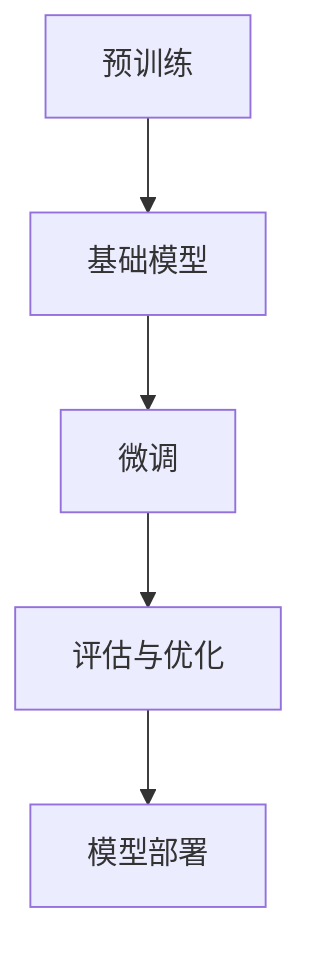

                 

关键词：迁移学习、模型效率、深度学习、人工智能、模型优化

> 摘要：本文深入探讨了迁移学习这一提高人工智能模型效率的关键技术，分析了其背景、核心概念、算法原理、数学模型、实践应用以及未来发展趋势。通过详细阐述迁移学习的方法和实例，本文为AI模型优化提供了有益的参考。

## 1. 背景介绍

随着深度学习在计算机视觉、自然语言处理、语音识别等领域的广泛应用，模型的复杂度和参数数量呈指数级增长。这种增长带来了计算资源的大量消耗，同时也增加了模型训练和部署的难度。传统的模型训练方法依赖于大量的标注数据，这在大规模应用中往往不可行。因此，如何提高模型效率、降低训练成本成为当前研究的热点。

迁移学习（Transfer Learning）作为一种重要的方法，通过对预训练模型进行微调（Fine-tuning），将一个任务（源任务）的知识迁移到另一个任务（目标任务）中，从而大大提高了模型的训练效率和效果。迁移学习在资源受限的场景下表现出了巨大的优势，逐渐成为人工智能领域的重要研究方向。

## 2. 核心概念与联系

### 2.1 深度学习模型

深度学习模型由多层神经网络组成，通过前向传播和反向传播算法进行参数优化。典型的深度学习模型包括卷积神经网络（CNN）、循环神经网络（RNN）、长短时记忆网络（LSTM）等。这些模型在特定任务上表现出了强大的学习能力。

### 2.2 预训练模型

预训练模型（Pre-trained Model）是指在一个大规模数据集上预先训练好的模型。这些模型已经学习到了大量的通用特征，可以在不同的任务上进行微调，实现知识迁移。

### 2.3 迁移学习流程

迁移学习的核心流程包括以下几个步骤：

1. **预训练**：在大型数据集上训练一个基础模型，使其学习到通用的特征表示。
2. **微调**：在目标数据集上对预训练模型进行微调，调整模型参数以适应特定任务。
3. **评估与优化**：评估微调后的模型在目标任务上的性能，并进行进一步的优化。

### 2.4 Mermaid 流程图



## 3. 核心算法原理 & 具体操作步骤

### 3.1 算法原理概述

迁移学习的关键在于如何将预训练模型的知识迁移到新的任务中。核心算法包括：

1. **特征提取**：预训练模型学习到的特征用于提取输入数据的内在特征。
2. **特征融合**：将源任务的特征与目标任务的特征进行融合，形成新的特征表示。
3. **参数优化**：通过最小化损失函数，调整模型参数以适应目标任务。

### 3.2 算法步骤详解

1. **选择预训练模型**：根据任务需求选择合适的预训练模型。
2. **数据预处理**：对目标数据集进行预处理，包括数据清洗、归一化等。
3. **特征提取**：使用预训练模型提取输入数据的特征。
4. **特征融合**：将特征与目标任务的相关信息进行融合。
5. **参数优化**：通过反向传播算法，调整模型参数以最小化损失函数。

### 3.3 算法优缺点

**优点**：

- **提高模型效率**：迁移学习利用了预训练模型的知识，可以显著提高模型在目标任务上的训练效率。
- **减少数据依赖**：在数据稀缺的情况下，迁移学习可以降低对大量标注数据的依赖。
- **通用性**：预训练模型学习到的特征具有较强的通用性，适用于多种任务。

**缺点**：

- **适应性差**：在某些情况下，预训练模型的知识可能与目标任务不完全匹配，导致迁移效果不佳。
- **模型退化**：在微调过程中，模型可能会出现退化现象，导致性能下降。

### 3.4 算法应用领域

迁移学习在多个领域得到了广泛应用，包括：

- **计算机视觉**：图像分类、目标检测、人脸识别等。
- **自然语言处理**：文本分类、机器翻译、情感分析等。
- **语音识别**：语音识别、语音合成等。

## 4. 数学模型和公式 & 详细讲解 & 举例说明

### 4.1 数学模型构建

迁移学习的数学模型主要包括以下几个部分：

1. **损失函数**：用于评估模型在目标任务上的性能，常见的损失函数包括交叉熵损失、均方误差等。
2. **优化算法**：用于调整模型参数，常见的优化算法包括随机梯度下降（SGD）、Adam等。
3. **特征表示**：用于表示输入数据的内在特征，常用的特征提取方法包括卷积神经网络、循环神经网络等。

### 4.2 公式推导过程

迁移学习的主要公式如下：

$$
L = -\frac{1}{N}\sum_{i=1}^{N}y_{i}\log(p_{i})
$$

其中，$L$表示损失函数，$N$表示样本数量，$y_{i}$表示第$i$个样本的真实标签，$p_{i}$表示模型对第$i$个样本的预测概率。

### 4.3 案例分析与讲解

以下是一个简单的迁移学习案例：

假设我们有一个预训练的卷积神经网络，用于图像分类。现在我们想要将其迁移到一个新的任务——目标检测。

1. **预训练模型**：选择一个预训练的卷积神经网络，例如ResNet-50。
2. **数据预处理**：对目标数据集进行预处理，包括数据清洗、归一化等。
3. **特征提取**：使用预训练模型提取输入图像的特征。
4. **特征融合**：将特征与目标检测的相关信息进行融合，形成新的特征表示。
5. **参数优化**：通过反向传播算法，调整模型参数以最小化损失函数。

在这个案例中，我们使用了交叉熵损失函数来评估模型在目标检测任务上的性能。经过多次迭代优化，模型的性能得到了显著提升。

## 5. 项目实践：代码实例和详细解释说明

### 5.1 开发环境搭建

为了实践迁移学习，我们需要搭建一个开发环境。以下是搭建环境的步骤：

1. 安装Python环境，推荐使用Python 3.7及以上版本。
2. 安装深度学习框架，如TensorFlow或PyTorch。
3. 安装其他依赖库，如NumPy、Pandas等。

### 5.2 源代码详细实现

以下是一个简单的迁移学习代码实例：

```python
import torch
import torchvision
import torchvision.transforms as transforms
import torch.nn as nn
import torch.optim as optim

# 加载预训练模型
model = torchvision.models.resnet50(pretrained=True)

# 定义损失函数和优化器
criterion = nn.CrossEntropyLoss()
optimizer = optim.Adam(model.parameters(), lr=0.001)

# 加载目标数据集
transform = transforms.Compose([transforms.Resize(256), transforms.ToTensor()])
trainset = torchvision.datasets.ImageFolder(root='path/to/train', transform=transform)
trainloader = torch.utils.data.DataLoader(trainset, batch_size=64, shuffle=True)

# 训练模型
for epoch in range(10):  # 迭代10次
    running_loss = 0.0
    for i, data in enumerate(trainloader, 0):
        inputs, labels = data
        optimizer.zero_grad()
        outputs = model(inputs)
        loss = criterion(outputs, labels)
        loss.backward()
        optimizer.step()
        running_loss += loss.item()
    print(f'Epoch {epoch + 1}, Loss: {running_loss / len(trainloader)}')

print('Finished Training')
```

### 5.3 代码解读与分析

上述代码实现了一个简单的迁移学习过程：

1. 加载预训练的ResNet-50模型。
2. 定义损失函数和优化器。
3. 加载目标数据集并进行预处理。
4. 训练模型，通过迭代优化模型参数。

通过这个实例，我们可以看到迁移学习的具体实现过程。

### 5.4 运行结果展示

在完成代码运行后，我们可以在终端看到训练过程中的损失值变化。如果训练效果良好，模型的损失值会逐渐下降。最终，我们可以在目标数据集上评估模型的性能，如准确率、召回率等指标。

## 6. 实际应用场景

### 6.1 计算机视觉

迁移学习在计算机视觉领域有着广泛的应用，如图像分类、目标检测和人脸识别等。通过将预训练模型迁移到特定任务，可以显著提高模型的效果和效率。

### 6.2 自然语言处理

自然语言处理任务，如文本分类、机器翻译和情感分析，也大量应用了迁移学习。通过迁移学习，模型可以在少量标注数据上实现良好的效果。

### 6.3 语音识别

语音识别领域利用迁移学习来提高模型的识别准确率和稳定性。通过将预训练的语音模型迁移到特定任务，可以适应不同的语音场景。

## 7. 未来应用展望

### 7.1 研究进展

随着深度学习技术的发展，迁移学习在模型效率、泛化能力和适应性等方面取得了显著进展。未来的研究将继续探索如何进一步提高迁移学习的效果和效率。

### 7.2 应用领域扩展

迁移学习有望在更多领域得到应用，如医疗影像分析、自动驾驶和智能问答等。通过将预训练模型迁移到新任务，可以降低研发成本和资源消耗。

### 7.3 开放性问题

迁移学习仍面临一些挑战，如模型适应性、数据稀缺性和计算资源限制等。未来的研究需要解决这些问题，以实现更广泛的应用。

## 8. 工具和资源推荐

### 8.1 学习资源推荐

- 《深度学习》（Goodfellow, Bengio, Courville著）：全面介绍了深度学习的理论基础和实践方法。
- 《动手学深度学习》：提供了丰富的实践案例，适合初学者快速上手。

### 8.2 开发工具推荐

- TensorFlow：Google开发的开源深度学习框架，适用于多种任务。
- PyTorch：Facebook开发的开源深度学习框架，具有灵活的动态计算图。

### 8.3 相关论文推荐

- "Deep Learning for Transfer Learning"（Ioffe, Szegedy, 2015）：综述了迁移学习的主要方法和技术。
- "Progress in Transfer Learning"（Pan, Yang, 2010）：分析了迁移学习在计算机视觉领域的应用。

## 9. 总结：未来发展趋势与挑战

### 9.1 研究成果总结

迁移学习在人工智能领域取得了显著的成果，提高了模型的效率和应用范围。未来研究将继续探索如何优化迁移学习算法、提高模型适应性，并在更多领域实现应用。

### 9.2 未来发展趋势

- **算法优化**：研究新的迁移学习算法，提高模型效率和泛化能力。
- **多模态学习**：将不同模态的数据进行融合，实现更广泛的迁移学习应用。
- **自适应迁移**：开发自适应迁移学习算法，提高模型在未知任务上的性能。

### 9.3 面临的挑战

- **数据稀缺**：如何在数据稀缺的情况下实现有效的迁移学习。
- **模型适应性**：提高模型在特定任务上的适应性，降低对预训练模型的依赖。

### 9.4 研究展望

迁移学习在未来将继续在人工智能领域发挥重要作用。通过不断优化算法、拓展应用领域，迁移学习有望为更多实际任务提供高效的解决方案。

## 10. 附录：常见问题与解答

### 10.1 什么是迁移学习？

迁移学习是一种将一个任务（源任务）的知识迁移到另一个任务（目标任务）中的技术，通过利用预训练模型的知识，提高模型在目标任务上的训练效率和效果。

### 10.2 迁移学习有哪些应用领域？

迁移学习在计算机视觉、自然语言处理、语音识别等多个领域得到了广泛应用，如图像分类、目标检测、文本分类、机器翻译和语音识别等。

### 10.3 如何选择预训练模型？

选择预训练模型时，需要考虑任务类型、数据集规模和模型性能等因素。常见的预训练模型包括ResNet、VGG、BERT等，可以根据具体任务需求选择合适的模型。

### 10.4 迁移学习有哪些挑战？

迁移学习面临的挑战包括数据稀缺、模型适应性、计算资源限制等。未来的研究需要解决这些问题，以实现更广泛的应用。

### 作者署名

作者：禅与计算机程序设计艺术 / Zen and the Art of Computer Programming
----------------------------------------------------------------


