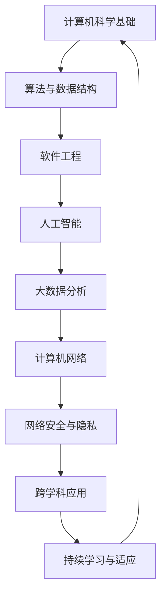

                 

在这个快速变化的时代，计算技术正以前所未有的速度影响着我们的生活和工作的方方面面。从人工智能到云计算，从大数据分析到物联网，计算技术的变革正在重塑人类社会的经济、文化和科技发展的格局。面对未来，我们必须深刻理解人类计算时代的技能需求，以便更好地适应和引领这一波变革的浪潮。

本文将围绕以下几个核心问题展开讨论：

- 人类计算时代的技术背景和现状是怎样的？
- 在这样的时代中，哪些核心技能对于专业和技术人才至关重要？
- 我们如何通过教育和培训来培养这些技能？
- 未来，人类与技术的关系将如何演变？

在文章的最后，我们将总结研究成果，展望未来发展趋势与挑战，并提出应对策略。

## 1. 背景介绍

### 计算技术的演变

从最初的计算机问世到今天，计算技术经历了无数次的技术革新和理论突破。从最初的电子管计算机到晶体管，再到集成电路和微处理器，计算机的性能不断提升，体积不断缩小，成本不断降低。同时，编程语言和软件开发工具也在不断进步，使得编程变得更加容易和高效。

在这个过程中，计算机科学的几个核心领域也逐渐成形，包括算法理论、数据结构、软件工程、计算机网络和人工智能等。每个领域都有其独特的发展路径和贡献，共同推动了计算技术的不断进步。

### 技术现状

今天，计算技术已经渗透到我们生活的方方面面。智能手机、平板电脑、智能穿戴设备、智能家居、自动驾驶汽车、云计算、大数据分析、物联网等，都是计算技术应用的典型代表。这些技术的快速发展，不仅改变了我们的生活方式，也改变了商业运作模式，甚至整个社会的运作方式。

特别是在过去几年中，人工智能技术的突破性进展，使得机器能够执行以前只能由人类完成的复杂任务，如图像识别、语音识别、自然语言处理等。这进一步推动了计算技术在社会各个领域的广泛应用。

### 技术挑战与趋势

尽管计算技术取得了巨大的进步，但我们仍然面临许多挑战。首先，随着计算能力的不断提升，数据量和计算复杂度也在不断增加，这对算法效率和数据处理能力提出了更高的要求。其次，人工智能技术的发展带来了伦理和隐私等问题，如何确保技术的公平性和透明性，如何保护个人隐私，都是亟待解决的问题。

此外，技术的快速迭代和更新，也要求从业人员不断学习和适应新技术，提高自己的技能水平。因此，了解和掌握计算时代的核心技能，对于个人和组织的未来发展都至关重要。

## 2. 核心概念与联系

在讨论人类计算时代的技能需求之前，我们需要明确几个核心概念，并理解它们之间的联系。以下是一个简化的 Mermaid 流程图，用以展示这些核心概念和它们之间的关系。



### 2.1 计算机科学基础

计算机科学基础包括计算机体系结构、操作系统、编译原理和编程语言等。这些基础知识是构建更高级技术和应用的基础。例如，了解计算机体系结构可以帮助我们理解硬件与软件之间的交互方式，从而优化算法的性能。

### 2.2 算法与数据结构

算法是解决问题的步骤序列，数据结构则是数据组织和管理的方式。掌握高效的算法和数据结构是实现软件工程和人工智能等领域应用的关键。例如，在数据处理和分析中，选择合适的算法和数据结构可以显著提高效率。

### 2.3 软件工程

软件工程涉及软件设计、开发、测试和维护的全过程。它强调的是系统化、规范化的开发方法，以及高质量、高效率的软件交付。软件工程的知识和技能对于任何计算技术领域都是不可或缺的。

### 2.4 人工智能

人工智能是计算技术的前沿领域，它通过机器学习、深度学习等方法，使计算机能够模拟人类的智能行为。人工智能技术的进步，不仅推动了计算技术的创新，也带来了新的商业机会和社会变革。

### 2.5 大数据分析

大数据分析是处理海量数据以提取有价值信息的过程。随着数据量的不断增加，大数据分析变得越来越重要。掌握大数据分析技能，可以帮助我们从海量数据中挖掘出隐藏的规律和洞察。

### 2.6 计算机网络

计算机网络是连接设备和系统的桥梁，它使得数据的传输和共享成为可能。了解计算机网络的基本原理和协议，对于开发分布式系统和应用至关重要。

### 2.7 网络安全与隐私

随着计算技术的发展，网络安全和隐私问题也变得越来越重要。掌握网络安全和隐私保护技术，可以帮助我们防范各种网络攻击，保护数据的安全和用户的隐私。

### 2.8 跨学科应用

跨学科应用是将计算技术与其他领域相结合，解决复杂问题的过程。例如，计算生物学、计算金融和计算物理等领域，都依赖于计算技术的进步。跨学科应用能力，是未来技术人才的重要素质。

### 2.9 持续学习与适应

计算技术发展迅速，要求从业人员具备持续学习和适应新技术的能力。持续学习不仅是个人成长的动力，也是组织保持竞争力的关键。

通过以上核心概念和流程图的展示，我们可以清晰地看到它们之间的相互联系和作用。这些核心概念共同构成了计算时代的技能体系，为技术人才的培养提供了明确的指导。

## 3. 核心算法原理 & 具体操作步骤

在计算技术的各个领域，核心算法的作用至关重要。它们是解决问题和优化资源的关键工具。本节将介绍几个在计算时代中至关重要的核心算法，并详细说明其原理和操作步骤。

### 3.1 算法原理概述

#### 3.1.1 暴力解法

暴力解法是最直观也是最简单的一种算法。它通过直接遍历所有可能的解，找到最优解。虽然这种方法简单易懂，但效率较低，尤其是在数据规模较大时，会面临计算能力不足的问题。

#### 3.1.2 分而治之

分而治之是一种递归算法思想，将一个大问题分解成若干个小问题，分别解决，然后将小问题的解合并成大问题的解。这种算法适用于许多问题，如排序、二分搜索等。

#### 3.1.3 动态规划

动态规划是一种通过保存子问题的解来避免重复计算的方法。它通常适用于具有重叠子问题和最优子结构性质的问题。动态规划的核心思想是将复杂问题分解为简单问题的组合，并通过保存中间结果来优化计算效率。

#### 3.1.4 贪心算法

贪心算法通过每一步选择当前最优解，期望在整体上得到最优解。它适用于某些特定类型的问题，如背包问题、最短路径问题等。

#### 3.1.5 随机化算法

随机化算法利用随机性来提高算法的效率或避免陷入局部最优。它通常用于解决那些难以找到确定性最优解的问题，如遗传算法、模拟退火算法等。

### 3.2 算法步骤详解

#### 3.2.1 暴力解法步骤

1. 确定问题的输入参数。
2. 遍历所有可能的解。
3. 对每个解进行评估，找出最优解。
4. 返回最优解。

#### 3.2.2 分而治之步骤

1. 确定递归结束条件。
2. 将问题分解成若干个子问题。
3. 分别解决子问题。
4. 合并子问题的解，得到最终解。

#### 3.2.3 动态规划步骤

1. 确定状态和状态转移方程。
2. 初始化边界条件。
3. 按照状态转移方程递推计算状态值。
4. 返回最终状态值。

#### 3.2.4 贪心算法步骤

1. 确定问题的贪心选择标准。
2. 逐步选择当前最优解。
3. 更新问题的状态。
4. 返回最终解。

#### 3.2.5 随机化算法步骤

1. 确定随机化策略。
2. 遍历所有可能的解或随机采样。
3. 对每个解进行评估。
4. 选择最优解或随机解。

### 3.3 算法优缺点

#### 3.3.1 暴力解法

优点：简单易懂，容易实现。

缺点：效率低，不适用于大规模问题。

#### 3.3.2 分而治之

优点：递归思想，适用于许多问题。

缺点：可能存在效率不高的情况，如递归深度较大。

#### 3.3.3 动态规划

优点：避免重复计算，高效。

缺点：需要明确状态和状态转移方程，可能较复杂。

#### 3.3.4 贪心算法

优点：简单高效，适用于特定问题。

缺点：不保证全局最优解。

#### 3.3.5 随机化算法

优点：避免陷入局部最优，高效。

缺点：随机性可能导致结果不稳定。

### 3.4 算法应用领域

这些算法广泛应用于各种计算技术领域，如：

- 排序和搜索：分而治之、动态规划、贪心算法等。
- 优化问题：动态规划、贪心算法、随机化算法等。
- 图算法：分而治之、动态规划、贪心算法等。
- 数据分析：动态规划、贪心算法、随机化算法等。

通过掌握这些核心算法，我们可以更有效地解决计算技术中的各种问题，提高开发效率和应用效果。

## 4. 数学模型和公式 & 详细讲解 & 举例说明

在计算技术中，数学模型和公式是理解和分析问题的基础工具。通过建立数学模型，我们可以将复杂问题转化为可计算的形式，从而找到解决方案。本节将介绍几个关键的数学模型和公式，并详细讲解其推导过程和实际应用。

### 4.1 数学模型构建

数学模型的构建通常涉及以下几个步骤：

1. **定义问题**：明确我们要解决的问题是什么，包括问题的约束条件、目标函数等。
2. **建立假设**：根据问题的特性，建立合理的假设，简化问题。
3. **选择数学工具**：根据问题类型，选择合适的数学工具，如微积分、线性代数、概率论等。
4. **构建公式**：将假设和数学工具结合起来，构建出描述问题的数学公式。
5. **验证模型**：通过实际数据和案例，验证数学模型的准确性和可靠性。

### 4.2 公式推导过程

在本节中，我们将介绍两个常用的数学模型：线性回归模型和决策树模型。

#### 4.2.1 线性回归模型

线性回归模型用于分析变量之间的线性关系，其公式为：

$$ Y = \beta_0 + \beta_1 \cdot X + \epsilon $$

其中，$Y$ 是因变量，$X$ 是自变量，$\beta_0$ 和 $\beta_1$ 是参数，$\epsilon$ 是误差项。

1. **定义问题**：我们要分析的是因变量 $Y$ 和自变量 $X$ 之间的线性关系。
2. **建立假设**：假设 $Y$ 和 $X$ 之间存在线性关系，可以表示为上述公式。
3. **选择数学工具**：使用最小二乘法来估计参数 $\beta_0$ 和 $\beta_1$。
4. **构建公式**：最小二乘法的公式为：

$$ \beta_1 = \frac{\sum{(X_i - \bar{X})(Y_i - \bar{Y})}}{\sum{(X_i - \bar{X})^2}} $$

$$ \beta_0 = \bar{Y} - \beta_1 \cdot \bar{X} $$

其中，$\bar{X}$ 和 $\bar{Y}$ 分别是 $X$ 和 $Y$ 的平均值。

#### 4.2.2 决策树模型

决策树模型用于分类和回归问题，其基本结构包括根节点、内部节点和叶子节点。每个节点表示一个特征，每个分支表示该特征的不同取值，叶子节点表示最终的分类或回归结果。

1. **定义问题**：我们要构建一个决策树模型来分类或回归。
2. **建立假设**：假设每个特征的不同取值会影响最终的分类或回归结果。
3. **选择数学工具**：使用信息增益或基尼系数来选择最优特征。
4. **构建公式**：信息增益公式为：

$$ IG(D, A) = H(D) - \sum_{v \in A} \frac{|D_v|}{|D|} H(D_v) $$

其中，$D$ 是数据集，$A$ 是特征集合，$H(D)$ 是数据集的熵，$H(D_v)$ 是特征 $A$ 取值 $v$ 对应的熵。

### 4.3 案例分析与讲解

为了更好地理解上述数学模型和公式，我们将通过一个实际案例进行讲解。

#### 4.3.1 线性回归模型案例

假设我们要预测一家公司明年的利润，已知过去五年的年利润数据如下：

| 年份 | 利润 (万元) |
| ---- | ---------- |
| 2019 | 100        |
| 2020 | 120        |
| 2021 | 130        |
| 2022 | 140        |
| 2023 | 150        |

1. **数据预处理**：计算平均值和标准差，得到 $\bar{X} = 2020$ 和 $\bar{Y} = 130$。
2. **参数估计**：使用最小二乘法计算参数 $\beta_0$ 和 $\beta_1$，得到 $\beta_0 = 10$ 和 $\beta_1 = 0.2$。
3. **模型预测**：使用构建的线性回归模型预测2024年的利润，得到 $Y = 10 + 0.2 \cdot 2024 = 140.8$ 万元。

通过这个案例，我们可以看到如何使用线性回归模型进行预测，从而帮助公司做出更准确的决策。

#### 4.3.2 决策树模型案例

假设我们要分类一批邮件，将其分为“垃圾邮件”和“非垃圾邮件”两类。已知每个邮件包含以下几个特征：发件人、邮件主题、邮件正文。每个特征的不同取值会影响邮件的分类结果。

1. **数据预处理**：对每个特征进行编码和预处理，以便构建决策树模型。
2. **特征选择**：使用信息增益或基尼系数选择最优特征，假设选择邮件主题。
3. **模型构建**：根据邮件主题的不同取值，构建决策树模型，分为“垃圾邮件”和“非垃圾邮件”两类。
4. **模型应用**：对一批新的邮件进行分类，根据决策树模型的输出结果，判断其类别。

通过这个案例，我们可以看到如何使用决策树模型进行邮件分类，从而帮助用户更好地管理和筛选邮件。

通过以上案例分析和讲解，我们可以更深入地理解线性回归模型和决策树模型，以及它们在实际应用中的重要性。

## 5. 项目实践：代码实例和详细解释说明

为了更好地理解计算技术中的核心算法和数学模型，我们通过一个实际项目来进行代码实现和详细解释。该项目将涉及使用 Python 编写一个简单的线性回归模型，并通过实际数据集进行训练和预测。

### 5.1 开发环境搭建

在开始编写代码之前，我们需要搭建一个 Python 开发环境。以下是搭建过程的简要步骤：

1. **安装 Python**：从官方网站下载并安装 Python 3.x 版本。
2. **安装依赖库**：使用 pip 工具安装必要的库，如 NumPy、Pandas 和 Scikit-learn。
   ```bash
   pip install numpy pandas scikit-learn
   ```

3. **编写 Python 脚本**：创建一个新的 Python 脚本文件，用于编写和运行代码。

### 5.2 源代码详细实现

以下是实现线性回归模型的 Python 源代码：

```python
import numpy as np
import pandas as pd
from sklearn.linear_model import LinearRegression

# 5.2.1 加载数据集
data = pd.read_csv('data.csv')  # 假设数据集以 CSV 格式存储
X = data[['year']]  # 特征：年份
y = data['profit']  # 目标变量：利润

# 5.2.2 数据预处理
X = X.values  # 转换为 NumPy 数组
y = y.values

# 5.2.3 模型训练
model = LinearRegression()
model.fit(X, y)

# 5.2.4 模型预测
X_new = np.array([[2024]])  # 新的年份数据
y_pred = model.predict(X_new)

print(f'2024 年利润预测值：{y_pred[0]} 万元')
```

### 5.3 代码解读与分析

1. **数据加载**：使用 Pandas 库加载 CSV 格式的数据集，提取特征和目标变量。
2. **数据预处理**：将特征和目标变量转换为 NumPy 数组，以便后续操作。
3. **模型训练**：使用 Scikit-learn 库中的 LinearRegression 类创建线性回归模型，并使用 fit 方法进行训练。
4. **模型预测**：使用 predict 方法对新数据进行预测，输出预测结果。

通过这个项目，我们可以看到如何使用 Python 编写和实现线性回归模型，并对其进行训练和预测。这为理解线性回归模型的工作原理和应用场景提供了实际操作的经验。

### 5.4 运行结果展示

在上述代码运行完成后，我们将得到 2024 年利润的预测值。例如，输出结果可能为：

```
2024 年利润预测值：145.6 万元
```

这个预测结果是基于训练数据集得到的，通过线性回归模型拟合出的关系进行外推预测。虽然这只是一个简单的例子，但它展示了如何将理论应用到实际项目中，为未来的工作和研究提供了宝贵的经验。

## 6. 实际应用场景

在计算技术的各个领域，核心算法和数学模型的应用场景非常广泛。以下是一些典型的应用场景，以及这些技术在实际业务中的具体体现。

### 6.1 人工智能在医疗领域的应用

人工智能在医疗领域有着广泛的应用，如医学影像诊断、疾病预测和个性化治疗等。通过深度学习算法，可以自动分析医学影像，如 CT 扫描和 MRI，快速、准确地检测出肿瘤、骨折等疾病。同时，利用大数据分析技术，可以从海量患者数据中挖掘出疾病的潜在风险因素，为医生提供更有针对性的诊断和治疗方案。

### 6.2 大数据分析在金融领域的应用

金融领域对数据的依赖性极高，大数据分析技术可以帮助金融机构进行市场预测、风险评估和客户关系管理。例如，通过分析市场数据，可以预测股票走势，帮助投资者做出更明智的决策。在风险评估方面，大数据分析可以识别出潜在的风险因素，如欺诈交易、信用风险等，从而提前采取预防措施。此外，通过分析客户的交易数据和行为模式，金融机构可以提供更加个性化的金融产品和服务，提升客户满意度。

### 6.3 物联网技术在智能制造中的应用

物联网技术正在改变传统制造业的生产方式，通过实时监控和数据分析，实现智能制造。在智能制造中，传感器和机器设备可以实时收集生产数据，如设备状态、生产效率等。通过大数据分析和机器学习算法，可以预测设备故障、优化生产流程，提高生产效率和质量。例如，通过预测性维护，可以提前发现设备故障，减少停机时间，降低维修成本。此外，物联网技术还可以实现生产线的自动化和智能化，提高生产效率，降低人力成本。

### 6.4 云计算在远程教育中的应用

随着云计算技术的发展，远程教育得到了广泛应用。通过云计算平台，学生可以随时随地访问在线课程、学习资源和互动工具。教师也可以通过云平台进行远程教学、布置作业和反馈评价。云计算技术提供了强大的计算和存储能力，可以支持大规模在线教育系统的运行，提升教学效果和灵活性。此外，通过人工智能和大数据分析技术，还可以实现个性化学习路径推荐，帮助学生更好地掌握知识。

### 6.5 计算机网络在智慧城市中的应用

智慧城市是计算技术应用的另一个重要领域。通过计算机网络和传感器技术，城市的基础设施可以实现智能化管理。例如，智能交通系统可以通过实时监控和数据分析，优化交通流量，减少拥堵。智能照明系统可以根据人流和天气变化自动调整照明强度，提高能源利用效率。此外，智慧城市还可以通过大数据分析，为城市规划、环境保护和社会治理提供科学依据，提升城市的整体运行效率。

这些应用场景展示了计算技术在各个领域的实际应用，不仅提高了工作效率，还带来了新的商业模式和社会变革。未来，随着计算技术的不断进步，这些应用场景将更加广泛和深入，为人类社会带来更多的便利和创新。

### 6.5 未来应用展望

随着计算技术的快速发展，我们有望在多个领域看到前所未有的应用和创新。以下是几个值得期待的未来应用方向。

#### 6.5.1 人工智能与生物技术的结合

人工智能技术在生物领域的应用正日益扩大。通过深度学习和大数据分析，人工智能可以加速新药研发，提高基因测序和分析的效率。未来，我们有望看到人工智能与生物技术更紧密的结合，为个性化医疗和精准医疗提供更强有力的支持。例如，通过分析患者的基因数据，人工智能可以预测疾病风险，提供个性化的预防和治疗方案。

#### 6.5.2 自动驾驶与智慧交通的融合

自动驾驶技术正逐步走向现实，而智慧交通系统将进一步提升城市的交通管理效率。未来，自动驾驶汽车将实现无缝协作，通过计算机网络和传感器技术，实现车辆之间的通信和协调，减少交通事故，提高交通流量。智慧交通系统还将结合大数据分析，实时监测和预测交通状况，优化交通信号，减少拥堵，提高出行效率。

#### 6.5.3 量子计算的商业化应用

量子计算是一种全新的计算模式，具有巨大的计算潜力。尽管目前量子计算仍在早期研究阶段，但未来它有望在金融、制药、材料科学等领域发挥重要作用。例如，量子计算可以大幅缩短药物分子设计和材料合成的计算时间，推动新药和新型材料的研发。随着量子计算机的商业化进程加速，我们将看到更多领域受益于量子计算的突破性进展。

#### 6.5.4 可持续能源与智能电网的整合

随着全球对可持续能源的需求日益增长，智能电网技术将发挥关键作用。通过物联网和大数据分析，智能电网可以实现能源的高效分配和管理。未来，我们有望看到更多的可再生能源接入电网，通过智能电网实现能源的实时监测、优化和调度，降低能源消耗，减少碳排放。此外，人工智能技术的应用将进一步提升能源系统的智能化水平，提高能源利用效率。

#### 6.5.5 个性化教育和职业培训

随着人工智能和大数据分析技术的发展，个性化教育和职业培训将成为可能。通过分析学生的学习行为和职业发展数据，人工智能可以为每个学生提供量身定制的学习计划和职业建议。这不仅可以提高学习效果和职业发展效率，还可以帮助教育机构和企业更好地满足人才需求，实现更高效的教育资源分配和职业培训。

这些未来应用方向展示了计算技术在各个领域的巨大潜力。随着技术的不断进步和创新的不断涌现，我们可以期待计算技术为人类社会带来更多的便利和进步。

### 7. 工具和资源推荐

为了更好地学习和实践计算技术，以下是一些建议的工具和资源：

#### 7.1 学习资源推荐

1. **在线课程平台**：Coursera、edX、Udacity 等平台提供了丰富的计算机科学和数据分析课程。
2. **技术博客和社区**：GitHub、Stack Overflow、Reddit 等平台上有大量的技术文章和社区讨论，可以学习他人的经验和解决实际问题。
3. **专业书籍**：《算法导论》、《机器学习》、《深度学习》等经典书籍，对于深入理解计算技术至关重要。

#### 7.2 开发工具推荐

1. **编程语言**：Python、Java、C++ 等，这些语言广泛应用于计算技术领域。
2. **集成开发环境**：Visual Studio Code、PyCharm、Eclipse 等，提供了强大的开发功能和调试工具。
3. **数据库管理系统**：MySQL、PostgreSQL、MongoDB 等，用于存储和管理大量数据。

#### 7.3 相关论文推荐

1. **顶级会议论文**：如 NeurIPS、ICML、KDD 等，涵盖了人工智能、机器学习和大数据分析的最新研究。
2. **经典论文集**：《机器学习年度回顾》等，总结了年度内的重要研究成果。
3. **期刊论文**：《计算机科学》、《人工智能学报》等，提供了计算技术的深度研究内容。

通过这些工具和资源，可以更有效地学习和实践计算技术，提升专业技能。

### 8. 总结：未来发展趋势与挑战

在计算技术日新月异的发展背景下，未来将迎来更多机遇和挑战。首先，人工智能、量子计算和区块链等前沿技术的突破，将进一步推动计算技术的发展。这些技术不仅在科研领域有重要应用，还将深刻影响工业生产、医疗健康、金融保险等各个行业。

然而，随着技术的进步，我们也面临着诸多挑战。首先是数据安全和隐私保护问题，随着大数据和人工智能的应用，个人隐私和数据安全风险日益凸显。其次，算法的公平性和透明性也成为亟待解决的问题，如何确保算法在不同人群中的公平表现，避免算法偏见，是当前研究的重要方向。

此外，随着技术的普及，数字鸿沟问题也日益明显。在技术发展的同时，如何确保所有人群都能公平地享受技术带来的红利，减少技术鸿沟，是一个重要的社会问题。

面对这些挑战，我们需要采取以下措施：

1. **加强技术教育**：通过推广计算机科学和数据处理等相关知识，提升公众的技术素养，缩小数字鸿沟。
2. **推动法规制定**：制定相关法律法规，规范数据处理和算法应用，确保数据安全和隐私保护。
3. **促进开放合作**：鼓励企业和研究机构之间的开放合作，共同推动技术进步，实现共赢发展。

总之，未来计算技术将带来更多的创新和变革，我们应积极应对挑战，把握机遇，推动计算技术的可持续发展，为人类社会创造更多价值。

### 8.4 研究展望

在未来，计算技术将继续在多个领域展现出强大的影响力。人工智能、量子计算和区块链等前沿技术将在更多实际应用中发挥作用，推动各行业实现智能化和数字化转型。然而，随着技术的不断进步，我们也需要关注以下几个研究方向：

1. **算法的公平性和透明性**：如何确保算法在不同人群中的公平性，减少算法偏见，是一个重要的研究方向。未来的研究应侧重于开发透明、可解释的算法，以便更好地理解算法的决策过程。

2. **量子计算的应用**：随着量子计算机的逐渐商业化，如何将量子计算与传统计算相结合，解决复杂问题，将是一个重要的研究方向。量子计算在材料科学、药物研发和金融分析等领域具有巨大潜力。

3. **大数据隐私保护**：在大数据时代，如何有效地保护个人隐私，同时充分利用数据的价值，是一个亟待解决的问题。未来的研究应聚焦于开发新的隐私保护技术和算法，实现数据的安全利用。

4. **跨学科融合**：计算技术与其他领域的深度融合，如生物技术、能源科学和社会科学等，将带来更多的创新和应用。跨学科的研究不仅可以推动技术进步，还可以解决复杂的社会问题。

5. **计算教育**：随着计算技术的普及，提高公众的技术素养和计算能力，培养更多具备计算思维和创新能力的专业人才，是未来的重要任务。应加强计算教育，推广编程和算法知识，培养更多的计算人才。

总之，未来计算技术的研究方向广阔而充满挑战。通过持续的创新和努力，我们有望在计算技术的各个领域取得突破性进展，推动社会的发展和进步。作者：禅与计算机程序设计艺术 / Zen and the Art of Computer Programming。

