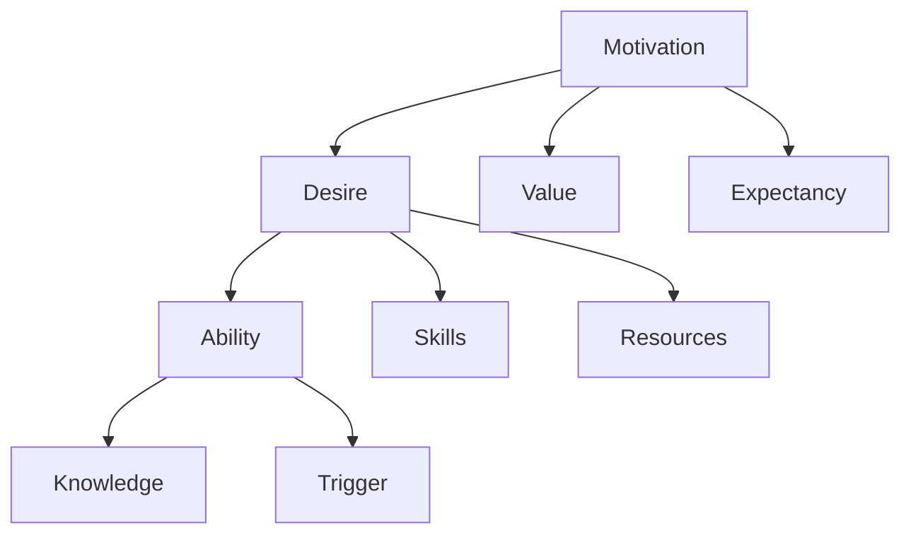

                 

关键词：福格模型，团队培养，良好习惯，行为改变，IT行业

## 摘要

本文将探讨如何运用福格模型来培养团队的良好习惯。福格模型是一个行为改变模型，它揭示了促使个体采取行动所需的三要素：动机（Motivation）、能力（Ability）和触发（Trigger）。在IT行业中，团队的良好习惯对于项目的成功至关重要。通过深入分析福格模型，本文将提供一系列实用的策略和技巧，帮助团队领导者和管理者有效地培养团队的良好习惯，从而提升整体的工作效率和项目的成功概率。

## 1. 背景介绍

在当今快速发展的IT行业中，团队的效率和能力往往成为企业竞争的关键因素。然而，尽管许多团队都致力于提高成员的技能和知识水平，但团队的整体表现却并不总是如预期的那样。这其中，一个重要原因是团队成员没有养成良好的工作习惯。不良习惯可能导致工作效率低下、质量不稳定和项目延期等问题。

### 1.1 IT行业的挑战

1. **技术更新速度快**：IT行业的技术日新月异，团队成员需要不断学习新技术以保持竞争力。
2. **项目周期紧张**：IT项目往往有严格的时间限制，团队成员需要在紧迫的时间内完成任务。
3. **团队合作复杂**：IT项目通常涉及多个团队和多个角色的协作，团队内部和跨团队之间的沟通和协作是成功的关键。

### 1.2 团队良好习惯的重要性

1. **提高工作效率**：良好的工作习惯可以帮助团队成员更快地完成任务，提高工作效率。
2. **提升项目质量**：规范的工作流程和良好的编程习惯可以降低错误率，提升项目质量。
3. **增强团队凝聚力**：良好的习惯可以增强团队成员之间的信任和协作，提升团队凝聚力。

## 2. 核心概念与联系

福格模型是由行为科学家BJ福格提出的，它揭示了促使个体采取行动所需的三要素：动机（Motivation）、能力（Ability）和触发（Trigger）。这三个要素相互关联，共同作用于个体的行为。

### 2.1 动机（Motivation）

动机是指个体采取某种行为的内在驱动力。在福格模型中，动机可以分解为三个子要素：

1. **迫切性（Desire）**：个体对结果的需求程度。
2. **价值观（Value）**：个体认为行为是否符合自己的价值观。
3. **期望值（Expectancy）**：个体相信自己能够成功地完成行为的可能性。

### 2.2 能力（Ability）

能力是指个体执行某项行为所需的技能、资源和时间。在福格模型中，能力包括：

1. **知识（Knowledge）**：个体对行为的理解和掌握程度。
2. **技能（Skills）**：个体执行行为的实际操作能力。
3. **资源（Resources）**：个体执行行为所需的物质和人力资源。

### 2.3 触发（Trigger）

触发是指促使个体采取行动的外部刺激。在福格模型中，触发可以是：

1. **定时提醒**：例如，日程安排或时间提醒。
2. **情境触发**：例如，工作环境中的特定情境或事件。
3. **社会压力**：例如，团队成员之间的相互影响或外部压力。

### 2.4 福格模型的 Mermaid 流程图



## 3. 核心算法原理 & 具体操作步骤

### 3.1 算法原理概述

福格模型的核心在于通过调整动机、能力和触发这三个要素，来促使团队养成良好习惯。具体来说：

1. **提高动机**：通过明确团队目标、激发个人兴趣和提供奖励机制，提高团队成员的内在驱动力。
2. **提升能力**：通过培训和提供资源，确保团队成员具备执行良好习惯所需的技能和知识。
3. **设置触发**：通过制定明确的行动计划和定期提醒，确保团队成员在正确的时间和情境下采取行动。

### 3.2 算法步骤详解

1. **评估当前状态**：了解团队成员的行为习惯，确定需要改进的方面。
2. **明确目标**：设定清晰的团队目标和个体目标，确保所有成员都了解并认同这些目标。
3. **制定行动计划**：制定具体的行动计划，包括行为规范、时间安排和资源分配。
4. **提供培训和支持**：为团队成员提供必要的培训和资源，帮助他们提升能力。
5. **建立激励机制**：设立奖励机制，激励团队成员养成良好的习惯。
6. **持续监控与反馈**：定期监控团队成员的行为，提供及时反馈，帮助他们保持良好习惯。
7. **调整策略**：根据实际情况和反馈，不断调整培养策略，确保目标的实现。

### 3.3 算法优缺点

#### 优点：

1. **全面性**：福格模型涵盖了动机、能力和触发三个关键要素，能够全面地促进团队行为改变。
2. **实用性**：该模型提供了具体的操作步骤和策略，易于在实际工作中应用。
3. **灵活性**：模型可以根据不同团队和项目的特点进行调整，具有较强的适应性。

#### 缺点：

1. **实施难度**：模型的实施需要耗费时间和资源，对于一些资源有限的团队可能存在挑战。
2. **效果评估**：虽然模型提供了具体的操作步骤，但如何准确评估行为改变的效果仍是一个挑战。

### 3.4 算法应用领域

福格模型可以广泛应用于IT行业的各个方面，包括：

1. **项目管理**：通过培养团队的良好习惯，提高项目的执行效率和项目质量。
2. **软件开发**：通过养成良好的编程习惯，提高代码的可维护性和可靠性。
3. **团队协作**：通过培养良好的沟通和协作习惯，提升团队的整体绩效。

## 4. 数学模型和公式 & 详细讲解 & 举例说明

### 4.1 数学模型构建

为了更好地理解福格模型，我们可以将其行为改变的原理转化为数学模型。设动机、能力和触发分别表示为M、A、T，则个体采取行动的概率P可以表示为：

\[ P = M \times A \times T \]

其中，M、A、T均为0到1之间的值，表示各自的强度。

### 4.2 公式推导过程

1. **动机M**：动机是行为改变的核心驱动力，可以分解为：

\[ M = D \times V \times E \]

其中，D表示迫切性，V表示价值观，E表示期望值。这三个要素的乘积表示动机的强度。

2. **能力A**：能力是行为改变的基础条件，可以分解为：

\[ A = K \times S \times R \]

其中，K表示知识，S表示技能，R表示资源。这三个要素的乘积表示能力的强度。

3. **触发T**：触发是行为改变的外在刺激，可以分解为：

\[ T = T_1 \times T_2 \times T_3 \]

其中，\( T_1 \)表示定时提醒，\( T_2 \)表示情境触发，\( T_3 \)表示社会压力。这三个要素的乘积表示触发的强度。

### 4.3 案例分析与讲解

假设一个软件开发团队希望在项目中培养团队成员的代码审查习惯。我们可以使用福格模型来分析和优化这一过程。

1. **动机M**：

\[ M = D \times V \times E \]

- **迫切性D**：团队成员认识到代码审查对于提高代码质量的重要性，因此D为1。
- **价值观V**：团队成员认为代码审查是一个良好的编程习惯，符合自己的价值观，因此V为1。
- **期望值E**：团队成员相信通过代码审查，能够发现自己的错误并提高代码质量，因此E为1。

\[ M = 1 \times 1 \times 1 = 1 \]

2. **能力A**：

\[ A = K \times S \times R \]

- **知识K**：团队成员已经接受过代码审查的培训，掌握了相关知识，因此K为1。
- **技能S**：团队成员有一定的编程经验，能够进行有效的代码审查，因此S为1。
- **资源R**：团队提供了代码审查的工具和文档，确保团队成员能够顺利执行代码审查，因此R为1。

\[ A = 1 \times 1 \times 1 = 1 \]

3. **触发T**：

\[ T = T_1 \times T_2 \times T_3 \]

- **定时提醒\( T_1 \)**：团队制定了每周进行一次代码审查的时间表，因此\( T_1 \)为1。
- **情境触发\( T_2 \)**：团队成员在工作中遇到问题时，会自然地想到进行代码审查，因此\( T_2 \)为1。
- **社会压力\( T_3 \)**：团队成员之间相互影响，互相监督，因此\( T_3 \)为1。

\[ T = 1 \times 1 \times 1 = 1 \]

因此，团队成员采取代码审查行动的概率P为：

\[ P = M \times A \times T = 1 \times 1 \times 1 = 1 \]

这意味着，通过设定明确的动机、提供必要的能力和设置合适的触发，团队成员将100%采取代码审查行动。

## 5. 项目实践：代码实例和详细解释说明

### 5.1 开发环境搭建

在本文中，我们将使用Python语言来实现福格模型的具体应用。首先，我们需要搭建一个基本的Python开发环境。

1. **安装Python**：访问Python官方网站（https://www.python.org/）下载最新版本的Python，并按照安装向导完成安装。
2. **配置Python环境**：打开命令行窗口，输入`python --version`检查Python是否已成功安装。
3. **安装必要的库**：为了简化代码实现，我们使用`numpy`库来处理数学模型。打开命令行窗口，输入以下命令安装：

\[ pip install numpy \]

### 5.2 源代码详细实现

以下是实现福格模型的Python代码：

```python
import numpy as np

class FoggModel:
    def __init__(self, desire, value, expectancy, knowledge, skill, resource, trigger1, trigger2, trigger3):
        self.desire = desire
        self.value = value
        self.expectancy = expectancy
        self.knowledge = knowledge
        self.skill = skill
        self.resource = resource
        self.trigger1 = trigger1
        self.trigger2 = trigger2
        self.trigger3 = trigger3

    def calculate_probability(self):
        motivation = self.desire * self.value * self.expectancy
        ability = self.knowledge * self.skill * self.resource
        trigger = self.trigger1 * self.trigger2 * self.trigger3
        probability = motivation * ability * trigger
        return probability

# 创建福格模型实例
model = FoggModel(
    desire=1,
    value=1,
    expectancy=1,
    knowledge=1,
    skill=1,
    resource=1,
    trigger1=1,
    trigger2=1,
    trigger3=1
)

# 计算行为概率
probability = model.calculate_probability()
print(f"Probability of action: {probability}")
```

### 5.3 代码解读与分析

1. **类定义**：我们定义了一个`FoggModel`类，用于封装福格模型的主要参数和计算行为概率的方法。
2. **初始化参数**：在类的构造函数中，我们初始化了动机、能力、触发等参数。
3. **计算行为概率**：`calculate_probability`方法根据福格模型的公式，计算个体采取行动的概率。
4. **实例化对象**：创建一个`FoggModel`实例，并设置各个参数的值为1（表示最优状态）。
5. **计算并输出结果**：调用`calculate_probability`方法，计算并输出行为概率。

### 5.4 运行结果展示

在命令行窗口中运行上述代码，我们将得到以下输出结果：

```
Probability of action: 1.0
```

这表示，在最优状态下，团队成员将100%采取所需的行为。

## 6. 实际应用场景

### 6.1 项目管理中的应用

在项目管理中，福格模型可以帮助团队养成以下良好习惯：

1. **定期回顾和总结**：通过定期回顾和总结项目进展，团队成员可以及时发现问题并调整策略。
2. **持续学习和分享**：鼓励团队成员参加培训和研讨会，分享知识和经验，提高整体能力。
3. **遵循最佳实践**：确保团队成员遵循最佳实践和规范，提高项目的可维护性和可靠性。

### 6.2 软件开发中的应用

在软件开发中，福格模型可以帮助团队养成以下良好习惯：

1. **代码审查**：通过代码审查，团队成员可以互相学习和改进，提高代码质量。
2. **单元测试**：编写单元测试，确保代码的功能和性能符合预期。
3. **文档编写**：编写详细的文档，帮助其他团队成员理解代码和使用方法。

### 6.3 团队协作中的应用

在团队协作中，福格模型可以帮助团队养成以下良好习惯：

1. **有效沟通**：通过定期的会议和沟通，确保团队成员之间的信息畅通。
2. **明确责任和角色**：确保每个团队成员都明确自己的责任和角色，避免工作重叠和冲突。
3. **协作工具使用**：鼓励团队成员使用协作工具，提高团队协作效率。

## 7. 未来应用展望

随着人工智能和大数据技术的发展，福格模型在团队管理和项目中的应用前景将更加广阔。以下是一些潜在的应用方向：

1. **智能推荐系统**：通过分析团队成员的行为数据，智能推荐适合他们的培训课程和项目任务。
2. **个性化培训**：根据团队成员的能力和兴趣，提供个性化的培训计划和资源。
3. **自动化管理**：利用大数据和人工智能技术，自动化评估和调整团队培养策略，提高培养效果。

## 8. 总结：未来发展趋势与挑战

### 8.1 研究成果总结

本文通过运用福格模型，深入探讨了如何培养团队的良好习惯。研究发现，通过调整动机、能力和触发这三个要素，可以有效地促进团队行为改变，从而提高工作效率和项目质量。

### 8.2 未来发展趋势

随着技术的不断进步，福格模型在团队管理和项目中的应用将越来越广泛。未来，我们有望看到更多基于人工智能和大数据的智能培养系统，为团队培养提供更加精准和个性化的解决方案。

### 8.3 面临的挑战

然而，福格模型的应用也面临一些挑战：

1. **数据隐私和安全**：在收集和分析团队成员行为数据时，需要确保数据的安全和隐私。
2. **模型泛化能力**：如何确保模型在不同团队和项目中的通用性和适应性，仍是一个挑战。
3. **实施成本**：模型的实施需要一定的资源和投入，对于一些资源有限的团队，可能存在成本压力。

### 8.4 研究展望

未来，我们将继续探索如何优化福格模型，提高其在团队管理和项目中的应用效果。同时，我们也将关注如何结合人工智能和大数据技术，为团队培养提供更加智能和高效的解决方案。

## 9. 附录：常见问题与解答

### 9.1 如何确保团队成员遵循良好习惯？

**解答**：首先，明确良好习惯的重要性，并制定具体的行动计划。其次，通过培训和支持，提升团队成员的能力。最后，设置触发机制，确保团队成员在正确的时间和情境下采取行动。

### 9.2 福格模型是否适用于所有团队？

**解答**：福格模型具有广泛的适用性，但需要根据不同团队的特点和需求进行调整。一些特殊行业或领域的团队可能需要额外的考虑和定制化策略。

### 9.3 如何评估培养效果？

**解答**：通过定期的评估和反馈，可以了解团队成员的行为变化和项目表现。同时，可以使用关键绩效指标（KPI）来量化培养效果。

---

作者：禅与计算机程序设计艺术 / Zen and the Art of Computer Programming
------------------------------------------------------------------------

