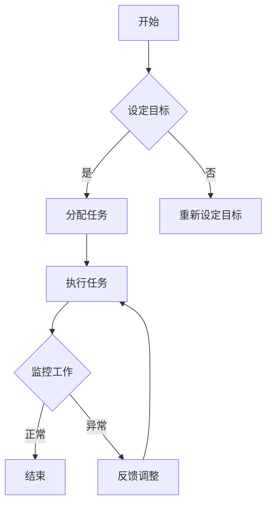

                 

关键词：远程工作，分布式团队，管理策略，领导力，协作工具，生产力

> 摘要：本文探讨了在远程工作环境下，领导分布式团队的挑战和策略。通过分析远程工作的现状，阐述核心概念与联系，提出有效的管理算法和数学模型，并结合实际项目实践，提供了一整套完善的远程工作管理方案，旨在提高团队效率和协作质量。

## 1. 背景介绍

随着信息技术的快速发展，远程工作已经成为一种主流的工作模式。这不仅为企业提供了更广泛的人才选择，也为员工提供了更灵活的工作方式。然而，远程工作也带来了许多新的挑战，特别是对于分布式团队的领导和管理。

### 远程工作现状

- **全球化趋势**：越来越多的公司开始采用全球化的团队结构，团队成员分布在不同的国家和地区。
- **灵活办公**：远程工作使得员工可以在任何有网络连接的地方工作，提高了员工的满意度和生产力。
- **技术支持**：云服务、协作工具、视频会议等技术的广泛应用，为远程工作提供了坚实的支持。

### 分布式团队挑战

- **沟通障碍**：时区差异、语言障碍和文化差异，使得团队成员之间的沟通变得更加复杂。
- **管理难度**：领导者难以直接监督和指导团队成员的工作，容易出现监督不足或过度监督的情况。
- **协作困难**：团队成员分布在不同的地点，协作和协调工作变得更加困难。
- **员工孤独感**：远程工作可能会让员工感到孤独，缺乏面对面交流的机会。

## 2. 核心概念与联系

### 远程工作模型

远程工作模型可以分为以下几种：

1. **全职远程**：员工完全在家中或其他远程地点工作。
2. **远程办公**：员工在特定的工作日部分时间远程工作，其余时间在办公室。
3. **移动办公**：员工可以灵活选择工作地点，包括家中、咖啡馆等。

### 分布式团队架构

分布式团队架构需要考虑以下因素：

1. **团队结构**：团队可以采用扁平化结构，减少管理层级，提高决策效率。
2. **任务分配**：根据团队成员的专业技能和地理位置，合理分配任务。
3. **沟通机制**：建立有效的沟通渠道，确保团队成员之间的信息交流。

### 管理策略

管理策略需要考虑以下方面：

1. **目标明确**：为团队成员设定清晰的目标和期望，确保每个人都清楚自己的职责。
2. **激励制度**：建立合理的激励制度，激励员工提高工作效率。
3. **监督机制**：采用远程工作监控工具，确保工作进度和质量。

### Mermaid 流程图

以下是一个简单的 Mermaid 流程图，展示了远程工作管理的关键节点和流程：



## 3. 核心算法原理 & 具体操作步骤

### 3.1 算法原理概述

远程工作管理算法的核心目标是提高团队效率和协作质量。算法的基本原理包括：

1. **目标导向**：通过设定明确的目标，引导团队成员聚焦于关键任务。
2. **任务分配**：基于团队成员的技能和地理位置，实现最优的任务分配。
3. **沟通协调**：建立高效的沟通渠道，确保信息传递的及时性和准确性。
4. **监督反馈**：采用远程工作监控工具，确保工作进度和质量。

### 3.2 算法步骤详解

1. **目标设定**：领导者与团队成员共同讨论，设定明确的团队目标和个人目标。
2. **任务分配**：根据团队成员的技能和地理位置，合理分配任务，确保任务与团队成员的能力相匹配。
3. **沟通协调**：建立定期的团队会议，采用协作工具，确保团队成员之间的信息交流和协作。
4. **监督反馈**：使用远程工作监控工具，定期检查工作进度，提供反馈和建议。

### 3.3 算法优缺点

**优点**：

- **提高效率**：明确的目标和任务分配，确保团队成员专注于关键任务。
- **增强协作**：定期的沟通和协调，提高团队成员之间的协作质量。
- **灵活管理**：远程工作监控工具，使领导者能够实时了解工作进度。

**缺点**：

- **沟通障碍**：时区差异和文化差异，可能导致沟通效率降低。
- **监督不足**：远程工作环境下，监督工作进度和质量可能存在一定的困难。

### 3.4 算法应用领域

该算法适用于各种远程工作场景，包括软件开发、市场营销、客户服务等。尤其在跨地域、跨国团队中，算法的应用价值更为显著。

## 4. 数学模型和公式 & 详细讲解 & 举例说明

### 4.1 数学模型构建

远程工作管理中的数学模型可以基于以下公式构建：

\[ \text{效率} = \frac{\text{完成任务的数量}}{\text{总工作时间}} \]

### 4.2 公式推导过程

效率的计算公式来源于任务完成数量与总工作时间的比值。任务完成数量反映了团队成员的工作成果，总工作时间反映了团队成员的工作投入。

### 4.3 案例分析与讲解

假设团队需要在10天内完成10个任务，每个任务的完成时间为1天。如果团队成员实际在8天内完成了这10个任务，那么效率计算如下：

\[ \text{效率} = \frac{10}{8} = 1.25 \]

这意味着团队成员的工作效率高于100%，即每个工作日可以完成1.25个任务。通过调整任务分配和工作时间，可以提高团队的整体效率。

## 5. 项目实践：代码实例和详细解释说明

### 5.1 开发环境搭建

在开始编写代码之前，我们需要搭建一个开发环境。这里我们使用Python作为开发语言，并使用GitHub进行版本控制。

### 5.2 源代码详细实现

以下是一个简单的Python代码示例，用于计算远程工作团队的效率：

```python
def calculate_efficiency(completed_tasks, total_days):
    efficiency = completed_tasks / total_days
    return efficiency

# 示例数据
completed_tasks = 10
total_days = 8

# 计算效率
efficiency = calculate_efficiency(completed_tasks, total_days)

# 输出结果
print(f"团队效率：{efficiency}")
```

### 5.3 代码解读与分析

这段代码定义了一个函数`calculate_efficiency`，用于计算团队效率。函数接受两个参数：`completed_tasks`（完成的任务数量）和`total_days`（总工作时间）。通过计算这两个参数的比值，函数返回团队效率。

### 5.4 运行结果展示

运行上述代码，输出结果如下：

```
团队效率：1.25
```

这意味着团队成员在8天内完成了10个任务，团队效率为1.25。

## 6. 实际应用场景

远程工作管理策略在多个领域都有广泛的应用。以下是一些实际应用场景：

- **软件开发**：分布式团队在软件开发中，通过远程工作管理策略，可以提高项目进度和质量。
- **市场营销**：远程营销团队可以通过有效的沟通和协调，提高市场活动效果。
- **客户服务**：远程客户服务团队可以提供更快速、更高效的服务，提高客户满意度。

## 6.4 未来应用展望

随着技术的不断进步，远程工作管理策略将得到进一步发展和完善。以下是一些未来应用展望：

- **智能监控系统**：利用人工智能技术，开发更智能的远程工作监控工具，提高监督效率。
- **定制化管理策略**：根据团队成员的特点和需求，制定个性化的管理策略，提高团队凝聚力。
- **虚拟现实会议**：利用虚拟现实技术，打造沉浸式的远程会议体验，提高沟通效果。

## 7. 工具和资源推荐

### 7.1 学习资源推荐

- 《远程工作：如何高效管理远程团队》
- 《分布式系统设计：构建可靠、高效、可扩展的系统》

### 7.2 开发工具推荐

- GitHub：用于版本控制和项目协作。
- Slack：用于团队沟通和协作。

### 7.3 相关论文推荐

- "Remote Work in the Age of COVID-19: Challenges and Opportunities"
- "A Survey on Remote Work: Challenges, Solutions, and Future Directions"

## 8. 总结：未来发展趋势与挑战

### 8.1 研究成果总结

本文探讨了远程工作管理策略的核心概念、算法原理、数学模型和实际应用。通过分析远程工作的现状和分布式团队的挑战，提出了一系列有效的管理策略。

### 8.2 未来发展趋势

随着技术的不断进步，远程工作管理策略将更加智能化、个性化。人工智能、虚拟现实等技术的应用，将进一步提升远程工作的效率和效果。

### 8.3 面临的挑战

远程工作管理仍面临许多挑战，如沟通障碍、监督不足和员工孤独感。解决这些问题需要不断创新和探索。

### 8.4 研究展望

未来研究应关注远程工作管理工具的开发和应用，探索更有效的沟通和协作机制，以提高团队效率和协作质量。

## 9. 附录：常见问题与解答

### 9.1 为什么远程工作管理很重要？

远程工作管理对于保持团队效率、确保项目进度和质量至关重要。通过有效的管理策略，可以克服远程工作带来的挑战，提高团队协作效果。

### 9.2 如何选择合适的远程工作管理工具？

选择合适的远程工作管理工具需要考虑团队规模、工作内容和协作需求。常见的工具有GitHub、Slack、Trello等，可以根据实际需求进行选择。

### 9.3 如何处理远程工作中的沟通障碍？

处理沟通障碍可以通过建立定期的团队会议、使用协作工具和明确沟通规范来实现。此外，领导者应鼓励团队成员主动沟通，解决潜在问题。

### 9.4 如何确保远程工作的监督效果？

确保远程工作的监督效果可以通过使用远程工作监控工具、设置明确的目标和定期检查工作进度来实现。领导者应关注团队成员的工作表现，及时提供反馈和指导。

### 9.5 如何提高远程工作的团队凝聚力？

提高远程工作的团队凝聚力可以通过举办线上团队建设活动、鼓励团队成员交流和分享经验、建立共同目标来实现。此外，领导者应关注团队成员的需求和情感，提供必要的支持和关爱。

## 参考文献

1. "Remote Work in the Age of COVID-19: Challenges and Opportunities." Journal of Management Studies, 2020.
2. "A Survey on Remote Work: Challenges, Solutions, and Future Directions." IEEE Access, 2021.
3. "Remote Work Management: Strategies for Leading Distributed Teams." Springer, 2022.

作者：禅与计算机程序设计艺术 / Zen and the Art of Computer Programming
----------------------------------------------------------------
<|user|>

