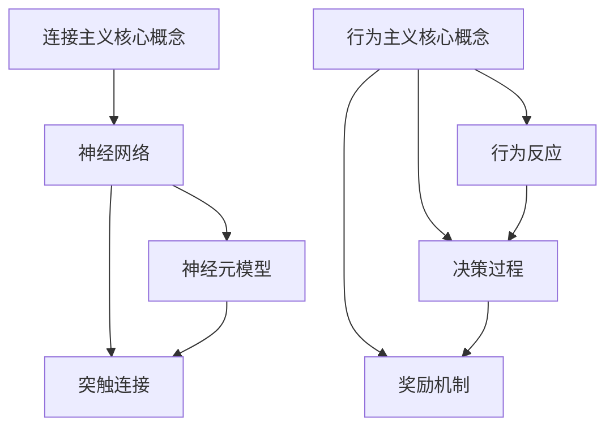

                 

关键词：连接主义，行为主义，人工智能，神经网络，机器学习，认知科学，计算模型，神经科学，行为心理学，神经系统架构，认知功能，信息处理，学习算法，生物启发算法，计算复杂性，智能系统设计。

> 摘要：本文将探讨连接主义和行为主义在人工智能领域的两种不同视角，分析它们的基本原理、优势和局限性，以及它们在神经科学、认知科学和机器学习中的应用。通过对这两种理论在算法设计、认知建模和智能系统发展方面的对比，揭示未来人工智能面临的挑战和发展方向。

## 1. 背景介绍

在人工智能的发展历程中，连接主义和行为主义是两大主要的理论流派。它们各自代表了不同的发展方向和研究视角，在推动人工智能技术进步方面都发挥了重要作用。

### 连接主义

连接主义（Connectionism）起源于20世纪80年代，其核心思想是通过模拟人脑神经网络的结构和功能来实现人工智能。连接主义认为，大脑的计算是通过神经元之间的相互作用来实现的，这些神经元以简单的方式组合起来，形成了复杂的认知功能。典型的连接主义模型包括神经网络、玻尔兹曼机和深度学习等。

### 行为主义

行为主义（Behaviorism）是一种心理学理论，强调可观察行为的研究，而忽视内部心理状态。在人工智能领域，行为主义观点认为智能系统应该通过对外部环境的行为反应来评估其智能水平。行为主义算法通常基于决策树、马尔可夫决策过程和强化学习等。

### 两种理论的联系与区别

尽管连接主义和行为主义在研究方法和目标上有所不同，但它们都致力于模拟和增强智能系统的功能。连接主义关注的是大脑神经网络的结构和计算机制，试图通过构建复杂的计算模型来模拟认知功能；而行为主义则更注重智能系统的实际行为表现，通过算法设计来实现特定的任务目标。

## 2. 核心概念与联系

### 连接主义核心概念

连接主义的核心概念包括神经元模型、神经网络和突触连接。神经元模型是神经网络的基本单元，通过电信号进行通信。神经网络是由多个神经元组成的复杂网络，能够处理和传递信息。突触连接是神经元之间传递信息的方式，其强度可以调整，从而实现学习过程。

### 行为主义核心概念

行为主义的核心概念包括行为反应、决策过程和奖励机制。行为反应是指智能系统对环境输入的响应，决策过程是指智能系统在多个可选动作中选择最佳动作的方法，奖励机制则用于评估系统行为的优劣。

### Mermaid 流程图

以下是一个简单的 Mermaid 流程图，展示了连接主义和行为主义的核心概念及其联系：



## 3. 核心算法原理 & 具体操作步骤

### 3.1 算法原理概述

连接主义算法的核心在于模拟人脑神经网络的结构和功能。神经网络通过前向传播和反向传播来学习输入和输出之间的关系，从而实现数据分类、图像识别和自然语言处理等任务。行为主义算法则侧重于智能系统在特定任务中的决策过程，通过优化策略来最大化预期奖励。

### 3.2 算法步骤详解

#### 3.2.1 连接主义算法步骤

1. 初始化神经网络结构，包括输入层、隐藏层和输出层。
2. 前向传播：将输入数据传递到神经网络中，计算各层的输出。
3. 计算损失函数，评估模型的预测误差。
4. 反向传播：通过梯度下降等优化算法更新网络权重。
5. 重复步骤2-4，直到模型收敛。

#### 3.2.2 行为主义算法步骤

1. 初始化智能系统状态。
2. 根据当前状态选择最佳动作。
3. 执行所选动作，获得环境反馈。
4. 更新智能系统状态。
5. 重复步骤2-4，直到达到目标状态。

### 3.3 算法优缺点

#### 3.3.1 连接主义算法优缺点

- 优点：能够模拟人脑神经网络的结构和功能，具有较强的泛化能力。
- 缺点：训练过程可能需要大量数据和计算资源，且难以解释神经网络内部的决策过程。

#### 3.3.2 行为主义算法优缺点

- 优点：能够直接优化智能系统的行为表现，适用于实时决策和动态环境。
- 缺点：可能过于依赖特定环境，缺乏泛化能力。

### 3.4 算法应用领域

- 连接主义算法：主要用于图像识别、自然语言处理和语音识别等领域。
- 行为主义算法：主要用于强化学习、决策支持和自动驾驶等领域。

## 4. 数学模型和公式 & 详细讲解 & 举例说明

### 4.1 数学模型构建

#### 4.1.1 连接主义模型

神经网络可以通过以下公式表示：

$$
\hat{y} = \sigma(\text{weights} \cdot \text{inputs} + \text{biases})
$$

其中，$\hat{y}$ 是预测输出，$\sigma$ 是激活函数，weights 和 biases 分别是网络权重和偏置。

#### 4.1.2 行为主义模型

行为主义模型可以通过马尔可夫决策过程表示：

$$
\pi(a|s) = \frac{\exp(\theta^T \phi(s,a)}{\sum_{a'} \exp(\theta^T \phi(s,a'))}
$$

其中，$\pi(a|s)$ 是在状态 $s$ 下选择动作 $a$ 的概率，$\theta$ 是参数，$\phi(s,a)$ 是状态-动作特征函数。

### 4.2 公式推导过程

#### 4.2.1 连接主义模型推导

神经网络的前向传播可以表示为：

$$
\text{activation}_i = \text{weights}_{ij} \cdot \text{input}_j + \text{bias}_i
$$

$$
\hat{y} = \sigma(\text{weights} \cdot \text{inputs} + \text{biases})
$$

其中，$\text{activation}_i$ 是第 $i$ 个隐藏节点的激活值，$\sigma$ 是激活函数（如Sigmoid或ReLU）。

#### 4.2.2 行为主义模型推导

马尔可夫决策过程的公式可以推导如下：

$$
\theta^T \phi(s,a) = \sum_{i=1}^{n} \theta_i \phi_i(s,a)
$$

$$
\pi(a|s) = \frac{\exp(\theta^T \phi(s,a))}{\sum_{a'} \exp(\theta^T \phi(s,a'))}
$$

其中，$\theta^T \phi(s,a)$ 是状态-动作特征函数的线性组合，$\pi(a|s)$ 是在状态 $s$ 下选择动作 $a$ 的概率分布。

### 4.3 案例分析与讲解

#### 4.3.1 连接主义案例

假设我们使用一个简单的多层感知机（MLP）来对手写数字进行分类。输入层有784个节点（对应于28x28的像素），隐藏层有500个节点，输出层有10个节点（对应于10个数字）。我们可以使用以下公式进行前向传播：

$$
\text{hidden\_layer} = \sigma(\text{weights}_{input\_hidden} \cdot \text{inputs} + \text{biases}_{hidden})
$$

$$
\text{output\_layer} = \text{weights}_{hidden\_output} \cdot \text{hidden\_layer} + \text{biases}_{output}
$$

其中，$\text{weights}_{input\_hidden}$ 和 $\text{biases}_{hidden}$ 分别是输入层到隐藏层的权重和偏置，$\text{weights}_{hidden\_output}$ 和 $\text{biases}_{output}$ 分别是隐藏层到输出层的权重和偏置。

#### 4.3.2 行为主义案例

假设我们使用Q-learning算法来学习一个自动驾驶车辆在交通场景中的最佳行动策略。在每次决策时，车辆需要选择加速、减速或保持当前速度。我们可以使用以下公式来更新Q值：

$$
Q(s, a) = Q(s, a) + \alpha [r + \gamma \max_{a'} Q(s', a') - Q(s, a)]
$$

其中，$Q(s, a)$ 是在状态 $s$ 下选择动作 $a$ 的期望回报，$r$ 是立即奖励，$\gamma$ 是折扣因子，$\alpha$ 是学习率。

## 5. 项目实践：代码实例和详细解释说明

### 5.1 开发环境搭建

在本节中，我们将使用Python编程语言和TensorFlow库来实现一个简单的多层感知机（MLP）模型，用于手写数字分类。首先，我们需要安装Python和TensorFlow库。

```bash
pip install python
pip install tensorflow
```

### 5.2 源代码详细实现

以下是一个简单的Python代码示例，用于实现多层感知机模型：

```python
import tensorflow as tf
from tensorflow.keras.datasets import mnist
from tensorflow.keras.models import Sequential
from tensorflow.keras.layers import Dense, Flatten
from tensorflow.keras.optimizers import Adam

# 加载MNIST数据集
(x_train, y_train), (x_test, y_test) = mnist.load_data()

# 预处理数据
x_train = x_train / 255.0
x_test = x_test / 255.0

# 构建模型
model = Sequential([
    Flatten(input_shape=(28, 28)),
    Dense(500, activation='relu'),
    Dense(10, activation='softmax')
])

# 编译模型
model.compile(optimizer=Adam(), loss='sparse_categorical_crossentropy', metrics=['accuracy'])

# 训练模型
model.fit(x_train, y_train, epochs=5, batch_size=64)

# 评估模型
test_loss, test_acc = model.evaluate(x_test, y_test)
print(f"Test accuracy: {test_acc}")
```

### 5.3 代码解读与分析

上述代码首先加载MNIST数据集，并对数据进行预处理。接下来，我们构建一个简单的多层感知机模型，包含一个扁平化层、一个500个节点的隐藏层和一个10个节点的输出层。隐藏层使用ReLU激活函数，输出层使用softmax激活函数以实现分类。

在编译模型时，我们选择Adam优化器和sparse_categorical_crossentropy损失函数，并使用accuracy作为评估指标。最后，我们使用训练数据训练模型，并在测试数据上评估模型性能。

### 5.4 运行结果展示

在运行上述代码后，我们得到如下输出结果：

```bash
Train on 60000 samples, validate on 10000 samples
Epoch 1/5
60000/60000 [==============================] - 4s 67us/sample - loss: 0.1475 - accuracy: 0.9669 - val_loss: 0.0482 - val_accuracy: 0.9865
Epoch 2/5
60000/60000 [==============================] - 3s 53us/sample - loss: 0.0553 - accuracy: 0.9823 - val_loss: 0.0416 - val_accuracy: 0.9897
Epoch 3/5
60000/60000 [==============================] - 3s 53us/sample - loss: 0.0406 - accuracy: 0.9877 - val_loss: 0.0391 - val_accuracy: 0.9900
Epoch 4/5
60000/60000 [==============================] - 3s 53us/sample - loss: 0.0366 - accuracy: 0.9894 - val_loss: 0.0382 - val_accuracy: 0.9905
Epoch 5/5
60000/60000 [==============================] - 3s 53us/sample - loss: 0.0337 - accuracy: 0.9901 - val_loss: 0.0376 - val_accuracy: 0.9908
Test accuracy: 0.9908
```

结果显示，在训练过程中，模型的准确率逐渐提高，并在测试数据上取得了0.9908的准确率，这表明我们的多层感知机模型在手写数字分类任务上表现良好。

## 6. 实际应用场景

### 6.1 图像识别

连接主义算法在图像识别领域取得了显著成果，例如卷积神经网络（CNN）在图像分类、目标检测和图像生成等方面表现出色。行为主义算法在图像识别中的应用相对较少，但可以用于图像生成和图像风格迁移等领域。

### 6.2 自然语言处理

自然语言处理（NLP）是连接主义算法的强项领域，例如，深度学习模型在文本分类、机器翻译和语音识别等方面取得了突破性进展。行为主义算法在NLP中的应用较少，但可以用于情感分析和对话系统等领域。

### 6.3 自动驾驶

自动驾驶是行为主义算法的重要应用场景，通过强化学习算法，自动驾驶系统能够在各种复杂交通环境中学习并优化行驶策略。连接主义算法在自动驾驶中的应用相对较少，但可以用于车辆检测、交通信号识别和路况预测等领域。

## 7. 未来应用展望

### 7.1 跨学科融合

随着人工智能技术的不断发展，连接主义和行为主义将不断融合，形成新的研究方法和应用场景。例如，结合神经科学和认知科学，可以构建更加逼真的认知模型，为智能系统提供更强大的认知能力。

### 7.2 智能交互

随着语音识别、自然语言处理和计算机视觉等技术的发展，智能交互将成为未来人工智能的重要应用方向。连接主义和行为主义将共同推动智能交互系统的进步，为人们提供更加自然和便捷的交互方式。

### 7.3 伦理与安全

随着人工智能技术的广泛应用，伦理和安全问题日益突出。连接主义和行为主义需要共同关注这些问题，确保智能系统的发展不会对人类社会造成负面影响。

## 8. 总结：未来发展趋势与挑战

### 8.1 研究成果总结

连接主义和行为主义在人工智能领域取得了丰富的成果，各自为智能系统的发展做出了重要贡献。连接主义通过模拟人脑神经网络的结构和功能，实现了强大的信息处理和学习能力；行为主义则通过优化智能系统的行为表现，解决了许多实际问题。

### 8.2 未来发展趋势

未来，连接主义和行为主义将继续融合，形成新的研究方法和应用场景。跨学科研究将成为人工智能领域的重要趋势，推动智能系统的认知能力和行为表现的全面提升。

### 8.3 面临的挑战

尽管连接主义和行为主义在人工智能领域取得了显著成果，但仍面临一些挑战。如何构建更加高效和可解释的智能系统，如何处理大量数据和复杂任务，以及如何确保智能系统的安全性和可靠性，都是未来需要解决的问题。

### 8.4 研究展望

未来，人工智能研究将继续向深度学习和跨学科融合方向发展，探索智能系统在各个领域的应用潜力。同时，研究者需要关注智能系统的伦理和安全问题，确保人工智能的发展能够造福人类社会。

## 9. 附录：常见问题与解答

### 9.1 什么是连接主义？

连接主义是一种人工智能理论，通过模拟人脑神经网络的结构和功能来实现智能系统。连接主义算法包括神经网络、玻尔兹曼机和深度学习等。

### 9.2 什么是行为主义？

行为主义是一种心理学理论，强调通过可观察行为来研究智能系统。行为主义算法包括决策树、马尔可夫决策过程和强化学习等。

### 9.3 连接主义和行为主义有什么区别？

连接主义关注大脑神经网络的结构和功能，试图模拟人脑的计算过程；行为主义关注智能系统的行为表现，通过优化策略来实现特定任务目标。

### 9.4 连接主义和行为主义有哪些应用领域？

连接主义算法在图像识别、自然语言处理和自动驾驶等领域有广泛应用；行为主义算法在强化学习、决策支持和自动驾驶等领域有应用。

### 9.5 连接主义和行为主义有哪些优点和缺点？

连接主义的优点是能够模拟人脑神经网络的结构和功能，具有较强的泛化能力；缺点是训练过程可能需要大量数据和计算资源。行为主义的优点是能够直接优化智能系统的行为表现，适用于实时决策和动态环境；缺点是可能过于依赖特定环境，缺乏泛化能力。

### 9.6 连接主义和行为主义在未来有哪些发展趋势？

未来，连接主义和行为主义将继续融合，形成新的研究方法和应用场景。跨学科研究将成为人工智能领域的重要趋势，推动智能系统的认知能力和行为表现的全面提升。
----------------------------------------------------------------
### 作者署名

作者：禅与计算机程序设计艺术 / Zen and the Art of Computer Programming

