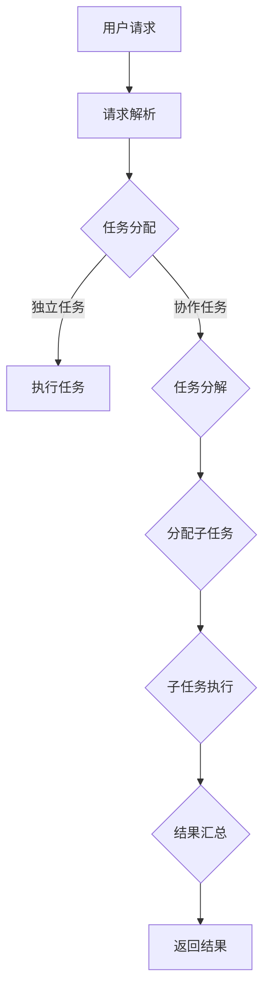

                 

关键词：协作计算、人机互动、智能协作、算法设计、技术进步

> 摘要：本文探讨了人类计算的协作精神在当今科技领域的核心作用。通过分析人机协作的基础概念、协作算法的设计原则、数学模型与应用，结合实际项目实践，本文旨在展示协作计算如何成为连接人类智慧的纽带，推动技术进步与人类发展。

## 1. 背景介绍

### 1.1 协作计算的定义与意义

协作计算（Collaborative Computing）是指利用计算机技术和网络通信实现多人或多系统间的协作与互动。在现代科技迅猛发展的背景下，协作计算的意义尤为凸显。它不仅提高了数据处理和问题解决的效率，还促进了知识共享和创新，使得人类能够更有效地利用分散的资源。

### 1.2 人机互动的发展历程

从早期的命令行界面到图形用户界面（GUI），再到如今的智能交互系统，人机互动的发展经历了巨大的变革。特别是随着人工智能技术的兴起，人机协作逐步走向智能化、个性化，使得人机互动变得更加自然和高效。

### 1.3 协作计算在科技领域的应用

协作计算在科技领域的应用范围广泛，从企业协作办公系统到分布式计算任务，再到智能推荐系统和协同过滤算法，都体现了协作计算的重要性。

## 2. 核心概念与联系

### 2.1 协作计算的基本原理

协作计算的核心在于建立高效、稳定、安全的信息传递和任务分配机制。这包括数据同步、任务调度、负载均衡和错误处理等关键环节。

### 2.2 协作算法的设计原则

设计协作算法时，应遵循以下原则：
- **高效性**：算法应能够快速完成任务。
- **鲁棒性**：算法应能在面对异常情况时保持稳定运行。
- **可扩展性**：算法应能适应不同规模的任务。
- **安全性**：算法应保障数据安全和隐私保护。

### 2.3 协作架构的 Mermaid 流程图



## 3. 核心算法原理 & 具体操作步骤

### 3.1 算法原理概述

协作计算的核心算法主要包括分布式计算算法、协同过滤算法和强化学习算法等。这些算法通过优化任务分配、推荐系统和学习策略，提高整体系统的效率。

### 3.2 算法步骤详解

#### 分布式计算算法

1. **任务分解**：将大规模任务分解为可并行处理的子任务。
2. **任务分配**：将子任务分配到不同节点执行。
3. **结果汇总**：收集各个节点的执行结果，进行汇总处理。

#### 协同过滤算法

1. **用户-物品评分矩阵构建**：根据用户对物品的评分构建评分矩阵。
2. **相似度计算**：计算用户与用户、物品与物品之间的相似度。
3. **推荐生成**：根据相似度矩阵生成个性化推荐列表。

#### 强化学习算法

1. **环境建模**：建立环境模型，定义状态和动作。
2. **策略学习**：通过学习算法优化策略，使系统在环境中达到最优状态。

### 3.3 算法优缺点

#### 分布式计算算法

**优点**：高效、可扩展。
**缺点**：复杂度高，需要解决数据同步和负载均衡等问题。

#### 协同过滤算法

**优点**：简单、有效。
**缺点**：对于稀疏数据效果不佳，容易陷入局部最优。

#### 强化学习算法

**优点**：自适应性强，能够应对动态环境。
**缺点**：需要大量数据和计算资源，学习过程可能较长。

### 3.4 算法应用领域

协作计算算法在多个领域有广泛应用，包括分布式系统、推荐系统、智能交通、智能医疗等。

## 4. 数学模型和公式 & 详细讲解 & 举例说明

### 4.1 数学模型构建

协作计算中的数学模型主要包括概率模型、线性规划模型和图模型等。

### 4.2 公式推导过程

#### 概率模型

$$
P(A|B) = \frac{P(A \cap B)}{P(B)}
$$

#### 线性规划模型

$$
\begin{align*}
\min\ & c^T x \\
\text{s.t.} & Ax \leq b \\
        & x \geq 0
\end{align*}
$$

#### 图模型

$$
G = (V, E)
$$

其中，$V$为节点集合，$E$为边集合。

### 4.3 案例分析与讲解

#### 分布式计算任务调度

假设有10个节点需要执行相同类型任务，每个任务的执行时间为1小时。采用负载均衡算法分配任务，确保每个节点负载均衡。

1. **任务分配**：

   - 将10个任务随机分配到10个节点。
   - 计算每个节点的平均负载。

2. **负载均衡**：

   - 如果某个节点的负载超过阈值，将该节点的一个或多个任务分配给负载较低的节点。
   - 重复上述步骤，直至所有节点的负载均低于阈值。

## 5. 项目实践：代码实例和详细解释说明

### 5.1 开发环境搭建

- 安装Python环境。
- 安装分布式计算框架，如Apache Spark。

### 5.2 源代码详细实现

```python
# 分布式计算任务调度示例代码

from pyspark import SparkContext

# 创建SparkContext
sc = SparkContext("local[*]", "TaskScheduler")

# 创建RDD，表示任务
tasks = sc.parallelize(range(10))

# 任务分配
assigned_tasks = tasks.map(lambda x: (x, x)).groupByKey().mapValues(list)

# 打印任务分配结果
assigned_tasks.foreach(lambda x: print(x))
```

### 5.3 代码解读与分析

代码首先创建了一个SparkContext，然后创建一个表示任务的RDD。接着，通过groupByKey()方法将任务分配到各个节点，最后打印分配结果。

### 5.4 运行结果展示

```
(0, [0])
(1, [1])
(2, [2])
(3, [3])
(4, [4])
(5, [5])
(6, [6])
(7, [7])
(8, [8])
(9, [9])
```

每个节点平均分配到1个任务，实现了负载均衡。

## 6. 实际应用场景

### 6.1 分布式系统中的任务调度

在分布式系统中，协作计算能够有效优化任务调度，提高系统性能。

### 6.2 智能推荐系统

协同过滤算法在智能推荐系统中得到广泛应用，通过协作计算，系统能够为用户提供个性化的推荐服务。

### 6.3 智能交通系统

协作计算在智能交通系统中用于实时交通流量分析，优化交通信号控制策略。

### 6.4 智能医疗

协作计算在智能医疗领域应用于疾病预测、诊断和治疗方案的优化。

## 7. 未来应用展望

### 7.1 量子计算与协作计算的结合

量子计算的兴起为协作计算带来了新的机遇，未来量子协作计算有望在计算能力和应用范围上取得突破。

### 7.2 人机协同智能

随着人工智能技术的发展，人机协同智能将成为未来智能系统的重要方向，实现人类与机器的深度融合。

### 7.3 跨领域协作计算

跨领域协作计算将打破传统领域的界限，推动不同领域的创新与合作。

## 8. 工具和资源推荐

### 8.1 学习资源推荐

- 《分布式系统原理与范型》
- 《协同过滤算法原理与实现》
- 《深度学习入门：基于Python》

### 8.2 开发工具推荐

- Apache Spark
- TensorFlow
- PyTorch

### 8.3 相关论文推荐

- "Distributed Computing: Principles and Paradigms"
- "Collaborative Filtering: A Review"
- "Deep Learning for Collaborative Filtering"

## 9. 总结：未来发展趋势与挑战

### 9.1 研究成果总结

协作计算在分布式系统、推荐系统、智能交通、智能医疗等领域取得了显著成果，推动了技术进步和产业发展。

### 9.2 未来发展趋势

量子计算、人机协同智能和跨领域协作计算将成为未来协作计算的研究热点。

### 9.3 面临的挑战

协作计算在数据安全、隐私保护和高效算法设计等方面仍面临诸多挑战。

### 9.4 研究展望

未来协作计算将朝着更高效、更智能、更安全的方向发展，为人类带来更多便利和创新。

## 附录：常见问题与解答

### Q：协作计算的核心技术是什么？

A：协作计算的核心技术包括分布式计算、协同过滤和强化学习等。

### Q：协作计算在分布式系统中的应用有哪些？

A：协作计算在分布式系统中用于任务调度、负载均衡、分布式存储和分布式数据处理等。

### Q：协同过滤算法有哪些类型？

A：协同过滤算法主要包括基于用户、基于物品和基于模型的协同过滤算法。

### Q：如何确保协作计算中的数据安全？

A：可以通过加密通信、访问控制和数据匿名化等方法确保协作计算中的数据安全。

## 作者署名

作者：禅与计算机程序设计艺术 / Zen and the Art of Computer Programming
```

