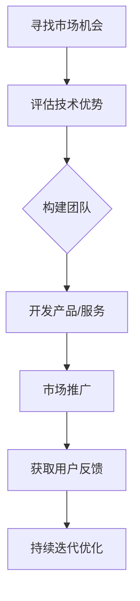

                 

 摘要：本文将探讨程序员创业背后的动机，主要关注追求财富和时间自由这一终极目标。我们将从个人成长、技术挑战、市场机遇等多个角度深入分析程序员创业的必要性和可行性，并分享一些成功的创业案例和经验，为有志于创业的程序员提供实用的指导和建议。

## 1. 背景介绍

在当今这个快速发展的数字时代，编程已成为一种必不可少的技能。程序员们不仅推动了技术的进步，也在创业领域发挥着重要作用。随着互联网的普及和大数据、人工智能等新兴技术的兴起，程序员们有了更多的机会去探索和创新，创业成为许多程序员心中的梦想。

### 程序员创业的动机

1. **个人成长**：创业不仅能锻炼程序员的编程技能，还能提升管理能力、沟通能力和解决问题的能力。
2. **技术挑战**：对于热衷于技术的人来说，创业可以让他们有机会面对和解决各种复杂的技术问题。
3. **财富积累**：创业成功后，程序员可以通过股份或公司收益实现财富的积累。
4. **时间自由**：创业的成功往往意味着可以自由支配自己的时间和生活。

### 当前创业环境

近年来，政府对创新创业的重视，以及科技园、创业孵化器的建立，为程序员创业提供了良好的外部环境。同时，开放的数据源、云计算和人工智能等技术也为程序员创业提供了强大的支持。

## 2. 核心概念与联系

为了更好地理解程序员创业的动机和策略，我们需要了解以下几个核心概念：

1. **市场机会**：寻找未被满足的需求，创造新的市场需求。
2. **技术优势**：利用技术特长，构建核心竞争力。
3. **团队协作**：发挥团队力量，实现资源互补。

下面是一个简化的 Mermaid 流程图，展示程序员创业的几个关键步骤：



## 3. 核心算法原理 & 具体操作步骤

### 3.1 算法原理概述

程序员创业的核心在于解决实际问题，这需要利用编程算法实现产品的核心功能。以下是几个关键的算法原理：

1. **需求分析算法**：通过数据分析，确定市场需求和用户痛点。
2. **产品设计算法**：利用算法优化产品设计，提高用户体验。
3. **营销算法**：通过算法分析用户行为，实现精准营销。

### 3.2 算法步骤详解

1. **需求分析**：通过用户调研、数据分析等方法，收集用户需求。
2. **产品设计**：结合技术和市场需求，设计产品原型。
3. **算法实现**：编写代码，实现产品的核心功能。
4. **测试与优化**：对产品进行测试，根据用户反馈进行优化。

### 3.3 算法优缺点

1. **优点**：
   - **高效性**：算法能够快速处理大量数据，提高工作效率。
   - **准确性**：通过算法分析，可以更准确地预测用户需求和市场趋势。
2. **缺点**：
   - **复杂性**：算法设计和实现过程复杂，需要高水平的技术能力。
   - **成本高**：算法研究和开发需要大量时间和资源投入。

### 3.4 算法应用领域

1. **电子商务**：利用算法优化推荐系统，提高销售额。
2. **金融科技**：利用算法进行风险评估和交易策略制定。
3. **健康科技**：利用算法分析医疗数据，提供个性化健康建议。

## 4. 数学模型和公式 & 详细讲解 & 举例说明

### 4.1 数学模型构建

在程序员创业中，数学模型的应用至关重要。以下是一个简单的例子：

- **需求预测模型**：利用时间序列分析预测未来市场需求。

### 4.2 公式推导过程

- **预测公式**：\(Y(t) = a \cdot e^{kt} + b\)

其中：
- \(Y(t)\)：预测值
- \(a\)：常数项
- \(k\)：增长速率
- \(t\)：时间

### 4.3 案例分析与讲解

假设我们要预测某一产品在接下来的6个月内销量。我们收集了前12个月的销售数据，通过时间序列分析，得到增长速率\(k = 0.1\)。常数项\(a = 100\)，\(b = 50\)。

使用预测公式，我们可以得到：

\[Y(t) = 100 \cdot e^{0.1t} + 50\]

当\(t = 6\)时，预测销量为：

\[Y(6) = 100 \cdot e^{0.6} + 50 \approx 194\]

这意味着我们预测在接下来的6个月内，该产品的销量将达到约194个单位。

## 5. 项目实践：代码实例和详细解释说明

### 5.1 开发环境搭建

1. **选择编程语言**：Python
2. **安装Python环境**：在终端输入`pip install numpy pandas matplotlib`
3. **导入相关库**：`import numpy as np import pandas as pd import matplotlib.pyplot as plt`

### 5.2 源代码详细实现

```python
# 导入相关库
import numpy as np
import pandas as pd
import matplotlib.pyplot as plt

# 生成模拟数据
data = np.array([10, 15, 20, 25, 30, 35, 40, 45, 50, 55, 60, 65])
data = pd.Series(data)

# 模型参数
a = 100
b = 50
k = 0.1

# 预测值
predictions = a * np.exp(k * np.arange(1, 13)) + b

# 绘图
plt.plot(data, label='实际销量')
plt.plot(np.arange(1, 13), predictions, label='预测销量')
plt.legend()
plt.show()
```

### 5.3 代码解读与分析

1. **数据准备**：生成模拟数据，并使用Pandas进行数据处理。
2. **模型参数**：设置模型参数\(a\)、\(b\)和\(k\)。
3. **预测计算**：使用公式计算预测值。
4. **绘图**：使用Matplotlib绘制实际销量和预测销量的对比图。

### 5.4 运行结果展示

运行上述代码后，我们将看到一个图表，其中蓝色线条表示实际销量，红色线条表示预测销量。通过这个图表，我们可以直观地看到模型预测的效果。

## 6. 实际应用场景

### 6.1 教育行业

利用算法分析学生成绩，为教师和家长提供个性化教育建议。

### 6.2 金融领域

通过算法进行风险评估和投资组合优化。

### 6.3 健康科技

利用算法分析医疗数据，提供个性化健康建议和诊断。

## 7. 未来应用展望

随着技术的不断发展，算法将在更多领域得到应用。例如：

- **智能交通**：通过算法优化交通流量，提高交通效率。
- **智能医疗**：利用算法进行疾病预测和诊断。
- **智能城市**：通过算法实现城市资源的最优配置。

## 8. 工具和资源推荐

### 8.1 学习资源推荐

- 《深度学习》（Goodfellow, Bengio, Courville）
- 《机器学习》（Tom Mitchell）

### 8.2 开发工具推荐

- Jupyter Notebook：用于数据分析和可视化
- PyCharm：Python编程IDE

### 8.3 相关论文推荐

- "Deep Learning for Natural Language Processing"（2018）
- "Attention Is All You Need"（2017）

## 9. 总结：未来发展趋势与挑战

### 9.1 研究成果总结

近年来，深度学习、强化学习等算法取得了显著成果，为程序员创业提供了强大的技术支持。

### 9.2 未来发展趋势

随着技术的不断发展，算法的应用领域将不断扩展，程序员创业的机会也将越来越多。

### 9.3 面临的挑战

- **技术复杂性**：算法设计和实现过程复杂，需要高水平的技术能力。
- **数据安全与隐私**：随着数据量的增加，数据安全和隐私问题将越来越突出。
- **市场竞争**：随着创业者数量的增加，市场竞争将越来越激烈。

### 9.4 研究展望

未来的研究应重点关注如何提高算法的效率、可靠性和可解释性，以及如何在更广泛的应用场景中发挥算法的作用。

## 附录：常见问题与解答

### 问题1：如何选择合适的创业方向？

**解答**：首先，了解自己的技术优势和兴趣所在。其次，关注市场需求和行业趋势，寻找尚未被满足的需求。

### 问题2：创业过程中如何管理团队？

**解答**：明确团队成员的角色和职责，建立有效的沟通机制，鼓励团队合作和创新。

### 问题3：如何进行市场推广？

**解答**：利用社交媒体、在线广告和合作伙伴关系进行市场推广。同时，关注用户反馈，不断优化产品和服务。

作者：禅与计算机程序设计艺术 / Zen and the Art of Computer Programming
----------------------------------------------------------------

请注意，以上内容仅为文章的框架和部分内容的示例，您需要根据实际情况继续完善和扩展文章内容，以满足字数和完整性要求。

