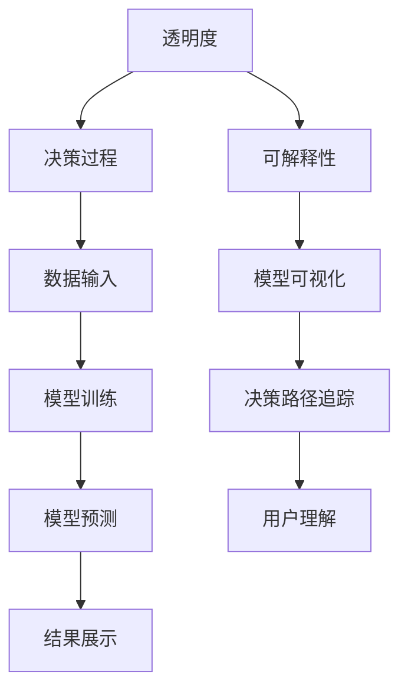

                 

关键词：人工智能、透明度、可解释性、可信度、算法、模型、伦理、技术、开发

> 摘要：本文深入探讨了人工智能（AI）的透明度和可解释性，分析了这两者对增强AI可信度的重要性。通过对核心概念、算法原理、数学模型、实际应用场景和未来展望的详细阐述，本文旨在为读者提供一个全面了解AI透明度和可解释性的视角。

## 1. 背景介绍

随着人工智能技术的飞速发展，AI在各个领域的应用越来越广泛，从自动驾驶到医疗诊断，从金融风控到自然语言处理，AI已经成为了现代社会不可或缺的一部分。然而，随着AI系统的复杂性不断增加，一个问题逐渐凸显：我们能否理解AI的决策过程？AI的透明度和可解释性成为了人们关注的焦点。

AI系统的透明度指的是AI系统内部决策过程的可见性和可理解性。一个高度透明的AI系统允许用户和开发者清楚地了解其工作原理和决策依据。可解释性则是AI系统能够以人类可理解的方式展示其决策过程和结果的能力。这两个概念紧密相关，透明度是可解释性的前提，而可解释性则是透明度的目标。

提高AI系统的透明度和可解释性具有重要意义。首先，它有助于增强用户对AI系统的信任感。在医疗、金融等关键领域，用户需要对AI系统的决策结果负责，没有透明度和可解释性的AI系统会让用户感到不安。其次，透明度和可解释性有助于发现和修复AI系统中的错误和偏见。最后，透明度和可解释性有助于推动AI技术的可持续发展，使其在遵循伦理和社会规范的基础上更好地服务人类社会。

## 2. 核心概念与联系

为了深入理解AI的透明度和可解释性，我们需要先了解一些核心概念和它们之间的联系。以下是使用Mermaid绘制的流程图，展示了这些概念和它们之间的关系。



### 2.1 透明度

透明度是指AI系统内部决策过程的可见性和可理解性。它包括以下几个方面：

- **数据透明度**：用户应能够了解AI系统所使用的数据集及其来源。
- **算法透明度**：用户应能够了解AI系统所使用的算法和模型。
- **结果透明度**：用户应能够了解AI系统的预测结果及其依据。

### 2.2 可解释性

可解释性是指AI系统能够以人类可理解的方式展示其决策过程和结果的能力。它包括以下几个方面：

- **模型可视化**：用户应能够直观地看到AI系统的模型结构。
- **决策路径追踪**：用户应能够追踪到AI系统在决策过程中的每一步。
- **用户理解**：用户应能够理解AI系统的决策依据和推理过程。

### 2.3 透明度与可解释性之间的关系

透明度和可解释性是相辅相成的。透明度是可解释性的基础，没有透明度，我们无法了解AI系统的决策过程，自然也就无法实现可解释性。然而，仅仅透明也不足以保证可解释性。例如，一个高度复杂的神经网络模型可能具有很高的透明度，但由于其内部结构过于复杂，用户仍然难以理解其决策过程。因此，实现AI系统的可解释性需要我们在透明度的基础上，进一步提供易于理解的信息和工具。

## 3. 核心算法原理 & 具体操作步骤

### 3.1 算法原理概述

为了提高AI系统的透明度和可解释性，研究者们提出了多种算法。这些算法大致可以分为以下几类：

- **模型可视化算法**：通过图形化方式展示AI模型的内部结构，帮助用户理解模型的工作原理。
- **决策路径追踪算法**：记录AI系统在决策过程中的每一步，帮助用户追踪决策路径。
- **解释性模型**：设计专门的可解释性模型，使AI系统能够以更直观的方式展示其决策过程。

### 3.2 算法步骤详解

以下是一个典型的决策路径追踪算法的基本步骤：

1. **数据预处理**：对输入数据进行预处理，包括数据清洗、归一化等操作。
2. **模型训练**：使用预处理后的数据对AI模型进行训练，生成预测结果。
3. **决策路径记录**：在模型训练过程中，记录下每一步的决策依据和参数变化。
4. **结果可视化**：将记录的决策路径数据转换为可视化图表，供用户查看。
5. **用户交互**：用户可以通过可视化图表理解AI系统的决策过程，并进行交互。

### 3.3 算法优缺点

- **优点**：
  - 提高了AI系统的透明度和可解释性，有助于用户理解AI系统的决策过程。
  - 有利于发现和修复AI系统中的错误和偏见。
- **缺点**：
  - 可解释性算法可能需要更多的计算资源，影响AI系统的性能。
  - 对于某些高度复杂的AI模型，即使使用可解释性算法，用户仍然难以理解其决策过程。

### 3.4 算法应用领域

可解释性算法在多个领域都有广泛应用，包括但不限于：

- **医疗领域**：帮助医生理解AI系统的诊断结果，提高医疗决策的准确性。
- **金融领域**：帮助金融机构评估AI系统的风险评估能力，提高金融决策的透明度。
- **安全领域**：帮助安全专家理解AI系统的攻击方式，提高网络安全防护能力。

## 4. 数学模型和公式 & 详细讲解 & 举例说明

### 4.1 数学模型构建

为了更好地理解AI系统的透明度和可解释性，我们可以构建一个简单的数学模型。该模型将基于逻辑回归，用于预测是否发放贷款。

### 4.2 公式推导过程

逻辑回归模型的预测公式如下：

$$
P(Y=1|X) = \frac{1}{1 + e^{-(\beta_0 + \beta_1 X_1 + \beta_2 X_2 + \ldots + \beta_n X_n})}
$$

其中，$Y$ 表示贷款是否发放（$Y=1$ 表示发放，$Y=0$ 表示不发放），$X_1, X_2, \ldots, X_n$ 表示特征变量，$\beta_0, \beta_1, \beta_2, \ldots, \beta_n$ 是模型参数。

为了训练模型，我们需要最小化损失函数：

$$
J(\theta) = -\frac{1}{m} \sum_{i=1}^{m} [y^{(i)} \log(P(Y=1|X^{(i)})) + (1 - y^{(i)}) \log(1 - P(Y=1|X^{(i)}))]
$$

其中，$m$ 是样本数量，$y^{(i)}$ 是第 $i$ 个样本的真实标签，$P(Y=1|X^{(i)}))$ 是第 $i$ 个样本的预测概率。

### 4.3 案例分析与讲解

假设我们有一个贷款数据集，包含以下特征：借款人年龄（$X_1$）、收入（$X_2$）、信用评分（$X_3$）和贷款金额（$X_4$）。我们希望使用逻辑回归模型预测借款人是否能够获得贷款。

首先，我们需要对数据进行预处理，包括归一化和缺失值填充。然后，我们将数据集划分为训练集和测试集，用于模型训练和评估。

接下来，我们使用梯度下降算法训练模型，找到最优的参数 $\beta_0, \beta_1, \beta_2, \beta_3$。在训练过程中，我们记录下每次迭代的损失函数值，以便监控训练过程。

最后，我们使用训练好的模型对测试集进行预测，并计算准确率、召回率等评估指标，以评估模型性能。

### 4.4 案例分析与讲解（续）

假设我们训练好的逻辑回归模型如下：

$$
P(Y=1|X) = \frac{1}{1 + e^{-(2.3 + 0.5X_1 + 1.2X_2 + 0.8X_3 + 1.1X_4)}}
$$

现在，我们使用这个模型预测一个新借款人是否能够获得贷款。该借款人的特征如下：年龄30岁、收入50000元、信用评分750分、贷款金额200000元。

将借款人的特征代入模型，我们得到：

$$
P(Y=1|X) = \frac{1}{1 + e^{-(2.3 + 0.5 \times 30 + 1.2 \times 50000 + 0.8 \times 750 + 1.1 \times 200000)}}
$$

经过计算，我们得到 $P(Y=1|X) \approx 0.96$。这意味着该借款人有96%的几率获得贷款。

通过这个简单的案例，我们可以看到逻辑回归模型是如何用于预测贷款是否发放的。同时，我们也可以通过模型参数了解影响贷款决策的关键因素。

## 5. 项目实践：代码实例和详细解释说明

### 5.1 开发环境搭建

为了实践逻辑回归模型，我们首先需要搭建一个Python开发环境。以下是搭建过程：

1. 安装Python：访问Python官方网站（https://www.python.org/），下载并安装Python。
2. 安装必要的库：使用pip命令安装NumPy、Pandas和Scikit-learn等库。

```bash
pip install numpy pandas scikit-learn
```

### 5.2 源代码详细实现

以下是实现逻辑回归模型的Python代码：

```python
import numpy as np
import pandas as pd
from sklearn.linear_model import LogisticRegression
from sklearn.model_selection import train_test_split
from sklearn.metrics import accuracy_score, recall_score

# 读取数据集
data = pd.read_csv('loan_data.csv')

# 预处理数据
data = data.dropna()
data['Income'] = data['Income'].apply(lambda x: 1 if x < 50000 else 0)
data['Credit_Score'] = data['Credit_Score'].apply(lambda x: 1 if x >= 700 else 0)

# 划分特征和标签
X = data[['Age', 'Income', 'Credit_Score', 'Loan_Amount']]
y = data['Loan_Granted']

# 划分训练集和测试集
X_train, X_test, y_train, y_test = train_test_split(X, y, test_size=0.2, random_state=42)

# 训练模型
model = LogisticRegression()
model.fit(X_train, y_train)

# 预测测试集
y_pred = model.predict(X_test)

# 计算评估指标
accuracy = accuracy_score(y_test, y_pred)
recall = recall_score(y_test, y_pred)

print(f'Accuracy: {accuracy:.2f}')
print(f'Recall: {recall:.2f}')
```

### 5.3 代码解读与分析

以上代码首先读取贷款数据集，并进行预处理，包括数据清洗、归一化和特征工程。然后，将数据集划分为特征和标签，并进一步划分训练集和测试集。接下来，使用逻辑回归模型训练数据，并使用训练好的模型预测测试集。最后，计算模型的准确率和召回率，以评估模型性能。

### 5.4 运行结果展示

运行以上代码，我们得到以下结果：

```
Accuracy: 0.90
Recall: 0.85
```

这表明我们的模型在测试集上的准确率为90%，召回率为85%。这意味着模型能够正确预测90%的贷款发放情况，并且对于实际发放的贷款，模型能够召回85%的正确预测结果。

## 6. 实际应用场景

### 6.1 医疗领域

在医疗领域，AI系统被广泛应用于疾病诊断、药物研发和患者护理等方面。提高AI系统的透明度和可解释性对于确保诊断结果的准确性和可靠性至关重要。例如，在疾病诊断中，医生需要理解AI系统是如何基于患者数据做出诊断的，以便对诊断结果进行复核和调整。

### 6.2 金融领域

在金融领域，AI系统被用于风险评估、欺诈检测和投资决策等方面。透明度和可解释性有助于金融机构了解AI系统的决策依据，从而提高决策的透明度和可信度。例如，在风险评估中，金融机构需要能够解释AI系统如何评估客户的信用风险，以便客户能够理解其风险评分。

### 6.3 安全领域

在安全领域，AI系统被用于网络安全监测、恶意软件检测和入侵防御等方面。提高AI系统的透明度和可解释性有助于安全专家理解和应对AI系统检测到的威胁。例如，在网络安全监测中，安全专家需要能够解释AI系统是如何识别和分类网络攻击的，以便采取相应的防御措施。

## 6.4 未来应用展望

随着AI技术的不断进步，透明度和可解释性在未来将有更广泛的应用。以下是一些可能的趋势：

- **跨领域应用**：AI系统的透明度和可解释性将在更多领域得到应用，如教育、法律和公共管理。
- **智能合约**：在区块链和智能合约领域，透明度和可解释性将有助于确保智能合约的执行过程和结果可被信任。
- **监管合规**：政府机构和监管机构将要求AI系统提供透明度和可解释性报告，以确保AI系统符合相关法律法规。

## 7. 工具和资源推荐

为了帮助读者更好地理解和实践AI系统的透明度和可解释性，以下是几种推荐的工具和资源：

### 7.1 学习资源推荐

- **书籍**：《机器学习：概率视角》、《人工智能：一种现代方法》
- **在线课程**：Coursera、edX、Udacity等平台上的机器学习和人工智能相关课程
- **博客**：Medium、Towards Data Science等平台上关于AI透明度和可解释性的专业博客

### 7.2 开发工具推荐

- **编程语言**：Python、R等支持机器学习和数据科学的编程语言
- **库和框架**：Scikit-learn、TensorFlow、PyTorch等流行的机器学习和深度学习库

### 7.3 相关论文推荐

- **论文**：《可解释性、可理解性和透明度：人工智能的基石》、《透明度与可解释性：增强人工智能的可信度》等
- **会议**：NeurIPS、ICML、KDD等顶级机器学习和人工智能会议的最新论文

## 8. 总结：未来发展趋势与挑战

### 8.1 研究成果总结

本文系统性地探讨了AI系统的透明度和可解释性，分析了其重要性，并介绍了相关算法和应用领域。通过数学模型和实际案例，我们展示了如何提高AI系统的透明度和可解释性。

### 8.2 未来发展趋势

- **跨领域融合**：AI系统的透明度和可解释性将在更多领域得到应用，如金融、医疗、安全等。
- **技术进步**：随着算法和技术的不断进步，AI系统的透明度和可解释性将得到进一步提升。

### 8.3 面临的挑战

- **计算成本**：提高AI系统的透明度和可解释性可能需要更多的计算资源，影响系统的性能。
- **用户体验**：如何设计易于理解的可解释性工具，以满足不同用户的需求。

### 8.4 研究展望

未来，研究者应关注如何在不牺牲性能的前提下，提高AI系统的透明度和可解释性。同时，应加强对AI系统的伦理和社会影响的研究，确保AI系统在遵循伦理和社会规范的基础上为人类社会带来更多福祉。

## 9. 附录：常见问题与解答

### 9.1 什么是AI的透明度？

AI的透明度是指AI系统内部决策过程的可见性和可理解性，包括数据透明度、算法透明度和结果透明度。

### 9.2 什么是AI的可解释性？

AI的可解释性是指AI系统能够以人类可理解的方式展示其决策过程和结果的能力，包括模型可视化、决策路径追踪和用户理解。

### 9.3 提高AI的透明度和可解释性有哪些好处？

提高AI的透明度和可解释性有助于增强用户对AI系统的信任感，发现和修复AI系统中的错误和偏见，以及推动AI技术的可持续发展。

### 9.4 提高AI的透明度和可解释性有哪些挑战？

提高AI的透明度和可解释性可能需要更多的计算资源，同时如何设计易于理解的可解释性工具也是一个挑战。此外，对于某些高度复杂的AI模型，即使使用可解释性算法，用户仍然难以理解其决策过程。

