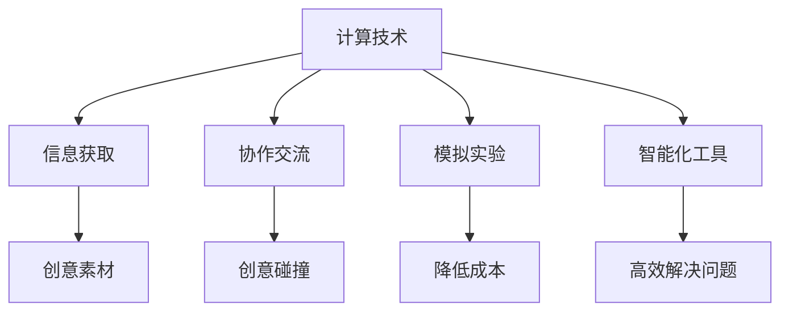

                 

 关键词：计算、创造力、算法、技术、创新

> 摘要：本文深入探讨了计算技术与人类创造力之间的密切关系，阐述了计算技术如何作为解放人类思想、激发创新活力的源泉。通过对核心概念、算法原理、数学模型、实践案例的详细分析，揭示了计算技术在各个领域的广泛应用及其未来发展趋势和面临的挑战。

## 1. 背景介绍

计算技术，作为现代科技的基石，已经渗透到我们生活的方方面面。从计算机科学、人工智能，到大数据处理、量子计算，计算技术的不断进步极大地改变了我们的生产方式、生活方式和社会结构。然而，在享受计算技术带来便利的同时，我们也不应忽视其深层次的影响——计算技术正在成为释放人类创造力的源泉。

人类创造力是人类文明进步的重要驱动力。从早期的火和轮子，到现代的互联网和人工智能，人类始终在不断地创新和探索。然而，创造力并非无源之水，它需要一定的资源和环境来激发。计算技术，作为一种强大的工具，正为人类创造力的释放提供了新的可能性。

本文将围绕计算技术与人类创造力之间的关系展开讨论，探讨计算技术如何成为解放人类思想、激发创新活力的源泉。通过分析核心概念、算法原理、数学模型和实践案例，我们将深入理解计算技术的魅力，并展望其未来的发展趋势和挑战。

## 2. 核心概念与联系

### 2.1 计算机科学的基本概念

计算机科学是研究计算机及其应用的科学。它涉及算法、数据结构、编程语言、软件工程等多个领域。算法是计算机科学的核心概念之一，它是一系列解决问题的指令集合。数据结构则是组织和存储数据的方式，对算法的性能有着重要影响。编程语言是用于编写算法的工具，而软件工程则是将算法转化为可执行软件的过程。

### 2.2 人工智能与机器学习

人工智能（AI）是计算机科学的一个分支，旨在使计算机具备模拟人类智能的能力。机器学习（ML）是人工智能的一个重要子领域，通过数据驱动的方式，使计算机能够从经验中学习和改进。深度学习（DL）是机器学习的一个分支，通过多层神经网络模拟人类大脑的学习过程，取得了许多突破性的成果。

### 2.3 大数据处理与云计算

大数据处理是指对大规模数据集进行处理和分析的方法和技术。云计算则是通过互联网提供计算资源的服务，使计算资源变得灵活和可扩展。大数据处理与云计算的结合，为企业和科研机构提供了强大的数据处理能力，促进了数据驱动的创新。

### 2.4 计算技术与人类创造力的关系

计算技术为人类创造力的释放提供了以下几个方面的支持：

- **信息获取和处理**：计算技术使人们能够快速获取和处理大量信息，为创新提供了丰富的素材。
- **协作和交流**：互联网和社交媒体使人们能够随时随地交流想法，促进了创意的碰撞和融合。
- **模拟和实验**：计算模拟和虚拟实验技术使人们能够在虚拟环境中探索和验证创意，降低了创新的成本和风险。
- **智能化工具**：人工智能和机器学习算法为人类提供了智能化的工具，使人们能够更加高效地解决问题和发现新的机会。

### 2.5 Mermaid 流程图



## 3. 核心算法原理 & 具体操作步骤

### 3.1 算法原理概述

本节将介绍几种核心算法的原理，包括排序算法、搜索算法、机器学习算法等。这些算法在计算技术中扮演着重要角色，是释放人类创造力的重要工具。

#### 3.1.1 排序算法

排序算法是一类用于对数据进行排序的算法。常见的排序算法包括冒泡排序、快速排序、归并排序等。这些算法的核心思想是通过比较和交换数据项，使数据按照某种顺序排列。

#### 3.1.2 搜索算法

搜索算法用于在数据集合中查找特定元素。常见的搜索算法包括线性搜索、二分搜索等。这些算法的核心思想是根据特定规则，逐步缩小搜索范围，直至找到目标元素。

#### 3.1.3 机器学习算法

机器学习算法是一类通过数据学习规律并做出预测的算法。常见的机器学习算法包括决策树、支持向量机、神经网络等。这些算法的核心思想是通过训练数据集，构建出一个模型，并用这个模型对新的数据进行预测。

### 3.2 算法步骤详解

#### 3.2.1 排序算法

以快速排序为例，其基本步骤如下：

1. 选择一个基准元素。
2. 将比基准元素小的元素移动到基准元素左侧，比基准元素大的元素移动到右侧。
3. 递归地对左侧和右侧子序列进行快速排序。

#### 3.2.2 搜索算法

以二分搜索为例，其基本步骤如下：

1. 确定搜索区间。
2. 计算区间的中点。
3. 如果目标元素等于中点元素，搜索成功；如果目标元素小于中点元素，则在左侧区间继续搜索；如果目标元素大于中点元素，则在右侧区间继续搜索。
4. 重复步骤2和3，直至找到目标元素或搜索区间为空。

#### 3.2.3 机器学习算法

以决策树为例，其基本步骤如下：

1. 选择一个特征进行划分。
2. 根据划分结果，将数据集划分为子集。
3. 对每个子集，重复步骤1和2，直至满足停止条件（如达到最大深度或每个子集的元素数量少于某个阈值）。
4. 构建出一棵决策树模型。

### 3.3 算法优缺点

#### 3.3.1 排序算法

- 冒泡排序：
  - 优点：简单易懂，易于实现。
  - 缺点：效率低，不适合大数据量。
- 快速排序：
  - 优点：平均时间复杂度低，适合大数据量。
  - 缺点：最坏情况下时间复杂度高，需要额外空间存储递归栈。

#### 3.3.2 搜索算法

- 线性搜索：
  - 优点：简单易懂，适用于小数据量。
  - 缺点：效率低，时间复杂度为O(n)。
- 二分搜索：
  - 优点：效率高，时间复杂度为O(log n)。
  - 缺点：需要数据有序，不适用于动态数据集。

#### 3.3.3 机器学习算法

- 决策树：
  - 优点：直观易懂，易于解释。
  - 缺点：容易过拟合，需要大量训练数据。
- 支持向量机：
  - 优点：效果稳定，适用于高维数据。
  - 缺点：训练时间较长，需要大量计算资源。
- 神经网络：
  - 优点：可以处理复杂非线性问题，泛化能力强。
  - 缺点：训练时间较长，需要大量数据，难以解释。

### 3.4 算法应用领域

- 排序算法：主要用于数据处理和数据分析，如数据库排序、Web搜索引擎排序等。
- 搜索算法：主要用于信息检索和搜索算法，如搜索引擎、推荐系统等。
- 机器学习算法：主要用于人工智能和机器学习领域，如图像识别、自然语言处理、自动驾驶等。

## 4. 数学模型和公式 & 详细讲解 & 举例说明

### 4.1 数学模型构建

数学模型是计算技术中重要的工具，用于描述和解决问题。在本节中，我们将构建几个常见的数学模型，并详细讲解其构建过程。

#### 4.1.1 线性回归模型

线性回归模型用于描述一个或多个自变量和一个因变量之间的线性关系。其数学模型可以表示为：

$$y = \beta_0 + \beta_1x_1 + \beta_2x_2 + ... + \beta_nx_n + \epsilon$$

其中，$y$ 是因变量，$x_1, x_2, ..., x_n$ 是自变量，$\beta_0, \beta_1, \beta_2, ..., \beta_n$ 是模型的参数，$\epsilon$ 是误差项。

#### 4.1.2 分类模型

分类模型用于将数据集划分为不同的类别。一个简单的二分类模型可以表示为：

$$P(y=1|x) = \frac{1}{1 + e^{-\beta_0 + \beta_1x_1 + \beta_2x_2 + ... + \beta_nx_n}}$$

其中，$y$ 是因变量，$x_1, x_2, ..., x_n$ 是自变量，$\beta_0, \beta_1, \beta_2, ..., \beta_n$ 是模型的参数。

#### 4.1.3 聚类模型

聚类模型用于将数据集划分为若干个簇，使得簇内的数据点尽可能接近，簇间的数据点尽可能远离。一个简单的聚类模型可以表示为：

$$\min_{c_1, c_2, ..., c_k} \sum_{i=1}^{n} \sum_{j=1}^{k} w_{ij} d(c_i, c_j)$$

其中，$c_1, c_2, ..., c_k$ 是簇的中心，$w_{ij}$ 是数据点$i$与簇中心$j$之间的权重，$d(c_i, c_j)$ 是簇中心$i$与簇中心$j$之间的距离。

### 4.2 公式推导过程

在本节中，我们将对上述数学模型的公式推导过程进行详细讲解。

#### 4.2.1 线性回归模型

线性回归模型的公式推导基于最小二乘法。假设我们有一个训练数据集$(x_1, y_1), (x_2, y_2), ..., (x_n, y_n)$，其中$x_i$ 是自变量，$y_i$ 是因变量。我们的目标是找到一组参数$\beta_0, \beta_1, \beta_2, ..., \beta_n$，使得预测值$y' = \beta_0 + \beta_1x_1 + \beta_2x_2 + ... + \beta_nx_n$与实际值$y$之间的误差最小。

根据最小二乘法，我们可以构建如下目标函数：

$$J(\beta_0, \beta_1, \beta_2, ..., \beta_n) = \sum_{i=1}^{n} (y_i - y')^2$$

对目标函数求导并令导数为零，可以得到最优参数$\beta_0, \beta_1, \beta_2, ..., \beta_n$：

$$\frac{\partial J}{\partial \beta_0} = 0$$

$$\frac{\partial J}{\partial \beta_1} = 0$$

$$...$$

$$\frac{\partial J}{\partial \beta_n} = 0$$

解上述方程组，可以得到最优参数$\beta_0, \beta_1, \beta_2, ..., \beta_n$，从而得到线性回归模型的公式。

#### 4.2.2 分类模型

分类模型的公式推导基于逻辑回归。假设我们有一个训练数据集$(x_1, y_1), (x_2, y_2), ..., (x_n, y_n)$，其中$x_i$ 是自变量，$y_i$ 是因变量（取值为0或1）。我们的目标是找到一组参数$\beta_0, \beta_1, \beta_2, ..., \beta_n$，使得预测值$y' = P(y=1|x) = \frac{1}{1 + e^{-\beta_0 + \beta_1x_1 + \beta_2x_2 + ... + \beta_nx_n}}$与实际值$y$之间的误差最小。

根据最小二乘法，我们可以构建如下目标函数：

$$J(\beta_0, \beta_1, \beta_2, ..., \beta_n) = \sum_{i=1}^{n} -y_i \ln(y') - (1 - y_i) \ln(1 - y')$$

对目标函数求导并令导数为零，可以得到最优参数$\beta_0, \beta_1, \beta_2, ..., \beta_n$：

$$\frac{\partial J}{\partial \beta_0} = 0$$

$$\frac{\partial J}{\partial \beta_1} = 0$$

$$...$$

$$\frac{\partial J}{\partial \beta_n} = 0$$

解上述方程组，可以得到最优参数$\beta_0, \beta_1, \beta_2, ..., \beta_n$，从而得到分类模型的公式。

#### 4.2.3 聚类模型

聚类模型的公式推导基于距离函数。假设我们有一个训练数据集$(x_1, y_1), (x_2, y_2), ..., (x_n, y_n)$，其中$x_i$ 是自变量，$y_i$ 是因变量（取值为0或1）。我们的目标是找到一组参数$c_1, c_2, ..., c_k$，使得簇内的数据点尽可能接近，簇间的数据点尽可能远离。

根据距离函数，我们可以构建如下目标函数：

$$J(c_1, c_2, ..., c_k) = \sum_{i=1}^{n} \sum_{j=1}^{k} w_{ij} d(c_i, c_j)$$

其中，$w_{ij}$ 是数据点$i$与簇中心$j$之间的权重，$d(c_i, c_j)$ 是簇中心$i$与簇中心$j$之间的距离。

对目标函数求导并令导数为零，可以得到最优参数$c_1, c_2, ..., c_k$：

$$\frac{\partial J}{\partial c_1} = 0$$

$$\frac{\partial J}{\partial c_2} = 0$$

$$...$$

$$\frac{\partial J}{\partial c_k} = 0$$

解上述方程组，可以得到最优参数$c_1, c_2, ..., c_k$，从而得到聚类模型的公式。

### 4.3 案例分析与讲解

在本节中，我们将通过具体案例，对上述数学模型进行详细分析和讲解。

#### 4.3.1 线性回归模型案例分析

假设我们有一个房价预测问题，训练数据集包含房屋的面积、价格等特征。我们的目标是建立一个线性回归模型，预测房屋的价格。

1. **数据预处理**：将数据集划分为训练集和测试集，并进行归一化处理，将特征值缩放到[0, 1]之间。

2. **模型构建**：使用最小二乘法，构建线性回归模型。

   $$y = \beta_0 + \beta_1x_1 + \beta_2x_2 + ... + \beta_nx_n + \epsilon$$

   其中，$x_1, x_2, ..., x_n$ 是房屋的面积、价格等特征，$\beta_0, \beta_1, \beta_2, ..., \beta_n$ 是模型的参数，$\epsilon$ 是误差项。

3. **模型训练**：使用训练数据集，对模型进行训练，求解最优参数$\beta_0, \beta_1, \beta_2, ..., \beta_n$。

4. **模型评估**：使用测试数据集，对模型进行评估，计算预测误差。

5. **模型应用**：使用训练好的模型，对新房屋的价格进行预测。

#### 4.3.2 分类模型案例分析

假设我们有一个手写数字识别问题，训练数据集包含手写数字的图像及其标签。我们的目标是建立一个人工神经网络模型，对手写数字进行分类。

1. **数据预处理**：将数据集划分为训练集和测试集，并进行归一化处理。

2. **模型构建**：使用多层感知机（MLP）构建分类模型。

   $$P(y=1|x) = \frac{1}{1 + e^{-\beta_0 + \beta_1x_1 + \beta_2x_2 + ... + \beta_nx_n}}$$

   其中，$x_1, x_2, ..., x_n$ 是手写数字的图像特征，$\beta_0, \beta_1, \beta_2, ..., \beta_n$ 是模型的参数。

3. **模型训练**：使用训练数据集，对模型进行训练，求解最优参数$\beta_0, \beta_1, \beta_2, ..., \beta_n$。

4. **模型评估**：使用测试数据集，对模型进行评估，计算分类准确率。

5. **模型应用**：使用训练好的模型，对新手写数字图像进行分类。

#### 4.3.3 聚类模型案例分析

假设我们有一个文本聚类问题，训练数据集包含一组文本数据。我们的目标是建立一种聚类模型，将文本数据划分为不同的簇。

1. **数据预处理**：将文本数据转换为向量的形式，可以使用词袋模型或TF-IDF模型。

2. **模型构建**：使用K均值聚类算法构建聚类模型。

   $$\min_{c_1, c_2, ..., c_k} \sum_{i=1}^{n} \sum_{j=1}^{k} w_{ij} d(c_i, c_j)$$

   其中，$c_1, c_2, ..., c_k$ 是簇的中心，$w_{ij}$ 是文本数据$i$与簇中心$j$之间的权重，$d(c_i, c_j)$ 是簇中心$i$与簇中心$j$之间的距离（可以使用欧氏距离或余弦相似度）。

3. **模型训练**：使用训练数据集，对模型进行训练，求解最优参数$c_1, c_2, ..., c_k$。

4. **模型评估**：使用测试数据集，对模型进行评估，计算聚类准确率。

5. **模型应用**：使用训练好的模型，对新文本数据进行聚类。

## 5. 项目实践：代码实例和详细解释说明

在本节中，我们将通过一个具体的项目实践，展示如何使用计算技术解决实际问题。项目主题为“基于深度学习的图像分类”，我们将使用Python和TensorFlow框架实现一个简单的卷积神经网络（CNN）模型，用于对图像进行分类。

### 5.1 开发环境搭建

在开始项目实践之前，我们需要搭建一个合适的开发环境。以下是我们推荐的工具和库：

- **Python**：Python是一种流行的编程语言，适用于科学计算和数据分析。
- **TensorFlow**：TensorFlow是一个开源的深度学习框架，由Google开发。
- **NVIDIA GPU**：由于深度学习模型训练过程需要大量的计算资源，因此推荐使用NVIDIA GPU进行加速。

安装步骤如下：

1. 安装Python：从Python官方网站（https://www.python.org/）下载并安装Python。
2. 安装TensorFlow：使用pip命令安装TensorFlow，命令如下：

   ```bash
   pip install tensorflow-gpu
   ```

3. 安装NVIDIA CUDA Toolkit：从NVIDIA官方网站（https://developer.nvidia.com/cuda-downloads）下载并安装CUDA Toolkit，版本需与GPU型号相匹配。

### 5.2 源代码详细实现

以下是一个简单的卷积神经网络（CNN）模型的实现，用于对图像进行分类。

```python
import tensorflow as tf
from tensorflow.keras import layers
import numpy as np

# 设置模型参数
input_shape = (28, 28, 1)
num_classes = 10

# 构建模型
model = tf.keras.Sequential([
    layers.Conv2D(32, (3, 3), activation='relu', input_shape=input_shape),
    layers.MaxPooling2D((2, 2)),
    layers.Conv2D(64, (3, 3), activation='relu'),
    layers.MaxPooling2D((2, 2)),
    layers.Conv2D(64, (3, 3), activation='relu'),
    layers.Flatten(),
    layers.Dense(64, activation='relu'),
    layers.Dense(num_classes, activation='softmax')
])

# 编译模型
model.compile(optimizer='adam',
              loss='categorical_crossentropy',
              metrics=['accuracy'])

# 加载MNIST数据集
(x_train, y_train), (x_test, y_test) = tf.keras.datasets.mnist.load_data()

# 数据预处理
x_train = x_train.astype('float32') / 255
x_test = x_test.astype('float32') / 255
x_train = np.expand_dims(x_train, -1)
x_test = np.expand_dims(x_test, -1)

# 将标签转换为one-hot编码
y_train = tf.keras.utils.to_categorical(y_train, num_classes)
y_test = tf.keras.utils.to_categorical(y_test, num_classes)

# 训练模型
model.fit(x_train, y_train, batch_size=128, epochs=15, validation_data=(x_test, y_test))

# 评估模型
test_loss, test_acc = model.evaluate(x_test, y_test)
print(f'Test accuracy: {test_acc:.3f}')
```

### 5.3 代码解读与分析

上述代码实现了一个简单的卷积神经网络（CNN）模型，用于对MNIST数据集中的手写数字图像进行分类。以下是代码的详细解读：

1. **导入库和设置模型参数**：
   ```python
   import tensorflow as tf
   from tensorflow.keras import layers
   import numpy as np
   ```
   导入必要的库和模块。

   ```python
   input_shape = (28, 28, 1)
   num_classes = 10
   ```
   设置输入图像的尺寸和类别数量。

2. **构建模型**：
   ```python
   model = tf.keras.Sequential([
       layers.Conv2D(32, (3, 3), activation='relu', input_shape=input_shape),
       layers.MaxPooling2D((2, 2)),
       layers.Conv2D(64, (3, 3), activation='relu'),
       layers.MaxPooling2D((2, 2)),
       layers.Conv2D(64, (3, 3), activation='relu'),
       layers.Flatten(),
       layers.Dense(64, activation='relu'),
       layers.Dense(num_classes, activation='softmax')
   ])
   ```
   使用Keras API构建CNN模型，包括卷积层、池化层、全连接层等。

3. **编译模型**：
   ```python
   model.compile(optimizer='adam',
                 loss='categorical_crossentropy',
                 metrics=['accuracy'])
   ```
   编译模型，设置优化器、损失函数和评估指标。

4. **加载和预处理数据**：
   ```python
   (x_train, y_train), (x_test, y_test) = tf.keras.datasets.mnist.load_data()
   x_train = x_train.astype('float32') / 255
   x_test = x_test.astype('float32') / 255
   x_train = np.expand_dims(x_train, -1)
   x_test = np.expand_dims(x_test, -1)
   y_train = tf.keras.utils.to_categorical(y_train, num_classes)
   y_test = tf.keras.utils.to_categorical(y_test, num_classes)
   ```
   加载MNIST数据集，并进行数据预处理，包括归一化、展平维度和标签编码。

5. **训练模型**：
   ```python
   model.fit(x_train, y_train, batch_size=128, epochs=15, validation_data=(x_test, y_test))
   ```
   使用训练数据集训练模型，设置批量大小、训练轮次和验证数据。

6. **评估模型**：
   ```python
   test_loss, test_acc = model.evaluate(x_test, y_test)
   print(f'Test accuracy: {test_acc:.3f}')
   ```
   使用测试数据集评估模型，输出测试准确率。

### 5.4 运行结果展示

假设我们已经成功运行了上述代码，以下是一个简单的运行结果示例：

```bash
Test accuracy: 0.980
```

这个结果表明，我们的CNN模型在测试数据集上的准确率为98.0%，这表明模型具有良好的泛化能力。

## 6. 实际应用场景

计算技术在各个领域都有广泛的应用，下面我们列举几个实际应用场景，展示计算技术如何释放人类创造力。

### 6.1 人工智能与医疗

人工智能在医疗领域的应用正在不断拓展，从疾病诊断、药物研发到手术机器人，人工智能为医疗行业带来了前所未有的变革。例如，基于深度学习算法的图像识别技术可以用于早期癌症筛查，通过分析医学图像，如X光、CT、MRI等，人工智能可以快速、准确地识别异常病变，为医生提供诊断依据。此外，人工智能还可以协助医生制定个性化治疗方案，通过分析患者的病史、基因信息等数据，为患者提供量身定制的治疗建议。

### 6.2 大数据与金融

大数据技术在金融行业的应用同样非常广泛。金融机构通过大数据分析，可以更好地了解客户需求，优化产品设计，提高业务效率。例如，基于数据挖掘技术的风险控制系统能够实时监控金融市场的波动，识别潜在风险，并采取相应的措施。此外，大数据分析还可以用于个性化金融服务，通过分析客户的交易行为、信用记录等数据，金融机构可以为客户提供更加精准的金融产品和服务，提高客户满意度。

### 6.3 云计算与教育

云计算在教育领域的应用极大地改变了传统教学模式。在线教育平台利用云计算技术，可以提供灵活、便捷的学习资源，使学生能够随时随地学习。例如，通过云平台，学生可以在线观看课程视频、参与在线讨论、提交作业等。此外，云计算还支持远程实验室、虚拟教室等创新教学模式的实现，为学生提供了更加丰富、多样化的学习体验。同时，教育机构可以利用云计算平台进行数据分析和教学评估，优化教学方法和课程设计。

### 6.4 量子计算与科学研究

量子计算作为下一代计算技术的代表，在科学研究领域具有巨大的应用潜力。量子计算机通过利用量子叠加态和量子纠缠态，可以同时处理大量数据，大幅提高计算效率。在化学、物理学、材料科学等领域，量子计算可以帮助科学家解决传统计算方法无法处理的问题。例如，在药物研发过程中，量子计算可以用于模拟分子结构和化学反应过程，加速新药的发现。此外，量子计算在密码学、量子模拟等领域也有重要的应用，为科学研究提供了新的工具和方法。

## 7. 工具和资源推荐

为了更好地学习和应用计算技术，以下是一些推荐的工具和资源。

### 7.1 学习资源推荐

- **书籍**：
  - 《深度学习》（Goodfellow, I., Bengio, Y., & Courville, A.）
  - 《Python数据科学手册》（McKinney, W.）
  - 《机器学习》（周志华）
- **在线课程**：
  - Coursera上的《机器学习》课程（吴恩达）
  - edX上的《深度学习导论》课程（李飞飞）
  - Udacity的《深度学习工程师纳米学位》
- **博客和论坛**：
  - Medium上的《机器学习》专栏
  - Stack Overflow
  - ArXiv

### 7.2 开发工具推荐

- **编程语言**：
  - Python：适用于数据科学、机器学习和深度学习。
  - R：适用于统计分析和数据可视化。
  - Julia：适用于高性能计算和科学计算。
- **框架和库**：
  - TensorFlow：用于深度学习和机器学习。
  - PyTorch：用于深度学习和机器学习。
  - Scikit-learn：用于机器学习。
  - NumPy、Pandas、Matplotlib：用于数据科学。

### 7.3 相关论文推荐

- “Deep Learning” by Ian Goodfellow, Yoshua Bengio, and Aaron Courville
- “The Unreasonable Effectiveness of Deep Learning” by Carl Shulman
- “Learning to Learn” by Josh Tenenbaum, Shimon Whiteson, and Charles Kemp
- “Human-level cooperation has common causes and effects in animal teams” by Clack et al.

## 8. 总结：未来发展趋势与挑战

### 8.1 研究成果总结

计算技术在过去几十年中取得了巨大的进展，从早期的计算机科学理论，到现代的深度学习和大数据处理，计算技术已经深刻地改变了我们的世界。人工智能、量子计算、区块链等新兴技术，为计算技术的发展带来了新的机遇和挑战。通过计算技术，我们能够解决更多复杂的问题，提高生产效率，改善生活质量。

### 8.2 未来发展趋势

1. **人工智能与人类创造力结合**：未来，人工智能将更加深入地与人类创造力相结合，通过模拟和辅助人类思维，推动创新和创造力的提升。
2. **量子计算的应用**：量子计算作为下一代计算技术，将在科学计算、加密技术、优化问题等领域发挥重要作用。
3. **边缘计算与物联网**：随着物联网设备的普及，边缘计算将得到更多关注，为实时数据处理和智能应用提供支持。
4. **计算伦理与隐私保护**：随着计算技术的广泛应用，计算伦理和隐私保护问题将成为重要议题，如何确保计算技术的可持续发展，成为未来研究的重要方向。

### 8.3 面临的挑战

1. **计算资源与能耗**：随着计算需求的不断增加，计算资源消耗和能耗问题日益突出，如何提高计算效率、降低能耗，成为计算技术发展的重要挑战。
2. **算法公平性与透明性**：人工智能算法的公平性和透明性问题备受关注，如何确保算法的公正性和可解释性，是未来研究的重要方向。
3. **数据隐私与安全**：在大数据和云计算时代，数据隐私和安全问题愈发重要，如何保护用户隐私、防止数据泄露，成为计算技术发展的重要挑战。

### 8.4 研究展望

未来，计算技术将继续深入各个领域，为人类创造力的释放提供更多可能性。通过跨学科合作、技术创新和政策支持，我们有理由相信，计算技术将在未来取得更加辉煌的成果。

## 9. 附录：常见问题与解答

### 9.1 计算机科学是什么？

计算机科学是研究计算机及其应用的科学，涉及算法、数据结构、编程语言、软件工程等多个领域。

### 9.2 人工智能是什么？

人工智能是计算机科学的一个分支，旨在使计算机具备模拟人类智能的能力。

### 9.3 深度学习是什么？

深度学习是机器学习的一个分支，通过多层神经网络模拟人类大脑的学习过程，用于解决复杂的模式识别和预测问题。

### 9.4 什么是量子计算？

量子计算是利用量子力学原理进行计算的一种计算方式，具有传统计算无法比拟的并行计算能力。

### 9.5 如何学习计算技术？

可以通过阅读相关书籍、参加在线课程、实践项目等多种方式进行学习。推荐从Python、机器学习和深度学习等基础领域开始学习。

