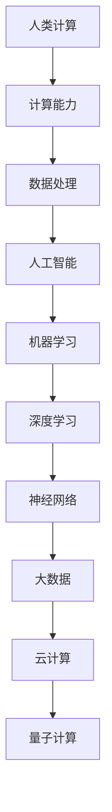

                 

关键词：人类计算、人工智能、计算能力、技术进步、未来展望

> 摘要：本文深入探讨了人类计算能力的提升与人工智能的融合，探讨了人类计算的无限可能性，从核心概念到实际应用，从数学模型到代码实现，全面揭示了人类计算的未来前景。

## 1. 背景介绍

人类计算的历史可以追溯到古代，从最初的算盘到现代的计算机，每一次技术的进步都极大地推动了人类计算能力的提升。随着计算机科学和人工智能的快速发展，人类计算的目标不再仅仅是处理数据，而是要释放人类潜力的无限可能。

在这个快速变化的时代，我们面临着一系列挑战：全球信息爆炸、数据洪流、计算资源的限制、人工智能的崛起。这些挑战促使我们重新思考人类计算的目标，如何通过技术创新来提升我们的计算能力，以及如何充分利用人工智能的力量来赋能人类。

本文将探讨以下几个核心问题：
- 人类计算的目标是什么？
- 人工智能如何助力人类计算？
- 当前技术进步如何影响人类计算？
- 未来人类计算将走向何方？

## 2. 核心概念与联系

为了更好地理解人类计算的目标，我们需要明确一些核心概念和它们之间的联系。以下是一个简化的 Mermaid 流程图，用于展示这些概念和它们之间的关系。



### 2.1 计算能力

计算能力是衡量计算机处理数据的能力的指标。它包括速度、存储容量、能效比等多个方面。计算能力的提升为人类计算提供了基础。

### 2.2 数据处理

数据处理是计算能力的重要应用领域。随着数据量的增加，如何高效地处理数据成为了关键问题。人工智能在数据处理中扮演着重要角色。

### 2.3 人工智能

人工智能是模拟人类智能行为的计算机技术。它通过机器学习、深度学习等技术来实现。人工智能的目标是让计算机能够执行复杂的任务，从而提高人类计算的能力。

### 2.4 机器学习

机器学习是人工智能的一个重要分支，它使计算机能够通过数据学习来改进性能。机器学习可以分为监督学习、无监督学习和强化学习等。

### 2.5 深度学习

深度学习是机器学习的一种形式，它通过模拟人脑的神经网络来处理数据。深度学习在图像识别、语音识别等领域取得了显著成果。

### 2.6 神经网络

神经网络是深度学习的基础，它由多个神经元组成，每个神经元都与其他神经元连接。神经网络通过学习输入和输出之间的关系来提高性能。

### 2.7 大数据

大数据是指数据量巨大、类型多样的数据集合。大数据的处理和分析需要强大的计算能力。

### 2.8 云计算

云计算提供了灵活、可扩展的计算资源，使得大规模数据处理成为可能。

### 2.9 量子计算

量子计算是下一代计算技术，它利用量子位（qubit）来实现高速计算。量子计算有潜力解决传统计算机无法处理的问题。

## 3. 核心算法原理 & 具体操作步骤

### 3.1 算法原理概述

在本节中，我们将讨论几个核心算法的原理，这些算法对于提升人类计算能力至关重要。这些算法包括机器学习、深度学习和神经网络等。

### 3.2 算法步骤详解

#### 3.2.1 机器学习

机器学习算法包括以下步骤：
1. 数据收集：收集相关领域的数据。
2. 数据预处理：清洗和转换数据，使其适合训练模型。
3. 模型选择：选择合适的机器学习模型。
4. 训练模型：使用训练数据来训练模型。
5. 模型评估：评估模型的性能。
6. 模型优化：调整模型参数，提高性能。

#### 3.2.2 深度学习

深度学习算法包括以下步骤：
1. 神经网络设计：设计适合问题的神经网络结构。
2. 数据预处理：同机器学习。
3. 模型训练：使用训练数据训练神经网络。
4. 模型评估：评估神经网络性能。
5. 模型优化：调整网络参数，提高性能。

#### 3.2.3 神经网络

神经网络算法包括以下步骤：
1. 设计网络结构：确定输入层、隐藏层和输出层的结构。
2. 初始化权重和偏置：随机初始化网络权重和偏置。
3. 前向传播：计算输入通过网络的输出。
4. 计算损失：计算预测值和实际值之间的差异。
5. 反向传播：更新网络权重和偏置，以减少损失。
6. 迭代训练：重复以上步骤，直到满足停止条件。

### 3.3 算法优缺点

#### 3.3.1 机器学习

优点：
- 自适应性强，能够处理复杂的问题。
- 不需要手动编写规则，能够从数据中学习。

缺点：
- 需要大量的数据和计算资源。
- 模型的解释性较差。

#### 3.3.2 深度学习

优点：
- 在图像识别、语音识别等领域表现出色。
- 能够自动提取特征。

缺点：
- 模型的解释性较差。
- 训练时间较长，需要大量的计算资源。

#### 3.3.3 神经网络

优点：
- 灵活性高，能够处理非线性问题。
- 自适应性强。

缺点：
- 需要大量的数据和计算资源。
- 模型的解释性较差。

### 3.4 算法应用领域

机器学习、深度学习和神经网络在多个领域都有广泛应用，包括但不限于：
- 图像识别：人脸识别、物体识别等。
- 语音识别：语音合成、语音识别等。
- 自然语言处理：机器翻译、情感分析等。
- 金融服务：风险评估、股票预测等。
- 医疗保健：疾病诊断、药物研发等。

## 4. 数学模型和公式 & 详细讲解 & 举例说明

### 4.1 数学模型构建

在本节中，我们将介绍一些关键的数学模型和公式，这些模型和公式是理解和实现人工智能算法的基础。

#### 4.1.1 感知机模型

感知机模型是一种简单的二分类模型，其目标是通过线性分离超平面将数据分为两类。

公式： 
$$
w^T x + b = 0
$$

其中，$w$ 是权重向量，$x$ 是输入向量，$b$ 是偏置。

#### 4.1.2 神经网络激活函数

激活函数是神经网络中的一个关键组件，它用于引入非线性特性。以下是一些常见的激活函数：

- Sigmoid 函数：
$$
f(x) = \frac{1}{1 + e^{-x}}
$$

- ReLU 函数：
$$
f(x) = \max(0, x)
$$

- Tanh 函数：
$$
f(x) = \frac{e^x - e^{-x}}{e^x + e^{-x}}
$$

#### 4.1.3 代价函数

代价函数用于评估模型的性能，常见的是均方误差（MSE）：

$$
J(\theta) = \frac{1}{2m} \sum_{i=1}^{m} (h_\theta(x^{(i)}) - y^{(i)})^2
$$

其中，$h_\theta(x^{(i)})$ 是模型的预测值，$y^{(i)}$ 是实际值。

### 4.2 公式推导过程

在本节中，我们将简要介绍一些关键公式的推导过程。

#### 4.2.1 前向传播

前向传播是神经网络中的一个关键步骤，它用于计算输入通过网络的输出。以下是一个简化的推导过程：

假设我们有 $L$ 层神经网络，第 $l$ 层的激活函数为 $a^{[l]} = g^{[l]}(\theta^{[l-1]} a^{[l-1]})$，其中 $g^{[l]}$ 是第 $l$ 层的激活函数，$\theta^{[l-1]}$ 是第 $l-1$ 层的权重。

则前向传播的推导如下：

$$
z^{[l]} = \theta^{[l-1]} a^{[l-1]}
$$

$$
a^{[l]} = g^{[l]}(z^{[l]})
$$

### 4.3 案例分析与讲解

在本节中，我们将通过一个简单的案例来说明如何使用上述数学模型和公式来构建和训练一个神经网络。

#### 4.3.1 案例背景

假设我们有一个简单的二分类问题，数据集包含 $m$ 个样本，每个样本有 $n$ 个特征。我们的目标是训练一个神经网络来预测每个样本属于哪一类。

#### 4.3.2 数据预处理

在训练神经网络之前，我们需要对数据进行预处理，包括归一化、缺失值填充等。

#### 4.3.3 网络设计

我们设计一个简单的两层神经网络，第一层是输入层，第二层是输出层。输入层有 $n$ 个神经元，输出层有 2 个神经元。

#### 4.3.4 模型训练

使用前向传播和反向传播算法来训练模型。在每次迭代中，我们计算预测值和实际值之间的差异（损失），然后使用反向传播算法更新权重和偏置。

#### 4.3.5 模型评估

使用训练好的模型对新的数据进行预测，并计算预测准确率。

## 5. 项目实践：代码实例和详细解释说明

在本节中，我们将通过一个简单的项目实例来说明如何使用 Python 编写和运行一个神经网络，用于二分类任务。

### 5.1 开发环境搭建

首先，我们需要安装 Python 和相关的库，如 NumPy、TensorFlow 和 Matplotlib。

```bash
pip install numpy tensorflow matplotlib
```

### 5.2 源代码详细实现

以下是项目的源代码，包括数据预处理、神经网络设计、模型训练和评估等步骤。

```python
import numpy as np
import tensorflow as tf
import matplotlib.pyplot as plt

# 数据预处理
# 这里我们使用生成器来模拟数据生成
def generate_data(m, n):
    X = np.random.rand(m, n)
    y = np.array([1 if x[0] > 0.5 else 0 for x in X])
    return X, y

# 网络设计
def create_network(n, hidden_units):
    model = tf.keras.Sequential([
        tf.keras.layers.Dense(hidden_units, activation='relu', input_shape=(n,)),
        tf.keras.layers.Dense(1, activation='sigmoid')
    ])
    return model

# 模型训练
def train_model(model, X, y, epochs, batch_size):
    model.compile(optimizer='adam', loss='binary_crossentropy', metrics=['accuracy'])
    model.fit(X, y, epochs=epochs, batch_size=batch_size)
    return model

# 模型评估
def evaluate_model(model, X, y):
    loss, accuracy = model.evaluate(X, y)
    print(f"Test accuracy: {accuracy:.2f}")
    return loss, accuracy

# 运行项目
m = 100  # 样本数量
n = 2    # 特征数量
hidden_units = 10  # 隐藏层单元数
epochs = 100  # 迭代次数
batch_size = 10  # 批量大小

# 生成数据
X, y = generate_data(m, n)

# 创建并训练模型
model = create_network(n, hidden_units)
model = train_model(model, X, y, epochs, batch_size)

# 评估模型
evaluate_model(model, X, y)

# 可视化
plt.scatter(X[:, 0], X[:, 1], c=y, cmap=plt.cm.Spectral)
plt.xlabel('Feature 1')
plt.ylabel('Feature 2')
plt.title('Data and Decision Boundary')
plt.show()
```

### 5.3 代码解读与分析

- **数据预处理**：使用 `generate_data` 函数生成模拟数据集。
- **网络设计**：使用 `create_network` 函数创建一个简单的两层神经网络，包含一个隐藏层。
- **模型训练**：使用 `train_model` 函数训练神经网络，使用 `adam` 优化器和 `binary_crossentropy` 损失函数。
- **模型评估**：使用 `evaluate_model` 函数评估训练好的模型。
- **可视化**：使用 `matplotlib` 绘制数据点和决策边界。

## 6. 实际应用场景

### 6.1 金融服务

在金融服务领域，人工智能和人类计算的融合极大地提升了风险管理的效率。例如，机器学习算法可以分析历史交易数据，预测市场趋势，帮助投资者做出更明智的决策。深度学习算法则可以用于情感分析，通过分析社交媒体和新闻报道，预测市场情绪。

### 6.2 医疗保健

在医疗保健领域，人工智能和人类计算的结合正在改变医疗诊断和治疗的模式。深度学习算法可以用于医疗图像的分析，如肿瘤检测、骨折诊断等。机器学习算法则可以用于预测疾病风险，个性化治疗方案的制定。

### 6.3 教育领域

在教育领域，人工智能和人类计算的结合为个性化学习提供了可能。通过分析学生的学习行为和成绩，人工智能可以为学生提供个性化的学习建议。此外，智能辅导系统可以帮助教师更有效地管理课堂，提高教学效果。

### 6.4 智能交通

在智能交通领域，人工智能和人类计算的结合可以显著提高交通管理的效率。通过分析交通流量数据，人工智能可以预测交通拥堵，优化交通信号控制，减少交通事故。此外，自动驾驶技术的不断发展也将极大地改变人们的出行方式。

## 7. 工具和资源推荐

### 7.1 学习资源推荐

- 《深度学习》（Goodfellow, Bengio, Courville）: 这本书是深度学习的经典教材，适合初学者和高级研究人员。
- 《Python机器学习》（Sebastian Raschka）: 这本书详细介绍了使用 Python 进行机器学习的方法和应用。
- 《动手学深度学习》（Acmdinger, BFieldType, Socher）: 这本书通过实践案例，深入讲解了深度学习的原理和应用。

### 7.2 开发工具推荐

- TensorFlow: 一个开源的机器学习和深度学习框架，适用于各种规模的计算任务。
- PyTorch: 一个流行的深度学习框架，以其灵活性和动态计算图而著称。
- Keras: 一个高层次的神经网络API，易于使用，能够运行在 TensorFlow 和 PyTorch 上。

### 7.3 相关论文推荐

- "A Theoretical Basis for Deep Reinforcement Learning" (Mnih et al., 2015)
- "ResNet: Training Deep Neural Networks by Gradient Descent with Very Large Spurious Gradients" (He et al., 2016)
- "Generative Adversarial Nets" (Goodfellow et al., 2014)

## 8. 总结：未来发展趋势与挑战

### 8.1 研究成果总结

人工智能和人类计算的融合已经取得了显著的成果，从图像识别到自然语言处理，再到自动驾驶和智能医疗，人工智能正在改变我们的生活。然而，这些成果仅仅是冰山一角，未来还有更多的可能性等待我们去探索。

### 8.2 未来发展趋势

- 量子计算：量子计算有潜力解决传统计算机无法处理的问题，如大规模数据处理和复杂优化问题。
- 脑机接口：脑机接口技术的发展将使人类能够直接通过大脑与计算机交互，极大地提升计算能力。
- 自动驾驶：自动驾驶技术的发展将改变交通模式，提高交通效率，减少交通事故。

### 8.3 面临的挑战

- 数据隐私：随着数据量的增加，数据隐私问题变得越来越重要。如何保护个人隐私是一个巨大的挑战。
- 算法公平性：算法的决策可能受到偏见的影响，如何确保算法的公平性是一个重要的问题。
- 能源消耗：随着计算能力的提升，能源消耗也不断增加。如何提高能效比是一个关键问题。

### 8.4 研究展望

未来，人工智能和人类计算的结合将带来更多的创新和应用。我们有望看到更加智能的助手、更加高效的交通系统、更加精准的医疗诊断等。然而，这也将带来更多的挑战，需要我们共同努力去解决。

## 9. 附录：常见问题与解答

### 9.1 人类计算是什么？

人类计算是指人类利用计算机和计算技术来提升自身处理信息和解决问题的能力。

### 9.2 人工智能和人类计算有什么区别？

人工智能是计算机科学的一个分支，旨在使计算机能够模拟人类智能行为。而人类计算则是利用人工智能和计算技术来增强人类的能力。

### 9.3 量子计算会如何影响人类计算？

量子计算有潜力解决传统计算机无法处理的问题，如大规模数据处理和复杂优化问题，从而极大地提升人类计算能力。

### 9.4 如何保护数据隐私？

保护数据隐私可以通过数据加密、匿名化和隐私保护算法来实现。此外，制定相关法律法规也是保护数据隐私的重要手段。

### 9.5 人工智能会取代人类吗？

目前的人工智能技术还远远无法取代人类，但人工智能可以辅助人类工作，提高生产力和生活质量。未来的发展将取决于我们如何合理利用人工智能技术。

