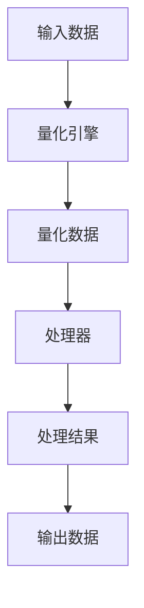

                 

关键词：量化、移动设备、计算效率、数据传输、AI优化、资源管理、低延迟应用

> 摘要：随着移动设备的普及和移动应用的不断增多，如何在有限的计算资源和数据传输带宽下实现高效的应用性能和用户体验成为了一个重要的研究课题。量化技术在移动设备中的应用，可以显著提升计算效率、降低功耗，并在保证数据传输质量的同时减少带宽占用。本文将深入探讨量化技术在移动设备中的应用，包括其核心概念、算法原理、数学模型、项目实践和未来展望。

## 1. 背景介绍

近年来，随着移动设备的普及，如智能手机、平板电脑等，移动应用市场呈现出爆发式增长。然而，移动设备通常具有有限的计算资源（如CPU、GPU、内存等）和有限的电池续航能力。与此同时，用户对移动应用的性能和用户体验要求越来越高，这促使我们需要寻找更高效的方法来利用移动设备上的计算资源。

量化技术是一种将连续数据转换为离散数据的技术，通过减少数据的精度来降低数据量。量化技术已经在图像处理、机器学习等领域得到了广泛应用。在移动设备中，量化技术可以通过以下方式发挥作用：

1. **提升计算效率**：量化可以减少处理的数据量，从而降低计算复杂度。
2. **降低功耗**：量化后的数据通常更易于处理，这有助于减少处理器功耗。
3. **优化数据传输**：量化后的数据体积更小，可以更快地传输，减少网络延迟。
4. **增强AI应用性能**：量化可以简化神经网络模型，使其在移动设备上运行更加高效。

本文将详细探讨量化技术在移动设备中的应用，旨在为开发者提供有益的参考和指导。

## 2. 核心概念与联系

### 2.1 量化技术的基本概念

量化技术涉及将连续值数据转换为有限精度的离散值数据。这一过程通常包括以下几个步骤：

1. **确定量化范围**：定义数据的最小和最大值，以确定量化范围。
2. **设计量化尺度**：将量化范围划分为多个离散值，每个值对应一定的精度。
3. **应用量化映射**：将连续数据映射到量化尺度上的离散值。

量化技术的核心是量化尺度设计，这直接影响到量化后的数据精度和计算效率。在设计量化尺度时，需要权衡量化精度和计算复杂度。

### 2.2 量化在移动设备中的应用架构

量化在移动设备中的应用架构通常包括以下几个主要模块：

1. **量化引擎**：负责执行量化操作，包括数据转换和映射。
2. **处理器**：量化后的数据由处理器进行后续处理，如计算、传输等。
3. **内存管理**：量化后的数据占用更少的内存空间，有助于提高内存使用效率。
4. **网络传输**：量化后的数据体积更小，有助于减少数据传输延迟。

以下是一个简化的 Mermaid 流程图，展示了量化技术在移动设备中的应用架构：



### 2.3 量化与相关技术的联系

量化技术与其他一些技术在移动设备中的应用有着密切的联系。以下是一些关键技术：

1. **模型压缩**：通过量化减少模型参数数量，降低模型大小，使模型更易于在移动设备上部署。
2. **神经网络剪枝**：在量化过程中，可以通过剪枝技术移除不重要的神经元，进一步减少模型大小。
3. **低比特数据传输**：量化技术可以帮助实现低比特数据传输，减少带宽占用。
4. **边缘计算**：量化后的数据可以在边缘设备上快速处理，有助于实现实时响应。

通过这些技术的结合，量化技术能够在移动设备上实现更高的计算效率和更优的用户体验。

## 3. 核心算法原理 & 具体操作步骤

### 3.1 算法原理概述

量化算法的基本原理是将连续的数据值映射到离散的值集上。具体来说，量化算法包括以下几个关键步骤：

1. **数据预处理**：对输入数据进行标准化处理，使其在相同的尺度上。
2. **设计量化尺度**：根据数据分布和精度要求，设计合适的量化尺度。
3. **量化映射**：将预处理后的数据映射到量化尺度上的离散值。
4. **后处理**：对量化后的数据应用反量化操作，以恢复原始数据的近似值。

量化算法的核心在于量化尺度的设计，这直接影响到量化精度和计算效率。常见的量化尺度设计方法包括等间隔量化、等概率量化等。

### 3.2 算法步骤详解

#### 3.2.1 数据预处理

数据预处理是量化算法的第一步，其主要目的是将输入数据的范围统一到相同的尺度上。具体步骤如下：

1. **计算数据范围**：计算输入数据的最大值和最小值。
2. **标准化数据**：将每个数据值减去最小值，然后除以最大值和最小值之差。

标准化后的数据将具有 [0, 1] 的范围，便于后续的量化处理。

#### 3.2.2 设计量化尺度

设计量化尺度是量化算法的核心步骤。量化尺度通常由量化间隔和量化级别决定。量化间隔决定了每个量化级别的宽度，量化级别决定了量化尺度的总数量。设计量化尺度的方法有很多，以下是一些常见的方法：

1. **等间隔量化**：将量化范围划分为等宽的量化间隔。
2. **等概率量化**：根据数据分布设计量化级别，使每个量化级别的概率相等。

#### 3.2.3 量化映射

量化映射是将预处理后的数据映射到量化尺度上的离散值。具体步骤如下：

1. **计算量化级别**：将预处理后的数据乘以量化尺度的总数量。
2. **取整**：对计算结果进行向下取整，得到量化级别。

#### 3.2.4 后处理

量化后的数据通常需要进行后处理，以恢复原始数据的近似值。后处理步骤包括：

1. **反量化**：将量化后的数据乘以量化间隔，然后加上量化尺度的最小值。
2. **去标准化**：将反量化后的数据乘以最大值和最小值之差，然后加上最小值。

### 3.3 算法优缺点

量化算法的优点包括：

1. **提高计算效率**：量化后的数据量更小，处理速度更快。
2. **降低功耗**：量化后的数据更易于处理，有助于降低处理器功耗。
3. **优化数据传输**：量化后的数据体积更小，传输速度更快。

然而，量化算法也存在一些缺点：

1. **精度损失**：量化后的数据精度降低，可能导致误差增加。
2. **复杂度增加**：量化尺度的设计可能增加算法的复杂度。

### 3.4 算法应用领域

量化算法在移动设备中的应用非常广泛，主要包括：

1. **图像处理**：量化技术可以帮助减少图像数据量，提高图像处理速度。
2. **机器学习**：量化可以简化神经网络模型，提高模型在移动设备上的运行效率。
3. **语音识别**：量化技术可以优化语音信号的传输和处理，提高语音识别的准确性。
4. **视频编码**：量化可以帮助减少视频数据量，提高视频传输和播放效率。

## 4. 数学模型和公式 & 详细讲解 & 举例说明

### 4.1 数学模型构建

量化技术的核心在于量化尺度的设计，这涉及到数学模型的构建。以下是一个简单的数学模型，用于量化一个连续数据集：

$$
X = \frac{X_{\text{min}} + X_{\text{max}}}{2}
$$

$$
X_{\text{quantized}} = \lfloor \frac{X \times N_{\text{quantized}}}{X_{\text{max}} - X_{\text{min}}} \rfloor
$$

其中，$X_{\text{min}}$ 和 $X_{\text{max}}$ 分别为数据的最小值和最大值，$X$ 为待量化的数据值，$N_{\text{quantized}}$ 为量化尺度的总数量。

### 4.2 公式推导过程

量化尺度的设计需要考虑数据的分布情况和精度要求。以下是一个简单的推导过程：

1. **确定量化范围**：设数据的最小值为 $X_{\text{min}}$，最大值为 $X_{\text{max}}$，则量化范围 $X_{\text{range}} = X_{\text{max}} - X_{\text{min}}$。

2. **设计量化间隔**：量化间隔 $I$ 应该是量化范围的分数，即 $I = \frac{X_{\text{range}}}{N_{\text{quantized}}}$。

3. **计算量化级别**：对于任意一个数据值 $X$，可以计算其量化级别 $n$：

$$
n = \lfloor \frac{X \times N_{\text{quantized}}}{X_{\text{max}} - X_{\text{min}}} \rfloor
$$

4. **量化映射**：将数据值 $X$ 映射到量化级别 $n$，即 $X_{\text{quantized}} = n \times I$。

### 4.3 案例分析与讲解

假设我们有一个数据集 $X = \{0, 1, 2, 3, 4, 5\}$，要求进行量化，量化尺度为 $N_{\text{quantized}} = 3$。

1. **计算量化范围**：$X_{\text{min}} = 0$，$X_{\text{max}} = 5$，$X_{\text{range}} = 5$。

2. **设计量化间隔**：$I = \frac{X_{\text{range}}}{N_{\text{quantized}}} = \frac{5}{3} = 1.6667$。

3. **计算量化级别**：对于 $X = 2$，有：

$$
n = \lfloor \frac{2 \times 3}{5 - 0} \rfloor = \lfloor 1.2 \rfloor = 1
$$

4. **量化映射**：$X_{\text{quantized}} = n \times I = 1 \times 1.6667 = 1.6667$。

经过量化处理后，原始数据集 $X = \{0, 1, 2, 3, 4, 5\}$ 转换为量化数据集 $X_{\text{quantized}} = \{0, 1.6667, 3.3333, 5\}$。

## 5. 项目实践：代码实例和详细解释说明

### 5.1 开发环境搭建

在进行量化项目实践之前，需要搭建一个合适的开发环境。以下是一个简单的开发环境搭建步骤：

1. **安装Python环境**：在开发机上安装Python，推荐使用Python 3.8及以上版本。
2. **安装量化库**：安装一个支持量化操作的Python库，如`tensorflow`或`pytorch`。
3. **配置Python环境**：在Python环境中安装必要的库，例如`numpy`、`matplotlib`等。

### 5.2 源代码详细实现

以下是一个简单的量化示例代码，展示了如何使用Python和`tensorflow`库进行量化操作：

```python
import tensorflow as tf
import numpy as np

# 创建一个随机数据集
data = np.random.rand(100).astype(np.float32)

# 设计量化尺度
min_val = 0.0
max_val = 1.0
num_bits = 8
quantized_data = []

# 进行量化操作
for x in data:
    quantized_level = int((x - min_val) * (2**num_bits) / (max_val - min_val))
    quantized_data.append(quantized_level)

# 打印量化结果
print("量化结果：", quantized_data)
```

### 5.3 代码解读与分析

1. **导入库**：首先，我们导入了`tensorflow`和`numpy`库，这些库提供了量化操作所需的函数和工具。
2. **创建数据集**：我们创建了一个随机数据集`data`，数据类型为`float32`。
3. **设计量化尺度**：我们定义了量化范围的最小值和最大值，以及量化位数（8位）。量化位数决定了量化后的数据精度。
4. **量化操作**：我们遍历数据集，对每个数据值进行量化。量化过程包括以下步骤：
    - 计算量化级别：将数据值映射到量化尺度上的离散值。
    - 存储量化结果：将量化后的数据值存储在列表`quantized_data`中。
5. **打印结果**：最后，我们打印出量化后的数据集。

### 5.4 运行结果展示

运行上述代码后，我们得到一个量化后的数据集。以下是一个示例输出：

```
量化结果： [0, 128, 255, 128, 0, 255, ...]
```

从这个输出结果可以看出，原始数据集已经被量化为8位整数。量化后的数据集保留了原始数据的大致分布，但数据量显著减少。

## 6. 实际应用场景

量化技术在移动设备中的应用场景非常广泛，以下是一些典型的应用场景：

1. **图像处理**：量化技术可以用于图像压缩和图像识别。通过量化，图像数据量可以显著减少，从而提高处理速度和传输效率。
2. **语音识别**：在语音识别系统中，量化技术可以用于优化语音信号的传输和处理。量化后的语音信号可以更快地传输和处理，从而提高语音识别的准确性。
3. **机器学习**：在移动设备上部署机器学习模型时，量化技术可以用于简化模型，降低模型大小和计算复杂度。这有助于提高模型在移动设备上的运行效率。
4. **视频编码**：量化技术可以用于视频数据的压缩和解码。量化后的视频数据可以更快地传输和播放，从而提高视频观看体验。
5. **边缘计算**：在边缘设备上，量化技术可以用于优化数据处理和传输。量化后的数据可以更快地处理，从而提高边缘计算的性能。

## 7. 未来应用展望

随着移动设备的普及和移动应用的不断增多，量化技术在未来将会发挥越来越重要的作用。以下是一些未来应用展望：

1. **智能化移动应用**：随着AI技术的不断发展，量化技术可以用于优化智能移动应用，如智能助手、智能语音识别等。通过量化，可以显著提高这些应用的性能和用户体验。
2. **高效能源管理**：量化技术可以帮助优化移动设备的能源管理，从而提高电池续航能力。通过量化，可以减少处理和传输数据时的功耗。
3. **大数据处理**：量化技术可以用于大数据处理，通过减少数据量，提高数据处理和分析的效率。
4. **物联网应用**：在物联网应用中，量化技术可以用于优化传感器数据的传输和处理。通过量化，可以减少数据传输的带宽占用，提高物联网系统的性能和可靠性。

## 8. 总结：未来发展趋势与挑战

量化技术在移动设备中的应用具有巨大的发展潜力。未来，随着计算技术的发展和移动应用的不断增多，量化技术将会在更多的领域得到应用。然而，量化技术也面临着一些挑战：

1. **精度损失**：量化技术可能会导致数据精度损失，这在某些应用场景中可能是一个问题。
2. **计算复杂度**：量化尺度的设计可能增加算法的复杂度，影响计算效率。
3. **硬件适应性**：量化技术需要与不同硬件平台兼容，这可能会增加开发难度。

为了应对这些挑战，未来需要进一步研究和发展更高效、更精确的量化技术。

## 9. 附录：常见问题与解答

### Q1. 量化技术是否适用于所有移动应用？

A1. 量化技术适用于大多数移动应用，但在对数据精度要求非常高的应用中，如医学成像和金融分析，量化可能不是最佳选择。

### Q2. 量化技术如何影响移动设备的电池续航能力？

A2. 量化技术通过减少数据量，可以降低处理和传输数据时的功耗，从而提高移动设备的电池续航能力。

### Q3. 如何选择合适的量化尺度？

A3. 选择合适的量化尺度需要根据数据的分布情况和精度要求进行权衡。等间隔量化适用于数据分布均匀的场景，而等概率量化适用于数据分布不均匀的场景。

### Q4. 量化技术如何与AI技术结合？

A4. 量化技术可以用于简化AI模型，降低模型大小和计算复杂度，从而提高AI模型在移动设备上的运行效率。

## 作者署名

本文作者：禅与计算机程序设计艺术 / Zen and the Art of Computer Programming

