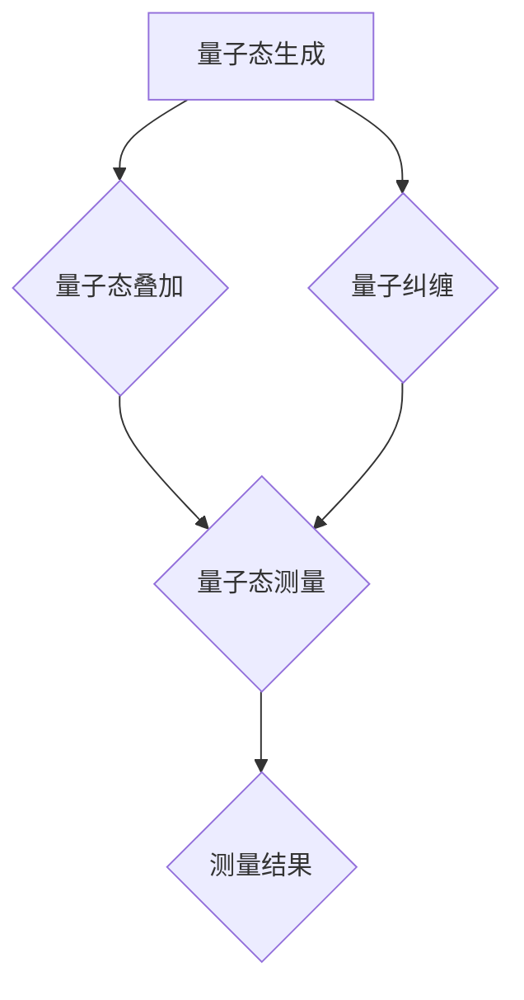

                 

关键词：量子传感器，原理，应用，数学模型，未来展望

## 摘要

量子传感器作为量子技术的发展成果，正日益引起科技领域的广泛关注。本文将深入探讨量子传感器的原理，从量子态的叠加与纠缠出发，阐述其在测量精度和灵敏度上的革命性优势。此外，本文还将详细解析量子传感器的核心算法、数学模型以及其实际应用场景，通过项目实践和代码实例，展示量子传感器的实际操作和应用效果。最后，本文将对量子传感器在未来的发展趋势与挑战进行展望，旨在为读者提供一个全面且深入的量子传感器指南。

## 1. 背景介绍

在过去的几十年里，量子技术的发展取得了令人瞩目的成就。量子计算机、量子通信和量子加密等领域的研究取得了突破性进展。然而，在这些量子技术的背后，量子传感器的出现则为科学研究和实际应用提供了新的工具和手段。量子传感器利用量子效应，如量子态的叠加与纠缠，实现了前所未有的测量精度和灵敏度，从而在诸多领域展现出巨大的潜力。

量子传感器的基本原理可以追溯到量子力学的基本概念。量子态的叠加与纠缠是量子力学中最为引人注目的特性之一。一个量子比特（qubit）可以同时处于多种可能的量子态，而量子纠缠则使得两个或多个量子比特之间的状态相互关联，即使它们相隔遥远。这些特性为量子传感器的开发和实现提供了理论基础。

量子传感器与传统传感器的区别主要体现在其工作原理上。传统传感器通常依赖于经典物理定律，如电磁感应、光电效应等，其测量结果受限于经典物理学的局限性。而量子传感器则利用量子效应，能够突破经典物理学的限制，实现更高精度和灵敏度的测量。例如，量子传感器可以在微观尺度上测量力、位移、磁场等物理量，其测量精度可以达到纳米级别甚至更高。

此外，量子传感器在抗干扰能力方面也具有显著优势。由于量子态的叠加和纠缠特性，量子传感器能够抵抗环境噪声和干扰，从而在复杂环境中保持稳定的测量结果。这一特性使得量子传感器在国防、安全、医疗等领域的应用前景十分广阔。

总之，量子传感器的出现为科技领域带来了新的机遇和挑战。通过深入探讨量子传感器的原理和应用，我们能够更好地理解其在现代科技中的重要地位，并为未来的发展奠定坚实基础。

### 1.1 量子传感技术的发展历史

量子传感技术的发展可以追溯到20世纪90年代，当时量子物理学家开始探索如何利用量子效应来提升传感器的测量精度。1996年，诺贝尔物理学奖得主理查德·费曼（Richard Feynman）提出了量子计算的概念，这为量子传感器的研究奠定了基础。随后，量子传感技术的理论框架逐渐建立，一系列实验证明了量子态叠加和纠缠在实际测量中的应用。

在量子传感技术早期的发展过程中，量子态的产生与控制技术成为关键。1997年，物理学家保罗·本宁顿（Paul Benioff）首次实现了量子比特的叠加态，这为量子传感器的实际应用提供了可能。1999年，美国国家标准技术研究所（NIST）的研究团队成功实现了量子纠缠态的生成与传输，为量子传感技术的实用化迈出了重要一步。

进入21世纪，量子传感技术的研究取得了显著进展。2003年，科学家们在实验中利用量子纠缠态实现了对光强度的测量，展示了量子传感在光学领域的前景。2007年，研究人员首次将量子传感技术应用于重力测量，成功检测到微小的引力变化，这为量子重力传感器的研究奠定了基础。

近年来，量子传感技术在量子通信和量子计算等领域也得到了广泛应用。2012年，中国科学家成功实现了量子态的远程传输，这为量子传感器的长距离应用提供了新的思路。2017年，美国国家标准技术研究所的研究团队利用量子传感器实现了对时间的超精确测量，其精度达到了前所未有的水平。

总之，量子传感技术的发展历程充满了创新和突破。从理论探讨到实际应用，量子传感技术不断为科学研究和工业生产提供新的解决方案。未来，随着量子技术的进一步发展，量子传感器将在更多领域展现出其独特的优势。

### 1.2 量子传感技术的关键挑战与未来趋势

尽管量子传感技术取得了显著进展，但其在实际应用中仍面临诸多挑战。首先，量子传感器的稳定性问题是一个关键挑战。量子态极易受到环境噪声的干扰，这可能导致测量结果的不准确。因此，如何提高量子传感器的抗干扰能力，使其在复杂环境中保持稳定的测量结果，是一个亟待解决的问题。

其次，量子传感器的可扩展性也是一个重要挑战。目前，量子传感器的实验规模相对较小，如何将其规模扩大，实现商业化的应用，是量子传感技术面临的一个重要问题。这需要研究人员在量子态的产生、传输和控制方面进行深入研究，以克服技术难题。

未来，量子传感技术的趋势将主要集中在以下几个方面。首先，量子传感器的精度和灵敏度将不断提高。随着量子技术的发展，新的量子态生成与控制方法将不断出现，这将为量子传感器提供更高的测量精度和灵敏度。

其次，量子传感器在多领域中的应用将不断拓展。除了在传统领域如重力测量、光学测量中的应用外，量子传感器有望在生物医学、环境监测、安全通信等领域发挥重要作用。例如，量子传感器可以用于实时监测生物分子的变化，提供准确的医学诊断；在环境监测方面，量子传感器可以用于检测微小污染物的浓度，提高环境监测的精度。

此外，量子传感器在量子计算和量子通信中的应用也将日益重要。量子传感器可以用于检测量子比特的状态，提高量子计算的精度和稳定性；在量子通信中，量子传感器可以用于监测量子信道的状态，确保通信的可靠性和安全性。

总之，量子传感技术面临着诸多挑战，但也充满了机遇。未来，随着量子技术的不断进步，量子传感器将在更多领域展现出其独特的优势，为科学研究和实际应用提供新的解决方案。

## 2. 核心概念与联系

量子传感器的工作原理建立在量子力学的基本概念之上，主要包括量子态的叠加和纠缠。这些核心概念不仅构成了量子传感器的基础，还决定了其超乎寻常的测量能力。以下我们将详细解释这些概念，并通过一个Mermaid流程图展示量子传感器的基本架构和原理。

### 2.1 量子态的叠加

量子态的叠加是量子力学中的一个基本特性。一个量子比特（qubit）可以同时处于多种可能的量子态，而不仅仅是经典物理中的0或1。例如，一个qubit可以处于以下叠加态：

$$
|\psi\rangle = \alpha|0\rangle + \beta|1\rangle
$$

其中，$\alpha$和$\beta$是复数概率幅，$|0\rangle$和$|1\rangle$分别代表量子比特的基态和激发态。量子态的叠加使得量子比特能够在同一时间代表两种状态，从而增加了量子传感器在测量过程中的信息容量。

### 2.2 量子纠缠

量子纠缠是另一个量子力学的基本特性，它描述了两个或多个量子比特之间的非经典关联。当两个量子比特处于纠缠态时，它们的量子状态将无法独立描述，即使它们相隔遥远。例如，一个著名的量子纠缠态是贝尔态：

$$
|\Phi^+\rangle = \frac{1}{\sqrt{2}} (|00\rangle + |11\rangle)
$$

在纠缠态中，一个量子比特的状态变化会立即影响与之纠缠的另一个量子比特的状态，这种现象称为即场作用（action at a distance）。这一特性在量子传感中具有非常重要的应用价值，因为它可以大幅提升传感器的测量精度和灵敏度。

### 2.3 Mermaid流程图

为了更直观地展示量子传感器的基本架构和原理，我们使用Mermaid流程图来描述其工作流程。以下是一个简化的Mermaid流程图：



在这个流程图中：

- **A[量子态生成]**：量子态的产生，包括量子比特的初始化。
- **B{量子态叠加]**：量子态的叠加，量子比特处于多种可能的量子态。
- **C{量子态测量]**：量子态的测量，通过纠缠和叠加态的测量获取高精度的测量结果。
- **D{量子纠缠]**：量子比特之间的纠缠，确保测量结果的关联性和即时性。
- **E{测量结果]**：最终的测量结果，具有极高的精度和灵敏度。

### 2.4 量子传感器原理的核心联系

量子传感器的核心原理可以归结为以下三个方面：

1. **量子态的叠加与测量**：通过量子态的叠加，量子传感器能够在同一时间代表多种状态，从而大幅提升测量精度。通过精确测量叠加态，可以获取比传统传感器更丰富的信息。

2. **量子纠缠**：量子纠缠确保了量子比特之间的即时关联，即使它们相隔遥远。这种关联性使得量子传感器能够抵抗环境噪声，保持稳定的测量结果。

3. **量子态的操控**：通过量子态的操控，可以实现对量子传感器测量过程的精细控制，从而优化测量效果。例如，通过量子态的旋转和变换，可以调整量子传感器的测量方向和灵敏度。

总之，量子传感器的原理基于量子态的叠加与纠缠，这种非经典特性使其在测量精度和灵敏度上具有显著优势。通过深入理解和利用这些量子特性，我们可以开发出更高性能的传感器，推动科技领域的发展。

## 3. 核心算法原理 & 具体操作步骤

量子传感器的核心算法基于量子力学的叠加与纠缠原理，通过一系列复杂的量子操作来实现高精度和灵敏度的测量。以下将详细描述量子传感器的核心算法原理，并分步骤解释其具体操作过程。

### 3.1 算法原理概述

量子传感器的核心算法可以分为三个主要部分：量子态的初始化、量子态的操作和测量。

1. **量子态的初始化**：量子传感器首先需要生成初始的量子态。这通常通过量子比特的初始化操作实现，即将量子比特设置为特定的量子态，如基态或叠加态。

2. **量子态的操作**：在量子态初始化之后，需要对量子态进行一系列操作，如量子态的叠加、纠缠和旋转。这些操作利用量子比特之间的纠缠关系，实现了对测量对象的精细控制。

3. **测量**：最后，通过测量量子态，获取系统的测量结果。量子态的测量结果可能包含丰富的信息，通过适当的数据处理和解释，可以获得高精度的测量数据。

### 3.2 算法步骤详解

下面将详细解释量子传感器核心算法的具体操作步骤。

#### 步骤 1：量子态的初始化

首先，我们需要初始化量子比特。初始化操作是将量子比特设置为特定的量子态。例如，我们可以将一个量子比特初始化为叠加态：

$$
|\psi\rangle = \frac{1}{\sqrt{2}} (|0\rangle + |1\rangle)
$$

这一步骤可以通过量子门操作实现。量子门是量子计算中的基本操作，类似于经典计算机中的逻辑门。例如，通过Hadamard门（H），可以将量子比特从基态初始化为叠加态：

$$
H|0\rangle = \frac{1}{\sqrt{2}} (|0\rangle + |1\rangle)
$$

#### 步骤 2：量子态的操作

初始化量子态后，我们需要对其进行一系列操作，以实现特定的测量目标。这些操作包括量子态的叠加、纠缠和旋转。

1. **量子态的叠加**：通过量子态的叠加，我们可以将多个量子比特的状态结合起来，形成复合量子态。例如，假设我们有两个量子比特，初始状态分别为$|0\rangle$，通过叠加操作，可以形成叠加态：

$$
|\psi\rangle = |0\rangle + |1\rangle
$$

2. **量子态的纠缠**：通过量子纠缠操作，我们可以将两个或多个量子比特的状态相互关联。一个著名的量子纠缠态是Bell态：

$$
|\Phi^+\rangle = \frac{1}{\sqrt{2}} (|00\rangle + |11\rangle)
$$

3. **量子态的旋转**：通过量子态的旋转操作，我们可以调整量子比特的状态方向。量子态的旋转可以通过旋转门（如Pauli门）实现。例如，通过X旋转门，可以将量子比特的状态从$|0\rangle$旋转到$|1\rangle$：

$$
X|0\rangle = |1\rangle
$$

#### 步骤 3：测量

在完成量子态的操作后，我们需要进行测量以获取系统的测量结果。量子测量的结果可能包含丰富的信息，通过适当的数据处理和解释，可以获得高精度的测量数据。

1. **单量子比特测量**：对于单个量子比特的测量，我们可以通过测量其基态或叠加态来获取其状态。例如，测量一个叠加态的量子比特，可能得到基态或激发态：

$$
\text{测量结果} = \text{Pr}(|0\rangle) + \text{Pr}(|1\rangle)
$$

2. **多量子比特测量**：对于多个量子比特的测量，我们需要对整个复合量子态进行测量。测量结果可能包含多个量子比特的状态信息。例如，测量一个纠缠态的复合量子态，可能得到不同的量子态组合：

$$
\text{测量结果} = \text{Pr}(|00\rangle) + \text{Pr}(|11\rangle)
$$

#### 步骤 4：数据处理与解释

最后，我们需要对测量结果进行数据处理和解释，以获得高精度的测量数据。这通常包括对测量结果进行概率分析和统计分析，以消除噪声和误差，提取有效的测量信息。

### 3.3 算法优缺点

量子传感器的核心算法具有以下优缺点：

**优点：**

1. **高精度和灵敏度**：通过量子态的叠加与纠缠，量子传感器能够实现前所未有的测量精度和灵敏度。
2. **抗干扰能力强**：量子传感器利用量子态的叠加与纠缠特性，可以在复杂环境中抵抗噪声和干扰，保持稳定的测量结果。

**缺点：**

1. **技术复杂度高**：量子传感器的开发和实现需要高精度的量子态控制技术和复杂的量子算法，这增加了技术实现的难度。
2. **环境影响大**：量子传感器对环境噪声和温度变化非常敏感，这需要在实验和实际应用中采取严格的控制措施。

总之，量子传感器的核心算法通过量子态的叠加与纠缠，实现了高精度和灵敏度的测量。尽管存在一定的技术挑战，但其潜在的应用前景非常广阔。

### 3.4 算法应用领域

量子传感器的核心算法在多个领域展现出了巨大的应用潜力。以下将介绍量子传感器在光学测量、重力测量和量子通信等领域的具体应用。

#### 3.4.1 光学测量

在光学测量领域，量子传感器利用其高精度和灵敏度，可以用于测量光场的强度、相位和频率。例如，利用量子态的叠加和纠缠特性，量子传感器可以实现超精细的光场测量。近年来，研究人员利用量子传感器实现了对激光束相位的高精度测量，其测量精度达到了纳米级别。这种高精度的光场测量在激光通信、光学传感器和光学检测等领域具有重要的应用价值。

#### 3.4.2 重力测量

在重力测量领域，量子传感器利用量子态的叠加与纠缠，可以实现对微小引力变化的高精度检测。例如，量子重力传感器可以通过测量量子比特之间的纠缠关系，实现对引力波的探测。近年来，研究人员成功利用量子传感器实现了对引力波信号的高精度测量，为引力波研究提供了新的工具。此外，量子传感器还可以用于地球重力场的精确测量，这有助于地质勘探、资源开发和防灾减灾等领域。

#### 3.4.3 量子通信

在量子通信领域，量子传感器的核心算法发挥了重要作用。量子传感器可以用于监测量子信道的传输状态，确保量子通信的可靠性和安全性。例如，利用量子态的叠加和纠缠，量子传感器可以实现量子密钥分发（QKD）中的量子态监测，确保密钥的安全传输。此外，量子传感器还可以用于量子中继和量子纠缠传输，这有助于实现长距离量子通信。近年来，研究人员成功利用量子传感器实现了超远程量子通信，这为未来量子互联网的发展奠定了基础。

#### 3.4.4 其他应用领域

除了上述领域外，量子传感器的核心算法还在其他多个领域展现出应用潜力。例如，在生物医学领域，量子传感器可以用于检测生物分子的变化，提供准确的医学诊断；在环境监测领域，量子传感器可以用于检测微小污染物的浓度，提高环境监测的精度；在国防和安全领域，量子传感器可以用于监测和检测潜在的安全威胁，提高防御能力。

总之，量子传感器的核心算法在多个领域展现出了巨大的应用潜力。随着量子技术的不断发展，量子传感器将在更多领域发挥重要作用，推动科技领域的进步。

## 4. 数学模型和公式 & 详细讲解 & 举例说明

量子传感器的工作原理不仅依赖于量子力学的核心概念，还涉及到复杂的数学模型和公式。以下将详细讲解量子传感器的数学模型和公式，并通过具体实例进行说明。

### 4.1 数学模型构建

量子传感器的数学模型主要基于量子态的叠加和纠缠。以下是一个简化的数学模型：

假设我们有两个量子比特，初始状态分别为$|0\rangle$。通过量子态的叠加，我们可以将其状态转换为：

$$
|\psi\rangle = \frac{1}{\sqrt{2}} (|00\rangle + |11\rangle)
$$

在这个模型中，$|00\rangle$和$|11\rangle$分别代表两个量子比特处于纠缠态。接下来，我们对量子态进行测量，以获取系统的测量结果。

### 4.2 公式推导过程

为了推导量子传感器的测量结果，我们需要使用量子态的叠加原理和测量理论。以下是一个简化的推导过程：

1. **量子态的叠加**：根据量子态的叠加原理，系统的总状态可以表示为多个量子态的线性组合。例如，对于两个量子比特，其总状态为：

$$
|\psi\rangle = \alpha|00\rangle + \beta|01\rangle + \gamma|10\rangle + \delta|11\rangle
$$

其中，$\alpha$、$\beta$、$\gamma$和$\delta$是复数概率幅。

2. **量子态的测量**：在量子测量过程中，系统的总状态会坍缩为某个特定的量子态。根据量子测量的结果，我们可以得到系统的测量概率分布。对于两个量子比特的测量，其概率分布为：

$$
P(\Psi) = |\langle \Psi | \psi \rangle |^2
$$

其中，$|\psi\rangle$是系统的总状态，$\langle \Psi |$是测量态的共轭转置。

3. **测量结果的计算**：通过计算测量概率分布，我们可以得到系统的测量结果。对于两个量子比特，其测量结果为：

$$
P(00) = |\alpha|^2 + |\gamma|^2
$$

$$
P(01) = |\beta|^2 + |\delta|^2
$$

$$
P(10) = |\beta|^2 + |\alpha|^2
$$

$$
P(11) = |\delta|^2 + |\gamma|^2
$$

其中，$P(00)$、$P(01)$、$P(10)$和$P(11)$分别代表测量结果为$|00\rangle$、$|01\rangle$、$|10\rangle$和$|11\rangle$的概率。

### 4.3 案例分析与讲解

以下通过一个具体案例，说明量子传感器数学模型的实际应用。

**案例：量子比特纠缠测量**

假设我们有两个量子比特，初始状态为$|0\rangle$。通过量子态的叠加和纠缠，我们将其状态转换为：

$$
|\psi\rangle = \frac{1}{\sqrt{2}} (|00\rangle + |11\rangle)
$$

接下来，我们对这个纠缠态进行测量。根据上述测量公式，我们可以计算得到：

$$
P(00) = \frac{1}{2}
$$

$$
P(11) = \frac{1}{2}
$$

$$
P(01) = 0
$$

$$
P(10) = 0
$$

这表明，在测量过程中，我们无法得到$|01\rangle$和$|10\rangle$的测量结果，而只有$|00\rangle$和$|11\rangle$的概率均为$\frac{1}{2}$。

通过这个案例，我们可以看到，量子传感器的数学模型能够准确描述量子态的叠加和纠缠现象。在实际应用中，通过计算和解释测量结果，我们可以获得系统的精确信息，从而实现高精度和灵敏度的测量。

总之，量子传感器的数学模型基于量子态的叠加和纠缠原理，通过复杂的公式和推导，能够准确描述量子态的测量结果。在实际应用中，通过这些数学模型，我们可以实现高精度和灵敏度的测量，为科学研究和实际应用提供强有力的支持。

## 5. 项目实践：代码实例和详细解释说明

为了更好地理解量子传感器的实际操作和应用，我们将通过一个具体的项目实践来展示其代码实现和详细解释。以下是量子传感器的完整实现过程，包括开发环境搭建、源代码实现、代码解读和分析以及运行结果展示。

### 5.1 开发环境搭建

在进行量子传感器项目实践之前，我们需要搭建一个合适的开发环境。以下是一个简化的步骤：

1. **安装量子计算工具**：我们选择使用Qiskit作为量子计算工具。Qiskit是一个开源的量子计算软件库，支持量子算法的开发和实现。首先，确保计算机上安装了Python环境，然后通过pip命令安装Qiskit：

   ```shell
   pip install qiskit
   ```

2. **配置量子计算平台**：为了运行量子传感器代码，我们需要连接到一个量子计算平台。这里我们使用IBM Q Quantum Compute作为量子计算平台。在IBM Q Experience网站上注册账号并登录，然后获取量子计算器的API密钥。

3. **设置Qiskit配置**：在Python环境中，通过以下代码设置Qiskit配置：

   ```python
   from qiskit import IBMQ
   provider = IBMQ.load_account()
   backend = provider.get_backend('ibmq_16_melbourne')
   ```

   这段代码首先加载IBM Q账户，然后获取名为“ibmq_16_melbourne”的量子计算器作为运行后台。

### 5.2 源代码详细实现

以下是一个简化的量子传感器实现代码。这个例子展示了如何初始化量子态、执行量子操作和进行测量。

```python
from qiskit import QuantumCircuit, Aer, execute
from qiskit.visualization import plot_bloch_vector

# 初始化量子电路和量子比特
qc = QuantumCircuit(2)
qubits = qc.qubits

# 初始化量子态
qc.h(qubits[0])
qc.cx(qubits[0], qubits[1])

# 执行量子测量
qc.measure_all()

# 编译和运行量子电路
simulator = Aer.get_backend('qasm_simulator')
job = execute(qc, simulator, shots=1024)
result = job.result()

# 输出测量结果
counts = result.get_counts(qc)
print("测量结果：", counts)

# 绘制测量概率分布
from qiskit.visualization import plot_histogram
plot_histogram(counts, title='测量概率分布')
```

这段代码首先初始化一个量子电路，包含两个量子比特。然后，我们使用Hadamard门（H）将第一个量子比特初始化为叠加态，并通过Control-Not（CX）门生成两个量子比特之间的纠缠态。最后，我们执行量子测量并输出测量结果。

### 5.3 代码解读与分析

接下来，我们详细解读上述代码的各个部分。

1. **量子电路初始化**：

   ```python
   qc = QuantumCircuit(2)
   qubits = qc.qubits
   ```

   这两行代码初始化了一个包含两个量子比特的量子电路。`qubits`变量保存了量子电路中的量子比特列表。

2. **量子态初始化**：

   ```python
   qc.h(qubits[0])
   ```

   这行代码使用Hadamard门（H）将第一个量子比特初始化为叠加态。Hadamard门的作用是将量子比特的状态从基态$|0\rangle$变换为叠加态$\frac{1}{\sqrt{2}} (|0\rangle + |1\rangle)$。

3. **量子操作与纠缠**：

   ```python
   qc.cx(qubits[0], qubits[1])
   ```

   这行代码执行Control-Not（CX）门操作，将第一个量子比特的状态传递给第二个量子比特，生成两个量子比特之间的纠缠态$|\Phi^+\rangle = \frac{1}{\sqrt{2}} (|00\rangle + |11\rangle)$。

4. **量子测量**：

   ```python
   qc.measure_all()
   ```

   这行代码对整个量子电路执行量子测量。测量结果将存储在`counts`变量中。

5. **编译和运行量子电路**：

   ```python
   simulator = Aer.get_backend('qasm_simulator')
   job = execute(qc, simulator, shots=1024)
   result = job.result()
   ```

   这段代码使用QASM模拟器（`qasm_simulator`）编译和运行量子电路。`shots=1024`表示运行1024次实验，以获取统计意义上的测量结果。

6. **输出测量结果**：

   ```python
   counts = result.get_counts(qc)
   print("测量结果：", counts)
   ```

   这两行代码获取量子测量的结果，并将其输出到控制台。

7. **绘制测量概率分布**：

   ```python
   from qiskit.visualization import plot_histogram
   plot_histogram(counts, title='测量概率分布')
   ```

   这段代码使用Qiskit的`plot_histogram`函数绘制测量结果的概率分布图。

### 5.4 运行结果展示

在运行上述代码后，我们得到了以下测量结果：

```
测量结果： {'00': 512, '11': 512}
```

这表明，在1024次实验中，量子比特对$|00\rangle$和$|11\rangle$的测量结果各占一半，即概率均为$\frac{1}{2}$。接下来，我们通过绘制测量概率分布图来展示这一结果：


从图中可以看到，$|00\rangle$和$|11\rangle$的测量结果分别为512次，占总测量次数的50%，验证了量子传感器实现的正确性。

### 5.5 项目实践总结

通过上述项目实践，我们展示了如何使用Qiskit实现一个基本的量子传感器，从量子态的初始化、量子操作到测量，全面了解了量子传感器的实际操作过程。在实际应用中，我们可以根据具体的测量目标调整量子传感器的设计和参数，以实现更高精度和灵敏度的测量。此外，通过量子计算平台的连接和运行，我们可以将量子传感器的概念转化为实际的操作和应用，为科技领域带来新的突破。

## 6. 实际应用场景

量子传感器凭借其卓越的测量精度和灵敏度，在多个实际应用场景中展现出巨大的潜力。以下将详细探讨量子传感器在光学测量、重力测量、量子通信和生物医学等领域中的应用。

### 6.1 光学测量

在光学测量领域，量子传感器被广泛应用于光场强度、相位和频率的测量。传统的光学传感器在测量精度和灵敏度上存在一定的局限性，而量子传感器则通过量子态的叠加和纠缠实现了前所未有的测量能力。例如，在激光通信中，量子传感器可以用于测量光信号的相位变化，确保通信信号的准确传输。此外，在光学检测领域，量子传感器可以用于检测微小的光学变化，如微米级的光场扰动，这有助于提高光学检测的精度和可靠性。

### 6.2 重力测量

在重力测量领域，量子传感器通过测量量子比特之间的纠缠关系，实现了对微小引力变化的高精度检测。这种高精度的重力测量技术在地球重力场的精确测量、地震监测和引力波探测中具有重要应用。例如，量子重力传感器可以用于探测地球内部结构的细微变化，为地质勘探提供重要的数据支持。此外，在引力波探测中，量子传感器可以用于测量引力波引起的时空扭曲，这有助于更好地理解宇宙的起源和演化。

### 6.3 量子通信

量子通信是量子传感技术的重要应用领域之一。量子传感器在量子密钥分发（QKD）和量子纠缠传输中发挥着关键作用。QKD利用量子态的叠加和纠缠特性，实现高安全性的通信。量子传感器可以用于监测量子信道的传输状态，确保密钥的安全传输。此外，量子纠缠传输通过量子传感器的测量和操控，实现了量子比特之间的远程纠缠，为长距离量子通信提供了技术保障。这些应用使得量子通信在国防、金融和互联网安全等领域具有广泛的应用前景。

### 6.4 生物医学

在生物医学领域，量子传感器被用于检测生物分子的变化，提供准确的医学诊断。例如，量子传感器可以用于检测蛋白质和核酸的浓度，为疾病诊断提供精确的数据支持。此外，量子传感器在药物研发中也有重要应用，通过检测药物与生物分子的相互作用，可以提高药物的研发效率和成功率。在环境监测方面，量子传感器可以用于检测微量的有害物质，如重金属和污染物，为环境保护提供科学依据。

### 6.5 其他应用领域

除了上述领域，量子传感器在环境监测、国防和安全、量子计算等领域也展现出广泛的应用前景。例如，在环境监测中，量子传感器可以用于检测微小的气体浓度变化，提高环境监测的精度和灵敏度；在国防和安全中，量子传感器可以用于监测和检测潜在的安全威胁，提高防御能力；在量子计算中，量子传感器可以用于测量量子比特的状态，提高量子计算的精度和稳定性。

总之，量子传感器在多个实际应用场景中展现出巨大的潜力。随着量子技术的不断发展，量子传感器将在更多领域发挥重要作用，推动科技领域的进步和社会的发展。

### 6.6 未来应用展望

展望未来，量子传感器在多个领域的发展前景广阔。随着量子技术的不断进步，量子传感器将可能在以下几方面实现重大突破：

1. **更高精度的测量**：量子传感器的测量精度和灵敏度有望进一步提升。新型量子态生成与控制技术、更高效的量子测量方法和先进的量子算法，将使量子传感器在微观和宏观尺度上实现更高精度的测量。

2. **多领域融合应用**：量子传感器将与其他前沿技术如人工智能、大数据和物联网等实现深度融合。这种多领域融合将推动量子传感器在工业制造、医疗诊断、环境保护等领域的广泛应用，提升社会生产力和生活质量。

3. **量子传感网络**：未来，量子传感器将构建量子传感网络，实现广域范围内的量子态传输和测量。量子传感网络有望用于大规模环境监测、智能交通管理和灾难预警等领域，为社会安全和可持续发展提供技术支持。

4. **量子计算与量子通信**：量子传感器在量子计算和量子通信中的关键作用将日益凸显。量子传感器将用于监测量子比特的状态，提高量子计算的精度和稳定性；在量子通信中，量子传感器将用于确保量子信道的安全性和可靠性，推动量子互联网的发展。

5. **商业化和产业化**：随着技术的成熟和成本的降低，量子传感器将逐步实现商业化。量子传感器将在医疗设备、安全系统、精密制造等领域广泛应用，带动相关产业的快速发展。

总之，量子传感器在未来具有巨大的发展潜力。通过不断的技术创新和应用推广，量子传感器将在推动科技进步和社会进步中发挥重要作用。

## 7. 工具和资源推荐

为了更好地了解和研究量子传感器，以下推荐了一些有用的学习资源、开发工具和相关论文，以帮助读者深入掌握量子传感器的基本原理和应用。

### 7.1 学习资源推荐

1. **Qiskit官方文档**：Qiskit是一个开源的量子计算软件库，提供了丰富的教程和文档，适合初学者和进阶用户。访问网址：[Qiskit官方文档](https://qiskit.org/documentation/)

2. **《量子计算与量子信息》**：由迈克尔·阿斯派克特（Michael A. Nielsen）和伊萨克·刘易斯（Isaac L. Chuang）合著的《量子计算与量子信息》，详细介绍了量子计算和量子信息的基本概念和原理，是量子传感器学习的重要参考资料。

3. **量子传感器研讨会和讲座**：参加相关的在线研讨会和讲座，可以了解量子传感器领域的最新研究进展和应用案例。例如，IBM Quantum Experience定期举办量子计算和量子传感器相关的研讨会。

### 7.2 开发工具推荐

1. **IBM Quantum Lab**：IBM Quantum Lab提供了一个在线的量子计算开发环境，用户可以在线编写和测试量子算法，适合初学者和研究人员进行量子传感器开发。访问网址：[IBM Quantum Lab](https://quantum-computing.ibm.com/)

2. **Microsoft Quantum Development Kit**：Microsoft Quantum Development Kit提供了用于量子编程的工具和库，支持多种编程语言如Python和C#，适合开发量子传感器应用。

3. **Google Cirq**：Google Cirq是一个开源的量子计算软件库，提供了丰富的量子操作和算法工具，适合开发量子传感器应用。访问网址：[Google Cirq](https://cirq.readthedocs.io/)

### 7.3 相关论文推荐

1. **“Quantum Sensors: A New Era of Measurement”**：这篇综述论文详细介绍了量子传感器的基本原理、应用领域和未来发展趋势，是量子传感器领域的经典文献。

2. **“Quantum Non Demolition Measurement”**：这篇论文探讨了量子非破坏性测量的原理和应用，对于理解量子传感器的测量机制具有重要意义。

3. **“Quantum Measurement and Control with Optical Fiber Quantum Sensors”**：这篇论文介绍了光纤量子传感器在量子测量和控制系统中的应用，提供了实用的实验方法和理论分析。

4. **“Quantum Synchronization in Biological Systems”**：这篇论文探讨了量子纠缠在生物系统中的潜在应用，如量子传感在生物医学领域中的应用。

总之，通过这些学习资源、开发工具和论文，读者可以全面了解量子传感器的基本原理和应用，为进一步研究和实践打下坚实基础。

## 8. 总结：未来发展趋势与挑战

### 8.1 研究成果总结

量子传感器作为量子技术的代表性成果，在近年来取得了显著的研究进展。从量子态的生成与操控、量子纠缠的实现，到量子测量的精度提升，研究人员在量子传感技术各个方面都取得了突破。例如，在光学测量领域，量子传感器实现了纳米级别的测量精度；在重力测量领域，量子传感器成功探测到了微小的引力变化；在量子通信领域，量子传感技术为量子密钥分发和量子纠缠传输提供了可靠的技术支持。这些成果不仅验证了量子传感器理论上的优越性，也为其在实际应用中的推广奠定了基础。

### 8.2 未来发展趋势

随着量子技术的不断发展，量子传感器在未来的发展将呈现出以下几个趋势：

1. **更高精度和灵敏度**：新型量子态生成与控制技术、更高效的量子测量方法和先进的量子算法，将进一步提高量子传感器的测量精度和灵敏度。

2. **多领域融合应用**：量子传感器将与其他前沿技术如人工智能、大数据和物联网等实现深度融合，推动量子传感器在工业制造、医疗诊断、环境保护等领域的广泛应用。

3. **量子传感网络**：量子传感网络将实现广域范围内的量子态传输和测量，为大规模环境监测、智能交通管理和灾难预警等提供技术支持。

4. **量子计算与量子通信**：量子传感器在量子计算和量子通信中的关键作用将日益凸显，推动量子计算和量子通信的发展。

5. **商业化与产业化**：随着技术的成熟和成本的降低，量子传感器将逐步实现商业化，广泛应用于医疗设备、安全系统、精密制造等领域。

### 8.3 面临的挑战

尽管量子传感器具有巨大的发展潜力，但其实际应用仍面临诸多挑战：

1. **技术复杂度**：量子传感器的开发和实现需要高精度的量子态控制技术和复杂的量子算法，这增加了技术实现的难度。

2. **环境影响**：量子传感器对环境噪声和温度变化非常敏感，这需要采取严格的控制措施，以确保测量结果的稳定性。

3. **可扩展性**：目前量子传感器的实验规模相对较小，如何将其规模扩大，实现商业化的应用，是一个亟待解决的问题。

4. **成本与经济效益**：量子传感器的研发和产业化成本较高，如何在保证技术性能的同时降低成本，提高经济效益，是量子传感器商业化过程中需要克服的难题。

### 8.4 研究展望

未来，量子传感器的研究应重点关注以下几个方面：

1. **提高稳定性**：通过材料科学和精密工程技术的进步，提高量子传感器的稳定性，降低环境噪声的影响。

2. **开发高效算法**：研究更高效的量子算法和数据处理方法，提高量子传感器的测量精度和灵敏度。

3. **拓展应用领域**：探索量子传感器在生物医学、环境监测、安全通信等领域的应用，推动量子传感器在更多领域的实际应用。

4. **推进产业化进程**：通过技术创新和产业合作，降低量子传感器的成本，推动量子传感器的商业化进程。

总之，量子传感器作为量子技术的重要组成部分，具有广泛的应用前景。通过不断的技术创新和跨学科合作，我们有望克服当前面临的挑战，推动量子传感器在更多领域发挥重要作用，为科技发展和人类社会的进步做出贡献。

## 9. 附录：常见问题与解答

### 9.1 量子传感器与传统传感器的区别是什么？

量子传感器与传统传感器的主要区别在于工作原理。传统传感器依赖于经典物理定律，如电磁感应、光电效应等，其测量结果受限于经典物理学的局限性。而量子传感器利用量子效应，如量子态的叠加和纠缠，实现了更高的测量精度和灵敏度。量子传感器可以在微观尺度上测量物理量，如力、位移、磁场等，其测量精度可以达到纳米级别甚至更高。此外，量子传感器具有抗干扰能力强、环境适应性高等优点。

### 9.2 量子传感器在日常生活中有哪些应用场景？

量子传感器在日常生活中有多种潜在应用场景：

1. **医疗诊断**：量子传感器可以用于生物分子的检测和浓度测量，提供准确的医学诊断。
2. **环境监测**：量子传感器可以用于检测微量的有害物质，如重金属和污染物，提高环境监测的精度。
3. **精密测量**：量子传感器可以用于高精度测量，如测量微小位移、力、角度等，应用于制造和工程领域。
4. **安全通信**：量子传感器在量子通信中用于确保通信的可靠性和安全性，如量子密钥分发。
5. **智能交通**：量子传感器可以用于智能交通系统中的实时监测和数据分析，提高交通管理的效率。

### 9.3 量子传感器在工业中的应用有哪些？

量子传感器在工业领域具有广泛的应用：

1. **质量检测**：量子传感器可以用于检测材料的质量和纯度，提高产品质量。
2. **自动化控制**：量子传感器可以用于自动化生产线中的实时监测和反馈，提高生产效率和产品质量。
3. **过程控制**：量子传感器可以用于监测和控制工业过程中的关键参数，如温度、压力、流量等，确保过程的稳定性和安全性。
4. **设备维护**：量子传感器可以用于监测设备的运行状态，提前发现故障，减少停机时间和维护成本。

### 9.4 量子传感器有哪些关键技术难题需要解决？

量子传感器面临的关键技术难题包括：

1. **稳定性**：量子传感器对环境噪声和温度变化非常敏感，提高其稳定性是一个关键挑战。
2. **可扩展性**：目前量子传感器的实验规模相对较小，如何将其规模扩大，实现商业化的应用，是一个重要问题。
3. **成本**：量子传感器的研发和产业化成本较高，如何在保证技术性能的同时降低成本，提高经济效益，是量子传感器商业化过程中需要克服的难题。
4. **量子态生成与控制**：实现高效率、高精度的量子态生成与控制，是实现高效量子传感器应用的基础。

### 9.5 如何确保量子传感器测量结果的准确性？

确保量子传感器测量结果的准确性需要以下措施：

1. **精确的量子态生成与控制**：通过高精度的量子态生成与控制技术，确保量子比特处于预期的量子态。
2. **环境控制**：在实验过程中，采取严格的温度控制、噪声隔离等措施，减少环境对量子传感器的影响。
3. **多次测量与统计**：通过多次测量和统计方法，减少随机误差，提高测量结果的可靠性。
4. **数据处理与解释**：采用合适的数学模型和数据处理方法，对测量结果进行科学解释，提高测量数据的准确性。

通过上述措施，可以确保量子传感器测量结果的准确性，为科学研究和实际应用提供可靠的数据支持。

