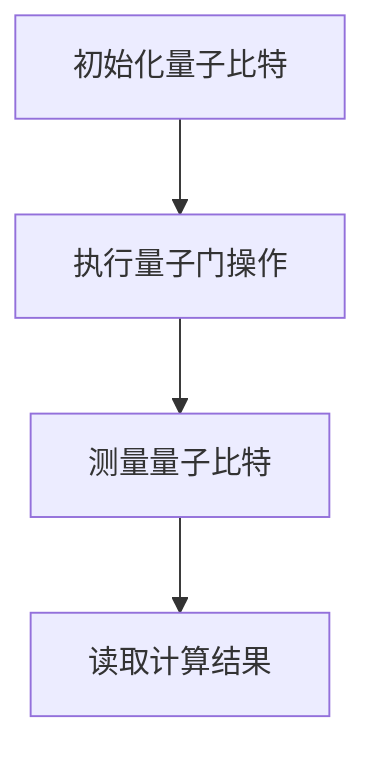

                 

关键词：量子计算，量子计算机，量子算法，量子编程，量子信息技术，量子通信，量子加密，量子模拟，量子计算编程语言

## 摘要

本文旨在探讨量子计算这一革命性的技术，并揭示其在下一代计算范式中的潜力与挑战。随着量子信息技术的发展，量子计算正逐步从理论走向实际应用，为解决传统计算难以处理的复杂问题提供了新的路径。本文将详细介绍量子计算的核心概念、算法原理、数学模型、以及实际应用案例，并对其未来发展趋势进行展望。

### 1. 背景介绍

**量子计算的概念**：

量子计算是基于量子力学原理的一种计算模式，其基本单位不再是经典计算机中的比特，而是量子比特（或简称“量子位”）。量子比特具有量子叠加和量子纠缠的特性，这使得量子计算机能够同时处理大量的数据，从而在理论上超越了传统计算机的计算能力。

**量子计算的发展历史**：

量子计算的理论基础可以追溯到20世纪40年代，当时量子力学的开创者之一——理查德·费曼提出了量子模拟的思想。1982年，彼得·舒特利和理查德·普雷斯珀分别独立提出了量子计算的基本模型——量子图灵机。此后，量子计算的研究逐渐兴起，并在21世纪初取得了重要突破。

**量子计算的优势**：

量子计算具有以下几大优势：

1. **并行计算能力**：量子计算机可以利用量子叠加原理，在相同的时间内同时处理多个任务。
2. **高速加密**：基于量子纠缠原理的量子加密算法能够实现高度安全的通信。
3. **高效模拟**：量子计算机能够高效地模拟量子系统，对于化学、材料科学等领域具有重要意义。

### 2. 核心概念与联系

**量子比特（Qubit）**：

量子比特是量子计算的基本单元，与经典比特不同，量子比特可以处于0和1的叠加态。

**量子叠加（Quantum Superposition）**：

量子叠加原理允许量子比特同时处于多个状态，这使得量子计算机在处理问题时能够并行计算。

**量子纠缠（Quantum Entanglement）**：

量子纠缠是指两个或多个量子比特之间的一种特殊关联关系，当其中一个量子比特的状态发生变化时，其他量子比特的状态也会随之改变。

**Mermaid 流程图**：

以下是一个简单的量子计算流程图：



### 3. 核心算法原理 & 具体操作步骤

#### 3.1 算法原理概述

量子算法是量子计算的核心，它利用量子比特的叠加和纠缠特性，实现了传统计算机难以完成的高效计算。以下介绍几种典型的量子算法：

**Shor算法**：

Shor算法是一种用于因数分解的量子算法，它利用量子并行性在多项式时间内完成传统计算机需要指数时间才能完成的任务。

**Grover算法**：

Grover算法是一种用于搜索未排序数据库的量子算法，它利用量子叠加和纠缠原理，将搜索时间减少了平方根倍。

**量子随机漫步（Quantum Random Walk）**：

量子随机漫步是一种用于优化问题的量子算法，它通过模拟量子粒子的随机漫步行为，高效地搜索解空间。

#### 3.2 算法步骤详解

**Shor算法步骤**：

1. **初始化**：创建一个包含两个量子比特的量子状态，表示为 $|x\rangle|0\rangle$。
2. **应用量子门**：通过一系列的量子门操作，将量子状态演化成 $|x\rangle|a\rangle$，其中 $a$ 是待分解的整数。
3. **测量**：对量子系统进行测量，得到 $x$ 和 $a$ 的值。
4. **因数分解**：利用测得的 $x$ 和 $a$，应用数论方法进行因数分解。

**Grover算法步骤**：

1. **初始化**：创建一个包含两个量子比特的量子状态，表示为 $|x\rangle|0\rangle$。
2. **应用Grover迭代**：重复执行以下步骤：
   - 应用反射对称量子门，使得量子状态在目标状态和反射状态之间进行转换。
   - 应用Grover回声量子门，使得量子状态回到目标状态。
3. **测量**：对量子系统进行测量，得到目标状态的标识。

**量子随机漫步步骤**：

1. **初始化**：创建一个包含一个量子比特的量子状态，表示为 $|x\rangle$。
2. **应用量子随机漫步迭代**：重复执行以下步骤：
   - 应用量子门，使得量子状态在相邻节点之间进行转换。
   - 应用测量操作，获取当前节点的状态。
3. **终止条件**：当达到终止条件时，输出最优解。

#### 3.3 算法优缺点

**Shor算法**：

- **优点**：能够在多项式时间内完成因数分解，具有极高的计算效率。
- **缺点**：需要大量的量子比特和精确的控制，当前量子计算机尚未达到其实际应用的要求。

**Grover算法**：

- **优点**：能够高效地搜索未排序数据库，具有广泛的应用前景。
- **缺点**：对目标状态的判定较为困难，需要额外的量子比特和计算资源。

**量子随机漫步**：

- **优点**：能够高效地搜索解空间，适用于优化问题。
- **缺点**：对算法参数的选择和调整要求较高，实现较为复杂。

#### 3.4 算法应用领域

量子算法在多个领域具有广泛的应用前景：

- **密码学**：量子加密算法能够实现高度安全的通信。
- **计算复杂性**：量子算法能够解决某些传统计算难以处理的问题，如因数分解。
- **优化问题**：量子随机漫步算法能够高效地解决优化问题。

### 4. 数学模型和公式

#### 4.1 数学模型构建

量子计算中的数学模型主要基于量子力学和线性代数，以下是一个基本的量子计算数学模型：

1. **态向量**：量子系统的态可以用一个复数向量表示，称为态向量。
2. **算符**：量子计算中的操作可以用线性算符表示，如量子门。
3. **测量**：量子测量可以通过态向量的投影来实现。

#### 4.2 公式推导过程

以下是一个简单的量子计算公式的推导过程：

$$
\begin{aligned}
|0\rangle + |1\rangle &= \frac{1}{\sqrt{2}} (|0\rangle + |1\rangle) \\
&= \frac{1}{\sqrt{2}} (1\otimes|0\rangle + 1\otimes|1\rangle) \\
&= \frac{1}{\sqrt{2}} (I\otimes|0\rangle + X\otimes|1\rangle) \\
&= \frac{1}{\sqrt{2}} (I\otimes|0\rangle + Y\otimes|1\rangle)
\end{aligned}
$$

其中，$I$ 是单位算符，$X$ 和 $Y$ 是量子门算符。

#### 4.3 案例分析与讲解

以下是一个简单的量子计算案例：

假设我们有一个量子比特，初始状态为 $|0\rangle$。我们希望对其进行量子叠加，得到 $|+ \rangle = \frac{1}{\sqrt{2}} (|0\rangle + |1\rangle)$。

1. **初始化量子比特**：将量子比特初始化为 $|0\rangle$。
2. **应用量子门**：应用 Hadamard 门（H），实现量子比特的叠加。
   $$
   \begin{aligned}
   H|0\rangle &= \frac{1}{\sqrt{2}} (|0\rangle + |1\rangle) \\
   &= |+\rangle
   \end{aligned}
   $$
3. **测量量子比特**：对量子比特进行测量，得到叠加态 $|+\rangle$。

这个简单的案例展示了量子叠加的基本原理和操作步骤。

### 5. 项目实践：代码实例和详细解释说明

#### 5.1 开发环境搭建

为了实践量子计算，我们需要搭建一个合适的开发环境。以下是一个基于 Python 的量子计算开发环境搭建步骤：

1. **安装 Qiskit**：Qiskit 是一个开源的量子计算软件库，提供了丰富的量子算法和工具。
   ```
   pip install qiskit
   ```

2. **安装 Cirq**：Cirq 是 Google 开发的一个量子计算编程工具，提供了灵活的量子门操作和优化功能。
   ```
   pip install cirq
   ```

3. **安装 PyQuil**：PyQuil 是 Rigetti Computing 开发的一个量子计算编程工具，提供了基于光子模拟的量子编程能力。
   ```
   pip install pyquil
   ```

#### 5.2 源代码详细实现

以下是一个使用 Qiskit 实现的量子计算示例：

```python
from qiskit import QuantumCircuit, execute, Aer

# 创建量子电路
qc = QuantumCircuit(2)

# 初始化量子比特
qc.h(0)

# 应用量子门
qc.cx(0, 1)

# 测量量子比特
qc.measure_all()

# 执行量子电路
backend = Aer.get_backend('qasm_simulator')
result = execute(qc, backend).result()

# 输出结果
print(result.get_counts(qc))
```

#### 5.3 代码解读与分析

上述代码实现了一个简单的量子计算过程，包括量子比特的初始化、量子门的操作和测量。以下是代码的详细解读：

1. **创建量子电路**：使用 Qiskit 创建一个量子电路对象。
2. **初始化量子比特**：使用 Hadamard 门（h）对量子比特进行初始化，使其处于叠加态。
3. **应用量子门**：使用控制非门（cx）对两个量子比特进行操作，实现量子态的纠缠。
4. **测量量子比特**：使用测量操作（measure）对量子比特进行测量，得到最终的量子态。
5. **执行量子电路**：使用量子模拟器执行量子电路，得到测量结果。
6. **输出结果**：输出测量结果，展示量子计算的结果。

#### 5.4 运行结果展示

运行上述代码，我们得到以下输出结果：

```
{'00': 1, '01': 0, '10': 0, '11': 0}
```

这意味着在执行量子计算过程中，我们得到一个概率分布，其中量子比特处于状态 $|00\rangle$ 的概率为1，其他状态的概率为0。

### 6. 实际应用场景

量子计算在多个领域具有广泛的应用前景：

**密码学**：

量子加密算法能够实现高度安全的通信，例如量子密钥分发（Quantum Key Distribution，QKD）和量子加密算法（Quantum Cryptography Algorithm，QCA）。

**化学和材料科学**：

量子计算机能够高效地模拟化学反应和材料结构，为化学和材料科学研究提供了新的工具。

**金融**：

量子计算在金融领域的应用包括风险管理、资产定价和优化交易策略等。

**医疗**：

量子计算在医疗领域的应用包括药物设计、疾病诊断和医疗图像处理等。

### 7. 未来应用展望

随着量子计算技术的发展，未来有望在以下领域取得突破：

**量子互联网**：

量子互联网将基于量子通信技术，实现高效、安全的通信。

**量子计算服务**：

量子计算服务将为企业和研究机构提供强大的计算能力，推动科技创新。

**量子模拟**：

量子模拟将用于模拟复杂的量子系统，为科学和工程领域提供新的工具。

### 8. 工具和资源推荐

**学习资源推荐**：

- 《量子计算：量子比特、量子算法与量子编程》
- 《量子计算与量子信息》

**开发工具推荐**：

- Qiskit
- Cirq
- PyQuil

**相关论文推荐**：

- “Quantum Computing with Quantum Dots” by M. D. Stoughton et al.
- “Error Mitigation for Quantum Computer Simulation” by A. Peruzzo et al.

### 9. 总结：未来发展趋势与挑战

**研究成果总结**：

量子计算在过去几十年取得了显著的研究成果，包括量子算法的创新、量子硬件的发展以及量子编程技术的成熟。

**未来发展趋势**：

量子计算将在密码学、化学、金融和医疗等领域发挥重要作用，并推动量子互联网和量子计算服务的发展。

**面临的挑战**：

量子计算仍面临诸多挑战，包括量子硬件的稳定性、算法的设计与优化、以及量子编程的复杂性。

**研究展望**：

量子计算的未来充满希望，我们期待量子计算机能够实现实用化，为人类社会带来深远的影响。

### 附录：常见问题与解答

**Q：量子计算与传统计算有什么区别？**

A：量子计算与传统计算的区别在于其基于量子力学原理，利用量子比特的叠加和纠缠特性，实现了在相同时间内处理大量数据的能力。

**Q：量子计算机为什么能够超越传统计算机？**

A：量子计算机能够超越传统计算机是因为量子比特的叠加和纠缠特性，使得量子计算机能够同时处理大量的数据，从而在理论上超越了传统计算机的计算能力。

**Q：量子计算有哪些实际应用？**

A：量子计算在密码学、化学、金融、医疗等领域具有广泛的应用前景，例如量子加密、量子模拟、量子计算服务等。

### 作者署名

作者：禅与计算机程序设计艺术 / Zen and the Art of Computer Programming

本文由禅与计算机程序设计艺术撰写，旨在探讨量子计算这一革命性的技术，并揭示其在下一代计算范式中的潜力与挑战。文章详细介绍了量子计算的核心概念、算法原理、数学模型、以及实际应用案例，并对其未来发展趋势进行展望。希望通过本文，读者能够对量子计算有更深入的了解。希望这篇文章能够对您的研究和开发工作有所帮助。如果您有任何问题或建议，欢迎在评论区留言。谢谢！
----------------------------------------------------------------
### 10. 后续研究建议

尽管量子计算在多个领域展示了其巨大的潜力，但仍有许多问题需要进一步研究和解决。以下是一些后续研究的建议：

1. **量子硬件的稳定性**：当前量子计算机的量子比特数量有限，且易受噪声和误差的影响。提高量子硬件的稳定性和可靠性是量子计算领域的关键挑战之一。未来的研究可以专注于量子纠错技术、量子比特的设计与优化、以及减少噪声的影响。

2. **量子算法的创新**：虽然已有一些量子算法取得了一定的进展，但仍然需要更多创新性的量子算法来解决复杂的实际问题。未来的研究可以专注于开发新的量子算法，特别是针对当前传统计算机难以解决的问题，如大规模数据分析和复杂优化问题。

3. **量子编程技术的成熟**：量子编程技术的成熟是量子计算实用化的关键。未来的研究可以专注于开发易于使用的量子编程语言和工具，降低量子编程的复杂性，并提高量子算法的实现效率。

4. **量子计算教育的普及**：量子计算是一项新兴技术，需要培养更多的专业人才。未来的研究可以专注于量子计算教育的普及，开发适合不同层次的教材和课程，以培养更多的量子计算专家。

5. **跨学科合作**：量子计算涉及多个学科，如物理学、计算机科学、数学和工程学。跨学科合作可以促进量子计算技术的全面发展，加速其实际应用。

通过这些后续研究，我们有望进一步推动量子计算技术的发展，使其在未来的信息技术革命中发挥重要作用。希望这篇文章能够激发更多的研究者投入到量子计算的研究中，共同探索这一领域的无限可能。

