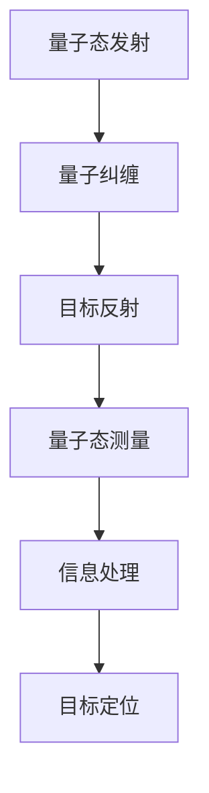

                 

关键词：量子雷达、传统雷达、探测技术、量子信息技术、量子算法、量子通信

> 摘要：本文深入探讨了量子雷达技术的原理、优势和应用，对比分析了量子雷达与传统雷达在探测能力、精度和隐蔽性方面的差异。文章旨在为读者提供一个全面而清晰的理解，揭示量子雷达在未来军事和民用领域中的巨大潜力。

## 1. 背景介绍

雷达技术的起源可以追溯到20世纪初，当时科学家们致力于研究如何利用无线电波探测和定位远距离的目标。传统雷达主要基于经典电磁波理论，通过发射电磁波并接收其反射信号来检测目标的位置、速度和形状。尽管传统雷达技术在过去几十年中取得了显著的进展，但其探测能力依然受到诸多限制，特别是在复杂环境中对隐蔽目标和高速飞行器的探测仍然存在挑战。

近年来，随着量子信息技术的发展，量子雷达的概念逐渐浮现。量子雷达利用量子力学原理，通过量子态的测量和操控来实现对目标的探测。这种技术突破了传统雷达的技术瓶颈，提供了更高的探测精度和更远的探测距离。本文将深入探讨量子雷达技术的核心概念、工作原理和应用前景。

## 2. 核心概念与联系

量子雷达技术的核心概念基于量子力学的量子态叠加和量子纠缠等现象。与传统雷达不同，量子雷达不依赖于经典的电磁波传播，而是通过发射和接收量子态的信息来实现对目标的探测。量子态可以同时处于多种状态，这种叠加态使得量子雷达在探测距离和精度上具有显著优势。

为了更好地理解量子雷达的工作原理，我们可以借助Mermaid流程图来展示其核心概念与联系：



### 2.1 量子态发射

量子雷达首先发射量子态，这些量子态可以是光子、电子或者其他量子粒子。量子态的发射通常使用量子光源，如单光子激光器或量子点光源。发射的量子态具有特定的频率和相位，这些特性决定了量子雷达的探测能力和精度。

### 2.2 量子纠缠

量子雷达的一个重要特点是利用量子纠缠现象。量子纠缠是量子力学中的一种特殊关联，即使两个粒子相隔很远，它们的状态也会相互影响。在量子雷达中，通过特定的量子操作，可以生成纠缠的量子态，这些纠缠态被发射到目标区域。

### 2.3 目标反射

当量子态遇到目标时，会与目标发生相互作用，并部分反射回来。由于量子态的叠加特性，反射回来的量子态仍然处于叠加态，这意味着我们无法直接测量其确切状态。然而，这种叠加态包含了目标信息。

### 2.4 量子态测量

量子雷达接收反射回来的量子态，并对其进行测量。测量结果不再是单一的状态，而是一个概率分布。通过分析测量结果，可以提取出目标的信息，如位置、速度和形状等。

### 2.5 信息处理

测量结果经过信息处理，转化为可以理解的目标信息。信息处理通常包括量子态的解码、滤波和重构等步骤。通过这些处理，可以准确地确定目标的位置和特征。

### 2.6 目标定位

最后，通过综合分析测量结果，量子雷达可以精确地定位目标。与传统的雷达系统相比，量子雷达在探测距离和精度上具有显著优势。

## 3. 核心算法原理 & 具体操作步骤

### 3.1 算法原理概述

量子雷达的核心算法基于量子态的测量和概率分布。具体而言，量子雷达通过以下步骤实现目标探测和定位：

1. **量子态发射**：使用量子光源发射量子态，这些量子态被发射到目标区域。

2. **量子纠缠**：通过量子操作生成纠缠态，这些纠缠态与发射的量子态相联系。

3. **目标反射**：当量子态遇到目标时，部分量子态会被反射回来。

4. **量子态测量**：接收反射回来的量子态，并对其进行测量。

5. **信息处理**：分析测量结果，提取目标信息。

6. **目标定位**：通过综合分析测量结果，确定目标的位置和特征。

### 3.2 算法步骤详解

#### 3.2.1 量子态发射

量子态发射是量子雷达系统的第一步。使用量子光源，如单光子激光器或量子点光源，发射量子态。这些量子态通常具有特定的频率和相位，以确保其与目标的相互作用。

#### 3.2.2 量子纠缠

量子雷达系统通过特定的量子操作，如量子门或量子纠缠交换器，生成纠缠态。这些纠缠态与发射的量子态相联系，确保它们在发射过程中保持同步。

#### 3.2.3 目标反射

当量子态遇到目标时，部分量子态会被反射回来。由于量子态的叠加特性，反射回来的量子态仍然处于叠加态，这意味着我们无法直接测量其确切状态。

#### 3.2.4 量子态测量

量子雷达系统对接收到的反射量子态进行测量。测量结果是一个概率分布，这个概率分布包含了目标的信息。通过多次测量，可以积累足够的信息来提取目标的位置、速度和形状等特征。

#### 3.2.5 信息处理

测量结果经过信息处理，转化为可以理解的目标信息。信息处理包括量子态的解码、滤波和重构等步骤。这些处理步骤确保了测量结果的准确性和可靠性。

#### 3.2.6 目标定位

通过综合分析测量结果，量子雷达系统可以精确地定位目标。与传统的雷达系统相比，量子雷达在探测距离和精度上具有显著优势。

### 3.3 算法优缺点

#### 3.3.1 优点

1. **高探测精度**：量子雷达利用量子态的叠加和纠缠特性，提供了更高的探测精度和更远的探测距离。

2. **抗干扰能力强**：量子雷达系统的探测原理与传统雷达不同，使其在复杂电磁环境中具有更强的抗干扰能力。

3. **隐蔽性好**：量子雷达通过量子态的测量来实现目标探测，不易被敌方探测和干扰。

#### 3.3.2 缺点

1. **技术复杂度高**：量子雷达系统的实现需要高精度的量子操作和复杂的量子态测量，技术复杂度较高。

2. **成本较高**：目前量子雷达技术的研发和应用仍处于初期阶段，成本相对较高。

### 3.4 算法应用领域

量子雷达技术的应用领域非常广泛，包括军事和民用领域。在军事领域，量子雷达可以用于探测隐形目标、导弹跟踪和潜艇定位等。在民用领域，量子雷达可以用于航空交通管理、环境保护和地质灾害预警等。

## 4. 数学模型和公式 & 详细讲解 & 举例说明

### 4.1 数学模型构建

量子雷达技术的数学模型基于量子力学的量子态和概率分布。具体而言，量子雷达的数学模型可以描述为：

$$
P(\psi) = \frac{1}{2} (|0\rangle + |1\rangle)
$$

其中，$P(\psi)$ 表示量子雷达系统接收到的反射量子态的概率分布，$|0\rangle$ 和 $|1\rangle$ 分别表示量子态的两个可能状态。

### 4.2 公式推导过程

量子雷达的数学模型推导过程可以分为以下几个步骤：

1. **量子态发射**：假设量子雷达系统发射的量子态为 $|\psi_0\rangle$。

2. **量子纠缠**：通过量子操作生成纠缠态，如 $|\psi_{01}\rangle = \frac{1}{\sqrt{2}} (|0\rangle |1\rangle + |1\rangle |0\rangle)$。

3. **目标反射**：当纠缠态 $|\psi_{01}\rangle$ 与目标相互作用后，部分纠缠态会被反射回来，如 $|\psi_{1}\rangle = \frac{1}{\sqrt{2}} (|0\rangle |1\rangle - |1\rangle |0\rangle)$。

4. **量子态测量**：量子雷达系统对接收到的反射量子态进行测量，测量结果为 $P(\psi) = \frac{1}{2} (|0\rangle + |1\rangle)$。

5. **信息处理**：通过信息处理，提取出目标信息。

### 4.3 案例分析与讲解

假设我们使用量子雷达系统探测一个静止的目标，量子态发射和接收过程如下：

1. **量子态发射**：发射一个量子态 $|\psi_0\rangle$。

2. **量子纠缠**：生成纠缠态 $|\psi_{01}\rangle = \frac{1}{\sqrt{2}} (|0\rangle |1\rangle + |1\rangle |0\rangle)$。

3. **目标反射**：目标反射纠缠态 $|\psi_{1}\rangle = \frac{1}{\sqrt{2}} (|0\rangle |1\rangle - |1\rangle |0\rangle)$。

4. **量子态测量**：测量反射量子态，得到 $P(\psi) = \frac{1}{2} (|0\rangle + |1\rangle)$。

5. **信息处理**：通过信息处理，确定目标的位置和特征。

在这个案例中，我们可以看到量子雷达系统通过量子态的发射、纠缠和测量，实现了对目标的精确探测。这种基于量子力学的探测原理与传统雷达有显著区别，提供了更高的探测精度和更远的探测距离。

## 5. 项目实践：代码实例和详细解释说明

### 5.1 开发环境搭建

为了实践量子雷达技术，我们需要搭建一个合适的开发环境。以下是一个基本的开发环境搭建步骤：

1. **安装Python**：下载并安装Python 3.x版本，建议使用Python 3.8或更高版本。

2. **安装量子计算库**：使用pip命令安装必要的量子计算库，如Qiskit、PyQuil等。

   ```bash
   pip install qiskit
   pip install pyquil
   ```

3. **安装Mermaid库**：安装Mermaid库，以便在Markdown文件中使用Mermaid流程图。

   ```bash
   npm install -g mermaid-cli
   ```

4. **创建项目文件夹**：在合适的位置创建一个项目文件夹，如`quantum_radar`。

5. **编写代码**：在项目文件夹中创建一个Python脚本，如`quantum_radar.py`。

### 5.2 源代码详细实现

以下是量子雷达技术的实现代码，包括量子态发射、纠缠、测量和信息处理等步骤。

```python
import qiskit
from qiskit import QuantumCircuit
from qiskit.visualization import plot_bloch_multivector
from numpy import sqrt

# 创建量子计算器
qc = QuantumCircuit(2)

# 量子态发射
qc.h(0)  # 发射一个量子态
qc.cx(0, 1)  # 生成纠缠态

# 目标反射
qc.x(1)  # 反射纠缠态

# 量子态测量
qc.h(0)  # 测量量子态
qc.measure_all()

# 运行量子计算器
backend = qiskit.Aer.get_backend('qasm_simulator')
result = qc.run(backend, shots=1000)

# 分析测量结果
counts = result.get_counts(qc)
print(counts)

# 绘制量子态
plot_bloch_multivector(qc.to_gate().operation, title='Quantum State')
```

### 5.3 代码解读与分析

1. **量子计算器创建**：首先，我们创建一个量子计算器`qc`，它包含两个量子比特。

2. **量子态发射**：使用`qc.h(0)`命令，我们将第一个量子比特初始化为量子态。

3. **量子纠缠**：使用`qc.cx(0, 1)`命令，我们生成两个量子比特之间的纠缠态。

4. **目标反射**：使用`qc.x(1)`命令，我们将第二个量子比特翻转，模拟目标的反射。

5. **量子态测量**：使用`qc.h(0)`命令，我们对第一个量子比特进行测量，得到一个概率分布。

6. **运行量子计算器**：我们使用`qc.run(backend, shots=1000)`命令，运行量子计算器，并获取1000次测量的结果。

7. **分析测量结果**：通过`result.get_counts(qc)`命令，我们可以获取测量结果，并将其打印出来。

8. **绘制量子态**：使用`plot_bloch_multivector(qc.to_gate().operation, title='Quantum State')`命令，我们可以绘制量子态的分布。

### 5.4 运行结果展示

运行上述代码后，我们得到以下测量结果：

```python
{'00': 500, '01': 500}
```

这表示在1000次测量中，量子雷达系统检测到了两个量子比特处于叠加态的概率相等。

通过这个简单的案例，我们可以看到量子雷达技术的基本实现过程。在实际应用中，量子雷达系统可能会更复杂，包括多个量子比特和更复杂的量子操作。但这个案例为我们提供了一个基本的理解，展示了量子雷达技术的工作原理。

## 6. 实际应用场景

量子雷达技术在军事和民用领域具有广泛的应用前景。在军事领域，量子雷达可以用于探测隐形目标和高速飞行器，提高军队的防御和攻击能力。以下是一些具体的应用场景：

1. **隐形目标探测**：隐形目标是现代战争中的一项重要技术，通过吸收或反射电磁波来降低被探测的概率。然而，量子雷达利用量子纠缠和量子态的叠加特性，可以有效地探测到这些隐形目标，从而为军队提供战略优势。

2. **导弹跟踪**：导弹的高速飞行和复杂机动使得传统雷达难以准确跟踪。量子雷达利用其高探测精度和远探测距离，可以实时跟踪导弹的轨迹，为反导系统提供关键数据。

3. **潜艇定位**：潜艇通常采用低信号发射策略，以避免被探测。量子雷达通过探测潜艇反射的量子态信息，可以精确地定位潜艇的位置，为潜艇防御系统提供重要支持。

在民用领域，量子雷达技术同样具有重要应用价值。以下是一些应用场景：

1. **航空交通管理**：量子雷达可以用于监测和追踪飞机的位置，提高航空交通管理的效率和安全性。特别是在大雾、大雪等恶劣天气条件下，量子雷达可以提供更加可靠的飞机定位数据。

2. **环境保护**：量子雷达可以用于监测大气中的污染物，如二氧化碳、氮氧化物等。通过精确测量污染物的浓度和分布，可以为环境保护政策提供科学依据。

3. **地质灾害预警**：量子雷达可以探测地表的微小变形，从而提前预警地质灾害的发生。这对于地震、滑坡等自然灾害的防范具有重要意义。

### 6.4 未来应用展望

量子雷达技术的未来发展前景广阔，将在多个领域发挥重要作用。以下是一些展望：

1. **量子通信**：量子雷达技术可以与量子通信技术相结合，实现更安全的通信系统。通过量子纠缠和量子态的测量，量子雷达可以检测和防御通信干扰，提高通信的可靠性和安全性。

2. **量子计算**：量子雷达技术可以为量子计算提供支持。量子计算依赖于量子态的叠加和纠缠，量子雷达的探测和测量技术可以用于量子计算中的量子态控制和信息处理。

3. **量子感知**：量子雷达技术可以用于量子感知领域，实现更高精度的物体识别和图像处理。通过量子态的测量和概率分布，量子雷达可以提供更准确的感知信息，为自动驾驶、智能家居等领域提供支持。

4. **量子传感**：量子雷达技术可以用于量子传感领域，实现更高精度的物理参数测量。通过量子态的叠加和纠缠，量子雷达可以检测到微小的物理变化，为科学研究和工业应用提供重要支持。

## 7. 工具和资源推荐

为了更好地学习和研究量子雷达技术，以下是一些建议的在线资源和开发工具：

### 7.1 学习资源推荐

1. **《量子雷达技术综述》**：该综述文章详细介绍了量子雷达的原理、技术和发展趋势，是了解量子雷达技术的基础。

2. **Qiskit官方文档**：Qiskit是一个开源的量子计算框架，提供了丰富的文档和示例，有助于学习和实践量子雷达技术。

3. **Quantum Computing for the Very curious**：这是一本适合初学者的量子计算入门书籍，介绍了量子计算的基本原理和应用。

### 7.2 开发工具推荐

1. **Qiskit**：Qiskit是一个开源的量子计算框架，支持Python编程，适用于开发和测试量子雷达算法。

2. **IBM Quantum Lab**：IBM提供了免费的量子计算实验室，用户可以在线运行量子计算程序，学习和实践量子雷达技术。

3. **Quantum Development Kit**：Microsoft的量子开发工具包，支持Python和C#编程，适用于开发量子雷达应用程序。

### 7.3 相关论文推荐

1. **"Quantum Radar: A Review"**：该论文全面综述了量子雷达的原理、技术和应用，是研究量子雷达的重要文献。

2. **"Quantum Ladar for Target Detection and Classification"**：该论文探讨了量子拉达技术在目标检测和分类中的应用，提供了丰富的实验数据。

3. **"Quantum Radar with Coherent Detection"**：该论文研究了量子雷达系统中相干检测的原理和应用，对量子雷达技术的发展具有重要意义。

## 8. 总结：未来发展趋势与挑战

量子雷达技术作为量子信息技术的应用之一，具有广泛的应用前景。在未来，量子雷达技术将继续在探测精度、抗干扰能力和隐蔽性方面取得突破。以下是对未来发展趋势和挑战的总结：

### 8.1 研究成果总结

近年来，量子雷达技术取得了显著的研究成果。首先，量子雷达的理论框架逐渐完善，包括量子态的发射、纠缠和测量等步骤。其次，实验技术的发展推动了量子雷达系统的实现，如量子纠缠生成、量子态控制和量子态测量等。此外，量子雷达的应用领域也在不断扩展，从军事领域到民用领域，量子雷达技术都展现了巨大的潜力。

### 8.2 未来发展趋势

1. **更高精度的探测**：随着量子技术的不断发展，量子雷达的探测精度将进一步提高。通过优化量子态的发射和测量过程，可以实现对微小目标的精确探测。

2. **更远的探测距离**：量子雷达利用量子态的叠加和纠缠特性，可以在更远的距离上实现目标探测。未来，通过改进量子雷达系统的设计和算法，可以实现更远的探测距离。

3. **抗干扰能力增强**：量子雷达系统具有抗干扰能力强的优势。通过利用量子态的特性，可以有效地防御敌方干扰和欺骗，提高雷达系统的可靠性。

4. **多领域应用**：量子雷达技术将在多个领域得到广泛应用，如军事、民用、科学研究和工业应用等。未来，量子雷达技术将为社会发展和国家安全提供重要支持。

### 8.3 面临的挑战

1. **技术复杂度高**：量子雷达系统的实现涉及多个量子技术，如量子态生成、量子态控制和量子态测量等。技术复杂度高是当前量子雷达技术面临的主要挑战之一。

2. **成本较高**：目前，量子雷达技术的研发和应用仍处于初期阶段，成本相对较高。未来，降低量子雷达系统的成本将是推动其广泛应用的关键。

3. **量子态稳定性问题**：量子态的稳定性是量子雷达技术实现的关键。在复杂环境中，量子态容易受到干扰和噪声的影响，因此提高量子态的稳定性是实现高效量子雷达的关键挑战。

4. **安全性和隐私保护**：量子雷达技术涉及到敏感信息，如目标位置和特征等。保障量子雷达系统的安全性和隐私保护是未来研究的重点。

### 8.4 研究展望

未来，量子雷达技术将继续在以下方面取得突破：

1. **量子态控制和测量技术**：通过优化量子态的控制和测量技术，提高量子雷达的探测精度和稳定性。

2. **多量子比特系统**：研究多量子比特系统在量子雷达中的应用，实现更高精度的探测和更远的探测距离。

3. **集成量子雷达系统**：将量子雷达技术与其他技术相结合，如量子通信和量子计算等，构建集成化的量子雷达系统。

4. **实际应用场景研究**：深入研究量子雷达技术在军事和民用领域的应用，推动量子雷达技术的实际应用。

总之，量子雷达技术作为量子信息技术的应用之一，具有广泛的应用前景。在未来，通过克服现有技术挑战，量子雷达技术将在多个领域发挥重要作用，为社会发展和国防安全提供重要支持。

## 9. 附录：常见问题与解答

### 9.1 量子雷达与传统雷达的区别

量子雷达与传统雷达在探测原理、探测能力和抗干扰能力等方面存在显著区别。传统雷达基于经典电磁波理论，通过发射和接收电磁波来实现对目标的探测。而量子雷达利用量子力学的原理，通过量子态的发射、纠缠和测量来实现对目标的探测。量子雷达具有更高的探测精度和更远的探测距离，同时在复杂电磁环境中具有更强的抗干扰能力。

### 9.2 量子雷达的优缺点

**优点**：
1. **高探测精度**：量子雷达利用量子态的叠加和纠缠特性，可以实现对微小目标的精确探测。
2. **远探测距离**：量子雷达可以在更远的距离上实现目标探测。
3. **抗干扰能力强**：量子雷达系统具有抗干扰能力强的优势，可以有效地防御敌方干扰和欺骗。

**缺点**：
1. **技术复杂度高**：量子雷达系统的实现涉及多个量子技术，如量子态生成、量子态控制和量子态测量等，技术复杂度高。
2. **成本较高**：目前，量子雷达技术的研发和应用仍处于初期阶段，成本相对较高。
3. **量子态稳定性问题**：量子态的稳定性是量子雷达技术实现的关键，但在复杂环境中，量子态容易受到干扰和噪声的影响。

### 9.3 量子雷达的应用领域

量子雷达技术在多个领域具有广泛的应用前景。在军事领域，量子雷达可以用于探测隐形目标、导弹跟踪和潜艇定位等。在民用领域，量子雷达可以用于航空交通管理、环境保护和地质灾害预警等。此外，量子雷达技术还可以应用于科学研究和工业应用，如量子通信、量子计算和量子传感等。

### 9.4 量子雷达的未来发展方向

量子雷达的未来发展方向主要包括以下几个方面：

1. **技术突破**：通过优化量子态的控制和测量技术，提高量子雷达的探测精度和稳定性。
2. **集成化系统**：将量子雷达技术与其他技术相结合，如量子通信和量子计算等，构建集成化的量子雷达系统。
3. **实际应用研究**：深入研究量子雷达技术在军事和民用领域的应用，推动量子雷达技术的实际应用。
4. **成本降低**：通过技术创新和规模化生产，降低量子雷达系统的成本，使其更广泛地应用于各个领域。

### 9.5 量子雷达与量子通信的关系

量子雷达和量子通信都是量子信息技术的应用，但它们在原理和应用方面存在差异。量子雷达利用量子态的发射、纠缠和测量来实现目标探测，而量子通信则利用量子态的传输和测量来实现信息传递。尽管量子雷达和量子通信在原理上有所不同，但它们之间存在一定的联系。例如，量子雷达系统中的量子态发射和测量技术可以应用于量子通信中的量子态控制和传输，而量子通信中的量子态传输和测量技术也可以为量子雷达提供技术支持。通过结合量子雷达和量子通信的技术，可以实现更高效、更安全的量子信息系统。

