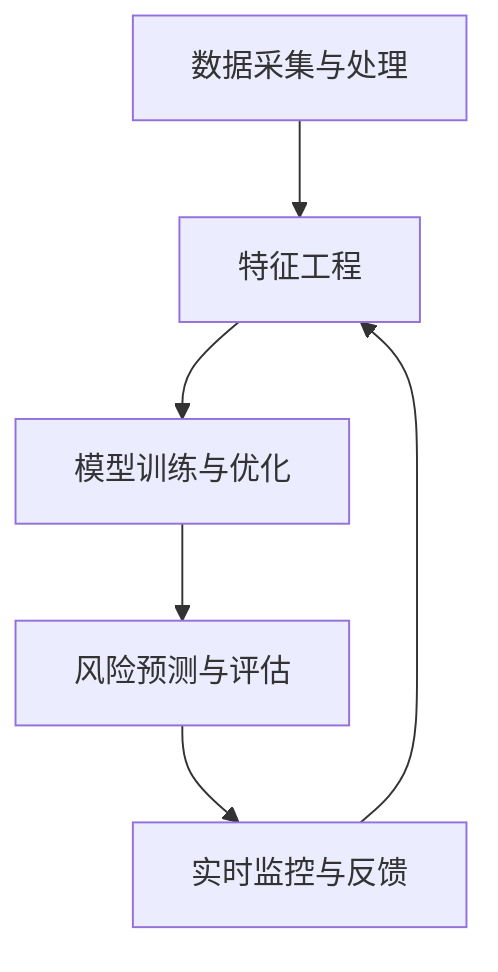

                 

关键词：金融大模型，风控，投资决策，人工智能，智能助手，机器学习，数据挖掘，深度学习

> 摘要：随着金融市场的日益复杂，金融机构面临着越来越多的风险和挑战。本文将介绍一种基于人工智能的金融大模型，该模型能够有效提升金融风控和投资决策的能力，为金融机构提供智能化的辅助工具。本文将深入探讨金融大模型的原理、构建方法、应用领域以及未来发展趋势。

## 1. 背景介绍

金融行业作为现代经济体系的重要组成部分，其稳定运行对社会经济的健康有着重要影响。然而，随着金融市场的规模不断扩大和金融产品的多样化，金融机构面临着日益复杂的风险和挑战。传统的金融风控和投资决策方法往往依赖于经验和人工分析，存在反应速度慢、效率低下等问题。为了应对这些挑战，人工智能技术在金融领域的应用越来越受到重视。

金融大模型是指利用人工智能技术，特别是机器学习和深度学习，对海量金融数据进行训练和分析，从而构建出一个能够模拟金融市场规律、预测风险和辅助投资决策的智能系统。金融大模型具有高度的自适应性和灵活性，能够实时更新和优化，从而更好地应对金融市场的变化。

本文将围绕金融大模型展开讨论，介绍其核心概念、构建方法、数学模型、应用领域以及未来发展趋势。通过本文的阅读，读者将能够了解金融大模型的基本原理和应用场景，并认识到其在金融风控和投资决策中的重要作用。

## 2. 核心概念与联系

### 2.1 金融大模型定义

金融大模型是一种集成了多种人工智能算法和技术的大规模数据处理和分析系统，旨在提供高效、精准的金融风险控制和投资决策支持。该模型通过对海量金融数据的挖掘和分析，识别出潜在的风险因素和投资机会，为金融机构提供智能化的决策支持。

### 2.2 关键技术

金融大模型的关键技术包括：

1. **机器学习算法**：用于从数据中学习和提取规律，如回归分析、分类算法、聚类算法等。
2. **深度学习**：通过多层神经网络结构，对复杂非线性关系进行建模和预测。
3. **数据挖掘**：用于发现数据中的隐含模式和关联性，支持风险识别和投资策略优化。
4. **自然语言处理**：用于分析文本数据，提取关键信息，支持投资报告生成和风险评估。
5. **实时数据处理**：通过流处理技术，实现金融数据的实时分析和更新，提高模型的响应速度。

### 2.3 架构与流程

金融大模型的架构通常包括以下几个核心模块：

1. **数据采集与处理**：从多个数据源（如交易数据、财务报表、新闻报道等）收集数据，并进行数据清洗、去重、归一化等预处理操作。
2. **特征工程**：根据业务需求和模型特点，提取和构造有助于预测和分类的特征。
3. **模型训练与优化**：利用机器学习和深度学习算法，对特征数据进行训练，优化模型参数。
4. **风险预测与评估**：利用训练好的模型，对潜在风险进行预测和评估，为风险控制和投资决策提供依据。
5. **实时监控与反馈**：通过实时数据处理技术，持续监控市场变化，调整模型参数和策略。

图 1 展示了金融大模型的基本架构和流程：



## 3. 核心算法原理 & 具体操作步骤

### 3.1 算法原理概述

金融大模型的核心算法主要基于机器学习和深度学习，包括以下几个步骤：

1. **数据预处理**：通过对原始数据进行清洗、去噪、归一化等处理，提高数据质量。
2. **特征提取**：根据业务需求，从数据中提取有助于预测和分类的特征。
3. **模型训练**：利用特征数据训练机器学习或深度学习模型，优化模型参数。
4. **模型评估**：通过交叉验证和测试集评估模型性能，调整模型参数。
5. **风险预测与投资决策**：利用训练好的模型进行风险预测和投资决策。

### 3.2 算法步骤详解

#### 3.2.1 数据预处理

数据预处理是金融大模型构建的基础，其主要包括以下步骤：

1. **数据清洗**：去除数据中的缺失值、异常值和重复记录。
2. **去噪**：对噪声数据进行处理，提高数据质量。
3. **归一化**：将不同数据量级的数据进行归一化处理，使其在同一量级范围内。

#### 3.2.2 特征提取

特征提取是金融大模型的关键步骤，其主要包括以下步骤：

1. **特征选择**：根据业务需求和数据特点，选择对预测目标有显著影响的特征。
2. **特征构造**：通过数据变换和组合，构造新的特征，提高模型预测性能。

#### 3.2.3 模型训练

模型训练是金融大模型的核心步骤，其主要包括以下步骤：

1. **算法选择**：根据业务需求，选择合适的机器学习或深度学习算法。
2. **模型优化**：通过调整模型参数，优化模型性能。
3. **交叉验证**：通过交叉验证，评估模型性能，避免过拟合。

#### 3.2.4 模型评估

模型评估是金融大模型构建的重要环节，其主要包括以下步骤：

1. **测试集评估**：将模型在测试集上进行评估，评估模型性能。
2. **性能指标**：根据业务需求，选择合适的性能指标，如准确率、召回率、F1值等。
3. **模型调整**：根据评估结果，调整模型参数，优化模型性能。

#### 3.2.5 风险预测与投资决策

风险预测与投资决策是金融大模型的应用目标，其主要包括以下步骤：

1. **风险预测**：利用训练好的模型，对潜在风险进行预测。
2. **投资决策**：根据风险预测结果，制定投资决策策略。
3. **实时监控**：通过实时数据处理技术，持续监控市场变化，调整投资决策。

### 3.3 算法优缺点

#### 优点

1. **高效性**：金融大模型能够快速处理海量数据，提供实时风险预测和投资决策支持。
2. **精准性**：通过机器学习和深度学习算法，金融大模型能够准确识别潜在风险和投资机会。
3. **灵活性**：金融大模型能够根据市场变化，实时调整模型参数和策略。

#### 缺点

1. **数据依赖性**：金融大模型的性能高度依赖于数据质量，数据质量差可能导致模型效果不佳。
2. **计算资源需求**：金融大模型构建和运行需要大量计算资源，对硬件设备要求较高。
3. **算法复杂性**：金融大模型涉及的算法复杂，需要专业知识和技能。

### 3.4 算法应用领域

金融大模型的应用领域广泛，主要包括以下几个方面：

1. **风险控制**：金融大模型能够对潜在风险进行预测和评估，支持金融机构进行风险控制和资产配置。
2. **投资决策**：金融大模型能够提供投资建议，支持金融机构进行科学投资决策。
3. **金融监管**：金融大模型能够对金融机构进行实时监控和风险评估，支持金融监管机构进行风险监测和监管。
4. **金融创新**：金融大模型能够发现新的投资机会和商业模式，支持金融机构进行金融创新。

## 4. 数学模型和公式 & 详细讲解 & 举例说明

### 4.1 数学模型构建

金融大模型通常采用以下数学模型进行构建：

1. **线性回归模型**：用于预测金融市场的价格变化。
2. **逻辑回归模型**：用于预测金融风险的概率。
3. **神经网络模型**：用于复杂非线性关系的建模和预测。

#### 4.1.1 线性回归模型

线性回归模型是一种简单的预测模型，其数学公式如下：

\[ Y = \beta_0 + \beta_1 \cdot X + \epsilon \]

其中，\( Y \) 是预测目标，\( X \) 是自变量，\( \beta_0 \) 和 \( \beta_1 \) 是模型参数，\( \epsilon \) 是误差项。

#### 4.1.2 逻辑回归模型

逻辑回归模型是一种分类模型，其数学公式如下：

\[ P(Y=1) = \frac{1}{1 + e^{-(\beta_0 + \beta_1 \cdot X)}} \]

其中，\( P(Y=1) \) 是目标为 1 的概率，\( \beta_0 \) 和 \( \beta_1 \) 是模型参数。

#### 4.1.3 神经网络模型

神经网络模型是一种复杂的非线性模型，其数学公式如下：

\[ Y = \sigma(\beta_0 + \sum_{i=1}^{n} \beta_i \cdot X_i) \]

其中，\( Y \) 是预测结果，\( \sigma \) 是激活函数，\( \beta_0 \) 和 \( \beta_i \) 是模型参数，\( X_i \) 是输入特征。

### 4.2 公式推导过程

#### 4.2.1 线性回归模型

线性回归模型的公式推导如下：

1. **目标函数**：最小化误差平方和

\[ J(\theta) = \frac{1}{2m} \sum_{i=1}^{m} (h_\theta(x^{(i)}) - y^{(i)})^2 \]

其中，\( m \) 是样本数量，\( h_\theta(x) \) 是预测值，\( y \) 是真实值。

2. **梯度下降**：求解最小化目标函数的参数

\[ \theta_j := \theta_j - \alpha \frac{\partial J(\theta)}{\partial \theta_j} \]

其中，\( \alpha \) 是学习率。

#### 4.2.2 逻辑回归模型

逻辑回归模型的公式推导如下：

1. **目标函数**：最小化损失函数

\[ J(\theta) = -\frac{1}{m} \sum_{i=1}^{m} [y^{(i)} \cdot \log(h_\theta(x^{(i)})) + (1 - y^{(i)}) \cdot \log(1 - h_\theta(x^{(i)}))] \]

2. **梯度下降**：求解最小化目标函数的参数

\[ \theta_j := \theta_j - \alpha \frac{\partial J(\theta)}{\partial \theta_j} \]

#### 4.2.3 神经网络模型

神经网络模型的公式推导如下：

1. **前向传播**：计算输入和输出之间的关系

\[ z_i = \sum_{j=1}^{n} \theta_{ji} \cdot a_{j} + b_i \]

\[ a_i = \sigma(z_i) \]

2. **反向传播**：计算损失函数对参数的偏导数

\[ \delta_{ij} = (h_\theta(x) - y) \cdot \sigma'(z_i) \]

\[ \theta_{ij} := \theta_{ij} - \alpha \cdot \delta_{ij} \cdot a_{j} \]

### 4.3 案例分析与讲解

#### 4.3.1 案例背景

假设我们要预测某支股票的未来价格，现有历史交易数据，包括开盘价、收盘价、最高价、最低价等。我们的目标是构建一个金融大模型，预测该股票的未来价格。

#### 4.3.2 数据预处理

1. **数据清洗**：去除缺失值和异常值，对数据进行归一化处理。
2. **特征提取**：根据业务需求，提取对预测目标有显著影响的特征，如开盘价、收盘价、涨跌幅等。

#### 4.3.3 模型训练

1. **选择模型**：选择线性回归模型进行训练。
2. **参数优化**：利用梯度下降算法，优化模型参数。

#### 4.3.4 模型评估

1. **交叉验证**：利用交叉验证，评估模型性能。
2. **性能指标**：计算模型预测误差，如均方误差（MSE）。

#### 4.3.5 风险预测与投资决策

1. **风险预测**：利用训练好的模型，预测未来价格。
2. **投资决策**：根据预测结果，制定投资策略。

## 5. 项目实践：代码实例和详细解释说明

### 5.1 开发环境搭建

1. **Python环境**：安装Python 3.8及以上版本。
2. **库安装**：安装必要的库，如NumPy、Pandas、Scikit-learn、TensorFlow等。

### 5.2 源代码详细实现

以下是金融大模型的源代码实现：

```python
import numpy as np
import pandas as pd
from sklearn.linear_model import LinearRegression
from sklearn.model_selection import train_test_split
from sklearn.metrics import mean_squared_error

# 数据预处理
def preprocess_data(data):
    # 去除缺失值和异常值
    data = data.dropna()
    # 归一化处理
    data = (data - data.mean()) / data.std()
    return data

# 模型训练
def train_model(X, y):
    model = LinearRegression()
    model.fit(X, y)
    return model

# 模型评估
def evaluate_model(model, X_test, y_test):
    y_pred = model.predict(X_test)
    mse = mean_squared_error(y_test, y_pred)
    return mse

# 主函数
def main():
    # 加载数据
    data = pd.read_csv("stock_data.csv")
    # 特征提取
    X = data[['open', 'close', 'high', 'low']]
    y = data['price']
    # 数据预处理
    X = preprocess_data(X)
    y = preprocess_data(y)
    # 数据切分
    X_train, X_test, y_train, y_test = train_test_split(X, y, test_size=0.2, random_state=42)
    # 模型训练
    model = train_model(X_train, y_train)
    # 模型评估
    mse = evaluate_model(model, X_test, y_test)
    print("MSE:", mse)

if __name__ == "__main__":
    main()
```

### 5.3 代码解读与分析

1. **数据预处理**：去除缺失值和异常值，对数据进行归一化处理，提高模型训练效果。
2. **模型训练**：使用线性回归模型进行训练，通过梯度下降算法优化模型参数。
3. **模型评估**：使用测试集评估模型性能，计算均方误差（MSE）作为评价指标。
4. **主函数**：加载数据，进行特征提取和模型训练，评估模型性能。

## 6. 实际应用场景

### 6.1 金融风控

金融大模型在金融风控领域有广泛的应用，如：

1. **信用风险评估**：利用金融大模型对贷款申请者的信用风险进行评估，降低金融机构的坏账风险。
2. **反欺诈检测**：利用金融大模型检测金融交易中的欺诈行为，提高交易安全性。

### 6.2 投资决策

金融大模型在投资决策领域也有广泛应用，如：

1. **股票市场预测**：利用金融大模型预测股票市场的价格走势，制定投资策略。
2. **资产配置**：利用金融大模型分析不同资产的风险和收益，制定合理的资产配置策略。

### 6.3 金融监管

金融大模型在金融监管领域也有重要作用，如：

1. **风险监测**：利用金融大模型对金融机构进行实时监控，及时发现潜在风险。
2. **违规行为检测**：利用金融大模型检测金融机构的违规行为，提高金融监管效果。

## 7. 工具和资源推荐

### 7.1 学习资源推荐

1. **《机器学习》**：周志华 著，清华大学出版社
2. **《深度学习》**：Ian Goodfellow、Yoshua Bengio、Aaron Courville 著，电子工业出版社出版
3. **《金融计量学》**：John C. Macquarie 著，中国人民大学出版社

### 7.2 开发工具推荐

1. **Python**：Python是一种强大的编程语言，广泛用于数据分析和机器学习。
2. **Jupyter Notebook**：Jupyter Notebook是一种交互式编程环境，方便进行数据分析和模型训练。
3. **TensorFlow**：TensorFlow是一种开源机器学习框架，支持深度学习模型的训练和部署。

### 7.3 相关论文推荐

1. **"Deep Learning for Financial Forecasting"**：这是一篇关于深度学习在金融预测领域的应用论文，提供了丰富的实践经验和理论指导。
2. **"Financial Risk Prediction with Machine Learning"**：这是一篇关于机器学习在金融风险预测领域的研究论文，介绍了多种机器学习算法在金融风控中的应用。
3. **"Application of Artificial Intelligence in Financial Markets"**：这是一篇关于人工智能在金融领域应用的综合论文，详细介绍了人工智能技术在金融风险控制、投资决策和金融监管等领域的应用。

## 8. 总结：未来发展趋势与挑战

### 8.1 研究成果总结

金融大模型作为一种基于人工智能的金融工具，已经在金融风险控制和投资决策领域取得了显著成果。通过海量数据的挖掘和分析，金融大模型能够提供高效、精准的风险预测和投资建议，为金融机构提供了智能化的辅助工具。

### 8.2 未来发展趋势

随着人工智能技术的不断发展，金融大模型在未来发展趋势上具有以下几点：

1. **模型性能提升**：通过引入更先进的机器学习和深度学习算法，金融大模型的预测性能和稳定性将得到进一步提升。
2. **实时数据处理**：随着云计算和大数据技术的发展，金融大模型将能够实现实时数据处理和更新，提高决策效率。
3. **多模态数据融合**：通过整合文本、图像、声音等多种类型的数据，金融大模型将能够提供更全面、更准确的预测和分析。

### 8.3 面临的挑战

金融大模型在实际应用过程中也面临着一些挑战：

1. **数据质量**：金融大模型的性能高度依赖于数据质量，数据质量差可能导致模型效果不佳。
2. **算法复杂性**：金融大模型涉及的算法复杂，需要专业知识和技能，对使用者的要求较高。
3. **法律法规**：金融行业的法律法规较为严格，金融大模型的应用需要遵守相关法规，确保数据安全和隐私保护。

### 8.4 研究展望

未来，金融大模型的研究将继续深入，其应用领域也将不断拓展。通过多学科交叉融合，金融大模型将有望在金融风险控制、投资决策、金融监管等领域发挥更大的作用，为金融机构提供更加智能化、高效化的服务。

## 9. 附录：常见问题与解答

### 9.1 金融大模型是什么？

金融大模型是一种基于人工智能技术的金融工具，通过海量数据的挖掘和分析，提供风险预测和投资决策支持。

### 9.2 金融大模型如何提升金融风控？

金融大模型通过机器学习和深度学习算法，对海量金融数据进行训练和分析，能够识别出潜在的风险因素，为金融机构提供风险预警和防控措施。

### 9.3 金融大模型在投资决策中的应用？

金融大模型能够分析市场数据，预测股票、基金等金融产品的价格走势，为投资者提供投资建议和策略。

### 9.4 金融大模型面临的主要挑战？

金融大模型面临的主要挑战包括数据质量、算法复杂性和法律法规等方面。数据质量差可能导致模型效果不佳，算法复杂性要求使用者具备较高的专业知识和技能，法律法规则对模型的应用提出了严格的要求。

### 9.5 金融大模型的发展趋势？

金融大模型的发展趋势包括模型性能提升、实时数据处理、多模态数据融合等方面，未来将在金融风险控制、投资决策、金融监管等领域发挥更大的作用。

---

本文从金融大模型的概念、原理、构建方法、应用领域和未来发展趋势等方面进行了全面阐述，旨在为读者提供对金融大模型的基本了解和应用指导。随着人工智能技术的不断发展，金融大模型将在金融领域发挥越来越重要的作用，为金融机构和投资者提供更加智能化、高效化的服务。作者：禅与计算机程序设计艺术 / Zen and the Art of Computer Programming。

