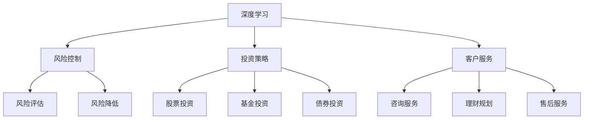

                 

随着科技的飞速发展，人工智能（AI）技术逐渐成为推动金融行业变革的重要力量。大模型作为人工智能领域的一个重要分支，通过其强大的数据处理和分析能力，正在深刻改变金融行业的运作模式和业务形态。本文将探讨AI大模型在金融领域的应用前景，分析其技术原理、数学模型、实践案例以及未来发展趋势和挑战。

## 关键词

- 人工智能
- 大模型
- 金融科技
- 应用前景
- 数学模型
- 技术原理
- 业务模式

## 摘要

本文旨在探讨AI大模型在金融领域的应用前景，分析其技术原理、数学模型和实践案例。通过对大模型在金融风险控制、投资策略、客户服务等方面的应用进行分析，我们得出了大模型在金融科技中的巨大潜力，并对其未来发展趋势和挑战进行了展望。

## 1. 背景介绍

### 1.1 人工智能与金融科技的发展

人工智能作为计算机科学的一个重要分支，近年来取得了长足的发展。随着深度学习、强化学习等算法的突破，人工智能在图像识别、自然语言处理、预测分析等领域表现出强大的能力。金融科技（FinTech）则是指利用技术手段创新金融产品和服务的行业。随着大数据、云计算、区块链等技术的发展，金融科技正在推动金融行业的数字化转型。

### 1.2 大模型的概念与重要性

大模型是指具有极高参数数量、能够处理大规模数据的人工智能模型。典型的例子包括大型神经网络、生成对抗网络（GAN）等。大模型的出现，使得人工智能在处理复杂问题、提高决策效率方面具有显著优势。在金融领域，大模型的应用潜力巨大，能够为金融机构提供更为精准的风险评估、投资策略和客户服务。

## 2. 核心概念与联系

### 2.1 人工智能核心概念

- **深度学习**：一种基于神经网络的学习方法，通过多层神经元实现数据的层次化表示和学习。
- **生成对抗网络（GAN）**：一种基于博弈论的网络结构，通过生成器和判别器的对抗训练，实现数据的生成和判别。
- **强化学习**：一种基于试错和反馈的学习方法，通过与环境交互，不断调整策略以实现最优目标。

### 2.2 金融领域相关概念

- **风险控制**：金融风险管理的一种方式，通过识别、评估和降低风险，确保金融活动的稳健运行。
- **投资策略**：投资者为实现投资目标所采取的方法和措施，包括股票、基金、债券等多种形式。
- **客户服务**：金融机构为满足客户需求，提供的服务和解决方案，包括咨询、理财、售后服务等。

### 2.3 Mermaid 流程图



## 3. 核心算法原理 & 具体操作步骤

### 3.1 算法原理概述

#### 3.1.1 深度学习

深度学习是一种基于多层神经网络的学习方法，通过多层的非线性变换，实现对数据的层次化表示和学习。在金融领域，深度学习可以应用于风险评估、投资策略和客户服务等方面。

#### 3.1.2 生成对抗网络（GAN）

生成对抗网络（GAN）是一种基于博弈论的网络结构，由生成器和判别器组成。生成器生成数据，判别器判断生成数据与真实数据的相似度。通过不断的对抗训练，生成器能够生成更为逼真的数据，应用于金融数据的生成和增强。

#### 3.1.3 强化学习

强化学习是一种基于试错和反馈的学习方法，通过与环境交互，不断调整策略以实现最优目标。在金融领域，强化学习可以用于交易策略优化、风险控制等。

### 3.2 算法步骤详解

#### 3.2.1 深度学习

1. 数据预处理：对金融数据进行分析和清洗，确保数据的准确性和一致性。
2. 模型构建：设计并构建深度学习模型，包括输入层、隐藏层和输出层。
3. 模型训练：通过大量金融数据进行模型训练，调整模型参数，提高模型的预测准确性。
4. 模型评估：使用测试数据对模型进行评估，确保模型的泛化能力和稳定性。

#### 3.2.2 生成对抗网络（GAN）

1. 数据预处理：对金融数据进行标准化处理，确保数据的连续性和分布特性。
2. 模型构建：设计生成器和判别器，确定网络的层数、神经元数量和激活函数等。
3. 对抗训练：生成器生成数据，判别器判断数据真伪，通过梯度下降算法调整模型参数。
4. 数据生成：通过生成器生成金融数据，用于后续分析和应用。

#### 3.2.3 强化学习

1. 环境设定：构建金融交易环境，包括股票、基金、债券等多种投资产品。
2. 策略初始化：初始化交易策略，包括买入、卖出、持有等操作。
3. 交互学习：交易策略与环境进行交互，根据反馈调整策略。
4. 策略优化：通过多次交互学习，优化交易策略，提高投资收益。

### 3.3 算法优缺点

#### 3.3.1 深度学习

优点：

- 强大的数据处理和分析能力
- 可自动提取特征，减少人工干预
- 泛化能力强，适用于多种金融场景

缺点：

- 对数据量和计算资源要求较高
- 模型训练时间较长
- 模型解释性较差

#### 3.3.2 生成对抗网络（GAN）

优点：

- 能够生成高质量的金融数据
- 数据增强，提高模型泛化能力
- 能够处理复杂数据分布

缺点：

- 模型训练不稳定，容易出现模式崩溃
- 对训练数据质量要求较高
- 模型解释性较差

#### 3.3.3 强化学习

优点：

- 能够自适应调整交易策略
- 能够处理动态变化的金融市场
- 可定制化，适用于不同投资策略

缺点：

- 对环境设定和策略初始化要求较高
- 需要大量交互学习时间
- 难以保证长期稳定的投资收益

### 3.4 算法应用领域

#### 3.4.1 风险控制

深度学习和生成对抗网络可以用于金融风险控制，包括信用风险评估、市场风险监控和操作风险识别等。通过模型预测和数据分析，实现风险的提前预警和有效控制。

#### 3.4.2 投资策略

强化学习可以用于投资策略的优化和自动化，通过与环境交互和学习，实现交易策略的持续优化。在股票、基金、债券等投资领域中，强化学习具有广泛的应用前景。

#### 3.4.3 客户服务

生成对抗网络可以用于客户服务数据的生成和增强，提高客户体验和满意度。通过生成虚拟咨询师、个性化推荐等服务，实现金融业务的智能化和个性化。

## 4. 数学模型和公式 & 详细讲解 & 举例说明

### 4.1 数学模型构建

#### 4.1.1 深度学习

深度学习模型通常由多层神经网络组成，其数学模型可以表示为：

\[ y = f(z) \]

其中，\( y \) 为输出，\( f \) 为激活函数，\( z \) 为网络的输入。通过反向传播算法，调整网络参数，实现模型的训练和优化。

#### 4.1.2 生成对抗网络（GAN）

生成对抗网络由生成器和判别器组成，其数学模型可以表示为：

\[ G(z) = f_G(z) \]
\[ D(x) = f_D(x) \]

其中，\( G(z) \) 为生成器的输出，\( D(x) \) 为判别器的输出，\( z \) 为生成器的输入，\( x \) 为判别器的输入。

#### 4.1.3 强化学习

强化学习模型通常由策略和价值函数组成，其数学模型可以表示为：

\[ Q(s, a) = r + \gamma \max_a' Q(s', a') \]

其中，\( Q(s, a) \) 为状态 \( s \) 下，采取动作 \( a \) 的预期收益，\( r \) 为即时收益，\( \gamma \) 为折扣因子，\( s' \) 为下一状态，\( a' \) 为下一动作。

### 4.2 公式推导过程

#### 4.2.1 深度学习

深度学习模型的训练过程主要包括前向传播和反向传播。

1. **前向传播**：

\[ z = W \cdot x + b \]
\[ a = f(z) \]

其中，\( W \) 为权重，\( b \) 为偏置，\( x \) 为输入，\( a \) 为激活值，\( f \) 为激活函数。

2. **反向传播**：

计算误差：

\[ \delta = \frac{\partial L}{\partial a} \cdot \frac{\partial f}{\partial z} \]

更新权重：

\[ W = W - \alpha \cdot \frac{\partial L}{\partial W} \]
\[ b = b - \alpha \cdot \frac{\partial L}{\partial b} \]

其中，\( \alpha \) 为学习率，\( L \) 为损失函数。

#### 4.2.2 生成对抗网络（GAN）

生成对抗网络的训练过程主要包括生成器和判别器的训练。

1. **生成器训练**：

生成器 \( G \) 的目标是最小化生成数据的损失函数：

\[ L_G = -\log(D(G(z))) \]

2. **判别器训练**：

判别器 \( D \) 的目标是最小化生成数据和真实数据的损失函数：

\[ L_D = -\log(D(x)) - \log(1 - D(G(z))) \]

#### 4.2.3 强化学习

强化学习模型的价值函数 \( Q(s, a) \) 的推导过程如下：

1. **状态价值函数**：

\[ V^*(s) = \max_a Q^*(s, a) \]

2. **动作价值函数**：

\[ Q^*(s, a) = r + \gamma V^*(s') \]

3. **策略优化**：

最优策略 \( \pi^*(s) \) 是使得 \( Q^*(s, a) \) 最大的动作：

\[ \pi^*(s) = \arg\max_a Q^*(s, a) \]

### 4.3 案例分析与讲解

#### 4.3.1 风险评估

假设某金融机构需要对一笔贷款进行风险评估，采用深度学习模型进行建模。输入特征包括借款人的年龄、收入、负债比等，输出为贷款是否违约的概率。

1. **数据预处理**：

对输入特征进行标准化处理，将年龄、收入等数值特征进行归一化，使其符合标准正态分布。

2. **模型构建**：

设计一个多层感知机（MLP）模型，包括输入层、隐藏层和输出层。输入层为特征维度，隐藏层为神经元数量，输出层为二分类神经元。

3. **模型训练**：

使用贷款数据集对模型进行训练，通过反向传播算法调整模型参数，优化模型性能。

4. **模型评估**：

使用测试数据集对模型进行评估，计算准确率、召回率等指标，确保模型的泛化能力和预测准确性。

#### 4.3.2 投资策略

假设某投资者采用强化学习模型进行投资策略优化，以股票市场为例。输入状态包括股票价格、交易量等，输出为买入、持有、卖出等交易动作。

1. **环境设定**：

构建一个虚拟股票市场环境，模拟真实市场交易情况，包括股票价格波动、交易费用等。

2. **策略初始化**：

初始化一个随机策略，通过与环境交互，不断调整策略参数，实现策略优化。

3. **交互学习**：

交易策略与环境进行多次交互学习，根据反馈调整策略参数，优化投资策略。

4. **策略优化**：

通过多次交互学习，优化交易策略，提高投资收益。

## 5. 项目实践：代码实例和详细解释说明

### 5.1 开发环境搭建

1. **硬件要求**：

- CPU：Intel i5以上
- GPU：NVIDIA GeForce GTX 1060以上
- 内存：16GB以上

2. **软件要求**：

- Python 3.7及以上版本
- TensorFlow 2.x版本
- Keras 2.x版本

3. **安装步骤**：

- 安装Python和pip：
  ```shell
  sudo apt-get install python3 python3-pip
  ```

- 安装GPU版本的TensorFlow：
  ```shell
  pip3 install tensorflow-gpu==2.x
  ```

### 5.2 源代码详细实现

以下是一个基于TensorFlow的深度学习模型实现，用于贷款风险评估。

```python
import tensorflow as tf
from tensorflow.keras.models import Sequential
from tensorflow.keras.layers import Dense

# 数据预处理
def preprocess_data(X, y):
    # 标准化特征
    X = (X - X.mean()) / X.std()
    # 归一化目标变量
    y = (y - y.mean()) / y.std()
    return X, y

# 构建模型
model = Sequential([
    Dense(64, activation='relu', input_shape=(num_features,)),
    Dense(32, activation='relu'),
    Dense(1, activation='sigmoid')
])

# 编译模型
model.compile(optimizer='adam', loss='binary_crossentropy', metrics=['accuracy'])

# 训练模型
model.fit(X_train, y_train, epochs=10, batch_size=32, validation_split=0.2)

# 评估模型
loss, accuracy = model.evaluate(X_test, y_test)
print(f"Test accuracy: {accuracy:.2f}")
```

### 5.3 代码解读与分析

1. **数据预处理**：

   对输入特征进行标准化处理，将数值特征归一化，使模型更容易训练。对目标变量进行归一化，使其符合二分类问题的输出范围。

2. **模型构建**：

   使用Keras构建一个简单的多层感知机（MLP）模型，包括一个输入层、一个隐藏层和一个输出层。输入层为特征维度，隐藏层为神经元数量，输出层为二分类神经元。

3. **模型编译**：

   使用Adam优化器和二分类交叉熵损失函数编译模型，并设置准确率作为评估指标。

4. **模型训练**：

   使用训练数据对模型进行训练，设置训练轮次、批量大小和验证比例。

5. **模型评估**：

   使用测试数据对模型进行评估，计算测试准确率。

## 6. 实际应用场景

### 6.1 风险控制

在金融机构的风险控制领域，大模型的应用场景非常广泛。例如，银行可以使用深度学习模型对客户的信用风险进行评估，通过分析客户的财务状况、还款记录、信用历史等数据，预测客户违约的概率，从而制定相应的风险控制策略。

### 6.2 投资策略

投资策略优化是金融领域的一个重要研究方向。通过使用强化学习模型，投资者可以自动调整投资组合，优化投资策略。例如，某金融机构可以使用强化学习模型，在股票市场中根据市场动态和交易数据，自动调整买入、卖出和持有的操作，实现投资收益的最大化。

### 6.3 客户服务

在客户服务领域，大模型可以用于生成个性化的服务方案。例如，金融机构可以使用生成对抗网络（GAN）生成虚拟咨询师，根据客户的投资偏好、风险承受能力等数据，提供个性化的投资建议和理财规划。此外，大模型还可以用于智能客服，通过自然语言处理技术，实现对客户咨询的自动回复和解答，提高客户服务的效率和满意度。

## 7. 工具和资源推荐

### 7.1 学习资源推荐

1. **《深度学习》**：由Ian Goodfellow、Yoshua Bengio和Aaron Courville合著，是深度学习领域的经典教材。
2. **《强化学习》**：由Richard S. Sutton和Barto合著，详细介绍了强化学习的基本概念和算法。
3. **《金融科技》**：涵盖了金融科技领域的最新发展，包括大数据、区块链、人工智能等。

### 7.2 开发工具推荐

1. **TensorFlow**：由Google开发的开源深度学习框架，广泛应用于金融科技领域。
2. **Keras**：基于TensorFlow的高层次神经网络API，简化了深度学习模型的构建和训练。
3. **PyTorch**：由Facebook开发的开源深度学习框架，具有灵活的动态计算图和强大的GPU支持。

### 7.3 相关论文推荐

1. **《Generative Adversarial Nets》**：由Ian Goodfellow等人提出，是生成对抗网络（GAN）的奠基性论文。
2. **《Deep Learning for Finance》**：探讨了深度学习在金融领域的应用，包括风险管理、投资策略等。
3. **《Reinforcement Learning: An Introduction》**：详细介绍了强化学习的基本理论和算法，是强化学习领域的经典教材。

## 8. 总结：未来发展趋势与挑战

### 8.1 研究成果总结

近年来，人工智能大模型在金融科技领域取得了显著的成果。深度学习、生成对抗网络和强化学习等算法在风险评估、投资策略和客户服务等方面表现出强大的应用潜力。通过大模型的应用，金融机构能够实现更加精准的风险控制、优化投资策略和提升客户服务质量。

### 8.2 未来发展趋势

1. **技术迭代与创新**：随着人工智能技术的不断发展，大模型将更加高效、准确和稳定，推动金融科技的进一步创新。
2. **跨领域融合**：大模型在金融科技领域的应用将与其他领域（如医疗、教育等）相结合，实现更加广泛的应用场景。
3. **个性化服务**：通过大模型的应用，金融机构能够提供更加个性化的服务方案，满足客户多样化的需求。

### 8.3 面临的挑战

1. **数据质量和隐私**：金融领域的数据量庞大且复杂，数据质量和隐私保护是未来大模型应用的重要挑战。
2. **算法解释性**：大模型的复杂性和黑箱特性使得其解释性较差，如何提高算法的可解释性是一个重要课题。
3. **合规与监管**：金融领域对合规性和监管要求较高，如何确保大模型的应用符合相关法律法规是一个重要问题。

### 8.4 研究展望

未来，人工智能大模型在金融科技领域的应用将更加深入和广泛。通过技术创新和跨领域融合，大模型有望在风险管理、投资策略和客户服务等方面发挥更大的作用。同时，针对数据质量、隐私保护、算法解释性和合规监管等挑战，需要进行深入的研究和探索，为金融科技的可持续发展提供有力支持。

## 9. 附录：常见问题与解答

### 9.1 人工智能大模型在金融领域的应用有哪些？

人工智能大模型在金融领域的主要应用包括风险控制、投资策略、客户服务等方面。例如，深度学习模型可以用于信用风险评估、市场预测等；生成对抗网络可以用于客户数据的生成和增强；强化学习模型可以用于投资策略的优化和自动化。

### 9.2 人工智能大模型在金融领域的优势是什么？

人工智能大模型在金融领域的优势主要包括：

- 强大的数据处理和分析能力
- 高效的风险评估和投资策略
- 个性化的客户服务体验
- 提高金融机构的运营效率

### 9.3 人工智能大模型在金融领域有哪些挑战？

人工智能大模型在金融领域面临的挑战主要包括：

- 数据质量和隐私保护
- 算法解释性和透明度
- 合规性和监管要求
- 技术迭代和更新

### 9.4 人工智能大模型在金融领域的未来发展趋势是什么？

人工智能大模型在金融领域的未来发展趋势主要包括：

- 技术迭代与创新
- 跨领域融合
- 个性化服务
- 数据质量和隐私保护

通过技术创新和跨领域融合，人工智能大模型将在金融领域发挥更大的作用，推动金融科技的可持续发展。同时，针对数据质量、隐私保护、算法解释性和合规监管等挑战，需要进行深入的研究和探索。

### 9.5 如何确保人工智能大模型在金融领域的应用合规性？

确保人工智能大模型在金融领域的应用合规性，需要从以下几个方面进行：

- 遵守相关法律法规和监管要求
- 加强数据安全和隐私保护
- 提高算法透明度和可解释性
- 定期进行合规性审查和评估

通过以上措施，可以确保人工智能大模型在金融领域的应用符合相关法律法规和监管要求，提高金融行业的合规性水平。

## 参考文献

1. Goodfellow, I., Bengio, Y., & Courville, A. (2016). *Deep Learning*. MIT Press.
2. Sutton, R. S., & Barto, A. G. (2018). *Reinforcement Learning: An Introduction*. MIT Press.
3. Goodfellow, I. J., Pouget-Abadie, J., Mirza, M., Xu, B., Warde-Farley, D., Ozair, S., ... & Bengio, Y. (2014). *Generative adversarial nets*. Advances in neural information processing systems, 27.

