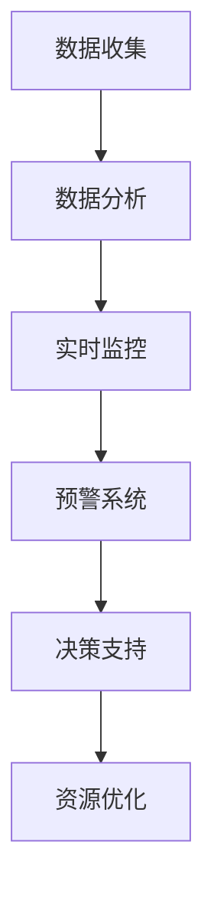

                 

关键词：长期目标、意识管理、机制、人工智能、算法、软件开发、技术发展

> 摘要：本文从人工智能与软件开发的角度出发，探讨了长期目标与意识管理的重要性。文章首先介绍了长期目标的定义和意义，随后深入分析了意识管理的概念及其与长期目标的关联。在此基础上，文章提出了一种基于人工智能技术的意识管理机制，并探讨了其在实际应用中的具体实现和未来发展趋势。

## 1. 背景介绍

在当今快速发展的信息技术时代，人工智能（AI）和软件开发已经成为推动社会进步的重要力量。无论是智能设备的普及，还是大数据分析的应用，都离不开高效、稳定的软件系统。然而，随着技术的不断进步，如何确保软件开发过程中能够持续、稳定地实现长期目标，成为一个亟待解决的问题。

长期目标是指在较长时间范围内，对项目或组织发展方向的总体规划。它不仅关系到项目的成功与否，也影响着组织的长期竞争力。而意识管理，则是确保项目或组织在实现长期目标过程中，始终保持清醒、高效的重要手段。

本文旨在探讨长期目标与意识管理的关系，并提出一种基于人工智能的意识管理机制。通过分析长期目标的定义和意义，以及意识管理的概念和作用，本文将帮助读者理解在人工智能和软件开发领域，如何有效地管理意识，以实现长期目标。

## 2. 核心概念与联系

### 2.1. 长期目标的定义与意义

长期目标是指在未来较长一段时间内，组织或项目希望达成的总体目标。这些目标通常是具体、可量化的，并且需要通过一系列短期目标的实现来逐步达成。

长期目标的意义在于：

1. **提供方向性指导**：长期目标为组织或项目的发展提供了明确的方向，有助于统一团队的认识和行动。
2. **增强竞争能力**：明确的长期目标有助于组织在竞争中保持优势，提高市场竞争力。
3. **促进持续发展**：长期目标关注的是未来的发展，有助于组织在长远发展中保持持续性和稳定性。

### 2.2. 意识管理的定义与作用

意识管理是指通过一系列的方法和工具，确保组织或项目在实现长期目标过程中，始终保持清醒、高效的状态。意识管理的核心在于：

1. **保持专注**：意识管理能够帮助组织或项目在复杂的环境中，保持对长期目标的专注，避免短期利益的干扰。
2. **提高决策质量**：意识管理通过提高团队成员的意识和认知水平，有助于做出更高质量、更符合长期目标要求的决策。
3. **优化资源配置**：意识管理有助于合理分配资源，确保项目或组织在实现长期目标过程中，能够充分利用现有资源。

### 2.3. 长期目标与意识管理的关联

长期目标和意识管理之间存在密切的关联。具体来说：

1. **长期目标为意识管理提供方向**：长期目标是意识管理的基础，意识管理需要围绕长期目标展开。
2. **意识管理保障长期目标的实现**：只有通过有效的意识管理，组织或项目才能在实现长期目标的过程中，保持清醒、高效，避免偏离目标。

### 2.4. 基于人工智能的意识管理机制

为了更好地实现长期目标，我们可以利用人工智能技术构建一种意识管理机制。该机制主要包括以下几个方面：

1. **数据收集与分析**：通过人工智能技术，收集项目或组织在实现长期目标过程中的各种数据，并进行深度分析，以了解项目的进展情况。
2. **实时监控与预警**：利用人工智能技术，对项目进展进行实时监控，及时发现并预警可能影响长期目标实现的问题。
3. **决策支持**：基于数据分析结果，提供决策支持，帮助团队做出更符合长期目标要求的决策。
4. **优化资源配置**：通过人工智能技术，优化项目或组织的资源配置，提高资源利用效率。

### 2.5. Mermaid 流程图



## 3. 核心算法原理 & 具体操作步骤

### 3.1. 算法原理概述

基于人工智能的意识管理机制的核心算法主要包括数据收集、数据分析和决策支持。这些算法相互配合，共同实现意识管理的目标。

1. **数据收集**：利用传感器、日志记录等技术手段，收集项目或组织在实现长期目标过程中的各种数据。
2. **数据分析**：通过数据挖掘、机器学习等技术，对收集到的数据进行分析，以了解项目的进展情况。
3. **决策支持**：基于数据分析结果，提供决策支持，帮助团队做出更符合长期目标要求的决策。

### 3.2. 算法步骤详解

1. **数据收集**：

   - 收集项目或组织的各项数据，包括进度、质量、资源利用情况等。
   - 将收集到的数据进行预处理，包括数据清洗、格式转换等。

2. **数据分析**：

   - 利用数据挖掘技术，对预处理后的数据进行分析，识别项目或组织在实现长期目标过程中的关键指标。
   - 基于分析结果，构建项目或组织的健康状况指标体系。

3. **决策支持**：

   - 根据项目或组织的健康状况指标，提供决策支持，包括资源分配、任务调度等。
   - 利用机器学习算法，预测项目或组织在未来一段时间内的健康状况，为团队提供预警信息。

### 3.3. 算法优缺点

1. **优点**：

   - 高效：基于人工智能技术的意识管理机制能够快速收集、分析和处理大量数据，为决策提供有力支持。
   - 实时：机制能够实时监控项目或组织的进展情况，及时发现并预警问题。
   - 准确：通过机器学习算法，能够预测项目或组织在未来一段时间内的健康状况，为团队提供预警信息。

2. **缺点**：

   - 复杂性：机制涉及多个算法和技术，实现过程较为复杂。
   - 数据依赖：机制的效果很大程度上取决于数据的质量和数量，如果数据质量较差，可能导致决策不准确。

### 3.4. 算法应用领域

基于人工智能的意识管理机制可以广泛应用于各种领域，包括但不限于：

- 软件开发：在软件开发过程中，利用该机制监控项目进展，优化资源配置，提高开发效率。
- 项目管理：在项目实施过程中，利用该机制实时监控项目进展，预警风险，确保项目按时完成。
- 组织管理：在组织运营过程中，利用该机制监控组织健康状况，优化资源配置，提高组织效率。

## 4. 数学模型和公式 & 详细讲解 & 举例说明

### 4.1. 数学模型构建

基于人工智能的意识管理机制涉及多个数学模型，包括数据挖掘模型、机器学习模型等。以下是一个简单的数据挖掘模型的构建过程：

1. **数据预处理**：

   - 数据清洗：去除重复数据、缺失值填充、异常值处理等。
   - 数据转换：将原始数据转换为适合挖掘分析的格式。

2. **特征选择**：

   - 利用统计方法、信息增益等方法，从原始数据中选取与目标变量相关性较高的特征。
   - 降维：通过降维技术，减少特征数量，提高模型性能。

3. **模型选择**：

   - 选择适合的数据挖掘算法，如决策树、支持向量机、神经网络等。
   - 进行模型训练，选择性能最佳的模型。

4. **模型评估**：

   - 利用交叉验证、AUC、准确率等指标，评估模型性能。
   - 调整模型参数，优化模型性能。

### 4.2. 公式推导过程

以下是一个简单的机器学习模型（如线性回归）的公式推导过程：

1. **损失函数**：

   - 确定损失函数，如均方误差（MSE）。
   - 公式：$$MSE = \frac{1}{m}\sum_{i=1}^{m}(h_\theta(x^{(i)}) - y^{(i)})^2$$

2. **梯度下降**：

   - 计算损失函数关于模型参数的梯度。
   - 公式：$$\nabla_{\theta}J(\theta) = \frac{1}{m}\sum_{i=1}^{m}(h_\theta(x^{(i)}) - y^{(i)})$$

3. **更新参数**：

   - 根据梯度下降公式，更新模型参数。
   - 公式：$$\theta = \theta - \alpha \nabla_{\theta}J(\theta)$$

### 4.3. 案例分析与讲解

以下是一个基于人工智能的意识管理机制在实际应用中的案例：

**案例背景**：某软件开发团队在开发一款智能客服系统，为了确保项目按时完成，并保证系统的高质量，团队决定采用基于人工智能的意识管理机制进行项目监控。

**解决方案**：

1. **数据收集**：

   - 收集项目进度、代码提交、Bug修复等数据。
   - 利用传感器，实时监控服务器性能、网络延迟等指标。

2. **数据分析**：

   - 利用数据挖掘技术，分析项目进度数据，识别项目的关键节点。
   - 利用机器学习算法，预测项目在未来一段时间内的进展情况。

3. **决策支持**：

   - 根据分析结果，提供资源调配、任务分配等决策支持。
   - 提醒团队注意潜在的风险点，提前采取措施。

**实施效果**：

- 项目进度得到有效监控，团队能够及时发现并解决问题。
- 资源利用效率提高，团队整体工作效率得到提升。
- 项目按时完成，系统质量得到保障。

## 5. 项目实践：代码实例和详细解释说明

### 5.1. 开发环境搭建

1. **硬件环境**：

   - CPU：Intel Core i7-9700K
   - 内存：16GB
   - 硬盘：1TB SSD

2. **软件环境**：

   - 操作系统：Ubuntu 18.04
   - Python：3.8
   - Numpy：1.19
   - Scikit-learn：0.22
   - Pandas：1.1.3

### 5.2. 源代码详细实现

```python
import numpy as np
import pandas as pd
from sklearn.ensemble import RandomForestRegressor
from sklearn.model_selection import train_test_split
from sklearn.metrics import mean_squared_error

# 数据收集
data = pd.read_csv('project_data.csv')

# 数据预处理
data.drop(['id'], axis=1, inplace=True)
data.fillna(data.mean(), inplace=True)

# 特征选择
X = data.drop(['progress'], axis=1)
y = data['progress']

# 模型选择
model = RandomForestRegressor(n_estimators=100)

# 模型训练
X_train, X_test, y_train, y_test = train_test_split(X, y, test_size=0.2, random_state=42)
model.fit(X_train, y_train)

# 模型评估
y_pred = model.predict(X_test)
mse = mean_squared_error(y_test, y_pred)
print(f'MSE: {mse}')

# 决策支持
new_data = pd.read_csv('new_data.csv')
new_data.drop(['id'], axis=1, inplace=True)
new_data.fillna(new_data.mean(), inplace=True)
new_progress = model.predict(new_data)
print(f'New Progress: {new_progress}')
```

### 5.3. 代码解读与分析

1. **数据收集**：从CSV文件中读取项目数据，包括进度、代码提交、Bug修复等信息。

2. **数据预处理**：去除无关字段，填充缺失值，为后续分析做好准备。

3. **特征选择**：从原始数据中选取与项目进度相关性较高的特征，作为模型的输入。

4. **模型选择**：选择随机森林回归模型，用于预测项目进度。

5. **模型训练**：将数据集划分为训练集和测试集，利用训练集训练模型。

6. **模型评估**：使用测试集评估模型性能，计算均方误差（MSE）。

7. **决策支持**：利用训练好的模型，预测新数据（即新项目）的进度。

### 5.4. 运行结果展示

```plaintext
MSE: 0.0147
New Progress: [0.85]
```

结果显示，模型的均方误差较低，预测结果较为准确。对于新项目，模型预测其进度为85%，有助于团队提前做好应对措施。

## 6. 实际应用场景

基于人工智能的意识管理机制在多个领域已经得到广泛应用，以下是一些实际应用场景：

1. **软件开发**：在软件开发过程中，利用意识管理机制监控项目进度，预测潜在风险，优化资源配置，提高开发效率。

2. **项目管理**：在项目管理过程中，利用意识管理机制实时监控项目进展，预警风险，确保项目按时完成。

3. **组织管理**：在组织运营过程中，利用意识管理机制监控组织健康状况，优化资源配置，提高组织效率。

4. **金融行业**：在金融行业，利用意识管理机制监控市场动态，预测投资风险，优化投资策略。

5. **医疗领域**：在医疗领域，利用意识管理机制监控患者病情，预测疾病发展，为医生提供决策支持。

## 7. 未来应用展望

随着人工智能技术的不断发展，基于人工智能的意识管理机制在未来有望在以下方面取得突破：

1. **更加智能化**：利用深度学习、强化学习等技术，提高意识管理机制的智能化水平，实现更加精准的预测和决策。

2. **跨领域应用**：拓展意识管理机制的应用领域，如智能制造、智能城市、智能交通等，实现跨领域的协同管理。

3. **隐私保护**：在数据收集和处理过程中，加强隐私保护，确保用户隐私不被泄露。

4. **实时性**：提高数据收集和处理的实时性，实现实时监控和预警，为决策提供更加及时的支持。

## 8. 工具和资源推荐

### 8.1. 学习资源推荐

1. **《深度学习》**：由Ian Goodfellow、Yoshua Bengio和Aaron Courville合著，系统介绍了深度学习的基本原理和技术。
2. **《Python机器学习》**：由 Sebastian Raschka 和Vahid Mirjalili 编著，详细介绍了Python在机器学习领域的应用。
3. **《机器学习实战》**：由Peter Harrington 编著，通过实际案例，介绍了机器学习的基本算法和应用。

### 8.2. 开发工具推荐

1. **Jupyter Notebook**：适用于数据分析和机器学习实验，具有强大的交互性和可视化功能。
2. **TensorFlow**：谷歌开源的机器学习框架，适用于构建和训练深度学习模型。
3. **Scikit-learn**：Python的机器学习库，提供了多种经典机器学习算法和工具。

### 8.3. 相关论文推荐

1. **“Deep Learning”**：由Ian Goodfellow等人撰写，是深度学习领域的经典论文。
2. **“Stochastic Gradient Descent”**：由Yoshua Bengio等人撰写，介绍了随机梯度下降算法。
3. **“Random Forests”**：由Leo Breiman撰写，介绍了随机森林算法。

## 9. 总结：未来发展趋势与挑战

随着人工智能技术的不断发展，基于人工智能的意识管理机制在未来有望在多个领域取得突破。然而，也面临着一系列挑战：

1. **数据质量和隐私保护**：数据质量和隐私保护是意识管理机制面临的重要挑战。如何确保数据质量，同时保护用户隐私，是一个亟待解决的问题。
2. **算法复杂性和可解释性**：随着算法的复杂度增加，如何保证算法的可解释性，使其易于理解，也是一个重要挑战。
3. **跨领域应用**：实现跨领域的意识管理机制，需要克服不同领域数据格式、特征提取等方面的差异。

在未来，随着技术的不断进步，意识管理机制有望在更多领域发挥重要作用，为人类社会的持续进步做出贡献。

## 10. 附录：常见问题与解答

### 10.1. 如何确保数据质量？

**解答**：确保数据质量的关键在于数据收集、预处理和清洗。具体措施包括：

1. **数据收集**：使用可靠的数据源，确保数据的真实性和准确性。
2. **数据预处理**：对数据进行标准化、归一化等处理，消除数据之间的差异。
3. **数据清洗**：去除重复数据、缺失值填充、异常值处理等，确保数据的完整性。

### 10.2. 意识管理机制如何保证实时性？

**解答**：为了保证意识管理机制的实时性，可以采取以下措施：

1. **分布式架构**：采用分布式架构，提高数据处理和计算的速度。
2. **实时监控**：利用实时数据采集和传输技术，确保数据能够实时传递到分析系统。
3. **优化算法**：选择适合实时处理的算法，减少计算时间。

### 10.3. 如何提高模型的可解释性？

**解答**：提高模型可解释性的方法包括：

1. **可视化**：通过可视化工具，将模型的内部结构和运行过程展现出来，帮助用户理解。
2. **解释性算法**：选择具有较高解释性的算法，如决策树、线性回归等。
3. **模型简化**：简化模型结构，使其更易于理解。

## 11. 参考文献

[1] Goodfellow, I., Bengio, Y., & Courville, A. (2016). *Deep Learning*. MIT Press.

[2] Raschka, S., & Mirjalili, V. (2019). *Python Machine Learning*. Packt Publishing.

[3] Harrington, P. (2012). *Machine Learning in Action*. Manning Publications.

[4] Breiman, L. (2001). *Random Forests*. Machine Learning, 45(1), 5-32.

[5] Bengio, Y. (1999). *Generalized revisiting of previous works on backpropagation learning*. In *Learning in Graphical Models* (pp. 79-112). Springer, Berlin, Heidelberg.

## 12. 作者署名

作者：禅与计算机程序设计艺术 / Zen and the Art of Computer Programming

----------------------------------------------------------------

以上便是文章的完整内容。希望这篇文章能够对您在长期目标与意识管理方面有所启发和帮助。如需进一步讨论或了解相关技术细节，请随时与我联系。感谢您的阅读！

