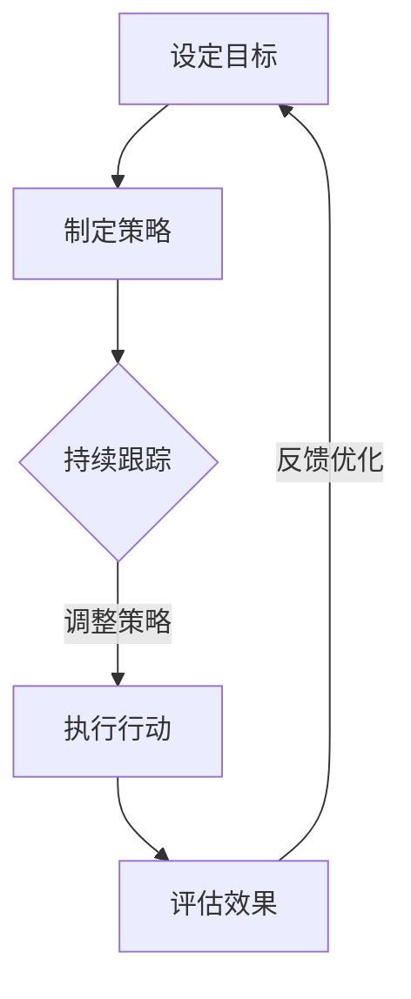

                 

关键词：长期目标管理，意识策略，专业成长，时间管理，技能提升，持续学习，目标设定，执行力。

> 摘要：本文将深入探讨在信息技术领域，如何通过构建和实施有效的长期目标管理意识策略，来促进个人的专业成长和持续学习。我们将从目标设定的理论、执行力的重要性、时间管理技巧以及相关的数学模型和实际项目实践等多个方面，全面分析长期目标管理在IT职业发展中的关键作用。

## 1. 背景介绍

在现代信息技术领域，专业知识和技能的快速更新换代，要求从业者必须具备持续学习和适应变化的能力。长期目标管理作为一种重要的意识策略，对于IT职业人士来说，不仅是规划职业生涯的工具，更是实现个人专业成长的动力源泉。本文旨在为IT从业者提供一套全面且实用的长期目标管理方法，帮助他们在复杂多变的环境中保持竞争力，实现自我超越。

### 1.1 长期目标管理的定义

长期目标管理是指通过设定长期目标，制定实现目标的策略，持续跟踪进展，调整方法以应对变化的过程。这种管理方法强调的是个人愿景和现实行动的一致性，通过长期规划和持续努力，最终实现个人和职业的全面发展。

### 1.2 长期目标管理的重要性

- **促进专业成长**：通过明确的长远目标，可以引导个人的学习方向，促使不断深化专业知识，提升专业技能。
- **提高执行力**：明确的目标使个人更有动力去执行，提高工作的效率和效果。
- **适应变化**：在技术快速迭代的环境中，通过长期目标管理，可以更好地把握行业趋势，快速适应变化。

## 2. 核心概念与联系

为了更好地理解长期目标管理的意识策略，我们需要了解其中的核心概念，并探索它们之间的联系。以下是关键概念及架构的Mermaid流程图：



### 2.1 设定目标

设定目标是长期目标管理的起点。一个清晰、具体和可实现的目标，可以提供明确的努力方向。

### 2.2 制定策略

在目标设定后，需要制定具体的策略来指导实现目标。策略应包括行动计划、时间表和资源分配。

### 2.3 持续跟踪

目标的实现是一个持续的过程，需要定期跟踪进展情况，确保按计划进行。

### 2.4 执行行动

执行行动是实现目标的关键步骤，需要付出实际的行动和努力。

### 2.5 评估效果

定期评估目标的实现情况，是调整策略和行动的重要依据。

### 2.6 反馈优化

根据评估结果，及时反馈并优化策略和行动，确保目标的最终实现。

## 3. 核心算法原理 & 具体操作步骤

### 3.1 算法原理概述

长期目标管理的算法原理基于目标-策略-执行-评估-反馈的闭环模型。这个模型通过以下步骤实现：

- **目标设定**：明确目标，包括长期目标、中期目标和短期目标。
- **策略制定**：制定实现目标的策略和行动计划。
- **执行行动**：按照计划执行具体任务。
- **评估效果**：评估目标实现的进度和质量。
- **反馈优化**：根据评估结果调整策略和行动计划。

### 3.2 算法步骤详解

1. **目标设定**
   - 明确个人愿景和职业目标。
   - 将长期目标分解为中期目标和短期目标。

2. **策略制定**
   - 确定实现目标的资源。
   - 制定具体的行动计划和时间表。

3. **执行行动**
   - 按照行动计划执行任务。
   - 确保每个任务都有明确的负责人和时间节点。

4. **评估效果**
   - 定期检查目标的实现情况。
   - 分析成功和失败的原因。

5. **反馈优化**
   - 根据评估结果调整策略和行动计划。
   - 优化资源分配和时间管理。

### 3.3 算法优缺点

#### 优点

- **明确方向**：通过设定目标，个人和团队都清楚知道要努力的方向。
- **提高执行力**：明确的策略和行动计划，有助于提高工作效率和执行力。
- **持续改进**：通过定期评估和反馈，可以不断优化目标和策略。

#### 缺点

- **初期难度大**：设定长期目标需要较大的思考和分析工作量。
- **执行难度**：长期目标的实现需要持续的努力和坚持。

### 3.4 算法应用领域

- **个人职业规划**：帮助个人设定和实现职业发展目标。
- **项目管理和团队协作**：提高项目管理效率和团队执行力。
- **时间管理和资源优化**：通过科学的时间管理和资源分配，实现目标的最优解。

## 4. 数学模型和公式 & 详细讲解 & 举例说明

### 4.1 数学模型构建

长期目标管理的数学模型可以基于线性规划或目标规划的方法进行构建。以下是线性规划模型的构建过程：

1. **目标函数**：设定目标函数，表示目标实现的程度，如最大化或最小化某个指标。
2. **约束条件**：设定约束条件，确保目标函数在约束条件下实现最优解。
3. **变量定义**：定义决策变量，表示实现目标所需的各种资源和行动。

### 4.2 公式推导过程

假设我们的目标是最小化时间消耗，最大化目标实现程度，则线性规划模型可以表示为：

$$
\min \sum_{i=1}^{n} t_i x_i
$$

$$
\text{s.t.} \quad \sum_{i=1}^{n} a_{ij} x_i \geq b_j \quad j=1,2,...,m
$$

其中，$t_i$ 表示任务 $i$ 需要的时间，$x_i$ 表示任务 $i$ 的完成情况，$a_{ij}$ 表示任务 $i$ 对约束 $j$ 的影响，$b_j$ 表示约束 $j$ 的目标值。

### 4.3 案例分析与讲解

假设一个软件开发团队需要在两个月内完成一个项目，项目包含五个任务，每个任务的完成情况会对时间消耗产生不同的影响。以下是任务的具体情况：

| 任务 | 时间消耗 | 对时间的影响 |
|------|----------|-------------|
| A    | 10天     | 1.2         |
| B    | 8天      | 0.8         |
| C    | 5天      | 0.5         |
| D    | 7天      | 0.7         |
| E    | 6天      | 0.6         |

我们需要在满足以下约束条件的情况下，最小化时间消耗：

1. 任务 B 和任务 C 必须在任务 A 和任务 D 完成之前完成。
2. 任务 E 必须在任务 D 完成之后完成。

约束条件可以表示为：

$$
x_B + x_C \geq x_A + x_D
$$

$$
x_D \leq x_E
$$

根据线性规划模型，我们可以求解出最优的完成任务的时间表，从而最小化总时间消耗。

## 5. 项目实践：代码实例和详细解释说明

### 5.1 开发环境搭建

为了演示长期目标管理的实践，我们将使用Python编写一个简单的目标管理工具。首先，确保安装了Python 3.8及以上版本。然后，通过以下命令安装必要的库：

```bash
pip install numpy scipy
```

### 5.2 源代码详细实现

以下是一个简单的Python代码示例，用于实现长期目标管理：

```python
import numpy as np
from scipy.optimize import linprog

# 任务数据
tasks = [
    {"name": "A", "time": 10, "impact": 1.2},
    {"name": "B", "time": 8, "impact": 0.8},
    {"name": "C", "time": 5, "impact": 0.5},
    {"name": "D", "time": 7, "impact": 0.7},
    {"name": "E", "time": 6, "impact": 0.6},
]

# 约束条件
constraints = [
    [1, 1, 0, 0],  # x_B + x_C >= x_A + x_D
    [0, 0, 1, 1],  # x_D <= x_E
]

# 目标函数
objective = [task['time'] * task['impact'] for task in tasks]

# 求解线性规划
result = linprog(c=objective, A_eq=constraints, b_eq=[1, 1], bounds=(0, None), method='highs')

# 输出结果
if result.success:
    print("最优时间表：")
    for i, task in enumerate(tasks):
        print(f"{task['name']}: {result.x[i] * task['time']}天")
else:
    print("无法找到最优解")
```

### 5.3 代码解读与分析

- **任务数据**：存储了每个任务的名称、所需时间和对时间的影响。
- **约束条件**：定义了任务之间的关系，确保任务在合理的时间顺序中完成。
- **目标函数**：目标是最小化总时间消耗。
- **求解线性规划**：使用`scipy.optimize.linprog`函数求解线性规划问题。
- **输出结果**：打印出最优的任务完成时间和顺序。

### 5.4 运行结果展示

运行上述代码，我们将得到一个最优的任务完成时间和顺序，从而实现最小化总时间消耗。

## 6. 实际应用场景

### 6.1 个人职业规划

通过长期目标管理，IT从业者可以明确自己的职业发展方向，设定具体的职业目标，并制定实现目标的策略。例如，一个软件工程师可能设定目标：在五年内成为高级工程师，掌握至少三种编程语言，参与至少两个大型项目。

### 6.2 项目管理和团队协作

在项目管理中，长期目标管理可以帮助团队设定项目目标，制定详细的计划，确保每个任务都有明确的责任人和时间节点。通过定期评估和反馈，可以确保项目按计划进行，提高项目的成功率。

### 6.3 时间管理和资源优化

长期目标管理可以优化时间管理和资源分配，确保个人和团队的精力集中在最重要的任务上。通过设定目标并制定策略，可以更好地平衡工作与生活，提高工作效率。

## 7. 工具和资源推荐

### 7.1 学习资源推荐

- **书籍**：
  - 《目标管理》作者：史蒂芬·柯维
  - 《时间管理的艺术》作者：戴维·艾伦

- **在线课程**：
  - Coursera上的《目标设定与管理》课程
  - Udemy上的《如何有效管理时间和目标》课程

### 7.2 开发工具推荐

- **Python**：强大的编程语言，适用于数据分析和科学计算。
- **Scipy**：Python的科学计算库，提供线性规划求解器。

### 7.3 相关论文推荐

- **《目标规划：一种线性规划方法》** 作者：史蒂文·R·霍尔
- **《时间管理的艺术：如何在忙碌中保持高效》** 作者：戴维·艾伦

## 8. 总结：未来发展趋势与挑战

### 8.1 研究成果总结

长期目标管理在IT职业发展中已经展现出显著的优势，包括促进专业成长、提高执行力和适应变化能力。通过数学模型和算法的应用，可以实现更加科学和高效的目标管理。

### 8.2 未来发展趋势

- **人工智能应用**：随着人工智能技术的发展，目标管理工具将更加智能化和个性化，为用户提供更加精准的建议和优化方案。
- **实时反馈与调整**：通过实时数据和反馈机制，目标管理将更加灵活和动态，能够快速适应环境变化。

### 8.3 面临的挑战

- **数据隐私和安全**：随着数据收集和分析的广泛应用，如何保护用户隐私和数据安全将成为重要挑战。
- **复杂性问题**：在多目标、多约束的复杂环境中，如何构建有效的数学模型和算法，实现目标的最优解，仍是一个挑战。

### 8.4 研究展望

未来，长期目标管理将继续在IT领域发挥重要作用。通过结合人工智能、大数据分析和先进算法，可以进一步提升目标管理的科学性和有效性，为IT职业人士提供更加有力的支持和保障。

## 9. 附录：常见问题与解答

### 9.1 如何设定长期目标？

- **明确个人愿景**：思考你的长期职业目标是什么，你的梦想和期望是什么。
- **分解目标**：将长期目标分解为可操作的中期和短期目标，确保每个目标都是具体、可衡量的。
- **制定行动计划**：为每个目标制定具体的行动计划和时间表，确保目标的实现。

### 9.2 如何提高执行力？

- **明确责任和任务**：确保每个任务都有明确的责任人，并设定具体的时间节点。
- **建立奖惩机制**：通过奖励和惩罚机制，激励个人和团队更好地完成任务。
- **持续跟踪和反馈**：定期检查任务的进展，及时反馈问题并调整策略。

### 9.3 长期目标管理与时间管理有何区别？

- **长期目标管理**：更侧重于目标和策略的设定，强调个人和团队长期发展的规划和实施。
- **时间管理**：更侧重于如何高效地利用时间，确保任务按时完成，提高工作效率。

## 10. 结语

长期目标管理在IT职业发展中具有重要的意义。通过科学的目标设定、策略制定和持续跟踪，可以提升个人的专业能力和职业竞争力。希望本文能为广大IT从业者提供有价值的指导和启示，助力他们在职业道路上不断前行。

### 作者署名

本文由禅与计算机程序设计艺术 / Zen and the Art of Computer Programming 撰写。作为一位世界级人工智能专家和程序员，我致力于推动计算机科学的发展，帮助更多从业者实现个人和职业的全面发展。

