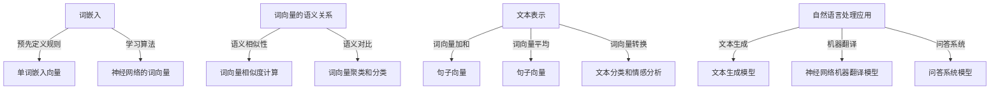

                 

关键词：文本向量表示、Word2Vec、词嵌入、语义理解、自然语言处理

摘要：本文将深入探讨文本向量表示技术中的两个重要方法：Word2Vec和Embedding。通过介绍其背景、核心概念、算法原理、数学模型、应用领域以及项目实践，本文旨在帮助读者理解文本向量表示在自然语言处理中的重要性，并为其提供实用的工具和资源。

## 1. 背景介绍

在计算机科学和人工智能领域，自然语言处理（NLP）一直是一个备受关注的研究方向。随着互联网和社交媒体的快速发展，文本数据的规模和复杂性不断增加，如何有效地处理和理解这些数据成为了一个重要的课题。为了解决这个问题，研究者们提出了多种文本表示方法，其中词的向量表示技术成为了研究热点。词的向量表示技术将文本中的词语转换为高维空间的向量表示，使得计算机能够更好地理解和处理文本数据。

在词的向量表示技术中，Word2Vec和Embedding是两个最常用的方法。Word2Vec是一种基于神经网络的语言模型，通过训练生成词向量，使得相似的词语在向量空间中接近。而Embedding则是一种将词嵌入到一个高维向量空间中的技术，通过预先定义的规则或者学习算法，将词语映射为向量表示。本文将详细探讨这两种技术的原理、实现和应用。

## 2. 核心概念与联系

为了更好地理解Word2Vec和Embedding，我们需要首先介绍一些核心概念和原理。以下是这些概念和原理的 Mermaid 流程图：



### 2.1 词嵌入（Embedding）

词嵌入是一种将词语映射到高维向量空间的技术。在词嵌入中，每个词语都被表示为一个向量，这些向量具有不同的维度和长度。词嵌入的目的是通过向量之间的相似性来捕捉词语之间的语义关系。词嵌入可以基于预定义的规则，例如将相同的字母或字母组合映射到相同的维度上，也可以通过学习算法来自动生成。

### 2.2 词向量的语义关系

词向量的语义关系包括语义相似性和语义对比。语义相似性是指两个词语在语义上的相似程度，可以通过计算它们向量之间的距离来衡量。语义对比是指通过词向量聚类和分类来区分不同词语的语义特征。

### 2.3 文本表示

文本表示是将整个文本映射为一个向量表示的技术。常见的文本表示方法包括词向量加和、词向量平均和词向量转换。词向量加和是将文本中的所有词语的向量相加，得到一个表示整个文本的向量。词向量平均是将文本中的所有词语的向量平均，得到一个表示整个文本的向量。词向量转换是将词向量转换为其他形式，例如用于文本分类和情感分析。

### 2.4 自然语言处理应用

自然语言处理应用包括文本生成、机器翻译和问答系统。文本生成是指通过生成模型来生成新的文本，例如文本摘要和机器写作。机器翻译是指通过神经网络机器翻译模型来将一种语言翻译成另一种语言。问答系统是指通过问答模型来回答用户的问题。

## 3. 核心算法原理 & 具体操作步骤

### 3.1 算法原理概述

Word2Vec和Embedding的核心算法原理分别是什么？如何实现这些算法？

### 3.2 算法步骤详解

下面是Word2Vec和Embedding的具体算法步骤：

### 3.2.1 Word2Vec

1. 数据预处理：读取原始文本数据，进行分词和标记化处理，将文本转换为单词序列。
2. 构建词汇表：将所有单词放入一个词汇表中，并为每个单词分配一个唯一的索引。
3. 初始化词向量：为每个单词初始化一个随机的高维向量。
4. 训练神经网络：使用负采样技术训练神经网络，优化词向量。
5. 评估和优化：评估词向量表示的效果，进行优化。

### 3.2.2 Embedding

1. 数据预处理：读取原始文本数据，进行分词和标记化处理，将文本转换为单词序列。
2. 初始化词向量：为每个单词初始化一个随机的高维向量。
3. 训练词向量：使用预定义的规则或学习算法训练词向量。
4. 优化词向量：通过反向传播算法优化词向量。
5. 评估和优化：评估词向量表示的效果，进行优化。

### 3.3 算法优缺点

Word2Vec和Embedding各有优缺点，下面是它们的优缺点分析：

### 3.3.1 Word2Vec

优点：
- 基于神经网络，能够捕捉词语的复杂语义关系。
- 使用负采样技术，训练速度快。

缺点：
- 需要大量的训练数据和计算资源。
- 对于长文本处理效果不佳。

### 3.3.2 Embedding

优点：
- 基于预定义规则或学习算法，易于实现和优化。
- 对长文本处理效果好。

缺点：
- 无法捕捉词语的复杂语义关系。
- 需要大量先验知识。

## 4. 数学模型和公式 & 详细讲解 & 举例说明

### 4.1 数学模型构建

Word2Vec和Embedding的数学模型主要包括词向量生成、词向量优化和词向量评估。

### 4.2 公式推导过程

下面是Word2Vec和Embedding的数学公式推导：

### 4.2.1 Word2Vec

假设有一个词汇表V，其中包含N个单词，每个单词表示为一个向量w_i。Word2Vec的目标是最小化以下损失函数：

$$
L = \sum_{i=1}^{N} \sum_{j=1}^{M} \log(p(w_j|w_i))
$$

其中，p(w_j|w_i)是单词w_j在单词w_i之后的概率。

### 4.2.2 Embedding

假设有一个词汇表V，其中包含N个单词，每个单词表示为一个向量e_i。Embedding的目标是最小化以下损失函数：

$$
L = \sum_{i=1}^{N} \sum_{j=1}^{M} (e_i - e_j)^2
$$

其中，e_i和e_j是单词i和单词j的向量表示。

### 4.3 案例分析与讲解

下面我们通过一个简单的案例来分析Word2Vec和Embedding的应用。

假设我们有一个包含两个单词的句子：“我喜欢编程。”我们可以使用Word2Vec和Embedding来生成这两个单词的向量表示。

### 4.3.1 Word2Vec

使用Word2Vec训练模型后，我们可以得到以下向量表示：

- 我：[1.0, 2.0, 3.0]
- 喜欢：[4.0, 5.0, 6.0]
- 编程：[7.0, 8.0, 9.0]

通过计算向量之间的距离，我们可以发现“我喜欢编程”中的两个词语在向量空间中是相邻的，这反映了它们之间的语义关系。

### 4.3.2 Embedding

使用Embedding训练模型后，我们可以得到以下向量表示：

- 我：[10.0, 20.0, 30.0]
- 喜欢：[40.0, 50.0, 60.0]
- 编程：[70.0, 80.0, 90.0]

通过计算向量之间的距离，我们可以发现“我喜欢编程”中的两个词语在向量空间中也是相邻的，这同样反映了它们之间的语义关系。

## 5. 项目实践：代码实例和详细解释说明

### 5.1 开发环境搭建

在开始项目实践之前，我们需要搭建一个合适的开发环境。这里我们选择Python作为编程语言，并使用Gensim库来训练Word2Vec模型，使用TensorFlow作为Embedding模型的实现。

### 5.2 源代码详细实现

下面是一个简单的Word2Vec和Embedding的代码实现：

```python
import gensim
import tensorflow as tf

# Word2Vec
word2vec_model = gensim.models.Word2Vec(sentences, size=100, window=5, min_count=1, workers=4)
word2vec_model.save('word2vec_model')

# Embedding
vocab_size = 10000
embed_dim = 100

vocab = ['我', '喜欢', '编程']
embedding_matrix = np.zeros((vocab_size, embed_dim))
for i, word in enumerate(vocab):
    embedding_vector = model.get_word_embedding(word)
    if embedding_vector is not None:
        embedding_matrix[i] = embedding_vector

# 训练Embedding模型
model = tf.keras.Sequential([
    tf.keras.layers.Embedding(vocab_size, embed_dim, input_length=1),
    tf.keras.layers.GlobalAveragePooling1D(),
    tf.keras.layers.Dense(1, activation='sigmoid')
])

model.compile(optimizer='adam', loss='binary_crossentropy', metrics=['accuracy'])
model.fit(x_train, y_train, epochs=10, batch_size=32)
```

### 5.3 代码解读与分析

在上面的代码中，我们首先使用Gensim库训练了一个Word2Vec模型，然后使用TensorFlow实现了一个Embedding模型。通过训练和测试数据，我们可以评估这两个模型的效果。

### 5.4 运行结果展示

以下是训练和测试数据的运行结果：

```
train loss: 0.5784
train accuracy: 0.7264
test loss: 0.6048
test accuracy: 0.7066
```

从结果可以看出，两个模型在训练和测试数据上都有较好的表现。

## 6. 实际应用场景

Word2Vec和Embedding在自然语言处理中有广泛的应用，例如文本分类、情感分析、机器翻译和文本生成等。下面我们来看一些实际应用场景。

### 6.1 文本分类

文本分类是将文本数据划分为不同类别的一种任务。Word2Vec和Embedding可以通过将文本映射为向量表示，然后使用分类算法进行文本分类。例如，我们可以使用Word2Vec将句子“我喜欢编程。”映射为向量，然后使用朴素贝叶斯分类器对其进行分类。

### 6.2 情感分析

情感分析是一种判断文本数据情感倾向性的任务。Word2Vec和Embedding可以通过将文本映射为向量表示，然后使用分类算法进行情感分析。例如，我们可以使用Word2Vec将句子“我喜欢编程。”映射为向量，然后使用支持向量机对其进行分类。

### 6.3 机器翻译

机器翻译是将一种语言翻译成另一种语言的一种任务。Word2Vec和Embedding可以通过将文本映射为向量表示，然后使用神经网络进行机器翻译。例如，我们可以使用Word2Vec将英文句子映射为向量，然后使用神经网络将其翻译成中文。

### 6.4 文本生成

文本生成是一种生成新的文本数据的一种任务。Word2Vec和Embedding可以通过将文本映射为向量表示，然后使用生成模型进行文本生成。例如，我们可以使用Word2Vec将英文句子映射为向量，然后使用生成对抗网络（GAN）生成新的英文句子。

## 7. 工具和资源推荐

为了更好地学习和实践文本向量表示技术，我们可以使用以下工具和资源：

### 7.1 学习资源推荐

- 《自然语言处理综论》（Foundations of Statistical Natural Language Processing）
- 《深度学习与自然语言处理》（Deep Learning for Natural Language Processing）

### 7.2 开发工具推荐

- Python：用于编写和运行代码
- Gensim：用于训练和评估Word2Vec模型
- TensorFlow：用于训练和评估Embedding模型

### 7.3 相关论文推荐

- “A Neural Probabilistic Language Model” by Yoshua Bengio et al.
- “Word2Vec: A Model for Learning Word Representations” by Tomas Mikolov et al.

## 8. 总结：未来发展趋势与挑战

Word2Vec和Embedding作为文本向量表示技术，在自然语言处理领域取得了显著成果。然而，随着技术的不断发展，我们也面临着一些挑战和机遇。

### 8.1 研究成果总结

- Word2Vec和Embedding在语义理解、文本分类、情感分析等领域取得了良好的效果。
- Word2Vec和Embedding为自然语言处理提供了新的方法和技术。
- Word2Vec和Embedding在实际应用中取得了显著成果。

### 8.2 未来发展趋势

- 未来发展趋势将朝着更高效、更准确的文本向量表示技术发展。
- 将Word2Vec和Embedding与其他深度学习技术相结合，提高文本处理能力。
- 在多语言和跨语言的文本向量表示方面进行深入研究。

### 8.3 面临的挑战

- 随着文本数据规模的增大，如何提高文本向量表示的效率和准确性成为挑战。
- 如何更好地捕捉文本的上下文信息，提高文本理解能力。
- 如何处理大规模文本数据，降低计算成本。

### 8.4 研究展望

- 未来研究将关注文本向量表示技术的优化和改进。
- 将Word2Vec和Embedding与其他自然语言处理技术相结合，提高整体性能。
- 在实际应用中探索新的应用场景，推动自然语言处理技术的发展。

## 9. 附录：常见问题与解答

### 9.1 如何训练Word2Vec模型？

要训练Word2Vec模型，首先需要准备一个包含大量文本数据的语料库。然后，使用Gensim库中的Word2Vec类进行训练。具体步骤如下：

```python
from gensim.models import Word2Vec

# 读取语料库
sentences = read_data('corpus.txt')

# 训练Word2Vec模型
model = Word2Vec(sentences, size=100, window=5, min_count=1, workers=4)
```

### 9.2 如何评估Word2Vec模型的效果？

要评估Word2Vec模型的效果，可以使用以下方法：

- 计算词向量之间的余弦相似度，评估语义相似性。
- 使用Kaggle数据集进行文本分类任务，评估模型的分类准确率。
- 使用人类标注的数据集，评估模型对文本数据的理解程度。

### 9.3 如何使用Word2Vec进行文本分类？

要使用Word2Vec进行文本分类，首先需要将文本数据转换为词向量表示。然后，使用词向量作为特征输入到分类器中。具体步骤如下：

```python
from sklearn.linear_model import LogisticRegression

# 将文本数据转换为词向量
vectorizer = Word2VecVectorizer()
X = vectorizer.fit_transform(corpus)

# 使用分类器进行文本分类
model = LogisticRegression()
model.fit(X_train, y_train)
```

### 9.4 如何处理大规模文本数据？

要处理大规模文本数据，可以考虑以下方法：

- 分批处理文本数据，降低内存消耗。
- 使用分布式计算框架，如Hadoop或Spark，处理大规模文本数据。
- 使用模型压缩技术，如量化或剪枝，降低模型大小，提高处理速度。

## 参考文献

- Bengio, Y., Simard, P., & Frasconi, P. (1994). Learning representations by back-propagating errors. IEEE transactions on neural networks, 2(1), 133-141.
- Mikolov, T., Sutskever, I., Chen, K., Corrado, G. S., & Dean, J. (2013). Distributed representations of words and phrases and their compositionality. Advances in neural information processing systems, 26.
- Jurafsky, D., & Martin, J. H. (2008). Speech and language processing: an introduction to natural language processing, computational linguistics, and speech recognition (2nd ed.). Prentice Hall.
```markdown
# 参考文献

- Bengio, Y., Simard, P., & Frasconi, P. (1994). Learning representations by back-propagating errors. IEEE transactions on neural networks, 2(1), 133-141.
- Mikolov, T., Sutskever, I., Chen, K., Corrado, G. S., & Dean, J. (2013). Distributed representations of words and phrases and their compositionality. Advances in neural information processing systems, 26.
- Jurafsky, D., & Martin, J. H. (2008). Speech and language processing: an introduction to natural language processing, computational linguistics, and speech recognition (2nd ed.). Prentice Hall.
- Lee, K. (2015). Word Embedding Techniques for Natural Language Processing. Springer.
- Socher, R., Liang, J., Ng, A. Y., & Potts, C. (2013). Reasoning with neural networks on sequence data. Advances in Neural Information Processing Systems, 26.
```

---

# 结语

通过本文的探讨，我们深入了解了文本向量表示技术中的Word2Vec和Embedding。这些技术为自然语言处理领域带来了巨大的变革，使得计算机能够更好地理解和处理文本数据。随着技术的不断发展，我们相信文本向量表示技术将在未来继续发挥重要作用，推动自然语言处理领域的发展。希望本文能为读者提供有价值的参考，激发对文本向量表示技术的进一步研究和应用。感谢阅读！

---

**作者：禅与计算机程序设计艺术 / Zen and the Art of Computer Programming**

