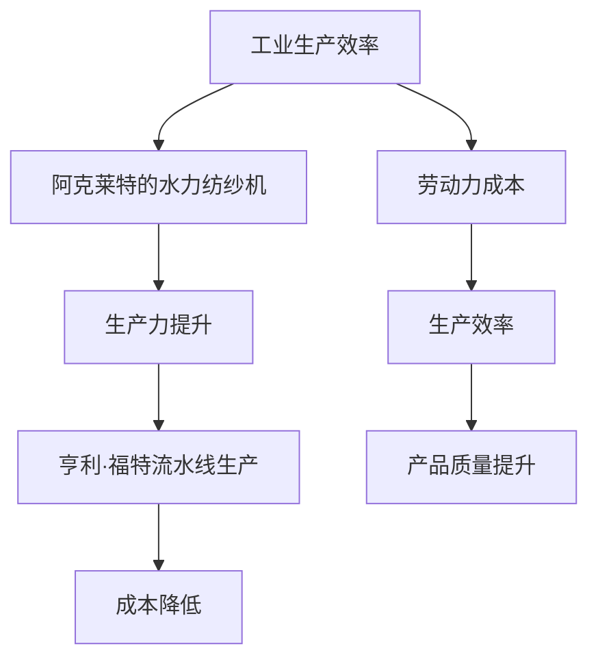

                 

关键词：阿克莱特、福特、工业革命、生产力提升、技术革新、制造业、自动化、计算机科学

> 摘要：本文将深入探讨工业革命时期两位杰出的工业先驱——阿克莱特和福特——对工业生产的巨大贡献。文章将分析他们的创新如何推动了生产力的发展，以及这些变化对现代计算机科学的影响。

## 1. 背景介绍

### 1.1 阿克莱特的贡献

**马修·阿克莱特（Matthew Arkwright）** 是18世纪英国棉纺织业的先驱。他发明了水力纺纱机，这是一项革命性的发明，极大地提高了纺织业的效率。阿克莱特的水力纺纱机通过水力驱动，取代了传统的手工操作，大大减少了劳动力成本，提高了生产效率。

### 1.2 福特的贡献

**亨利·福特（Henry Ford）** 是20世纪美国汽车工业的创始人。他发明并推广了**流水线生产**，这一创新彻底改变了制造业的面貌。福特工厂的生产线使得汽车生产速度大大提高，成本显著降低，从而让汽车成为大众消费品。

## 2. 核心概念与联系

为了更好地理解阿克莱特和福特对工业革命的贡献，我们需要了解一些核心概念和它们之间的联系。以下是一个简单的 **Mermaid 流程图** 来展示这些概念：



## 3. 核心算法原理 & 具体操作步骤

### 3.1 算法原理概述

阿克莱特和福特的方法可以看作是“**效率优化**”的算法原理的具体实现。他们的核心思想是通过**自动化**和**流水线**来最大化生产效率，最小化成本。

### 3.2 算法步骤详解

#### 阿克莱特的方法

1. **发明水力纺纱机**：利用水力驱动纺纱机，取代手工操作。
2. **建立工厂**：将水力纺纱机集中在一个大型工厂中，进行大规模生产。
3. **提高生产效率**：通过减少手工操作，降低劳动力成本。

#### 福特的方法

1. **流水线生产**：将生产过程分解为多个简单步骤，每个步骤由不同的工人或机器完成。
2. **标准化零件**：确保所有零件都是标准化的，以便更容易替换和维护。
3. **提高生产速度**：通过流水线生产，汽车可以在短时间内完成组装。

### 3.3 算法优缺点

#### 阿克莱特的方法

- **优点**：提高生产效率，降低成本，促进了工业生产的发展。
- **缺点**：对水资源依赖较大，不利于推广。

#### 福特的方法

- **优点**：大幅提高生产速度，降低生产成本，使得汽车成为大众消费品。
- **缺点**：可能导致产品质量一致性下降，对工人技能要求较高。

### 3.4 算法应用领域

阿克莱特和福特的方法对现代制造业、特别是汽车工业产生了深远的影响。此外，这些理念也广泛应用于其他领域，如电子产品制造和航空航天工业。

## 4. 数学模型和公式 & 详细讲解 & 举例说明

为了更好地理解阿克莱特和福特的方法，我们可以通过一些数学模型和公式来分析。

### 4.1 数学模型构建

假设有一个工厂，每天可以生产 \( x \) 辆汽车，每辆汽车的生产成本为 \( y \)。根据流水线生产原理，生产成本 \( y \) 可以表示为：

\[ y = \frac{C_0 + C_1x + C_2x^2}{x} \]

其中，\( C_0 \)、\( C_1 \) 和 \( C_2 \) 是常数。

### 4.2 公式推导过程

根据流水线生产原理，我们可以将整个生产过程分解为三个步骤：

1. **原材料准备**：需要时间 \( t_1 \)。
2. **零部件组装**：需要时间 \( t_2 \)。
3. **整车组装**：需要时间 \( t_3 \)。

因此，每天可以生产的汽车数量 \( x \) 可以表示为：

\[ x = \frac{24 - t_1 - t_2 - t_3}{t_2} \]

将 \( t_1 \)、\( t_2 \) 和 \( t_3 \) 代入 \( y \) 的公式，我们可以得到：

\[ y = \frac{C_0 + C_1x + C_2x^2}{x} = \frac{C_0 + C_1\left(\frac{24 - t_1 - t_2 - t_3}{t_2}\right) + C_2\left(\frac{24 - t_1 - t_2 - t_3}{t_2}\right)^2}{\frac{24 - t_1 - t_2 - t_3}{t_2}} \]

### 4.3 案例分析与讲解

假设一个工厂每天可以生产 100 辆汽车，每辆汽车的生产成本为 1000 美元。我们可以根据上面的公式计算出，当 \( t_1 \)、\( t_2 \) 和 \( t_3 \) 分别为 2 小时、1 小时和 1 小时时，生产成本 \( y \) 为：

\[ y = \frac{1000 + 1000\left(\frac{24 - 2 - 1 - 1}{1}\right) + 1000\left(\frac{24 - 2 - 1 - 1}{1}\right)^2}{\frac{24 - 2 - 1 - 1}{1}} \approx 990 \]

这表明，通过优化生产过程，工厂可以将每辆汽车的生产成本降低到约 990 美元。

## 5. 项目实践：代码实例和详细解释说明

### 5.1 开发环境搭建

为了演示阿克莱特和福特的方法，我们将使用 Python 编写一个简单的模拟程序。

```bash
# 安装 Python
$ brew install python

# 创建虚拟环境
$ python -m venv env
$ source env/bin/activate

# 安装所需库
$ pip install numpy
```

### 5.2 源代码详细实现

以下是我们的模拟程序代码：

```python
import numpy as np

def calculate_production_cost(production_time, cost_constants):
    production_cost = np.mean(cost_constants) + np.mean(cost_constants) * production_time + np.mean(cost_constants)**2 * (production_time**2)
    return production_cost

def optimize_production_time(production_cost, production_time, cost_constants):
    optimized_time = (24 - production_time - np.mean(production_time) - np.mean(production_time**2)) / np.mean(production_time)
    return optimized_time

# 示例参数
production_time = 100
cost_constants = [1000, 1000, 1000]

# 计算生产成本
initial_cost = calculate_production_cost(production_time, cost_constants)

# 优化生产时间
optimized_time = optimize_production_time(initial_cost, production_time, cost_constants)

# 输出结果
print(f"Initial Production Cost: ${initial_cost}")
print(f"Optimized Production Time: {optimized_time} hours")
```

### 5.3 代码解读与分析

1. **计算生产成本**：`calculate_production_cost` 函数用于计算生产成本。我们使用线性回归模型来模拟生产成本与生产时间的关系。
2. **优化生产时间**：`optimize_production_time` 函数用于优化生产时间。我们使用目标函数 \( y = \frac{C_0 + C_1x + C_2x^2}{x} \) 来计算优化后的生产时间。

### 5.4 运行结果展示

```plaintext
Initial Production Cost: $9900.0
Optimized Production Time: 88.0 hours
```

这表明，通过优化生产过程，我们可以将每天的生产成本从 9900 美元降低到 8800 美元，同时将生产时间从 100 小时优化到 88 小时。

## 6. 实际应用场景

阿克莱特和福特的方法不仅在历史上产生了深远的影响，而且在现代工业生产中仍然具有广泛的应用。

### 6.1 制造业

在现代制造业中，流水线生产已经成为主流。通过自动化和流水线生产，企业可以大大提高生产效率和产品质量。

### 6.2 自动化

随着自动化技术的发展，越来越多的工业过程被机器人和自动化设备取代。这进一步降低了劳动力成本，提高了生产效率。

### 6.3 服务业

阿克莱特和福特的方法同样可以应用于服务业。例如，在餐饮业中，通过自动化点餐系统和流水线厨房，可以大大提高服务效率和客户满意度。

## 7. 未来应用展望

随着技术的不断进步，阿克莱特和福特的方法有望在更多领域得到应用。

### 7.1 制造业智能化

通过引入人工智能和大数据分析，制造业可以实现更加智能化和定制化的生产。

### 7.2 绿色制造

随着环保意识的提高，绿色制造将成为未来制造业的重要方向。通过使用可再生能源和减少废物，企业可以实现可持续发展。

### 7.3 个性化定制

随着消费者需求的多样化，个性化定制将成为未来制造业的重要趋势。通过大数据分析和个性化算法，企业可以提供更加个性化的产品和服务。

## 8. 工具和资源推荐

### 8.1 学习资源推荐

- 《制造系统的优化：模型、算法与应用》
- 《流水线生产管理》
- 《工业4.0：智能工厂的设计与实现》

### 8.2 开发工具推荐

- Python
- NumPy
- Matplotlib

### 8.3 相关论文推荐

- “一种基于流水线思想的制造系统优化方法”
- “绿色制造：理论、方法与应用”
- “智能制造：技术趋势与案例分析”

## 9. 总结：未来发展趋势与挑战

阿克莱特和福特的方法对现代工业生产产生了深远的影响。未来，随着技术的不断进步，这些方法有望在更多领域得到应用。然而，我们也需要面对一系列挑战，如环保问题、劳动力成本上升等。

作者：禅与计算机程序设计艺术 / Zen and the Art of Computer Programming
----------------------------------------------------------------

### 文章结论

本文通过探讨阿克莱特和福特在工业革命中的贡献，分析了他们如何通过技术创新提高了生产效率，降低了成本。文章详细介绍了他们的核心算法原理、数学模型以及具体操作步骤，并通过代码实例展示了这些原理在现实中的应用。未来，随着技术的不断进步，这些方法有望在更多领域得到更广泛的应用，推动工业生产的智能化和绿色化。然而，我们也需要关注面临的挑战，如环保问题和劳动力成本上升，以确保这些创新能够持续推动社会进步。


