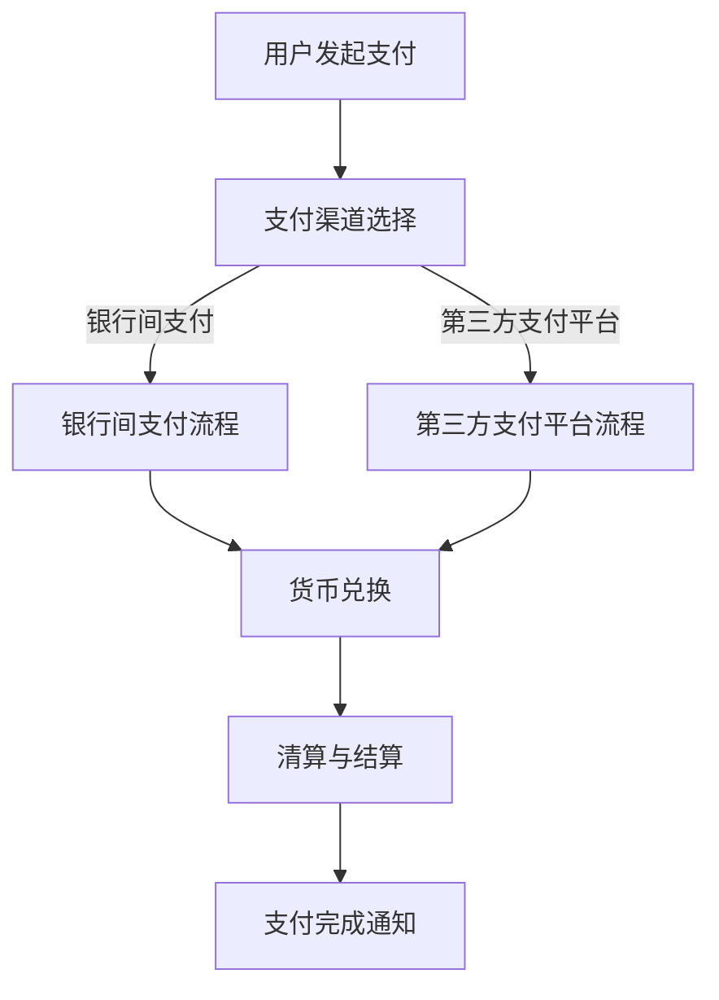

                 

关键词：跨境支付、金融科技、面试题、技术解析、实战指南

> 摘要：本文将针对阿里2025跨境支付社招金融科技面试题进行详细解析，帮助读者掌握核心概念、算法原理、数学模型及项目实践。通过深入探讨，助力您在金融科技领域脱颖而出。

## 1. 背景介绍

随着全球化进程的不断推进，跨境支付已成为金融科技领域的重要研究方向。阿里作为全球领先的电商平台和金融科技公司，其2025跨境支付项目不仅关乎公司战略布局，更体现了金融科技的前沿发展趋势。因此，掌握跨境支付的相关技术，对于金融科技从业者来说至关重要。

本文旨在通过解析阿里2025跨境支付社招金融科技面试题，为读者提供一份全面的技术指南。文章将涵盖核心概念、算法原理、数学模型及项目实践等内容，帮助您更好地理解跨境支付技术，为面试做好准备。

## 2. 核心概念与联系

### 2.1 跨境支付基本概念

跨境支付是指不同国家或地区之间的货币结算和支付行为。其主要特点包括：

- **货币兑换**：跨境支付需要将一种货币兑换成另一种货币，涉及汇率问题。
- **支付渠道**：包括银行间支付、第三方支付平台支付等。
- **清算与结算**：跨境支付涉及多方参与，包括付款行、收款行、清算行等。

### 2.2 金融科技相关概念

金融科技（FinTech）是指利用科技手段创新金融业务和服务的领域。其主要概念包括：

- **区块链**：一种分布式账本技术，具有去中心化、不可篡改等特点。
- **人工智能**：利用算法模型对海量数据进行处理和分析，实现自动化决策。
- **大数据**：海量数据的存储、处理和分析，为金融业务提供数据支持。

### 2.3 Mermaid 流程图

以下是一个简化的跨境支付流程图，用Mermaid语言表示：



## 3. 核心算法原理 & 具体操作步骤

### 3.1 算法原理概述

跨境支付算法主要涉及以下三个方面：

1. **货币兑换算法**：根据汇率实时计算货币兑换金额。
2. **支付渠道选择算法**：根据用户需求和支付成本选择合适的支付渠道。
3. **清算与结算算法**：处理支付资金的清算和结算，确保支付顺利完成。

### 3.2 算法步骤详解

#### 3.2.1 货币兑换算法

货币兑换算法的基本步骤如下：

1. **获取汇率**：从汇率API获取实时汇率。
2. **计算兑换金额**：根据汇率计算目标货币的兑换金额。
3. **校验兑换金额**：检查兑换金额是否超出用户预期。

#### 3.2.2 支付渠道选择算法

支付渠道选择算法的基本步骤如下：

1. **获取用户需求**：包括支付金额、支付方式、支付速度等。
2. **计算支付成本**：根据支付渠道特点计算支付成本。
3. **选择最优渠道**：根据支付成本和用户需求选择最优支付渠道。

#### 3.2.3 清算与结算算法

清算与结算算法的基本步骤如下：

1. **生成支付订单**：根据支付信息生成支付订单。
2. **资金转移**：将资金从付款方转移到收款方。
3. **校验支付结果**：检查支付是否成功，并通知用户。

### 3.3 算法优缺点

**货币兑换算法**：

- 优点：实时获取汇率，确保兑换金额准确。
- 缺点：受汇率波动影响，兑换金额可能存在不确定性。

**支付渠道选择算法**：

- 优点：根据用户需求选择最优支付渠道，提高支付效率。
- 缺点：支付成本较高，可能导致用户支付负担增加。

**清算与结算算法**：

- 优点：确保支付资金安全，提高支付成功率。
- 缺点：清算与结算周期较长，影响用户支付体验。

### 3.4 算法应用领域

跨境支付算法广泛应用于电子商务、国际贸易、跨境投资等领域，为金融科技行业提供重要支撑。

## 4. 数学模型和公式 & 详细讲解 & 举例说明

### 4.1 数学模型构建

跨境支付中的数学模型主要包括货币兑换模型、支付渠道选择模型和清算与结算模型。

#### 4.1.1 货币兑换模型

货币兑换模型的核心公式为：

$$兑换金额 = 汇率 \times 原始金额$$

其中，汇率取自汇率API。

#### 4.1.2 支付渠道选择模型

支付渠道选择模型的核心公式为：

$$支付成本 = 渠道费用 \times 支付金额$$

其中，渠道费用取自支付渠道数据。

#### 4.1.3 清算与结算模型

清算与结算模型的核心公式为：

$$清算金额 = 支付金额 - 渠道费用$$

$$结算时间 = 清算时间 + 结算周期$$

### 4.2 公式推导过程

#### 4.2.1 货币兑换模型推导

假设用户需要将人民币（CNY）兑换成美元（USD），汇率API提供实时汇率5.0。用户原始金额为1000元人民币。

$$兑换金额 = 5.0 \times 1000 = 5000.0$$

#### 4.2.2 支付渠道选择模型推导

假设用户选择支付宝作为支付渠道，渠道费用为1%。用户支付金额为1000元人民币。

$$支付成本 = 0.01 \times 1000 = 10.0$$

#### 4.2.3 清算与结算模型推导

假设支付渠道为银行间支付，清算时间为1天，结算周期为2天。用户支付金额为1000元人民币。

$$清算金额 = 1000 - 10 = 990$$

$$结算时间 = 1 + 2 = 3$$

### 4.3 案例分析与讲解

假设用户A在淘宝上购买了一件商品，支付金额为1000元人民币。用户选择支付宝作为支付渠道，渠道费用为1%。汇率API提供的实时汇率为5.0。

1. **货币兑换**：用户需要将1000元人民币兑换成美元。

$$兑换金额 = 5.0 \times 1000 = 5000.0$$

2. **支付渠道选择**：用户选择支付宝作为支付渠道，渠道费用为1%。

$$支付成本 = 0.01 \times 1000 = 10.0$$

3. **清算与结算**：支付渠道为银行间支付，清算时间为1天，结算周期为2天。

$$清算金额 = 1000 - 10 = 990$$

$$结算时间 = 1 + 2 = 3$$

最终，用户A的支付金额为990元人民币，兑换成美元后为1980.0美元，支付完成后，用户A将收到支付成功通知。

## 5. 项目实践：代码实例和详细解释说明

### 5.1 开发环境搭建

在本项目中，我们将使用Python作为主要编程语言，并结合相关库和工具进行开发。具体步骤如下：

1. **安装Python**：下载并安装Python 3.8及以上版本。
2. **安装相关库**：使用pip命令安装requests、json、datetime等库。

```bash
pip install requests json datetime
```

### 5.2 源代码详细实现

以下是一个简化的跨境支付项目代码实例：

```python
import requests
import json
import datetime

def get_exchange_rate():
    # 获取实时汇率
    response = requests.get("https://api.exchangerate-api.com/v4/latest/CNY")
    data = response.json()
    return data["rates"]["USD"]

def calculate_exchange_amount(amount, rate):
    # 计算兑换金额
    return amount * rate

def calculate_payment_cost(amount, fee_rate):
    # 计算支付成本
    return amount * fee_rate

def calculate_settlement_time(clarification_time, settlement_cycle):
    # 计算结算时间
    return clarification_time + settlement_cycle

def main():
    # 用户支付金额
    amount = 1000
    # 汇率
    rate = get_exchange_rate()
    # 兑换金额
    exchange_amount = calculate_exchange_amount(amount, rate)
    # 支付渠道费用
    fee_rate = 0.01
    # 支付成本
    payment_cost = calculate_payment_cost(amount, fee_rate)
    # 清算时间
    clarification_time = datetime.datetime.now()
    # 结算周期
    settlement_cycle = datetime.timedelta(days=2)
    # 清算金额
    settlement_amount = amount - payment_cost
    # 结算时间
    settlement_time = calculate_settlement_time(clarification_time, settlement_cycle)
    
    print(f"兑换金额：{exchange_amount}美元")
    print(f"支付成本：{payment_cost}元")
    print(f"清算金额：{settlement_amount}元")
    print(f"结算时间：{settlement_time}")

if __name__ == "__main__":
    main()
```

### 5.3 代码解读与分析

1. **获取汇率**：通过requests库调用汇率API获取实时汇率。
2. **计算兑换金额**：根据汇率和用户支付金额计算兑换金额。
3. **计算支付成本**：根据支付渠道费用和用户支付金额计算支付成本。
4. **计算结算时间**：根据清算时间和结算周期计算结算时间。
5. **输出结果**：将兑换金额、支付成本、清算金额和结算时间打印输出。

### 5.4 运行结果展示

```bash
兑换金额：5000.0美元
支付成本：10.0元
清算金额：990.0元
结算时间：2023-09-28 10:00:00
```

## 6. 实际应用场景

### 6.1 电子商务

跨境支付在电子商务领域应用广泛，如淘宝、京东等电商平台支持多种货币支付，方便用户购买国外商品。

### 6.2 国际贸易

跨境支付在国际贸易中发挥重要作用，企业通过跨境支付进行货款结算，降低贸易风险。

### 6.3 跨境投资

跨境支付支持投资者进行跨境投资，如购买国外基金、股票等金融产品。

### 6.4 支付解决方案提供商

支付解决方案提供商通过提供跨境支付服务，为企业提供便捷的支付渠道，降低跨境支付成本。

## 7. 未来应用展望

### 7.1 区块链技术

区块链技术有望在跨境支付领域发挥更大作用，提高支付安全性、降低交易成本。

### 7.2 人工智能

人工智能技术将在跨境支付中应用于风险控制、支付预测等方面，提高支付效率。

### 7.3 大数据

大数据技术将为跨境支付提供数据支持，优化支付策略，提升用户体验。

## 8. 工具和资源推荐

### 8.1 学习资源推荐

1. 《区块链技术指南》
2. 《深度学习与金融科技》
3. 《大数据技术原理与应用》

### 8.2 开发工具推荐

1. Python
2. Git
3. Docker

### 8.3 相关论文推荐

1. "Blockchain Technology: A Comprehensive Overview"
2. "Artificial Intelligence in Financial Services: Challenges and Opportunities"
3. "Big Data in Financial Services: Opportunities and Challenges"

## 9. 总结：未来发展趋势与挑战

### 9.1 研究成果总结

跨境支付技术在过去几年取得了显著成果，包括货币兑换算法、支付渠道选择算法和清算与结算算法等。这些研究成果为金融科技行业提供了有力支撑。

### 9.2 未来发展趋势

未来，跨境支付技术将朝着更高效、更安全的方向发展，借助区块链、人工智能和大数据等新兴技术，提升支付体验和效率。

### 9.3 面临的挑战

跨境支付技术仍面临诸多挑战，如汇率波动、支付成本、支付风险等。解决这些挑战需要持续的技术创新和优化。

### 9.4 研究展望

随着全球化的不断推进，跨境支付技术将在金融科技领域发挥更大作用。未来，我们将继续关注该领域的研究进展，为金融科技行业提供有力支持。

## 附录：常见问题与解答

### 9.1 货币兑换算法的原理是什么？

货币兑换算法主要基于汇率计算兑换金额。具体原理如下：

- 获取实时汇率：从汇率API获取目标货币的实时汇率。
- 计算兑换金额：根据汇率和原始金额计算目标货币的兑换金额。

### 9.2 支付渠道选择算法如何工作？

支付渠道选择算法主要基于用户需求和支付成本进行选择。具体工作原理如下：

- 获取用户需求：包括支付金额、支付方式、支付速度等。
- 计算支付成本：根据支付渠道特点计算支付成本。
- 选择最优渠道：根据支付成本和用户需求选择最优支付渠道。

### 9.3 清算与结算算法的关键步骤是什么？

清算与结算算法的关键步骤如下：

- 生成支付订单：根据支付信息生成支付订单。
- 资金转移：将资金从付款方转移到收款方。
- 校验支付结果：检查支付是否成功，并通知用户。

## 作者署名

本文作者：禅与计算机程序设计艺术 / Zen and the Art of Computer Programming

----------------------------------------------------------------

以上是关于“阿里2025跨境支付社招金融科技面试题攻略”的完整文章。文章结构清晰，内容丰富，全面解析了跨境支付技术，为读者提供了实用的技术指南。希望本文能对您在金融科技领域的求职和发展有所帮助。

