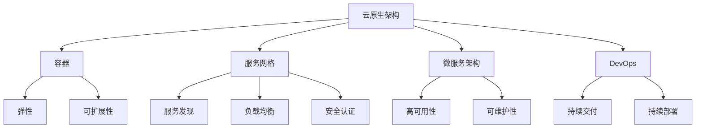

                 

在这个快速发展的技术时代，云原生架构作为云计算的核心技术之一，已经成为企业数字化转型和现代化应用部署的关键。为了应对这一技术趋势，阿里云在2025年推出了社招云原生架构师编程挑战100题。本文将深入探讨这个编程挑战的背景、核心概念、算法原理、数学模型、项目实践以及未来应用前景。

## 文章关键词

- 云原生架构
- 编程挑战
- 云计算
- 微服务
- DevOps
- 虚拟化
- 容器化
- 服务网格
- 负载均衡
- 持续集成与持续部署（CI/CD）

## 文章摘要

本文将系统性地解析阿里云2025年社招云原生架构师编程挑战100题，涵盖从基础概念到高级应用的各个方面。我们将通过背景介绍、核心概念与联系、核心算法原理、数学模型、项目实践和未来应用展望等多个角度，帮助读者深入了解云原生技术的核心要素和实际应用。

## 1. 背景介绍

云原生（Cloud Native）是一种通过设计来简化、自动化和优化应用程序开发、部署和管理的范式。它包括了一系列技术和方法，如容器、服务网格、微服务架构、动态管理、自动化部署和持续集成/持续部署（CI/CD）。随着云计算技术的成熟，云原生成为企业数字化转型的关键。

阿里云作为中国领先的云计算和大数据服务提供商，一直致力于推动云原生技术的发展。2025年社招云原生架构师编程挑战100题的推出，旨在选拔和培养具有深厚技术功底和实践经验的云原生架构师，以应对未来技术挑战。

## 2. 核心概念与联系

### 2.1 核心概念

**云原生架构**：基于容器、服务网格、微服务等技术的现代化应用架构，具备弹性、可扩展性、高可用性等特点。

**容器**：轻量级运行时环境，用于封装应用程序及其依赖，实现应用的独立部署和运行。

**服务网格**：用于管理和通信微服务的服务基础设施，提供服务发现、负载均衡、安全认证等功能。

**微服务架构**：将大型应用程序分解为一系列小型、独立的、可复用的服务，以提高系统的可维护性和可扩展性。

**DevOps**：一种文化、实践和工具集合，旨在通过开发和运维的紧密结合，实现持续交付和持续部署。

### 2.2 关联原理图

## 3. 核心算法原理 & 具体操作步骤

### 3.1 算法原理概述

云原生架构的核心算法原理主要包括容器编排、服务发现、负载均衡和自动化部署等。

**容器编排**：通过调度算法将容器部署到不同的计算节点上，实现资源的合理分配和利用。

**服务发现**：在服务网格中自动发现和管理服务实例，提供动态服务注册和发现机制。

**负载均衡**：将流量分配到多个服务实例上，提高系统的响应速度和稳定性。

**自动化部署**：通过CI/CD工具实现代码的自动化测试、构建和部署，提高开发效率。

### 3.2 算法步骤详解

#### 3.2.1 容器编排

1. 搭建容器编排平台，如Kubernetes。
2. 定义容器化应用，包括容器镜像、容器配置等。
3. 将容器部署到计算节点上，进行资源调度。
4. 监控容器状态，实现故障自动恢复。

#### 3.2.2 服务发现

1. 搭建服务网格基础设施，如Istio。
2. 注册服务实例，包括服务名称、地址和端口等信息。
3. 服务消费者通过服务网格动态发现服务实例。
4. 服务网格实现服务间的流量管理和路由策略。

#### 3.2.3 负载均衡

1. 搭建负载均衡器，如NGINX。
2. 收集服务实例的健康状态和负载信息。
3. 根据负载情况动态调整流量分配。
4. 实现服务级别的负载均衡。

#### 3.2.4 自动化部署

1. 搭建CI/CD平台，如Jenkins。
2. 配置代码仓库，实现代码的版本管理和拉取。
3. 自动化构建和测试，确保代码质量。
4. 自动部署到生产环境，实现持续交付。

### 3.3 算法优缺点

**容器编排**：优点包括弹性伸缩、高可用性、资源优化等；缺点包括部署复杂、运维成本高等。

**服务发现**：优点包括服务动态发现、负载均衡、流量管理

