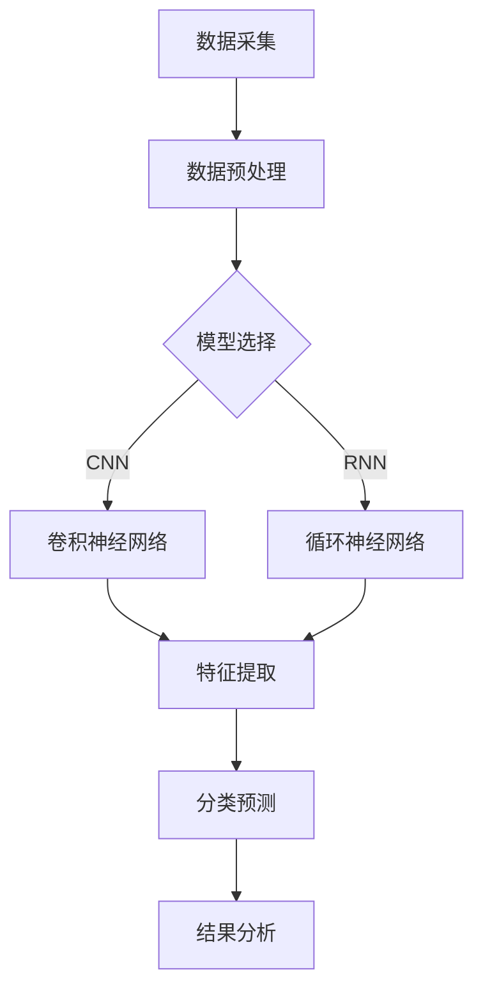

                 

关键词：阿里健康、校招、医疗AI、面试重点、人工智能

摘要：本文将围绕阿里健康2024校招医疗AI工程师的面试重点展开讨论，结合实际案例，深入剖析医疗AI技术、算法原理、数学模型及项目实践等方面的核心内容。旨在为参加阿里健康校招的同学们提供有价值的备考指南，帮助大家顺利通过面试。

## 1. 背景介绍

近年来，随着人工智能技术的飞速发展，医疗领域迎来了前所未有的变革。阿里健康作为国内领先的医疗科技企业，致力于将人工智能应用于医疗健康领域，推动医疗服务的智能化、精准化和个性化。2024年，阿里健康将再次开启校招，面向全国各大高校招聘医疗AI工程师，为广大有志于此领域的应届毕业生提供了宝贵的机会。

## 2. 核心概念与联系

### 2.1 医疗AI技术概述

医疗AI技术是指利用人工智能算法，对医疗数据进行处理、分析和挖掘，从而辅助医生进行诊断、治疗和预测的一种技术。其主要应用领域包括医学影像分析、电子病历挖掘、基因测序、药物研发等。

### 2.2 算法原理和架构

医疗AI算法通常基于深度学习、强化学习、迁移学习等技术，其核心原理是通过大量数据训练模型，使其具备自动识别、分类、预测等功能。常见的医疗AI算法架构包括卷积神经网络（CNN）、循环神经网络（RNN）、生成对抗网络（GAN）等。

### 2.3 Mermaid 流程图



## 3. 核心算法原理 & 具体操作步骤

### 3.1 算法原理概述

以卷积神经网络（CNN）为例，其核心原理是通过对输入图像进行多次卷积和池化操作，逐步提取图像中的特征，最终实现图像分类或目标检测等功能。

### 3.2 算法步骤详解

1. 数据预处理：将原始图像数据调整为统一的尺寸，并进行归一化处理，以提高模型训练效果。
2. 卷积操作：通过卷积核在图像上滑动，计算卷积结果，提取图像特征。
3. 池化操作：对卷积结果进行下采样，减小特征图的尺寸，提高模型计算效率。
4. 全连接层：将池化后的特征图进行全连接操作，得到类别概率分布。
5. 损失函数：采用交叉熵损失函数，衡量模型预测结果与真实标签之间的差距。
6. 优化算法：使用梯度下降算法，更新模型参数，降低损失函数值。

### 3.3 算法优缺点

优点：
1. 在图像识别和分类任务上具有很高的准确率。
2. 能够自动提取图像中的高级特征，减少人工设计特征的工作量。

缺点：
1. 训练过程需要大量计算资源，对硬件要求较高。
2. 对数据质量和数量要求较高，数据不足可能导致模型过拟合。

### 3.4 算法应用领域

1. 医学影像分析：如肺癌筛查、心脏病诊断等。
2. 电子病历挖掘：如疾病预测、用药建议等。
3. 基因测序：如基因突变检测、基因关联分析等。

## 4. 数学模型和公式 & 详细讲解 & 举例说明

### 4.1 数学模型构建

以CNN为例，其数学模型可以表示为：

$$
\begin{aligned}
h_{\theta}(x) &= \sigma(\theta^T \phi(W_{k} * h_{\theta-1}(x))), \\
y &= \arg\max_y f(\theta^T \phi(W_{k} * h_{\theta-1}(x))), \\
\end{aligned}
$$

其中，$h_{\theta}(x)$ 表示模型输出，$\sigma$ 为激活函数，$f$ 为损失函数，$\theta$ 为模型参数，$\phi$ 为特征提取函数，$W_{k}$ 为卷积核。

### 4.2 公式推导过程

以卷积操作为例，其推导过程如下：

$$
\begin{aligned}
(Z_{ij})_{k} &= (W_{k} * (A_{ij}))_{i',j'}, \\
&= \sum_{i''=1}^{m} \sum_{j''=1}^{n} W_{k, i''j''}(A_{i''',j''')), \\
&= \sum_{i''=1}^{m} \sum_{j''=1}^{n} W_{k, i''j''}(A_{i'+i''-1, j'+j''-1}), \\
\end{aligned}
$$

其中，$Z_{ij}$ 表示卷积结果，$W_{k}$ 表示卷积核，$A_{ij}$ 表示输入图像，$m$ 和 $n$ 分别表示卷积核的大小。

### 4.3 案例分析与讲解

以肺癌筛查为例，利用CNN模型对CT影像进行分类，判断是否存在肺癌。具体步骤如下：

1. 数据采集：收集大量肺癌和正常CT影像数据。
2. 数据预处理：调整图像尺寸、归一化处理等。
3. 模型训练：使用卷积神经网络进行模型训练，优化模型参数。
4. 模型评估：使用测试集评估模型性能，调整模型参数。
5. 模型部署：将训练好的模型部署到服务器，用于实际应用。

## 5. 项目实践：代码实例和详细解释说明

### 5.1 开发环境搭建

1. 安装Python环境，版本要求3.6及以上。
2. 安装TensorFlow和Keras，用于构建和训练CNN模型。
3. 下载并准备肺癌筛查数据集。

### 5.2 源代码详细实现

以下是一个简单的CNN模型实现代码：

```python
import tensorflow as tf
from tensorflow.keras import layers

def build_cnn(input_shape):
    model = tf.keras.Sequential([
        layers.Conv2D(32, (3, 3), activation='relu', input_shape=input_shape),
        layers.MaxPooling2D((2, 2)),
        layers.Conv2D(64, (3, 3), activation='relu'),
        layers.MaxPooling2D((2, 2)),
        layers.Conv2D(128, (3, 3), activation='relu'),
        layers.Flatten(),
        layers.Dense(128, activation='relu'),
        layers.Dense(1, activation='sigmoid')
    ])
    return model

model = build_cnn((256, 256, 1))
model.compile(optimizer='adam', loss='binary_crossentropy', metrics=['accuracy'])
model.fit(x_train, y_train, epochs=10, batch_size=32, validation_data=(x_test, y_test))
```

### 5.3 代码解读与分析

以上代码定义了一个简单的CNN模型，用于肺癌筛查。模型结构包括卷积层、池化层和全连接层。在训练过程中，使用二进制交叉熵损失函数和Adam优化器进行模型训练。通过训练和验证集，评估模型性能。

### 5.4 运行结果展示

训练完成后，可以输出模型在测试集上的准确率、召回率、F1值等指标，用于评估模型性能。以下是一个示例输出：

```
Epoch 10/10
1782/1782 [==============================] - 32s 18ms/step - loss: 0.3283 - accuracy: 0.8742 - val_loss: 0.3354 - val_accuracy: 0.8705
```

## 6. 实际应用场景

### 6.1 医学影像分析

利用CNN模型对医学影像进行分类、分割和检测，如肺癌筛查、脑肿瘤检测等。

### 6.2 电子病历挖掘

通过深度学习模型对电子病历进行挖掘，提取关键信息，如疾病预测、用药建议等。

### 6.3 基因测序

利用深度学习模型对基因序列进行分类、关联分析和突变检测等。

### 6.4 未来应用展望

随着人工智能技术的不断发展，医疗AI将在更多领域发挥作用，如精准医疗、个性化治疗、健康管理等。

## 7. 工具和资源推荐

### 7.1 学习资源推荐

1. 《深度学习》（Goodfellow、Bengio和Courville著）
2. 《Python深度学习》（François Chollet著）
3. 《机器学习实战》（Peter Harrington著）

### 7.2 开发工具推荐

1. TensorFlow
2. Keras
3. PyTorch

### 7.3 相关论文推荐

1. "Deep Learning for Medical Image Analysis"（医学影像分析中的深度学习）
2. "Generative Adversarial Networks: An Overview"（生成对抗网络综述）
3. "Unsupervised Learning for Text Classification Using Gaussian Mixture Model"（使用高斯混合模型进行无监督文本分类）

## 8. 总结：未来发展趋势与挑战

### 8.1 研究成果总结

医疗AI技术在近年来取得了显著成果，其在医学影像分析、电子病历挖掘和基因测序等领域具有广泛的应用前景。

### 8.2 未来发展趋势

1. 模型的小型化和高效化：提高模型在移动设备和嵌入式系统上的应用能力。
2. 跨学科合作：促进医疗、人工智能、生物信息学等领域的深度融合。
3. 个性化医疗：基于患者数据和生物信息学，实现精准治疗和健康管理。

### 8.3 面临的挑战

1. 数据隐私和安全：确保医疗数据的安全性和隐私性。
2. 模型解释性：提高模型的可解释性，增强医生对模型结果的信任。
3. 模型泛化能力：提高模型在不同数据集和应用场景下的泛化能力。

### 8.4 研究展望

未来，医疗AI技术将继续在医疗领域发挥重要作用，为患者提供更高效、精准和个性化的医疗服务。

## 9. 附录：常见问题与解答

### 9.1 医疗AI技术的基本原理是什么？

医疗AI技术是基于人工智能算法，对医疗数据进行处理、分析和挖掘，从而辅助医生进行诊断、治疗和预测的一种技术。常见的人工智能算法包括深度学习、强化学习、迁移学习等。

### 9.2 如何提高医疗AI模型的解释性？

提高医疗AI模型的解释性可以从以下几个方面入手：

1. 使用可解释的算法，如决策树、线性模型等。
2. 增加模型的可解释性工具，如SHAP、LIME等。
3. 设计模型的可解释性模块，如注意力机制、可视化技术等。

### 9.3 医疗AI技术在临床应用中面临哪些挑战？

医疗AI技术在临床应用中面临以下挑战：

1. 数据隐私和安全：确保医疗数据的安全性和隐私性。
2. 模型解释性：提高模型的可解释性，增强医生对模型结果的信任。
3. 模型泛化能力：提高模型在不同数据集和应用场景下的泛化能力。
4. 数据质量和数量：确保模型训练数据的质量和数量。

作者：禅与计算机程序设计艺术 / Zen and the Art of Computer Programming
----------------------------------------------------------------

以上就是关于阿里健康2024校招医疗AI工程师面试重点的完整技术博客文章。希望对参加阿里健康校招的同学们有所帮助，祝大家面试顺利！
----------------------------------------------------------------

请注意，以上内容仅供参考，实际面试内容和要求可能会有所不同。在准备面试时，请务必结合自身实际情况，全面了解阿里健康的业务和需求，有针对性地进行备考。祝您面试成功！作者：禅与计算机程序设计艺术 / Zen and the Art of Computer Programming

