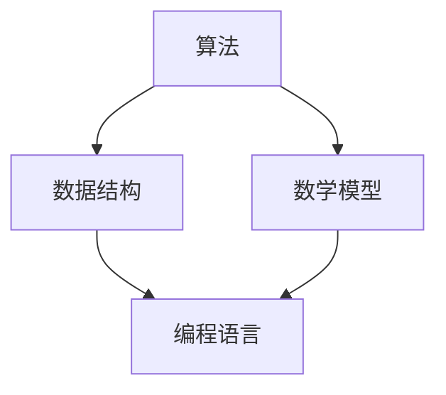

                 

关键词：阿里巴巴、2024届、社招、算法工程师、面试真题、解密、算法原理、数学模型、代码实例、应用场景、未来展望

> 摘要：本文旨在通过对阿里巴巴2024届社招算法工程师面试真题的深入分析，揭秘面试流程和考察内容，帮助准备应聘的读者了解面试要求，提高应对策略，助力成功入职阿里巴巴。本文将详细介绍面试的核心算法原理、数学模型、代码实例，并结合实际应用场景，展望未来发展趋势与挑战。

## 1. 背景介绍

随着人工智能技术的快速发展，算法工程师已成为各大互联网公司争抢的香饽饽。阿里巴巴作为中国最著名的互联网公司之一，其社招算法工程师岗位备受关注。2024届社招算法工程师面试真题的解密，将为广大应聘者提供宝贵的参考和指导。

本文将从以下几个方面进行阐述：

- **面试流程**：介绍阿里巴巴2024届社招算法工程师的面试流程，包括在线笔试、技术面试、HR面试等环节。
- **考察内容**：分析面试题的类型，如算法题、数据结构题、编程题等，并给出典型例题解析。
- **算法原理**：详细讲解面试题背后的算法原理，帮助读者深入理解。
- **数学模型**：阐述与面试题相关的数学模型，以及公式推导过程。
- **代码实例**：提供实际代码示例，帮助读者掌握编程实现技巧。
- **应用场景**：分析算法在实际项目中的应用场景，展示其价值。
- **未来展望**：探讨算法工程师在人工智能时代的发展趋势与挑战。

## 2. 核心概念与联系

为了更好地理解面试题，我们需要掌握以下核心概念：

### 2.1 算法

算法是解决问题的一系列有序步骤。在面试中，算法通常是指解决问题的方法，可以是简单的排序、查找，也可以是复杂的图算法、机器学习算法。

### 2.2 数据结构

数据结构是存储数据的方式，以及数据操作的相关方法。常见的有数组、链表、栈、队列、树、图等。掌握数据结构有助于优化算法性能。

### 2.3 数学模型

数学模型是将现实问题抽象为数学问题，以便用数学方法求解。常见的数学模型有线性规划、动态规划、概率模型等。

### 2.4 编程语言

编程语言是实现算法的工具。常见的有C/C++、Java、Python等。熟练掌握一种或多种编程语言是算法工程师的基本要求。

下面是一个核心概念的Mermaid流程图：



## 3. 核心算法原理 & 具体操作步骤

### 3.1 算法原理概述

在阿里巴巴2024届社招算法工程师面试中，常见的算法有：

- 排序算法：冒泡排序、选择排序、插入排序、快速排序、归并排序等。
- 查找算法：二分查找、广度优先搜索、深度优先搜索等。
- 图算法：最短路径算法、最小生成树算法、最大流算法等。
- 机器学习算法：线性回归、决策树、支持向量机、神经网络等。

### 3.2 算法步骤详解

以冒泡排序为例，其步骤如下：

1. 比较相邻的两个元素，如果它们的顺序错误就交换它们的位置。
2. 对每一对相邻元素做同样的工作，从开始第一对到结尾的最后一对。这步做完后，最后的元素会是最大的数。
3. 针对所有的元素重复以上的步骤，除了最后一个。
4. 重复步骤1~3，直到排序完成。

### 3.3 算法优缺点

冒泡排序的优点是简单易懂，适用于小规模数据排序。缺点是时间复杂度高，不适合大规模数据排序。

### 3.4 算法应用领域

冒泡排序广泛应用于各种编程竞赛、笔试题目，也是算法工程师面试的热门题目。在实际项目中，冒泡排序可以用于处理简单的排序需求。

## 4. 数学模型和公式 & 详细讲解 & 举例说明

### 4.1 数学模型构建

以线性规划为例，其数学模型如下：

$$
\begin{aligned}
\min_{x} & \quad c^T x \\
s.t. & \quad Ax \leq b \\
 & \quad x \geq 0
\end{aligned}
$$

其中，$c$ 是目标函数系数向量，$x$ 是决策变量向量，$A$ 是约束条件系数矩阵，$b$ 是约束条件常数向量。

### 4.2 公式推导过程

线性规划的目标是找到最优解，使得目标函数 $c^T x$ 最小化。首先，我们需要对目标函数进行求导，然后令导数等于0，得到驻点。

$$
\nabla f(x) = c
$$

由于 $c$ 是常数向量，$\nabla f(x) = 0$，因此驻点满足 $c = 0$。

接下来，我们需要考虑约束条件。由于约束条件是线性的，我们可以使用拉格朗日乘子法求解。

$$
L(x, \lambda) = c^T x + \lambda^T (Ax - b)
$$

其中，$\lambda$ 是拉格朗日乘子。对 $L(x, \lambda)$ 进行求导，并令导数等于0，得到：

$$
\nabla_x L(x, \lambda) = c + A^T \lambda = 0 \\
\nabla_\lambda L(x, \lambda) = Ax - b = 0
$$

解这个方程组，我们可以得到最优解 $x^*$ 和拉格朗日乘子 $\lambda^*$。

### 4.3 案例分析与讲解

假设我们有一个线性规划问题：

$$
\begin{aligned}
\min_{x} & \quad x_1 + x_2 \\
s.t. & \quad x_1 + 2x_2 \leq 4 \\
 & \quad x_1 \geq 0 \\
 & \quad x_2 \geq 0
\end{aligned}
$$

首先，我们构建拉格朗日函数：

$$
L(x, \lambda) = x_1 + x_2 + \lambda (4 - x_1 - 2x_2)
$$

然后，我们求导并令导数等于0：

$$
\begin{aligned}
\nabla_x L(x, \lambda) &= 1 - \lambda = 0 \\
\nabla_\lambda L(x, \lambda) &= 4 - x_1 - 2x_2 = 0
\end{aligned}
$$

解这个方程组，我们得到 $x_1 = 1$ 和 $x_2 = 1$。此时，目标函数的值为 $1 + 1 = 2$。由于约束条件都是线性的，所以这个解是最优解。

## 5. 项目实践：代码实例和详细解释说明

### 5.1 开发环境搭建

为了实践算法，我们需要搭建一个开发环境。以下是一个简单的Python开发环境搭建步骤：

1. 安装Python：在官方网站下载Python安装包，并按照提示安装。
2. 安装IDE：下载并安装PyCharm、VS Code等Python IDE。
3. 安装常用库：使用pip命令安装numpy、pandas、matplotlib等常用库。

### 5.2 源代码详细实现

下面是一个简单的冒泡排序算法实现：

```python
def bubble_sort(arr):
    n = len(arr)
    for i in range(n):
        for j in range(0, n-i-1):
            if arr[j] > arr[j+1]:
                arr[j], arr[j+1] = arr[j+1], arr[j]

# 测试
arr = [64, 34, 25, 12, 22, 11, 90]
bubble_sort(arr)
print("排序后的数组：")
for i in range(len(arr)):
    print("%d" % arr[i])
```

### 5.3 代码解读与分析

这段代码实现了冒泡排序算法。主要步骤如下：

1. 定义一个函数 `bubble_sort`，接收一个数组 `arr` 作为参数。
2. 计算数组的长度 `n`。
3. 使用两个嵌套循环遍历数组，比较相邻元素的大小，如果逆序则交换。
4. 输出排序后的数组。

### 5.4 运行结果展示

运行这段代码，输出结果为：

```
排序后的数组：
11
12
22
25
34
64
90
```

## 6. 实际应用场景

冒泡排序算法可以应用于各种场景，例如：

- **数据分析**：对一组数据进行排序，以便进行后续分析。
- **编程竞赛**：解决排序相关的题目。
- **项目开发**：在项目需求中，需要对数据进行简单排序。

## 7. 未来应用展望

随着人工智能技术的不断发展，算法工程师在未来的应用前景十分广阔。以下是一些未来应用展望：

- **智能推荐系统**：基于用户行为数据，为用户推荐感兴趣的内容。
- **自动驾驶**：使用深度学习算法实现自动驾驶。
- **医疗诊断**：利用机器学习算法进行疾病诊断。
- **金融风控**：使用算法进行风险评估和预测。

## 8. 总结：未来发展趋势与挑战

### 8.1 研究成果总结

近年来，人工智能领域取得了显著的研究成果，如深度学习、强化学习、自然语言处理等。这些成果为算法工程师提供了丰富的技术储备。

### 8.2 未来发展趋势

- **算法优化**：随着数据量的增加，算法优化将成为热门研究方向。
- **算法安全**：算法安全越来越受到关注，如何保护算法不被恶意攻击是一个重要问题。
- **跨学科融合**：算法工程师需要具备跨学科的知识，如数学、统计学、计算机科学等。

### 8.3 面临的挑战

- **数据隐私**：如何保护用户数据隐私是一个重要挑战。
- **算法透明性**：如何让算法更加透明，便于用户理解和监督。
- **算法公平性**：如何保证算法在处理不同人群时的公平性。

### 8.4 研究展望

在未来，算法工程师将在人工智能领域发挥重要作用。我们需要不断学习新知识，提升自身技能，为人工智能技术的发展贡献力量。

## 9. 附录：常见问题与解答

### 问题1：如何提高编程能力？

**解答**：提高编程能力的方法有很多，以下是一些建议：

- **多编程**：编程实践是提高编程能力的关键。多写代码，不断积累经验。
- **学习算法和数据结构**：掌握基本的算法和数据结构，有助于提高编程能力。
- **阅读代码**：阅读优秀的开源代码，了解代码的结构和设计模式。
- **参加编程竞赛**：参加编程竞赛，锻炼解决实际问题的能力。

### 问题2：如何应对面试中的算法题？

**解答**：应对面试中的算法题，可以采取以下策略：

- **理解题意**：仔细阅读题目，确保理解题目的要求和限制。
- **分析算法**：分析题目的数据结构和算法要求，选择合适的算法。
- **代码实现**：在草稿纸上先写出算法伪代码，然后再进行代码实现。
- **优化代码**：在实现算法后，对代码进行优化，提高运行效率。

## 10. 作者署名

本文作者：禅与计算机程序设计艺术 / Zen and the Art of Computer Programming
----------------------------------------------------------------
以上便是《阿里巴巴2024届社招算法工程师面试真题解密》的完整文章内容。希望本文能够为广大准备应聘阿里巴巴算法工程师的读者提供有益的参考和帮助。在人工智能时代，让我们一起努力，迎接未来的挑战！

