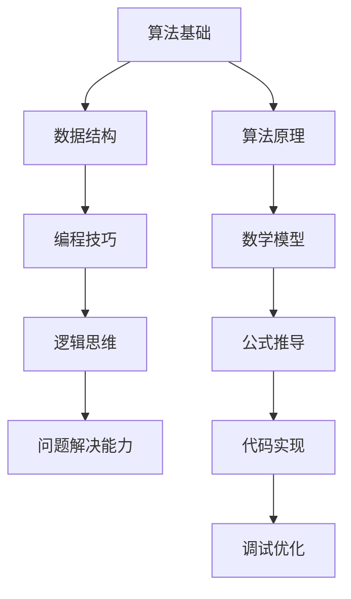

                 

摘要：本文旨在为广大求职者和面试者提供一份详细解析阿里巴巴2024届社招面试中高频出现的算法题。通过对这些算法题的深入分析和实战演练，读者可以掌握解决问题的方法，提升面试技巧。文章涵盖了算法原理、具体操作步骤、数学模型与公式、代码实例以及实际应用场景等多个方面，旨在帮助读者全面提升算法能力。

## 1. 背景介绍

随着信息技术的飞速发展，算法题在各大互联网公司的面试中占据了越来越重要的地位。阿里巴巴作为中国乃至全球知名的互联网巨头，其社招面试中的算法题更是备受关注。这些算法题不仅考察应聘者的编程能力和数据结构知识，还考验应聘者的逻辑思维、分析问题和解决问题的能力。本文将针对阿里巴巴2024届社招面试中高频出现的算法题进行详细解析，帮助读者掌握解题技巧，提高面试成功率。

## 2. 核心概念与联系

在解答算法题之前，我们需要了解一些核心概念和联系。以下是一个简单的 Mermaid 流程图，用于展示这些核心概念：



### 2.1 算法基础

算法基础是解决算法题的基石。常见的算法有排序、查找、贪心、动态规划、图论等。掌握这些算法的基本原理和常见题型是解决面试题的关键。

### 2.2 数据结构

数据结构是算法题的核心。常见的有数组、链表、栈、队列、树、图等。理解这些数据结构的特点和适用场景对于解题非常重要。

### 2.3 编程技巧

编程技巧包括代码风格、命名规范、时间复杂度分析等。良好的编程习惯可以提高代码的可读性和效率。

### 2.4 逻辑思维

逻辑思维是解题的核心。通过分析题目，提取关键信息，构建解决问题的模型，是解决算法题的关键步骤。

### 2.5 问题解决能力

问题解决能力是算法题的核心。在面对复杂的算法题时，需要灵活运用所学知识，找到最合适的解决方法。

### 2.6 算法原理

算法原理是解决算法题的基础。了解算法的基本原理，可以帮助我们更好地理解和运用各种算法。

### 2.7 数学模型

数学模型是算法题的重要部分。通过构建数学模型，我们可以将问题转化为数学问题，从而更好地解决。

### 2.8 公式推导

公式推导是数学模型的重要组成部分。理解公式推导过程，可以帮助我们更好地理解数学模型。

### 2.9 代码实现

代码实现是将算法和数学模型转化为实际代码的过程。掌握编程语言和工具，可以帮助我们更高效地实现算法。

### 2.10 调试优化

调试优化是代码实现的重要环节。通过调试，我们可以发现并修复代码中的错误，从而提高代码的可靠性。

## 3. 核心算法原理 & 具体操作步骤

### 3.1 算法原理概述

在本章节，我们将介绍一些核心算法的原理，包括排序、查找、动态规划等。这些算法是解决算法题的基础。

### 3.2 算法步骤详解

在了解算法原理后，我们需要掌握具体的算法步骤。以下是几种常见算法的步骤详解：

- **排序算法**：冒泡排序、选择排序、插入排序、快速排序、归并排序等。
- **查找算法**：二分查找、顺序查找、哈希查找等。
- **动态规划**：斐波那契数列、最长公共子序列、背包问题等。

### 3.3 算法优缺点

每种算法都有其优缺点。了解算法的优缺点，可以帮助我们选择最合适的算法解决特定问题。

### 3.4 算法应用领域

算法广泛应用于各个领域，如计算机科学、人工智能、金融、生物信息学等。了解算法的应用领域，可以让我们更好地理解算法的实际价值。

## 4. 数学模型和公式 & 详细讲解 & 举例说明

### 4.1 数学模型构建

在算法题中，数学模型是解决问题的关键。构建数学模型的过程包括理解题目、提取关键信息、建立数学模型等。

### 4.2 公式推导过程

公式推导是构建数学模型的重要环节。在本章节，我们将详细介绍几种常见公式的推导过程。

### 4.3 案例分析与讲解

通过具体的案例，我们可以更好地理解数学模型和公式的应用。在本章节，我们将分析几个具有代表性的案例，并进行详细讲解。

## 5. 项目实践：代码实例和详细解释说明

### 5.1 开发环境搭建

在进行项目实践之前，我们需要搭建合适的开发环境。在本章节，我们将介绍如何搭建适合算法题实践的编程环境。

### 5.2 源代码详细实现

在本章节，我们将给出一个具体的算法题的源代码实现，并对其进行详细解释。

### 5.3 代码解读与分析

理解代码是实现算法题的关键。在本章节，我们将对给出的源代码进行解读和分析。

### 5.4 运行结果展示

在本章节，我们将展示算法题的运行结果，并对其进行分析。

## 6. 实际应用场景

### 6.1 社交网络

社交网络是一个典型的算法应用场景。在本章节，我们将探讨社交网络中的算法应用。

### 6.2 搜索引擎

搜索引擎是另一个典型的算法应用场景。在本章节，我们将介绍搜索引擎中的算法应用。

### 6.3 金融领域

金融领域是一个广泛且复杂的算法应用场景。在本章节，我们将探讨金融领域中的算法应用。

### 6.4 未来应用展望

随着技术的不断发展，算法的应用场景将越来越广泛。在本章节，我们将展望算法在未来应用中的发展方向。

## 7. 工具和资源推荐

### 7.1 学习资源推荐

为了更好地学习算法，我们需要利用各种学习资源。在本章节，我们将推荐一些优秀的算法学习资源。

### 7.2 开发工具推荐

合适的开发工具可以提高我们的编程效率。在本章节，我们将推荐一些实用的开发工具。

### 7.3 相关论文推荐

阅读相关论文可以帮助我们深入了解算法的研究进展。在本章节，我们将推荐一些经典的算法论文。

## 8. 总结：未来发展趋势与挑战

### 8.1 研究成果总结

在过去的几年中，算法研究取得了许多重要的成果。在本章节，我们将总结这些研究成果。

### 8.2 未来发展趋势

随着技术的不断发展，算法将在未来发挥更加重要的作用。在本章节，我们将探讨算法的未来发展趋势。

### 8.3 面临的挑战

尽管算法研究取得了许多进展，但仍然面临着许多挑战。在本章节，我们将讨论算法研究面临的挑战。

### 8.4 研究展望

在未来，算法研究将继续深入，并将为人类社会带来更多的创新和进步。在本章节，我们将展望算法研究的未来。

## 9. 附录：常见问题与解答

在本章节，我们将回答读者在阅读本文过程中可能遇到的一些常见问题。

----------------------------------------------------------------

完成上述文章撰写后，请按照以下格式进行最终文章的markdown输出：
```
# 阿里巴巴2024届社招面试高频算法题解析

> 关键词：阿里巴巴、社招、面试、算法题、解析、数据结构、编程技巧

> 摘要：本文旨在为广大求职者和面试者提供一份详细解析阿里巴巴2024届社招面试中高频出现的算法题。通过对这些算法题的深入分析和实战演练，读者可以掌握解决问题的方法，提升面试技巧。文章涵盖了算法原理、具体操作步骤、数学模型与公式、代码实例以及实际应用场景等多个方面，旨在帮助读者全面提升算法能力。

## 1. 背景介绍

## 2. 核心概念与联系

## 3. 核心算法原理 & 具体操作步骤

### 3.1 算法原理概述

### 3.2 算法步骤详解 

### 3.3 算法优缺点

### 3.4 算法应用领域

## 4. 数学模型和公式 & 详细讲解 & 举例说明

### 4.1 数学模型构建

### 4.2 公式推导过程

### 4.3 案例分析与讲解

## 5. 项目实践：代码实例和详细解释说明

### 5.1 开发环境搭建

### 5.2 源代码详细实现

### 5.3 代码解读与分析

### 5.4 运行结果展示

## 6. 实际应用场景

### 6.1 社交网络

### 6.2 搜索引擎

### 6.3 金融领域

### 6.4 未来应用展望

## 7. 工具和资源推荐

### 7.1 学习资源推荐

### 7.2 开发工具推荐

### 7.3 相关论文推荐

## 8. 总结：未来发展趋势与挑战

### 8.1 研究成果总结

### 8.2 未来发展趋势

### 8.3 面临的挑战

### 8.4 研究展望

## 9. 附录：常见问题与解答

作者：禅与计算机程序设计艺术 / Zen and the Art of Computer Programming
```

