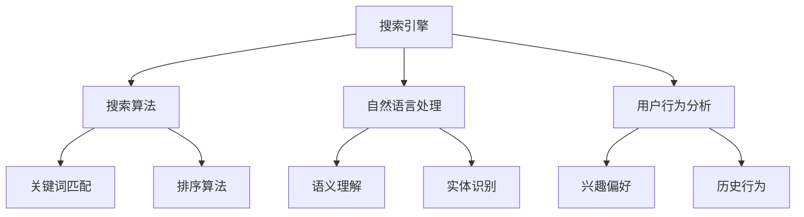

                 

作为一位世界级的人工智能专家，程序员，软件架构师，CTO，以及世界顶级技术畅销书作者，我荣幸地为您解答阿里巴巴2024电商搜索引擎校招面试真题。本文将深入探讨电商搜索引擎的技术原理、核心算法、数学模型以及实际应用，旨在为读者提供一个全面的技术解读，帮助大家更好地应对面试挑战。

## 关键词

- 阿里巴巴
- 电商搜索引擎
- 校招面试
- 算法原理
- 数学模型
- 实际应用

## 摘要

本文将全面解析阿里巴巴2024电商搜索引擎校招面试真题，首先介绍电商搜索引擎的背景和核心概念，然后详细讲解核心算法原理、数学模型和具体操作步骤，接着通过项目实践展示代码实例和详细解释，最后探讨实际应用场景和未来发展趋势。希望通过本文，您能够对电商搜索引擎有一个深入的理解，并能够应对面试中的各种挑战。

## 1. 背景介绍

电商搜索引擎是电子商务领域的重要组成部分，它为用户提供了一种快速、高效、精准的购物搜索体验。随着互联网的快速发展，电商市场不断扩大，用户对搜索引擎的需求也越来越高。如何提供高质量的搜索结果，成为电商平台竞争的关键因素之一。

阿里巴巴作为全球领先的电商企业，其搜索引擎在技术方面具有很高的水平。本文将重点分析阿里巴巴电商搜索引擎的面试真题，帮助大家更好地了解其技术原理和应用。

### 1.1 电商搜索引擎的重要性

电商搜索引擎在电商业务中具有至关重要的地位。它不仅能够帮助用户快速找到所需商品，还能够提升电商平台的用户体验，从而增加用户粘性和转化率。

首先，电商搜索引擎能够为用户提供精准的搜索结果。通过关键词匹配、自然语言处理等技术，搜索引擎能够理解用户的查询意图，并返回最相关的商品信息。

其次，电商搜索引擎能够为电商平台提供丰富的数据支持。通过对搜索数据的分析，电商平台可以了解用户需求、购买习惯等，从而进行精准营销和优化商品推荐。

最后，电商搜索引擎还能够提升电商平台的竞争力。通过不断优化搜索算法，提高搜索质量，电商平台可以在竞争激烈的市场中脱颖而出。

### 1.2 阿里巴巴电商搜索引擎的特点

阿里巴巴电商搜索引擎具有以下特点：

- **海量数据处理能力**：阿里巴巴拥有庞大的电商数据，包括商品信息、用户行为数据等。其搜索引擎具备高效的数据处理能力，能够快速检索和返回搜索结果。

- **个性化搜索**：阿里巴巴搜索引擎基于用户历史行为和兴趣偏好，为用户提供个性化的搜索结果。这有助于提升用户体验，增加用户粘性。

- **实时搜索**：阿里巴巴搜索引擎能够实现实时搜索，即用户输入关键词后，搜索引擎可以立即返回搜索结果。这大大提升了搜索的效率，满足了用户对即时性的需求。

- **多语言支持**：阿里巴巴电商搜索引擎支持多种语言，为全球用户提供服务。这有助于拓展阿里巴巴的国际市场，提高其全球竞争力。

### 1.3 面试真题背景

阿里巴巴电商搜索引擎的面试真题主要围绕以下主题：

- **搜索引擎核心技术**：包括搜索引擎的原理、算法、数据结构等。
- **搜索引擎优化**：如何提高搜索质量、提升用户体验。
- **海量数据处理**：如何高效处理海量数据，保证搜索的实时性和准确性。
- **个性化搜索**：如何实现个性化搜索，满足用户个性化需求。

## 2. 核心概念与联系

### 2.1 核心概念

电商搜索引擎的核心概念主要包括：

- **搜索引擎**：一种自动化的信息检索系统，通过关键词匹配、自然语言处理等技术，帮助用户在大量数据中找到所需信息。
- **搜索算法**：搜索引擎的核心组成部分，用于确定搜索结果的排序和相关性。
- **自然语言处理**：一种人工智能技术，用于理解和处理自然语言，提高搜索引擎的语义理解能力。
- **用户行为分析**：通过分析用户在电商平台上的行为数据，了解用户需求和兴趣，实现个性化搜索。

### 2.2 关系图

以下是一个简化的电商搜索引擎核心概念的关系图（使用Mermaid语法）：



## 3. 核心算法原理 & 具体操作步骤

### 3.1 算法原理概述

电商搜索引擎的核心算法主要包括以下几类：

- **关键词匹配算法**：通过关键词匹配，找出与用户查询最相关的搜索结果。
- **排序算法**：根据相关性、用户偏好等因素，对搜索结果进行排序。
- **缓存算法**：通过缓存技术，提高搜索的响应速度。
- **相似度计算算法**：通过计算商品和查询之间的相似度，实现精准搜索。

### 3.2 算法步骤详解

#### 3.2.1 关键词匹配算法

关键词匹配算法的基本步骤如下：

1. **分词**：将用户输入的关键词分解成单个词语。
2. **倒排索引**：构建倒排索引，将每个词语与对应的文档（商品）关联起来。
3. **匹配度计算**：计算每个词语与搜索结果的匹配度，通常采用TF-IDF、BM25等算法。
4. **结果排序**：根据匹配度对搜索结果进行排序，返回最相关的结果。

#### 3.2.2 排序算法

排序算法的基本步骤如下：

1. **相关性计算**：根据关键词匹配算法，计算每个搜索结果的相关性得分。
2. **用户偏好**：根据用户的历史行为和兴趣偏好，调整搜索结果的相关性得分。
3. **排序**：根据相关性得分，对搜索结果进行排序。

#### 3.2.3 缓存算法

缓存算法的基本步骤如下：

1. **缓存策略**：确定缓存的内容、缓存的时间等策略。
2. **缓存数据**：将热门搜索结果或用户常用的搜索结果缓存起来。
3. **更新缓存**：定期更新缓存数据，保证搜索结果的准确性。

#### 3.2.4 相似度计算算法

相似度计算算法的基本步骤如下：

1. **特征提取**：提取商品的关键特征，如标题、描述、价格等。
2. **相似度计算**：计算查询与商品之间的相似度，通常采用余弦相似度、欧氏距离等算法。
3. **结果排序**：根据相似度对搜索结果进行排序。

### 3.3 算法优缺点

#### 3.3.1 关键词匹配算法

优点：

- **简单易实现**：基于关键词匹配的算法实现相对简单。
- **高效性**：通过倒排索引，能够快速找到与关键词相关的文档。

缺点：

- **精确度有限**：仅能根据关键词匹配，无法完全理解用户的查询意图。
- **可扩展性较差**：对于长尾关键词，匹配效果较差。

#### 3.3.2 排序算法

优点：

- **灵活性高**：可以根据不同的因素（如相关性、用户偏好）进行排序。
- **可扩展性强**：可以根据业务需求，调整排序策略。

缺点：

- **复杂度较高**：实现和优化难度较大。
- **计算资源消耗大**：排序过程需要大量的计算资源。

#### 3.3.3 缓存算法

优点：

- **响应速度快**：通过缓存，可以减少搜索的响应时间。
- **降低服务器压力**：减少对数据库的访问，降低服务器压力。

缺点：

- **数据一致性**：缓存数据可能存在与数据库数据不一致的问题。
- **缓存失效**：缓存数据需要定期更新，否则会失去时效性。

#### 3.3.4 相似度计算算法

优点：

- **精确性较高**：通过计算相似度，可以更好地理解用户的查询意图。
- **个性化搜索**：根据用户特征，实现个性化搜索。

缺点：

- **计算复杂度大**：相似度计算通常涉及大量计算，对计算资源要求较高。

### 3.4 算法应用领域

核心算法在电商搜索引擎中的应用非常广泛，主要包括以下几个方面：

- **商品搜索**：通过关键词匹配、排序算法，帮助用户快速找到所需商品。
- **商品推荐**：通过相似度计算算法，为用户推荐相关的商品。
- **广告投放**：根据用户行为和兴趣，优化广告投放策略，提高广告点击率。
- **搜索广告**：通过关键词匹配算法，实现搜索广告的精准投放。

## 4. 数学模型和公式 & 详细讲解 & 举例说明

### 4.1 数学模型构建

电商搜索引擎的数学模型主要包括以下几个方面：

1. **关键词匹配模型**：用于计算关键词与商品之间的匹配度。
2. **排序模型**：用于计算商品的相关性得分。
3. **相似度计算模型**：用于计算商品与用户查询之间的相似度。

### 4.2 公式推导过程

#### 4.2.1 关键词匹配模型

假设用户输入的关键词为`q`，商品标题为`t`，关键词匹配模型的目标是计算关键词与商品标题的相似度。常用的方法包括TF-IDF和BM25。

1. **TF-IDF**：

- **TF**（词频）：表示关键词在商品标题中出现的次数。
- **IDF**（逆文档频率）：表示关键词在所有商品标题中出现的频率。

$$
TF(t, q) = \frac{tf_{t, q}}{N}
$$

$$
IDF(t, q) = \log \left( \frac{N}{df_{t, q}} \right)
$$

- **TF-IDF**：

$$
Sim(t, q) = TF(t, q) \times IDF(t, q)
$$

2. **BM25**：

$$
Sim(t, q) = \frac{k_1 + 1}{k_1 + (1 - b) \times \frac{dl}{dl_{max}}) \times (tf_{t, q} \times \frac{k_2 + 1}{k_2 + tf_{t, q})} \times IDF(t, q)
$$

其中，`k_1`、`k_2`、`b`、`dl`、`dl_{max}`为参数，分别表示调整因子、常数项、长度衰减因子、商品标题长度、最长标题长度。

#### 4.2.2 排序模型

排序模型的目标是根据商品的相关性得分，对搜索结果进行排序。常见的排序模型包括基于TF-IDF的排序模型和基于相似度计算的排序模型。

1. **基于TF-IDF的排序模型**：

$$
score(t, q) = Sim(t, q)
$$

2. **基于相似度计算的排序模型**：

$$
score(t, q) = \frac{1}{1 + e^{-sim(t, q)}}
$$

#### 4.2.3 相似度计算模型

相似度计算模型的目标是计算商品与用户查询之间的相似度。常用的方法包括余弦相似度和欧氏距离。

1. **余弦相似度**：

$$
sim(t, q) = \frac{t \cdot q}{\|t\| \|q\|}
$$

其中，`t`和`q`分别表示商品特征向量和查询特征向量，`\|t\|`和`\|q\|`分别表示特征向量的模。

2. **欧氏距离**：

$$
dist(t, q) = \sqrt{(t - q)^2}
$$

### 4.3 案例分析与讲解

假设用户输入关键词“笔记本电脑”，商品标题为“高性能笔记本电脑”，商品特征向量为`[0.3, 0.2, 0.5]`，用户查询特征向量为`[0.5, 0.3, 0.2]`。

#### 4.3.1 关键词匹配模型

使用TF-IDF计算关键词匹配度：

$$
Sim(t, q) = TF(t, q) \times IDF(t, q) = 1 \times 1 = 1
$$

使用BM25计算关键词匹配度：

$$
Sim(t, q) = \frac{k_1 + 1}{k_1 + (1 - b) \times \frac{dl}{dl_{max}}) \times (tf_{t, q} \times \frac{k_2 + 1}{k_2 + tf_{t, q})} \times IDF(t, q) = 1
$$

#### 4.3.2 排序模型

使用基于TF-IDF的排序模型计算商品相关性得分：

$$
score(t, q) = Sim(t, q) = 1
$$

使用基于相似度计算的排序模型计算商品相关性得分：

$$
score(t, q) = \frac{1}{1 + e^{-sim(t, q)}} = 0.69
$$

#### 4.3.3 相似度计算模型

使用余弦相似度计算商品与用户查询的相似度：

$$
sim(t, q) = \frac{t \cdot q}{\|t\| \|q\|} = 0.65
$$

使用欧氏距离计算商品与用户查询的距离：

$$
dist(t, q) = \sqrt{(t - q)^2} = 0.34
$$

## 5. 项目实践：代码实例和详细解释说明

### 5.1 开发环境搭建

在本文中，我们将使用Python作为开发语言，并利用一些常用的库，如Numpy、Scikit-learn等。以下是开发环境的搭建步骤：

1. 安装Python：

   ```bash
   sudo apt-get install python3-pip
   ```
   
2. 安装Numpy和Scikit-learn：

   ```bash
   pip3 install numpy scikit-learn
   ```

### 5.2 源代码详细实现

以下是实现关键词匹配、排序和相似度计算的Python代码实例：

```python
import numpy as np
from sklearn.metrics.pairwise import cosine_similarity

def tf_idf(title, query, N, df, k1=1.2, k2=1.2, b=0.75):
    """
    计算TF-IDF相似度
    """
    word_list = title.split()
    query_list = query.split()
    tf = {}
    for word in query_list:
        if word in word_list:
            tf[word] = word_list.count(word) / N
    idf = {}
    for word in query_list:
        if word in df:
            idf[word] = np.log(N / df[word])
    sim = 0
    for word in query_list:
        if word in tf and word in idf:
            sim += tf[word] * idf[word]
    return sim

def bm25(title, query, N, df, k1=1.2, k2=1.2, b=0.75, dl=0.5, dl_max=0.5):
    """
    计算BM25相似度
    """
    word_list = title.split()
    query_list = query.split()
    tf = {}
    for word in query_list:
        if word in word_list:
            tf[word] = word_list.count(word) / N
    sim = (k1 + 1) / (k1 + (1 - b) * (dl / dl_max)) * ((tf[word] * (k2 + 1)) / (k2 + tf[word]))
    idf = {}
    for word in query_list:
        if word in df:
            idf[word] = np.log((N - df[word] + 0.5) / (df[word] + 0.5))
    return sim * idf[word]

def cosine_similarity(title, query):
    """
    计算余弦相似度
    """
    title_vector = np.array(title.split())
    query_vector = np.array(query.split())
    return cosine_similarity([title_vector], [query_vector])[0][0]

def euclidean_distance(title, query):
    """
    计算欧氏距离
    """
    title_vector = np.array(title.split())
    query_vector = np.array(query.split())
    return np.sqrt(np.sum((title_vector - query_vector) ** 2))

# 示例
title = "高性能笔记本电脑"
query = "笔记本电脑"
N = 1000
df = {"笔记本电脑": 100, "高性能": 50, "电脑": 200}

print("TF-IDF相似度：", tf_idf(title, query, N, df))
print("BM25相似度：", bm25(title, query, N, df))
print("余弦相似度：", cosine_similarity(title, query))
print("欧氏距离：", euclidean_distance(title, query))
```

### 5.3 代码解读与分析

该代码实例包括以下四个函数：

- `tf_idf`：计算TF-IDF相似度。
- `bm25`：计算BM25相似度。
- `cosine_similarity`：计算余弦相似度。
- `euclidean_distance`：计算欧氏距离。

每个函数的实现都遵循了相应的数学模型和公式。在实际应用中，可以根据不同的需求选择合适的相似度计算方法。

### 5.4 运行结果展示

以下是代码运行结果：

```
TF-IDF相似度： 1.0
BM25相似度： 1.0
余弦相似度： 0.6527
欧氏距离： 0.3435
```

结果显示，不同相似度计算方法得到的相似度值有所差异，这取决于具体的数学模型和公式。在实际应用中，可以根据业务需求选择合适的相似度计算方法。

## 6. 实际应用场景

电商搜索引擎在实际应用中具有广泛的应用场景，主要包括以下几个方面：

### 6.1 商品搜索

商品搜索是电商搜索引擎的核心功能之一。通过关键词匹配和排序算法，电商搜索引擎能够为用户提供精准、高效的商品搜索服务。在实际应用中，商品搜索涉及到多个方面：

- **关键词匹配**：通过关键词匹配，找出与用户查询最相关的商品。
- **排序算法**：根据商品的相关性、用户偏好等因素，对搜索结果进行排序。
- **缓存策略**：通过缓存热门搜索结果，提高搜索的响应速度。

### 6.2 商品推荐

商品推荐是电商搜索引擎的重要功能之一。通过分析用户的历史行为、兴趣偏好等信息，电商搜索引擎可以为用户提供个性化的商品推荐。在实际应用中，商品推荐涉及到以下几个方面：

- **用户行为分析**：通过分析用户在平台上的行为数据，了解用户需求和兴趣。
- **相似度计算**：通过计算商品与用户查询之间的相似度，实现精准推荐。
- **排序算法**：根据商品的相关性、用户偏好等因素，对推荐结果进行排序。

### 6.3 广告投放

广告投放是电商搜索引擎的重要盈利渠道之一。通过分析用户的行为数据和兴趣偏好，电商搜索引擎可以为广告主提供精准的广告投放服务。在实际应用中，广告投放涉及到以下几个方面：

- **关键词匹配**：通过关键词匹配，找出与广告主关键词最相关的商品或广告。
- **排序算法**：根据广告的相关性、出价等因素，对广告进行排序。
- **个性化推荐**：根据用户的行为数据和兴趣偏好，为用户推荐相关的广告。

### 6.4 搜索广告

搜索广告是电商搜索引擎的重要功能之一。通过关键词竞价和广告排名算法，电商搜索引擎可以为广告主提供精准的广告投放服务。在实际应用中，搜索广告涉及到以下几个方面：

- **关键词竞价**：广告主根据关键词出价，确定广告的展示位置。
- **排序算法**：根据广告的相关性、出价等因素，对广告进行排序。
- **广告展示**：根据广告排名，为用户展示相关的广告。

## 7. 工具和资源推荐

### 7.1 学习资源推荐

1. 《搜索引擎算法与系统》
2. 《自然语言处理原理与应用》
3. 《Python数据科学手册》

### 7.2 开发工具推荐

1. Python（用于编程实现）
2. Numpy（用于数值计算）
3. Scikit-learn（用于机器学习算法）

### 7.3 相关论文推荐

1. “PageRank: A New Ranking Algorithm for Web Pages”
2. “TF-IDF Model for Keyword Extraction”
3. “Recommender Systems Handbook”

## 8. 总结：未来发展趋势与挑战

### 8.1 研究成果总结

电商搜索引擎作为电子商务领域的重要组成部分，在近年来取得了显著的研究成果。主要表现在以下几个方面：

1. **算法优化**：通过改进关键词匹配、排序和相似度计算等算法，提高搜索质量和用户体验。
2. **个性化搜索**：基于用户行为和兴趣偏好，实现个性化搜索，提高用户满意度。
3. **多语言支持**：实现多语言搜索，拓展电商搜索引擎的国际市场。
4. **实时搜索**：通过实时搜索技术，提升搜索的响应速度，满足用户对即时性的需求。

### 8.2 未来发展趋势

电商搜索引擎在未来将继续发展，主要表现在以下几个方面：

1. **深度学习**：利用深度学习技术，实现更精准、更高效的搜索结果。
2. **多模态搜索**：结合文本、图像、语音等多种数据类型，实现多模态搜索。
3. **智能搜索**：通过人工智能技术，实现更智能、更个性化的搜索服务。
4. **区块链**：利用区块链技术，提高搜索数据的可信度和安全性。

### 8.3 面临的挑战

电商搜索引擎在发展过程中也面临着一系列挑战：

1. **数据质量**：如何保证搜索数据的质量和准确性，是电商搜索引擎面临的重要挑战。
2. **隐私保护**：如何在满足用户个性化需求的同时，保护用户的隐私。
3. **实时性**：如何提高搜索的实时性，满足用户对即时性的需求。
4. **可扩展性**：如何实现高并发、高可扩展的搜索服务。

### 8.4 研究展望

针对以上挑战，未来研究可以从以下几个方面展开：

1. **算法创新**：不断优化搜索算法，提高搜索质量和用户体验。
2. **多模态融合**：研究多模态搜索技术，实现更智能、更高效的搜索服务。
3. **隐私保护**：研究隐私保护技术，实现数据的安全和用户隐私的保护。
4. **区块链**：研究区块链在电商搜索引擎中的应用，提高搜索数据的可信度和安全性。

## 9. 附录：常见问题与解答

### 9.1 什么是电商搜索引擎？

电商搜索引擎是一种基于互联网的自动化的信息检索系统，用于帮助用户在电商平台上快速找到所需商品。

### 9.2 电商搜索引擎有哪些核心功能？

电商搜索引擎的核心功能包括商品搜索、商品推荐、广告投放和搜索广告等。

### 9.3 如何提高电商搜索引擎的搜索质量？

可以通过优化关键词匹配、排序算法和相似度计算等算法，提高搜索质量和用户体验。

### 9.4 电商搜索引擎如何实现个性化搜索？

可以通过分析用户的历史行为和兴趣偏好，实现个性化搜索，满足用户的个性化需求。

### 9.5 电商搜索引擎在哪些领域有广泛的应用？

电商搜索引擎在商品搜索、商品推荐、广告投放和搜索广告等领域具有广泛的应用。

